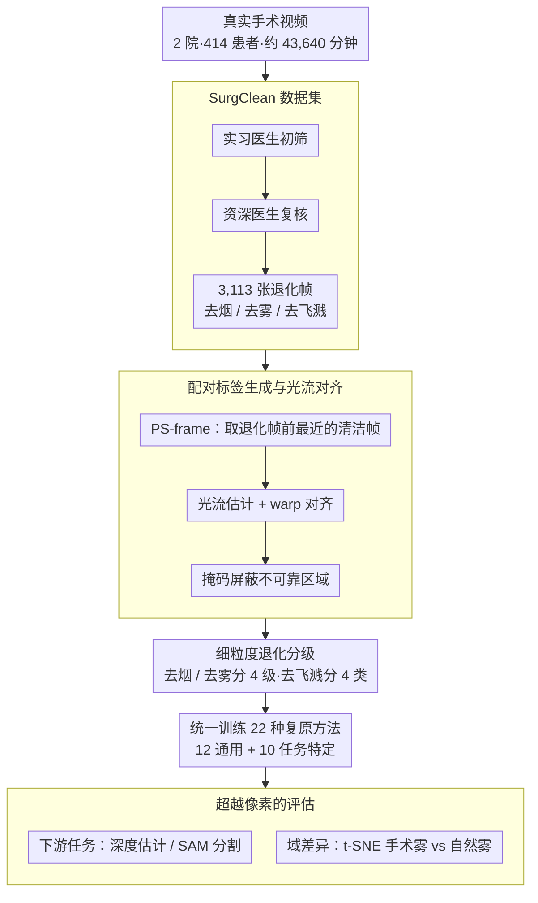

# Benchmarking Endoscopic Surgical Image Restoration and Beyond

**会议**: CVPR 2026  
**arXiv**: [2505.19161](https://arxiv.org/abs/2505.19161)  
**代码**: [https://github.com/PJLallen/Surgical-Image-Restoration](https://github.com/PJLallen/Surgical-Image-Restoration)  
**领域**: 医学图像  
**关键词**: 内窥镜图像复原, 手术场景去烟/去雾/去飞溅, Benchmark数据集, 图像质量评估, 临床应用

## 一句话总结

构建了首个多源真实世界内窥镜手术图像复原数据集 SurgClean（3,113张图像，覆盖去烟/去雾/去飞溅三种退化类型），在其上系统评测了22种代表性图像复原方法（12种通用+10种任务特定），揭示现有方法与临床需求间仍存在显著差距，并进一步分析了手术场景退化与自然场景退化的本质差异。

## 研究背景与动机

微创手术中，清晰的手术视野对于外科医生准确判断解剖结构、避免误操作至关重要。然而，内窥镜手术过程中存在三种常见的视觉退化问题：

**手术烟雾(Smoke)**：电烧灼、超声刀等能量器械在切割和止血时产生大量烟雾，遮挡手术区域

**镜头起雾(Fog)**：体内外温差导致内窥镜镜头表面水汽凝结，产生均匀的雾化效果

**液体飞溅(Splash)**：手术过程中血液、组织液、胆汁等飞溅到镜头上，形成局部遮挡

这些退化严重影响手术安全性和效率，外科医生不得不频繁暂停清洁镜头。

**现有数据集的局限**：
- 多数数据集为**合成数据**（如在清洁图像上叠加高斯烟雾），与真实退化差距大
- 真实数据集大多**只覆盖单一退化类型**（主要是去烟），缺乏去雾和去飞溅
- 缺乏**多源多术式**的真实配对数据

**核心矛盾**：现有图像复原算法在自然场景上表现优异，但直接迁移到手术场景时性能急剧下降。这暗示手术退化与自然退化之间存在本质差异，亟需专用数据集和定制化算法。

## 方法详解

### 整体框架

这是一篇数据集+Benchmark论文，目标不是提出新复原算法，而是回答一个被长期回避的问题：现有图像复原方法究竟能不能用在真实内窥镜手术上。为此作者把工作拆成一条从"建数据"到"超越像素评估"的链路：先从两家医院、414名患者、约43,640分钟的腹腔镜和胸腔镜视频里手工筛出三类真实退化帧，给每帧配上对齐的清洁参考帧，构成首个多源真实配对数据集 SurgClean；再在它上面统一训练、统一指标地跑22种代表性方法（12种通用复原 + 10种任务特定）；最后不止看 PSNR/SSIM，而是把复原结果喂进深度估计和分割等下游任务，并定量刻画手术退化与自然退化的分布差异。

### 关键设计

**1. SurgClean 数据集：用真实手术视频换掉合成退化**

现有手术复原数据要么是在清洁图上叠高斯烟雾的合成数据，要么只覆盖去烟一种退化，与临床场景脱节。SurgClean 直接从真实手术视频里抠退化帧——经过"4名实习外科医生初筛 → 2名资深外科医生复核"的两级标注，得到3,113张分辨率1280×720的退化图像，按去烟2,127张、去雾849张、去飞溅137张分布。数据横跨两个机构、多种术式（Site A 覆盖胆囊、胆管、胰腺、脾脏、肝脏，Site B 覆盖纵隔、食管、肺），既保证了术式多样性，三类退化的样本比例也刻意贴近真实手术中各类干扰的实际发生频率，因此评测出来的结论更能代表临床分布而非人为均衡的玩具设置。

**2. 配对标签生成与光流对齐：在没有真值的现实里凑出一份可训练的参考**

真实手术里根本不存在"同一时刻既退化又清洁"的完美真值，这是手术复原一直缺真实配对数据的根因。SurgClean 用 PS-frame 方案绕过这点：取退化帧之前最近的一张清洁帧当参考。但内窥镜一直在动，参考帧和退化帧并不对齐，于是先用预训练 PWC-Net 估计两帧间的光流，再把参考帧 warp 到退化帧的视角：

$$\mathbf{F}_{UR \to P} = \mathcal{O}(\mathbf{UR}, \mathbf{P}), \quad \mathbf{UR}_{warp} = \mathcal{W}(\mathbf{UR}, \mathbf{F}_{UR \to P})$$

光流在大位移或遮挡处会算错，硬拿来监督会污染训练，所以重建损失里再乘一个掩码 $\mathbf{M}$，把光流不可靠的区域屏蔽掉：$\mathcal{L}_{rec} = \sum_i \lVert \mathbf{M}_i \odot (\mathbf{UR}_{warp,i} - \mathbf{P}_i) \rVert_1$。这套做法本质上是在"标签真实性"和"训练可行性"之间做务实折中——参考帧来自真实手术而非合成，对齐误差则靠掩码兜住，让数据既真实又能直接拿来训模型。

**3. 细粒度退化分级：把"难易"和"种类"写进标注**

只给一个二分类的退化/清洁标签，无法回答"算法在多重的退化下还能扛得住"。SurgClean 因此对每帧再做细分：去烟和去雾按遮挡严重程度分四级，从 Level 1（轻度，遮挡 <1/3 视野）、Level 2（中度，1/3–2/3）、Level 3（重度，>2/3）到 Level 4（几乎完全遮挡、已影响医生判断）；去飞溅则按附着物质分四类——血液 $T_{blood}$、脂肪 $T_{fat}$、胆汁 $T_{bile}$、组织液 $T_{fluid}$。有了这层标注，benchmark 才能拆开看算法在不同难度、不同物质下的表现差异（后面实验正是靠它得出"Level 1-2 可处理、Level 3-4 仍困难"的结论），也为按难度分级训练留了接口。

**4. 超越像素复原的评估：把下游任务和域差异纳入指标**

手术复原的终极目的不是 PSNR 好看，而是让医生和后续算法看清解剖结构，所以本文刻意把评估推到像素指标之外。一是接下游任务：在去雾样本上用深度估计器检验复原图是否保住了3D结构，用 SAM 和 MedSAM 检验复原图的场景解析与器械分割是否更准——结果显示像素指标最高的方法在这些任务上未必最好，揭示了重建与语义保持之间的 trade-off。二是量化域差异：用 t-SNE 把手术雾和自然雾投到特征空间，二者明显分离，且手术雾呈局部突变分布、自然雾呈全局渐变分布。正是这条分析为"自然场景方法迁移到手术上会失效、需要领域特定设计"提供了直接证据。

### 损失函数 / 训练策略

所有22种对比方法统一使用以下设置：
- PyTorch实现，双 NVIDIA RTX 4090
- Adam优化器，随机裁剪128×128 patch，batch size=2
- 总迭代200k次，每100k次学习率减半
- 统一使用光流对齐后的配对标签训练

## 实验关键数据

### 主实验

**通用复原模型在SurgClean上的表现**：

| 方法 | 去烟PSNR↑ | 去烟SSIM↑ | 去雾PSNR↑ | 去雾SSIM↑ | 去飞溅PSNR↑ | 去飞溅SSIM↑ | 参数量 |
|------|----------|----------|----------|----------|------------|------------|--------|
| ConvIR | **19.43** | 0.678 | 18.87 | 0.619 | 21.33 | 0.717 | 14.83M |
| FocalNet | 19.24 | 0.679 | **19.07** | **0.628** | 21.42 | 0.717 | 3.74M |
| Restormer | 18.94 | 0.674 | 19.04 | 0.619 | 21.40 | 0.718 | 26.13M |
| MambaIR | 19.32 | 0.679 | 18.87 | 0.622 | 21.43 | 0.722 | 4.31M |
| X-Restormer | 18.03 | 0.659 | 18.60 | 0.628 | **22.32** | **0.735** | 42.52M |
| AST | 19.18 | 0.635 | 17.05 | 0.606 | 22.05 | 0.731 | 19.92M |
| RAMiT | 19.03 | 0.677 | 19.02 | 0.625 | 21.43 | 0.718 | **0.30M** |

### 消融实验（跨数据集验证 & 下游任务）

| 实验设置 | 关键发现 | 说明 |
|----------|---------|------|
| DesmokeData→DesmokeData | PSNR更高 | DesmokeData退化相对简单 |
| SurgClean→SurgClean | PSNR相对低 | SurgClean退化更复杂 |
| DesmokeData→SurgClean | 性能大幅下降 | 跨域泛化差 |
| SurgClean→DesmokeData | **性能下降较小** | SurgClean训练模型泛化更好 |
| 复原后深度估计 | 去雾PSNR最高≠深度最好 | 像素指标与下游任务不完全对齐 |
| 复原后语义分割 | MambaIRv2 mIoU最高但PSNR一般 | 语义保持与像素重建存在trade-off |

### 关键发现

- **所有方法均远未达到临床标准**：最好的去烟PSNR仅19.43dB，去雾19.07dB，存在明显残留退化
- **任务特定方法优势不明显**：去烟/去雾的专用方法甚至不如通用复原模型，说明手术退化与自然退化的分布差异大
- **低级别退化可处理，高级别退化仍然困难**：Level 1-2有明显改善，Level 3-4改善有限
- **像素指标与下游任务不一致**：复原PSNR最高的方法不一定在深度估计或语义分割上最好
- **SurgClean训练出的模型泛化更好**：得益于更多样化和更复杂的退化分布

## 亮点与洞察

- **第一个多类型真实手术复原数据集**：填补了去雾和去飞溅领域真实手术数据的空白
- **全面的Benchmark设计**：22种方法、3种退化类型、4种严重等级、5种评估指标，为后续研究提供了标准化平台
- **深度分析手术vs自然退化差异**：t-SNE和深度估计结果揭示了两类退化的本质不同，为开发手术特定算法提供了方向
- **从复原到下游的闭环评估**：不仅看像素指标，还评估对深度估计和语义分割的影响，更贴近临床需求

## 局限与展望

- **去飞溅样本量极少**：仅137张，难以支撑深度学习模型的充分训练
- **配对标签非完美对齐**：光流对齐是近似方案，在大位移场景下可能引入伪影
- **未考虑同时存在多种退化的情况**：实际手术中烟雾+飞溅可能同时出现
- **未提出新算法**：作为Benchmark论文主要贡献在数据和评测，缺乏针对性的方法创新
- **评测方法偏通用**：未包含近期的扩散模型类复原方法(如DiffIR、IR-SDE等)

## 相关工作与启发

- 与CycleGAN-DesmokeGAN(1,400张未配对)和Desmoke-LAP(3,000张未配对)相比，SurgClean提供了真实配对标签且覆盖多种退化
- DesmokeData(961张)虽有配对标签但仅覆盖去烟，退化复杂度较低
- 自然场景图像复原(RESIDE去雾数据集等)的方法直接迁移效果差，强调了领域特定设计的必要性
- 轻量模型RAMiT(0.3M参数)在性能可接受的前提下有边缘部署优势，值得手术场景进一步探索

## 评分
- 新颖性: ⭐⭐⭐⭐ 首个覆盖三种退化的真实手术复原数据集，填补重要空白
- 实验充分度: ⭐⭐⭐⭐⭐ 22种方法、多维度评估、跨数据集验证、下游任务分析，极为全面
- 写作质量: ⭐⭐⭐⭐ 结构清晰，数据分析透彻，图表丰富
- 价值: ⭐⭐⭐⭐ 为手术图像复原社区提供了标准化平台和重要基线

<!-- RELATED:START -->

## 相关论文

- [\[CVPR 2026\] LEMON: A Large Endoscopic MONocular Dataset and Foundation Model for Perception in Surgical Settings](lemon_a_large_endoscopic_monocular_dataset_and_foundation_model_for_perception_in.md)
- [\[CVPR 2026\] Event-Level Detection of Surgical Instrument Handovers in Videos](event_level_detection_of_surgical_instrument_handovers_in_videos.md)
- [\[CVPR 2026\] Focus-to-Perceive Representation Learning: A Cognition-Inspired Hierarchical Framework for Endoscopic Video Analysis](focus-to-perceive_representation_learning_a_cognition-inspired_hierarchical_fram.md)
- [\[CVPR 2026\] Synergistic Bleeding Region and Point Detection in Laparoscopic Surgical Videos](synergistic_bleeding_region_and_point_detection_in_laparoscopic_surgical_videos.md)
- [\[CVPR 2026\] Unlocking Positive Transfer in Incrementally Learning Surgical Instruments: A Self-reflection Hierarchical Prompt Framework](unlocking_positive_transfer_in_incrementally_learning_surgical_instruments_a_sel.md)

<!-- RELATED:END -->
