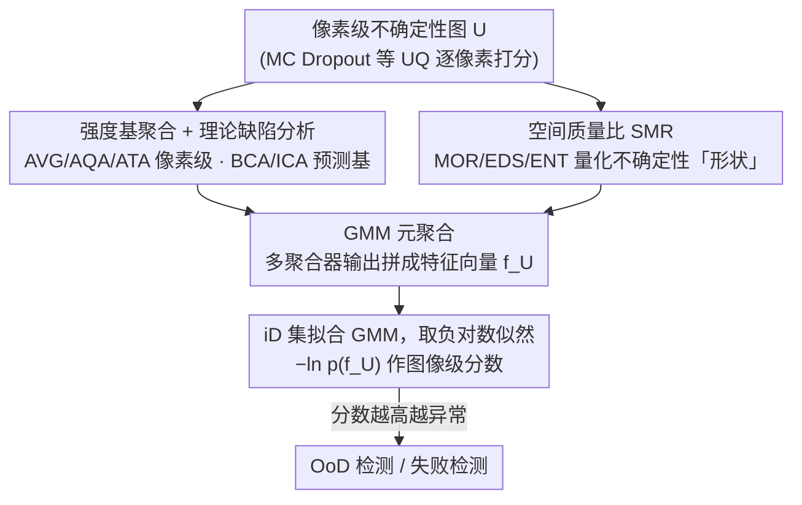

# Better than Average: Spatially-Aware Aggregation of Segmentation Uncertainty Improves Downstream Performance

**会议**: CVPR 2026  
**arXiv**: [2603.29941](https://arxiv.org/abs/2603.29941)  
**代码**: [https://github.com/Kainmueller-Lab/aggrigator](https://github.com/Kainmueller-Lab/aggrigator)  
**领域**: 医学影像  
**关键词**: 不确定性量化, 空间聚合策略, OoD检测, 失败检测, 元聚合

## 一句话总结
首次系统研究分割任务中像素级不确定性到图像级评分的聚合策略，提出融合空间结构信息（Moran's I、边缘密度、Shannon熵）的SMR聚合器和基于GMM的元聚合器，在10个数据集上证明全局平均(AVG)是次优选择，GMM-All元聚合在OoD和失败检测上表现稳健。

## 研究背景与动机

1. **领域现状**：在医学影像和自动驾驶等安全关键应用中，分割模型需要输出置信度。UQ方法能为每个像素生成不确定性分数，但实际需将像素级不确定性聚合为单一图像级标量用于OoD检测和失败检测。
2. **现有痛点**：(1) 全局平均(AVG)是默认选择，但忽略空间结构信息；(2) 各种替代策略（patch级、类别级、阈值级）缺乏系统比较；(3) 现有策略存在理论缺陷——AQA缺乏比例不变性，ATA非单调。
3. **核心矛盾**：分割中的OoD性或错误敏感性通常反映在局部不确定性模式中（如未见类别区域、模糊边界），但简单的像素平均会掩盖这些关键的局部变化。
4. **切入角度**：观察到不确定性的空间分布模式（如集中在聚类区域vs.沿边界分布）包含重要的诊断信息，需要空间感知的聚合方法来捕捉。
5. **核心idea**：提出空间质量比(SMR)——度量高空间结构区域中不确定性质量的占比，并通过GMM元聚合器融合多种聚合策略的输出。

## 方法详解

### 整体框架
这篇论文要解决的问题很具体：UQ 方法能给分割结果的**每个像素**打一个不确定性分数，但下游的 OoD 检测和失败检测只接受**一张图一个标量**——于是必须有一个聚合函数 $f$ 把整张不确定性图 $U \in [0,1]^{m \times n}$ 压成单值 $f(U) \in \mathbb{R}$。大家默认用全局平均（AVG），但作者发现这是个被忽视的关键选择。整篇工作就是把聚合器拆成两大族系统比较：一类是**强度基**的（直接看像素值大小，含像素级的 AVG/AQA/ATA 和预测基的类别平均 BCA/ICA），另一类是作者新提的**空间感知**族（看不确定性在图上的"形状"），最后再用一个 GMM 元聚合器把两族的输出统一成一个稳健分数。

### 关键设计

**1. 拆穿常用聚合策略的理论缺陷：先证明 AVG 为什么不该当默认**

聚合器在论文里几乎从没被认真对比过，AVG 之所以流行只是因为它最简单。作者把主流策略逐个放到放大镜下，指出它们各自违反了某条本该成立的性质。AVG（全局平均）对空间结构完全无感——把同一组像素值在图上随便重排，聚类成块还是撒成噪声，算出来的分数一模一样，而恰恰是这种空间排布才携带异常信号。AQA（分位数以上取平均）缺乏比例不变性：裁掉一片背景像素本不该改变"这张图有多不确定"的判断，但它的分数会跟着背景占比漂移。ATA（阈值以上取平均）则是非单调的——全局抬高每个像素的不确定性，结果分数反而可能下降，这违反直觉。相比之下，预测基的 BCA/ICA（按预测类别取平均）借用了分割掩码信息，天然满足比例不变性，因此后面实验里它们才能稳居第一梯队。这一节不是凑数的背景，而是为"AVG 是次优选择"这个反直觉结论先立住理论依据。

**2. 空间质量比 SMR：把不确定性的"形状"量化进分数**

前面指出 AVG 的病根是只看强度、不看空间排布，SMR 就是针对这一点设计的。核心直觉是：分割里的 OoD 性或错误往往体现在**局部不确定性模式**上（未见类别会让不确定性聚成一团、模糊边界会让它沿边缘分布），而简单平均会把这些局部信号抹平。SMR 的做法是先用一个空间度量找出图中"高结构区域"，再算这些区域的平均不确定性相对于全局平均不确定性的占比——也就是把不确定性按空间质量加权后取比值，比值越高说明不确定性越集中在有结构的地方，越可能是真异常而非弥散噪声。作者用三种空间度量给出三个实现：SMR_Moran (MOR) 用 Moran's I 度量空间自相关（0 表示噪声式分布、1 表示完全聚类），SMR_EDS (EDS) 用边缘密度得分（0 表示平坦区、1 表示不确定性集中在边缘），SMR_Entropy (ENT) 用 Shannon 熵刻画局部异质性（0 表示常数区、1 表示高变异）。三者各自对应一类异常：聚类型对应新物体、边缘型对应边界模糊、高变异型对应分类不稳定，因此哪种 SMR 好用本身就反映了数据集的异常长什么样。

**3. GMM 元聚合器：用概率密度把多个聚合器的优点统一起来**

SMR 解决了"看形状"，但实验里没有任何单一聚合器在所有数据集上都最好——MOR 在某些病理图上强、EDS 在城市场景强，谁也压不过谁。GMM 元聚合就是为消除这种"换个数据集就要重新挑聚合器"的脆弱性而来。它把一张不确定性图表示成一个多维特征向量 $f_U = (f_1(U), \dots, f_d(U))$，每一维是一个聚合器的输出，然后只在 in-distribution 样本上用高斯混合模型拟合这些特征向量的联合分布 $p_{\text{GMM}}(f_U)$，最终的异常分数取负对数似然：

$$
f_{\text{meta}}(U) = -\ln p_{\text{GMM}}(f_U)
$$

直觉是 iD 图在特征空间里聚成几个高斯团，越偏离这些团（似然越低）就越异常。按喂进去的特征不同分三个变体：GMM-Spa（只用空间特征）、GMM-Int（只用强度特征）、GMM-All（全部）。GMM-All 之所以最稳，是因为概率建模会自动让不同维度按数据集特性发挥作用——某个数据集靠强度区分，另一个靠空间形状区分，它都能从 iD 分布里学到，而不需要人工选聚合器。代价也很低：GMM 只在 iD 集上一次性拟合，推理时不增加分割本身的复杂度。

## 实验关键数据

> 实验覆盖 10 个数据集（合成组织病理 ARC、Lizard 病理、LIDC 肺结节 CT、C. Elegans 微生物、GTA/Cityscapes 城市场景、WeedsGalore 作物），跨 U-Net / HRNet / DeepLabv3+ 多种分割架构，用 MC Dropout 获取像素级不确定性。

### 主实验（OoD检测 AUROC）

| 聚合策略 | LIDC-Mal | CAR-CS | WORM-Pro | LIZ-IG | 平均排名 |
|----------|----------|--------|----------|--------|----------|
| AVG | 次优(部分) | 接近随机 | 差 | 竞争力 | 低 |
| AQA | 差 | 差 | 差 | 中等 | 低 |
| BCA | 好 | 好 | 好 | 好 | **第一梯队** |
| ICA | 好 | 好 | 好 | 好 | **第一梯队** |
| **GMM-All** | 好 | **最优** | **最优** | 中等 | **第一梯队** |

统计显著性检验(Wilcoxon p<0.05)：BCA、ICA和GMM-All形成统计显著的第一梯队。

### 失败检测实验（E-AURC，越低越好）

| 聚合策略 | 统计排名 |
|----------|----------|
| QFR | **统计显著最优** (p<0.001) |
| BCA | 第二梯队 |
| GMM-All | 第二梯队，与QFR接近 |
| AVG | 最差（除合成数据外） |

### 关键发现
- **AVG在6/10场景中表现差**，接近随机猜测，不应作为默认选择
- GMM-All在OoD检测中稳健性最强（跨数据集表现一致），在FD中接近最优QFR
- SHAP分析表明：EDS在CAR数据集上主导OoD分离能力，但在LIZ-IG上所有特征都未能提供清晰分离
- 不同UQ方法（MCD、Deep Ensembles、MSP、TTA）下趋势一致，验证了聚合策略分析的通用性

## 亮点与洞察
- **系统化的benchmark价值**：首次对分割聚合策略进行全面、跨数据集、跨任务（OoD+FD）的系统性比较，推翻了"AVG够用"的默认假设
- **空间质量比(SMR)的直觉**：不确定性的"形状"（聚类/边缘/噪声）和"大小"（平均值）同等重要，这对UQ领域有深远影响
- **GMM元聚合的参数高效性**：无需增加推理复杂性，只需在iD集上拟合GMM（一次性），即可统一多个聚合器的优点

## 局限与展望
- GMM假设iD特征服从GMM，在特征高维或多峰分布时可能失效（如LIZ-IG的失败案例）
- 需要iD集来拟合GMM，对冷启动场景有依赖
- 当前仅2D分割，扩展到3D医学分割（体积占据）或视频分割（时空不确定性）值得探索
- 可研究在线GMM更新支持持续学习场景

## 相关工作与启发
- **vs 传统MSP方法**：MSP在分类级别操作，本文在像素级聚合后做图像级决策，更贴近分割的细粒度特性
- **vs 异常分割方法**：异常分割直接产出像素级异常图，本文聚焦于"如何将像素级信号汇聚为可行动的图像级判断"
- **应用启发**：GMM元聚合的概念可迁移到任何需要聚合多源信号的场景（如多模态融合、专家混合系统的置信度估计）

## 评分
- 新颖性: ⭐⭐⭐⭐ 空间聚合+元聚合的思路新颖，但各组件基于成熟的空间统计方法
- 实验充分度: ⭐⭐⭐⭐⭐ 10个多样数据集、两个下游任务、多UQ方法、SHAP分析、统计检验
- 写作质量: ⭐⭐⭐⭐ 问题形式化清晰，理论分析充分
- 价值: ⭐⭐⭐⭐⭐ 为安全关键应用提供了实用的聚合选择指南，开源工具

<!-- RELATED:START -->

## 相关论文

- [\[CVPR 2026\] MedLoc-R1: Performance-Aware Curriculum Reward Scheduling for GRPO-Based Medical Visual Grounding](medloc-r1_performance-aware_curriculum_reward_scheduling_for_grpo-based_medical_.md)
- [\[CVPR 2026\] Delving Aleatoric Uncertainty in Medical Image Segmentation via Vision Foundation Models](delving_aleatoric_uncertainty_in_medical_image_segmentation_via_vision_foundatio.md)
- [\[CVPR 2026\] SAR2Net: Learning Spatially Anchored Representations for Retrieval-Guided Cross-Stain Alignment](sar2net_learning_spatially_anchored_representations_for_retrieval-guided_cross-s.md)
- [\[CVPR 2026\] Few-Shot Synthetic Data Generation with Diffusion Models for Downstream Vision Tasks](few-shot_synthetic_data_generation_with_diffusion_models_for_downstream_vision_t.md)
- [\[CVPR 2025\] Uncertainty-Aware Concept and Motion Segmentation for Semi-Supervised Angiography Videos](../../CVPR2025/medical_imaging/uncertainty-aware_concept_and_motion_segmentation_for_semi-supervised_angiograph.md)

<!-- RELATED:END -->
