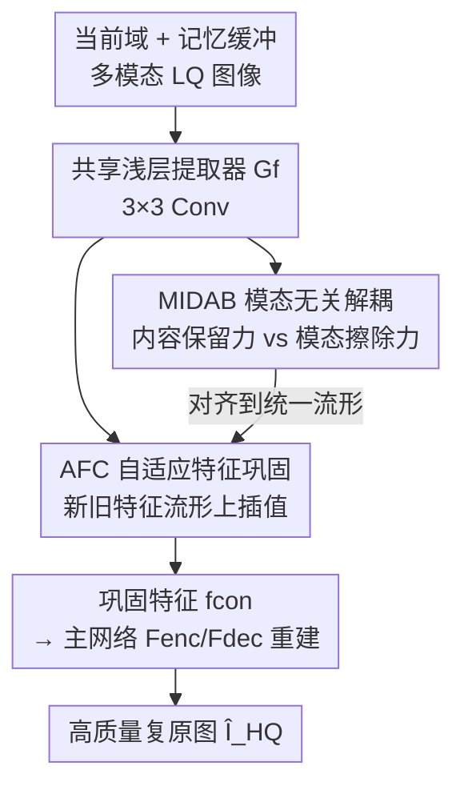

# Beyond the Static-World: Lifelong Learning for All-in-One Medical Image Restoration

**会议**: CVPR 2026  
**论文**: [CVF Open Access](https://openaccess.thecvf.com/content/CVPR2026/html/Shan_Beyond_the_Static-World_Lifelong_Learning_for_All-in-One_Medical_Image_Restoration_CVPR_2026_paper.html)  
**代码**: 无  
**领域**: 医学图像  
**关键词**: 全能医学图像复原, 终身学习, 灾难性遗忘, 模态解耦, 对抗平衡

## 一句话总结
针对全能医学图像复原（MRI 超分 / CT 去噪 / PET 合成共享一个模型）在真实临床数据流里同时遭遇的"模态冲突"和"灾难性遗忘"，本文提出 ROME 框架，先用对抗平衡把不同模态映射到统一的模态无关流形（MIDAB），再在这个流形上做自适应特征级插值来巩固旧知识（AFC），把序列训练后的平均退化压低 10% 以上。

## 研究背景与动机
**领域现状**：全能医学图像复原（All-in-one MedIR）想用单个模型同时处理 MRI 超分、CT 去噪、PET 合成，迈向通用医学影像智能。代表工作 AMIR 用任务自适应路由缓解多模态冲突，DiffCode 用扩散增强的向量量化码本补偿不同任务的信息损失。

**现有痛点**：这些方法都建立在一个"静态世界假设"上——假定所有机构的数据一次性汇集、可同时训练。但真实临床完全相反：数据是**持续流式到来**的，新机构带来分布迁移（domain shift），更糟的是新合作方可能**整类模态缺失**（如某机构根本没有 CT 数据）。强迫模型在全部历史数据上从头重训既不现实也不可行，因此通用模型必须具备终身学习能力。

**核心矛盾**：终身学习引入灾难性遗忘——适配新域时，为旧域优化的权重被覆盖。而本文的关键洞察是：遗忘（时间维度）和模态冲突（空间维度）**不是两个独立问题**。不同模态（MRI vs CT）的分布与退化模式差异巨大，共享参数时会产生**梯度方向相反**的更新；如果模型连静态设置下都摆不平这种梯度冲突，那么一旦被迫顺序学习，冲突就会升级成彻底的"权重覆盖"。换句话说，模态冲突会严重放大遗忘。

**本文目标 / 切入角度**：必须先在每个域内部解决模态冲突、构建一个**模态无关的统一流形**，再在这个稳定流形上做知识巩固——空间问题是时间问题的前提。

**核心 idea**：由此提出"解耦—优化—巩固"（disentangle-optimize-consolidate）范式的 ROME 框架：用对抗平衡逼出模态无关表示，再在该表示上做自适应特征级巩固来对抗遗忘。

## 方法详解

### 整体框架
ROME（Resilient On-the-fly Medical Enhancement）面对一个更现实的域流范式：模型 $F$（参数 $\theta$）顺序经历域序列 $D=\{D_1,...,D_N\}$，每个域 $D_i$ 是一个二元组 $(D_i, M_i)$——$D_i$ 是数据分布（干净 / 含噪），$M_i\subseteq\{\text{MRI, CT, PET}\}$ 是该域可用的模态子集。分布和模态集都可能在域之间变化（分别模拟 domain shift 与 modality missing）。在时刻 $i$，模型只能访问当前域 $D_i$ 的数据，加上一个存了少量旧样本的记忆缓冲 $M$；目标是把参数从 $\theta_{i-1}$ 更新到 $\theta_i$，既学好新域又不在旧域上明显退化。

整体流程是：当前域数据和记忆缓冲样本先一起过一个共享浅层提取器 $G_f$（3×3 卷积）抽特征，然后兵分两路——上路 MIDAB 模块对特征施加对抗损失 $L_{adv}$，把所有模态对齐到统一流形；下路 AFC 模块把新旧域特征做自适应插值，产出巩固后的特征 $f_{con}$；$f_{con}$ 再喂给主网络编码器 $F_{enc}$ 和解码器 $F_{dec}$ 做重建。整套以 $L_1 + \alpha L_{adv} + \beta L_{div}$ 端到端优化。

### 关键设计

**1. MIDAB：用对抗平衡逼出模态无关流形**

模态冲突的根源是：共享浅层网络抽出的特征是**纠缠**的，同时编码了两类信息——模态无关内容 $f_{content}$（解剖结构、组织边界、病灶细节，是高保真重建必须保留的）和模态特定风格 $f_{mod}$（CT 的条带伪影、MRI 的 K 空间噪声模式，对重建有害且因模态而异）。$f_{mod}$ 正是冲突之源：不同模态的 $f_{mod}$ 被强行过共享参数时产生方向相反的梯度。单靠 $L_1$ 重建损失解不了这个问题——它只激励保留 $f_{content}$，缺乏显式惩罚 $f_{mod}$ 的机制。

MIDAB 把"解耦"变成一场对抗博弈，用两股相互制衡的力来逼出分离。**内容保留力**就是主重建损失：$f_{content}$ 经主编解码器生成残差图 $I_R = F_{dec}(F_{enc}(f_{content}))$，再全局残差连接得 $\hat I_{HQ}=I_R+I_{LQ}$，监督为 $L_1=\|\hat I_{HQ}-I_{HQ}\|_1$，强迫 $G_f$ 保住内容。**模态擦除力**则引入一个模态判别器 $D_{mod}$，训它从 $G_f(I_{LQ})$ 预测模态标签：$L_{ce}^{mod}=\mathrm{CE}(D_{mod}(G_f(I_{LQ})), y_{mod})$；而 $G_f$ 通过一个梯度反转层（GRL）反向最大化判别器的不确定性，对齐损失 $L_{adv}=-L_{ce}^{mod}$ 就是擦除力。两股力让 $G_f$ 处于梯度均衡：它不能靠输出平凡解作弊（丢内容会被 $L_1$ 重罚），唯一的纳什均衡是保留全部内容、同时尽量抹掉模态风格，把所有模态压到一个紧致、统一、富含内容的流形上。这个统一流形也正是处理"模态缺失"的关键前提——共享表示使得未来某域缺一类模态时不至于把整个特征空间带崩。

**2. AFC：在统一流形上做自适应特征级巩固**

有了 MIDAB 的稳定流形，再对付遗忘。传统经验回放（ER）在**像素级**硬混旧样本，既低效又对表面变化敏感。AFC 改在**特征级**操作：新域特征 $f_{new}$ 和旧域特征 $f_{old}$ 都由 $G_f$ 抽取、并已被 MIDAB 解耦映射到同一个内容流形上，于是 AFC 的目标不是混像素，而是在这条共享流形上找一个**最优巩固点** $f_{con}$，根据新旧数据差异自适应融合双方知识、同时保住两域的梯度信息。

具体地，AFC 给每张特征图建全局描述符：对空间维同时做平均池化和最大池化再拼接，捕捉统计信息与显著信息——$p_{old}=\mathrm{Concat}(\mathrm{AvgPool}(f_{old}),\mathrm{MaxPool}(f_{old}))$，$p_{new}$ 同理。两个池化向量拼起来送进一个小预测网络 $H_{pred}$（FC + MLP）再 Softmax，动态产出归一化插值权重 $\lambda=\mathrm{Softmax}(H_{pred}(\mathrm{Concat}(p_{old},p_{new})))$，满足 $\lambda_{old}+\lambda_{new}=1$。巩固特征即加权和：

$$f_{con}=\lambda_{old}\cdot f_{old}+\lambda_{new}\cdot f_{new}.$$

相比刚性像素混合，这种自适应特征插值能更平滑地融合域知识、更有效保留旧知识。

**3. 多样性损失：防止插值权重坍缩成平凡解**

AFC 还有一个隐患：$H_{pred}$ 可能学到低熵的平凡解，比如对所有样本都吐 $\lambda=[0.5, 0.5]$，那就退化成简单平均、失去自适应意义。为此引入多样性损失 $L_{div}$，鼓励一个 mini-batch 内预测权重向量的分布尽量分散——通过最大化方差实现，定义为权重到批均值 $\bar\lambda$ 的负均方 $L_2$ 距离：

$$L_{div}=-\frac{1}{B}\sum_{b=1}^{B}\|\lambda_b-\bar\lambda\|_2^2,$$

其中 $B$ 是 batch 大小，$\bar\lambda=\frac{1}{B}\sum_b\lambda_b$。最小化 $L_{div}$ 即最大化权重方差，逼 $H_{pred}$ 给出样本特定、非平凡的插值策略，从而探索更有效的知识保留路径。消融里这一项贡献最大（+1.15 dB），说明"逼网络学出有区分度的融合策略"才是 AFC 真正发力的地方。

### 损失函数 / 训练策略
端到端优化复合损失 $L_{total}=L_1+\alpha L_{adv}+\beta L_{div}$，其中 $\alpha=0.01$（MIDAB 对抗损失权重）、$\beta=0.15$（AFC 多样性损失权重）。训练从 $D_1$ 到 $D_5$ 顺序进行，每个域训练 30,000 次迭代；每步采样 8 个新域样本 + 4 个回放样本，记忆缓冲对每个旧域各保留 200 个样本。Adam 优化器（$\beta_1=0.9,\beta_2=0.999$），初始学习率 $1\times10^{-4}$，按余弦退火在总计 150,000 次迭代内衰减到 $1\times10^{-6}$，PyTorch + NVIDIA A6000。

## 实验关键数据

### 主实验
数据集沿用 AMIR 的设置，覆盖 MRI 超分、CT 去噪、PET 合成三类任务。终身设置下作者设计了一个 5 域混合增量序列：$D_1$=PET/CT/MRI；$D_2$ 加入轻高斯噪声（$\sigma=0.15$）；$D_3$ 缺 MRI；$D_4$ 缺 CT；$D_5$ 缺 PET——同时模拟分布迁移与模态缺失。训完 $D_5$ 后在全部五个域的完整测试集上评测，报告平均 PSNR / SSIM / RMSE。

**静态全能设置（理论上界，所有数据同时可用，平均指标）：**

| 方法 | PSNR ↑ | SSIM ↑ | RMSE ↓ |
|------|--------|--------|--------|
| AirNet | 34.06 | 0.9314 | 13.24 |
| AMIR | 34.28 | 0.9351 | 12.55 |
| DiffCode | 34.62 | 0.9336 | 12.37 |
| **ROME (ours)** | **34.94** | **0.9439** | **11.40** |

**终身全能设置（顺序训完 $D_1\to D_5$，所有 baseline 都配相同 ER 机制，平均指标）：**

| 方法 | PSNR ↑ | SSIM ↑ | RMSE ↓ |
|------|--------|--------|--------|
| Restormer | 30.39 | 0.8732 | 17.73 |
| AirNet | 30.74 | 0.8763 | 16.83 |
| AMIR | 31.41 | 0.8822 | 16.24 |
| **ROME (ours)** | **32.36** | **0.8955** | **15.67** |

关键看**抗遗忘韧性**：从静态上界到终身结果的退化，ROME 只掉 2.58 dB（34.94→32.36），而次优的 AMIR 掉 2.87 dB（34.28→31.41）、标准 Transformer 的 Restormer 暴跌 3.77 dB。ROME 是退化最小的，平均灾难性退化降低 10% 以上。

### 消融实验
累积消融（平均 PSNR，跨三个模态任务）：

| 配置 | PSNR ↑ | 说明 |
|------|--------|------|
| baseline（静态） | 34.38 | 起点 |
| + MIDAB（静态） | 34.61 | 静态下 +0.23，证实模态冲突即便数据全也害性能 |
| lifelong 朴素微调 | 30.51 | 顺序微调，灾难性遗忘塌到 30.51 |
| + MIDAB | 30.69 | 只解模态冲突仅 +0.18，不足以止住遗忘 |
| + ER | 30.77 | 加标准经验回放 +0.08，确认 ER 必要 |
| + AFC | 31.21 | 特征级插值替代像素混合，+0.44 |
| + $L_{div}$（完整 ROME） | 32.36 | 加多样性损失再 +1.15，跳幅最大 |

### 关键发现
- **$L_{div}$ 贡献最大**：从 AFC（31.21）到加上多样性损失（32.36）单步涨 1.15 dB，远超 MIDAB（+0.18）和标准 ER（+0.08）的单项收益。说明 AFC 的威力不在"会插值"，而在被 $L_{div}$ 逼着学出有区分度、非平凡的融合策略。
- **协同 > 单项**：从（MIDAB+ER）基线到完整"解耦-优化-巩固"策略累计提升 +1.59 dB，验证各组件必须协同——单独看每项收益都不大，组合优化才解锁实质增益。
- **梯度冲突量化**：用余弦相似度量不同模态在 $G_f$ 上的梯度方向。baseline 里 CT↔PET 冲突最严重（-0.27 / -0.35），意味着优化 CT 会显著伤 PET；ROME 把 PET-CT 平均冲突从 -0.31 缓到 -0.265，所有模态对的干扰被普遍缓解，直接证明 MIDAB 确实压住了模态干扰。

## 亮点与洞察
- **"空间问题是时间问题的前提"这个 framing 很巧**：把模态冲突（空间）和灾难性遗忘（时间）打通——先造模态无关流形，再在流形上做知识巩固。消融里"只加 MIDAB 仅 +0.18"恰好反证了顺序的重要性：流形是巩固的地基，不是可有可无的并列模块。
- **对抗平衡的纳什均衡论证干净**：内容保留力（$L_1$）和模态擦除力（GRL+判别器）互相制衡，使 $G_f$ 无法靠平凡解作弊，唯一均衡就是"留内容、抹风格"。这套"双力博弈逼出解耦表示"的思路可迁移到任何需要剥离 domain-specific 风格的多源任务。
- **特征级巩固 + 多样性正则**是可复用 trick：把经验回放从像素级搬到统一流形上的特征级插值，再用一个 batch 内方差正则防权重坍缩——这套组合对其他持续学习场景（不限医学）都有借鉴价值。

## 局限性 / 可改进方向
- 记忆缓冲仍需对每个旧域各存 200 样本，属 rehearsal-based 路线，在隐私敏感的医疗场景下存原始样本本身可能受限，作者未讨论无样本（exemplar-free）替代方案。
- 评测只在 3 模态 / 5 域的合成增量序列上，域顺序、缓冲大小、模态缺失模式都是人为设计；真实临床更长、更乱的流上泛化性仍待验证。⚠️ 序列定义与超参（$\alpha=0.01,\beta=0.15$）对结果的敏感性论文未充分展开。
- AFC 的插值在新旧两域之间二元加权，面对**多个**异质旧域共存时是否还能找到单一最优巩固点、会不会偏向最近域，值得进一步分析。

## 相关工作与启发
- **vs AMIR**：AMIR 用任务自适应路由动态分配网络路径来缓解模态梯度冲突，但仍是静态世界假设、且路由不解决遗忘。ROME 复用 AMIR 的主干，但改走"解耦统一流形"路线并显式针对终身学习，静态 +0.66 dB、终身退化更小。
- **vs DiffCode**：DiffCode 用扩散增强的向量量化码本补偿任务信息损失，静态设置是最强 baseline（34.62），但同样不处理流式数据。ROME 在静态超过它（34.94）且天然支持增量。
- **vs 正则化 / 架构类持续学习**：正则化方法（如 EWC）易受 transitive forgetting / 约束漂移困扰，对早期任务的约束随学习逐渐变弱；架构类方法靠扩容避免漂移但模型不断变大。ROME 属 rehearsal-based，参数量固定，靠重访旧数据比纯正则更直接地对抗漂移。

## 评分
- 新颖性: ⭐⭐⭐⭐⭐ 把模态冲突与灾难性遗忘统一进"解耦-优化-巩固"范式，首次在全能 MedIR 上做终身学习。
- 实验充分度: ⭐⭐⭐⭐ 静态+终身双设置、累积消融、梯度冲突量化都到位，但只在单一合成增量序列上验证。
- 写作质量: ⭐⭐⭐⭐ 动机推导（空间→时间）清晰，公式完整；个别表述略繁。
- 价值: ⭐⭐⭐⭐⭐ 直击真实临床数据流式 + 模态缺失痛点，框架模块可迁移到其他持续学习场景。

<!-- RELATED:START -->

## 相关论文

- [\[CVPR 2026\] Benchmarking Endoscopic Surgical Image Restoration and Beyond](benchmarking_endoscopic_surgical_image_restoration_and_beyond.md)
- [\[CVPR 2026\] Are General-Purpose Vision Models All We Need for 2D Medical Image Segmentation? A Cross-Dataset Empirical Study](are_general-purpose_vision_models_all_we_need_for_2d_medical_image_segmentation_.md)
- [\[CVPR 2026\] InvCoSS: Inversion-driven Continual Self-supervised Learning in Medical Multi-modal Image Pre-training](invcoss_inversion-driven_continual_self-supervised_learning_in_medical_multi-mod.md)
- [\[CVPR 2026\] Forging a Dynamic Memory: Retrieval-Guided Continual Learning for Generalist Medical Foundation Models](forging_a_dynamic_memory_retrieval-guided_continual_learning_for_generalist_medi.md)
- [\[CVPR 2026\] Multimodal Causality-Driven Representation Learning for Generalizable Medical Image Segmentation](multimodal_causal-driven_representation_learning_for_generalizable_medical_image.md)

<!-- RELATED:END -->
