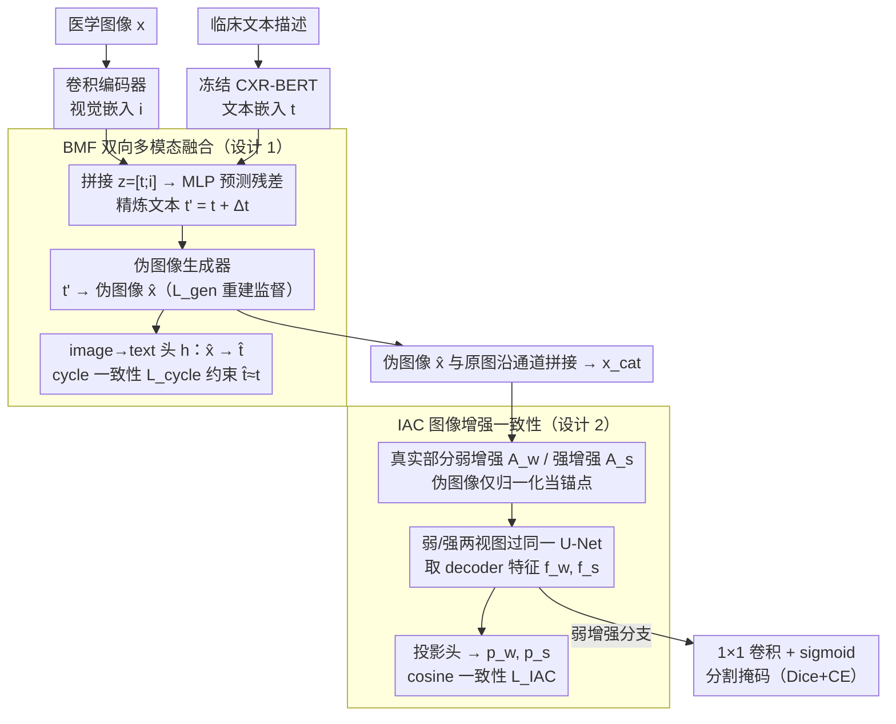

# BiCLIP: Bidirectional and Consistent Language-Image Processing for Robust Medical Image Segmentation

**会议**: CVPR 2026  
**arXiv**: [2603.00156](https://arxiv.org/abs/2603.00156)  
**代码**: 无  
**领域**: 医学图像  
**关键词**: 医学图像分割, 视觉-语言模型, 双向多模态融合, 数据增强一致性, 低标注鲁棒性

## 一句话总结

提出 BiCLIP 框架，通过双向多模态融合（BMF）实现视觉信息反向精炼文本表示，并通过图像增强一致性（IAC）约束中间特征的扰动不变性，在 COVID-19 CT 分割上超越 SOTA，仅 1% 标注数据仍保持鲁棒。

## 研究背景与动机

### 1. 领域现状
医学图像分割是计算机辅助诊断和治疗规划的基石。U-Net 等纯视觉方法虽然成功，但高度依赖图像质量和采集条件。近年来，视觉-语言方法（LViT、Cap2Seg、RecLMIS、LGA 等）通过文本描述提供补充语义上下文，逐渐成为新趋势。

### 2. 痛点
现有视觉-语言分割方法几乎都采用**单向融合**：文本嵌入条件化视觉表示，但视觉信息无法反向修正文本语义。这种单向设计在两个场景下暴露弱点：(1) **标注稀缺**时，静态文本条件化不足以弥补监督信号不足；(2) **采集退化**时（低剂量 CT 噪声、运动模糊），视觉特征本身就有噪声，需要更鲁棒的跨模态交互。

### 3. 核心矛盾
需要视觉和文本特征深度交互以增强鲁棒性，但简单增加交互复杂度会导致过拟合和不稳定学习，尤其在数据有限的医学场景中。

### 4. 切入角度
(1) 设计双向融合闭环，让视觉证据反向精炼文本表示；(2) 引入增强一致性正则化，约束中间特征在不同扰动下保持稳定。

## 方法详解

### 整体框架

BiCLIP 想解决的是：医学分割里图文融合大多是单向的——文本只能给视觉"打标签"，视觉却没法回过头修正文本，一旦标注稀缺或图像本身带噪，这种静态条件化就撑不住。它的做法是把这条单向链接成闭环。一张医学图像配一段临床文本描述送进来，文本经冻结的 CXR-BERT 编成文本嵌入 $\mathbf{t}$，图像经轻量卷积编码器编成视觉嵌入 $\mathbf{i}$；两者先在 BMF 模块里双向融合，让视觉证据反过来精炼文本，并把精炼后的语义"画"成一张伪图像（pseudo image）。伪图像与原图沿通道拼接，再经 IAC 模块构造弱/强两个增强视图，一起喂给同一个 U-Net backbone——一边出分割掩码，一边对两视图的中间特征施加一致性约束。

### 关键设计

**1. BMF（Bidirectional Multimodal Fusion）：让视觉证据反向精炼文本，并把跨模态语义画成可分割的伪图像**

单向融合的弱点在于文本嵌入是"死"的——COVID-19 CT 噪声大、标注又少时，一句固定的临床描述既补不了监督，也修不了带噪的视觉特征。BMF 把这条链接成闭环。前向先把文本和图像嵌入拼成联合表示 $\mathbf{z} = [\mathbf{t}; \mathbf{i}]$，过一个 MLP $g_{\text{BMF}}(\cdot)$ 只预测残差 $\Delta\mathbf{t} = g_{\text{BMF}}(\mathbf{z})$，再加回原文本得 $\mathbf{t}' = \mathbf{t} + \Delta\mathbf{t}$；用残差而非整体替换，是为了在注入视觉线索的同时保住原始语言结构不被冲掉。精炼后的 $\mathbf{t}'$ 再经伪图像生成器画成伪图像 $\hat{\mathbf{x}}$，这个生成器由 GT 信号监督（$L_1$ 重建损失 $\mathcal{L}_{\text{gen}}$），相当于把抽象的跨模态语义具象成一张能直接拼进 U-Net 的视觉通道。

闭环的"反向"一环靠 cycle consistency 守住：伪图像再经 image-to-text head $h(\cdot)$ 映回文本空间得 $\hat{\mathbf{t}}$，约束它绕一圈后别跑偏，

$$\mathcal{L}_{\text{cycle}} = \|\mathbf{t} - \hat{\mathbf{t}}\|_2^2$$

这一项保证 text→image→text 的双向映射语义自洽，防止精炼过程把文本带离原意——这正是它比纯文本→视觉单向融合更耐噪、更耐低标注的原因。

**2. IAC（Image Augmentation Consistency）：用弱/强两个增强视图逼网络学增强不变的特征，在数据有限时当隐式数据增强用**

低剂量 CT 噪声、运动模糊这类采集退化会让视觉特征本身就抖，标注又少时网络很容易过拟合到具体外观。IAC 的思路是：同一张图换两种扰动强度看，网络该给出一致的内部表示。具体先把伪图像 $\hat{\mathbf{x}}$ 与原图 $\mathbf{x}$ 沿通道拼成 $\mathbf{x}_{\text{cat}}$，做联合空间增强（图像和 mask 一起变，保持空间对齐），再对真实图像部分分别施加弱增强 $\mathcal{A}_w$ 和强增强 $\mathcal{A}_s$，而伪图像部分只做归一化 $\mathcal{N}_p$ 不增强——把它当稳定的跨模态语义锚点，不让扰动动摇：

$$\mathbf{x}_w = \text{concat}(\mathcal{A}_w(\mathbf{x}_g^r),\ \mathcal{N}_p(\mathbf{x}_g^p)), \qquad \mathbf{x}_s = \text{concat}(\mathcal{A}_s(\mathbf{x}_g^r),\ \mathcal{N}_p(\mathbf{x}_g^p))$$

两个视图各过同一个 U-Net，取 decoder 最后上采样阶段的特征图 $\mathbf{f}_w, \mathbf{f}_s$，经轻量投影头（global pooling + linear）压成紧凑嵌入 $\mathbf{p}_w, \mathbf{p}_s$，再用 cosine distance 拉近：

$$\mathcal{L}_{\text{IAC}} = 1 - \frac{\mathbf{p}_w^\top \mathbf{p}_s}{\|\mathbf{p}_w\|_2 \|\mathbf{p}_s\|_2}$$

最终分割掩码从弱增强分支的特征图经 $1 \times 1$ 卷积 + sigmoid 输出。这套约束本质上类似 FixMatch 的一致性正则——逼网络学到对外观扰动不敏感的表示，等于在不增加标注的前提下凭空多出一份监督信号，这也是 1% 标注下它还能撑住的关键。

### 一个完整示例

拿一张 COVID-19 CT 切片配一句"双肺多发磨玻璃影"的临床描述走一遍：文本经 CXR-BERT 编成 $\mathbf{t}$，图像编成 $\mathbf{i}$。BMF 先拼成 $\mathbf{z}=[\mathbf{t};\mathbf{i}]$，预测残差把"磨玻璃影"这条语义按当前图像里病灶的位置/范围微调成 $\mathbf{t}'$，再由生成器画出一张高亮疑似病灶区的伪图像 $\hat{\mathbf{x}}$；同时 $\hat{\mathbf{x}}$ 映回文本 $\hat{\mathbf{t}}$ 与 $\mathbf{t}$ 比对，确认绕一圈语义没跑偏。接着把 $\hat{\mathbf{x}}$ 与原图拼接，对真实图像部分分别加弱增强（轻微亮度抖动）和强增强（强噪声+模糊），伪图像部分只归一化保持稳定。两条视图过同一个 U-Net：弱增强分支出分割掩码并算 Dice/CE，两分支的 decoder 特征再被拉到一致。于是即便强增强这条把图像扰得很糊，网络也被迫输出和弱增强一致的内部表示——伪图像这个不动的锚点和文本闭环一起，把"这块该分成病灶"的判断稳住了。

### 损失函数与训练策略

总损失是四项加权和：

$$\mathcal{L}_{\text{total}} = \mathcal{L}_{\text{seg}} + \lambda_{\text{gen}}\mathcal{L}_{\text{gen}} + \lambda_{\text{IAC}}\mathcal{L}_{\text{IAC}} + \lambda_{\text{cycle}}\mathcal{L}_{\text{cycle}}$$

其中 $\mathcal{L}_{\text{seg}}$ 是 Dice + Cross-Entropy 分割损失，$\mathcal{L}_{\text{gen}}$ 是伪图像的 $L_1$ 重建损失，$\mathcal{L}_{\text{IAC}}$ 是增强一致性的 cosine distance 损失，$\mathcal{L}_{\text{cycle}}$ 是双向融合的 cycle consistency $L_2$ 损失。训练用 AdamW，初始学习率 $1 \times 10^{-4}$ 配 cosine annealing warm restart，batch size 16、150 epochs，单张 RTX 4090；文本编码器全程冻结 CXR-BERT。

## 实验关键数据

### 主实验（与 SOTA 对比）

| 方法 | 文本 | QaTa-COV19 Dice(%) | QaTa-COV19 mIoU(%) | MosMedData+ Dice(%) | MosMedData+ mIoU(%) |
|------|------|---------------------|---------------------|---------------------|---------------------|
| U-Net | × | 79.02 | 69.46 | 64.60 | 50.73 |
| nnU-Net | × | 80.42 | 70.81 | 72.59 | 60.36 |
| LViT | ✓ | 83.66 | 75.11 | 74.57 | 61.33 |
| RecLMIS | ✓ | 85.22 | 77.00 | 77.48 | 65.07 |
| EF-UNet | ✓ | 90.46 | 82.58 | 80.50 | 67.37 |
| **BiCLIP** | ✓ | **90.59** | **82.81** | **80.80** | **67.79** |

### 低标注鲁棒性（与 EF-UNet 对比）

| 标注比例 | BiCLIP QaTa Dice | EF-UNet QaTa Dice | BiCLIP MosMed Dice | EF-UNet MosMed Dice |
|----------|------------------|--------------------|--------------------|---------------------|
| 25% | 88.78 | 88.78 | 72.18 | 65.63 |
| 10% | 87.14 | 87.84 | 68.29 | 64.24 |
| 5% | 84.92 | 84.87 | 64.71 | 55.48 |
| 1% | **74.79** | 66.76 | **46.49** | 33.68 |

### 噪声鲁棒性（低剂量 CT 噪声，QaTa-COV19 Dice）

| 方法 | Noise 140 | Noise 120 | Noise 110 |
|------|-----------|-----------|-----------|
| LViT | 70.07 | 68.27 | 67.60 |
| RecLMIS | 66.44 | 64.23 | 62.53 |
| EF-UNet | 70.97 | 67.68 | 65.70 |
| **BiCLIP** | **81.90** | **78.03** | **74.84** |

### 关键发现
- BiCLIP 在两个数据集上均超越所有 image-only 和 multimodal baselines
- 相比最强多模态方法 RecLMIS，QaTa-COV19 上 Dice 提升 +5.37%，MosMedData+ 上 +3.32%
- **1% 标注**场景下优势最显著：BiCLIP Dice 74.79% vs EF-UNet 66.76%（+8.03%），MosMedData+ 上差距更大（+12.81%）
- 低剂量 CT 噪声下 BiCLIP 远超其他方法（Noise 140: 81.90% vs EF-UNet 70.97%，+10.93%）
- 运动模糊鲁棒性与 EF-UNet 相近，但在 MosMedData+ 上略有优势

## 亮点与洞察
- **双向融合闭环**是核心创新：text→image→text 的 cycle consistency 让视觉证据反向精炼文本语义，比单向融合（文本→视觉）更鲁棒
- **伪图像作为模态桥梁**：将抽象的跨模态语义具象化为可拼接的视觉通道，设计巧妙且易实施
- **IAC 的弱/强增强一致性**思路简洁有效，类似 FixMatch 的 consistency regularization 思想引入到多模态医学分割
- 在极低标注（1%）和强噪声（低剂量 CT）下的鲁棒性令人印象深刻，打击痛点准确

## 局限与展望
- 仅在 COVID-19 CT 两个相关数据集上验证，缺乏跨器官/跨模态（MRI、X-ray、超声）的泛化验证
- 文本编码器冻结 CXR-BERT（胸片预训练），泛化到非胸部影像可能需要更通用的医学语言模型
- 伪图像生成器依赖 GT 监督信号，在无标签场景（如自监督预训练）中无法直接应用
- 架构相对简单（MLP + U-Net），可探索更强的跨模态交互（如 cross-attention、prompt tuning）
- 缺少消融实验单独验证 BMF 和 IAC 的贡献量

## 相关工作与启发
- 双向融合的 cycle consistency 思路可推广到其他视觉-语言任务（如 referring segmentation、VQA），核心是"让视觉反馈精炼语言表示"
- IAC 的弱/强增强一致性可作为通用正则化手段用于任何低标注的多模态学习
- 伪图像生成的桥梁设计值得在 3D 医学分割（如 nnU-Net + text）中尝试

## 评分
- 新颖性: ⭐⭐⭐⭐ 双向融合闭环+增强一致性组合新颖，但各单元设计相对常规
- 实验充分度: ⭐⭐⭐ 两个数据集+低标注+噪声鲁棒性实验到位，但缺消融和跨域验证
- 写作质量: ⭐⭐⭐⭐ 方法描述清晰，公式规范，但 introduction 偏长
- 价值: ⭐⭐⭐⭐ 在医学分割低标注鲁棒性上有实用价值

<!-- RELATED:START -->

## 相关论文

- [\[CVPR 2026\] From Adaptation to Generalization: Adaptive Visual Prompting for Medical Image Segmentation](apex_adaptive_visual_prompting.md)
- [\[CVPR 2026\] T-Gated Adapter: A Lightweight Temporal Adapter for Vision-Language Medical Segmentation](t-gated_adapter_a_lightweight_temporal_adapter_for_vision-language_medical_segme.md)
- [\[CVPR 2026\] Decoding Matters: Efficient Mamba-Based Decoder with Distribution-Aware Deep Supervision for Medical Image Segmentation](decoding_matters_efficient_mamba-based_decoder_with_distribution-aware_deep_supe.md)
- [\[CVPR 2026\] MedCLIPSeg: Probabilistic Vision-Language Adaptation for Data-Efficient and Generalizable Medical Image Segmentation](medclipseg_probabilistic_vision-language_adaptation_for_data-efficient_and_gener.md)
- [\[CVPR 2026\] CRFT: Consistent-Recurrent Feature Flow Transformer for Cross-Modal Image Registration](crft_consistent-recurrent_feature_flow_transformer_for_cross-modal_image_registr.md)

<!-- RELATED:END -->
