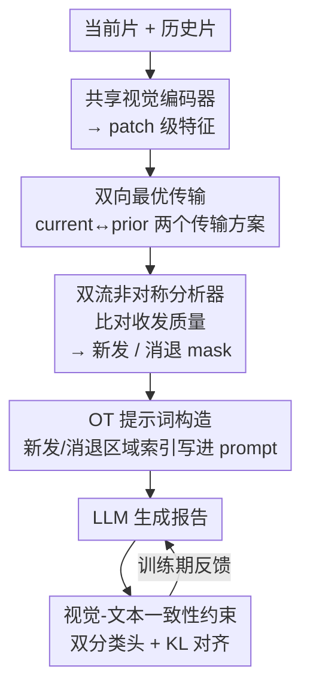

# BiOTPrompt: Bidirectional Optimal Transport Guided Prompting for Disease Evolution-aware Radiology Report Generation

**会议**: CVPR 2026  
**论文**: [CVF Open Access](https://openaccess.thecvf.com/content/CVPR2026/html/Liu_BiOTPrompt_Bidirectional_Optimal_Transport_Guided_Prompting_for_Disease_Evolution-aware_Radiology_CVPR_2026_paper.html)  
**代码**: 无  
**领域**: 医学图像  
**关键词**: 放射报告生成, 双向最优传输, 疾病演化, LLM提示, 多模态一致性

## 一句话总结
针对纵向胸片报告生成中"病灶演化是双向且非对称（有新发也有消退）"这一被忽视的特性，BiOTPrompt 用**双向最优传输**在当前片与历史片之间建立软对应，靠两个方向传输质量的不对称识别出"新发区域"和"消退区域"，把它们的空间位置编码进提示词去引导 LLM 生成报告，并加一条视觉-文本一致性约束抑制幻觉，在 Longitudinal-MIMIC 上 NLG 与临床指标全面取得 SOTA（CE-F1 0.417）。

## 研究背景与动机

**领域现状**：放射报告生成（RRG）要从胸片自动写出诊断报告。单图 RRG 已较成熟，但临床上医生看片几乎一定会**对比当前片和既往片**来判断病情进展（结节是否稳定、积液是否消退、有没有新发病灶），于是出现了一批纵向（longitudinal）RRG 方法，把历史影像或历史报告作为时序上下文喂进模型。

**现有痛点**：现有纵向方法大多停留在**粗粒度全局对齐**——要么把历史/当前的全局表征做特征融合，要么按预定义解剖区域做对齐，难以捕捉空间局部的细微变化。更关键的是，它们普遍采用**单向对齐或静态提示**，默认两个时间点之间的对应是对称的。

**核心矛盾**：病灶演化本质上是**非对称且双向**的——当前片里可能冒出新病灶（prior 里没有对应），同时 prior 里的某些病灶在当前片里已经消退（current 里没有对应）。单向、对称的建模框架天然描述不了这种"一边新增、一边消失"的不对称动态。雪上加霜的是，不同时间点的胸片还存在**空间错位**（体位、呼吸相位、拍摄角度不同），让逐像素/逐区域的硬比较不可靠。

**本文目标**：在空间错位的两张片子之间，建立柔性对应关系，并显式地把"新发区域"和"消退区域"分别识别出来，转成能引导报告生成的局部信号。

**切入角度**：最优传输（OT）能在两组特征之间求解最小代价的传输方案，天然适合处理空间错位下的软匹配；而当**双向**地做 OT（current→prior 与 prior→current），两个方向传输方案的不对称恰好能暴露病灶的新增与消退。

**核心 idea**：用**双向最优传输**替代单向对齐，靠两方向传输质量的不对称定位演化区域，再把这些区域位置写进提示词去引导 LLM——"asymmetry of transport = disease evolution"。

## 方法详解

### 整体框架
给定当前片 $I_c$ 与历史片 $I_p$，BiOTPrompt 的目标是生成逼近真值 $R_c$ 的报告 $\hat{R}_c \leftarrow \text{BiOTPrompt}(I_c, I_p)$。整条管线分四步串起来：先用**共享参数**的视觉编码器把两张片子编码成 patch 级特征，在两个方向各求一个最优传输方案；接着用双流非对称分析器比对两方向的收发质量，得到"新发"和"消退"两张二值 mask；再把这些演化区域的 patch 索引写进结构化提示词，喂给 LLM 生成报告；最后用一条视觉-文本一致性约束在训练时拉齐"图像看到的疾病"和"报告写出的疾病"，压制幻觉。注意整个方法**只用历史影像、不依赖历史报告**（后者在真实场景常常缺失），这也是它相对 HC-LLM 等方法的实用优势。

### 关键设计

**1. 双向最优传输（BiOT）：用两个方向的传输方案处理错位、暴露非对称**

这一步直接针对"空间错位 + 演化非对称"两个痛点。先用共享编码器 $f_v$ 和投影头 $f_{proj}$ 取出两张片子的 patch 特征：$X^{cls}_p, X_p = f_{proj}(f_v(I_p))$，$X^{cls}_c, X_c = f_{proj}(f_v(I_c))$，其中 $X_p, X_c \in \mathbb{R}^{N\times D}$ 是 $N$ 个 patch 的投影特征，$X^{cls}$ 是全局 [CLS] 表征。然后求解熵正则的 OT 问题得到传输方案 $P^*\in\mathbb{R}^{N\times N}$：

$$P^* = \arg\min_{P\in\Pi(\mu,\nu)} \langle P, C\rangle - \varepsilon\cdot H(P)$$

代价矩阵 $C_{ij} = |x^i_p - x^j_c|^2$ 是 prior 第 $i$ 个 patch 与 current 第 $j$ 个 patch 的特征平方距离，$\mu,\nu$ 是 patch 上的均匀边缘分布，$H(P)=-\sum_{i,j}P_{ij}\log P_{ij}$ 是熵正则项，用 Sinkhorn 算法迭代归一化 Gibbs 核 $K=\exp(-C/\varepsilon)$ 高效求解。OT 给出的是**软的、置换不变**的匹配，因此体位/呼吸造成的空间错位不再致命。

但单向 OT 有歧义——current→prior 里一个弱匹配，可能是新病灶，也可能只是噪声或错位，孤立看分不清。于是作者**双向**地各求一个方案：$P^*_{c\to p}=\text{OT}(X_c, X_p)$，$P^*_{p\to c}=\text{OT}(X_p, X_c)$。两个方向互为交叉验证，是后面分析器和提示构造的基础。

**2. 双流非对称分析器（DFAA）：用双向"收发都弱"判定演化区域**

OT 方案只给出概率对应，并不直接说哪块是新发、哪块是消退；DFAA 负责把它翻译成二值 mask。直觉是：当前片里一个 patch 如果**既发不出去、也收不到**传输质量，说明它在历史片里没有对应，是新冒出来的；反过来，历史片里一个收发都弱的 patch 则是已消退的。具体对每个方案取行和、列和来量化每个 patch 的"发出"与"接收"强度：

$$\text{Sent}_{c\to p}(i)=\sum_j P^*_{c\to p}(i,j),\quad \text{Recv}_{p\to c}(i)=\sum_j P^*_{p\to c}(j,i)$$

当前 patch $i$ 被标为**新发**当且仅当 $\text{Sent}_{c\to p}(i)<\delta$ 且 $\text{Recv}_{p\to c}(i)<\delta$；同理历史 patch 被标为**消退**当 $\text{Sent}_{p\to c}(i)<\delta$ 且 $\text{Recv}_{c\to p}(i)<\delta$（$\delta=0.05$）。得到两张二值 mask $M_{new}, M_{disappear}\in\{0,1\}^N$。**要求两个方向都低质量**这一点是关键——它把单向噪声造成的假阳性过滤掉，只有真正"双向都没人理"的区域才算演化，从而显著降低误检。

**3. OT 提示词构造：把演化区域的位置写成临床风格提示喂给 LLM**

有了新发/消退两组 patch 索引，作者不把它们做成隐式特征，而是**显式 verbalize**进一条结构化提示 $p_g$：以"医疗助手"的口吻，列出"当前片新发异常 patch → 位置 [1,3,8]""历史片已消退异常 patch → 位置 [4,8,9]"，再要求基于这些发现生成当前片的详细诊断报告。提示同时以当前/历史片的 patch embedding 为条件。这样做的好处是把时序定位的线索以 LLM 最擅长消化的文本形式注入，引导它围绕"哪里新增、哪里消失"做进展感知的推理，而不是泛泛描述当前片。报告随后以自回归方式生成：$\hat{r}_t = f_{rg}(p_g, \hat{r}_{1:t-1})$。

**4. 视觉-文本一致性约束（VLCC）：双分类头 + KL 对齐压制幻觉**

LLM 报告流畅但常忽视临床关键发现的真伪。VLCC 在训练时加一个**双分支分类**框架来拉齐"图像里的病"和"报告里的病"：视觉表征取视觉编码器的 [CLS] token $X^{cls}_c$，文本表征取生成报告隐状态的平均池化，各过一个两层 MLP 分类头 $f_{vis}, f_{text}$ 预测多标签疾病概率，用 BCE 监督（$L_{vis\text{-}cls}, L_{text\text{-}cls}$，标签 $y$ 为真值疾病向量）。再加一条 KL 散度把两个分类分布对齐：$L_{KL}=D_{KL}(p_{vis}\,\|\,p_{text})$，其中 $p_{vis}, p_{text}$ 是两个分类头 softmax 后的输出。直觉是：如果图像判出"积液"而报告没写，两个分布就会被 KL 拉回一致，从而抑制幻觉、提升事实正确性。

### 损失函数 / 训练策略
总损失把报告生成损失、双分类损失、KL 对齐损失加权相加：

$$L_{total} = L_{RRG} + \lambda_1(L_{vis\text{-}cls}+L_{text\text{-}cls}) + \lambda_2 L_{KL}$$

其中 $L_{RRG}=-\sum_{t=1}^T \log p(\hat{r}_t\mid \hat{r}_{1:t-1}, p_g)$ 是 teacher forcing 下的交叉熵生成损失。超参 $\lambda_1=0.1$、$\lambda_2=1.0$、$\delta=0.05$，提示最大长度 90。视觉编码器用 Swin-Transformer（base），LLM 用 LLaMA2-7B（基于 R2GenGPT 框架），在单张 A800 80GB 上混合精度训练 5 epoch，batch 12、学习率 1e-4，测试用 beam size 3 的束搜索。

## 实验关键数据

### 主实验
数据集为 Longitudinal-MIMIC（MIMIC-CXR 的纵向子集，94,169 对扫描-报告、26,625 名患者，每实例含当前+历史片及报告）。NLG 指标用 BLEU/ROUGE-L/METEOR/CIDEr，临床指标（CE）用 CheXbert 抽疾病标签算 Precision/Recall/F1。$I_p$/$R_p$ 表示是否用历史影像/历史报告。

| 方法 | $I_p$/$R_p$ | BLEU-4 | ROUGE-L | METEOR | CIDEr | CE-P | CE-R | CE-F1 |
|------|------|--------|---------|--------|-------|------|------|-------|
| R2GenGPT (单图) | ✗/✗ | 0.102 | 0.259 | 0.133 | 0.142 | 0.267 | 0.266 | 0.249 |
| R2GenGPT (+历史片) | ✓/✗ | 0.113 | 0.273 | 0.144 | 0.191 | 0.340 | 0.340 | 0.316 |
| HERGen | ✓/✓ | 0.117 | 0.282 | 0.155 | - | 0.421 | 0.289 | 0.295 |
| HC-LLM | ✓/✓ | 0.117 | 0.282 | 0.155 | - | 0.417 | 0.357 | 0.357 |
| **BiOTPrompt** | **✓/✗** | **0.126** | **0.285** | **0.155** | **0.236** | **0.471** | **0.424** | **0.417** |

BiOTPrompt 在所有 NLG 与 CE 指标上都取得最佳。尤其值得注意：它**只用历史影像、不用历史报告**，却超过了同时用历史影像+报告的 HERGen / HC-LLM，CE-F1 从 0.357 提到 0.417（+6 个点），说明"视觉演化本身"就足以支撑纵向报告生成。相比直接拼接历史片的 R2GenGPT（+PI），CE-F1 从 0.316 提到 0.417，验证 OT 引导的进展感知提示比"扁平拼接"更能捕捉病情变化。

### 消融实验

| 配置 | ROUGE-L | CIDEr | CE-P | CE-R | CE-F1 | 说明 |
|------|---------|-------|------|------|-------|------|
| w/o BiOT | 0.279 | 0.216 | 0.444 | 0.390 | 0.388 | 双向 OT 换成单向，文本与临床都掉 |
| w/o DFAA | 0.282 | 0.216 | 0.436 | 0.388 | 0.382 | 只用单方向收发信号，掉点最明显之一 |
| w/o VLCC | 0.272 | 0.209 | 0.426 | 0.382 | 0.376 | 去一致性约束，临床 P/R 显著下降 |
| w/o ($L_{vis\text{-}cls}+L_{text\text{-}cls}$) | 0.284 | 0.229 | 0.431 | 0.387 | 0.384 | 去双分类损失 |
| w/o $L_{KL}$ | 0.284 | 0.234 | 0.450 | 0.403 | 0.399 | 去 KL 对齐 |
| **BiOTPrompt (Full)** | **0.285** | **0.236** | **0.471** | **0.424** | **0.417** | 完整模型 |

### 关键发现
- **VLCC 对临床指标影响最大**：去掉整条一致性约束（w/o VLCC）CE-F1 从 0.417 跌到 0.376，是单项消融里 CE-F1 掉得最狠的，说明拉齐图像与文本的疾病预测对压幻觉、提事实性最关键。
- **双向是必需的**：w/o BiOT（换单向）和 w/o DFAA（只用单方向信号）都明显掉点，印证了"病灶演化非对称、需要双向交叉验证"的核心假设，而不是 OT 本身好用就够了。
- **VLCC 内部两块互补**：单独去双分类损失或单独去 KL 都掉，二者结合才拿到最高 CE-F1，说明"先各自学疾病分类、再 KL 对齐两分布"的设计是互补而非冗余。
- **定性上能定位演化**：图 3 显示 BiOTPrompt 能正确写出 opacity 消失、手术夹在左上腹的定位，而 R2GenGPT 与消融版本会漏关键发现或把异常定位错位；图 4 的 mask 可视化里新发/消退区域与真实报告提到的疾病吻合。

## 亮点与洞察
- **"传输方案的不对称 = 疾病演化"是个漂亮的建模视角**：把"新发/消退"这种语义问题，转成"两个方向 OT 传输质量都低"的几何判据，既绕开了空间错位（OT 软匹配），又用双向交叉验证天然抑制噪声假阳性，一举两得。
- **不依赖历史报告反而更实用**：现实里历史影像比历史报告好拿，BiOTPrompt 只吃影像就超过用报告的方法，落地门槛更低，这点对临床部署很重要。
- **把空间索引 verbalize 进 prompt 是个可迁移的 trick**：与其把演化信息做成隐式 embedding，不如直接把"新发 patch 位置 [1,3,8]"写成自然语言喂 LLM——任何"有显式定位信号、想引导生成模型"的任务（如变化检测描述、时序对比）都能借用这种"几何发现 → 文本提示"的接口。
- **VLCC 用双分类头 + KL 做跨模态一致性**而非简单对比损失，思路清晰：让图像和文本各自先承担"判病"职责，再用 KL 把两个判断对齐，比直接拉特征距离更贴近"事实一致"的目标。

## 局限与展望
- 只考虑**两时间点**（当前 + 单张历史片），多次随访（multi-visit）的长序列演化没建模，⚠️ 对病程更长、影像更多的真实病例可能不够。
- 演化判定靠**单一阈值 $\delta=0.05$** 卡 Sent/Recv，对不同解剖部位/不同噪声水平是否都合适、敏感性如何，文中未充分分析。
- OT 在 patch 粒度做软匹配，patch 数 $N$ 决定空间分辨率；对非常细小的病灶，patch 级 mask 的定位精度可能受限。
- 依赖 CheXbert labeler 抽疾病标签来算 CE 指标和监督 VLCC，labeler 本身的错误会传导进训练与评测。
- 改进方向：把双向 OT 扩展到多时间点（序列 OT / 沿时间链的传输），或把 $\delta$ 换成可学习/自适应阈值。

## 相关工作与启发
- **vs R2GenGPT(+PI)**：后者把历史片特征**扁平拼接**进 LLM，本文用双向 OT 显式建模 patch 级软对应并提取非对称演化，CE-F1 0.417 vs 0.316，说明结构化的进展建模远胜简单拼接。
- **vs HC-LLM / HERGen**：它们用历史影像**+历史报告**，靠时序一致性约束或课程学习建模 inter-scan 动态；本文只用历史影像，靠 BiOT 显式抓"新发/消退"，在不用报告的前提下反超，证明视觉演化信号的充分性。
- **vs RECAP / CheXRelNet 等**：这些方法用疾病演化图或解剖感知推理捕捉变化，但多在粗语义/预定义区域层面；本文在 patch 粒度用 OT 做软对齐，能处理空间错位与局部细微变化。

## 评分
- 新颖性: ⭐⭐⭐⭐⭐ 首个用双向 OT 显式识别新发与消退病灶的纵向 RRG 框架，"传输不对称=演化"视角原创且自洽
- 实验充分度: ⭐⭐⭐⭐ Longitudinal-MIMIC 上 NLG+CE 全面 SOTA，消融拆解到 VLCC 子项，但只在单一数据集、两时间点设定下验证
- 写作质量: ⭐⭐⭐⭐ 动机—机制—公式链条清晰，OT 与双流分析器讲得明白，图示丰富
- 价值: ⭐⭐⭐⭐⭐ 不依赖历史报告即超 SOTA，落地门槛低，"几何发现→文本提示"的接口可迁移

<!-- RELATED:START -->

## 相关论文

- [\[CVPR 2026\] SAT-RRG: LLM-Guided Self-Adaptive Training for Radiology Report Generation with Token-Level Push–Pull Optimization](sat-rrg_llm-guided_self-adaptive_training_for_radiology_report_generation_with_t.md)
- [\[CVPR 2026\] CURE: Curriculum-guided Multi-task Training for Reliable Anatomy Grounded Report Generation](cure_curriculum-guided_multi-task_training_for_reliable_anatomy_grounded_report_.md)
- [\[CVPR 2026\] TIM: Temporal Decoupling with Iterative Mutual-Refinement Model for Longitudinal Radiology Report Generation](tim_temporal_decoupling_with_iterative_mutual-refinement_model_for_longitudinal_.md)
- [\[CVPR 2026\] OraPO: Oracle-educated Reinforcement Learning for Data-efficient and Factual Radiology Report Generation](orapo_oracle-educated_reinforcement_learning_for_data-efficient_and_factual_radi.md)
- [\[AAAI 2026\] A Disease-Aware Dual-Stage Framework for Chest X-ray Report Generation](../../AAAI2026/medical_imaging/a_disease-aware_dual-stage_framework_for_chest_x-ray_report_.md)

<!-- RELATED:END -->
