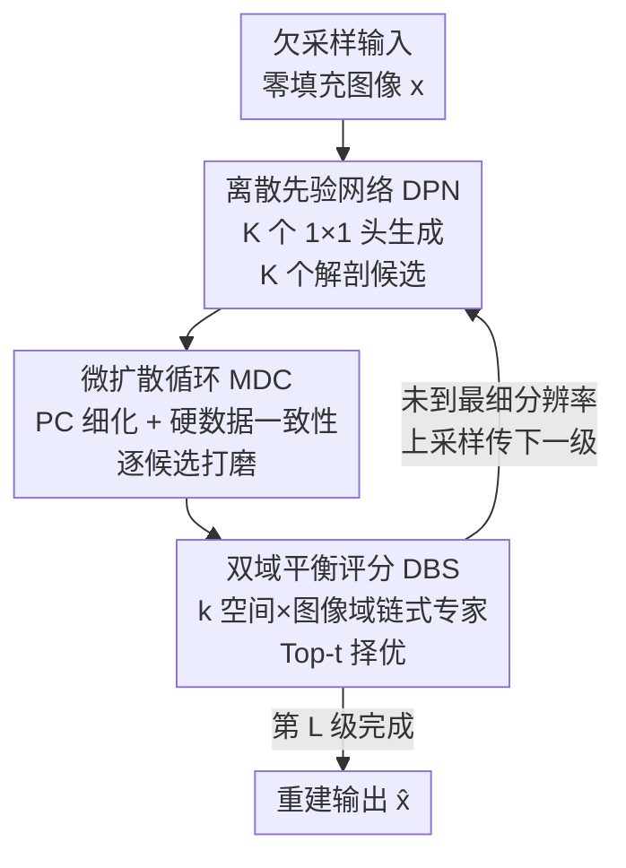

# Breaking the Continuum: Discrete Distribution Learning for Structural MRI Reconstruction

**会议**: CVPR 2026  
**论文**: [CVF Open Access](https://openaccess.thecvf.com/content/CVPR2026/html/Lyu_Breaking_the_Continuum_Discrete_Distribution_Learning_for_Structural_MRI_Reconstruction_CVPR_2026_paper.html)  
**代码**: https://kincin.github.io/DiCoS/ （项目页）  
**领域**: 医学图像  
**关键词**: MRI 重建, 离散分布学习, 多假设生成, 扩散模型, 双域评分  

## 一句话总结
针对欠采样 MRI 重建，DiCoS 不再像扩散模型那样在连续流形上"一条轨迹磨到底"，而是用离散先验网络一次生成 K 个解剖学候选、用极短的微扩散循环逐个做纹理细化与数据一致性投影、再用双域平衡评分（k 空间 + 图像域）链式择优，在 fastMRI 膝/脑数据集上以远低的推理耗时取得 SOTA 重建质量（12× 加速下 PSNR 比次优高 1.4+ dB）。

## 研究背景与动机
**领域现状**：从欠采样 k 空间恢复图像是一个病态逆问题，同一份测量可能对应多个解剖上都"说得通"的解。传统压缩感知/并行成像靠手工先验（稀疏、低秩）；近年主流转向基于 score-SDE 的扩散模型（VE-SDE、HFS-SDE、SelfRDB 等），把重建建模成沿学到的随机动力学逐步去噪、把噪声样本一点点拉回数据流形。

**现有痛点**：扩散重建有一个根本性假设——图像流形是**纯连续**的，去噪沿光滑流形长链推进。但临床 MR 图像不是这样：器官、病灶、组织间存在边界清晰、区域语义明确的**离散结构**。作者在图 1 用 VQ-VAE codebook 特征做聚类发现，医学图像在隐空间形成更紧致、更连贯的簇（Silhouette 0.76 vs 自然图像 0.43），而连续扩散的光滑插值恰恰会把这些组织界面**抹糊**，损害诊断清晰度。

**核心矛盾**：离散结构推理能抓住区域级边界，却无法恢复细粒度纹理、也保证不了严格的测量数据一致性；而纯连续细化能补纹理、能投影回 k 空间，却会过度平滑掉离散语义。两者各有不可替代的一半。

**本文目标**：设计一个**天生兼容离散表示**的重建管线，既显式建模解剖的离散分布、又不丢掉连续物理保真度。

**切入角度**：与其反复"改造连续模型去逼近结构化分布"，不如换范式——把重建从"逐像素回归 / 单假设连续演化"改成"多假设离散生成 + 轻量连续打磨"的**推理式重建**。

**核心 idea**：用离散先验网络一次性枚举 K 个解剖候选（全局假设探索），每个候选用极短的微扩散循环做局部纹理细化 + 硬数据一致性，再用双域评分链式择优，把搜索空间从粗到细逐级收缩。

## 方法详解

### 整体框架
DiCoS（Discrete–Continuous Synthesis）是一个由 L 级离散先验网络（DPN）串起来的分层、由粗到细的重建框架。输入是零填充的欠采样图像 $x$，输出是重建图 $\hat{x}$。每一级 $\ell$ 做三件事：① DPN 用轻量离散生成器（两层卷积 + K 个并行 $1\times1$ 头）从上一级估计 $x^*_{\ell-1}$ 生成 **K 个候选** $x^{(k)}_\ell = f_\ell(x^*_{\ell-1})[k]$，每个头给出不同的线性投影、对应一个解剖假设；② 每个候选过 **微扩散循环（MDC）** 做 T 步预测-校正细化 + 硬数据一致性投影；③ **双域平衡评分（DBS）** 综合 k 空间保真和图像域规整度给每个候选打分、Top-t 选出最可靠假设上采样传给下一级。整个流程把重建拆成"全局粗定位 → 分支级细修 → 子像素纹理细化"三个子问题，分辨率从 $[H/2^p, W/2^p]$ 逐级上采 2 倍恢复到 $[H,W]$，搜索空间从 K 个候选逐级收缩到少数高质量假设。

### 关键设计

**1. 离散先验网络 DPN：把单假设连续演化换成多假设离散枚举**

扩散重建的问题是只维护"一条"假设、沿光滑流形磨到底，遇到病态逆问题时容易收敛到被平滑掉离散语义的解。DPN 的做法是在每一级用一个轻量生成器一次并行吐出 K 个候选：共享 backbone 提局部特征，K 个 $1\times1$ 头各做一次不同的线性投影，$x^{(k)}_\ell = f_\ell(x^*_{\ell-1})[k],\ k=1,\dots,K$，每个候选编码一种不同的解剖结构假设。整个 DPN 是分层 downsample–upsample 结构，从粗分辨率起步逐级上采，级间过程可写成 $\{x^{k'}_\ell\}_{k'=1}^{K'} = F_{\text{DBS}}(F_{\text{MDC}}(\{x^k_\ell\}_{k=1}^{K}))$——即"生成 K 个 → MDC 细化 → DBS 收缩到 K′ 个"逐级缩小搜索空间。这样做的好处是把全局假设探索（哪种解剖结构对）和局部打磨解耦：模型先在离散候选层面广撒网，避免一上来就被连续平滑锁死在错误流形上。为防止某些假设长期"不被选中"而退化（hypothesis collapse），作者还加了一个轻量**节点激活正则**，当某些分支失活时自适应把概率质量重新分配回去，零额外计算开销地稳住多假设搜索。

**2. 微扩散循环 MDC：用几步而非上百步把离散候选补上纹理和数据一致性**

离散候选有了区域结构却缺连续纹理和测量一致性，而完整跑一条长链扩散又太慢。MDC 给每个候选只做 T 步（实验取 T=3）轻量细化，每步含两个操作。第一步是**预测-校正（PC）**，注入预训练 VE-SDE score 先验提供的连续细化方向：预测步沿学到的梯度场漂移把候选拉向高似然区，校正步做一小段 Langevin 更新把轨迹收敛到稳定密度盆地，

$$\text{Pre.}\ \ x^k_\ell \leftarrow x^k_\ell + \sigma_s\, \nabla_x \log p_{\theta_\ell}(x^k_\ell)\,\Delta t + \sqrt{2\Delta t}\,z, \qquad \text{Cor.}\ \ x^k_\ell \leftarrow x^k_\ell + \beta\,\nabla_x \log p_{\theta_\ell}(x^k_\ell) + \sqrt{2\beta}\,z'$$

其中 $\Delta t=1,\ \beta=0.2\sigma_s^2$，$z,z'\sim\mathcal{N}(0,I)$。第二步是**硬数据一致性（DC）投影**：把细化后的候选 FFT 到 k 空间，在采样到的频率位置 $\Omega_u$ 直接用实测值 $y$ 替换、再逆变换回去，$x^k_\ell \leftarrow x^k_\ell + F_u^\dagger(y - F_u x^k_\ell)$，强制 $(F_u x^k_\ell)[m]=y[m]$。这一硬投影保证保留学到的先验的同时严格忠于测量。关键在"微"——只用几步就拿到长链扩散的纹理收益，推理成本低一个数量级（T=3 时单图 3.23s vs 扩散基线 10~38s）。

**3. 双域平衡评分 DBS：把 k 空间专家和图像域专家串成链、自适应择优而非贪心比指标**

K 个候选里挑哪个，是个绕不开的选择问题：图像域线索懂解剖语义但忽视测量保真，k 空间线索保数据一致却不懂结构含义，单看任一指标都会贪心选错。DBS 借鉴 Chain-of-Experts 的专家通信思路，给每个候选 $x_k$ 把两个域评分**串成一条链**逐步累积证据：$h^{(1)}_k = \alpha_k E_{\text{DC}}(x_k)$，$h^{(2)}_k = h^{(1)}_k + (1-\alpha_k)E_{\text{TV}}(x_k)$，其中 $E_{\text{DC}}$ 是 k 空间数据保真项、$E_{\text{TV}}$ 是图像域总变差规整项（鼓励平滑同时保边）。平衡系数 $\alpha_k=\sigma(\phi([E_{\text{DC}}(x_k),E_{\text{TV}}(x_k)]))$ 是个一层 MLP+sigmoid 的微型路由器，按候选自适应地权衡两个专家谁更可靠。最终分

$$\text{Score}(x_k) = \lambda_{\text{DC}} h^{(1)}_k + \lambda_{\text{TV}} h^{(2)}_k - \lambda_{\text{SDE}}\|\nabla_x \log p_\theta(x_k)\|_2^2 + b_k$$

里还注入了预训练 score 模型的梯度能量项，以及一个可学习的使用均衡偏置 $b_k \leftarrow b_k - \tau(\frac{c_k}{\sum_j c_j} - \frac{1}{K})$——把很少被选的分支往上推、被频繁选的往下压，像 CoE 那样促进通信多样性、避免总选同一个分支。最后做软 Top-t 选择留下能量最低（分最好）的 t 个假设，再从中均匀采一个传下一级，既择优又保留探索多解的能力。

### 损失函数 / 训练策略
训练用全采样 GT $x_{\text{GT}}$ 监督。重建损失在图像域和 k 空间双域对齐：$L_{\text{rec}}(x_k) = \|x_k - x_{\text{GT}}\|_1 + \eta\|F(x_k) - F(x_{\text{GT}})\|_2^2$（$\eta=0.5$）。为训练 DBS，作者额外加了**分数对齐损失**让预测分和真实重建误差排序一致：令 $E_{\text{GT}}(x_k)=L_{\text{rec}}(x_k)$ 为真实误差，$L_{\text{score}}=\frac{1}{K}\sum_k |\text{Score}(x_k) - \gamma E_{\text{GT}}(x_k)|$（$\gamma=100$），强制误差越低的候选分越高。总目标 $L = L_{\text{rec}}(x^*_\ell) + \lambda_{\text{score}}L_{\text{score}}$ 只对 DBS 选出的 top 候选 $x^*_\ell$ 算重建损失，避免惩罚多样假设、让 DPN 保持结构多样性。关键超参：K=32 候选、L=64 级、每候选 T=3 步 MDC、DPN 下采 P=3；$\lambda_{\text{DC}}=5000,\ \lambda_{\text{TV}}=0.05,\ \lambda_{\text{SDE}}=0.2,\ \tau=0.07$；160 epoch、Adam、lr 1e-4、batch 16，4×A6000 约 15.4 小时。

## 实验关键数据

### 主实验
在 multi-coil fastMRI 膝（约 3.4 万 scan）和脑（约 1.1 万 volume）数据集上，1D 均匀采样、4/8/12 倍加速，对比 9 个 SOTA。DiCoS 在几乎所有设置下 NMSE/PSNR 大幅领先（SSIM 与 SelfRDB 互有胜负但整体保真显著更好）：

| 数据集 (12×加速) | 指标 | DiCoS (本文) | SelfRDB (次优) | HFS-SDE |
|--------|------|------|----------|------|
| 膝 Knee | NMSE↓ | **1.43** | 1.94 | 2.61 |
| 膝 Knee | PSNR↑ | **35.32** | 33.87 | 34.31 |
| 膝 Knee | SSIM↑ | **86.13** | 85.18 | 83.67 |
| 脑 Brain | NMSE↓ | **1.52** | 1.97 | 3.22 |
| 脑 Brain | PSNR↑ | **37.24** | 35.67 | 34.23 |
| 脑 Brain | SSIM↑ | 87.85 | 87.01 | 85.14 |

膝 4× 下 DiCoS PSNR 37.61 vs SelfRDB 36.19；推理上 DiCoS（T=3）单图 3.23s，远快于 VE-SDE 13.27s、AdaDiff 37.83s，仅次于纯离散的 DDN（2.07s）但质量高得多——质量-效率折中显著占优。语义一致性上用冻结 MedSAM 分割重建图与 GT 比 Dice/IoU，DiCoS 取得最高 Dice 0.921、IoU 0.842（次优 SelfRDB 0.892/0.821），说明重建在解剖区域级语义上更可靠，而非只在像素指标好看。

### 消融实验
在膝数据集 12× 加速下逐组件消融（C2F=由粗到细、MDC=微扩散、DBS=双域评分）：

| 配置 | NMSE↓ | PSNR↑ | SSIM↑ | 说明 |
|------|---------|------|------|------|
| 完整 DiCoS | **1.43** | **35.32** | **86.13** | 三模块齐全 |
| 去 C2F（单级全分辨率） | 2.13 | 34.61 | 84.81 | 失去由粗到细的搜索空间收缩 |
| 去 MDC（候选直接进 DBS） | 2.87 | 32.58 | 83.24 | **掉点最多**，纹理/数据一致性缺失 |
| 去 DBS（只按最高量化分选） | 1.94 | 34.26 | 84.39 | 贪心选候选，丢双域平衡 |

### 关键发现
- **MDC 贡献最大**：去掉微扩散细化后 PSNR 从 35.32 掉到 32.58（−2.74 dB），印证"离散候选必须靠连续细化补纹理和数据一致性"这一核心论点。
- **候选数 K 和细化步数 T 都有饱和点**：K 在 32 后增益饱和（更多候选结构多样性冗余），T 在 3 步后回报递减、推理成本却线性涨，故定 K=32、T=3。
- **离散范式带来更紧致的特征簇**：t-SNE 显示 DiCoS 的中间特征类内紧致、类间边界清晰，连续（HFS-SDE）和纯离散（DDN）基线都更散，呼应图 1 "医学图像本就该用离散表示"的动机。

## 亮点与洞察
- **把"连续 vs 离散"之争证据化**：作者用 VQ-VAE codebook 特征 + 三个聚类指标量化证明医学图像比自然图像更"离散成簇"，给"换离散范式"提供了实证支撑，而非拍脑袋——这个分析方法本身可迁移到其它判断"该用连续还是离散先验"的场景。
- **"微"扩散是关键 trick**：不是不用扩散，而是把上百步长链压成 3 步预测-校正 + 硬投影，拿到大部分纹理收益却把推理成本降一个数量级，是"轻量化扩散先验注入"的好范例。
- **DBS 借 LLM 的 Chain-of-Experts 思路做候选选择**：把 k 空间专家和图像域专家串成链、用路由器自适应加权、再加使用均衡偏置防分支退化，这套"链式专家 + 负载均衡"机制可迁移到任何多假设/多候选择优的视觉任务。
- **用 MedSAM 分割一致性作为重建语义的外部验证**：跳出 PSNR/SSIM 像素指标，用下游分割的 Dice/IoU 衡量"重建得对不对（语义层面）"，是医学重建评测的好补充。

## 局限与展望
- 作者承认离散推理单独不足、必须配连续细化，框架因此较复杂（DPN+MDC+DBS 三模块 + 多套超参 $\lambda$），调参成本不低。
- ⚠️ 论文文字称 L=64 级、又说每级 K=32 候选 × T=3 步 MDC，级数与候选数都不小，实际显存/批内并行开销在正文未充分展开（以原文为准）。
- 评测只在 fastMRI 膝/脑两个解剖、1D 均匀采样上做；对其它解剖、2D/径向采样、不同对比度协议的泛化未验证——而"医学图像离散成簇"的前提是否在所有模态都成立值得商榷。
- 离散候选的多样性靠 K 个 $1\times1$ 头的不同线性投影产生，多样性来源较浅，是否真覆盖了"解剖上不同的合理解"还是只是同一解的扰动，可进一步分析。

## 相关工作与启发
- **vs 连续扩散重建（VE-SDE / HFS-SDE / SelfRDB）**：它们沿光滑流形演化单条假设、长链去噪，会过度平滑离散边界且推理慢；DiCoS 改成多离散假设 + 微扩散细化，既快又保边界，12× 下 PSNR 普遍高 1~3 dB。
- **vs 纯离散先验（DDN，本文主要离散基线）**：DDN 靠精简架构推理极快（2.07s）但严重欠采样下保真不足；DiCoS 在离散候选上叠加连续 score 细化和硬数据一致性，质量大幅反超而推理只略慢。
- **vs 离散 codebook 方法（VQ-VAE / VQGAN / MaskGIT）**：自然视觉里这些用离散码本求更锐结构，但属生成而非逆问题；DiCoS 把"离散假设枚举"显式引入 MRI 逆问题、并配上 k 空间硬投影保证物理一致，是把离散推理落到带测量约束重建上的尝试。

## 评分
- 新颖性: ⭐⭐⭐⭐⭐ 首个显式建模医学图像离散结构分布做 MRI 重建，范式从"单假设连续演化"转向"多假设离散生成+微细化"，并有量化证据支撑。
- 实验充分度: ⭐⭐⭐⭐ 两大数据集 × 三加速倍率 × 9 基线 + 逐组件消融 + K/T 敏感性 + MedSAM 语义评测，较完整；但采样模式和解剖种类偏单一。
- 写作质量: ⭐⭐⭐⭐ 动机论证（图 1 聚类分析）有力、pipeline 清晰；个别超参描述（L 与 K 规模）略含糊。
- 价值: ⭐⭐⭐⭐⭐ SOTA 重建质量 + 数量级推理提速 + 语义一致性，对加速 MRI 临床落地有实际意义，"离散+连续混合"思路可推广到其它逆成像任务。

<!-- RELATED:START -->

## 相关论文

- [\[CVPR 2026\] Prospective Dynamic 3D MRI Reconstruction via Latent-Space Motion Tracking from Single Measurement](prospective_dynamic_3d_mri_reconstruction_via_latent-space_motion_tracking_from_.md)
- [\[CVPR 2026\] Semantic Class Distribution Learning for Debiasing Semi-Supervised Medical Image Segmentation](semantic_class_distribution_learning_for_debiasing.md)
- [\[CVPR 2026\] SemiGDA: Generative Dual-distribution Alignment for Semi-Supervised Medical Image Segmentation](semigda_generative_dual-distribution_alignment_for_semi-supervised_medical_image.md)
- [\[AAAI 2026\] Unsupervised Motion-Compensated Decomposition for Cardiac MRI Reconstruction via Neural Representation](../../AAAI2026/medical_imaging/unsupervised_motion-compensated_decomposition_for_cardiac_mri_reconstruction_via.md)
- [\[CVPR 2026\] The Invisible Gorilla Effect in Out-of-distribution Detection](the_invisible_gorilla_effect_in_out-of-distribution_detection.md)

<!-- RELATED:END -->
