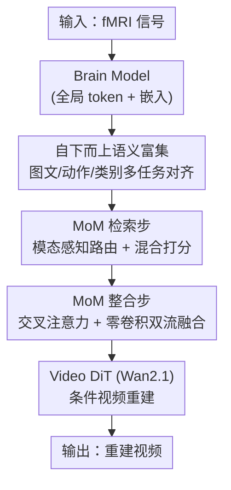

# Bridging Brain and Semantics: A Hierarchical Framework for Semantically Enhanced fMRI-to-Video Reconstruction

**会议**: CVPR 2026  
**arXiv**: [2605.14569](https://arxiv.org/abs/2605.14569)  
**代码**: 无（论文未提供）  
**领域**: 医学图像 / 脑解码 / 视频生成  
**关键词**: fMRI 视频重建, 脑解码, 语义富集, 记忆混合, 扩散模型

## 一句话总结
CineNeuron 借鉴大脑「自下而上感知 + 自上而下记忆」的双通路机制，先用多任务对齐把含噪 fMRI 信号映射到同时编码图像/文本/动作/类别的语义空间，再用 Mixture-of-Memories 从历史样本里检索并融合多模态「记忆」来补全细节，最终驱动视频扩散模型，在 cc2017 与 CineBrain 两个 fMRI-to-video 基准上全面超越 SOTA。

## 研究背景与动机
**领域现状**：从脑活动（尤其是 fMRI）重建人看到的视觉内容，是认知神经科学的核心目标之一。静态图像重建已经做得不错，但人的视觉感知本质是连续动态的，把这套能力延伸到「重建视频」一直是个开放难题。主流做法是先从 fMRI 学一个语义嵌入，再去驱动一个视频生成器（如 Mind-Video 把 fMRI 编码器对齐到 CLIP 再接 inflated Stable Diffusion，NeuroClips 编码语义关键帧来提升平滑度）。

**现有痛点**：fMRI 信号信噪比低、时间分辨率差、稀疏且带噪，单靠它很难抽出完整语义。已有方法只把 fMRI 对齐到「图像-文本」空间，捕到的语义很浅，导致两类错误：一是忽略了视频里特有的**动作**和**物体类别**语义（重建出的人在「做瑜伽 / 抚摸」这类动作完全丢失）；二是把每次重建当成**孤立**过程，只用当前刺激、不利用以前学过的知识，于是会把狗解码成人、凭空脑补出不存在的女人和房间。

**核心矛盾**：fMRI 信号本身的语义容量有限，而视频内容极其丰富——既要补全语义维度，又要引入先验知识，单一对齐空间和孤立重建都做不到。

**切入角度**：作者从大脑的**双通路加工机制**出发——自下而上通路把感觉证据从初级到高级视觉皮层逐层累积成高层语义；自上而下通路则把海马系统里整合的记忆/语义预测送回感觉皮层来精修知觉。这恰好对应「先富集语义、再用记忆精修」两个阶段。

**核心 idea**：用「自下而上多任务语义富集 + 自上而下记忆混合精修」的分层框架，把 fMRI 嵌入从浅层图文语义升级为图像/文本/动作/类别四维语义，并动态检索融合历史记忆来补全重建。

## 方法详解

### 整体框架
CineNeuron 输入是一段 fMRI 信号，输出是一段语义准确、时序连贯的重建视频，整条管线分两个协同阶段。**阶段一（自下而上语义富集）**：一个 Transformer 结构的 Brain Model 把 fMRI 映射成两个输出——一个汇总全局语义的 global token $\bm{f^c}$ 和一个保留细粒度上下文的 embedding $\bm{f^e}$；同时对当前视频用一组异构预训练编码器抽出图像/文本/动作/类别监督，通过三个对齐任务把 $\bm{f^c}$ 拉进这个综合语义空间。**阶段二（自上而下记忆整合）**：Mixture-of-Memories（MoM）先用 $\bm{f^e}$ 从「历史看过的视频」构成的记忆池里检索最相关的多模态记忆，再把它们融进 fMRI 嵌入，得到的融合表示作为条件喂给 Video DiT（Wan2.1 1.3B）完成重建。推理端因此非常简洁：输入 fMRI → Brain Model → MoM → 视频解码，无需 ControlNet、关键帧重建等额外组件。

### 关键设计

**1. 自下而上语义富集：用多任务把 fMRI 灌进图像/文本/动作/类别四维语义空间**

针对「只对齐图文、语义太浅、丢动作丢类别」这个痛点，作者让 Brain Model 同时学三组任务。Brain Model 输出双表示：global token $\bm{f^c}\in\mathbb{R}^{B\times D}$ 负责对齐外部语义，embedding $\bm{f^e}\in\mathbb{R}^{B\times L\times D'}$ 保留细节供下游融合，这种「功能解耦」让对齐和重建互不干扰。**图文对齐**用 CLIP 抽视频多帧图像嵌入（经投影头 $\varphi_v$ 聚合成 $\hat{\bm{e}}^{\text{img}}$）和文本嵌入，用 InfoNCE 把 $\bm{f^c}$ 同时拉近二者：$\mathcal{L}_{\text{clip}}=\mathcal{L}_{\text{info}}(\bm{f^c},\hat{\bm{e}}^{\text{img}})+\mathcal{L}_{\text{info}}(\bm{f^c},\bm{e}^{\text{txt}})$。**动作对齐**用在千万级视频-文本对上预训练的 ViCLIP 抽动作嵌入 $\bm{e}^{\text{act}}$，再用动作头 $\varphi_a$ 把 $\bm{f^c}$ 投到动作空间 $\bm{f^a}=\varphi_a(\bm{f^c})$ 做对比对齐——这是补回「走路/游泳」等动作语义的关键。**类别学习**用 Qwen2.5-VL 从字幕里按 MSCOCO 类目抽物体类别，做多标签分类；为应对类别多、类不平衡两个问题，作者把稀有类合并成超类、并用 Focal Loss 重加权，分类损失 $\mathcal{L}_{\text{cls}}$ 是 BCE 与 focal 的组合。阶段总损失 $\mathcal{L}_{\text{stage1}}=\mathcal{L}_{\text{clip}}+\lambda_1\mathcal{L}_{\text{action}}+\lambda_2\mathcal{L}_{\text{cls}}$

**2. MoM 检索步：模态感知路由 + 混合打分，避免被单模态误检索带偏**

阶段一让 fMRI 嵌入有了语义，但稀疏信号里仍缺细节，需要从历史记忆补全。最朴素的做法是拿记忆池里的文本嵌入和 fMRI 比相似度取最近的一条——但 fMRI 噪声/歧义会让这种单模态检索很不稳。作者的记忆池 $\mathcal{M}$ 每条 entry 是同一训练视频抽出的三模态元组 $(\bm{e}^{\text{txt}}_i,\bm{e}^{\text{img}}_i,\bm{e}^{\text{act}}_i)$。一个路由网络 $R$ 先根据当前 $\bm{f^e}$ 算出三模态的实例级检索权重 $W_r=[w^{\text{txt}},w^{\text{img}},w^{\text{act}}]=\mathrm{softmax}(R(\bm{f^e}))$，再对每条记忆算**混合相似度** $S_i=\sum_{m}w_m\cdot\mathrm{sim}(\bm{f^e},\bm{e}^m_i)$（$\mathrm{sim}$ 为余弦相似度）。按 $S_i$ 重排后取 top-1 文本嵌入、top-$K$ 图像与动作嵌入。其妙处在于：对不同输入实例动态决定「这次更该信哪个模态」，比固定单模态检索更鲁棒、更精准。

**3. MoM 整合步：交叉注意力注入视觉/动作线索 + 零卷积双流残差稳态融合**

检索到记忆后，怎么把它们安全地融进 fMRI 嵌入、又不破坏预训练生成器的条件空间，是这一步要解决的。作者先用两层交叉注意力，让 fMRI 嵌入 $\bm{f^e}$ 作 query，检索来的 $K$ 个图像嵌入和动作嵌入分别作 key/value，把视觉与动作线索注入进去得到增强表示 $\hat{\bm{f}}^e=\mathrm{CrossAttention}(\bm{Q^e},\bm{K^{\text{img}}},\bm{V^{\text{img}}})+\mathrm{CrossAttention}(\bm{Q^e},\bm{K^{\text{act}}},\bm{V^{\text{act}}})$。再用**双流 + 零卷积**结构把 $\hat{\bm{f}}^e$ 与 top-1 文本嵌入 $\bm{e}^{\text{mem}}_{\text{txt}}$ 融合：$\hat{\bm{f}}^e$ 先过归一化再过零卷积 $\mathcal{Z}_{\text{fMRI}}$，文本流用残差形式 $\bm{z_t}=\mathcal{Z}_{\text{txt}}(\bm{e}^{\text{mem}}_{\text{txt}})+\bm{e}^{\text{mem}}_{\text{txt}}$，最终 $\bm{f^{\text{fuse}}}=\bm{z_t}+\alpha*\bm{z_f}$。零卷积初始输出为零，意味着训练初期融合结果就等于纯文本嵌入（一个生成器已经吃得很顺的条件），fMRI 信息再渐进地以残差注入——这保证了训练稳定，又把 fMRI 缺失的细节安全补回，是 MoM 拿到时空质量增益的主力。

### 损失函数 / 训练策略
两阶段训练：阶段一只训 Brain Model，8000 步、batch 144、lr $1\times10^{-4}$，损失为 $\mathcal{L}_{\text{stage1}}$。阶段二联合训 Brain Model + MoM 的路由与融合模块，20 epoch、batch 32、lr $1\times10^{-6}$，并对 Video DiT 用 LoRA（rank 16、scale 16）微调，扩散损失 $\mathcal{L}(\theta)=\mathbb{E}[\|\epsilon-\epsilon_\theta(\bm{y_t},\bm{f^{\text{fuse}}},t)\|_2^2]$，总损失 $\mathcal{L}_{\text{stage2}}=\mathcal{L}_{\text{stage1}}+\mathcal{L}(\theta)$。Brain Model 为 24 层 Transformer，hidden 2048、token 长 513（512 个 fMRI embedding token + 1 个 global token），解码器用 Wan2.1 1.3B。

## 实验关键数据

### 主实验
在 cc2017 与 CineBrain 两个数据集上，从语义级（N-way top-K 准确率）、时空级（CLIP-pcc、DTC、Motion Smoothness）、像素级（SSIM、PSNR）多维度评测。

| 数据集 | 指标 | CineNeuron | 之前 SOTA | 说明 |
|--------|------|------------|-----------|------|
| cc2017 | 2-way ↑ | **0.850** | 0.839 (MinD-Video) | 语义级最优 |
| cc2017 | 50-way ↑ | **0.240** | 0.220 (NeuroClips) | 语义级最优 |
| cc2017 | CLIP-pcc ↑ | **0.972** | 0.738 (NeuroClips) | 时空一致性大幅领先 |
| cc2017 | PSNR ↑ | **9.476** | 9.220 (Mind-Animator) | 像素级最高 PSNR |
| cc2017 | SSIM ↑ | 0.375 | 0.390 (NeuroClips) | 略低，但语义/时序明显更好 |
| CineBrain | 2-way ↑ | **0.937** | 0.933 (CineSync*) | 超过强化基线 |
| CineBrain | 50-way ↑ | **0.393** | 0.324 (CineSync*) | 大幅领先 |
| CineBrain | CLIP-pcc ↑ | **0.988** | 0.977 (CineSync*) | 最优 |

注：CineSync* 是用与 CineNeuron 相同解码器 + 额外海马 fMRI 输入的增强基线，CineNeuron 仍超过它。CineNeuron 在 cc2017 上生成 57 帧 624×624 视频，远长于 NeuroClips（16 帧 256×256）和 MindVideo（6 帧 256×256）。

运动一致性（Tab. 2）也全面领先：cc2017 上 EPE 1.628（NeuroClips 4.432、MindVideo 9.045），ΔDynamic Degree 0.0200（最接近 GT 运动幅度）；CineBrain 上 EPE 2.126（CineSync 3.258）。人类评测（20 人评 360 组）中 CineNeuron 在语义对齐/时序一致/视觉质量/整体保真四维分别获 63.77% / 65.90% / 70.67% / 67.59% 的偏好，远超 NeuroClips（约 13–18%）。

### 消融实验
在 cc2017 Subject 1 上逐组件消融（无 MoM 时用检索到的 top-1 文本嵌入作条件）：

| 配置 | 2-way ↑ | 50-way ↑ | CLIP-pcc ↑ | 说明 |
|------|---------|----------|------------|------|
| 仅 $\mathcal{L}_{\text{clip}}$ | 0.824 | 0.217 | 0.973 | 浅层图文语义，物体/动作常错 |
| + $\mathcal{L}_{\text{cls}}$ | 0.829 | 0.228 | 0.965 | 物体识别改善（认出「两个人」），动作仍错 |
| + $\mathcal{L}_{\text{action}}$ | 0.835 | 0.223 | 0.970 | 抓到动作概念（认出「在跑步」），细节仍糙 |
| + MoM (Full) | **0.846** | **0.237** | 0.973 | 类别+动作+细节全准 |

另有两组消融：CineBrain 上去掉**海马 fMRI 输入**会让语义级指标明显下降（时空级基本不变），证明海马提供关键语义、印证了自上而下记忆整合的设计；进一步加入 mPFC 区域信号还能再涨语义指标，因为 mPFC 与海马协同处理记忆。MoM 整合步消融则显示它是**时空质量增益的主要来源**——直接拿原始 fMRI 条件化生成器会和预训练模型的文本锚定条件空间错配。

### 关键发现
- 三个对齐任务的贡献是**递进互补**的：$\mathcal{L}_{\text{cls}}$ 修物体、$\mathcal{L}_{\text{action}}$ 修动作、MoM 补细节，缺一类就在对应维度出错。
- MoM 整合步对时空质量贡献最大，根因是它用「零卷积残差融合」保住了生成器原本的文本条件空间稳定性，再渐进注入 fMRI 细节。
- 海马 / mPFC 这类记忆相关脑区的 fMRI 对语义重建特别关键，从神经科学侧验证了「自上而下记忆」假设。

## 亮点与洞察
- **把神经科学的双通路机制直接映射成两阶段架构**：自下而上=多任务语义富集、自上而下=记忆混合精修，不是空泛比喻，而是逐阶段对应，设计动机非常具体可信。
- **零卷积双流融合是个很巧的稳态 trick**：初始时融合结果恰好等于纯文本嵌入（生成器熟悉的条件），fMRI 信息再以残差渐进注入，既避免训练初期破坏预训练条件空间，又能最终补全细节——这个思路可迁移到任何「往预训练生成器里塞新噪声条件」的场景。
- **模态感知路由让检索按实例自适应**：不同 fMRI 样本动态决定信哪个模态，比固定单模态检索鲁棒，这种 router-over-modalities 的混合打分可复用到多模态 retrieval-augmented 生成里。
- **端到端推理极简**：无需 ControlNet、关键帧重建等附加组件，直接 fMRI→Brain Model→MoM→DiT，比 NeuroClips 等多组件流程更干净。

## 局限与展望
- 记忆池来自「训练中见过的视频」，对完全 out-of-distribution 的新刺激，检索到的记忆可能帮助有限甚至误导，论文未充分讨论这种泛化边界。
- 强依赖一批重型预训练模型（CLIP / ViCLIP / Qwen2.5-VL / Wan2.1），多模态监督的质量直接决定上限，且这些模型本身的偏差会传导进重建。
- SSIM 在 cc2017 上略低于 NeuroClips，说明像素级保真与语义/时序对齐之间仍存在权衡，作者选择偏向后者。
- 数据规模仍是脑解码通病（cc2017 每被试约 11.5 小时、CineBrain 约 6 小时），跨被试泛化、低数据下的鲁棒性有待验证；可探索把记忆池设计成可在线扩充、或引入更强的 OOD 检索回退策略。

## 相关工作与启发
- **vs Mind-Video**: 它把自监督 fMRI 编码器对齐到 CLIP 再接 inflated Stable Diffusion，只有浅层图文语义、孤立重建；本文额外引入动作/类别对齐与记忆整合，语义更全、还能用先验，重建动作和物体类别更准。
- **vs NeuroClips**: 它靠从低层感知流编码语义关键帧来提升平滑度，但仍是图文对齐空间 + 孤立重建；本文用 MoM 动态检索融合历史多模态记忆，时空一致性（CLIP-pcc 0.972 vs 0.738）和运动一致性（EPE 1.628 vs 4.432）大幅领先，不过 SSIM 略逊。
- **vs CineSync**: 同为 CineBrain 上的强基线（甚至 CineSync* 用了相同解码器和额外海马输入），本文在语义/时空多数指标仍超过它，体现语义富集 + 记忆整合的额外增益。
- **启发**：双通路框架 + 零卷积残差条件注入 + 模态感知检索这套组合，可推广到「噪声 / 稀疏信号驱动预训练生成器」的更广任务（如 EEG、低质传感信号到内容生成）。

## 评分
- 新颖性: ⭐⭐⭐⭐⭐ 把大脑双通路机制系统映射成两阶段架构，并首次给 fMRI-to-video 引入多模态记忆混合检索，思路新颖且自洽。
- 实验充分度: ⭐⭐⭐⭐⭐ 两个基准、语义/时空/像素/运动/人评多维度评测，组件与脑区双重消融，证据扎实。
- 写作质量: ⭐⭐⭐⭐ 动机与方法叙述清晰、公式完整，但部分模块（fusion 维度细节）需查补充材料。
- 价值: ⭐⭐⭐⭐⭐ 在脑解码视频重建上明显推进 SOTA，且零卷积融合、模态路由等设计有跨任务复用价值。

<!-- RELATED:START -->

## 相关论文

- [\[CVPR 2026\] IEBGL:An Interpretability-Enhanced Brain Graph Learning Framework with LLM-Instructed Topology and Literature-Augmented Semantics](iebglan_interpretability-enhanced_brain_graph_learning_framework_with_llm-instru.md)
- [\[ICLR 2026\] Brain-IT: Image Reconstruction from fMRI via Brain-Interaction Transformer](../../ICLR2026/medical_imaging/brain-it_image_reconstruction_from_fmri_via_brain-interaction_transformer.md)
- [\[CVPR 2026\] Focus-to-Perceive Representation Learning: A Cognition-Inspired Hierarchical Framework for Endoscopic Video Analysis](focus-to-perceive_representation_learning_a_cognition-inspired_hierarchical_fram.md)
- [\[CVPR 2026\] Bridging RGB and Hematoxylin Components: An Interleaved Guidance and Fusion Framework for Point Supervised Nuclei Segmentation](bridging_rgb_and_hematoxylin_components_an_interleaved_guidance_and_fusion_frame.md)
- [\[CVPR 2026\] GaussianPile: A Unified Sparse Gaussian Splatting Framework for Slice-based Volumetric Reconstruction](gaussianpile_a_unified_sparse_gaussian_splatting_framework_for_slice-based_volum.md)

<!-- RELATED:END -->
