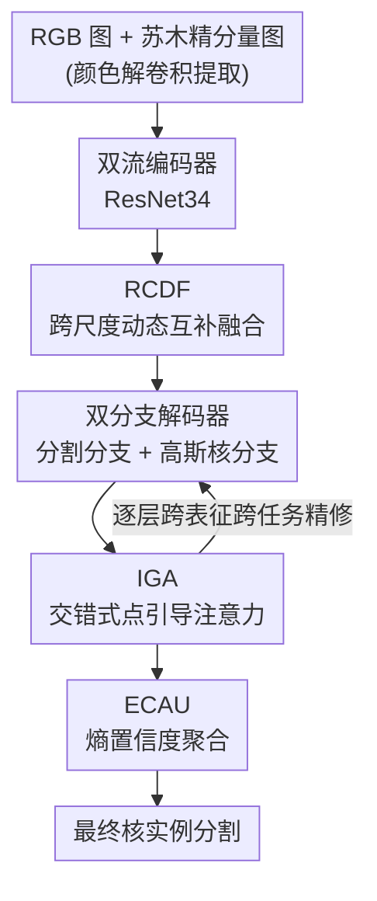

# Bridging RGB and Hematoxylin Components: An Interleaved Guidance and Fusion Framework for Point Supervised Nuclei Segmentation

**会议**: CVPR 2026  
**论文**: [CVF Open Access](https://openaccess.thecvf.com/content/CVPR2026/html/Huan_Bridging_RGB_and_Hematoxylin_Components_An_Interleaved_Guidance_and_Fusion_CVPR_2026_paper.html)  
**代码**: https://github.com/Hhhhzh/Weakly-nuclei-segmentation （论文称将开源）  
**领域**: 医学图像  
**关键词**: 弱监督分割, 点监督, 细胞核实例分割, 双表征融合, 病理图像

## 一句话总结
DFGNet 把 H&E 病理图的 RGB 图与从中分离出的苏木精（Hematoxylin）分量当成一对互补表征，用跨尺度动态融合（RCDF）、交错式点引导注意力（IGA）和熵置信度聚合（ECAU）三件套联合建模二者，在仅用点标注的弱监督设定下实现了三个公开核分割数据集上的 SOTA。

## 研究背景与动机

**领域现状**：组织病理切片中的细胞核实例分割是癌症诊断与下游形态学分析的基础。全监督方法（Hover-Net、SMILE 等）效果好，但依赖像素级标注，由病理专家逐核勾勒，成本极高、难以规模化。于是用稀疏点标注（每个核一个点）的弱监督方法成为务实方向。

**现有痛点**：现有点监督方法几乎都只用**单一图像表征**——要么用原始 RGB 病理图，要么用经染色分离得到的苏木精分量图——而忽略了两种表征之间的互补性。作者在 Fig.1 给了很直观的反例：绿框区域在 RGB 里看着像核其实是背景；蓝框区域在 RGB 里能分辨但在苏木精图里因为过染而难辨；黄框区域在苏木精图里像核但对照 RGB 才发现是背景。也就是说，**任一单表征都会在某些区域系统性出错，而另一表征往往恰好在那里是对的**。

**核心矛盾**：既然互补，为什么没人联合？因为联合并不平凡——RGB 与苏木精分量在外观、对比度、结构强调上差异很大，特征难以对齐、不能直接拼接相加；而且苏木精分量是用染色分离算法（颜色解卷积）算出来的，会引入噪声/伪影，进一步干扰双表征学习。直接 fusion 反而可能互相污染。

**本文目标**：在点监督这一弱标注约束下，设计一个能**稳健利用双表征互补、又不让二者噪声互相拖累**的统一框架，分解为三个子问题：跨表征/跨尺度怎么对齐融合、解码阶段两条任务路径怎么互相引导、最终两路预测怎么按可信度聚合。

**切入角度**：作者的关键观察是「互补缺陷」——两表征不是简单的冗余增强，而是各自有盲区且盲区互补。因此与其追求一次性硬融合，不如让两路在多个粒度上**有选择地互相借力**：融合时按尺度动态加权，解码时按任务交错引导，输出时按像素级不确定度加权。

**核心 idea**：用「跨尺度动态融合 + 交错点引导 + 熵置信聚合」三级互补机制，把 RGB 与苏木精分量从「两张图」桥接成「一对会互相纠错的表征」。

## 方法详解

### 整体框架

DFGNet（论文里也写作 DFG / interleaved guidance and fusion）的输入是一张 H&E 病理图：RGB 原图 $I$，以及从它颜色解卷积得到的苏木精分量图 $x_h$。两者分别送入共享结构的 ResNet34 编码器得到双流特征；编码特征先经 **RCDF** 做跨尺度动态互补融合；融合后送入一个**双分支解码器**——分割分支（SLayer）和高斯核预测分支（PLayer），两条分支在每一层通过 **IGA** 交错式互相引导精修；最后两个表征各自得到的分割 logit 由 **ECAU** 按像素级熵（不确定度）加权聚合，得到最终核实例分割。监督信号全部来自点标注衍生的伪标签（Voronoi / 聚类伪标签 + 高斯核标签）。

在进入三个核心模块前，有两步是标准的弱监督脚手架：**苏木精分量提取**用预定义染色矩阵 $W\in\mathbb{R}^{3\times3}$ 做简化颜色解卷积——先把 RGB 转伪光密度空间 $I_{OD}=-\alpha\cdot\log\!\big(\tfrac{I+\epsilon}{\beta}\big)$（$\alpha=\tfrac{255}{\log\beta},\ \beta=255$），再用 Moore–Penrose 伪逆 $W^+$ 线性分解 $C=I_{OD}\cdot W^+$，最后取 $x_h=\exp(-C[:,:,1])$ 得到苏木精通道，它丢掉部分颜色但增强了核-背景对比。**伪标签生成**沿用 Qu 等的做法，从核中心点生成 Voronoi 伪标签（按点划分凸区域）和聚类伪标签（点的距离变换与 H&E 图融合后 k-means 分成核/背景/忽略区），并对点用高斯核 $M(x,y)=\exp(-d^2/2\sigma^2)$（$d<r$ 时，否则 0）做平滑监督。

### 关键设计

**1. RCDF（Reciprocal Cross-scale Dynamic Fusion）：跨尺度动态融合，先各自增强再跨表征对齐**

针对的痛点是「RGB 与苏木精在不同尺度上的特征重要性会因染色差异而漂移、直接拼接不稳定」。RCDF 分三步把两路编码特征 $I_A, I_B$ 融成一份结构自适应的互补表征。第一步是**多尺度感知**：对每路用一组不同感受野的卷积并拼接，$F_{multi}(X)=\mathrm{Concat}\big(\{\phi_k(X)\}_{k\in Q}\big)$，其中 $\phi_k=\mathrm{Conv}_{k\times k}$（实现用 1×1/3×3/5×5），兼顾大小不一的核形态。第二步是**自增强**，用全局池化估计各尺度重要性并重加权：$F_{self}(X)=\sum_{i=1}^{3}\sigma_i\big(w_2\,R(w_1\,G(F_{multi}))\big)\,F^{(i)}(X)$，$G$ 是全局平均池化、$w_1,w_2$ 为可学习线性映射——这一步显式应对「尺度重要性漂移」。第三步是**跨表征自适应融合**：把两路自增强特征与多尺度特征拼成复合表征 $Z=[F^A_{self}\,\|\,F^B_{self}\,\|\,F_x]\in\mathbb{R}^{8d\times H\times W}$，再做两级注意力调制 $F_{CRFeature}=M_s\big(M_c(\mathrm{ReLU}(W_z * Z))\big)$（先精修跨特征互补、再强化结构一致性，$W_z$ 是 1×1 卷积降维），最后与原输入残差相加。与「两路特征直接相加/拼接」相比，RCDF 让融合在尺度维度上是动态加权的、在表征维度上是注意力筛选的，从而避免一方噪声直接污染另一方。

**2. IGA（Interleaved point-Guided Attention）：解码阶段让分割任务与点预测任务交错互引导**

针对的痛点是「弱监督下解码时注意力会弥散、伪标签有噪声，单独解码会退化」。作者把解码器拆成分割分支（SLayer）和高斯核/点预测分支（PLayer），并在每一对解码层之间插入 IGA，用**一方的点监督特征去引导另一方的分割特征**，公式为

$$\mathrm{out}=\rho\!\left(\alpha\!\left(\frac{(w^p_Q p)(w^p_K p)^\top}{\sqrt{d}}\right) w^s_V\, s\right)+s$$

其中 $s$ 是分割特征 sF、$p$ 是点监督特征 pF，$\alpha$ 是 softmax、$\rho$ 是 reshape，query/key 来自点分支、value 来自分割分支。关键在于「交错（interleaved）」：当 sF 取苏木精分量 H 的特征时，pF 就取 RGB（O）的特征，反之亦然——所以 IGA 同时跨了**两个表征**和**两个任务**，让点预测的定位先验去校正分割的边界，并在 RGB↔苏木精之间双向传递互补强度，同时保留各自已学到的优势特征（残差 $+s$ 保底）。消融显示把 IGA 插到四层解码器里效果单调累积，全插最好。

**3. ECAU（Entropy Confidence Aggregation Unit）：按像素级熵把两路预测做不确定度加权**

针对的痛点是「两路最终预测在不同区域可信度不同，简单平均会被低置信度一方拖累」。ECAU 不学融合权重，而是直接用**信息熵**度量逐像素不确定度并据此加权。对表征 $m\in\{H,O\}$ 的 logit 先 softmax 得概率 $p^{(c)}_m$，再算香农熵 $H_m(i,j)=-\sum_c p^{(c)}_m\log\big(p^{(c)}_m+\epsilon\big)$（熵越高越不确定）；融合权重取熵倒数的跨表征归一化：$w_m=\dfrac{\psi(H_m)}{\sum_{m'}\psi(H_{m'})}$，$\psi(H_m)=\tfrac{1}{H_m+\epsilon}$；最终预测 $\hat y^{(c)}=\sum_{m}w_m\,p^{(c)}_m$。这样高置信（低熵）区域被放大、不确定区域被抑制，让每个像素都由「当下更有把握的那个表征」主导，比固定权重或简单平均更稳健。

### 损失函数 / 训练策略

总损失把两路（RGB 记 O、苏木精记 H）的伪标签损失加起来：Voronoi/聚类伪标签用交叉熵 $L_{v/c}=\Lambda\sum_i[m_i\log p_i+(1-m_i)\log(1-p_i)]$（$\Lambda=-1/|R|$，忽略区不计入），高斯核分支用加权 MSE $L_{gauss}=\tfrac{1}{|\Omega|}\sum_i w_i(p_i-M_i)^2$（前景 $w_i=10$、背景 $w_i=1$ 以缓解前背景不平衡）。合并为

$$L=\lambda_1(L_{cO}+L_{cH})+(1-\lambda_1)(L_{vO}+L_{vH})+\lambda_2(L_{gaussO}+L_{gaussH})$$

训练用 ResNet34 backbone、Adam，分两阶段各 120 epoch，初始学习率/权重衰减 $1\times10^{-4}$、每阶段末 20 epoch 降到 $1\times10^{-5}$；点半径 $r=5$、高斯 $\sigma=3$；阶段一 $\lambda_1=\lambda_2=0.5$，阶段二 $\lambda_1$ 升到 0.6。

## 实验关键数据

数据集为 MoNuSeg(MO)、CPM17、CoNSeP 三个公开核分割基准；指标含像素级 Acc / F1，对象级 $\text{Dice}_{obj}$ / AJI，以及全景分割的 DQ / SQ / PQ。下标 O/H 分别代表 RGB 分支与苏木精分支单独输出（OFlow / HFlow），Final 为完整模型。

### 主实验（点监督下与 SOTA 对比，MO 数据集节选）

| 方法 | 类型 | Acc↑ | F1↑ | Dice_obj↑ | AJI↑ | PQ↑ |
|------|------|------|-----|-----------|------|-----|
| U-Net | 全监督 | 90.94 | 74.90 | 72.78 | 56.31 | 50.70 |
| Hover-Net | 全监督 | 94.35 | 81.39 | 80.42 | 61.19 | 59.71 |
| Qu (TMI'20) | 点监督 | 90.78 | 76.32 | 72.07 | 52.03 | 44.29 |
| BoNuS (TMI'24) | 点监督 | 89.97 | 74.91 | 71.36 | 50.16 | 48.62 |
| SCNet (MIA'23) | 点监督 | 90.08 | 73.48 | 66.04 | 42.33 | 49.75 |
| PUCD (AIIM'25) | 点监督 | 90.47 | 76.10 | 72.14 | 50.43 | 47.22 |
| **DFGNet (Final)** | 点监督 | **91.38** | **79.03** | **74.89** | **54.85** | **51.45** |

在 MO 与 CPM17 上 DFGNet 全指标点监督 SOTA；CoNSeP 上 Acc/F1 排第二、对象级指标仍最优。值得注意的是在 MO 上它四项指标超过了全监督 U-Net，但与更强的全监督 Hover-Net/SMILE 仍有差距（作者如实承认弱-全监督之间仍有 gap）。

### 消融实验（MO，逐组件，节选 Acc / Dice_obj）

| 配置 | Acc↑ | Dice_obj↑ | 说明 |
|------|------|-----------|------|
| 单表征 O（仅 RGB） | 90.13 | 72.87 | 单输入基线 |
| 单表征 H（仅苏木精） | 90.05 | 72.62 | 与 O 相近 |
| O&H + ECAU | 90.34 | 73.24 | 双表征 + 熵聚合 |
| O&H + ECAU + RCDF | 90.68 | 73.58 | 加跨尺度融合 |
| O&H + ECAU + IGA | 90.78 | 74.08 | 加交错引导 |
| + 交错学习(I) | 91.05 | 74.19 | 进一步互引导 |
| **Full（全模块）** | **91.38** | **74.89** | 全部叠加 |

> 注：Table 4 原表用 F/G/I/E 四列勾选表示 RCDF/IGA/交错学习/ECAU，上表按论文正文描述的累加顺序整理，具体勾选组合⚠️以原文为准。

### 关键发现
- **单表征 O 与 H 几乎打平**（72.87 vs 72.62 Dice_obj），印证了「各有盲区」的观察——谁也不全面占优，正是互补融合有意义的前提。
- **三个模块贡献可累加且互补**：从双表征基线 73.24 一路叠到 74.89，每加一个模块都涨，去掉任一都掉点，说明 RCDF/IGA/ECAU 解决的是不同环节的问题（融合/解码/输出）。
- **IGA 越多层越好**：插满四层解码层（Num=4）取得最佳，浅层深层都受益，说明跨表征互补在不同语义粒度上都成立。
- **对超参不敏感**：$\lambda_1,\lambda_2$ 在 0.3–0.7 区间 F1/Dice 波动 <3%，最佳在 $\lambda_1=0.6,\lambda_2=0.5$；$\lambda_1$ 偏高（重 Voronoi）易欠分割、偏低（重聚类）易过分割。
- **对标注偏移鲁棒**：把点扰动至多 20 像素模拟标注偏差，DFGNet 各指标的下降明显比 SCNet 平缓，贴近真实临床中标注不精的场景。

## 亮点与洞察
- **「互补缺陷」这个 framing 很到位**：不是把第二张图当锦上添花的增强，而是论证「单表征存在系统性盲区且盲区互补」，从而把双表征联合学习从可选项变成必要项——Fig.1 的四色框反例很有说服力。
- **熵加权融合（ECAU）是个轻量又通用的 trick**：不引入额外可学习参数，纯用 softmax 熵的倒数做逐像素加权，把「让更有把握的一方主导」做成无参操作，迁移到任何双/多分支预测聚合都成立。
- **IGA 的「交错」一举跨两个维度**：同一注意力同时跨表征（RGB↔苏木精）和跨任务（分割↔点预测），用点定位先验纠分割边界，是把多任务互助和多表征互补缝在一起的巧思。
- **可迁移性**：颜色解卷积得到「物理可解释的第二表征 + 熵加权聚合」这套组合，理论上能搬到任何存在一对互补成像/通道的弱监督密集预测任务（如多模态遥感、多染色病理）。

## 局限与展望
- 作者承认弱监督与全监督仍有明显 gap（落后 Hover-Net/SMILE 较多），点监督的天花板尚未触及。
- 方法强绑定 H&E 染色与苏木精分离——⚠️ 染色矩阵 $W$ 是预定义的，跨实验室/扫描仪的染色差异可能影响颜色解卷积质量，进而影响第二表征的可靠性（论文做了 stain normalization 但未深入讨论分离失败的情形）。
- 双流编码 + 双分支解码 + 逐层 IGA 带来的计算/显存开销论文未给量化（无 FLOPs/参数量/推理速度对比），实际部署成本存疑。
- CoNSeP 上 Acc/F1 仅第二，说明在某些组织类型上单纯堆互补未必全面占优，融合策略对数据分布仍有依赖。

## 相关工作与启发
- **vs 单表征 RGB 点监督（BoNuS / Qu / Wang-CAM）**：它们只在 RGB 上做伪标签精化或边界亲和力建模；本文额外引入苏木精分量并做跨表征互补融合，在 RGB 盲区（过染、伪核背景）上更稳。
- **vs 单表征苏木精点监督（DHNet / SCNet）**：DHNet 用辅助上色任务、SCNet 用 EMA 协同训练精化弱标签，但都只在苏木精域内；本文证明 RGB 与苏木精的盲区互补，联合优于任一单域，且对点偏移更鲁棒。
- **vs 全监督（Hover-Net / SMILE / Triple U-Net）**：Triple U-Net 也用苏木精分量但需像素级标注；本文在仅点标注下逼近甚至在 MO 上超过 U-Net，验证了「双表征互补」能部分补偿弱标注的信息缺口。

## 评分
- 新颖性: ⭐⭐⭐⭐ 「双表征互补缺陷」的 framing + 跨尺度融合/交错引导/熵聚合三级机制组合新颖，但各组件分别是已有思路的病理域定制。
- 实验充分度: ⭐⭐⭐⭐ 三数据集、七项指标、逐组件与逐层消融、超参敏感性与点偏移鲁棒性都做了；缺计算开销与跨染色泛化分析。
- 写作质量: ⭐⭐⭐⭐ 动机用反例图讲得清楚，公式完整；个别模块（RCDF 的维度记号）稍密。
- 价值: ⭐⭐⭐⭐ 点监督核分割是临床刚需，方法在标注偏移下鲁棒、且承诺开源，实用价值高。

<!-- RELATED:START -->

## 相关论文

- [\[CVPR 2026\] Bridging Brain and Semantics: A Hierarchical Framework for Semantically Enhanced fMRI-to-Video Reconstruction](bridging_brain_and_semantics_a_hierarchical_framework_for_semantically_enhanced_.md)
- [\[CVPR 2026\] A Semi-Supervised Framework for Breast Ultrasound Segmentation with Training-Free Pseudo-Label Generation and Label Refinement](a_semi-supervised_framework_for_breast_ultrasound_segmentation_with_training-fre.md)
- [\[AAAI 2026\] Bridging Vision and Language for Robust Context-Aware Surgical Point Tracking: The VL-SurgPT Dataset and Benchmark](../../AAAI2026/medical_imaging/bridging_vision_and_language_for_robust_context-aware_surgical_point_tracking_th.md)
- [\[CVPR 2026\] IVAAN: Instance-level Vision-Language Alignment via Attribute-Guided Text Prompts Generation for Nuclei Analysis](ivaan_instance-level_vision-language_alignment_via_attribute-guided_text_prompts.md)
- [\[CVPR 2026\] MambaLiteUNet: Cross-Gated Adaptive Feature Fusion for Robust Skin Lesion Segmentation](mambaliteunet_cross-gated_adaptive_feature_fusion_for_robust_skin_lesion_segment.md)

<!-- RELATED:END -->
