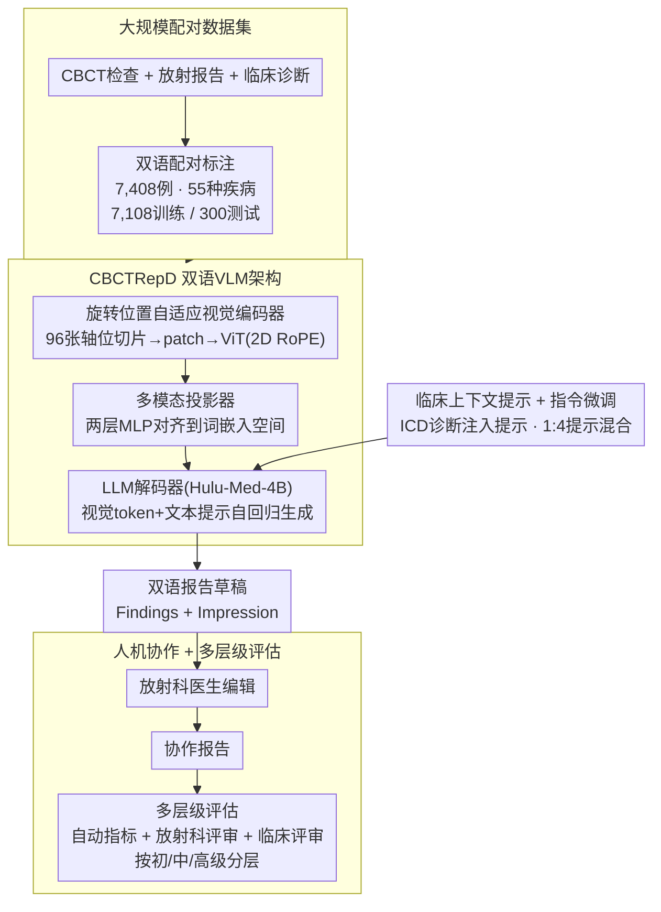

# Bridging the Skill Gap in Clinical CBCT Interpretation with CBCTRepD

**会议**: CVPR 2026  
**arXiv**: [2603.10933](https://arxiv.org/abs/2603.10933)  
**代码**: 无  
**领域**: 医学图像 / 报告生成  
**关键词**: CBCT, 口腔颌面报告生成, 双语系统, 人机协作, 多层级评估

## 一句话总结
构建覆盖55种口腔疾病的7,408例大规模CBCT-报告配对数据集，开发双语口腔颌面CBCT报告生成系统CBCTRepD，通过AI生成草稿+放射科医生编辑的协作模式，在多层级临床评估中证明其可帮助初级医生达到中级水平、中级医生接近高级水平、高级医生减少遗漏。

## 研究背景与动机

**领域现状**：生成式AI在医学报告自动生成领域发展迅速，胸部X光报告生成已有较多成熟工作（如CheXpert、RadFM等），但口腔颌面锥形束CT（CBCT）领域的报告生成仍处于早期阶段。

**现有痛点**：口腔颌面CBCT报告生成面临两大核心障碍——(1) 高质量配对CBCT-报告数据极度稀缺，现有公开数据集几乎不包含口腔颌面CBCT与报告的配对标注；(2) CBCT是三维体积数据，其解读复杂度远高于二维全景片或CT切片，涉及多个解剖区域和大量潜在病变类型，对AI建模提出更高要求。

**核心矛盾**：临床中不同经验水平的放射科医生对CBCT的解读能力差异显著。初级医生容易遗漏病灶、报告结构不规范；即使是高年资医生，也会因注意力分散而漏诊跨解剖区域的共存病变。AI辅助系统如果只追求"完全自动化"而不考虑与医生经验的结合，难以获得临床认可。

**本文目标**：在缺乏标准化数据的口腔颌面CBCT领域，构建实用的AI辅助报告系统，并通过严格的多层级临床评估量化其对不同经验层级医生的真实辅助效果。

**切入角度**：采用"AI先生成草稿、医生在此基础上编辑"的协作模式，而非追求全自动替代，更贴近临床实际工作流程。同时建立涵盖自动指标和人工评估的多层级评估框架。

**核心 idea**：用大规模配对数据集训练专业CBCT报告生成模型，以人机协作模式弥合不同经验层级放射科医生之间的报告质量差距。

## 方法详解

### 整体框架
这篇工作要解决的不是"再刷一个新的报告生成模型"，而是把口腔颌面CBCT的报告生成从无到有地落到临床里：先攒一份够大的配对数据，再训一个能吃三维CBCT体积、吐中英双语结构化报告的视觉-语言模型（VLM），最后嵌进放射科的真实工作流、用一套多层级评估去量化它到底帮了哪些医生、帮了多少。整条线是"数据集 → CBCTRepD 报告生成系统 → 人机协作 + 临床评估"。

报告生成系统 CBCTRepD 本身是一个四模块的 VLM：CBCT 体积被拆成有序的二维切片送进**旋转位置自适应视觉编码器**得到视觉 token，**多模态投影器**把视觉 token 对齐到语言模型的嵌入空间，再和文本提示（含临床诊断）一起喂给 **LLM 解码器**（Hulu-Med-4B）自回归地写出"发现（Findings）+ 结论（Impression）"双语报告。系统并不以"全自动替代医生"为目标：AI 先出一版草稿，放射科医生在草稿上审阅、修改，得到最终的协作报告（collaboration report）——评估也正是围绕"AI 草稿"和"协作报告"两种产物、按医生经验分层分别展开的。

### 关键设计

**1. 大规模口腔颌面CBCT-报告配对数据集：在一个几乎没有公开数据的细分领域先把地基打出来**

口腔颌面CBCT之所以一直没有像样的报告生成工作，根子在于数据——它是三维体积、解读复杂、标注又贵，现有公开数据集几乎不含CBCT与报告的配对。作者从浙江大学口腔医院回顾性收集了 7,408 例 CBCT 检查（来自 7,303 名患者）及其配套的放射报告与初始临床诊断，覆盖 55 种口腔疾病实体（阻生齿、根尖周炎、错颌畸形、龋齿、牙周病、颌骨囊肿等），呈典型长尾分布；每份报告都按临床规范拆成"发现（Findings）+ 结论（Impression）"两段，并做成中英双语标注。最终 7,108 例划为训练集、独立的 300 例作测试集。这个规模在口腔颌面CBCT这个细分领域属于首次达到的量级，55 种疾病的覆盖面直接决定了下游模型能不能扛住临床里五花八门的病例——数据的广度本身就是这篇工作最硬的贡献。

**2. CBCTRepD 双语VLM架构：用旋转位置自适应视觉编码器把三维CBCT直接喂给大语言模型**

有了数据，第二步是把"CBCT 体积 → 报告"这条路打通。难点在于 CBCT 是三维体积、分辨率与视野（FOV）还各不相同。CBCTRepD 的做法是把体积表示成有序的二维平面序列：从全扫描范围里均匀采样 96 张轴位切片（N=96，不足则全取、超出则均匀下采样），每张切片切成不重叠的固定尺寸 patch、线性投影成 patch token，再过 Vision Transformer（ViT），各平面 token 拼接成视觉 token 流。关键的一笔是**旋转位置自适应视觉编码器**（rotary position-adaptive visual encoder）用 2D 旋转位置编码（2D RoPE）替换掉学习式绝对位置嵌入——对位于网格坐标 $(m,n)$ 的 patch，沿高、宽两维各自施加 1D RoPE，把相对空间信息直接注入自注意力，因此编码器天然适配不同分辨率和 FOV 的 CBCT 平面，无需为每种分辨率重学位置嵌入。随后**多模态投影器**用两层 MLP（$g(f_v(\mathbf{v})) = W_2 \cdot \mathrm{GELU}(W_1 \cdot f_v(\mathbf{v}) + b_1) + b_2$）把视觉嵌入（维度 $d_v=1152$）对齐到语言模型的词嵌入空间，与文本提示 token 拼成一条多模态序列，交给 **LLM 解码器**（以医学 VLM **Hulu-Med-4B** 为骨干）自回归生成完整双语报告。整套是端到端解码、不引入任务专用结构改动，靠微调适配 CBCT 报告任务。

**3. 临床上下文提示 + 1:4 提示混合的指令微调：用上临床诊断，又不让模型偷懒抄诊断**

真实工作流里，临床诊断在影像解读时通常已经拿到，把它喂给模型理应有帮助。作者把临床诊断先归一到 ICD 标准术语，再塞进一个带显式字段头的结构化指令提示（模板形如 "Clinical Diagnosis: {诊断}. Provide a complete clinical CBCT report integrating findings and impression based on this 3D medical image"），以稳住模型对异质自由文本的反应。但只给"带诊断"的提示会让模型过度依赖诊断文本、而不去真正看影像，于是作者设计了**两种提示变体按 1:4 混合**——带诊断 : 不带诊断 = 1 : 4，逼模型主要从影像证据出报告、诊断只作辅助条件。指令微调语料为 7,108 例 × 中英双语 = 12,250 条多模态指令-响应样本，对 Hulu-Med-4B 做全参数指令微调。

**4. 人机协作工作流 + 多层级临床评估框架：用分层评估量化AI到底帮了谁**

如果只报一个 BLEU/ROUGE，根本看不出这套系统的临床价值，更看不出它对不同水平医生的差异化作用。作者把 CBCTRepD 嵌进还原真实临床次序的工作流：临床医生先问诊、做口内检查得到初始诊断 → 拍 CBCT → CBCTRepD 据"体积 + 初始诊断"生成草稿 → 放射科医生审阅修改成协作报告 → 返回临床医生。评估随之拆成三层并同时覆盖"AI 草稿"和"协作报告"两种产物：(a) 自动指标量文本质量；(b) 放射科医生中心评估，审准确性、完整性与规范性；(c) 临床医生中心评估，从临床决策角度判好不好用。更关键的是评估不报平均值，而是把医生按初级（住院医）、中级（早期主治）、高级（资深）分层统计——正是这种分层，才让"AI 把初级医生抬到接近中级、把中级抬到接近高级、给高级医生补漏"这种结论变得可见。这套"自动指标 + 放射科评审 + 临床评审 + 经验分层"的框架本身也能迁移到其他医学AI系统上。

### 训练策略
对 Hulu-Med-4B 做全参数指令微调，目标是标准的自回归下一 token 生成损失（报告按显式段头 "Findings:" / "Impression:" 拼成目标序列）。所有参数从 Hulu-Med-4B 预训练权重初始化，借其已有的医学视觉-语言表征作起点。用 PyTorch + DeepSpeed ZeRO-1，bf16（开 TF32），最大上下文 16,384 token（其中至多 10,240 token 分给多模态输入），在单卡 NVIDIA H200 上训 3 个 epoch，单设备 batch 2、梯度累积到等效全局 batch 128；优化器 AdamW + 余弦学习率（warmup 比 0.03、weight decay 0），LLM 解码器与多模态投影器学习率 $1\times10^{-5}$、视觉编码器 $2\times10^{-6}$；视觉输入固定 N=96 张切片、tokenize 前先做强度归一化以削弱扫描间差异。

## 实验关键数据

### 主实验：与通用 / 医学 VLM 对比（300 例测试集）

| 语言 | 模型 | BLEU-4 | ROUGE-L | METEOR | BERTScore |
|------|------|--------|---------|--------|-----------|
| 中文 | CBCTRepD | **0.311** | **0.497** | **0.528** | **0.825** |
| 中文 | Med3DVLM-7B-FT（最强3D医学基线） | 0.220 | 0.406 | 0.423 | 0.793 |
| 英文 | CBCTRepD | **0.126** | **0.371** | **0.341** | **0.892** |
| 英文 | Med3DVLM-7B-FT | 0.077 | 0.302 | 0.275 | 0.881 |

CBCTRepD 在中英双语上均全面超过 3D 医学基线与开源通用 VLM，n-gram 重叠、序列相似度、语义对齐三类指标一致提升。

### AI 草稿 vs 三层医生手写报告

| 对象 | BLEU-4 | ROUGE-L | 说明 |
|------|--------|---------|------|
| 初级（住院医）手写 | 0.07 | 0.28 | 显著低于 AI 草稿 |
| **CBCTRepD 草稿** | **0.30** | **0.47** | 接近中级水平 |
| 中级（早期主治）手写 | 0.23 | 0.41 | 与 AI 草稿相当 |
| 高级（资深）手写 | 0.36 | 0.54 | 最接近专家参考 |

安全性上，CBCTRepD 草稿被判为临床显著的遗漏比例（发现 19% / 结论 42%）远低于初级医生手写（69% / 61%）。

### 人机协作增益（协作报告 vs 对应层级手写）

| 医生层级 | BLEU-4 提升 | ROUGE-L 提升 | 说明 |
|---------|------------|-------------|------|
| 初级 | +129% | +29% | 提升最大，抬到接近中级水平 |
| 中级 | +16~35% | +20% | 接近高级水平 |
| 高级 | +11~17% | +11% | 仍有可测增益，主要靠减少遗漏 |

各层级协作报告被排到最低档的频率下降、进入更高偏好档的频率上升（放射科与临床评审者一致）。

### 关键发现
- AI生成的草稿在写作质量和规范化程度上已接近中级放射科医生，可作为可靠的起点
- 人机协作模式（AI草稿+医生编辑）一致地优于医生独立撰写，各经验层级均获益
- CBCTRepD特别有助于改善报告结构、减少遗漏、提升对跨解剖区域共存病变的注意力
- 即使对高年资医生，系统也能通过提示可能遗漏的病灶来产生临床有意义的帮助

## 亮点与洞察
- **数据贡献突出**：7,408例配对CBCT-报告数据覆盖55种疾病实体，是口腔颌面CBCT报告领域的重要基础设施
- **临床定位务实**：不追求全自动替代医生，而是定位为协作工具，AI生成草稿+医生编辑更容易获得临床采纳
- **分层评估设计精巧**：量化AI对初级/中级/高级三个层级医生的差异化增益，比单一平均性能数字更有说服力
- **关注遗漏类错误**：特别强调减少漏诊（包括跨解剖区域的共存病变），这是临床中最具安全风险的错误类型
- **评估框架本身有参考价值**：自动指标+放射科医生评估+临床医生评估的三层框架可以推广到其他医学AI系统

## 局限与展望
- 数据集局限于口腔颌面领域，泛化到其他CBCT应用场景（骨科、耳鼻喉科）需要额外验证
- 数据全部来自单一中心（浙江大学口腔医院），跨机构、跨设备的真实泛化能力仍待外部验证
- 7,408例虽在该细分领域属大规模，但相比通用医学报告生成的数据集（如MIMIC-CXR的200K+报告）仍有数量级差距
- 长期临床影响评估缺失——AI辅助是否会导致医生依赖性增强或技能退化，缺乏纵向研究
- 视觉输入固定采样 N=96 张轴位切片，切片数与采样策略对生成质量的影响未做系统消融
- 评估中仅涉及口腔颌面领域的放射科医生和临床医生，评审者数量和多样性报告有限

## 相关工作与启发
- **vs CheXpert/MIMIC-CXR报告生成**: 这些工作针对二维胸部X光片，数据规模更大但解读复杂度低于三维CBCT。CBCTRepD首次在三维口腔影像上实现了完整的报告生成和临床评估
- **vs RadFM等通用医学基础模型**: 通用模型覆盖面广但缺乏口腔颌面领域的专业深度。CBCTRepD通过专业数据集在特定领域取得了更贴近临床的效果
- **vs 传统CBCT辅助诊断**: 以往口腔AI工作多聚焦单一任务（如龋齿检测、根管分割），CBCTRepD向完整报告生成迈进了一步

## 评分
- 新颖性: ⭐⭐⭐ 方法层面创新中等（2D RoPE 视觉编码器 + 1:4 提示混合微调），核心贡献仍在大规模配对数据集与多层级评估框架的构建
- 实验充分度: ⭐⭐⭐⭐ 双语自动指标 + 三层医生对比 + 人机协作增益 + 遗漏安全性分析，分层设计扎实、有说服力
- 写作质量: ⭐⭐⭐⭐ 摘要结构清晰、信息密度高、临床价值论述充分
- 价值: ⭐⭐⭐⭐ 数据集和评估框架对口腔影像AI社区有直接推动作用，人机协作模式的验证对医学AI部署有参考意义

<!-- RELATED:START -->

## 相关论文

- [\[CVPR 2026\] SemiTooth: a Generalizable Semi-supervised Framework for Multi-Source Tooth Segmentation](semitooth_a_generalizable_semi-supervised_framework_for_multi-source_tooth_segme.md)
- [\[CVPR 2026\] Unsupervised Domain Adaptation with Target-Only Margin Disparity Discrepancy](unsupervised_domain_adaptation_with_target-only_margin_disparity_discrepancy.md)
- [\[CVPR 2026\] EchoAgent: Towards Reliable Echocardiography Interpretation with "Eyes", "Hands" and "Minds"](echoagent_towards_reliable_echocardiography_interpretation_with_eyeshands_and_mi.md)
- [\[CVPR 2026\] Unlocking Multi-Site Clinical Data: A Federated Approach to Privacy-First Child Autism Behavior Analysis](unlocking_multi-site_clinical_data_a_federated_approach_to_privacy-first_child_a.md)
- [\[CVPR 2026\] RelativeFlow: Taming Medical Image Denoising Learning with Noisy Reference](relativeflow_taming_medical_image_denoising_learning_with_noisy_reference.md)

<!-- RELATED:END -->
