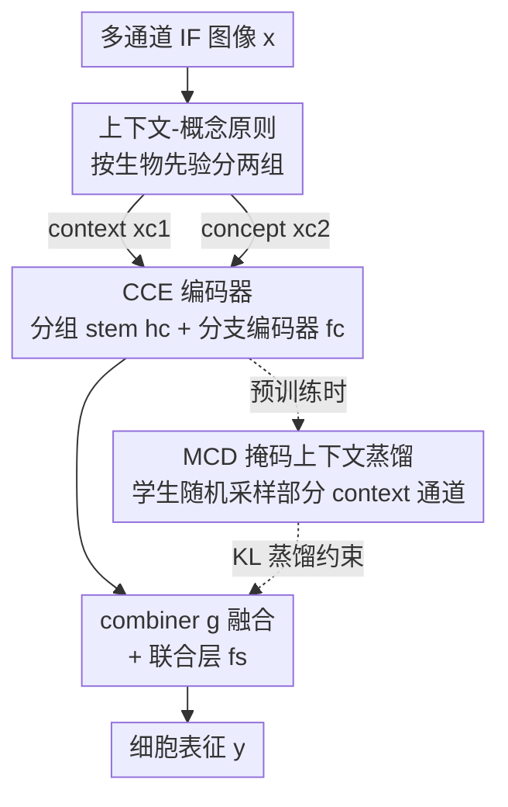

# Building Robust Vision Encoders for Cross-Dataset Evaluation in Immunofluorescent Microscopy

**会议**: CVPR 2026  
**论文**: [CVF Open Access](https://openaccess.thecvf.com/content/CVPR2026/html/Marikkar_Building_Robust_Vision_Encoders_for_Cross-Dataset_Evaluation_in_Immunofluorescent_Microscopy_CVPR_2026_paper.html)  
**代码**: https://github.com/umarikkar/C3R  
**领域**: 医学图像 / 自监督表示学习  
**关键词**: 免疫荧光显微、跨数据集泛化、通道自适应编码器、掩码蒸馏、细胞表征  

## 一句话总结
针对免疫荧光（IF）显微图像各实验室通道数与配置不一致、现有模型无法迁移到「训练时没见过的通道组合」的问题，本文提出 C3R：先用生物学先验把通道分成「上下文」与「概念」两组，再用分组独立编码的 CCE 架构 + 掩码上下文蒸馏 MCD 学表征，使冻结编码器无需重训就能在未见通道配置的 OOD 数据集上达到 SOTA。

## 研究背景与动机
**领域现状**：免疫荧光图像能揭示亚细胞结构与功能，是疾病预测、亚细胞定位、药物扰动预测等任务的重要数据源。当前主流范式是先在 IF 数据集上做自监督学习（SSL，如 DINO、iBOT），再在分布内（ID）和分布外（OOD）任务上评估，以此衡量这一领域的视觉基础模型。

**现有痛点**：不同实验室的染色方案会产生**不同的通道数与通道含义**（HPA 是 4 通道，JUMP-CP 是 5 通道，WTC-11 又不一样），而典型图像编码器都假设固定通道数。已有的通道自适应方法（ChannelViT、DiChaViT、ChAdaViT）虽能在多通道上训练，但它们把通道当成独立 token、给每个通道分配专属参数，**只能处理训练时见过的通道**——一旦评估数据集出现新通道配置就无法直接迁移，必须重训。单通道方法（逐通道独立处理）虽能直接迁移，却丢掉了通道间依赖。

**核心矛盾**：「跨数据集可迁移」与「捕捉通道间依赖」之间存在张力。固定通道编码器表达力强但绑死通道；逐通道处理能迁移但割裂了通道关系。现有工作既没给出对未见通道的 OOD 评估机制，也没利用 IF 图像通道本身的结构。

**切入角度**：作者观察到 IF 数据集的通道存在一种**内禀分组**，反映了实验设计的习惯——某些「上下文（context）」通道（如 Nucleus、Microtubules、ER 等结构标记）在数据集内跨图像高度一致，提供细胞的结构参照；另一些「概念（concept）」通道（如待测蛋白、扰动表型）携带实验特异的语义信息，需要相对上下文来解读。关键在于：这个 context/concept 的划分是**数据集相关**的（同一个 Nucleus 通道，在 WTC-11 里是 concept，在 HPA 里是 context），但「分成两组、概念依赖上下文」这件事本身在所有 IF 数据集上一致。

**核心 idea**：把「上下文-概念原则」同时注入**架构**和**预训练**——架构上分组独立编码再融合（CCE），预训练上让概念通道学会在「有限上下文」下也能贡献表征（MCD）。推理时遇到新通道，只需人工把它指派到 context 或 concept 组，无需重训即可评估。

## 方法详解

### 整体框架
C3R（Channel-Conditioned Cell Representations）是一个建立在「上下文-概念原则」之上的两件套框架：一个**通道自适应的编码器架构 CCE**，加一个**掩码上下文蒸馏的预训练策略 MCD**。骨干是 ViT，基础预训练管线用 iBOT + SubCell 抗体弱监督损失。

输入是一张多通道 IF 图像 $x = [x_{c1}, x_{c2}]$，其中 $x_{c1} \in \mathbb{R}^{C_1 \times h \times w}$ 是 context 组、$x_{c2} \in \mathbb{R}^{C_2 \times h \times w}$ 是 concept 组（$C_1, C_2$ 为两组各自的通道数，分组由数据集的实验设计决定）。CCE 先对两组分别做 group-wise 的卷积 stem 和轻量分支编码器，得到组内中间表征，再用 combiner 融合、过联合编码层得到全局表征 $y$。MCD 则在预训练时给学生网络**随机丢掉一部分 context 通道**、教师看完整 context，用 KL 蒸馏逼学生在「上下文不全」时也能靠 concept 通道撑起表征。推理阶段，遇到未见数据集时把新通道手动指派到两组之一，直接前向、不重训。

### 关键设计

**1. 上下文-概念原则：把 IF 通道按生物语义切成「参照组」与「读出组」**

这是整套方法的地基，针对的痛点是「现有方法把所有通道一视同仁、于是被训练时的通道配置绑死」。作者把 IF 通道分成两类：context 通道是结构/位置参照（如 Nucleus、Microtubules、ER），在数据集内跨样本视觉上高度稳定，承担分割、配准的空间参照；concept 通道是「读出」信号（如抗体靶标、化合物 MoA、基因型、病原体），其信号会随生物学关注因子变化，且必须**相对 context 来解读**。

关键洞察是：这个划分虽然**数据集相关**（Nucleus 在 HPA 里是 context、在 WTC-11 里是 concept），但「分两组 + concept 依赖 context」这个结构在所有 IF 数据集上通用。于是模型只要学会「如何处理两组之间的关系」，而不是「如何处理具体某些通道」，迁移时把新通道指派到对应组即可。这把一个「通道配置千变万化」的问题，归约成了「永远只有两组」的稳定问题——后面 CCE 和 MCD 都是在兑现这个原则。

**2. CCE（Context-Concept Encoder）：分组独立编码、再融合，让组别区分可迁移**

CCE 针对的是「既要捕捉通道间依赖、又要能迁移到未见通道」这对矛盾。它的做法是**先分后合**：给 context、concept 两组各配一套 group-specific 的卷积 stem（$h_{c1}, h_{c2}$）和轻量分支编码器（$f_{c1}, f_{c2}$），把每个通道独立 token 化、独立编码到一定深度，捕捉组内结构；再用 combiner 函数 $g$ 把两组中间表征合并，过联合编码层 $f_s$ 学组间依赖、得到全局表征。

token 化与组内编码：

$$\tilde{x}^i_{c1} = h_{c1}(x^i_{c1}) \in \mathbb{R}^{N \times d}, \quad \hat{x}^i_{c1} = f_{c1}(\tilde{x}^i_{c1}) \in \mathbb{R}^{N \times d}$$

融合与联合编码：

$$\hat{x} = g\big(\{\hat{x}^i_{c1}\}_{i=1}^{C_1}, \{\hat{x}^j_{c2}\}_{j=1}^{C_2}\big) \in \mathbb{R}^{N \times D}, \quad y = f_s(\hat{x}) \in \mathbb{R}^{D}$$

其中 $D = 2d$。和 ChannelViT 等把通道拼成长 token 序列、复杂度随通道数**二次增长**不同，CCE 让各通道独立过分支编码器，复杂度对通道数是**线性**的。更重要的是：因为它学的是「context 组 vs concept 组」这种跨数据集一致的区分，最终表征 $y$ 可直接迁移到含未见通道的数据集——只要把新通道指派进两组之一即可，而对手方法必须重训来匹配目标通道。作者通过「故意翻转分组指派会导致性能下降、且层数越深降得越多」的实验，验证了 $f_{c1}, f_{c2}$ 确实学到了组别特异的信息（见下文分析）。

**3. MCD（Masked Context Distillation）：用「有限上下文」逼概念通道学会自立**

MCD 是预训练策略，针对的痛点是「光有架构分组还不够，要让 concept 通道真正学会在上下文不全时也能扛起表征」。它基于 iBOT 的师生蒸馏，但在常规的裁剪+增广之外，引入了一个**新的 context 通道采样策略**：把图像取两个增广视图 $u, v$，假设学生看 $u$、教师看 $v$，则对学生输入的 context 组 $u_{c1}$ **无放回随机采样 $c$ 个通道**（$1 \le c \le C_1$），concept 组保持完整；教师看到完整 context。

$$u_{s,c1\text{-}smp} = \text{sample}(u_{c1}, c), \quad u_s = [u_{c1\text{-}smp}, u_{c2}], \quad v_t = [v_{c1}, v_{c2}]$$

学生和教师分别编码、过投影头得 $z_s, z_t$，蒸馏损失是二者的 KL 散度：

$$L_{MCD} = L_{KL}(z_t \,\|\, z_s) = \sum_{k=1}^{K} z_t(k) \log \frac{z_t(k)}{z_s(k)}$$

直觉是：学生在「上下文被削减」的情况下要去对齐看到完整上下文的教师，就被迫从 concept 通道里榨取出更多有用信息、让 concept 即便在有限 context 下也能有效贡献全局表征——产出更「概念驱动」、更稳健的表征。这正好呼应原则里「concept 依赖 context、但 context 跨样本高度一致（所以可以适度省略）」的观察。总损失把 MCD 与 iBOT 的掩码图像建模损失、SubCell 抗体弱监督损失相加：

$$L = L_{MCD} + L_{\text{iBOT-MIM}} + L_{\text{SubCell-WSL}}$$

所有对比方法和「CCE 不带 MCD」的变体都用同样的损失，只是把 MCD 损失换回 iBOT 原始的 KL 蒸馏。

### 损失函数 / 训练策略
预训练统一在 HPA 训练集（约 80 万张）上用 iBOT + SubCell 抗体损失进行。C3R 用 ViT-S 和 ViT-B，分支编码器 $f_c$ 深度设为 2、联合层 $f_s$ 深度设为 11，并通过调整层深使总参数量/FLOPs 与各 baseline 对齐，保证公平比较。MCD 中 context 通道的采样发生在前向之前，丢通道只作用于学生侧时效果最好（保住 concept、只削 context）。

## 实验关键数据

### 主实验
ID 用 HPA-Loc（蛋白定位，mAP），OOD（通道层面）用 JUMP-Ret（零样本化合物检索）与 CHAMMI-FE（冻结编码器评估）。C3R 在 HPA 上 4 通道预训练，**不针对目标做任何重训**；而 Base-CP*、SubCell* 等是重训来匹配目标通道配置的。

| 数据集 / 设置 | 指标 | C3R (ViT-B) | 重训基线 Base-CP* / SubCell* | 通道无关基线 ChannelViT |
|------|------|------|------|------|
| HPA-Loc（ID） | mAP-31 | **0.548** | SubCell* 0.519 | 0.438 (ViT-S) |
| HPA-Loc（ID） | mAP-19 | **0.737** | SubCell* 0.695 | 0.602 (ViT-S) |
| JUMP-Ret（OOD 通道） | mAP | **0.363** | Base-CP* 0.355 | 0.345 (ViT-S) |
| JUMP-Ret（OOD 通道） | kNN | **0.530** | Base-CP* 0.513 | 0.503 (ViT-S) |
| CHAMMI-FE | CPS | 0.543 (ViT-S) | — | 0.472 |

要点：在 JUMP-Ret 这种**完全零样本**检索上，C3R 不重训就追平甚至超过专门重训去匹配 JUMP-CP 通道的 Base-CP*；在 CHAMMI-FE 的综合分 CPS 上，C3R（ViT-S）0.543 大幅领先 ChannelViT 0.472、DiChaViT 0.459、Base-SC 0.474。JUMP-TRex（特征探针）上，C3R 在化合物匹配的全部实验、MoA 识别的 2/3 实验上都最优。

### 消融实验
逐组件叠加（ViT-B，Table 5）：

| 配置 | HPA-Loc mAP-31 | JUMP-Ret mAP | 说明 |
|------|------|------|------|
| Base-SC | 0.385 | 0.339 | 单通道基线 |
| + 分组 stem $h_c$ | 0.529 | 0.344 | 仅分组卷积 stem：ID 大涨，OOD 仅略超单通道基线、不及重训的 Base-CP |
| + 分支编码器 $f_c$ | 0.531 | 0.358 | 加入独立分支编码后 OOD 显著提升、追平/超过 Base-CP |
| + MCD | **0.548** | **0.363** | 完整 C3R，ID/OOD 进一步提升 |

MCD 单独消融（Table 6b，CHAMMI-FE）：去掉 MCD 时 CPS 仅 0.338，加上 MCD 跃升到 0.543——在需要可学习适配（MLP）的任务上 MCD 增益巨大。

### 关键发现
- **「分组」不等于「区分」**：仅有分组卷积 stem（$h_c$）只能提升 ID、OOD 仍弱，说明低层分组只帮了底层特征；真正学到 context-concept 区分、带来 OOD 跃升的是更深的**分支编码器 $f_c$**。
- **翻转分组会掉分，且越深掉得越多**：故意把 context/concept 指派对调后，JUMP-Ret 性能持续下降，且 $f_c$ 层数越多降幅越大——证明分支编码器确实编码了组别特异信息，而非单纯靠「训练时把通道分开」。
- **概念分支没见过的通道也能正确解读**：WTC-11 上把 Nucleus 当 concept（真值设置）F1 为 0.551，翻转成 context 后降到 0.536；而 C3R 预训练时（HPA）concept 分支从未见过 Nucleus 通道，说明 concept 分支学到的是「概念性信息」而非记住特定通道。
- **MCD 的增益依赖可学习适配**：MCD 在 4 个评估里 3 个（HPA-ID、CHAMMI-FE、JUMP-TRex）变好，唯独在纯零样本的 JUMP-Ret 上与不带 MCD 持平——所有 MCD 占优的任务都含 MLP 等可学习组件，纯零样本检索没有。作者把「纯零样本下预训练策略的表现」列为未来工作。⚠️ 这一 caveat 提示 MCD 的收益部分要靠下游探针释放。

## 亮点与洞察
- **把领域先验变成可迁移的归纳偏置**：与其设计「能吃任意通道数」的通用编码器，不如认清 IF 通道恒为「参照 + 读出」两类，于是把无穷的通道配置归约成永远两组的稳定结构——这是本文最巧的一步，迁移时只需指派而无需重训。
- **复杂度从二次降到线性**：分支编码器让每通道独立过编码，复杂度对通道数线性，相比 ChannelViT 把通道拼长序列的二次复杂度更可扩展。
- **MCD 是「逆向 dropout」的蒸馏**：常规蒸馏靠裁剪/增广制造师生差异，MCD 额外**只削学生的 context 通道**、逼 concept 自立，机制干净且与「context 跨样本高度一致所以可省」的观察自洽，这个「按语义分组做非对称掩码」的思路可迁移到任何「有稳定参照通道 + 变化读出通道」的多通道场景（如遥感、气候多波段）。
- **冻结编码器评估（CHAMMI-FE）**：作者改造 CHAMMI，用固定特征上训 2 层 MLP、禁止编码器/stem 微调，从而真正模拟「编码器面对未见通道配置」，比原 benchmark 更能暴露迁移能力——这个评测设定本身是有价值的贡献。

## 局限与展望
- **纯零样本上 MCD 不灵**：MCD 的收益基本要靠下游可学习适配释放，在 JUMP-Ret 这种无训练数据的零样本检索上与不带 MCD 持平，作者承认并留作未来工作。
- **分组需人工指派**：推理时把新数据集的通道指派到 context/concept 仍需领域专家判断，未实现自动分组；指派错误会掉分（翻转实验已证明）。
- **仅限 IF/细胞显微领域验证**：「上下文-概念原则」的普适性只在几个 IF 数据集上验证，是否能推广到其他多通道成像（如组织病理、遥感）尚待检验。
- **依赖既有预训练管线**：方法建立在 iBOT + SubCell 抗体损失之上，弱监督抗体信号的可得性可能限制在更弱标注场景下的应用。

## 相关工作与启发
- **vs ChannelViT / DiChaViT / ChAdaViT**：它们逐通道 token 化、给每通道分配专属参数，靠采样/正则促进通道多样性，但**绑死训练时见过的通道**、且 token 序列随通道数二次增长。C3R 改为「两组」抽象，复杂度线性、且能迁移到未见通道。
- **vs SubCell / DINO4Cells**：SubCell 用抗体监督对比损失、DINO4Cells 用 DINO 学无偏形态特征，二者在 ID/OOD 上都强，但**评估 OOD 时要重训**模型来匹配目标通道配置（如 SubCell 把 3 通道模型重训、复制蛋白通道 3 次凑齐 JUMP 的 5 通道）。C3R 冻结编码器、零重训就追平甚至超过它们。
- **vs 单通道方法（Base-SC 等）**：单通道处理虽能直接迁移，却丢掉通道间依赖、整体偏弱；C3R 通过 CCE 的联合层显式建模组间依赖，在保持可迁移的同时补回了依赖信息。

## 评分
- 新颖性: ⭐⭐⭐⭐⭐ 把「上下文-概念」生物学先验同时注入架构与预训练，并据此实现无需重训的跨通道 OOD 评估，角度新且自洽。
- 实验充分度: ⭐⭐⭐⭐ ID/OOD/检索/探针多设置 + 逐组件消融 + 翻转分组验证，较扎实；但纯零样本上 MCD 收益缺失、依赖 supplementary 的实现细节略多。
- 写作质量: ⭐⭐⭐⭐ 原则—架构—训练三段逻辑清晰，公式与符号规范；部分组件（combiner g、stem 细节）下放到附录，正文略简。
- 价值: ⭐⭐⭐⭐ 为 IF 显微的跨数据集泛化开了「免重训」新路径，CHAMMI-FE 评测设定与「语义分组非对称掩码」思路对多通道领域有迁移价值。

<!-- RELATED:START -->

## 相关论文

- [\[CVPR 2026\] MuViT: Multi-Resolution Vision Transformers for Learning Across Scales in Microscopy](muvit_multi-resolution_vision_transformers_for_learning_across_scales_in_microsc.md)
- [\[CVPR 2026\] Are General-Purpose Vision Models All We Need for 2D Medical Image Segmentation? A Cross-Dataset Empirical Study](are_general-purpose_vision_models_all_we_need_for_2d_medical_image_segmentation_.md)
- [\[CVPR 2026\] MambaLiteUNet: Cross-Gated Adaptive Feature Fusion for Robust Skin Lesion Segmentation](mambaliteunet_cross-gated_adaptive_feature_fusion_for_robust_skin_lesion_segment.md)
- [\[AAAI 2026\] Bridging Vision and Language for Robust Context-Aware Surgical Point Tracking: The VL-SurgPT Dataset and Benchmark](../../AAAI2026/medical_imaging/bridging_vision_and_language_for_robust_context-aware_surgical_point_tracking_th.md)
- [\[CVPR 2026\] X-WIN: Building Chest Radiograph World Model via Predictive Sensing](x-win_building_chest_radiograph_world_model_via_predictive_sensing.md)

<!-- RELATED:END -->
