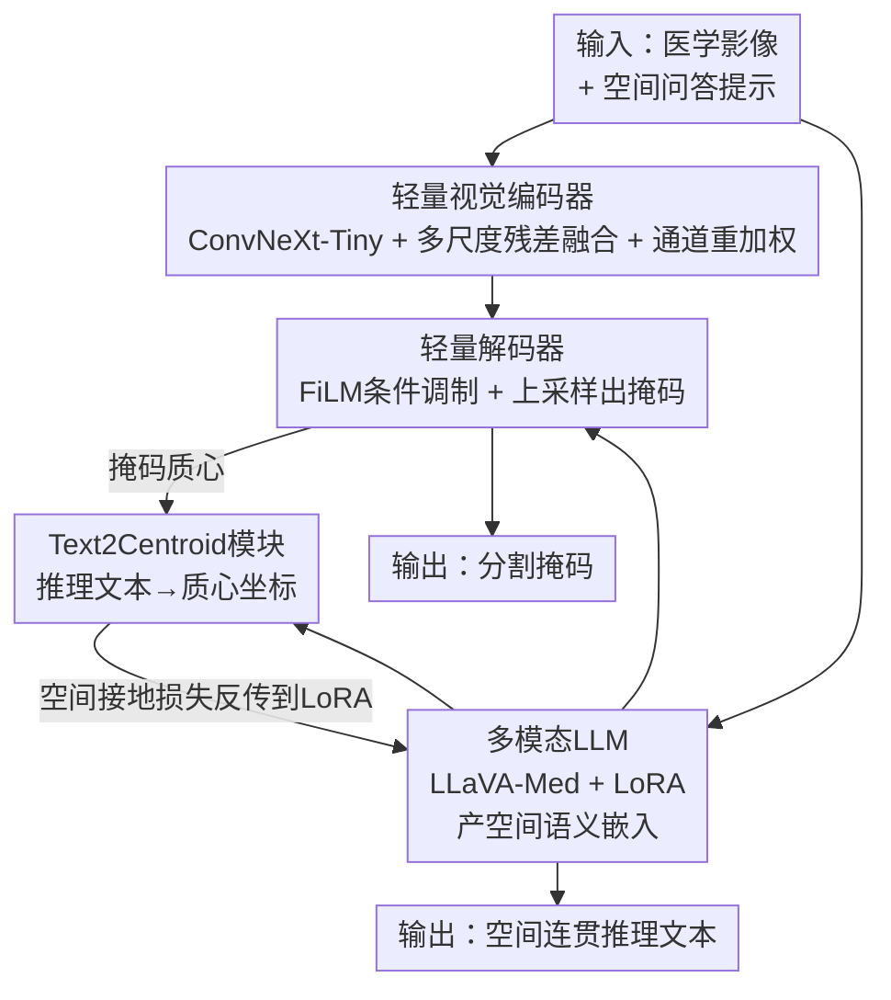

# CG-Reasoner: Centroid-Guided Positional Reasoning Segmentation for Medical Imaging with a Robust Visual-Text Consistency Metric

**会议**: CVPR 2026  
**论文**: [CVF Open Access](https://openaccess.thecvf.com/content/CVPR2026/html/Polamreddy_CG-Reasoner_Centroid-Guided_Positional_Reasoning_Segmentation_for_Medical_Imaging_with_a_CVPR_2026_paper.html)  
**代码**: https://github.com/lpmm2025/CGReasoner  
**领域**: 医学图像  
**关键词**: 医学图像分割, 位置推理, 多模态LLM, 质心引导, 跨模态评估  

## 一句话总结
CG-Reasoner 用一个轻量编码器-解码器接 LLaVA-Med，再加一个把推理文本回归成病灶质心坐标的 Text2Centroid 模块，让模型在分割掩码之外还能产出"空间上对得上病灶位置"的可解释推理文本，并配套提出 PRScore 同时度量语义+空间+视觉三者一致性；在六种医学影像模态上分割和推理都接近/超过 SOTA。

## 研究背景与动机
**领域现状**：医学图像分割主流是全监督的 U-Net / nnU-Net / Swin-UNet 这类纯像素级网络，最近也有 MedSAM、SAM-Med2D 这种可点/框提示的基础模型，以及 BiomedParse 这种用文本提示推断形状位置的工作。

**现有痛点**：这些方法只优化像素重叠（Dice/IoU），不会"说话"——无法用人能看懂的语言描述病灶在解剖结构里的相对位置。而临床上放射科医生写报告恰恰依赖这种空间描述（"病灶在右上叶"）。即使是把分割和语言拼在一起的 VLM 方案，往往也是视觉模块出掩码、语言模块各说各的，生成的文字和真实病灶位置在空间上对不上。

**核心矛盾**：推理（文本）和分割（几何）被当成两个独立任务来做，两者之间没有显式的空间约束，于是文字可以说"在左上"而掩码实际在右下，却没人惩罚这种错误——因为 Dice/IoU 根本不看文字，BLEU/ROUGE 只看 n-gram 重叠不看几何。最接近的前作 PRS-Med 用 ChatGPT 给出二元 Yes/No 判推理对错，太粗、不稳、抓不到语义和空间的细差。

**本文目标**：(1) 在一个统一框架里同时产出准确掩码 + 空间连贯的推理文本；(2) 提供一个能同时考核语义忠实度、空间推理、视觉落地的客观可复现指标。

**切入角度**：作者的关键观察是——掩码的**质心坐标**是连接"语言里的方位词"和"图像里的实际位置"的最自然桥梁。如果能把推理文本直接回归到一个归一化的 2D 质心，就能用几何距离去监督语言，让"top-right"这种描述真正落到右上。

**核心 idea**：用一个 Text2Centroid 模块把推理文本映射成质心坐标，把这个空间对齐信号反传进 LLM 的 LoRA 适配器，从而让语言推理"被几何接地"；并用同一个质心思路构造 PRScore 来评测。

## 方法详解

### 整体框架
CG-Reasoner 把视觉与语言推理统一在一个框架里，由四个组件串成：**轻量视觉编码器**抽取多尺度解剖特征；**多模态 LLM（LLaVA-Med + LoRA）**读入描述肿瘤/结构空间位置的问答（QA）提示，产出带空间意图的语义嵌入；**轻量解码器**用跨模态注意力把语言嵌入和视觉特征融合，生成边界精确、与文本意图一致的分割掩码；**Text2Centroid（T2C）模块**则把推理文本回归成病灶质心，作为空间监督信号反传，逼着语言推理和视觉定位在几何上对齐。输入是一张医学影像 + 一条空间问答提示，输出是分割掩码 + 空间连贯的推理文本。LLM 只用 LoRA（rank=16）微调一小撮参数，避免重训整个大模型。

### 关键设计

**1. 轻量视觉编码器：在便宜的骨干上找回被深层抹掉的解剖边界**

针对"医学分割要细边界但又不想堆大模型"的矛盾，编码器以 ConvNeXt-Tiny 为骨干，在其上加三件事：特征精炼、多尺度融合、通道注意力。对第 $i$ 个选中的 ConvNeXt 阶段（$i\in\{1,2,3\}$），先用「卷积–BN–ReLU」块精炼出 $R_i$ 把深层丢失的细微边界和纹理找回来，再双线性上采样后残差融合：

$$F_{\text{fused}} = R_1 + \text{Up}(R_2) + \text{Up}(R_3)$$

其中 $\text{Up}(\cdot)$ 是双线性插值做空间对齐。融合后再过一个自适应通道重加权（全局平均池化 + 非线性变换）放大有用通道、压掉冗余通道。这样在很小算量下拿到既有局部结构线索又有全局语义、且边界感知的视觉嵌入，跨模态（CT/MRI/X 光等）也更稳。消融里 ConvNeXt-Tiny 相比 Tiny-SAM、Med-SAM、Swin-UNet 在六模态上 mDice/mIoU 普遍最高，是作者选它当骨干的实证依据。

**2. 轻量解码器：用 FiLM 把语言意图"调"进视觉流**

针对"掩码要听文字的话、但又要算得起"，解码器分三步把语言落到像素。先做 prompt projection：给定 LLM 输出的 prompt 嵌入 $P\in\mathbb{R}^{B\times T\times d_p}$，把每个 token 投到视觉特征维 $d_v$ 并跨 $T$ 个 token 取均值得到聚合表示

$$\mathbf{z}_p = \frac{1}{T}\sum_{t=1}^{T} \phi\!\left(\mathrm{LN}(\mathbf{P}_t \mathbf{W}_p)\right)$$

其中 $\mathbf{W}_p\in\mathbb{R}^{d_p\times d_v}$ 是可学投影矩阵，$\mathrm{LN}$ 是层归一化，$\phi$ 是 GELU。再用 **FiLM（Feature-wise Linear Modulation）** 注入语言：一个轻量 MLP 把 prompt 描述子 $\mathbf{z}_p$ 变成逐通道的缩放和偏置参数，对视觉特征做仿射调制；调制后的特征再经深度可分离卷积 + MixFFN 块做空间交互，最后用转置卷积逐级上采样、接一个带 sigmoid 的卷积头出掩码。FiLM 的好处是用极少参数就能把"文字说的是哪儿"作为条件耦合进视觉，而不是简单拼接，从而做到上下文感知、边界精确又轻量。

**3. Text2Centroid（T2C）模块：把方位词回归成坐标，给语言一个几何把手**

这是全文的核心创新，针对的痛点是"语言和掩码在空间上对不上、且没有信号去纠正它"。T2C 是个轻量回归网络：训练时把每条推理句 $T_i$ 配上它对应掩码 $M_i$ 的质心 $(x_c,y_c)$ 作为空间监督，坐标线性归一化到 $[-1,1]$（左上对应 $(-1,1)$、右下对应 $(1,-1)$）。结构是一个**冻结的 Sentence-BERT** 编码器接一个多层回归头，用 Smooth L1 损失对齐预测质心和真值：

$$\mathcal{L}_{\text{T2C}} = \frac{1}{N}\sum_{i=1}^{N} \mathcal{S}_{\text{L1}}\!\left((\hat{x}_{c,i}, \hat{y}_{c,i}), (x_{c,i}, y_{c,i})\right)$$

预训练极便宜（单张 A100、10 epoch、约 10 分钟），训完**冻结**接进整个框架。此后给一段预测推理文本和它的参考文本，T2C 各自产出空间嵌入（即预测/真值方位向量），两者相似度就是空间推理一致性分。在端到端微调时，这个空间对齐信号**反传进 LLaVA + LoRA 的可训练文本编码器**——这正是让"top-right"真正落到右上的那根线：语言被几何接地。消融（表 4）显示去掉 T2C 后六个数据集 PRScore 全线下降（如 Lung X-ray 0.728→0.700）。

### 损失函数 / 训练策略
总损失三项联合优化视觉精度与空间可解释性：

$$\mathcal{L}_{total} = \lambda_{seg}\mathcal{L}_{seg} + \lambda_{txt}\mathcal{L}_{txt} + \lambda_{spatial}\mathcal{L}_{spatial}$$

其中 $\mathcal{L}_{seg}$ 是 Dice + BCE 保边界精度；$\mathcal{L}_{txt}$ 是生成 QA token 与参考的交叉熵保文字临床连贯；$\mathcal{L}_{spatial}$ 来自冻结的 T2C，强制 LLM 语言推理与掩码空间定位的几何对齐，且**直接监督 LLaVA-Med 里的 LoRA 适配器**。训练用 2×A100 80GB、20 epoch、batch=4、AdamW、lr=1e-4，约两天，通常在 epoch 18 选最优 checkpoint；LoRA rank=16、α=16、dropout=0.05。⚠️ 三个 $\lambda$ 的具体取值原文未给，以原文为准。

### PRScore：一个把语义、空间、视觉拧成一股的评测指标
作者另起一节定义评测指标 PRScore，把分割-推理系统的一致性拆成三个归一化到 $[0,1]$ 的分量。先定义余弦与归一化余弦：$\operatorname{cos}(\mathbf{u},\mathbf{v})=\frac{\mathbf{u}^\top\mathbf{v}}{\|\mathbf{u}\|\|\mathbf{v}\|}$，$\operatorname{ncos}(\mathbf{u},\mathbf{v})=\tfrac{1}{2}(\operatorname{cos}+1)\in[0,1]$。语义分 $S_{\text{sem}}$ 用 SBERT 嵌入算预测与真值推理文本的句级相似度。空间分把方向一致和距离一致各占一半：

$$S_{\text{spatial}} = \tfrac{1}{2}\big[\operatorname{ncos}(\mathbf{p}_{\text{gt}},\mathbf{p}_{\text{pred}}) + (1 - d(\mathbf{p}_{\text{gt}},\mathbf{p}_{\text{pred}}))\big]$$

其中 $\mathbf{p}$ 是 T2C 把文本映成的归一化坐标嵌入，$d(\cdot,\cdot)$ 是归一化到 $[0,1]$ 的欧氏距离。视觉落地分把预测文本坐标和**生成掩码质心** $\mathbf{m}$ 对齐：

$$S_{\text{vis}} = \tfrac{1}{2}\big[\operatorname{ncos}(\mathbf{p}_{\text{pred}},\mathbf{m}) + (1 - d(\mathbf{p}_{\text{pred}},\mathbf{m}))\big]$$

最终等权合成 $\text{PRScore} = \alpha S_{\text{sem}} + \beta S_{\text{spatial}} + \gamma S_{\text{vis}}$，取 $\alpha=\beta=\gamma=\tfrac{1}{3}$ 避免偏向任何单一模态。相比 BLEU/ROUGE（只看 n-gram、不惩罚"左上说成右下"）和 LLM-as-Judge（主观、依赖评测模型版本），PRScore 全自动、可复现、无 API 延迟，且会显式惩罚空间错误。

## 实验关键数据

### 主实验（分割：六模态 mDice/mIoU）
六个数据集覆盖 CT/MRI/X 光/超声/内窥镜/RGB（数据来自 PRS-Med 的合并集）。

| 数据集 | 指标 | CG-Reasoner | PRS-Med | BiomedParse | 说明 |
|--------|------|------|---------|-------------|------|
| Lung X-ray | mDice / mIoU | **0.977 / 0.958** | 0.969 / 0.942 | 0.972 / 0.949 | 全场最高 |
| Lung CT-Scan | mDice / mIoU | **0.970 / 0.948** | 0.968 / 0.943 | 0.088 / 0.061 | 最高 |
| Brain MRI | mDice / mIoU | **0.819 / 0.731** | 0.803 / 0.757 | 0.294 / 0.245 | mDice 最高 |
| Skin RGB | mDice / mIoU | 0.904 / 0.840 | 0.875 / 0.799 | **0.924 / 0.867** | 次于 BiomedParse |
| Breast Ultrasound | mDice / mIoU | 0.765 / 0.669 | **0.817 / 0.729** | 0.783 / 0.698 | 略低 |
| Polyp Endoscopy | mDice / mIoU | 0.716 / 0.636 | **0.843 / 0.791** | 0.824 / 0.774 | 略低 |

结论：在轻量架构下，CG-Reasoner 在 Lung X-ray / Lung CT / Brain MRI 三个数据集刷到最高，超声和内窥镜两处略逊于 PRS-Med，整体在精度与算量之间取得好平衡。

### 推理实验（PRScore，六模态，越高越好）

| 方法 | Breast US | Brain MRI | Lung CT | Lung X-ray | Polyp | Skin RGB |
|------|-----------|-----------|---------|------------|-------|----------|
| LISA-7B | 0.361 | 0.406 | 0.694 | 0.356 | 0.304 | 0.236 |
| PRS-Med | 0.729 | 0.712 | 0.830 | 0.697 | **0.734** | **0.735** |
| CG-Reasoner | **0.755** | **0.722** | **0.847** | **0.728** | 0.732 | 0.730 |

六个里四个超过 PRS-Med，且对 LISA-7B 全面大幅领先；Polyp/Skin 上仅微弱落后（0.732 vs 0.734、0.730 vs 0.735）。

### 消融实验

| 配置 | Breast US | Brain MRI | Lung CT | Lung X-ray | Polyp | Skin RGB |
|------|-----------|-----------|---------|------------|-------|----------|
| w/o Text2Centroid | 0.721 | 0.705 | 0.832 | 0.700 | 0.723 | 0.719 |
| Full（含 T2C） | 0.755 | 0.722 | 0.847 | 0.728 | 0.732 | 0.730 |

去掉 T2C 后六个数据集 PRScore 全线下降，证明空间接地信号对"位置感知推理"贡献实打实。骨干消融（表 5/6）里 ConvNeXt-Tiny 相比 Tiny-SAM/Med-SAM/Swin-UNet 在多数模态 mDice/mIoU 最高，支撑了骨干选择。

### 关键发现
- **T2C 是推理质量的主要来源**：移除它语义可能仍对，但空间精度明显变差——说明"几何接地"而非"更大语言模型"才是位置推理的关键。
- **轻量也能打**：相比 G-Dino+SAM-Med2D、LISA-13B 等更重的模型，CG-Reasoner 在多个数据集反而更高，且只 LoRA 微调。
- **模态差异明显**：在 Lung X-ray/CT 这类对比度高、结构清晰的模态上接近饱和（>0.97 Dice），而 Polyp 内窥镜/超声这类边界模糊处略逊 PRS-Med，是后续主攻点。

## 亮点与洞察
- **质心当"语言↔几何"的接头**：把一句推理文本回归成一个归一化 2D 质心，是个极简却到位的桥——既能反传监督语言（让 LoRA 学会空间接地），又能直接拿来构造评测分。一个模块同时服务训练和评估，复用得很巧。
- **评测指标自己造、还自洽**：PRScore 用同一个 T2C 把文本和掩码都投到坐标空间，于是"文字说左上、掩码在右下"会被距离项直接扣分，补上了 Dice/BLEU 各自看不到的那一半。
- **可迁移性**：把"输出回归成几何锚点 + 用几何距离反传监督语言"的思路，可挪到任何需要"语言描述要对得上空间位置"的任务（如遥感目标描述、文档版面定位、机器人指代）。

## 局限与展望
- 作者自陈未来要把"病灶相对周围解剖结构"的描述也纳入，说明当前推理还停留在粗方位（top-right 这类绝对方位），尚未做到真正的相对解剖关系推理。
- T2C 只回归单个质心，对多病灶、非凸或环形结构（质心可能落在病灶外）天然乏力；⚠️ 原文未讨论多目标情形。
- PRScore 的空间/视觉分都建立在 T2C 的坐标映射上，若 T2C 在某模态拟合不好，评测本身会被带偏——指标与被评模型共享了同一个空间先验，存在一定循环依赖风险。
- 超声/内窥镜上分割落后 PRS-Med 较多（如 Polyp mDice 0.716 vs 0.843），轻量骨干在弱边界模态上的上限值得关注。

## 相关工作与启发
- **vs PRS-Med**：同样做"医学位置推理分割"，但 PRS-Med 的推理文本常和真值语义不近，且用 ChatGPT 的 Yes/No 来评、不稳也不细；CG-Reasoner 用 T2C 显式做语义+空间接地，并用可复现的 PRScore 取代 LLM 主观打分。
- **vs LISA / LISA++ / PixelLM**：这些通用域的 [SEG] token / embedding-as-mask / token-to-pixel 方案不针对方位线索和医学词汇；CG-Reasoner 专攻医学位置推理，且把空间一致性写进损失。
- **vs MedSAM / SAM-Med2D / BiomedParse**：那些靠点/框/文本提示出掩码，但不把推理和分割统一、也不输出空间连贯的解释文本；本文把"会说话且说得对位置"作为一等目标。

## 评分
- 新颖性: ⭐⭐⭐⭐ Text2Centroid 把推理文本回归成质心、再用同一思路造评测指标，切入点小而巧。
- 实验充分度: ⭐⭐⭐⭐ 六模态分割+推理双任务对比，含骨干和 T2C 两组消融；但缺超参敏感性、多病灶情形和可视化主文呈现。
- 写作质量: ⭐⭐⭐⭐ 框架与公式清楚，但部分实现细节（损失权重、PRScore 与模型共享 T2C 的潜在循环）交代不足。
- 价值: ⭐⭐⭐⭐ 面向报告生成的"可解释+位置感知"分割是真实临床刚需，轻量设计也利于落地。

<!-- RELATED:START -->

## 相关论文

- [\[CVPR 2026\] OmniFM: Toward Modality-Robust and Task-Agnostic Federated Learning for Heterogeneous Medical Imaging](omnifm_toward_modality-robust_and_task-agnostic_federated_learning_for_heterogen.md)
- [\[CVPR 2026\] VoxTell: Free-Text Promptable Universal 3D Medical Image Segmentation](voxtell_free-text_promptable_universal_3d_medical_image_segmentation.md)
- [\[CVPR 2026\] PGR-Net: Prior-Guided ROI Reasoning Network for Brain Tumor MRI Segmentation](pgr-net_prior-guided_roi_reasoning_network_for_brain_tumor_mri_segmentation.md)
- [\[CVPR 2026\] IBISAgent: Reinforcing Pixel-Level Visual Reasoning in MLLMs for Universal Biomedical Object Referring and Segmentation](ibisagent_reinforcing_pixel-level_visual_reasoning_in_mllms_for_universal_biomed.md)
- [\[CVPR 2026\] Attention Consistent Longitudinal Medical Visual Question Answering Guided by Vision Foundation Models](attention_consistent_longitudinal_medical_visual_question_answering_guided_by_vi.md)

<!-- RELATED:END -->
