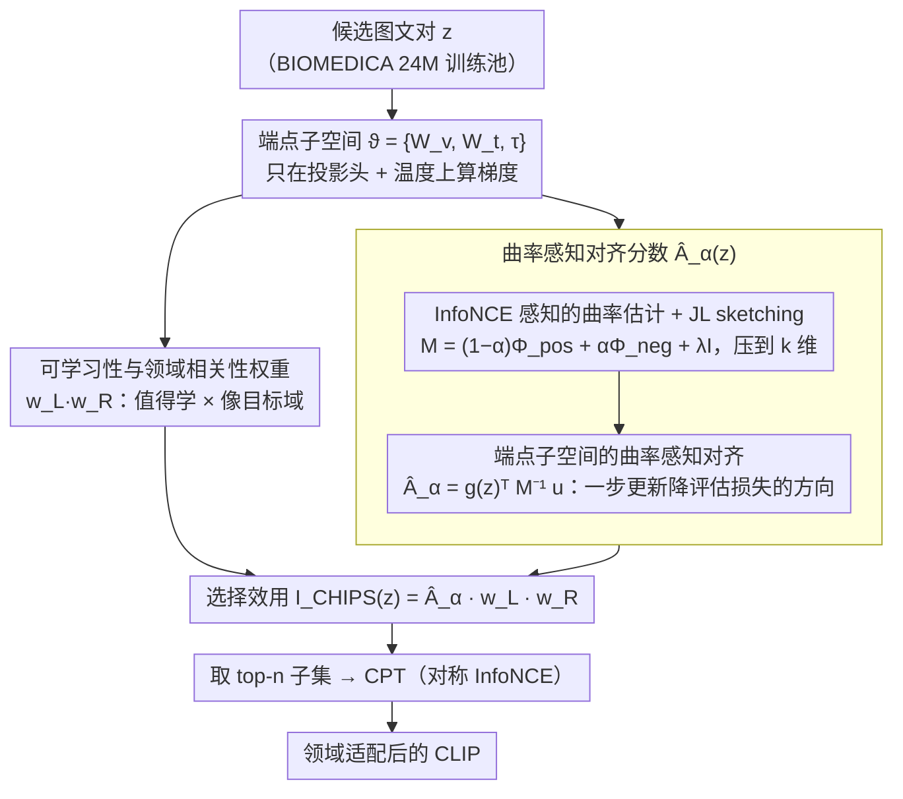

<!-- 由 src/gen_stubs.py 自动生成 -->
# CHIPS: Efficient CLIP Adaptation via Curvature-aware Hybrid Influence-based Data Selection

**会议**: CVPR 2026  
**arXiv**: [2511.18519](https://arxiv.org/abs/2511.18519)  
**代码**: [有](https://github.com/mihara-bot/CHIPS)  
**领域**: 医学图像  
**关键词**: CLIP适配, 数据选择, 曲率感知, 持续预训练, 医学图像  

## 一句话总结

提出 CHIPS，一种基于曲率感知混合影响力的数据选择方法，在 CLIP 端点子空间中计算 Newton 风格对齐分数并结合可学习性与领域相关性权重，仅用 30% 数据即可匹配全量数据集持续预训练效果，在 17 个医学基准上达到 SOTA。

## 研究背景与动机

### 1. 领域现状

CLIP 等视觉-语言模型在通用领域展现出强大的零样本识别能力，但在垂直领域（如医学影像、生物学）中性能急剧下降——词汇表、采集协议和标签体系均发生显著偏移。当前适配 CLIP 到垂直领域主要有两种范式：**模型中心**方法（概率微调、PEFT 变体等修改训练/参数化策略）和**数据中心**方法（在大规模领域数据上持续预训练 CPT，数据量从百万到数亿级）。

### 2. 痛点

数据中心方法面临严重的**数据效率**问题：收集、标注和处理大规模领域数据集成本极高，且不加区分地扩大数据量反而可能引入冗余、低效样本而损害学习效果。

### 3. 核心矛盾

规模 vs. 效率的矛盾——有效的 CPT 真的需要极端规模的数据吗？现有数据归因方法（如 TracIn、TRAK）是为单塔模型上的监督分类设计的，直接搬到 CLIP 上存在三个根本性不匹配：

- **(A) 双编码器的跨模态曲率**：CLIP 双编码器产生非块对角的二阶曲率，块对角代理忽略了这种耦合导致样本排序错误
- **(B) InfoNCE 下的非局部梯度**：每个样本的梯度依赖于整个负样本集的 softmax 归一化器，使影响力是批/全局相关的而非逐样本可加的
- **(C) 端点投影头的主导性**：投影头和温度参数驱动相似度分布的早期偏移，全参数影响力计算对 CLIP 来说不必要

### 4. 要解决什么

设计一种 CLIP 专用的数据选择器，在小数据量下实现与全量 CPT 相当甚至更好的领域适配效果，同时保留通用领域能力。

### 5. 切入角度

从**数据归因**角度出发，将数据选择建模为：选出那些一步更新后能最大化降低目标领域评估损失的样本。关键洞察是只需在 CLIP 的端点子空间（投影头 + 温度）计算这种对齐分数即可。

### 6. 核心 Idea

提出 CHIPS（Curvature-aware Hybrid Influence in Projection Subspace），在 CLIP 端点几何空间中计算曲率感知的 Newton 风格对齐分数，结合 InfoNCE 感知的曲率估计器（JL sketching 加速）和选择感知的领域相关性权重，最终乘积得到每个样本的选择效用分数。

## 方法详解

### 整体框架

CHIPS 想回答一个很实际的问题：要把 CLIP 持续预训练（CPT）到医学领域，到底要不要堆几千万样本？它的答案是给每个候选样本算一个「选不选」的效用分数，只挑分数最高的那一小批拿去训练。这个效用分数写成三个权重的乘积 $\mathcal{I}_{\text{CHIPS}}(z) = \hat{A}_\alpha(z) \cdot w_L(z) \cdot w_R(z)$：第一项 $\hat{A}_\alpha(z)$ 衡量「这个样本走一步梯度，能不能把模型推向评估损失下降的方向」，第二项 $w_L(z)$ 看「这个样本是不是还没被学会、值不值得学」，第三项 $w_R(z)$ 看「它像不像目标领域的数据」。三者相乘，方向有用 × 值得学 × 领域匹配同时成立才能拿到高分，最后取 top-n 送进 CPT。三个分数都只在 CLIP 的「端点」参数（投影头 + 温度）上算，所以可以算一次缓存下来，换架构、换预训练规模都能复用。下面三个关键设计正好对应这条流水线：设计 1 与设计 2 共同算出对齐分数 $\hat{A}_\alpha(z)$（先估曲率矩阵 $M$、再做 Newton 风格对齐），设计 3 给出可学习性与领域相关性两个乘性权重，最后相乘取 top-n。

### 关键设计

**1. 端点子空间的曲率感知对齐：只在投影头上算 Newton 方向，避开全参数二阶代价**

把数据选择当成数据归因来做，最干净的标准是 Newton 风格的对齐分数 $A(z) = g_\vartheta(z)^\top M^{-1} u_\vartheta$——样本梯度 $g_\vartheta(z)$ 经曲率矩阵 $M$ 校正后，和评估损失梯度 $u_\vartheta$ 的内积越大，说明这一步更新越能把模型推向评估集上更低的损失。难点在于 $M$ 是 Hessian 的代理，全参数算二阶量对 CLIP 这种双塔大模型根本不现实。CHIPS 的关键观察是：相似度分布的早期偏移主要由端点参数 $\vartheta = \{W_v, W_t, \tau\}$（视觉/文本投影头 + 温度）驱动，所以只在这个低维端点子空间上算对齐分数就够了。这不是拍脑袋的近似——Theorem 1 通过局部线性化给出了端点对齐分数与全参数对齐分数之间 Pearson 相关性的下界，实验里两者的 Spearman 相关性实测到 0.83，说明端点排序基本保住了全参数排序的次序，而维度和计算量却大幅缩小。

**2. InfoNCE 感知的曲率估计 + JL sketching：把负样本耦合塞回曲率，再压维度**

光在端点子空间算还不够，曲率矩阵 $M$ 怎么估也有坑。对称 InfoNCE 的 softmax 归一化器会把每个正对和一整批负样本耦合在一起，于是真实曲率里带有大量「跨样本」的离对角质量；而 TracIn 这类方法只用正对梯度的对角外积，等于把这块耦合直接扔掉，排序自然就偏了。CHIPS 把曲率拆成正对自曲率 $\Phi_{\text{pos}}$ 和负对交叉曲率 $\Phi_{\text{neg}}$，用一个混合系数 $\alpha$ 把负对那块质量加回来：

$$M = (1-\alpha)\Phi_{\text{pos}} + \alpha\Phi_{\text{neg}} + \lambda I$$

再用 Johnson–Lindenstrauss 随机投影把维度压到 $k$ 维，得到可以快速计算的 sketched 分数 $\hat{A}_\alpha(z)$。$\alpha$ 和 $k$ 不是随手定的：Theorem 2 把估计误差分解成两块，一块是随 JL 维度 $k$ 增大而以 $O(1/k)$ 收缩的投影方差，一块是曲率偏差——$\alpha > 0$ 恰好补回负对的离对角质量、压低这块偏差。两个旋钮一个管方差一个管偏差，实验把甜点定在 $\alpha \in [0.6, 0.8]$。

**3. 可学习性与领域相关性权重：在「方向有用」之外再问值不值得学、像不像目标域**

对齐分数只回答了「往这个方向走有没有用」，但它分不清两类样本：一类模型早就答对了、再学也榨不出多少信息；另一类是训练池和评估集之间的分布缺口。CHIPS 用两个乘性权重补上。可学习性 $w_L(z) = (1 - p_{\text{corr}}(z))(1 + \sigma(-m(z)))$ 用 CLIP 对正对的平均正确概率 $p_{\text{corr}}(z)$ 和最难负样本的 margin $m(z)$ 来判断——高置信答对的样本 $p_{\text{corr}}$ 接近 1、第一项趋零被压下去，而 margin 小甚至为负的决策边界样本被抬高，因为它们才是一步更新里最能学到东西的。领域相关性 $w_R(z) = \sigma((1-\beta)\cos(\hat{x}, \mu_x) + \beta\cos(\hat{y}, \mu_y))$ 则把样本嵌入和评估集两个模态的平均嵌入 $\mu_x, \mu_y$ 比余弦相似度，sigmoid 把值夹在 $[0.27, 0.73]$，所以它是软重加权而不是硬过滤，再不像也不会被归零，避免选择分布过度偏离目标领域、缓解灾难性遗忘（$\beta=0.5$ 时目标域增益最大）。三个权重相乘，正好把「方向有用」「值得学」「领域匹配」三件正交的事拧成一个分数。

### 损失函数 / 训练策略

CHIPS 本身是数据选择方法而非训练方法。选出的子集用标准对称 InfoNCE 损失进行 CPT：

- 优化器：AdamW（$\beta_1=0.9, \beta_2=0.98, \epsilon=10^{-6}$）
- 学习率调度：余弦退火（初始 $10^{-6}$）
- 批大小：32,768
- 训练轮数：固定 5 个 epoch
- 硬件：8×NVIDIA H200 (141GB)

CHIPS 分数计算一次后可缓存复用于不同架构和预训练规模。

## 实验关键数据

### 主实验

在 BIOMEDICA（24M 样本）上用 MetaCLIP-B16-400M 做 CPT，不同保留比例下的医学任务平均分：

| 方法 | r=10% Medical Avg | r=20% Medical Avg | r=30% Medical Avg | r=10% General CLS |
|------|:---:|:---:|:---:|:---:|
| Full Dataset | 31.51 | 31.51 | 31.51 | 49.72 |
| Random | 24.78 | 25.00 | 26.28 | 52.21 |
| CLIPScore | 24.16 | 20.01 | 19.01 | 53.39 |
| TracIn | 26.46 | 26.63 | 25.68 | 47.26 |
| TRAK | 25.19 | 24.54 | 23.54 | 48.24 |
| **CHIPS** | **27.03** | **28.20** | **29.96** | 47.88 |

关键数据：10% 数据的 CHIPS（27.03）超过 50% Random（26.26）；30% 的 CHIPS（29.96）达到全量 CPT 的 95.1%；r=30% 时 CHIPS 略超专用医学模型 BMCLIP（29.96 vs 29.86）。

跨架构泛化（10% 保留，CHIPS 分数复用）：

| 模型 | Medical CLS | General CLS | General RET |
|------|:---:|:---:|:---:|
| B32-400M Random | 27.15 | 49.31 | 27.33 |
| B32-400M CHIPS | **27.83** | 47.90 | 25.65 |
| L14-400M Random | 29.33 | 57.07 | 33.35 |
| L14-400M CHIPS | **29.73** | 53.65 | 28.17 |
| H14-CC Random | 35.23 | 61.36 | 32.82 |
| H14-CC CHIPS | **35.48** | 58.24 | 32.09 |

在全部 7 种架构/预训练规模设置中，CHIPS 均获最佳 Medical 性能，超 TracIn 0.20-2.65 点。

### 消融实验

在 MetaCLIP-B16-400M 上逐步添加组件：

| 变体 | r=10% Med | r=20% Med | r=30% Med | r=10% Gen CLS |
|------|:---:|:---:|:---:|:---:|
| Alignment-only | 25.98 | 27.52 | 27.84 | 48.33 |
| Alignment+Margin | 25.95 | 27.92 | 28.50 | 48.41 |
| **CHIPS (full)** | **27.03** | **28.20** | **29.96** | 47.88 |

三组件乘积组合在所有预算下均最优，r=30% 时比 Alignment+Margin 高 +1.46 点，说明领域相关性在大预算下尤其重要。通用领域 CLS 差距 ≤0.53，RET 差距随 r 增大收窄（0.99→0.37），表明是可控的专业化而非灾难性遗忘。

### 关键发现

1. **数据效率极高**：10% 数据超越 50% 随机样本，30% 数据达到全量 95% 效果
2. **端点子空间代理可靠**：Spearman 相关性 0.83；文本投影头最重要（Text-only 保持 99.7%），视觉投影头互补（98.7%）
3. **曲率混合 α 的甜点**：$\alpha \in [0.6, 0.8]$ 最优，验证了负对耦合信息对 InfoNCE 曲率的重要性
4. **分数可迁移**：在 B16-400M 上算一次分数，可直接复用于 B32/L14/H14 和不同预训练规模
5. **计算成本与 TRAK 持平**（50.95 vs 50.95 ×10^15 FLOPs），比 TracIn 低 3.1%

## 亮点与洞察

- **数据中心视角的 CLIP 适配**：首次系统性地将数据选择引入 CLIP CPT，证明"精选少量"可替代"海量堆砌"
- **理论支撑扎实**：Theorem 1 证明端点代理与全参数对齐的相关性下界；Theorem 2 给出曲率混合+JL 投影的偏差-方差分解
- **工程友好**：分数一次计算可跨架构复用，实际部署中大幅降低迭代成本
- **三因素乘积设计优雅**：对齐（方向有用性）× 可学习性（边界样本）× 相关性（领域匹配）三者正交互补

## 局限与展望

1. **依赖目标验证分布**：需要一个有标签的 $\mathcal{D}_{\text{eval}}$ 来计算评估梯度 $u_\vartheta$，在标注稀缺场景下受限
2. **仅验证了 CLIP 架构**：未扩展到 SigLIP、EVA-CLIP 等其他视觉-语言模型
3. **医学领域为主**：虽然测了通用域保留，但未在其他垂直领域（遥感、工业检测）验证
4. **α、β 超参需调**：虽然推荐了默认值但不同领域可能需要重新搜索
5. **未探索无标签目标信号**：作者自己提出可探索无标签或分布偏移鲁棒的目标信号

## 相关工作与启发

- **TracIn / TRAK**：单塔模型上的数据归因方法，CHIPS 在此基础上引入 CLIP 专用的曲率估计和端点子空间优化
- **BIOMEDICA / MedTrinity**：大规模医学多模态数据集，CHIPS 在其上验证数据效率
- **Johnson-Lindenstrauss 引理**：经典降维工具，用于将曲率计算的 $O(d^2)$ 复杂度降至近线性
- **启发**：数据选择方法可以与模型中心方法（如 PEFT）结合使用，形成"精选数据 + 高效微调"的双重效率策略

## 评分

⭐⭐⭐⭐ 理论扎实、实验全面的数据中心 CLIP 适配工作，三组件设计清晰优雅，30% 数据匹配全量 CPT 的结果令人印象深刻，对数据稀缺的垂直领域适配有很强实用价值。

<!-- RELATED:START -->

## 相关论文

- [\[CVPR 2026\] MedCLIPSeg: Probabilistic Vision-Language Adaptation for Data-Efficient and Generalizable Medical Image Segmentation](medclipseg_probabilistic_vision-language_adaptation_for_data-efficient_and_gener.md)
- [\[CVPR 2026\] Ultrasound-CLIP: Semantic-Aware Contrastive Pre-training for Ultrasound Image-Text Understanding](ultrasound-clip_semantic-aware_contrastive_pre-training_for_ultrasound_image-tex.md)
- [\[CVPR 2026\] Personalized Longitudinal Medical Report Generation via Temporally-Aware Federated Adaptation](personalized_longitudinal_medical_report_generation_via_temporally-aware_federat.md)
- [\[CVPR 2026\] Cross-Modal Guided Visual Synthesis for Data-Efficient Multimodal Depression Recognition](cross-modal_guided_visual_synthesis_for_data-efficient_multimodal_depression_rec.md)
- [\[CVPR 2026\] CoFiDA-M: Concept-Aware Feature Modulation for Cross-Domain Adaptation with Image-Only Inference](cofida-m_concept-aware_feature_modulation_for_cross-domain_adaptation_with_image.md)

<!-- RELATED:END -->
