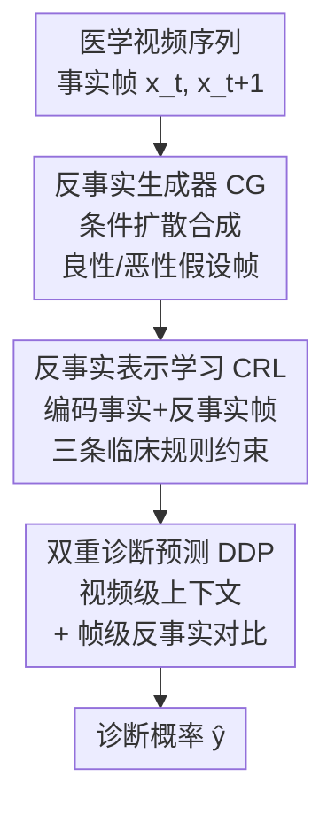

# Clinically-Grounded Counterfactual Reasoning for Medical Video Diagnosis

**会议**: CVPR 2026  
**论文**: [CVF Open Access](https://openaccess.thecvf.com/content/CVPR2026/html/Gao_Clinically-Grounded_Counterfactual_Reasoning_for_Medical_Video_Diagnosis_CVPR_2026_paper.html)  
**代码**: [项目主页](https://gaozzzz.github.io/MedVCR/)（项目页）  
**领域**: 医学图像  
**关键词**: 反事实推理, 医学视频诊断, 扩散模型, 临床先验, 时空表示学习  

## 一句话总结
MEDVCR 让医学视频诊断模型学会医生那种"假设这块组织如果是良性会长成什么样"的反事实推理：用扩散模型合成不同病理假设下的组织演化，用三条临床规则约束表示学习，再把"事实观察 vs 反事实假设"的对比融进预测，在宫腔镜活检定位和结肠镜息肉检测上分别把 Recall@1 / AP 提到 93.0%（+10.2%）和 94.8%（+2.6%）。

## 研究背景与动机
**领域现状**：很多疾病（宫颈癌、结直肠癌）靠视频级检查来诊断——医生观察组织在检查不同阶段（如宫腔镜中盐水→醋酸→碘液染色）的动态反应来判断病理。自动化方法近年用 I3D、SlowFast、ViViT 这类时空骨干做端到端学习，把"视觉序列"直接映射到"诊断输出"。

**现有痛点**：这种纯数据驱动的范式有三个硬伤。其一，**误读病理演化**——模型只盯像素级变化，没建模组织"跨阶段如何演化"（比如对醋酸/碘液的瞬时反应）。其二，**忽略临床原则**——没显式注入临床知识，于是把真正有诊断意义的线索和光照漂移、试剂颜色差异、镜头运动这些非病理变化混为一谈。其三，**缺少假设驱动的推理**——模型只是把观察到的模式和诊断输出做相关，而医生会在脑子里模拟"如果这块组织是良性而不是恶性呢？"，拿假设场景跟现实观察对比。

**核心矛盾**：现有方法把"因果病理线索"和"偶然相关的混杂因素"搅在一起，在临床数据稀缺的场景下尤其不可靠——而恰恰是数据稀缺时，医生靠反事实思维从少量样本里抽出可泛化的诊断线索、把真信号和混杂因素分开。

**本文目标**：造一个统一框架，同时做到三件事——建模"病理条件下的组织演化"、把临床诊断原则编码成显式约束、在"事实 vs 假设"观察上做对比推理。

**核心 idea**：用「显式合成反事实组织演化 + 临床规则约束 + 事实/反事实对比预测」三件套，把医生的假设驱动反事实推理搬进医学视频诊断模型。

## 方法详解

### 整体框架
MEDVCR 的输入是一段记录组织跨检查阶段变化的医学视频 $V=\{x_t\}_{t=1}^T$，每帧 $x_t$ 受其阶段 $s_t$、潜在健康状态 $h\in\{\text{benign},\text{malignant}\}$ 以及光照/镜头运动等噪声因素影响；输出是诊断概率 $\hat{y}\in[0,1]^P$（$P$ 是诊断点数，如活检候选位置）。整条流水线由三个模块串起来：先用 **反事实生成器 CG** 把"某帧在指定病理状态下的下一阶段会长成什么样"合成出来，作为反事实监督；再用 **反事实表示学习 CRL** 把事实帧和反事实帧一起编码，并用三条临床规则约束表示；最后用 **双重诊断预测 DDP** 把视频级时序上下文和帧级反事实对比融合成最终诊断。

### 关键设计

**1. 反事实生成器 CG：用条件扩散把"如果是另一种病理会怎样"合成出来**

医生诊断不只看组织外观如何跨阶段演化，还会在脑子里把观察到的演化跟"不同病理状态下的另一种结果"做对比。CG 就是把这个隐式的反事实过程显式化：它是一个**条件扩散模型** $G$，给定阶段 $s_t$ 的参考帧 $x_t$ 和目标健康状态 $h$，估计该状态下下一阶段 $s_{t+1}$ 的组织外观 $\tilde{x}^h_{t+1}$。前向是固定的马尔可夫加噪 $q(\epsilon_k\mid x_{t+1})=\mathcal{N}(\epsilon_k;\sqrt{\bar\alpha_k}\,x_{t+1},(1-\bar\alpha_k)I)$，逐步把组织结构和颜色线索替换成噪声；反向由一个 U 形网络 $F_u$ 预测各步噪声 $\hat\epsilon_k=F_u(\epsilon_k,x_t,h,k)$ 来去噪，其中 $\epsilon_k$ 和 $x_t$ 共享视觉骨干编码空间上下文、$h$ 投影成调制病理表现的潜向量、$k$ 用正弦位置编码表示扩散进度。采样时从高斯噪声出发迭代去噪：

$$\tilde{x}^h_{t+1}=G(x_t,h)=F_{u,1:k}(\epsilon_k;\,x_t,h)$$

关键在于"分别生成良性和恶性两种变体"——这让模型能模拟两条不同的诊断轨迹，为后续反事实对比提供素材。它和普通的数据增强不同：生成的不是随机扰动，而是**特定病理条件下临床合理的组织演化**。

**2. 反事实表示学习 CRL：把三条临床原则编码成对表示的约束**

光有反事实帧还不够，得让表示空间真正"懂"临床原则。CRL 的视频学习器是"视觉编码器 $F_e$（I3D）+ 时序 Transformer $F_t$"的层级结构：视频切成重叠 clip，逐帧编码得 $F^e\in\mathbb{R}^{(C\cdot L)\times d}$，前置一个可学习时序 token $F_\tau$ 后送入 $F_t$ 聚合长程依赖，得到既含局部帧模式又含全局演化的表示 $F^v$。在这之上，三条临床规则用互信息（$M(\cdot;\cdot)$）的形式约束帧对 $(x_t,x_{t+1})$ 与反事实帧 $\tilde{x}^h_{t+1}$ 的表示：

- **规则 1·时序一致性**：同一组织区域的病理身份在不同检查阶段应保持稳定（尽管外观因试剂、光照而变），即诊断信息要跨阶段一致、对阶段因素不变：$M(F_t;h)\approx M(F_{t+1};h)\gg M(F_t,F_{t+1};s_t,s_{t+1})$。
- **规则 2·病理可分性**：良性和恶性来自不同生物过程，表示空间里要清晰可分——每类各自保留对 $h$ 的强诊断依赖，但两类之间互相独立：$M(h;F^{ben}_{t+1})+M(h;F^{mal}_{t+1})\gg M(F^{ben}_{t+1};F^{mal}_{t+1})$。
- **规则 3·反事实对齐**：事实观察应与"和真实病理一致的反事实"对齐，而与"不相容假设的反事实"分开：$M(F^h_{t+1};\tilde{F}^h_{t+1})\gg M(F^h_{t+1};\tilde{F}^{\bar h}_{t+1})$（$\bar h$ 是相反健康状态）。

这三条规则落到具体损失上分别是：时序对比损失 $\mathcal{L}_{temp}=1-F_{sim}(F^h_t,F^h_{t+1})$ 拉近相邻阶段表示；软可分损失 $\mathcal{L}_{sep}=F_{sim}(F^h_{t+1},F^h_t)-F_{sim}(F^h_{t+1},\tilde{F}^{\bar h}_{t+1})$；以及三元组形式的对齐损失 $\mathcal{L}_{align}=\max\big(0,\,m+F_{sim}(F^h_{t+1},\tilde{F}^{\bar h}_{t+1})-F_{sim}(F^h_{t+1},\tilde{F}^h_{t+1})\big)$，把表示往"病理一致的反事实"拉、往"不相容的反事实"推（$m$ 为间隔，$F_{sim}$ 是归一化余弦相似度）。这样表示就不只是数据拟合，而是带上了"哪些不变、哪些该分开"的临床先验。

**3. 双重诊断预测 DDP：视频级上下文 + 帧级反事实对比的差分诊断**

临床诊断是层级的：医生既评估整段视频的全局组织反应模式，又盯单帧找局部病理证据。DDP 据此分两路。视频级：整段序列经视频学习器得 $F^v$，过预测头得 logits $z^v=F_p(F^v)\in\mathbb{R}^P$。帧级：事实关键帧 $x^h_{t+1}$ 和其反事实对应帧 $\tilde{x}^{\bar h}_{t+1}$ 各自独立分析，得 $z^h_{t+1}$ 与 $z^{\bar h}_{t+1}$。最终融合是一个**差分**形式：

$$\hat{y}=F_\sigma\big(z^v+z^h_{t+1}-z^{\bar h}_{t+1}\big)\in[0,1]^P$$

即在视频级演化动态 $z^v$ 基础上，**加上**支持真实病理的帧级证据 $z^h_{t+1}$、**减去**对齐到另一假设的线索 $z^{\bar h}_{t+1}$，从而在预测层面实现"差分诊断"。推理时按临床筛查协议把观察到的组织当成疑似病例（$h=\text{mal}$）以做证伪，反事实目标设为良性（$\bar h=\text{ben}$），并用前一帧 $x_{t-1}$ 让 $G$ 合成当前帧的良性估计 $\tilde{x}^{\bar h}_t$。

### 损失函数 / 训练策略
两阶段：先单独预训练生成器 $G$，目标是去噪扩散的噪声重建损失 $\mathcal{L}_{gen}=\mathbb{E}\big[\|\epsilon_k-\hat\epsilon_k\|_2^2\big]$；随后冻结 $G$ 作为反事实监督，联合训练视频学习器与诊断头，损失为三条临床规则损失（$\mathcal{L}_{temp},\mathcal{L}_{sep},\mathcal{L}_{align}$）加上诊断的二元交叉熵 $\mathcal{L}_{diag}$。实现上 CG 用 U-Net、扩散步数 $K=1000$、训练 20k 步，$F_e$ 由预训练 I3D 初始化，图像统一 $256\times256$，单卡 RTX 4090、batch 8。

## 实验关键数据

### 主实验
两个代表性设置：全监督（宫腔镜活检位定位，多标签分类，自建 623 例四阶段数据集）和弱监督（结肠镜息肉帧检测，仅视频级标签，HyperKvasir + LDPolypVideo 合并集，百万帧级）。

**全监督·宫腔镜（Table 1，五折交叉验证，Recall@1 容忍相邻一位）**

| 类别 | 方法 | Recall | Precision | Acc. | Recall@1 |
|------|------|--------|-----------|------|----------|
| 通用 | TimeSformer (ICML21) | 54.8 | 57.9 | 25.6 | 70.4 |
| 通用 | VideoMAEv2 (CVPR23) | 65.3 | 65.9 | 33.5 | 77.6 |
| 医学 | SurgFormer (MICCAI24) | 70.1 | 66.8 | 41.2 | 82.8 |
| 医学 | STDDNet (ICCV25) | 66.8 | 67.1 | 38.1 | 82.3 |
| — | **MEDVCR (Ours)** | **80.3** | **74.4** | **55.0** | **93.0** |

MEDVCR 的 93.0% Recall@1 比最强先前方法 SurgFormer 高 10.2 个点；通用视频模型直接用只有 70.4%，说明自然视频和临床检查之间有明显域差。

**弱监督·结肠镜（Table 2，五折交叉验证）**

| 类别 | 方法 | AP | AUC |
|------|------|----|----|
| 通用 | RTFM (ICCV21) | 78.0 | 96.3 |
| 通用 | UR-DMU (AAAI23) | 79.3 | 93.7 |
| 医学 | Endo-FM (MICCAI23) | 89.2 | 97.6 |
| 医学 | TEmory (MICCAI25) | 92.2 | 99.4 |
| — | **MEDVCR (Ours)** | **94.8** | **99.6** |

94.8% AP 比最强基线 TEmory 高 2.6 个点，说明反事实推理在弱监督下建模细微病理动态同样有效。

### 消融实验

**两大模块（Table 3，CRs = 临床规则，DDP = 双重诊断预测）**

| 配置 | CRs | DDP | 宫腔镜 Recall@1 | 结肠镜 AP |
|------|-----|-----|----------------|-----------|
| #1 基线（仅视频学习器） | ✗ | ✗ | 77.9 | 82.8 |
| #2 | ✓ | ✗ | 89.4 | 91.6 |
| #3 | ✗ | ✓ | 80.2 | 85.5 |
| #4 完整模型 | ✓ | ✓ | **93.0** | **94.8** |

**三条临床规则逐条加（Table 4）**

| 配置 | Temp. | Sep. | Align. | 宫腔镜 Recall@1 | 结肠镜 AP |
|------|-------|------|--------|----------------|-----------|
| #1 | ✗ | ✗ | ✗ | 80.2 | 85.5 |
| #2 | ✓ | ✗ | ✗ | 84.1 | 88.0 |
| #3 | ✗ | ✓ | ✗ | 87.5 | 90.2 |
| #4 | ✗ | ✗ | ✓ | 90.8 | 93.0 |
| #5 | ✓ | ✓ | ✓ | **93.0** | **94.8** |

### 关键发现
- **临床规则（CRs）贡献最大**：单加 CRs 就把宫腔镜 Recall@1 从 77.9% 拉到 89.4%（+11.5），远超单加 DDP（80.2%）。说明在数据稀缺的临床任务里，注入临床知识比单纯的预测端结构更重要。
- **三条规则里"反事实对齐"最关键**：单独开启 Align.（Table 4 #4）就把 Recall@1 从 80.2% 提到 90.8%（+10.6），是三条里增益最大的——印证了"把事实表示和病理一致的反事实链接起来"是反事实推理的核心。
- **CRs 与 DDP 互补**：两者都开（#4）得到最优，说明"表示层注入临床先验"和"预测层做事实/反事实对比"是两个正交的增益来源。
- **骨干网络（Table 5）**：视频时空骨干显著优于图像骨干，I3D 取得 93.0% Recall@1，而 CLIP-ViT/B 只有 84.5%、ResNet101 为 89.1%——VLM/自监督图像模型向医学域迁移性有限，时空建模对捕捉诊断演化是必要的。

## 亮点与洞察
- **把"医生的反事实问句"做成可计算的差分预测**：$\hat{y}=\sigma(z^v+z^h-z^{\bar h})$ 这个加真实假设、减对立假设的形式，简洁地把"差分诊断"落到了 logits 层，机制透明、可解释，这是最让人"啊哈"的设计。
- **用扩散生成当反事实监督，而非当数据增强**：CG 生成的良性/恶性变体是有临床语义的"另一种可能"，配合三元组对齐损失，把生成模型变成了诊断推理的素材源，这个思路可迁移到任何"专家靠对比假设做判断"的视觉任务。
- **临床规则用互信息语言统一表达**：时序一致 / 病理可分 / 反事实对齐三条规则都写成互信息不等式再落到余弦相似度损失，先验注入既有理论框架又工程可落地。
- **推理协议很巧**：把当前观察统一当"疑似恶性"、反事实设为良性来做证伪，避免了推理时要先知道标签的鸡生蛋问题。

## 局限与展望
- **依赖二元健康状态假设**：方法把 $h$ 建模成 benign/malignant 二元，对低级别病变、多分级（如不同等级上皮内瘤变）这类连续/多类病理谱，二元反事实是否够用存疑 ⚠️（论文数据集含 low-grade / high-grade，但建模仍是二元对比）。
- **生成器质量是上限**：整套反事实监督建立在 CG 合成帧"临床合理"的前提上；若在罕见病变或极端外观下 CG 生成失真，反事实对齐反而可能引入误导，论文未量化生成失败对诊断的影响。
- **宫腔镜数据集为自建、单中心**：623 例、三位医生标注，规模和多中心泛化性有限，跨设备/跨人群迁移待验证。
- **改进方向**：把二元 $h$ 扩成多病理分级的条件，或让 CG 输出不确定性、在对齐损失里按生成置信度加权，可能进一步提升数据稀缺场景下的鲁棒性。

## 相关工作与启发
- **vs 主流时空诊断模型（SurgFormer / Endo-FM / TEmory）**：它们直接把视觉序列映射到诊断输出，靠数据驱动学相关；MEDVCR 额外显式建模"病理条件下的组织演化"并做事实/反事实对比，区别在于引入了假设驱动的因果式推理，优势是数据稀缺下更稳、可解释，代价是要预训练一个生成器。
- **vs 医学图像的反事实生成工作**：以往反事实生成多用于单张图像的可解释性/数据多样性；本文把这一范式扩到**医学视频**，对跨检查阶段的时序组织演化做反事实推理，是把因果反事实从静态图推进到动态序列的一步。
- **vs 通用反事实推理（SCM / GAN / VAE / 扩散因果路径）**：本文选扩散建模合成条件转移，并不显式求解结构因果模型，而是用临床规则（互信息约束）替代"无未观测混杂"假设来引导表示——这是把领域先验当作因果约束的务实路线。

## 评分
- 新颖性: ⭐⭐⭐⭐⭐ 把医生的反事实诊断思维拆成"生成-表示-预测"三件套并落到医学视频，范式新颖
- 实验充分度: ⭐⭐⭐⭐ 覆盖全/弱监督两任务 + 模块/规则/骨干多维消融，但数据集偏单中心自建
- 写作质量: ⭐⭐⭐⭐⭐ 动机—方法—实验逻辑清晰，临床规则用互信息语言统一表达，可读性强
- 价值: ⭐⭐⭐⭐⭐ 面向数据稀缺的临床场景，提供透明可解释的诊断推理，落地价值高

<!-- RELATED:START -->

## 相关论文

- [\[CVPR 2026\] EMAD: Evidence-Centric Grounded Multimodal Diagnosis for Alzheimer's Disease](emad_evidence-centric_grounded_multimodal_diagnosis_for_alzheimers_disease.md)
- [\[CVPR 2026\] MedTVT-R1: A Multimodal LLM Empowering Medical Reasoning and Diagnosis](medtvt-r1_a_multimodal_llm_empowering_medical_reasoning_and_diagnosis.md)
- [\[CVPR 2026\] X-PCR: A Benchmark for Cross-modality Progressive Clinical Reasoning in Ophthalmic Diagnosis](x-pcr_a_benchmark_for_cross-modality_progressive_clinical_reasoning_in_ophthalmi.md)
- [\[CVPR 2026\] TRCoRSurg: Temporal-Relational Co-Reasoning for Surgical Video Triplet Recognition](trcorsurg_temporal-relational_co-reasoning_for_surgical_video_triplet_recognitio.md)
- [\[ICLR 2026\] CARE: Towards Clinical Accountability in Multi-Modal Medical Reasoning with an Evidence-Grounded Agentic Framework](../../ICLR2026/medical_imaging/care_towards_clinical_accountability_in_multi-modal_medical_reasoning_with_an_ev.md)

<!-- RELATED:END -->
