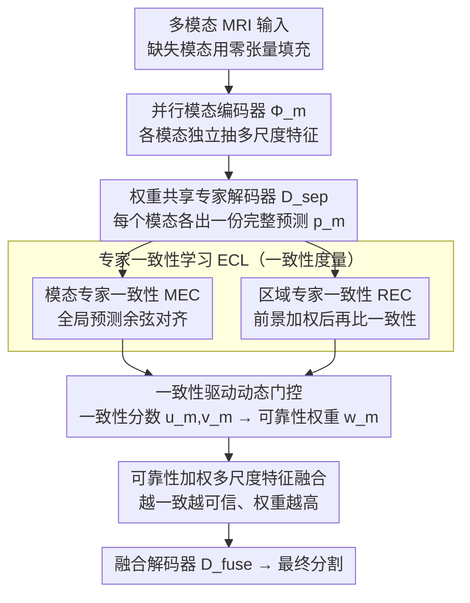

# CLoE: Expert Consistency Learning for Missing Modality Segmentation

**会议**: CVPR 2026  
**arXiv**: [2603.09316](https://arxiv.org/abs/2603.09316)  
**代码**: 无  
**领域**: 医学图像  
**关键词**: 缺失模态, 多模态分割, 一致性学习, 脑肿瘤分割, 可靠性门控

## 一句话总结

提出 CLoE（Consistency Learning of Experts），将缺失模态鲁棒性问题建模为决策层面的专家一致性控制，通过模态专家一致性（MEC）和区域专家一致性（REC）双分支约束减少专家漂移，并用一致性分数驱动的门控网络实现可靠性加权融合。

## 研究背景与动机

多模态 MRI 分割（如脑肿瘤）在临床中经常面临模态缺失（设备故障、扫描协议不同等）。现有方法的不足：

- **生成式方法**（GAN 合成缺失模态）：生成质量不稳定，不可避免地引入伪影。
- **固定权重融合/注意力机制**（如 SE、CBAM）：当缺失模态用零张量填充时，注意力机制变得无效——基于幅值的注意力对零输入无法产生有意义的权重。
- **一致性学习**（如 Mean Teacher）：在体积 MRI 中受到背景占优问题的困扰——全局一致性可以在不对齐小肿瘤区域的情况下被满足。

核心矛盾：现有方法缺少一个明确的机制来判断"哪个模态专家在当前 case 和区域上应该被信任"。不同模态提供不平等的证据，但融合时没有区分。

CLoE 的切入角度：**将缺失模态鲁棒性重新定义为决策层面的一致性问题**——如果各模态专家的预测一致，那么融合结果就是稳定的；不一致说明某些专家不可靠，应降权。

## 方法详解

### 整体框架

CLoE 想解决的是同一件事的两个症状：模态缺失时，谁来填补缺口、又凭什么相信剩下的专家。它把整条 pipeline 拆成「各管各、再按可靠性汇总」三步。每个模态先经过独立的编码器 $\Phi_m$ 抽多尺度特征，再交给一组权重共享的专家解码器 $D^{\text{sep}}$，让每个模态都**单独**给出一份完整的分割预测——这样即便某个模态缺席，其余专家照样各自有话说。接着核心模块登场：它不去比较特征的幅值，而是横向比对这些专家预测之间「合不合得来」，由模态专家一致性（MEC）和区域专家一致性（REC）从全局和前景两个角度量化分歧，再把一致性高低交给动态门控换算成每个专家的可靠性权重，按权重把多尺度特征融起来送进融合解码器 $D^{\text{fuse}}$ 出最终结果。换句话说，融合不再是盲目相加，而是「越一致越可信、越可信越占权重」。

### 关键设计

**1. Modality Expert Consistency（MEC，模态专家一致性）：用专家间的分歧当鲁棒性的抓手**

缺失模态最危险的地方在于，剩下的专家如果各说各话，融合会把分歧放大成错误。MEC 把这种「分歧」直接变成可优化的信号：对所有可用模态对 $(a,b)$，比较它们预测图的余弦相似度，越像越好。损失写成

$$\mathcal{L}_{\text{MEC}} = \frac{1}{|\mathcal{P}|}\sum_{(a,b)\in\mathcal{P}}\bigl(1 - \mathcal{S}(\mathbf{p}^{(a)}, \mathbf{p}^{(b)})\bigr)$$

其中 $\mathcal{S}$ 是余弦相似度、$\mathcal{P}$ 是可用模态对集合。它约束的是全局预测分布的对齐，压低 case-wise 的专家漂移——同一个病例里各专家别给出互相矛盾的整体判断。

**2. Region Expert Consistency（REC，区域专家一致性）：把一致性约束逼到小肿瘤区域上**

光有全局一致性有个隐患：脑 MRI 里背景像素占绝大多数，专家们只要在大片背景上达成一致，$\mathcal{L}_{\text{MEC}}$ 就已经很低，而真正要紧的增强肿瘤（ET）区域体积极小，几乎不进入约束——这正是 Mean Teacher 一类全局一致性在体积 MRI 上「背景占优」的老毛病。REC 的做法是先从可用模态的浅层特征算一张可学习的前景区域图 $r = \sigma\!\bigl(\pi(\tfrac{1}{|\mathcal{A}|}\sum_{m\in\mathcal{A}}f_1^{(m)})\bigr)$，用它给预测加权 $\mathbf{p}_r$ 后再比一致性：

$$\mathcal{L}_{\text{REC}} = \frac{1}{|\mathcal{P}|}\sum_{(a,b)\in\mathcal{P}}\bigl(1 - \mathcal{S}(\mathbf{p}_r^{(a)}, \mathbf{p}_r^{(b)})\bigr)$$

等于把「专家们必须在前景上达成一致」这条要求单独拎出来强调。消融里去掉 REC 后 ET 直接掉 3.41%，说明小目标的对齐确实是靠它撑着。

**3. Consistency-Driven Dynamic Gating（一致性驱动的动态门控）：让一致性度量直接当融合权重**

前两个设计产出了专家之间的一致程度，这一步把它兑现成「该信谁」。对每个模态 $m$，先汇总它和其他专家的全局一致性 $u_m$ 与区域一致性 $v_m$，喂进一个极轻量的门控网络 $\mathcal{G}$，softmax 归一化得到可靠性权重 $w_m = \text{softmax}(\mathcal{G}(u_m, v_m))$，再按权重融合多尺度特征 $f_\ell = \sum_m w_m \odot f_\ell^{(m)}$。它的好处是天然处理缺失：缺席的模态没有可比对象、一致性为零，门控自动把它的权重压到 0，不需要额外的缺失检测逻辑。举个直观的过程——若某病例只剩 T1 和 FLAIR，两者预测在肿瘤区一致性高，门控就给它们高权重正常融合；如果再补进一个预测明显跑偏的专家，它和其余专家的一致性低，$w_m$ 随之被压低、贡献被弱化。这条「不一致即不可信」的链条，比 SE/CBAM 那种基于特征幅值的注意力合理得多——后者遇到用零张量填充的缺失模态时，幅值注意力根本算不出有意义的权重。

### 损失函数 / 训练策略

总损失为三项之和：

$$\mathcal{L}_{\text{total}} = \mathcal{L}_{\text{seg}} + \alpha \mathcal{L}_{\text{ECL}} + \beta \mathcal{L}_{\text{contrast}}$$

- $\mathcal{L}_{\text{seg}}$：融合特征的分割损失（WCE + Dice）
- $\mathcal{L}_{\text{ECL}}$：各专家独立监督 + $\eta(\mathcal{L}_{\text{MEC}} + \lambda_{\text{rec}}\mathcal{L}_{\text{REC}})$
- $\mathcal{L}_{\text{contrast}}$：对比表示学习损失（SSIM 对齐内容 + 余弦对齐风格 + KL 正则）

训练：Adam，lr=0.0002，weight decay=0.0001，500 epochs，batch size=1。训练时随机丢弃模态模拟缺失。

## 实验关键数据

### 主实验

**BraTS 2020（15 种缺失模态组合，平均 Dice %）**

| 区域 | 指标 | CLoE | DC-Seg | M³AE | 提升(vs DC-Seg) |
|------|------|------|--------|------|------|
| WT | Avg Dice | **88.09** | 87.54 | 86.90 | +0.55 |
| TC | Avg Dice | **80.23** | 79.63 | 79.10 | +0.60 |
| ET | Avg Dice | **65.06** | 65.00 | 61.70 | +0.06 |

**MSD Prostate PZ（3 种模态组合）**

| 设置 | CLoE | DC-Seg | RFNet |
|------|------|--------|-------|
| T2 | **80.33** | 79.21 | 75.18 |
| ADC | **77.12** | 75.89 | 72.07 |
| T2&ADC | **82.91** | 81.67 | 78.00 |
| 平均 | **80.12** | 79.59 | 77.35 |

### 消融实验

| 配置 | WT Dice | TC Dice | ET Dice | 说明 |
|------|---------|---------|---------|------|
| w/o MEC | 87.75 | 80.01 | 63.50 | 全局一致性贡献适中 |
| w/o REC | 86.40 | 79.39 | 61.65 | ET 下降 3.41%，区域一致性关键 |
| w/o Gating | 87.99 | 80.08 | 63.90 | 门控精调作用 |
| w/o Weight Fusion | 86.52 | 78.33 | 61.10 | ET 下降 3.96%，融合最重要 |
| **CLoE (full)** | **88.09** | **80.23** | **65.06** | — |

### 关键发现

- REC 和 Weight Fusion 是两个最关键组件，去掉任一个都导致 ET（最难的小区域）显著下降。
- MEC 单独去掉影响较小，说明全局一致性提供的约束不如区域一致性精准。
- 单一模型即可处理所有 15 种缺失组合，无需为每种组合训练单独模型。

## 亮点与洞察

- 将缺失模态鲁棒性重新建模为一致性控制问题，概念清晰且可操作。
- REC 的前景加权策略有效解决了背景占优问题，对小目标分割（ET）提升明显。
- 一致性→可靠性→融合权重的转化链条逻辑通畅，门控网络极轻量不增加推理负担。
- 跨数据集泛化：从 BraTS（4 模态）到 MSD Prostate（2 模态）都有效。

## 局限与展望

- ET 的平均 Dice 仍然只有 65%，说明缺失模态下小目标分割仍是开放问题。
- 门控网络的输入只有两个标量（$u_m, v_m$），可能信息量有限，可考虑更丰富的特征。
- 只在 BraTS 和 Prostate 两个数据集上验证，其他器官/模态组合未被覆盖。
- 对比 MedSAM 对 bounding box 的依赖，并没有和 SAM-based 方法做完整对比。

## 相关工作与启发

- 与 DC-Seg（latent disentanglement）的互补：CLoE 强调决策层面的一致性，DC-Seg 强调表示层面的解耦，两者关注不同层次。
- 一致性学习思路（Mean Teacher）在半监督学习中很成功，本文将其适配到缺失模态场景并解决了背景占优问题。
- 对多模态融合的一般启示：先评估各模态的可靠性再融合，比盲目注意力加权更合理。

## 评分

- **新颖性**: ⭐⭐⭐⭐ 一致性→可靠性的 formulation 新颖，REC 解决了真实问题
- **实验充分度**: ⭐⭐⭐ BraTS + Prostate 两个数据集足够但数量偏少
- **写作质量**: ⭐⭐⭐⭐ 方法动机解释充分，ablation 设计合理
- **价值**: ⭐⭐⭐⭐ 缺失模态是临床刚需，方法实用且概念清晰

<!-- RELATED:START -->

## 相关论文

- [\[CVPR 2026\] MUST: Modality-Specific Representation-Aware Transformer for Diffusion-Enhanced Survival Prediction with Missing Modality](must_modality-specific_representation-aware_transformer_for_diffusion-enhanced_s.md)
- [\[CVPR 2026\] PGR-Net: Prior-Guided ROI Reasoning Network for Brain Tumor MRI Segmentation](pgr-net_prior-guided_roi_reasoning_network_for_brain_tumor_mri_segmentation.md)
- [\[CVPR 2026\] OmniFM: Toward Modality-Robust and Task-Agnostic Federated Learning for Heterogeneous Medical Imaging](omnifm_toward_modality-robust_and_task-agnostic_federated_learning_for_heterogen.md)
- [\[CVPR 2026\] Federated Modality-specific Encoders and Partially Personalized Fusion Decoder for Multimodal Brain Tumor Segmentation](federated_modality-specific_encoders_and_partially_personalized_fusion_decoder_f.md)
- [\[CVPR 2026\] Multiscale Structure-Guided Latent Diffusion for Multimodal MRI Translation](multiscale_structure-guided_latent_diffusion_for_multimodal_mri_translation.md)

<!-- RELATED:END -->
