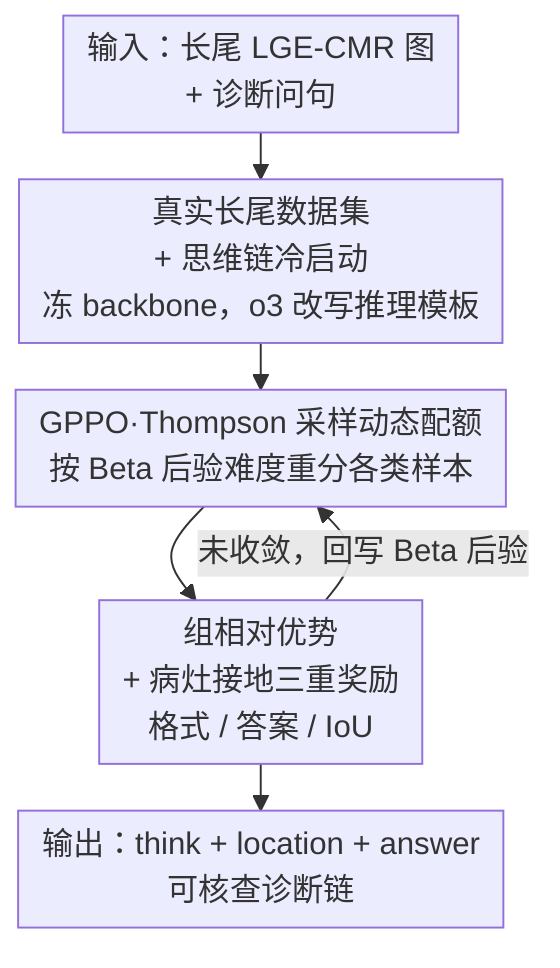

# CMR-RD: Long-Tailed Adaptive VLM for Explainable CMR Diagnosis

**会议**: CVPR 2026  
**论文**: [CVF Open Access](https://openaccess.thecvf.com/content/CVPR2026/html/Li_CMR-RD_Long-Tailed_Adaptive_VLM_for_Explainable_CMR_Diagnosis_CVPR_2026_paper.html)  
**代码**: 无  
**领域**: 医学图像  
**关键词**: CMR诊断 / 长尾VLM / 强化学习后训练 / Thompson采样 / 病灶接地  

## 一句话总结
CMR-RD 是首个面向心脏磁共振（CMR）可解释诊断的视觉-语言模型，通过「医学对齐+思维链冷启动」打底，再用一种带 Thompson 采样动态配额的多阶段强化学习算法 GPPO 主动补强罕见病类别，并把病灶 IoU 接地写进奖励，在六类心脏病诊断上同时拿到最高准确率和最可信的推理链。

## 研究背景与动机
**领域现状**：心脏磁共振是评估心血管疾病的临床金标准，但读片高度依赖专家经验。近年通用 VLM（Qwen2.5-VL、InternVL3）和医学 VLM（LLaVA-Med、MedGemma、HuatuoGPT-Vision）开始被用来做医学影像问答与报告生成，部分工作（MedVLM-R1、PathVLM-R1）还引入 CoT 和 RL 后训练来增强专业性。

**现有痛点**：把这些模型直接搬到 CMR 诊断有两个具体缺口。一是**推理不透明**——大多停留在答案级监督，给不出"看到了什么病灶 → 在哪 → 据此鉴别诊断"的显式可核查链条，临床无法审计；二是**罕见病识别差**——医学数据天然长尾，而主流 RL 后训练（GRPO）在采样和价值估计上都被多数类主导，罕见类的优势/价值估计方差大、梯度贡献被稀释，越训越偏向常见病。

**核心矛盾**：长尾分布与 RL 后训练的"动态性"互相打架。静态的类别平衡采样、loss 重加权、特征补偿这些手段不随训练阶段自适应——训练早期和后期模型对各类的掌握程度不同，固定权重要么过度补罕见类伤了整体、要么补不够，很难在所有类别上同时最优。

**本文目标**：造一个 CMR 专用 VLM，既能输出对齐影像证据的显式诊断链，又能在长尾下把罕见高危病（心脏淀粉样变 CAM、左室致密化不全 LVNC）也诊断准。

**切入角度**：作者把"该给哪个类别多少训练样本"显式建模成一个**带不确定性的贝叶斯决策过程**——按模型当前在各类上的真实准确率（及其后验不确定性）来动态分配每阶段的采样配额，让模型自己去"主动探索"它还学不好的类。

**核心 idea**：用「分阶段在线 RL + Thompson 采样动态配额」替代静态长尾策略，并把病灶定位的 IoU 直接写进奖励，让模型从"看全图猜病"转向"基于证据接地的可解释决策"。

## 方法详解

### 整体框架
CMR-RD 以 Gemma-4B 为底座，走两阶段训练：**Stage 1 做医学对齐 + 思维链冷启动**，让一个通用 VLM 先"听得懂"CMR 影像术语、会按医生的思路一步步推理；**Stage 2 做推理增强**，用本文提出的 GPPO（Group-Phased Policy Optimization）把 RL 拆成多阶段在线更新，每阶段先用 Thompson 采样按"难度"重新分配各类配额，再用组相对优势 + 三重奖励（格式/答案/IoU）优化策略，专门补强罕见和表现差的类别。输入是带延迟钆增强（LGE）的 CMR 图与诊断问句，输出是 `<think>推理</think><location>病灶框</location><answer>病名</answer>` 三段式的可核查诊断链。

### 关键设计

**1. 真实临床长尾数据集 + 诊断思维链冷启动：先让通用 VLM "懂 CMR、会思考"**

针对"推理不透明 + 没有 CMR 先验"的缺口，Stage 1 分两步打底。第一步**医学对齐**：用开源医学语料 PMC-VQA（22.7 万问答、14.9 万图）加上 7k 条 CMR 图文对做跨模态对齐，注入影像术语与专业知识；为省成本并保住底座能力，**视觉塔和 LLM 都冻结，只微调把视觉特征映射到语言空间的 projector**。第二步**冷启动**：心脏放射科医生从常规 LGE-CMR 报告里挑代表病例，借 OpenAI o3 把原始报告改写成符合临床决策流程的推理模板（病灶观察 → 定位描述 → 鉴别诊断），经临床质控后作为冷启动数据，此时解冻并训练 projector + LLM。这一步的价值在于：它不是简单灌答案，而是把"医生怎么想"的链式范式教给模型，为 Stage 2 的 RL 提供一个已经会基础推理的起点——消融里只有 Stage 1 时 ACC 仅 0.261，但它是后续 RL 起飞的地基。

**2. GPPO：Thompson 采样驱动的多阶段动态配额，主动补罕见类**

这是全文核心，直接针对"长尾让 RL 偏向多数类"的矛盾。GPPO 把 RL 拆成在线多阶段更新，每阶段开始前用 **Thompson 采样**重新决定各类该采多少样本。具体把每个类别 $c$ 的真实准确率 $\theta_c$ 当成隐变量，赋 Beta 先验 $\theta_c \sim \text{Beta}(\alpha_{c,0},\beta_{c,0})$（初值 $\alpha_{c,0}=\beta_{c,0}=1$）。第 $t$ 轮后在独立测试集上统计该类的对/错样本数 $n^+_{c,t}, n^-_{c,t}$，更新后验：

$$\alpha_{c,t}=\alpha_{c,0}+\sum_{s=1}^{t} n^+_{c,s},\qquad \beta_{c,t}=\beta_{c,0}+\sum_{s=1}^{t} n^-_{c,s}.$$

下一轮前对每个类独立采一个 $\tilde\theta_{c,t}\sim\text{Beta}(\alpha_{c,t},\beta_{c,t})$，定义**难度权重** $w_{c,t}=1-\tilde\theta_{c,t}$——权重大表示模型在该类上要么准确率低、要么后验不确定性高，都该多采。批大小为 $B$ 时，类别 $c$ 的配额按归一化难度分配 $q_{c,t}=\lfloor \frac{w_{c,t}}{\sum_{c'} w_{c',t}} B \rfloor$。配合一个"**桶-补**（bucket-refill）"策略：若某类剩余样本池 $|P_{c,t}|<\tau$ 就当少数类处理、有放回地抽 $\min(q_{c,t},|P_{c,t}|)$ 个不耗尽样本池；否则无放回抽取并移除；若总量仍有缺口，再从多数类池逐一补满。这样做的妙处在于把"采样策略"和"模型当前能力"动态绑定——Thompson 采样天然在"利用（多采已知薄弱类）"和"探索（采后验不确定的类）"间平衡，比静态平衡/加权采样更贴合 RL 训练随阶段演化的特性。

**3. 组相对优势 + 病灶接地三重奖励：把"基于证据"写进目标**

针对"VLM 易幻觉、文字描述对不上真实病灶位置"，本文设计三重奖励喂给 RL。**格式奖励**：要求输出严格匹配 `<think>…</think><location>[x1,y1,x2,y2]</location><answer>…</answer>` 模板，全部标签匹配给 1.5，否则 0。**答案奖励**：格式正确前提下抽取 `<answer>` 与真值比对，命中给 2.0；作者特意让模型直接答**病名**而非 A/B/C/D 选项，因为标签本身的语义信息更利于训练。**IoU 奖励**：用预测框与真值病灶框的 $\text{IoU}=\frac{|B_1\cap B_2|}{|B_1\cup B_2|}$ 鼓励空间一致；但 IoU 在多数步上几乎为 0、过稀疏会拖慢收敛，于是做带阈值 $\tau$ 的线性变换得到稀疏-稠密混合奖励：

$$r_{\text{IoU}}=\begin{cases}0,& \text{IoU}<\tau,\\[2pt]\dfrac{\text{IoU}-\tau}{1-\tau},&\text{otherwise.}\end{cases}$$

策略优化沿用 GRPO 思路、不另设价值网络：每个输入采一组输出 $g\in G$（实验中每个病类构成一个 group），用组均值 $\bar R_g=\frac{1}{|g|}\sum_{j\in g} R_j$ 当基线，组相对优势 $A^{GR}_i=R_i-\bar R_{g(i)}$。这个组内基线消除了系统性偏差、显著压低医学 VLM 常见的高方差奖励。最终目标在 PPO 式裁剪代理上叠加 KL 惩罚（约束新旧策略）和熵奖励（鼓励探索）：

$$J(\theta)=L^{\text{GRPO}}_{\text{clip}}(\theta)+\beta_{\text{KL}}\,\text{KL}(\pi_{\theta_{\text{old}}}\Vert\pi_\theta)-\beta_{\text{ent}}\,H(\pi_\theta).$$

RL 阶段联合更新视觉编码器、projector 和 LLM 全部参数。IoU 奖励让模型从"看全图泛化猜病"转到"高置信度只标真有延迟增强的区域"，消除假阳性（如不再把后壁误标为增强区）。

### 损失函数 / 训练策略
底座 Gemma-4B，RL 框架用 Verl。GPPO 分 5 个子阶段、每阶段 2 个 epoch、学习率逐阶段衰减；图像统一缩放到 $256\times256$，4 张 A800、每卡 batch=2、每样本 4 条候选推理。所有结果取 3 次独立运行均值以抵消生成与 RL 的随机性。

## 实验关键数据

数据集 CMR-VQA：411 条高质量冷启动样本 + 五类心脏病训练数据（HCM 6645、DCM 3192、MI 2833、LVNC 465、NOR 488、CAM 146，可见 CAM/LVNC 是长尾尾部），每类抽 30 例构独立测试集，MI 额外加专家级病灶框标注。指标用 ACC / AUC / F1。

### 主实验：六类心脏病逐类对比（节选 ACC，Table 1）
| 模型 | HCM | DCM | CAM(罕见) | LVNC(罕见) | MI | NOR |
|------|-----|-----|-----------|------------|-----|-----|
| Qwen2.5-3B | 0.261 | 0.178 | 0.033 | 0.000 | 0.586 | 0.035 |
| MedGemma-4B | 0.076 | 0.261 | 0.192 | 0.000 | 0.269 | 0.524 |
| HuatuoGPT-7B | 0.300 | 0.079 | 0.555 | 0.000 | 0.214 | 0.125 |
| Seed1.5-VL | 0.000 | 0.211 | 0.800 | 0.000 | 0.312 | 0.400 |
| **CMR-RD** | **0.641** | **0.622** | 0.574 | **0.582** | 0.611 | **0.633** |

关键点：基线在两类罕见病上几乎全军覆没——**LVNC 上所有对比模型 ACC 都是 0.000**，CMR-RD 拉到 0.582；CAM 上虽然 Seed1.5-VL 凭巧合达 0.800，但它在 HCM/LVNC 上是 0，泛化崩塌，CMR-RD 则在六类上整体均衡且 AUC/F1 全部最高。

### 采样策略对比（Table 2，节选罕见类 ACC）
| 训练/采样方法 | CAM | LVNC | 说明 |
|---------------|------|------|------|
| FullBatch SFT | 0.100 | 0.000 | 纯监督，罕见类学不动 |
| FullBatch RL | 0.100 | 0.070 | RL 仍被多数类主导 |
| Balance Sampling | 0.533 | 0.523 | 静态平衡，整体偏低 |
| Weighted Sampling | 0.540 | 0.560 | 静态加权 |
| **Thompson Sampling** | **0.574** | **0.582** | 动态配额，罕见类最高 |

Thompson 采样在两类罕见病上都超过静态平衡/加权采样，验证"动态自适应 > 静态长尾策略"。

### 消融实验（Table 5，两阶段）
| 配置 | ACC | F1 | AUC | 说明 |
|------|-----|-----|-----|------|
| 既无 S1 也无 S2 | 0.212 | 0.244 | 0.494 | 通用 VLM 裸跑 |
| 仅 S1 | 0.261 | 0.288 | 0.521 | 仅医学对齐+冷启动 |
| 仅 S2 | 0.493 | 0.512 | 0.683 | 仅 GPPO |
| **S1 + S2** | **0.610** | **0.639** | **0.703** | 完整模型 |

### 关键发现
- **GPPO（Stage 2）是涨点主力**：仅 S2 就把 ACC 从 0.212 拉到 0.493，远超仅 S1 的 0.261；但 S1 的冷启动基础不可省，两者叠加才到 0.610，说明 RL 要在"已会基础推理"的起点上才发挥得好。
- **长尾收益集中在尾部**：可视化（Fig.5）显示 full-batch 下 LVNC/CAM 很快到性能天花板，引入 TS 后它们在每个 mini-batch 的出现频率显著上升，模型得以建立更清晰的决策边界。
- **IoU 奖励减幻觉**：加 IoU 约束后，模型不再把无病灶的后壁误标为延迟增强区，定位与临床可解释性同升（Table 4）；但作者坦承 VLM 本就不擅精确定位，预测框普遍偏大。
- **推理质量获专家认可**：GPT-4o 与放射科专家双盲评测（Fig.3），CMR-RD 的推理准确性、链条连贯性、可读性均胜过其他 VLM——案例中只有它和 HuatuoGPT 诊对了 CAM，且 CMR-RD 用"弥漫性延迟增强 + 排除缺血/肥厚/扩张型"的可核查逻辑链给出判断，而 HuatuoGPT 是罗列式且夹带事实错误。

## 亮点与洞察
- **把"采样配额"建模成贝叶斯决策**很巧妙：用 Beta 后验同时刻画"准确率低"和"不确定性高"，难度权重 $w=1-\tilde\theta$ 一个量就把探索与利用统一了，比静态权重更贴合 RL 的阶段演化——这个 TS 调度思路可迁移到任何长尾 RL 后训练场景。
- **稀疏-稠密混合 IoU 奖励**解决了"IoU 大多数步为 0 拖慢收敛"的实际工程坑：带阈值线性映射把稀疏信号变得可用，思路可复用到任何"用稀疏空间指标当 RL 奖励"的任务。
- **让模型答病名而非 ABCD 选项**是个反直觉但有效的细节：标签语义本身参与训练更利于学习，提醒做医学 RL 时输出空间的设计会影响收敛。

## 局限与展望
- **定位能力天花板**：作者承认 VLM 不擅长目标定位，IoU 优化后框仍普遍偏大；病灶标注只有 MI 一类有，其余类别缺监督。
- **数据规模小、单中心风险**：测试集每类仅 30 例，CAM 训练仅 146 例，长尾尾部的结论统计稳健性需更大样本验证 ⚠️；数据来源单一，跨中心泛化未测。
- **强依赖 o3 + 专家**：冷启动推理模板靠 OpenAI o3 改写 + 临床质控，可复现性和成本是隐忧；GPPO 的独立测试集每阶段评估也增加了训练开销。
- **改进方向**：作者展望接外部工具把 VLM 扩成医学智能体；自然延伸还包括多模态融合 EHR、把 TS 配额机制扩到更多病类与更长尾。

## 相关工作与启发
- **vs GRPO / MedVLM-R1 等 RL 后训练**：它们在采样和价值估计上被多数类主导、罕见类奖励稀疏；CMR-RD 用 GPPO 把 RL 拆成多阶段并用 TS 动态重分配配额，主动补尾部——本质是给 GRPO 加了一个长尾自适应的采样外壳 + 组相对优势保留了 GRPO 免价值网络的稳定性。
- **vs 静态长尾方法（平衡/加权采样、loss 重加权、特征补偿）**：这些静态策略不随训练阶段调整，整体性能与少数类识别难两全；CMR-RD 的 TS 配额随后验在线更新，Table 2 证明动态采样在罕见类上稳超静态方案。
- **vs 通用/医学 VLM（GPT-4o、MedGemma、LLaVA-Med 等）**：它们缺 CMR 专科对齐和可核查推理链；CMR-RD 用医学对齐+思维链冷启动补专科先验，用 IoU 接地把描述钉在真实病灶上，输出可审计的诊断链。

## 评分
- 新颖性: ⭐⭐⭐⭐ 首个 CMR 可解释诊断 VLM，TS 动态配额 + 病灶接地奖励的组合有新意，但 GRPO/RL 后训练框架本身是沿用。
- 实验充分度: ⭐⭐⭐ 逐类对比 + 采样消融 + 双盲推理评测较完整，但测试集每类仅 30 例、单中心、罕见类样本极少，统计稳健性偏弱。
- 写作质量: ⭐⭐⭐⭐ 动机—方法—实验逻辑清晰，GPPO 公式与奖励设计交代到位。
- 价值: ⭐⭐⭐⭐ 把长尾 RL 后训练落到高临床价值的 CMR 罕见病诊断，可解释诊断链对临床落地有实际意义。

<!-- RELATED:START -->

## 相关论文

- [\[CVPR 2026\] Clinically-Grounded Counterfactual Reasoning for Medical Video Diagnosis](clinically-grounded_counterfactual_reasoning_for_medical_video_diagnosis.md)
- [\[ICCV 2025\] GEMeX: A Large-Scale, Groundable, and Explainable Medical VQA Benchmark for Chest X-ray Diagnosis](../../ICCV2025/medical_imaging/gemex_a_large-scale_groundable_and_explainable_medical_vqa_benchmark_for_chest_x.md)
- [\[CVPR 2026\] MedTVT-R1: A Multimodal LLM Empowering Medical Reasoning and Diagnosis](medtvt-r1_a_multimodal_llm_empowering_medical_reasoning_and_diagnosis.md)
- [\[CVPR 2026\] EMAD: Evidence-Centric Grounded Multimodal Diagnosis for Alzheimer's Disease](emad_evidence-centric_grounded_multimodal_diagnosis_for_alzheimers_disease.md)
- [\[CVPR 2026\] X-PCR: A Benchmark for Cross-modality Progressive Clinical Reasoning in Ophthalmic Diagnosis](x-pcr_a_benchmark_for_cross-modality_progressive_clinical_reasoning_in_ophthalmi.md)

<!-- RELATED:END -->
