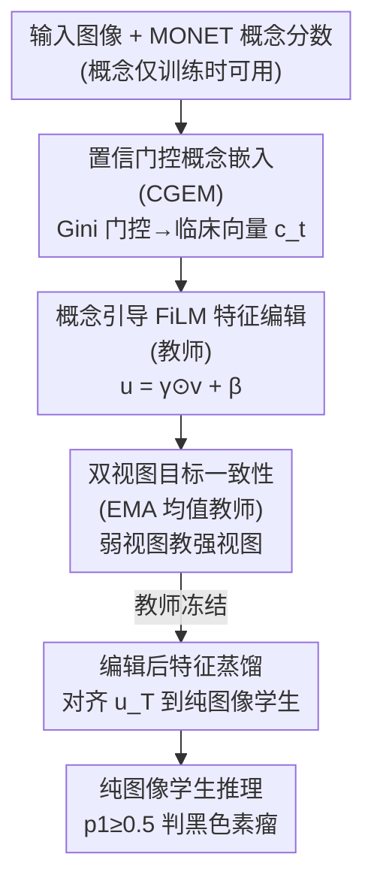

# CoFiDA-M: Concept-Aware Feature Modulation for Cross-Domain Adaptation with Image-Only Inference

**会议**: CVPR 2026  
**arXiv**: [2605.31591](https://arxiv.org/abs/2605.31591)  
**代码**: 有（论文称 Implementation code available at GitHub，⚠️ 具体仓库地址以原文为准）  
**领域**: 医学图像 / 域适应 / 知识蒸馏  
**关键词**: 皮肤癌筛查, 特权信息, FiLM 特征调制, 概念引导, 教师-学生蒸馏

## 一句话总结
针对"皮肤镜专家图 → 手机临床图"的域偏移，CoFiDA-M 在**训练时**用 MONET 临床概念分数（特权信息）引导 FiLM 编辑视觉特征、教出一个"会临床推理"的教师，再把教师**编辑后的特征**蒸馏进一个**只吃图像**的学生，让学生在 6 个未见数据集上保持高 AUROC 和高黑色素瘤召回，同时部署时不依赖任何概念元数据。

## 研究背景与动机

**领域现状**：基于 AI 的皮肤癌筛查模型通常在皮肤镜（dermoscopic，专家设备、近距离、纹理清晰）图像上训练，主流跨域思路是无监督域适应（UDA）——通过对抗训练（DANN）、统计矩对齐（CORAL、MMD）把源域和目标域的特征分布强行拉到无法区分，学一个统一的特征空间。

**现有痛点**：当部署到消费级临床（clinical，手机拍摄、光照杂乱、有毛发/直尺/阴影）图像时，模型性能断崖式下跌。而"加更多临床图重训"也救不了——每换一个相机、一种光照、一类人群，本质上都是一个新域，模型遇到未见分布就崩。更关键的是，全局分布对齐**忽略了语义不变量**：像"溃疡（ulceration）""色素网络（pigment network）"这类高层临床概念，无论在皮肤镜还是手机图里都是同一回事，只对齐全局统计量的模型既不鲁棒也不可解释。

**核心矛盾（部署悖论）**：新基础模型 MONET 能为每张图打出密集的、概率化的临床概念分数（如 ulceration=0.83），这是比"一句文本 prompt"丰富得多的监督信号；但**这些元数据在测试时根本拿不到**——患者用手机自查时不可能提供专家级概念标注。于是训练时有特权信息、推理时只有图像，二者错配。

**本文目标**：① 在训练时把 MONET 概念这种"有噪声、概率化"的元数据用起来，引导跨域语义对齐；② 让最终落地的模型是纯图像（image-only）的，不依赖任何概念输入。

**切入角度与核心 idea**：把问题套进**特权信息（Privileged Information, PI）**框架——训练时可见、推理时不可见的辅助数据。已有 PI 方案 DALUPI 用两阶段"幻觉（hallucination）"管线（先学着造出 PI，再据此预测），作者认为绕。本文改成更直接的**教师-学生**：教师用 MONET 概率经 FiLM 直接调制（"编辑"）视觉特征空间，学生则学着复现教师**编辑后的整个特征表示**（而不只是模仿最终预测），把"临床推理"烤进学生权重里。

## 方法详解

### 整体框架
CoFiDA-M 是一个三阶段 pipeline：**阶段 1 训练概念引导的教师** → **阶段 2 把教师蒸馏成纯图像学生** → **阶段 3 学生纯图像推理**。骨干统一用 EfficientNet-B2（倒数第二层输出 $d=1408$ 维特征 $\mathbf{v}=f_\theta(x)$）。

教师这一支先把每个 MONET 概念的概率 $s_a$ 经"置信门控嵌入"（CGEM）压成一个 256 维临床条件向量 $\mathbf{c}_t$，再用它通过 FiLM 生成仿射参数去缩放/平移图像特征 $\mathbf{v}$，得到"临床编辑后"的特征 $\mathbf{u}=\boldsymbol{\gamma}\odot\mathbf{v}+\boldsymbol{\beta}$，最后分类。教师在**有标签源域**（焦点损失 + 编辑正则）和**无标签目标域**（EMA 均值教师 + 弱/强双视图一致性）上联合训练。教师练好后冻结，学生共享骨干和分类头、但把 FiLM 换成一个**仅凭图像**预测编辑的残差头 $\boldsymbol{\psi}_{\mathrm{edit}}$，通过蒸馏去对齐教师的 logits 和编辑后特征 $\mathbf{u}_T$。推理时只跑学生、只吃图像。

### 关键设计

**1. 置信门控 MONET 概念嵌入（CGEM）：让"模棱两可"的概念别捣乱**

MONET 给出的概念分数是带噪声的概率，直接把标量 $s_a$ 喂进网络有两个问题：丢掉了"概念不存在"这一面的信息，且对 $s_a\approx0.5$ 这种"模型自己都不确定"的概念一视同仁。作者先把每个概念扩成双态概率向量 $\mathbf{q}_a=[\,1-s_a,\ s_a\,]^\top$ 同时保留"在场/不在场"；再用 Gini 不纯度构造一个置信门 $g_a=s_a^2+(1-s_a)^2$——当 $s_a$ 接近 0 或 1 时 $g_a$ 大（确定），接近 0.5 时 $g_a$ 小（不确定）。每个概念有可学嵌入表 $\mathbf{E}_a\in\mathbb{R}^{2\times32}$，先按 $\mathbf{q}_a$ 投影、再乘门控 $g_a$，把所有概念拼接后过两层 MLP 得到临床条件向量
$$\mathbf{c}_t=\mathrm{MLP}\!\big(\mathrm{concat}_a\{\,g_a(\mathbf{E}_a^\top\mathbf{q}_a)\,\}\big)\in\mathbb{R}^{256}.$$
这样不确定的概念被自动衰减、只让高置信概念真正参与调制。消融里去掉门控后黑色素瘤召回从 86.36 暴跌到 43.20（临床域），证明"过滤噪声概念分数"是整个框架最吃重的一环

**2. 概念引导的 FiLM 特征编辑（教师）：用临床语义"改写"而非"拼接"特征**

要让外部临床概念真正影响内部表示，又不能去改骨干权重。作者用 FiLM（Feature-wise Linear Modulation）：一个条件函数 $\boldsymbol{\psi}:\mathbb{R}^{256}\!\to\!\mathbb{R}^{2d}$ 从 $\mathbf{c}_t$ 预测仿射参数 $\boldsymbol{\gamma},\boldsymbol{\beta}=\mathrm{split}(\boldsymbol{\psi}(\mathbf{c}_t))$，对图像特征做逐通道编辑 $\mathbf{u}=\boldsymbol{\gamma}\odot\mathbf{v}+\boldsymbol{\beta}$；编辑向量 $\mathbf{e}=\mathbf{u}-\mathbf{v}$ 即"临床修正量"。为防止 FiLM 偷懒——直接放大分类判别方向上的分量（相当于作弊提分而非编码临床线索），作者加了两个正则：正交约束 $\mathcal{L}_\perp=\mathrm{MSE}((\mathbf{e}\mathbf{W}_{\mathrm{cls}}^\top)\mathbf{W}_{\mathrm{cls}},\mathbf{0})$ 惩罚编辑与分类器决策方向对齐，软范数约束 $\mathcal{L}_{\mathrm{norm}}=\max(0,\|\mathbf{e}\|_2-R_{\max})$（$R_{\max}=2.0$）限制编辑幅度只做"小而可控"的微调。消融中把 FiLM 换成朴素 concat，临床召回从 86.36 掉到 73.86，说明"乘性+加性地编辑特征空间"确实比"简单拼接特征"强

**3. 双视图目标一致性（EMA 均值教师）：在无标签临床图上稳住适应**

目标域没有标签，光靠源域监督学不到目标分布。作者在目标图上做弱/强双增广：EMA 教师（在线参数的指数滑动平均，$\alpha_{\mathrm{ema}}=0.999$）处理弱视图给出稳定伪标签，在线模型处理强视图。三层一致性把两视图拉齐——对称 KL 拉 logits（温度 $\tau=0.6$ 锐化）、MSE 拉编辑后特征 $\mathbf{u}$、MSE 拉编辑量 $\mathbf{e}$。为防早期伪标签噪声传播，用动态置信阈值：开始 $t(0)=0.95$ 只学高置信样本，随教师变稳逐步衰减到 0.70 以提高数据利用率。这一支让在场的临床概念在域间保持一致，得到鲁棒、域不变的表示

**4. 编辑后特征蒸馏到纯图像学生：把"推理过程"而非"结论"烤进权重**

这是破解部署悖论的关键一步。教师冻结后，学生共享同一骨干和分类头，但把需要概念输入的 FiLM 换成只看图像的残差编辑头：$\mathbf{u}_S=\mathbf{v}_S+\boldsymbol{\psi}_{\mathrm{edit}}(\mathbf{v}_S)$。蒸馏损失同时对齐两样东西——温度软化（$\tau=2.0$）的 logits KL，以及**编辑后特征**的匹配
$$\mathcal{L}_{\mathrm{distill}}=\mathrm{KL}(p_S\|p_T)\,\tau^2+\lambda_{\mathrm{feat}}\,\mathrm{MSE}(\mathbf{u}_S,\mathbf{u}_T),\quad\lambda_{\mathrm{feat}}=0.1.$$
精髓在于学生学的是教师"概念调整后的整张特征表示" $\mathbf{u}_T$，不只是最终 logits——即学"怎么推理"而非"答什么"。消融证实：只蒸 logits 严重不够（临床 AUROC 64.10）；对齐编辑**前**特征 $\mathbf{v}_T$ 有改善（66.45）；对齐编辑**后**特征 $\mathbf{u}_T$ 最好（67.50）。学生由此继承了临床推理，推理时却完全不需要 MONET

### 损失函数 / 训练策略
- 教师总损失 $\mathcal{L}_{\mathrm{teacher}}=\mathcal{L}_{\mathrm{source}}+\mathcal{L}_{\mathrm{target}}$。源域 $\mathcal{L}_{\mathrm{source}}=\mathcal{L}_{\mathrm{sup}}+\lambda_\perp\mathcal{L}_\perp+\lambda_{\mathrm{norm}}\mathcal{L}_{\mathrm{norm}}$，其中焦点损失 $\gamma_f=1.5$、类权重 $\alpha_1=0.9$（应对类不均衡、强调难样本），$\lambda_\perp=\lambda_{\mathrm{norm}}=0.01$。
- 目标域 $\mathcal{L}_{\mathrm{target}}=w_{\mathrm{kl}}\mathcal{L}_{\mathrm{KL}}+w_{\mathrm{feat}}\mathcal{L}_{\mathrm{feat}}+w_{\mathrm{edit}}\mathcal{L}_{\mathrm{edit}}$，权重 $w_{\mathrm{kl}}=0.6$、$w_{\mathrm{feat}}=w_{\mathrm{edit}}=0.1$。
- 通用：EfficientNet-B2 骨干，batch size 32，AdamW（lr $3\times10^{-4}$，weight decay $10^{-4}$），余弦退火到 $10^{-6}$，最多 50 epoch、按验证 AUROC 早停，5 个随机种子。

## 实验关键数据

**协议**：仅在单一源-目标对 MILK Dermoscopic → MILK Clinical 上训练，随后把冻结的纯图像学生**直接**在 6 个未见外部数据集上评测（严格 out-of-domain）。指标为 AUROC 和黑色素瘤召回（sensitivity，筛查中漏诊代价最高，故 recall 关键）。

### 主实验

宏平均 AUROC / 召回（%，5 seed 均值），对比 14 个基线：

| 指标 (域宏平均) | Source-Only | TENT | DALUPI(PI) | MeanTeacher | **CoFiDA-M** | 较 Source 提升 |
|--------|------|------|------|------|------|------|
| AUROC 临床(B) | 58.39 | 62.32 | 54.54 | 48.91 | **67.50** | +9.11 |
| AUROC 皮肤镜(A) | 69.96 | 69.70 | 76.07 | 55.97 | **76.50** | +6.54 |
| 召回 临床(B) | 55.77 | 55.65 | 9.72 | 77.67 | **77.89** | +22.12 |
| 召回 皮肤镜(A) | 63.55 | 65.74 | 40.11 | 64.02 | **84.92** | +21.37 |

关键对比：临床 AUROC 上 CoFiDA-M（67.50）显著超最强 TTA 方法 TENT（62.32）和 PI 基线 DALUPI（54.54）；临床召回 77.89% 虽与 Mean Teacher（77.67%）接近，但 Mean Teacher 的临床 AUROC 仅 48.91（贴近随机，靠牺牲精度换召回），而 CoFiDA-M 在 AUROC 和召回上**同时**提升，且皮肤镜源域召回也最高（84.92 vs 63.55），说明增益非来自精度-召回的此消彼长。

### 消融实验

Table 4（4 数据集宏平均，AUROC_d / AUROC_c / Recall_d / Recall_c）：

| 段 | 配置 | AUROC_d | AUROC_c | Recall_d | Recall_c | 说明 |
|----|------|------|------|------|------|------|
| A | Source-Only | 69.96 | 58.39 | 63.55 | 55.77 | 无适应基线 |
| A | 标准 UDA (无 MONET) | 76.07 | 62.32 | 69.50 | 77.67 | 仅用无标签数据 |
| A | **Ours 学生(纯图像)** | 76.50 | 67.50 | 84.92 | 77.89 | 蒸馏 MONET 概念 |
| B | Full Teacher (门控+FiLM) | 85.35 | 83.81 | 87.81 | 86.36 | 教师上限 |
| B | w/o 置信门控 | 78.32 | 75.24 | 47.70 | 43.20 | 召回暴跌 |
| B | w/o FiLM (改 concat) | 84.18 | 81.51 | 80.68 | 73.86 | 编辑优于拼接 |
| C | 只 Logit KD | 63.80 | 64.10 | 72.49 | 64.53 | 不够 |
| C | + 对齐 v_T (编辑前) | 70.68 | 66.45 | 79.12 | 75.74 | 有改善 |
| C | + 对齐 u_T (编辑后) | 76.50 | 67.50 | 84.92 | 77.89 | 最佳 |

### 关键发现
- **置信门控贡献最大**：去掉后教师临床召回从 86.36 崩到 43.20，证明过滤"不确定概念分数"是噪声 PI 能用起来的前提。
- **必须对齐"编辑后"特征 $\mathbf{u}_T$**：只蒸 logits 远不够（临床 AUROC 64.10），对齐 $\mathbf{u}_T$（67.50）优于对齐 $\mathbf{v}_T$（66.45），印证"学生要复现教师的概念调整后表示"这一核心假设。
- **增益来自教师的语义编辑、而非蒸馏本身**：从随机权重教师（RT）或零权重教师（ZT）蒸馏都无法收敛、只到随机水平（FT ≫ RT ≈ ZT），是一次干净的 sanity check。
- **学生隐式学到概念行为**：MONET 概念真值与学生自生成编辑幅度 $\|\mathbf{u}_S-\mathbf{v}_S\|_2$ 强正相关（Fig.5a），且干预提高"黑色素瘤样"概念输入会把 FiLM 编辑特征推向黑色素瘤簇（Fig.5c，因果证据）。

## 亮点与洞察
- **"蒸馏编辑后特征"而非"蒸馏 logits"**：把 FiLM 编辑量当作可蒸馏的中间表示，相当于让学生学"老师为什么这么判"而不是"老师判了什么"，这是 PI/概念瓶颈类工作里很值得迁移的思路——只要训练时有任何"会改写特征"的特权模块，都可以照此把它烤进纯图像/纯输入的学生。
- **Gini 置信门控**：用 $s^2+(1-s)^2$ 当不确定性闸门，简单到几乎零成本，却是噪声概率元数据可用的胜负手；任何"用带噪概率分数当监督"的场景都能直接借。
- **正交+软范数正则防 FiLM 作弊**：显式惩罚"编辑量与分类器决策方向对齐"，逼 FiLM 去编码临床语义而非偷偷放大判别分量，是个干净的"防捷径"设计。
- **最"啊哈"的点**：随机/零权重教师蒸馏直接退化到随机水平，干净地证明了"增益来自教师学到的语义，而非蒸馏管线给的正则效应"，这种反事实 sanity check 很有说服力。

## 局限与展望
- **强依赖训练期概念质量**：作者自己承认整个框架的天花板由 MONET 概念分数的质量决定；若概念基础模型在某域不可靠，特权信号就失效。展望是端到端学概念、或扩展到皮肤科以外的专业域。
- **仅单一源-目标对训练**：只在 MILK Dermoscopic→Clinical 上训，虽在 6 个未见集上测，但训练域多样性有限，跨更大分布漂移时是否稳健仍待验证。
- **某些未见集上并非全面领先**：如 D7d 的 AUROC（61.69）低于 DALUPI（70.26）、HAM 的 AUROC（78.45）低于 DALUPI（83.97），方法在皮肤镜未见集上的优势不如临床域明显——⚠️ 横向比较受各数据集难度/类别分布差异影响，不宜简单按单列数字定高下。
- **二分类设定**：当前只做"黑色素瘤 vs 其他"二分类（$p_1\ge0.5$ 判正），多类细粒度诊断下框架是否同样有效未知。

## 相关工作与启发
- **vs DALUPI（PI for UDA）**：同属特权信息框架，但 DALUPI 用两阶段"幻觉"管线（先 $X\to W$ 造出 PI、再 $W\to Y$ 预测）；本文改成单阶段、用概念直接 FiLM 调制特征 + 蒸馏编辑后表示，更直接，临床 AUROC 67.50 vs DALUPI 54.54。
- **vs PØDA / LAGUNA（语言引导域适应）**：它们用文本 prompt 或目标域 caption 引导特征迁移，需要干净文本/目标 caption；本文用 MONET 的逐图、已校准概率分数，提供比文本 prompt 细粒度得多的监督，且学生推理时彻底不需要文本/概念。
- **vs Mean Teacher / TENT / CoTTA（一致性 / TTA）**：本文复用了 EMA 均值教师的一致性思想做目标域适应，但区别在于一致性是建立在"概念编辑后"的特征空间上，且最终蒸成纯图像学生、推理零适应；Mean Teacher 单看召回接近但 AUROC 贴随机，说明缺了概念引导就只能在精度-召回间摇摆。
- **vs MAKE / 概念瓶颈类皮肤科模型**：它们注入专家概念做零样本识别，但**测试时仍需概念输入**；CoFiDA-M 把概念对齐转移进概念无关的学生，是核心差异。

## 评分
- 新颖性: ⭐⭐⭐⭐ 把"特权概念 → FiLM 编辑特征 → 蒸馏编辑后表示"串成破解部署悖论的清晰方案，思路新且可迁移。
- 实验充分度: ⭐⭐⭐⭐ 14 个基线、6 个未见集、5 seed、三段消融 + 反事实 sanity check，较扎实；但只训单一源-目标对、二分类，规模偏小。
- 写作质量: ⭐⭐⭐⭐ 动机（部署悖论）讲得清楚，公式与消融对应整齐，图示解释充分。
- 价值: ⭐⭐⭐⭐ 给"如何用有噪声、推理时不可见的概率元数据"提供了通用范式，对医学等元数据稀缺的落地场景实用。

<!-- RELATED:START -->

## 相关论文

- [\[CVPR 2026\] SHAPE: Structure-aware Hierarchical Unsupervised Domain Adaptation with Plausibility Evaluation for Medical Image Segmentation](shape_structure-aware_hierarchical_unsupervised_domain_adaptation_with_plausibil.md)
- [\[CVPR 2026\] Cross-domain Dual-stream Feature Disentanglement for Brain Disorder Prediction with Sparsely Labeled PET](cross-domain_dual-stream_feature_disentanglement_for_brain_disorder_prediction_w.md)
- [\[CVPR 2026\] CRFT: Consistent-Recurrent Feature Flow Transformer for Cross-Modal Image Registration](crft_consistent-recurrent_feature_flow_transformer_for_cross-modal_image_registr.md)
- [\[CVPR 2026\] Interpretable Cross-Domain Few-Shot Learning with Rectified Target-Domain Local Alignment](interpretable_cross-domain_few-shot_learning_with_rectified_target-domain_local_.md)
- [\[CVPR 2026\] Tell2Adapt: A Unified Framework for Source Free Unsupervised Domain Adaptation via Vision Foundation Model](tell2adapt_a_unified_framework_for_source_free_unsupervised_domain_adaptation_vi.md)

<!-- RELATED:END -->
