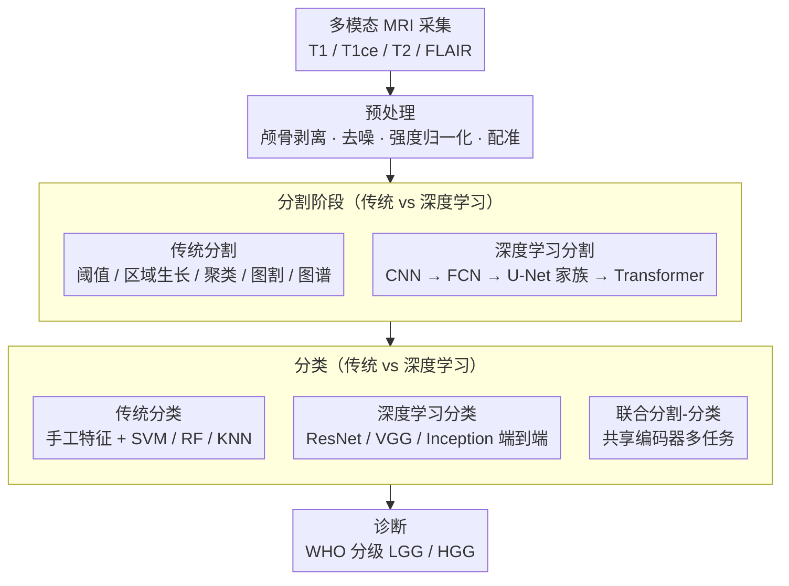

# Comparative Evaluation of Traditional Methods and Deep Learning for Brain Glioma Imaging

**会议**: CVPR 2026  
**arXiv**: [2603.04796](https://arxiv.org/abs/2603.04796)  
**作者**: Kiranmayee Janardhan, Vinay Martin DSa Prabhu, T. Christy Bobby
**领域**: 图像分割  
**关键词**: brain glioma, MRI segmentation, classification, deep learning, CNN, traditional methods, medical imaging

## 一句话总结
一篇系统性综述论文，全面对比传统方法（阈值分割、区域生长、模糊聚类等）和深度学习方法（CNN、U-Net、SegNet 等）在脑胶质瘤 MRI 分割与分类任务上的表现，结论指出 CNN 架构在准确性和自动化程度上全面优于传统技术。

## 研究背景与动机

脑胶质瘤（Glioma）是最常见的原发性脑肿瘤，准确的分割和分类对治疗方案制定至关重要：
- **分割需求**：精确勾画肿瘤边界（包括增强区域、坏死核心、水肿区域）是手术规划、放疗靶区定义和疗效监测的基础
- **分类需求**：根据 WHO 分级（LGG vs HGG）、大小、位置和侵袭性进行分类，直接影响预后预测和治疗策略选择
- **核心挑战**：胶质瘤组织形态不规则、边界模糊、与正常脑组织对比度低，无误且可复现的分割极为困难

### 现有方法的局限
- 传统方法（阈值、区域生长、聚类等）依赖手工特征和先验假设，对噪声敏感，泛化能力弱
- 全自动方法虽然高效，但放射科医师更倾向半自动方法，因其允许人工校正以确保评估准确性
- 深度学习方法在 BraTS 等基准上表现优异，但模型复杂度、计算成本和可解释性仍是临床部署的障碍
- 缺乏系统性比较不同方法族（传统 vs 深度学习）在统一框架下的优劣分析

### 本文定位
作为综述论文，系统梳理 MRI 采集后的分割与分类技术全景，从经典图像处理到现代深度学习，为研究者和临床从业者提供方法选择的参考依据。

## 方法详解

### 整体框架

这篇综述把脑胶质瘤的影像分析拆成「采集 → 预处理 → 分割 → 分类 → 诊断」一条流水线（对应原文 Fig.3 的 generic process flow），然后沿这条线把两大方法族——传统图像处理与深度学习——一一摆出来对比。胶质瘤一般用多模态 MRI 成像，每个模态突出不同组织：T1 加权看解剖结构、增强后（T1ce）勾出活跃肿瘤区，T2 加权高亮水肿，FLAIR 抑掉脑脊液信号、专门凸显肿瘤周围水肿；进网络前通常还要做颅骨剥离、去噪、强度归一化（含偏置场校正）、配准对齐，把不同序列、不同设备的图像拉到可比的空间。预处理之后，分割负责把肿瘤（增强区、坏死核心、水肿）从正常脑组织里抠出来，分类则在分割结果或原图上判断 WHO 分级（LGG vs HGG）、最终汇成诊断。综述的主线就是：在采集与预处理这条共用脚手架之上，分割和分类两个阶段各有「传统手工特征」与「数据驱动深度学习」两条路线，各自怎么做、强弱在哪。

### 关键设计

**1. 传统分割方法：靠手工特征和先验假设把肿瘤"算"出来**

传统路线的共同点是不学习、只计算——用人定的规则和图像统计量去逼近肿瘤边界，因此速度快、可在 CPU 上跑，但碰上胶质瘤这种边界模糊、灰度不均的目标就容易失手。综述把它细分成几类：最朴素的是**阈值法**，全局阈值或 Otsu 自动阈值简单快速，但 MRI 灰度本身非均匀，效果差，自适应阈值改用局部窗口算阈值缓解了非均匀问题、却仍对噪声敏感；**基于区域的方法**里，区域生长从种子点向外扩张、强烈依赖种子选取，在模糊边界处常过分割或欠分割，分水岭则在梯度图上做形态学分割、天生易过分割，往往要靠标记控制收住。**聚类方法**把分割当成像素归类：K-Means 高效但要预设类别数且对初始化敏感，模糊 C 均值（FCM）允许隶属度模糊化、更贴合胶质瘤边界的渐变特性，高斯混合模型（GMM）则用 EM 算法统计建模灰度分布。更"全局"一些的是**图割与能量优化**——图割（Graph Cut）把分割写成能量最小化问题、能拿全局最优但计算开销大，活动轮廓 / 水平集（Level Set）靠曲线演化拟合边界、对初始化和参数极敏感，MRF/CRF 则引入空间先验约束改善局部一致性。最后是**基于图谱的方法**，把标准脑图谱配准过来做标签传播，成败完全系于图谱质量和配准精度。

**2. 深度学习分割方法：从 patch-CNN 一路演进到 U-Net 家族与 Transformer**

深度学习路线把"手工设计特征"换成"从数据里自动学层次化特征"，这正好补上了传统方法泛化弱、对噪声敏感的短板。综述按演进顺序铺开：最早的 **CNN** 用 patch-based 方式逐像素分类，特征是学出来的、但逐 patch 推理效率很低；**全卷积网络（FCN）** 去掉全连接层、改成端到端像素级预测，支持任意尺寸输入，再用反卷积 / 上采样把空间分辨率恢复回来。真正成为医学分割主力的是 **U-Net 家族**——U-Net 的编码器-解码器加跳跃连接在小样本医学图像上表现卓越，V-Net 把它扩到 3D 并引入 Dice Loss 适配体积分割，Attention U-Net 用注意力门控聚焦关键区域、压掉无关背景，nnU-Net 则是个自适应配置框架，不用手动调参就在 BraTS 挑战里多次拿到 SOTA。此外还有几条支线：SegNet 用池化索引做上采样、内存效率高，DeepLab 系列靠空洞卷积扩大感受野再接 CRF 后处理，近年的 ViT、Swin-UNETR 等 Transformer 架构则引入全局注意力来捕捉长程依赖。

**3. 分类方法：从手工特征分类器到端到端深度网络与联合分割-分类**

分割之外，综述把分类也分成两代。传统分类用 SVM、随机森林、KNN，输入是人工提取的纹理 / 形态学 / 统计特征，强弱完全取决于特征设计得好不好；深度学习分类则用 ResNet、VGG、Inception 这类网络，直接从 MRI 切片端到端学特征并判 LGG/HGG，省掉了手工特征环节。综述还指出一条更紧凑的路线——联合分割-分类的多任务学习框架，让一个共享编码器同时输出分割掩码和分类结果，呼应了临床上"先准确分割、再据此分类"的工作流耦合。

## 实验关键数据

### Table 1: 传统方法 vs 深度学习方法在脑胶质瘤分割上的典型性能对比

| 方法类别 | 代表方法 | Dice (整体肿瘤) | Dice (肿瘤核心) | Dice (增强区域) | 自动化程度 |
|---|---|---|---|---|---|
| 阈值/区域生长 | Otsu + 区域生长 | 0.72-0.78 | 0.55-0.65 | 0.50-0.60 | 半自动 |
| 模糊聚类 | FCM | 0.75-0.82 | 0.60-0.70 | 0.55-0.65 | 半自动 |
| 图割/CRF | Graph Cut + CRF | 0.80-0.85 | 0.65-0.75 | 0.60-0.70 | 半自动 |
| CNN (patch) | Patch-based CNN | 0.84-0.87 | 0.73-0.78 | 0.68-0.74 | 全自动 |
| U-Net | 2D/3D U-Net | 0.88-0.91 | 0.80-0.85 | 0.75-0.82 | 全自动 |
| nnU-Net | nnU-Net | 0.91-0.93 | 0.85-0.88 | 0.82-0.86 | 全自动 |
| Transformer | Swin-UNETR | 0.90-0.92 | 0.84-0.87 | 0.81-0.85 | 全自动 |

### Table 2: 不同方法的关键特性对比

| 特性 | 传统方法 | 深度学习方法 |
|---|---|---|
| 特征设计 | 手工设计，依赖领域知识 | 自动学习，数据驱动 |
| 数据需求 | 少量数据即可 | 需要大量标注数据 |
| 泛化能力 | 弱，跨数据集性能下降显著 | 强，尤其预训练模型迁移效果好 |
| 计算成本 | 低，可在 CPU 上运行 | 高，通常需要 GPU 加速 |
| 可解释性 | 高，物理/数学含义明确 | 低，"黑箱"特性 |
| 多模态融合 | 需显式设计融合策略 | 自然支持多通道输入 |
| 临床采纳度 | 高（半自动），医师可控 | 中等，全自动但信任度待提升 |
| BraTS 竞赛表现 | 难以进入 top ranks | 占据排行榜前列 |
| 对噪声/伪影鲁棒性 | 弱 | 较强，可通过数据增强进一步提升 |

## 亮点与洞察

- **CNN 全面超越传统方法**：综述得出明确结论，CNN 架构（尤其 U-Net 家族）在分割精度、鲁棒性和自动化程度上全面优于传统技术，Dice 系数提升 10-15%
- **半自动 vs 全自动的临床权衡**：放射科医师倾向半自动方法，因其允许人工干预和校正；这提示深度学习方法需要更好的交互式设计以提升临床接受度
- **综述覆盖面广**：22 页系统性梳理从经典图像处理到现代深度学习的技术演进，为新入门研究者提供了完整的技术地图
- **分割与分类的协同**：准确分割是精确分类的前提，综述同时覆盖两个任务，强调二者在临床工作流中的紧密耦合

## 局限性

- **综述而非原创方法**：作为 review paper，不包含新方法或新实验，主要贡献在于系统性整理和对比
- **缺少最新进展**：可能未充分覆盖 Transformer-based 方法（如 Swin-UNETR、TransBTS）以及扩散模型在医学分割中的最新应用
- **实验对比不够统一**：引用的各方法性能数据来自不同论文、不同数据集和不同实验设置，直接对比需谨慎
- **临床部署讨论不足**：未深入探讨模型在实际临床环境中的部署挑战（如实时性、FDA 审批、数据隐私等）
- **与 CVPR 的契合度存疑**：作为发表在 International Journal of Bioautomation 的综述论文，属于医学影像分析领域与计算机视觉的交叉地带

## 相关工作

- **BraTS Challenge**：脑肿瘤分割基准挑战赛，推动了该领域方法的标准化评测（Menze et al., 2015; Bakas et al., 2018）
- **U-Net 系列**：Ronneberger et al. (2015) 提出 U-Net，后续 3D U-Net、Attention U-Net、nnU-Net 等变体不断刷新 SOTA
- **传统方法综述**：Gordillo et al. (2013) 综述了早期脑肿瘤分割方法；Bauer et al. (2013) 讨论了全自动分割的挑战
- **深度学习医学影像综述**：Litjens et al. (2017) 全面综述深度学习在医学图像分析中的应用
- **Transformer 在医学分割中的应用**：Chen et al. (TransUNet, 2021)、Hatamizadeh et al. (Swin-UNETR, 2022) 将 Transformer 引入医学图像分割
- **本文定位**：侧重于传统方法与深度学习的系统性对比，强调方法演进脉络和临床实用性评估

## 评分

- 新颖性: ⭐⭐ — 综述论文，无新方法提出，主要贡献在于系统整理
- 实验充分度: ⭐⭐ — 引用已有结果进行对比，未在统一基准上重新实验
- 写作质量: ⭐⭐⭐ — 22 页覆盖面广，结构完整，适合入门者阅读
- 价值: ⭐⭐⭐ — 为脑胶质瘤分割领域提供了方法全景图，对新研究者有参考价值

<!-- RELATED:START -->

## 相关论文

- [\[CVPR 2026\] Deep Learning–Based Estimation of Blood Glucose Levels from Multidirectional Scleral Blood Vessel Imaging](deep_learning_based_estimation_of_blood_glucose_levels_from_multidirectional_scl.md)
- [\[ICLR 2026\] SEED: Towards More Accurate Semantic Evaluation for Visual Brain Decoding](../../ICLR2026/medical_imaging/seed_towards_more_accurate_semantic_evaluation_for_visual_brain_decoding.md)
- [\[ECCV 2024\] Brain-ID: Learning Contrast-agnostic Anatomical Representations for Brain Imaging](../../ECCV2024/medical_imaging/brain-id_learning_contrast-agnostic_anatomical_representations_for_brain_imaging.md)
- [\[CVPR 2026\] Automated Detection of Malignant Lesions in the Ovary Using Deep Learning Models and XAI](automated_detection_of_malignant_lesions_in_the_ov.md)
- [\[CVPR 2026\] Reinforcing the Weakest Links: Modernizing SIENA with Targeted Deep Learning Integration](reinforcing_the_weakest_links_modernizing_siena_wi.md)

<!-- RELATED:END -->
