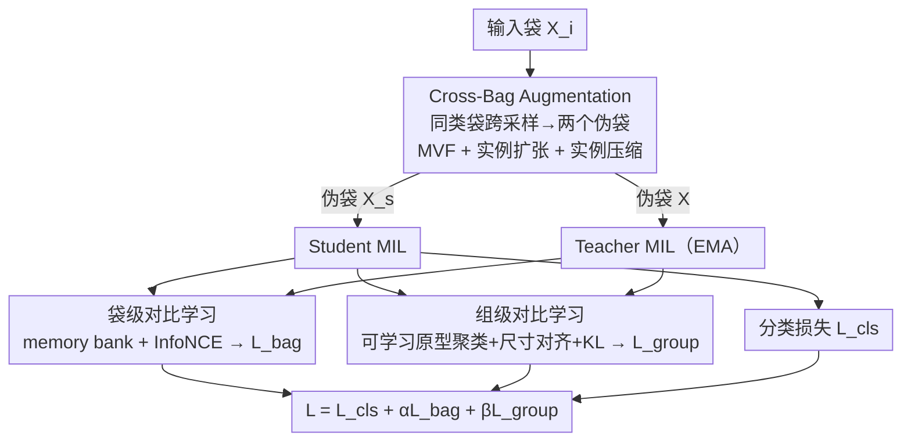

# Contrastive Cross-Bag Augmentation for Multiple Instance Learning-based Whole Slide Image Classification

**会议**: CVPR 2026  
**论文**: [CVF Open Access](https://openaccess.thecvf.com/content/CVPR2026/html/Zhang_Contrastive_Cross-Bag_Augmentation_for_Multiple_Instance_Learning-based_Whole_Slide_Image_CVPR_2026_paper.html)  
**代码**: https://github.com/weiaicunzai/mixup （论文标注，⚠️ 仓库名与方法名不符，以原文为准）  
**领域**: 医学图像  
**关键词**: 全切片图像分类, 多示例学习, 伪袋增强, 跨袋采样, 对比学习  

## 一句话总结
针对 WSI 弱监督分类中伪袋增强"只在一两个袋内采样、多样性受限"的问题，C2Aug 从全数据集所有同类袋里跨袋采样实例并入原袋来造伪袋（增-并而非减-并），再用袋级 + 组级对比学习缓解由此带来的"小肿瘤区样本变少"副作用，在 CAMELYON-16/TCGA-LUNG/TCGA-BRCA 三套数据上 AUC 全面超越现有增强方法。

## 研究背景与动机
**领域现状**：全切片图像（WSI）分辨率高达约 10 万 × 10 万像素，逐像素标注肿瘤区域成本极高，因此主流做法是多示例学习（MIL）——把一张切片切成大量 patch，每个 patch 编码成一个实例（instance），整张切片所有实例构成一个"袋"（bag），训练时只需袋级标签（如"是否含肿瘤"）。由于 WSI 数据多锁在各家医院、公开数据集规模小，MIL 模型很容易过拟合，于是大家用伪袋（pseudo-bag）增强来扩样本。

**现有痛点**：现有伪袋增强分两类——自增强（self-augmentation，只在输入袋内部采样/生成实例）和 Mixup 式增强（把两个袋混成一个）。两类的共同毛病是：伪袋只从一两个袋里采样，可组合的实例池太小，**多样性受限**；而且多数方法走"减-并"（reduction-and-merge）路线，先按注意力/预测分从袋里挑关键实例再融合，挑的过程本身会引入实例级噪声、还可能丢掉关键肿瘤实例。

**核心矛盾**：想提升伪袋多样性，最直接的办法是扩大采样池（跨多个袋采）。但跨袋把更多肿瘤实例塞进伪袋后，会出现一个反效果——**"只含少量肿瘤实例的伪袋"在训练中变少了**。而真实测试切片里有大量肿瘤占比 <1% 的小肿瘤区切片（CAMELYON-16 阳性切片肿瘤区常 <10%），训练分布与这些难样本不匹配，模型在小肿瘤区上反而变差。多样性与小肿瘤区可分性之间出现张力。

**本文目标**：(1) 在不丢实例、不引噪声的前提下把伪袋多样性最大化；(2) 同时补偿小肿瘤区样本被"稀释"的副作用。

**切入角度**：作者观察到"同一袋级标签下的所有袋"天然是一个无噪声的实例池——只要采样时保证袋级标签一致，跨袋采来的实例就不会污染标签。于是把采样范围从"一两个袋"扩到"全数据集所有同类袋"，并坚持**保留原输入袋**（增-并）而非替换它。

**核心 idea**：用"跨全部同类袋采样 + 并入原袋"的增-并伪袋生成，替换"袋内/双袋挑选 + 融合"的减-并；再叠加袋级 / 组级对比学习，把语义相近的特征在嵌入空间里拉近，专门救小肿瘤区切片。

## 方法详解

### 整体框架
C2Aug 是一个**只在训练期生效**的增强 + 对比学习框架（推理时直接喂原袋、无任何增强）。给定输入袋 $X_i$，它先用 Cross-Bag Augmentation 从同类袋池里采样实例，生成两个不同的伪袋 $X_s$ 和 $X$，分别送进 student 与 teacher 两个 MIL 模型；teacher 参数由 student 以指数滑动平均（EMA）更新。两个分支的袋级表示进 memory bank 算袋级对比损失 $\mathcal{L}_{bag}$；两个分支的实例输出经"可学习原型聚类 + 尺寸对齐"压成等长的组级表示后算组级对比损失 $\mathcal{L}_{group}$；student 分支同时算分类损失 $\mathcal{L}_{cls}$。三个损失加权相加联合训练。

### 关键设计

**1. Cross-Bag Augmentation：跨全部同类袋采样、增-并造伪袋，三种子增强分管实例与袋长多样性**

这是全文的核心，直击"采样池太小、多样性受限"。它从**所有与 $X_i$ 同袋级标签的袋**里采样实例并入原袋，由三个子模块协同：

- *Multi-View Fusion（MVF，实例级增强）*：对原袋第 $j$ 个实例 $x_{i,j}$，从其它同类袋里采出 $m$ 个"对应位置"实例 $\{v_{1,j},\dots,v_{m,j}\}$ 组成多视图，再用 Cross-Attention 把它们融进 $x_{i,j}$，融合时 $Q$ 来自原实例、$K/V$ 来自这 $m$ 个外部实例：

$$\text{CrossAttention}(Q,K,V)=\text{Softmax}\!\left(\frac{QK^\top}{\sqrt{d}}\right)V$$

融合后袋长不变，但每个实例都被"灌入"了同类的多视角信息，增大了**单个实例的多样性**。为了让不同实例融合的视图数 $m'$ 不同（在 $1\sim m$ 间变化），作者把 $QK^\top$ 中被屏蔽的位置置 $-9999$，经 Softmax 后权重归零；屏蔽用三种策略——逐元素随机（masked 数服从二项分布 $P(m_j')=\binom{m}{m_j'}p^{m_j'}(1-p)^{m-m_j'}$）、逐行随机（$m_j'$ 服从均匀分布 $P=1/m$）、Top-k 随机（按注意力分屏蔽 top-k）。
- *Instance Expansion（IE，加长袋）*：再从同类袋采 $n_e$ 个实例拼到原袋后面，$n_e\sim \text{Uniform}[0,\,n_{max}-n]$（$n_{max}$ 为训练集最大袋长），得到袋长 $n+n_e$ 的伪袋，给袋长引入"变长"的多样性。
- *Instance Compression（IC，缩短袋）*：把袋按压缩比 $C_r$ 切成 $C=\lceil n/C_r\rceil$ 折，每折用一个**共享可学习 query** 做 Cross-Attention 压成一个实例，得袋长 $C$ 的伪袋；每轮从 $[2,C_r]$ 均匀采 $\tilde C_r$ 增加多样性。

三者分别覆盖"实例级表示 / 袋变长 / 袋变短"。关键区别在于：旧方法用基于采样的减法（按分数挑实例、丢掉其余），会丢关键实例并引噪；C2Aug 用**基于压缩**的变换，并始终**保留原输入袋**，既保住类相关特征又把采样范围扩到全数据集——消融里"是否保留输入袋"一项显示，MVF 若替换掉原袋而非保留，正常切片 AUC 直接掉 3.2%（ResNet50）。

**2. 袋级对比学习（Bag-level Contrastive Learning）：student-teacher 双分支把同语义袋表示拉近**

跨袋增强塞入更多肿瘤实例后，"小肿瘤伪袋"变少，需要在表示空间里主动把同语义的袋拉到一起。作者借鉴 DINO 用 student / teacher 双分支：对同一 $X_i$ 用两种不同增强得到两个袋表示 $z_i,z_i'$（MIL 输出过 projection head + L2 归一化），teacher 由 student 以 EMA 更新、并产出正样本 $z_i^+$；负样本是 teacher 分支里其它袋的表示，存进容量 $k$ 的先进先出 memory bank。损失为 InfoNCE 形式：

$$\mathcal{L}_{bag}=-\log\frac{\exp(\text{sim}(z_i,z_i^+)/\tau)}{\sum_{j=1}^{k+1}\exp(\text{sim}(z_i,z_j)/\tau)}$$

其中 $\text{sim}(\cdot)$ 为余弦相似度、$\tau$ 为温度。t-SNE 显示加了 $\mathcal{L}_{bag}$ 后肿瘤袋特征明显聚团，而不加时肿瘤特征散得很均匀——这正是它救小肿瘤区可分性的直接证据。

**3. 组级对比学习（Group-level Contrastive Learning）：可学习原型聚类 + 尺寸对齐，避开实例级对比的噪声**

如果直接做实例级对比，会出问题：不同袋里语义相近的实例本应是正样本，却被当成负样本对，引入训练噪声。作者改成把语义相近的实例先聚成组再做组级对比。具体地，初始化 $C$ 个**可学习原型**，算每个实例与原型的余弦相似度矩阵，把每个实例分给最相似的原型，形成 $C$ 个组；每组用 Cross-Attention（原型作 $Q$、组内实例作 $K/V$）压成一个组表示，从而把 student/teacher 两分支本来不等长（$n_s\neq n_t$）的实例输出**尺寸对齐**成等长的 $g_s,g_t\in\mathbb{R}^{C\times d}$。对 teacher 组表示做 centering + sharpening 防坍缩，再把两分支组表示转成概率分布 $P_{s}^{c},P_{t}^{c}$（对维度做温度 Softmax），用 KL 散度拉近：

$$\mathcal{L}_{group}=\sum_{c=1}^{C}P_s^c\log\frac{P_s^c}{P_t^c}$$

相比 RetCCL 用 K-means 算不可训练的聚类中心，这里的原型是可学习的、表达能力更强。

### 损失函数 / 训练策略
总损失为分类损失加两个对比损失：

$$\mathcal{L}=\mathcal{L}_{cls}+\alpha\mathcal{L}_{bag}+\beta\mathcal{L}_{group}$$

$\alpha,\beta$ 为权重超参。teacher 分支用 EMA 更新、stop-gradient。C2Aug 仅训练期启用，推理时输入原袋、无增强，因此不增加推理开销，可即插即用到任意 MIL 主干（DSMIL / TransMIL / DTFD-MIL）。

## 实验关键数据

### 主实验
三套数据集（CAMELYON-16、TCGA-LUNG、TCGA-BRCA）、三种 MIL 主干、两种特征提取器（ResNet50 / Prov-Gigapath），五折交叉验证。下表摘取 TransMIL 主干、ResNet50 特征下 AUC 的代表性对比（单位 %）：

| 数据集 | vanilla | RankMix | AugDiff | PRDL | C2Aug (本文) |
|--------|---------|---------|---------|------|--------------|
| CAMELYON-16 | 89.9 | 90.4 | 91.4 | 91.2 | **94.7** |
| TCGA-LUNG | 91.3 | 91.9 | 92.5 | 93.2 | **94.1** |
| TCGA-BRCA | 88.4 | 89.0 | 91.2 | 90.8 | **92.5** |

换 Prov-Gigapath 特征 + TransMIL，CAMELYON-16 的 AUC 进一步到 **98.9%**（vanilla 95.1%，+3.8），ACC 97.3%（较 vanilla +3.4）。在小肿瘤区占主导的 CAMELYON-16 上，C2Aug 相对 baseline 把 TransMIL 的 AUC 提了 5.6%，提升最猛——印证它专门针对"小肿瘤区"的设计动机。

### 消融实验
Cross-Bag 三子模块消融（TransMIL，CAMELYON-16，AUC %）：

| 配置 | ResNet50 AUC | Prov-Gigapath AUC | 说明 |
|------|--------------|-------------------|------|
| C2Aug（完整） | 94.7 | 98.9 | 全模块 |
| w/o CB（去整个跨袋增强） | 90.9 | 96.7 | 掉最多，跨袋采样是地基 |
| w/o MVF | 91.5 | 97.2 | 去实例级增强，掉幅次大 |
| w/o IC | 91.9 | 97.6 | 去实例压缩 |
| w/o IE | 92.5 | 97.8 | 去实例扩张，掉幅最小 |

对比损失按肿瘤占比分层消融（CAMELYON-16 ACC %）：

| 配置 | <1% | 1%~10% | Normal | Total |
|------|-----|--------|--------|-------|
| C2Aug | **82.4** | **91.4** | 93.8 | **91.9** |
| w/o $\mathcal{L}_{bag}$ | 81.3 | 90.0 | 93.4 | 90.4 |
| w/o $\mathcal{L}_{group}$ | 81.1 | 90.3 | 92.8 | 90.1 |
| w/o $\mathcal{L}_{bag}+\mathcal{L}_{group}$ | 80.6 | 89.5 | 92.7 | 89.4 |

### 关键发现
- **跨袋采样是地基，实例级增强次之**：去掉整个 Cross-Bag 掉点最多（ResNet50 AUC 94.7→90.9），三子模块中 MVF（实例级）掉幅最大、IE（加长袋）最小，说明"丰富每个实例的多样性"比"改袋长"更关键。
- **对比损失专救小肿瘤区**：去掉 $\mathcal{L}_{bag}+\mathcal{L}_{group}$ 后，肿瘤占比 <1%（-1.8）与 1%~10%（-1.9）两组掉点最重，正常组几乎不变，证明两个对比损失正是补偿"小肿瘤伪袋被稀释"副作用的关键。
- **采样越多越随机越好**：采样袋数从 4→16→64→全部，AUC 单调上升；且"每袋随机数量"优于"每袋等量"（全类袋采样下 ResNet50 +0.8、Prov-Gigapath +1.3），因为等量采样只是随机采样的特例、多样性更低。
- **必须保留原输入袋**：把 MVF 的原袋替换成随机采样实例后正常切片 AUC 掉 3.2%——跨同类袋平均会让每个伪袋肿瘤占比都趋近全局均值（约 20%），反而抹平了多样性，保留原袋才守住了袋内语义分布。
- **行级屏蔽最优**：MVF 的三种屏蔽里 Row-wise 最好（视图数服从均匀分布、多样性高），逐元素（二项分布、高视图数概率低）次之，固定视图（No Mask）最差。

## 亮点与洞察
- **把"采样范围"当一等公民**：以往伪袋增强纠结"怎么挑实例"，本文换了维度——直接把采样池从一两个袋扩到全数据集同类袋，再靠"袋级标签一致"天然保证无标签噪声，简单但有效。
- **诚实地处理自己引入的副作用**：跨袋采样会稀释小肿瘤伪袋，作者没回避，而是用袋级 + 组级对比学习专门补偿，并用按肿瘤占比分层的消融把因果讲清楚——这种"提出方法→暴露副作用→针对性修补"的闭环很值得学。
- **增-并 vs 减-并的范式区分**："保留全部输入实例、只往里加"对比"先挑后丢"，一句话点出了与 RankMix/DPBAug 的本质差异，且可迁移到任何"采样-融合"型数据增强。
- **可学习原型替代 K-means**：组级对比用可学习原型 + Cross-Attention 做尺寸对齐，既解决了两分支实例数不等的工程问题，又比 RetCCL 的固定聚类中心更有表达力，这个"尺寸对齐"trick 可复用到任何需要对齐变长 instance 集的对比学习。

## 局限与展望
- **代码链接存疑**：论文给出的仓库为 `github.com/weiaicunzai/mixup`，名称与方法不符，可能是占位或错填，复现可用性待确认（⚠️ 以原文为准）。
- **超参与原型数敏感性未充分披露**：$\alpha,\beta$、原型数 $C$、压缩比 $C_r$、memory bank 容量 $k$ 等关键超参的敏感性分析在正文未展开（部分在补充材料），实际落地需自行调。
- **依赖"同类袋池足够大"**：跨袋采样多样性的收益来自大量同类袋（消融显示袋数越多越好），在极小数据集或类别极不平衡时，可采样的同类袋有限，增益可能打折。
- **只验证二分类/亚型分类**：实验都是 2 类任务（肿瘤/正常、LUAD/LUSC、IDC/ILC），多类或生存预测等更复杂 WSI 任务上的效果未知。
- **训练开销上升**：双分支 + memory bank + 三种增强 + 两路对比损失使训练更重，虽不增加推理成本，但训练资源需求值得关注。

## 相关工作与启发
- **vs RankMix / DPBAug（Mixup 式减-并）**：它们从一两个（DPBAug 扩到四个）袋里按注意力/预测分挑关键实例再融合，挑的过程会丢实例、引噪，且采样池小；C2Aug 跨全部同类袋采样、保留原袋（增-并），多样性更高且无标签噪声。
- **vs AugDiff / PRDL（自增强）**：它们只在输入袋内部做实例级生成/增强，多样性天花板被单袋限制；C2Aug 的多样性来自跨袋，且把多样性副作用用对比学习兜住。
- **vs RetCCL（袋级 + 组级对比）**：同样用两级对比，但 RetCCL 用 K-means 算不可训练的聚类中心，C2Aug 用可学习原型 + Cross-Attention 尺寸对齐，表达力更强、且天然解决两分支实例数不等的问题。
- **vs DINO**：袋级对比的 student-teacher + EMA + centering/sharpening 防坍缩直接借自 DINO，本文的贡献是把它从图像自监督迁移到 WSI 袋表示并叠加 memory bank 负样本。

## 评分
- 新颖性: ⭐⭐⭐⭐ 把伪袋增强从"袋内/双袋采样"升级为"全同类袋跨采样 + 增-并"，并诚实补上对比学习救副作用，范式区分清晰。
- 实验充分度: ⭐⭐⭐⭐⭐ 三数据集 × 三主干 × 两特征 + 五折，消融把每个子模块、采样策略、屏蔽方式、按肿瘤占比分层都拆开验证，因果链完整。
- 写作质量: ⭐⭐⭐⭐ 动机—副作用—修补的逻辑闭环讲得清楚，图表充分；代码链接疑似错填略减分。
- 价值: ⭐⭐⭐⭐ 即插即用、推理零开销、对小肿瘤区切片提升明显，对数据稀缺的 WSI 弱监督分类实用性强。

<!-- RELATED:START -->

## 相关论文

- [\[CVPR 2026\] Universal-to-Specific: Dynamic Knowledge-Guided Multiple Instance Learning for Few-Shot Whole Slide Image Classification](universal-to-specific_dynamic_knowledge-guided_multiple_instance_learning_for_fe.md)
- [\[CVPR 2026\] Dual-Level Hypergraph Generation for Addressing Feature Scarcity in Whole-Slide Image Classification](dual-level_hypergraph_generation_for_addressing_feature_scarcity_in_whole-slide_.md)
- [\[CVPR 2026\] TopoSlide: Topologically-Informed Histopathology Whole Slide Image Representation Learning](toposlide_topologically-informed_histopathology_whole_slide_image_representation.md)
- [\[CVPR 2026\] MUSE: Harnessing Precise and Diverse Semantics for Few-Shot Whole Slide Image Classification](muse_harnessing_precise_and_diverse_semantics_for_few-shot_whole_slide_image_cla.md)
- [\[CVPR 2026\] TopoCL: Topological Contrastive Learning for Medical Imaging](topocl_topological_contrastive_learning_for_medical_imaging.md)

<!-- RELATED:END -->
