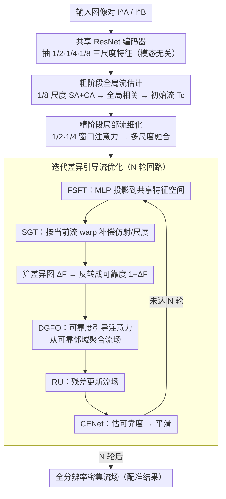

# CRFT: Consistent-Recurrent Feature Flow Transformer for Cross-Modal Image Registration

**会议**: CVPR 2026  
**arXiv**: [2604.05689](https://arxiv.org/abs/2604.05689)  
**代码**: [https://github.com/NEU-Liuxuecong/CRFT](https://github.com/NEU-Liuxuecong/CRFT)  
**领域**: 医学影像 / 图像配准  
**关键词**: 跨模态配准, 特征流学习, 粗到精, 差异引导注意力, 空间几何变换

## 一句话总结
提出CRFT，统一的粗到精跨模态图像配准框架——在Transformer架构中学习模态无关的特征流表示，粗阶段1/8分辨率全局对应+精阶段1/2-1/4多尺度局部细化，配合迭代差异引导注意力和空间几何变换(SGT)递归精化流场捕捉微妙空间不一致，在光学/红外/SAR/多光谱等多种跨模态数据集上超越RAFT/GMFlow/LoFTR等SOTA。

## 研究背景与动机

**领域现状**：跨模态图像配准（建立不同传感器图像间的空间对应）是计算机视觉核心问题，应用于3D重建、视觉定位、遥感分析等。

**现有痛点**：(1) 手工特征(SIFT/RIFT)在强非线性外观差异下不可靠；(2) 学习型稀疏匹配(SuperGlue/LoFTR)优化于RGB→跨模态泛化差；(3) 光流方法(RAFT/GMFlow)假设光度一致性→跨模态输入违反此假设；(4) 所有方法对大仿射+尺度变化+模态差异的组合应对不足。

**核心idea**：(1) 在Transformer中学习模态无关的特征流——不依赖像素一致性而是学习跨模态的特征空间对应；(2) 粗→精层级匹配(全局+局部)；(3) 迭代差异引导的递归流场精化——利用特征差异主动定位对齐不良区域。

## 方法详解

### 整体框架

CRFT 要解决的是一个很拧巴的问题：两张图来自不同传感器（光学 vs SAR、可见光 vs 红外），同一处地物的灰度可能完全相反，光流方法赖以工作的"光度一致性"在这里直接失效，但配准又要求亚像素级的密集对应。CRFT 的做法是把整件事搬到**特征空间**里，用一条粗到精的流水线把对应关系一层层磨出来。

具体地，一对输入图像 $(I^A, I^B)$ 先过一个共享权重的 ResNet 编码器，抽出 1/2、1/4、1/8 三个尺度的特征。先在最粗的 1/8 尺度上用 self-attention 和 cross-attention 建立全局对应，得到一个稳但糙的初始流场；再把流场带到 1/2、1/4 两个高分辨率尺度，用窗口注意力补上局部细节。最后是整篇的核心——一个跑 $N$ 轮的迭代精化回路：每轮都把当前流场作用到特征上、显式补偿仿射/尺度变形、算出特征差异，再把差异反转成可靠度去引导注意力、用可靠区域的对应传播修正不可靠区域，逐步把流场收敛到亚像素精度。

### 关键设计

**1. 粗阶段全局流估计：先在低分辨率上把"大对应"对稳**

直接在高分辨率上做跨模态匹配很危险——两个模态的光谱、辐射差异会把局部细节淹没，匹配容易满盘跑偏。CRFT 选择先在 1/8 分辨率上动手：这一层特征对应的是高层结构（轮廓、骨架），对模态间的光度不一致天然更鲁棒。这里先用 self-attention 增强各自的特征表达，再用 cross-attention 在两张图之间做跨模态匹配，构造全局相关矩阵，从中读出一个初始流场。这个流场分辨率低、不够精细，但胜在覆盖全局、不容易被外观差异带偏，给后面的细化提供了一个可靠的起点。

**2. 精阶段局部流细化：把空间细节在高分辨率上补回来**

粗阶段的流场缺的是细节，而细节只在高分辨率特征里。问题是 1/2、1/4 这两层尺寸大，全局注意力的计算量直接爆掉。CRFT 用窗口自注意力把注意力限制在局部窗口内捕捉精细模式，再用交叉注意力把跨模态的空间细节注入流场，配合多尺度的层级融合逐级加细。这样既拿回了局部精度，又把高分辨率全局注意力的开销绕了过去。

**3. 迭代差异引导流优化：用"哪里没对齐"来决定"该修哪里"**

这是 CRFT 的核心创新，针对的是单次前向匹配解决不了的复杂非线性 + 大仿射变形。它把精化做成一个跑 $N$ 轮的回路，每一轮都在上一轮的流场基础上往前修一步。一轮内部依次发生几件事：先是 **Fine-Scale Feature Transformation (FSFT)**，用一个轻量 MLP 把两个模态的特征投影到同一个特征空间，先压掉外观差异、让后面的差异计算更稳；接着 **Spatial Geometric Transform (SGT)** 显式地把仿射/尺度变换建模成一个可学习的 warp 模块，按当前流场把目标特征对齐过来，专门补偿那些流场难以隐式表达的大变形；warp 后的特征与目标特征相减得到**差异图** $\Delta F$，它标出了当前哪些区域还没对齐；CRFT 把它**反转**成可靠度图 $1-\Delta F$（差异越小、越一致 → 可靠度越高）；**Discrepancy-Guided Flow Optimization (DGFO)** 用这张可靠度图生成注意力的 query/key、以当前流场为 value，在局部邻域内做注意力聚合——让每个像素的流从邻域里**更可靠（已对齐）的位置**聚合过来，相当于用可靠区域的对应去传播、修正不可靠区域；据此做一次**残差更新 (RU)** 把流场往前推；最后 **Confidence Estimation Network (CENet)** 预测逐像素置信度，在窗口内挑高置信度的流聚合、并对流场做加权平滑、抑制不可靠区域的乱跳。

之所以有效，关键在"差异引导"这一步：普通迭代每轮都对整张图均匀聚合、不分可靠与否，而 CRFT 让差异自己说话——以一致性高的区域当可信锚点去聚合、把可靠对应传播到尚未对齐的区域，每一轮都在确定的信息上发力，所以收敛得又快又准（消融显示 $N=3$ 轮已基本收敛，再加收益递减）。SGT 则是另一根支柱，缺了它，遇到大角度、大尺度的仿射变换配准几乎会垮掉。

**4. 模态无关设计：把跨模态配准统一成"特征流"**

跨模态配准过去常常是一种模态对配一套方法，泛化性差。CRFT 的思路是：编码器跨模态共享权重，逼着它学出模态不变的特征；并且整个 formulation 不再估计像素级的光度/光流，而是估计**特征空间里的流**，从根上绕开了"光度一致性"这个跨模态根本不成立的假设。代价很小——消融显示即便在 RGB-RGB 同模态场景下，这套设计也仍保持竞争力，说明模态无关并没有牺牲同模态性能。

## 实验关键数据

### 主实验（多种跨模态场景）

**OSdataset (光学-SAR配准)**

| 方法 | 类型 | AEPE ↓ | CMR@3px ↑ | CMR@1px ↑ | CMR@0.7px ↑ |
|------|------|--------|-----------|-----------|-------------|
| RIFT2 | 手工特征 | 23.61 | 22.9% | 0.0% | 0.0% |
| GMFlow | 光流 | 11.91 | 17.0% | 0.0% | 0.0% |
| RAFT | 光流 | 3.51 | 69.6% | 15.9% | 8.7% |
| ADRNet | 密集匹配 | 1.67 | 90.1% | 35.0% | 20.6% |
| GDROS | 密集匹配 | 1.34 | 91.1% | 49.2% | 35.5% |
| XoFTR+Flow | 半密集 | 1.13 | 96.2% | 57.6% | 41.7% |
| **CRFT** | **本文** | **0.65** | **99.0%** | **95.1%** | **89.9%** |

CRFT 是唯一达到亚像素 AEPE 的方法 (0.65)；CMR@0.7px 达 89.9%，是第二名 XoFTR+Flow (41.7%) 的 **2.15×**。

**RoadScene (可见光-红外配准)**

| 方法 | AEPE ↓ | CMR@3px ↑ | CMR@1px ↑ | CMR@0.7px ↑ |
|------|--------|-----------|-----------|-------------|
| RIFT2 | 17.27 | 36.4% | 0.0% | 0.0% |
| RAFT | 8.92 | 66.6% | 14.1% | 8.0% |
| ADRNet | 4.72 | 50.1% | 9.4% | 4.8% |
| XoFTR+Flow | 4.83 | 27.3% | 0.0% | 0.0% |
| **CRFT** | **2.37** | **68.2%** | **18.2%** | **4.5%** |

在 RoadScene 上 CRFT 同样取得最低 AEPE (2.37) 和最高 CMR@1px (18.2%)。

### 消融实验

| 配置 | 效果说明 |
|------|----------|
| 仅粗阶段 | 全局对应可用但空间精度不足 |
| +精阶段 | 局部细节改善，精度提升 |
| +差异引导(N=1) | 进一步修正几何失配 |
| **+迭代精化(N=3)** | **最优，收敛稳定** |
| 无SGT | 退化——大仿射变换配准能力显著下降 |
| 无差异引导 | 退化——注意力无重点，修正效率低 |
| 无FSFT | 退化——跨模态特征空间未对齐，差异计算不稳定 |

### 关键发现
- SGT模块对大仿射变换最关键——无SGT时大角度/大尺度变换的配准几乎不可能
- 差异引导注意力vs均匀注意力→前者使迭代更高效(以一致区域为可信锚点聚合、传播流场，而非整图均摊)
- N=3次迭代已基本收敛→继续增加收益递减
- 在RGB-RGB场景下CRFT也保持竞争力→模态无关设计不牺牲同模态性能

## 亮点与洞察
- **模态无关的特征流**：将跨模态配准统一为特征空间的流估计——不为每种模态对单独设计方法→通用性
- **差异引导的"自适应注意力"**：把 warped 特征与目标的差异**反转**成可靠度图当注意力权重→让流场从可靠邻域聚合、传播到不可靠区域→比均匀聚合收敛更快更准
- **SGT的显式几何建模**：将仿射变换作为可学习模块集成→而非期望流场隐式学到大变形

## 局限与展望
- N=3次迭代增加了推理时间
- 粗阶段用全局注意力→大图需要控制分辨率
- 目前验证在遥感/导航场景→医学配准(CT-MRI)待探索

## 评分
- 新颖性: ⭐⭐⭐⭐ 差异引导递归+SGT+模态无关流的组合有效
- 实验充分度: ⭐⭐⭐⭐⭐ 光学/红外/SAR/多光谱多场景验证
- 写作质量: ⭐⭐⭐⭐ 架构图详细
- 价值: ⭐⭐⭐⭐ 对遥感/导航有通用配准价值

<!-- RELATED:START -->

## 相关论文

- [\[CVPR 2026\] CoFiDA-M: Concept-Aware Feature Modulation for Cross-Domain Adaptation with Image-Only Inference](cofida-m_concept-aware_feature_modulation_for_cross-domain_adaptation_with_image.md)
- [\[CVPR 2026\] MambaLiteUNet: Cross-Gated Adaptive Feature Fusion for Robust Skin Lesion Segmentation](mambaliteunet_cross-gated_adaptive_feature_fusion_for_robust_skin_lesion_segment.md)
- [\[CVPR 2026\] Cross-Modal Guided Visual Synthesis for Data-Efficient Multimodal Depression Recognition](cross-modal_guided_visual_synthesis_for_data-efficient_multimodal_depression_rec.md)
- [\[CVPR 2026\] Cross-domain Dual-stream Feature Disentanglement for Brain Disorder Prediction with Sparsely Labeled PET](cross-domain_dual-stream_feature_disentanglement_for_brain_disorder_prediction_w.md)
- [\[ECCV 2024\] Unsupervised Multi-modal Medical Image Registration via Invertible Translation](../../ECCV2024/medical_imaging/unsupervised_multi-modal_medical_image_registration_via_invertible_translation.md)

<!-- RELATED:END -->
