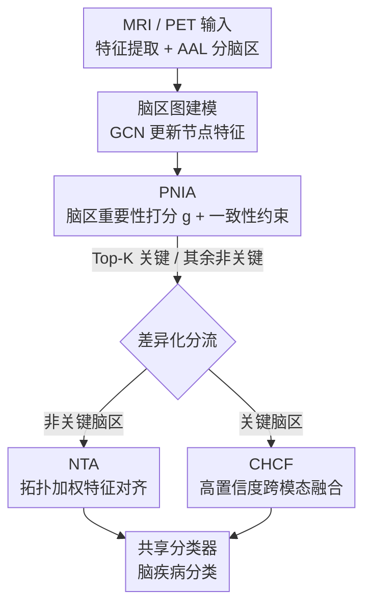

# Cross-domain Dual-stream Feature Disentanglement for Brain Disorder Prediction with Sparsely Labeled PET

**会议**: CVPR 2026  
**论文**: [CVF Open Access](https://openaccess.thecvf.com/content/CVPR2026/html/Wang_Cross-domain_Dual-stream_Feature_Disentanglement_for_Brain_Disorder_Prediction_with_Sparsely_CVPR_2026_paper.html)  
**代码**: 未公开  
**领域**: 医学图像  
**关键词**: PET脑疾病诊断, 跨模态域适应, 特征解耦, 半监督学习, 脑区图建模  

## 一句话总结
针对 PET 标注稀缺、需借标注丰富的 MRI 来跨模态迁移知识的场景，本文提出 DSDA 框架：先用脑区重要性图把"分类相关的关键脑区"和"分类无关的非关键脑区"显式解耦，再对两类脑区**差异化处理**——非关键脑区做拓扑加权对齐消除域差异、关键脑区做高置信度特征融合保留病理判别信息，在 ADNI/AIBL/PPMI 上分别取得 86.6%/87.7%/88.9% 准确率，刷新 SOTA。

## 研究背景与动机
**领域现状**：PET 能在解剖结构发生明显改变之前就检出代谢异常，是阿尔茨海默、帕金森等神经退行性疾病早诊的关键手段。但 PET 影像判读高度依赖核医学专家标注，导致高质量标注数据极度稀缺。相比之下 MRI 标注更易获取，于是"用标注丰富的 MRI 辅助标注稀缺的 PET 分类"成了一条有前景的路线，本质上是一个**域适应（Domain Adaptation）**问题。

**现有痛点**：主流 DA 方法采用**全局对齐**策略，假设只要把源域、目标域的域不变特征对齐、缩小分布差异，源域训练的分类器就能直接用到目标域。但域对齐的优化方向和分类的优化方向并不一致——全局对齐并不显式服务于分类目标，反而可能在对齐过程中**破坏掉对分类至关重要的判别特征**。后续工作转向"选择性对齐"，只对齐能提升域适应性的部分特征，但这些方法基本只针对**单模态跨数据集**场景（源域、目标域物理信号性质相同，对齐只需消除统计差异）。

**核心矛盾**：在 MRI→PET 这种**跨模态**场景里，两个模态分类相关的病理信号带有各自**不可互换的模态特异物理语义**——MRI 反映结构性病理，PET 反映功能/代谢异常。强行把这些异质特征塞进一个公共分布空间，会摧毁它们固有的物理与病理含义，损害判别力。也就是说，跨模态任务同时面临两个相互拉扯的核心需求：**消除域差异**与**保留模态特异判别信息**，全局对齐二者不可兼得。

**核心 idea**：作者的关键洞察是——跨模态数据里既有带模态特异语义的"分类相关信号"（不该对齐），也有模态无关的共享信息（如脑区的相对位置、大小，可以对齐来消除域差）。因此应当**反着来**：对齐"分类无关特征"以消除域漂移，同时保留"分类相关特征"以维持判别力。落地为 DSDA 框架——先把关键/非关键脑区解耦，再对两类区域差异化处理。

## 方法详解

### 整体框架
DSDA 工作在**半监督域适应**设定下：源域是标注丰富的 MRI（$D_s=\{x_s^i,y_s^i\}$），目标域包含少量标注 PET（$D_t$，规模远小于源域）和大量无标注 PET（$D_u$），且 $D_s$ 与 $D_u$ 在个体上不配对。目标是用三者联合训练，在目标域 PET 测试集上表现好。

整个 pipeline 分两大模块。输入的 MRI/PET 图像先经特征提取器 $F$ 和 AAL（Anatomical Automatic Labeling）解剖模板拆成脑区级特征，构成图结构（节点=脑区，边=脑区特征相似度）。然后：**① PNIA（Pathology-aware Node Importance Alignment）** 用图卷积更新节点特征、再用注意力网络给每个脑区打一个"诊断重要性分数" $g$，并用一致性损失约束跨域/跨模态的重要性分布一致；**② DPDFP（Dual-Path Differential Feature Processing）** 依据 $g$ 取 Top-K 脑区作为关键区、其余为非关键区，分两路差异化处理——非关键区走 **NTA（拓扑加权对齐）** 消域差，关键区走 **CHCF（高置信度融合）** 把 MRI 的判别特征迁移到 PET。图中所有分类器共享参数。

### 关键设计

**1. PNIA：用脑区重要性图把"该对齐的"和"该保留的"先打分解耦**

要差异化处理，前提是先准确定位"哪些脑区是分类关键区"。背景（非脑区）含噪会干扰特征提取，且不同脑区对诊断的贡献差异巨大，所以作者用**图结构**把分析粒度落到脑区级别，而非整图。具体地，把三路图像 $x_s,x_t,x_u$ 经 $F$ 和 AAL 模板拆成各脑区特征，因各脑区尺寸不同，用零填充统一到固定大小，构建图 $G=(X,A)$（$X$ 特征矩阵，$A$ 邻接矩阵）。节点特征用图卷积更新：

$$Z = \sigma(D^{-\frac{1}{2}}\tilde{A}D^{-\frac{1}{2}}XW)$$

其中 $\tilde{A}=A+I_N$ 是带自环的邻接矩阵，$D$ 为度矩阵，$W$ 为可学习权重。更新后的 $Z$ 过注意力网络 $\text{Att}(\cdot)$ 得到脑区重要性分数 $g=\text{softmax}(\text{Att}(Z))$。

关键在于：已有研究表明 MRI 与 PET 在疾病诊断中会一致地命中**重叠的关键脑区**。基于这一先验，作者设计脑区重要性一致性损失 $L_{con}$，约束源域与无标注目标域的重要性分数对齐：

$$L_{con} = \frac{1}{N}\sum_{i=1}^{N}\big(g_s(i)-g_u(i)\big)^2$$

这一步既给后续 Top-K 解耦提供了可靠依据，又跨域对齐了"哪里重要"这一高层语义——比直接对齐底层特征更稳，也更可解释。

**2. NTA：非关键脑区做拓扑加权对齐，只消域差不伤判别力**

对所有脑区一视同仁地跨域对齐虽能缩小域差，却会冲掉分类相关的判别特征。作者只在**非关键脑区**上做对齐。先由 PNIA 的分数取双域 Top-K 关键区，得到非关键区掩码：

$$M = 1 - \text{TopK}(G_s, K) - \text{TopK}(G_u, K)$$

非关键区的对齐损失用余弦相似度的对比形式：

$$L_{NA} = -\log\Big(\text{Sigmoid}\big(\tfrac{\text{Cos}(Z_s[M], Z_u[M])}{\tau}\big)\Big)$$

$\tau$ 是温度系数。为防止非关键区里的噪声被错误放大，作者进一步用**跨域拓扑结构相似度**当权重动态调节对齐强度：用图中节点的度 $D_m=\sum_j A_{m,ij}$（$m\in\{s,u\}$）刻画拓扑，以源/目标度向量的余弦相似度加权，得到最终拓扑加权对齐损失：

$$L_{NTA} = \text{Cos}(D_s[M], D_u[M]) * L_{NA}$$

直觉是：只有当两域非关键脑区的连接拓扑确实一致时，才放心地强对齐；拓扑不一致就降低对齐力度，避免把噪声当成"共享信息"硬拉到一起。这样借非关键区的结构一致性提供可靠的域不变上下文，又不干扰关键区的核心特征表示。

**3. CHCF：关键脑区做双重过滤 + 渐进式高置信度融合，把 MRI 病理特征安全迁到 PET**

关键脑区不该对齐，而该把 MRI 的判别特征**融合**进 PET。但 $D_s$ 与 $D_u$ 个体不配对，直接融合会混淆类别信息。作者用**双层过滤**保证只在可信样本上融合。第一层用蒙特卡洛 Dropout：训练时把特征 $Z$ 喂给分类器 $C$ 跑 $T$ 次，得到一组概率分布，算预测均值 $\mu=\frac{1}{T}\sum_i p_i$ 与方差 $\sigma^2=\frac{1}{T-1}\sum_i(p_i-\mu)^2$，再定义不确定性指标为方差在各类别上的均值：

$$U_{\sigma^2} = \frac{1}{C_m}\sum_{i=1}^{C_m}\sigma_i^2$$

当 $U_{\sigma^2}<\varepsilon$ 判为高置信样本，从而剔除目标域里的低质量伪标签。第二层做**跨模态标签一致性**校验：仅当高置信 PET 样本的伪标签与 MRI 真标签一致时才激活融合，确保融合的是真实病理关系。

最后的融合考虑到训练早期特征与分类任务相关性弱，设计**渐进式加权**：设当前轮 $e$、总轮 $E$，融合权重 $\theta=\frac{e}{E}$ 随训练线性增长，且只在 MRI 的关键脑区位置 $M_s=\text{TopK}(G_s,K)$ 上动态修正 PET 特征：

$$Z_u[M_s] = Z_u[M_s] + \theta * Z_s[M_s]$$

修正后的融合特征 $Z_u'$ 送入分类器得伪标签 $\hat{y}$，算无标注 PET 的伪标签损失 $L_{pseudo}=\text{CE}(P,\hat{y})$。渐进权重让模型先学稳再逐步吸收 MRI 的结构病理线索，避免早期噪声特征污染目标域。

### 损失函数 / 训练策略
标注 MRI/PET 经图卷积得 $Z_s,Z_t$，过分类器算监督分类损失 $L_m=\text{CE}(C(Z_m),y_m)$（$m\in\{s,t\}$）。总损失把无监督项（重要性一致性、非关键区对齐、伪标签）与监督项用 $\alpha$ 加权平衡：

$$L_{all} = \alpha(L_{con}+L_{NTA}+L_{pseudo}) + (1-\alpha)(L_s+L_t)$$

训练 100 epoch、学习率 1e-4、batch size 8，特征提取器 3 层、图卷积 2 层、分类器 3 层；标注数据比例固定 20%。

## 实验关键数据

### 主实验
在 ADNI、AIBL、PPMI 三个公开神经影像库上与 11 个 SOTA 方法对比（含单模态半监督 FixMatch/MPL，以及多模态半监督域适应 CDAC/CLDA/DeCoTa/ODADA/DCC/SLA/DDSPSeg/CAN/FSSADA）。DSDA 在 ADNI/AIBL/PPMI 上 ACC 分别达 86.6%/87.7%/88.9%，多数指标取得最优。

| 数据集 | 指标(ACC) | DSDA(本文) | 次优 | 提升 |
|--------|-----------|-----------|------|------|
| ADNI | ACC | **0.866** | DDSPSeg 0.853 | +1.3% |
| ADNI | AUC | **0.962** | DDSPSeg 0.958 | +0.4% |
| AIBL | ACC | **0.877** | SLA 0.842 | +3.5% |
| AIBL | AUC | **0.962** | SLA 0.950 | +1.2% |

作者还指出 CAN 表现极差（ADNI ACC 仅 0.452），因为它原本是为晶圆图数据集里"生产条件变化导致的轻微模内域漂移"设计的，而 MRI↔PET 的跨模态分布差异远超其适用范围——侧面印证跨模态域适应的难度。

### 消融实验
在 AIBL 上逐模块叠加（Baseline 为仅监督学习 $L_{label}=L_s+L_t$）：

| 配置 | ACC | F1 | AUC | 说明 |
|------|-----|-----|-----|------|
| Baseline | 0.747 | 0.735 | 0.915 | 仅监督 |
| +PNIA | 0.830 | 0.819 | 0.941 | 加脑区重要性图 + $L_{con}$，ACC +9% |
| +PNIA+NTA | 0.854 | 0.858 | 0.959 | 再加非关键区对齐，ACC +2% |
| +PNIA+CHCF | 0.863 | 0.858 | 0.959 | 加关键区融合，ACC 优于前两者 |
| Full (PNIA+NTA+CHCF) | **0.877** | **0.872** | **0.962** | 完整模型，再 +1% |

### 关键发现
- **PNIA 贡献最大**：单加 PNIA 就把 ACC 从 0.747 拉到 0.830（+9%），说明"先准确量化脑区重要性、再跨域对齐重要性分布"是整个框架的地基——定位准了，后续差异化处理才有意义。
- **NTA 与 CHCF 互补**：二者单独叠加在 PNIA 上各有提升（0.854 vs 0.863），同时启用才达 0.877，验证"非关键区消域差 + 关键区保判别"协同优化的必要性。
- **超参 K 有疾病特异性**：AD 在 K=15 时最优，PD 在 K=10 时最优；可视化显示命中的关键脑区（海马、颞上回、后扣带、嗅皮层 / 尾状核、苍白球、楔前叶）与文献报道的 AD/PD 相关脑区高度吻合，说明方法不只是涨点，还具临床可解释性。

## 亮点与洞察
- **"反着对齐"的视角很巧**：跳出"对齐分类相关特征"的惯性，提出在跨模态下应当**对齐分类无关特征、保留分类相关特征**——把全局对齐的优化方向与分类目标的冲突，转化为两类脑区的差异化处理，思路干净且可解释。
- **拓扑相似度当对齐门控**：用脑区图的节点度余弦相似度动态调节对齐强度（$L_{NTA}$），相当于给"什么时候该对齐"加了一道结构性闸门，避免把噪声当共享信息，这个 trick 可迁移到其他图结构的跨域对齐任务。
- **双层过滤 + 渐进融合防伪标签污染**：MC Dropout 不确定性筛 + 跨模态标签一致性校验 + 线性增长融合权重 $\theta=e/E$，三重保险让"不配对数据的特征融合"变得安全，是半监督跨模态迁移可复用的范式。

## 局限与展望
- **依赖 AAL 模板与脑区配准质量**：整套方法建立在脑区级图建模上，若 AAL 分区或配准不准，重要性打分和 Top-K 解耦会受影响；论文未讨论配准误差的鲁棒性。
- **K 需按疾病人工调**：AD/PD 的最优 K 不同，意味着换新疾病/新数据集时 K 需重新搜索，缺乏自适应确定关键区数量的机制。⚠️ 关键脑区数量是否能端到端学习，原文未涉及。
- **数据规模偏小**：训练仅用 ~120 MRI + 30 标注 PET（ADNI），标注比例固定 20%；在更大规模或更多疾病类别下的可扩展性有待验证。
- **代码未公开**，复现门槛较高（含 MC Dropout 次数 $T$、阈值 $\varepsilon$、温度 $\tau$、$\alpha$ 等多个超参，部分细节在补充材料）。

## 相关工作与启发
- **vs 全局对齐 DA（DANN 类）**：传统方法整体对齐域不变特征，假设对齐即可泛化；本文指出对齐方向与分类方向不一致，会损伤判别特征，转而只对齐非关键区，优势是保住了跨模态的模态特异病理信号。
- **vs 选择性对齐（基于注意力/梯度元知识，如 Guan et al./Zhao et al.）**：这些方法把特征选择与分类耦合、对齐任务相关特征，但只适用单模态跨数据集；本文的关键区别在于认识到跨模态下分类相关特征**不可互换**，因此对齐对象恰好相反（对齐分类无关特征），并对关键区改用融合而非对齐。
- **vs DDSPSeg / SLA 等近期医学 DA SOTA**：它们在 ADNI/AIBL 上已较强（0.84~0.85），DSDA 通过脑区级解耦 + 差异化处理在多数指标上进一步超越，且提供了可解释的关键脑区可视化。

## 评分
- 新颖性: ⭐⭐⭐⭐ "对齐分类无关、保留分类相关"的跨模态反向对齐视角 + 关键/非关键脑区差异化处理，切入角度新颖
- 实验充分度: ⭐⭐⭐⭐ 三数据集、11 个 SOTA 对比、逐模块消融 + 关键脑区可视化，较充分；但数据规模偏小、部分结果在补充材料
- 写作质量: ⭐⭐⭐⭐ 动机推导清晰、图示对比直观，公式完整；少量符号（如 $L_{NTA}$ 的加权形式）需对照原文
- 价值: ⭐⭐⭐⭐ 面向 PET 标注稀缺这一真实临床痛点，方法可解释、关键脑区与临床先验吻合，有实际落地潜力

<!-- RELATED:START -->

## 相关论文

- [\[CVPR 2026\] CoFiDA-M: Concept-Aware Feature Modulation for Cross-Domain Adaptation with Image-Only Inference](cofida-m_concept-aware_feature_modulation_for_cross-domain_adaptation_with_image.md)
- [\[CVPR 2026\] Continual Learning for fMRI-Based Brain Disorder Diagnosis via Functional Connectivity Matrices Generative Replay](forge_continual_learning_for_fmri_based_brain_disorder_diagnosis.md)
- [\[CVPR 2026\] Virtual Immunohistochemistry Staining with Dual-Aligned Multi-Task Feature Guidance](virtual_immunohistochemistry_staining_with_dual-aligned_multi-task_feature_guida.md)
- [\[CVPR 2026\] Interpretable Cross-Domain Few-Shot Learning with Rectified Target-Domain Local Alignment](interpretable_cross-domain_few-shot_learning_with_rectified_target-domain_local_.md)
- [\[CVPR 2026\] Dual-Level Hypergraph Generation for Addressing Feature Scarcity in Whole-Slide Image Classification](dual-level_hypergraph_generation_for_addressing_feature_scarcity_in_whole-slide_.md)

<!-- RELATED:END -->
