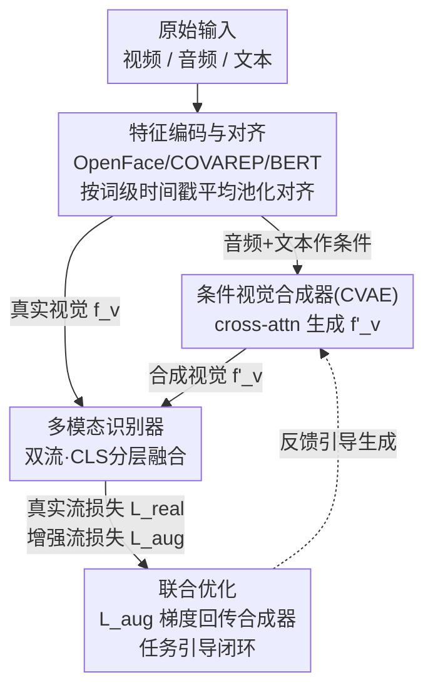

# Cross-Modal Guided Visual Synthesis for Data-Efficient Multimodal Depression Recognition

**会议**: CVPR 2026  
**论文**: [CVF Open Access](https://openaccess.thecvf.com/content/CVPR2026/html/Yang_Cross-Modal_Guided_Visual_Synthesis_for_Data-Efficient_Multimodal_Depression_Recognition_CVPR_2026_paper.html)  
**代码**: 无  
**领域**: 医学图像 / 多模态VLM  
**关键词**: 抑郁识别, 多模态融合, 条件生成增强, CVAE, 任务引导优化  

## 一句话总结
用音频和文本作为条件，通过 CVAE 在特征层合成新的"视觉行为特征"来缓解临床抑郁数据稀缺，并用下游识别器的损失反向引导这个生成过程，让合成特征不是追求"逼真"而是追求"对识别有用"，在 DAIC-WOZ 和 E-DAIC 上刷到 SOTA。

## 研究背景与动机
**领域现状**：自动抑郁识别（MDD）越来越依赖多模态行为分析——把面试视频里的面部表情、语音韵律、文本内容融合起来判断抑郁程度。其中视觉通道尤其关键，因为精神运动迟滞、情感淡漠这些核心症状直接写在脸上（面部肌肉活动、头部姿态、眼神）。

**现有痛点**：临床标注的多模态数据极度稀缺（DAIC-WOZ 只有 189 个会话），而深度视觉编码器又"特别吃数据"。结果是：即便用很花哨的多模态融合架构，被融合的视觉特征本身因为训练不充分就是次优的——融合质量再高也救不了一个没学好的视觉表征。现有两类对策都不灵：传统几何增强（翻转/裁剪）只能提供低层鲁棒性，生成不出语义有意义的视觉内容；多模态融合架构（cross-attention）又默认每个模态的特征已经提得很好，恰恰在数据少、视觉编码器没优化好时失效。

**核心矛盾**：数据稀缺直接卡死视觉表征学习，而"先把视觉特征学好"和"数据本来就不够"是个死循环。同时，主流的生成式数据增强是**两阶段解耦**的——先独立训一个生成器把"逼真度"拉满，再把它的输出当成静态数据集喂给下游任务，下游模型的好坏完全无法回头指导生成过程。

**本文目标**：(1) 在数据稀缺下合成出语义有意义的视觉特征；(2) 让合成目标对齐"识别有没有变准"而不是"画得像不像"。

**切入角度**：作者的关键观察是——一个人说什么内容、用什么语气说（语音韵律），和他的面部表情之间存在隐含关联。既然如此，就可以**把音频和文本反过来当作条件信息**，去生成与之匹配的视觉特征。

**核心 idea**：用"音频+文本→视觉特征"的条件生成补足稀缺的视觉数据，并把下游识别损失接进生成器形成闭环反馈，生成"最具判别力"而非"最逼真"的视觉特征。

## 方法详解

### 整体框架
CMG-VS 是一个端到端系统，把"数据生成"和"识别"缝在一条计算图里，分四个阶段：**特征编码与对齐 → 条件视觉合成器（CVAE）→ 多模态识别器 → 联合优化**。

直观地走一遍：原始的文本/视频/音频先各自过编码器、再按词级时间戳对齐成同步序列；对齐后的音频+文本特征作为"条件"，喂进 CVAE 合成器，生成一条全新的视觉特征序列 $f'_v$；然后识别器同时跑两条平行数据流——一条是"真实流"（用原始视觉特征 $f_v$），一条是"增强流"（把视觉特征换成合成的 $f'_v$），两条流共享同一个融合网络出预测；最后联合优化阶段把三类损失耦合起来，关键在于**增强流的识别损失会反向传播去更新合成器**，形成"识别表现 → 指导生成"的闭环。这种共生关系正是它能在小数据下学好的原因。

### 关键设计

**1. 条件视觉合成器：用 CVAE 把"音频+文本"翻译成"视觉行为特征"**

针对"视觉特征本身没学好、又生成不出语义内容"的痛点，作者把合成器建成一个条件变分自编码器（CVAE），目标是学习条件分布 $P(f_v \mid f_a, f_t)$。编码器和解码器都用 Transformer 块，核心是**用 cross-attention 注入条件**：在编码器里，视觉序列 $f_v$ 当 Query，拼接的音频+文本 $f_{context}=[f_a, f_t]$ 当 Key/Value，让模型聚焦在"与当前语境最相关的视觉特征"上；输出经时间池化后过两个线性头得到隐分布参数 $\mu, \log\sigma^2$。隐变量用重参数化采样 $z = \mu + \sigma \odot \varepsilon,\ \varepsilon \sim \mathcal{N}(0, I)$，保证梯度可回传。解码器对称：把单个 $z$ 复制 $N_t$ 份、加可学习位置编码当 Query 序列，再以 $f_{context}$ 作 Key/Value，逐步把压缩的 $z$ 翻译成时序连贯的视觉序列 $f'_v \in \mathbb{R}^{N_t \times d_v}$。训练靠最大化条件 ELBO：

$$L_{ELBO} = \mathbb{E}_{q_\phi(z|f_v,f_a,f_t)}[\log p_\theta(f_v|z,f_a,f_t)] - D_{KL}(q_\phi(z|f_v,f_a,f_t) \parallel p(z))$$

为什么有效：随机隐空间让"同一段音频+文本"可以采样不同 $z$、生成一**簇**合理的视觉行为（而不是单点映射），这种多样性正好扩张了原本贫瘠的训练分布；同时 cross-attention 条件化保证生成结果在语义上和语音内容对得上，而不是几何增强那种没语义的扰动。

**2. 双流分层融合识别器：让真实数据和合成数据共享同一融合网络**

识别器要从 $(f_{vision}, f_a, f_t)$ 预测抑郁分数，其中 $f_{vision}$ 既可以是真实 $f_v$、也可以是合成 $f'_v$——这两种输入走的是**同一套共享权重**的融合网络，构成"真实流/增强流"两条平行路径。具体结构是一个分层融合 Transformer：先用模态内编码器（部分共享权重）给每个模态补上时序上下文，得到 $f^{ctx}_{vision}, f^{ctx}_a, f^{ctx}_t$；再用一个可学习的 `[CLS]` token 当全局摘要向量，在每个融合块里依次 cross-attend 三个模态：

$$(h^l_{cls})' = \text{CrossAttend}(h^{l-1}_{cls}, f^{ctx}_{vision}),\quad (h^l_{cls})'' = \text{CrossAttend}((h^l_{cls})', f^{ctx}_a),\quad h^l_{cls} = \text{CrossAttend}((h^l_{cls})'', f^{ctx}_t)$$

最终 `[CLS]` 表示过 MLP 头回归出分数 $y_{pred}$。让真假两流共享融合网络是有意为之：合成特征必须和真实特征落在同一个可被同一识别器消化的表示空间里，这样"增强流学到的东西"才能迁移回"真实流"的判别边界——这也是后面闭环反馈能起作用的结构前提。

**3. 任务引导的联合优化：把识别损失接进生成器，闭环反馈是真正的创新**

这是全文的灵魂，针对的是"两阶段解耦增强里下游表现无法指导生成"的痛点。总损失把三块耦合起来：

$$L_{total} = L_{real} + \lambda_{aug} L_{aug} + \lambda_{cvae}(L_{consis} + \beta L_{KL})$$

其中 $L_{real} = L_{MSE}(y_{real}, y_{true})$、$L_{aug} = L_{MSE}(y_{aug}, y_{true})$ 是真实流/增强流的 MSE 识别损失；$L_{consis} = \|f_v - f'_v\|_1$ 是一致性损失（L1，逼合成特征像真实的）；$L_{KL}$ 是隐空间正则。关键机制在于：**增强流损失 $L_{aug}$ 的梯度不仅更新识别器，还会回传去更新合成器的参数**。这就把"识别器在合成数据上表现好不好"直接变成了生成器的优化信号——合成器不再只追求 $L_{consis}$ 意义下的"逼真"，而是被推着去生成"让识别器更准"的最具判别力的特征。整套用交替优化策略训练，$\lambda_{aug}=1.0$、$\lambda_{cvae}=0.1$。消融证明：去掉这个 task-guidance、退化成两阶段，F1 从 0.860 掉到 0.841——闭环反馈本身就是涨点主力。

### 损失函数 / 训练策略
- **合成器**：一致性损失 $L_{consis}$（L1 重建）+ KL 正则 $L_{KL}$，对应 CVAE 的 ELBO。
- **识别器**：真实流 $L_{real}$ + 增强流 $L_{aug}$，均为 MSE。
- **耦合**：$L_{aug}$ 梯度回传合成器，形成任务引导闭环；交替优化，端到端联合训练。
- 编码器：OpenFace 2.0（17 个 AU 强度 + 6-DoF 头部姿态 + 眼神）、COVAREP（100Hz 声学特征 F0/MFCC 等）、BERT-base-uncased（文本）。合成器与识别器均为 4 层 Transformer，$d=256$、8 头，Adam，lr $1\times10^{-4}$，batch 16，A100，4 个随机种子取平均。

## 实验关键数据

### 主实验
DAIC-WOZ 做分类（Precision/Recall/F1，F1 为主指标），E-DAIC 做回归（CCC/RMSE/MAE）。

| 数据集 | 任务 | 指标 | CMG-VS | 之前最好 | 结果 |
|--------|------|------|--------|----------|------|
| DAIC-WOZ | 分类 | F1↑ | **0.860** | BiLSTM+BiGRU 0.850 | SOTA |
| DAIC-WOZ | 分类 | Precision↑ | **0.846** | 多数方法 ≤0.82 | 大幅领先、误报更少 |
| E-DAIC | 回归 | CCC↑ | **0.69** | MMFF 0.68 | SOTA |
| E-DAIC | 回归 | RMSE↓ | **4.35** | Multi-DDAE 4.47 | 最低 |
| E-DAIC | 回归 | MAE↓ | **3.78** | MMFF 3.98 | 最低 |

亮点是 Precision 显著更高（0.846）：很多高分方法靠牺牲精度换召回，CMG-VS 在召回 0.875 不掉的同时把误报压下来。混淆矩阵佐证：Recognizer-Only 把 5 个非抑郁者误判为抑郁，CMG-VS 把假阳性降到 2、仍正确识别 12/14 抑郁者。

### 消融实验

| 配置 | F1↑ | 说明 |
|------|-----|------|
| CMG-VS 完整模型 | **0.860** | 全套 |
| Two-Stage（去任务引导） | 0.841 | 合成器只追逼真、不接识别反馈，掉 1.9 |
| Recognizer-Only（去合成） | 0.825 | 完全不做合成增强，掉 3.5 |

| 条件模态 | F1↑ | 合成特征粒度 | F1↑ |
|----------|-----|--------------|-----|
| 音频+文本（全） | **0.860** | 全部视觉特征（全） | **0.860** |
| 仅文本引导 | 0.851 | 仅 AUs | 0.857 |
| 仅音频引导 | 0.845 | 仅 Pose & Gaze | 0.837 |

### 关键发现
- **任务引导是涨点主力**：Recognizer-Only → 完整模型 F1 提 0.035，其中"加合成但仍两阶段"只到 0.841，剩下的 0.019 全靠闭环反馈，证明"生成对任务有用的特征"远胜"生成逼真特征"。
- **音频和文本互补**：去掉任一模态都掉点，去文本影响略大（0.860→0.851 vs 去音频 →0.845），说明语义内容比纯韵律提供更多视觉合成线索。
- **AU 是最值钱的视觉成分**：只合成面部动作单元（AUs）F1 就到 0.857、几乎追平全特征，而只合成姿态+眼神只到 0.837——cross-modal 引导特别擅长生成情感相关的肌肉活动这类语义丰富的线索。
- t-SNE 显示：Recognizer-Only 的特征空间类别重叠明显，CMG-VS 学到的空间类内更紧凑、类间更分得开，残留的少量混叠点正好对应分类错误。

## 亮点与洞察
- **"反向用模态"的视角很巧**：通常音频/文本是被融合的对象，这里反过来把它们当成生成视觉的**条件**，利用"说话内容/语气↔面部表情"的隐含关联，绕开了"视觉数据本身不够"的死结。这个 reframing 可迁移到任何"某个模态数据特别稀缺、但其他模态充足"的场景。
- **闭环反馈打破两阶段解耦**：把 $L_{aug}$ 梯度接回生成器，让"生成"直接对"下游任务表现"负责，是对主流生成式增强（先训生成器再当静态数据集）的实质性改进——可复用到医学影像等其他数据稀缺域。
- **特征级而非像素级合成**：在特征空间生成既省算力、又避开了像素级生成在临床小数据上极难训稳的问题，是个务实的工程选择。

## 局限与展望
- **特征级合成的天花板**：作者承认目前只做特征级合成，没到像素级；但反过来说，这也意味着合成质量受限于 OpenFace/COVAREP 这些预提特征的表达力，编码器一旦丢信息，合成器再强也补不回来。
- **数据集与评测偏小**：DAIC-WOZ 仅 189 会话，且作者**自建了一个 47 人内部测试集**（因为官方测试标签不公开）⚠️——这让和其他论文的数字横向对比不完全可比，不同方法的 split 可能不一致，绝对数值需谨慎看待。
- **无代码**：未提供开源代码，复现需自行搭建 CVAE + 双流识别器，$\lambda$、$\beta$ 等超参敏感性也未充分报告。
- **改进方向**：作者提到可推广到其他数据稀缺多模态域、或推进到像素级生成；个人觉得可进一步验证合成多样性（采样不同 $z$）究竟带来多少增益，目前消融没有专门隔离"VAE 随机性"这一项。

## 相关工作与启发
- **vs 传统几何增强（翻转/裁剪/Mixup/CutMix）**：那些方法只在训练数据凸包内操作、生成不出语义新内容；本文用条件生成模型跳出凸包，合成语义上"说得通"的新视觉行为。
- **vs 多模态融合架构（cross-attention 融合）**：它们默认各模态特征已提好、在数据少时失效；本文不假设视觉特征质量好，而是主动把它"补出来"，从源头改善视觉表征。
- **vs 两阶段生成式增强**：主流是"先独立训生成器最大化逼真度→输出当静态数据集"，下游无法回头指导生成；本文用任务引导联合优化把这个 gap 补上，生成直接对识别表现负责。
- **vs 语音驱动人脸动画 / 文生图视频（DALL-E2/Imagen/Sora）**：同样用条件生成原理，但那些追求感知逼真（FID/CLIP/用户研究），本文把合成当作**数据增强手段**而非可观看的最终产物，优化目标是判别力不是逼真度。

## 评分
- 新颖性: ⭐⭐⭐⭐ 把"任务引导闭环"接进条件生成增强、反向用音频文本生成视觉特征，视角与机制都有新意。
- 实验充分度: ⭐⭐⭐ 两数据集 + 三组消融 + t-SNE/混淆矩阵到位，但数据集偏小、自建测试集削弱横向可比性。
- 写作质量: ⭐⭐⭐⭐ 框架四阶段叙述清晰，公式与损失耦合讲得明白。
- 价值: ⭐⭐⭐⭐ 数据稀缺多模态域的通用范式，闭环反馈思路可迁移，但缺代码影响落地。

<!-- RELATED:START -->

## 相关论文

- [\[AAAI 2026\] Personality-guided Public-Private Domain Disentangled Hypergraph-Former Network for Multimodal Depression Detection](../../AAAI2026/medical_imaging/personality-guided_public-private_domain_disentangled_hypergraph-former_network_.md)
- [\[CVPR 2026\] MultiModalPFN: Extending Prior-Data Fitted Networks for Multimodal Tabular Learning](multimodalpfn_extending_prior-data_fitted_networks_for_multimodal_tabular_learni.md)
- [\[CVPR 2026\] CRFT: Consistent-Recurrent Feature Flow Transformer for Cross-Modal Image Registration](crft_consistent-recurrent_feature_flow_transformer_for_cross-modal_image_registr.md)
- [\[CVPR 2026\] CHIPS: Efficient CLIP Adaptation via Curvature-aware Hybrid Influence-based Data Selection](chips_efficient_clip_adaptation_via_curvature-aware_hybrid_influence-based_data_.md)
- [\[CVPR 2026\] OctoMed: Data Recipes for State-of-the-Art Multimodal Medical Reasoning](octomed_data_recipes_for_state-of-the-art_multimodal_medical_reasoning.md)

<!-- RELATED:END -->
