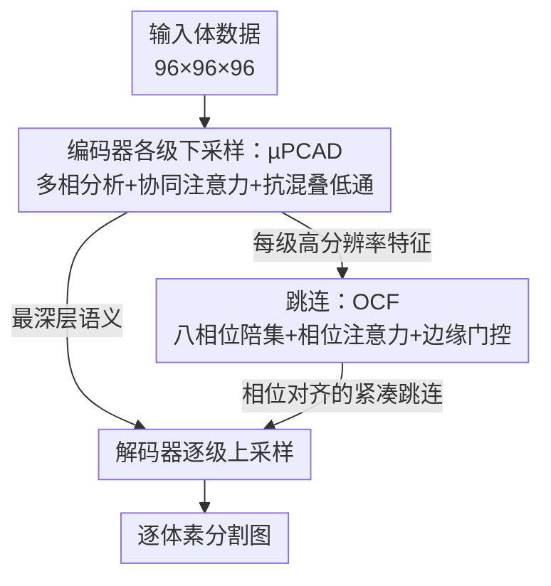

# CROWn: 抗混叠下采样与相位校准融合的统一 3D 医学分割框架

**会议**: CVPR 2026  
**论文**: [CVF Open Access](https://openaccess.thecvf.com/content/CVPR2026/html/Huang_CROWn_A_Unified_Framework_for_Anti-Aliased_Downsampling_and_Phase-Calibrated_Fusion_CVPR_2026_paper.html)  
**代码**: https://github.com/IMOP-lab/CROWn  
**领域**: 医学图像  
**关键词**: 3D 医学分割, 抗混叠下采样, 多相分析, 相位校准, 跳连融合

## 一句话总结
CROWn 把采样理论塞进 U 形分割网络最易丢信息的两个环节——下采样和跳连融合：用 µPCAD 在抽取时做"池化查询 × 小波子带值"的协同注意力加显式抗混叠低通，用 OCF 把高分辨率跳连拆成八个相位陪集再做相位注意力 + 边缘门控对齐，在 15 个 CT/MRI/OCT 数据集上 IoU/Dice 全面 SOTA，且参数量只有 23.78M。

## 研究背景与动机

**领域现状**：3D 医学分割主流是 U 形 CNN（3D U-Net、nnU-Net）或体素 Transformer（UNETR、SwinUNETR），近年还有 ConvNeXt 系（3D UX-Net、MedNeXt）和状态空间模型（SegMamba）。这些网络靠 strided conv / pooling 逐级下采样，靠 skip concatenation 把高分辨率细节传回解码器。

**现有痛点**：临床扫描天生**各向异性**（voxel spacing 三轴不等、层厚大），加上不同设备/重建核/去噪管线导致频谱占用漂移。带 stride 的卷积和池化在压缩频谱时**不做抗混叠**——高频被折叠（aliasing），细结构被抹掉、台阶状伪影被放大；而 skip 直接 concat 又把这些**已经混叠的高频**原封不动塞给解码器，与低分辨率语义之间存在尺度/相位错位，融合得很糟。

**核心矛盾**：采样（decimation）、混叠（aliasing）、边界证据（boundary evidence）这三件事是**耦合**的，但现有架构把它们当独立问题——要么只堆容量（更深更宽的 backbone），要么用全局注意力补语义，都没有在"抽取那一刻"控制混叠，也没有在"融合之前"显式对齐高分辨率证据。结果是模型把设备相关的伪影和解剖结构纠缠在一起，跨域泛化差。

**本文目标**：在下采样接口处抑制混叠（保住边界高频），同时在跳连融合前把高分辨率证据做相位对齐，让边界定位和拓扑一致性在不同采样规约、不同设备下都稳。

**切入角度**：作者把信号处理里的**多相分析（polyphase）+ 抗混叠低通**和表示学习里的注意力结合起来——下采样不再是粗暴抽点，而是先把特征分解成多个相位/子带，用注意力挑出边界相关的高频、压掉假的相位分量，再加显式低通后抽取。

**核心 idea**：用"采样理论 × 协同注意力"重写 U 形网络的两个关键算子——**下采样**（µPCAD）和**跳连**（OCF），让抗混叠和相位校准成为网络的内置归纳偏置，而不是靠后处理补救。

## 方法详解

### 整体框架

CROWn 仍是标准的 U 形编码器-解码器，但把两个最容易丢信息的算子替换掉：编码器每一级的下采样换成 **µPCAD**（抗混叠协同注意力抽取器），每条跳连在送入解码器前过一遍 **OCF**（八相位陪集纤维化）。输入是 $96\times96\times96$ 的 3D patch，输出是逐体素分割图。两个模块是互补的：µPCAD 管"往下走时别把高频折叠掉"，OCF 管"往回传时把高频对齐到解码器的尺度"。

### 关键设计

**1. µPCAD：抗混叠的多相协同注意力下采样器**

针对"strided 卷积/池化在抽取时折叠高频、抹掉细结构"这个痛点，µPCAD 把一次下采样拆成"多相分解 → 协同注意力 → 显式低通抽取"三步，让边界相关的高频被保留、虚假相位被压掉。给定编码器特征 $X\in\mathbb{R}^{B\times C_{in}\times D\times H\times W}$，模块沿 $W$ 轴逐切片处理（各向异性下 $W$ 通常是厚层轴）。对每个切片，先用两个 $1\times1$ 映射 + stride-2 池化得到**池化分支**作为查询/键：$Q=\text{maxpool}$、$K=\text{avgpool}$；再用一个 $1\times1$ 映射接**可分离 Haar 小波**在 $(D,H)$ 上 stride-2 变换，得到四个子带作为**值**：

$$\kappa_{LL}=l\otimes l,\quad \kappa_{LH}=l\otimes h,\quad \kappa_{HL}=h\otimes l,\quad \kappa_{HH}=h\otimes h$$

其中 $l=(2^{-1/2},2^{-1/2})$ 是低通、$h=(2^{-1/2},-2^{-1/2})$ 是高通。关键的"协同注意力"是**跨源**的——它把池化分支当 query/key、把小波子带当 value，于是注意力的作用是"用空间统计去检索哪些频率子带值得保留"：

$$A_{b,:,i,j}=\sum_{h=1}^{H_a}\sum_{(i',j')\in\Pi_r}\frac{\exp(\langle q^{h}_{b,i,j},k^{h}_{b,i',j'}\rangle/\sqrt{\delta_h})}{\sum_{(u,v)}\exp(\langle q^{h}_{b,i,j},k^{h}_{b,u,v}\rangle/\sqrt{\delta_h})}\,v^{h}_{b,i',j'}$$

随后把多相融合分支 $L$、协同注意力 $A$ 和低频结构 $V_{LL}$ 用可学习门控混合 $F=\sigma(\alpha)L+\sigma(\beta)A+\gamma\,\mathcal{J}(V_{LL})$，再过一个通道 squeeze-excitation 门 $\rho$。**最后一步才是真正的抗混叠抽取**：沿 $W$ 轴先用固定低通核 $k=(\tfrac14,\tfrac12,\tfrac14)$ 做 depthwise blur，再接一个 stride-2 的学习投影-抽取器 $D^{(2)}_w$，把 $W$ 也降到一半，得到 $D/2\times H/2\times W/2$ 的输出。这个"先 blur 再 decimate"正是经典抗混叠采样的做法，区别在于 blur 之前的特征已经被协同注意力按边界相关性重新加权过——所以压掉的是冗余/伪影高频，留下的是边界高频。消融里（Table 2）把它和 SE/CBAM/Transformer/MedNeXt block 在同一 backbone 上对比，µPCAD 给出最好的边界（HD95 2.43 vs 次优 2.81），说明"管好抽取这一刻"比"单纯加容量"更值钱。

**2. OCF：八相位陪集纤维化的相位校准跳连**

针对"高分辨率跳连把已混叠的高频直接 concat 给解码器、和低分辨率语义相位错位"这个痛点，OCF 在融合前把跳连重构成相位对齐、紧凑、带边界感知的特征。给定高分辨率跳连 $U$，先用固定可分离低通 $G$（核权重 $1,2,1$）做**抗混叠预处理** $B=G*U$；然后做 **3D space-to-depth** 的"八相位陪集分解"——把每个 $2\times2\times2$ 邻域按 $(p,q,r)\in\{0,1\}^3$ 的相位拆成 8 个陪集 $P_{pqr}$，每个空间尺寸降到原来的一半：

$$P^{pqr}_{b,c,i,j,k}=B_{b,c,\,2i+p,\,2j+q,\,2k+r}$$

这一步把"分辨率减半丢掉的相位信息"显式保留成 8 个通道分组，而不是平均掉。接着一个相位上下文映射 $\Xi$ 对 8 个相位打分、softmax 成权重 $\omega_{pqr}$，做**相位注意力**加权聚合 $Z=\sum_{(p,q,r)}\omega_{pqr}P_{pqr}$——网络自己决定哪个相位的证据更靠谱。再叠一个**边缘门控**：用三轴 Sobel 在通道均值场上算边缘幅值 $E=\sqrt{(K_x*A)^2+(K_y*A)^2+(K_z*A)^2+\varepsilon}$，归一化后转成门 $\Gamma=1+\tanh(\eta)\,E/(\mu_E+\varepsilon)$，在边界处放大特征。最后用 depthwise-separable 聚合（逐通道核 + pointwise 混合）压成紧凑通道。整条链路可写成在纤维丛 $\pi:F\to\Pi$ 上的一次传输 $G=N\,\varsigma(M(\kappa\star(\Gamma\cdot\bigoplus_a\text{lift}_\pi[G*U])))$。结果是跳连特征在语义上更贴近解码器尺度、不再传播混叠。Table 5 的组件消融证明四件事缺一不可：去掉 blur、用均匀（非注意力）相位混合、打乱相位、或去掉边缘门，Dice 都会掉（如 w/o phase attention 时 HD95 从 4.30 涨到 5.33）。

### 损失函数 / 训练策略
DiceCE 损失 + AdamW；输入随机裁剪成 $96^3$ patch，batch size 1，训练 320,000 步；所有对比方法用相同的 3D 数据增强（随机旋转/平移/缩放），保证表格反映的是结构差异而非增强差异。推理用 MONAI 的 3D 滑窗。全部实验在 8×RTX 4090 上跑（PyTorch 2.5.1 / CUDA 12.1）。

## 实验关键数据

### 主实验
在 15 个公开 CT/MRI/OCT 数据集上对比 17 个近期方法，指标 IoU / Dice / HD95。CROWn 在**全部数据集**上拿到最高 IoU 和 Dice，各向异性队列（FLARE2022、MSD Pancreas）和细结构数据（OIMHS）增益尤其明显。下面摘几个代表性数据集：

| 数据集 | 指标 | CROWn | 次优方法 | 说明 |
|--------|------|-------|----------|------|
| FLARE2022 | IoU / Dice | **82.65 / 89.76** | 81.58 / 88.86 (SegMamba) | 各向异性多器官 CT，HD95 从 9.21 降到 4.30 |
| OIMHS | IoU / Dice | **89.68 / 94.36** | 88.83 / 93.83 (SegMamba) | OCT 细层界面，台阶伪影更少 |
| MSD Pancreas | IoU / Dice | **56.68 / 70.20** | 55.27 / 68.46 (DiffUNet) | 胰腺肿瘤边界，泄漏更少 |
| MSD Colon | IoU / Dice | **43.80 / 55.89** | 41.26 / 54.56 (VSmTrans) | 难分割小目标 |
| COVID-19 CT | IoU / Dice | **73.91 / 83.75** | 72.62 / 82.87 (SuperLightNet) | 跨模态鲁棒性 |

边界误差（HD95）整体下降，作者归因于"抗混叠抽取 + 校准跳连融合"在跨尺度整合时保住了边界证据。

### 消融实验

µPCAD 与经典模块对比（同 3D U-Net backbone，OIMHS）：

| 配置 | IoU | Dice | HD95 | 说明 |
|------|-----|------|------|------|
| 3D U-Net | 87.69 | 93.18 | 2.91 | baseline |
| +SE / +CBAM | 88.88 / 88.56 | 93.89 / 93.69 | 2.84 / 2.81 | 通道/空间重加权 |
| +Transformer | 88.26 | 93.50 | 2.99 | 全局注意力 |
| +MedNeXt block | 88.79 | 93.83 | 2.83 | 大核更新 |
| **+µPCAD** | **89.31** | **94.14** | **2.43** | 抗混叠抽取，边界最好 |

OCF 组件归因（FLARE2022）：

| 配置 | IoU | Dice | HD95 | 说明 |
|------|-----|------|------|------|
| w/o Blur | 81.96 | 89.15 | 4.46 | 去抗混叠低通 |
| w/o 相位注意力 | 81.94 | 89.26 | 5.33 | 用均匀相位混合 |
| 固定位移相位 | 81.53 | 88.80 | 4.62 | 打乱/固定相位 |
| **Full OCF** | **82.65** | **89.76** | **4.30** | 四组件协同 |

### 关键发现
- **两个模块要铺满每一级才最稳**：µPCAD 放在编码器每个下采样接口、OCF 放在每条跳连，比只放某一层好——说明混叠控制和相位校准是"每个尺度转换处都需要"的，不是局部补丁。
- **抗混叠比加容量更值钱**：在各向异性体素下，µPCAD 的边界增益超过 SE/CBAM/Transformer/MedNeXt 这些纯容量升级，验证了"管好采样这一刻"的假设。
- **轴向选择有讲究**：µPCAD 沿 $W$ 轴（厚层轴）展开多相分析效果最好（Table 3，IoU 89.68 vs 沿 D/H 的 88.98/88.43），符合"在厚层方向抗混叠收益最大"的直觉。
- **效率友好**：CROWn 仅 23.78M 参数 / 199.58G FLOPs，远低于 3D UX-Net（53M/631G）、SegMamba 等重型堆叠，却拿到更好精度——作者解释为"把容量集中在尺度转换处，而非更深更宽的 backbone"。

## 亮点与洞察
- **把信号处理的"先低通再抽取"做成可学习算子**：µPCAD 的最后一步固定 blur 核 $(\tfrac14,\tfrac12,\tfrac14)$ + 学习抽取器，是经典抗混叠采样的神经网络版；巧在 blur 之前的特征已被协同注意力按边界重排，所以低通压掉的是伪影而非细节。
- **跨源协同注意力的设计很聪明**：用空间池化统计当 query/key、小波子带当 value，本质是"让空间上下文去检索频率子带"，比单纯 self-attention 更对得上"保边界高频、压伪相位"的目标。
- **space-to-depth 当相位保留器**：OCF 把分辨率减半时丢掉的相位信息显式拆成 8 个陪集再用注意力挑，这个"不丢、而是显式建模相位"的思路可迁移到任何有上下采样的密集预测任务（超分、深度估计、光流）。
- **Sobel 边缘门控**几乎零成本地把"哪里是边界"的先验注入跳连，是一个可复用的轻量 trick。

## 局限与展望
- 论文以 IoU/Dice/HD95 的全面 SOTA 为主，但多个关键消融（stage-wise placement、跨 backbone、定性图）都放在补充材料里，正文只给结论性表述，⚠️ 具体数值以原文补充材料为准。
- µPCAD 沿单一 $W$ 轴逐切片处理，对真正三轴都强各向异性的数据是否仍是最优轴向选择，论文只在 OIMHS 上验证，泛化性有待更多数据佐证。
- 八相位陪集 + 多头协同注意力带来的额外算子较多，虽然总 FLOPs 可控，但实现复杂度高、对 spacing 的假设（reflective boundary、$2\times2\times2$ 邻域）较强，迁移到 2D 或非医学场景需要重新设计。
- 公式 (4) 和 (10) 把整条 pipeline 写成单一 lattice/纤维丛形式，更像理论自洽性的展示，⚠️ 实际实现是否严格按此闭式计算、还是分步近似，需看代码确认。

## 相关工作与启发
- **vs 普通 U 形 CNN/Transformer（nnU-Net、UNETR、SwinUNETR）**：它们用 strided conv/pooling 下采样、skip concat 融合，既不控制抽取时的混叠也不对齐跳连相位；CROWn 把这两个算子替换成 µPCAD/OCF，针对性解决各向异性下的混叠和相位错位。
- **vs SegMamba 等长程建模方法**：Mamba/Transformer 靠全局上下文补语义，但在模糊界面上仍弱；CROWn 不追求更强的全局建模，而是从采样理论入手保边界，效率还更高（23.78M vs 重型堆叠）。
- **vs 频域/小波方法（WaveFormer）**：纯频域方法常在压噪时也削弱临床显著边缘；CROWn 用协同注意力让网络自己挑"保哪个子带"，而非一刀切滤波。
- **vs 经典抗混叠（BlurPool 等 2D 工作）**：CROWn 把抗混叠从"固定 blur 池化"升级为"多相分解 + 注意力路由 + 学习抽取"，并扩展到 3D 各向异性场景下的双算子（下采样 + 跳连）协同。

## 评分
- 新颖性: ⭐⭐⭐⭐ 把多相采样/抗混叠理论系统地嵌进 3D 分割的下采样和跳连两个算子，思路扎实且少见。
- 实验充分度: ⭐⭐⭐⭐⭐ 15 个数据集 + 17 个对比方法 + 跨 backbone/轴向/组件多维消融，覆盖很全。
- 写作质量: ⭐⭐⭐⭐ 机制讲得清、公式完整，但大量消融压进补充材料，正文略偏结论化。
- 价值: ⭐⭐⭐⭐ 高精度 + 低参数，µPCAD/OCF 可即插即用进任意 U 形 backbone，临床落地与方法迁移价值都不错。

<!-- RELATED:START -->

## 相关论文

- [\[CVPR 2026\] Masked-Diffusion Autoencoders for 3D Medical Vision Representation Learning](masked-diffusion_autoencoders_for_3d_medical_vision_representation_learning.md)
- [\[CVPR 2026\] Revisiting 2D Foundation Models for Scalable 3D Medical Image Classification](revisiting_2d_foundation_models_for_scalable_3d_medical_image_classification.md)
- [\[CVPR 2026\] VoxTell: Free-Text Promptable Universal 3D Medical Image Segmentation](voxtell_free-text_promptable_universal_3d_medical_image_segmentation.md)
- [\[CVPR 2026\] Any2Any 3D Diffusion Models with Knowledge Transfer: A Radiotherapy Planning Study](any2any_3d_diffusion_models_with_knowledge_transfer_a_radiotherapy_planning_stud.md)
- [\[CVPR 2026\] Sketch2CT: Multimodal Diffusion for Structure-Aware 3D Medical Volume Generation](sketch2ct_multimodal_diffusion_for_structure-aware_3d_medical_volume_generation.md)

<!-- RELATED:END -->
