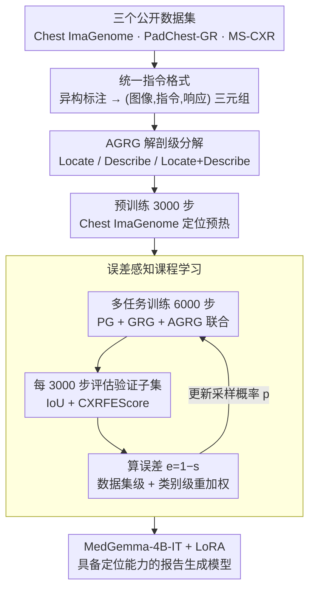

# CURE: Curriculum-guided Multi-task Training for Reliable Anatomy Grounded Report Generation

**会议**: CVPR 2026  
**arXiv**: [2601.15408](https://arxiv.org/abs/2601.15408)  
**代码**: [有](https://github.com/PabloMessina/CURE)  
**领域**: 医学图像  
**关键词**: 课程学习, 视觉定位, 放射报告生成, 多任务学习, 幻觉抑制  

## 一句话总结

提出 CURE——一种基于误差感知课程学习的多任务训练框架，在不引入额外数据的前提下，通过动态调节采样分布重点训练困难样本，将医学 VLM 的视觉定位精度提升 +0.37 IoU，幻觉率降低 18.6%。

## 研究背景与动机

**领域现状**：医学视觉-语言模型（VLM）已能自动从影像生成放射学报告，代表方法如 MAIRA-2、MedGemma 等在多个基准上取得了良好效果。

**痛点**：现有模型缺乏可靠的视觉定位能力——文本描述的病灶无法准确对应图像区域，导致"幻觉"频发（如图 1 所示，MAIRA-2 会对正常锁骨区域误报骨折）。

**核心矛盾**：传统短语定位训练数据天然偏向异常发现（abnormal findings），导致模型对正常解剖区域过度关联异常标签，假阳性率高；同时数据集间规模差异悬殊（Chest ImaGenome 1290 万 vs. MS-CXR 仅 815 条），标准比例采样会让小数据集被淹没。

**要解决什么**：在不引入额外私有数据的情况下，同时提升视觉定位精度与报告的事实一致性。

**切入角度**：借鉴课程学习(Curriculum Learning)思想——不是固定采样比例，而是动态根据模型当前表现调整采样权重，让模型更多关注尚未学好的数据源与解剖类别。

**核心 idea**：误差感知的双层课程学习——在数据集间（inter-dataset）和数据集内（intra-dataset/类别级）两个粒度上，根据模型评估误差动态重新加权采样概率，配合解剖级细粒度任务分解（AGRG），使同一图像产生多条训练实例，从而高效利用已有公开数据。

## 方法详解

### 整体框架

CURE 以 MedGemma-4B-IT 为基础模型，用 LoRA（rank=16，4-bit）微调，整条流水线分「数据重构 → 两阶段课程训练」两步走。

**数据重构**：把三个公开数据集（Chest ImaGenome、PadChest-GR、MS-CXR）形态各异的标注（框、短语、解剖标签、描述句）统一成 `(图像, 指令, 响应)` 三元组，并把 Chest ImaGenome 的场景图按解剖位置拆成 Locate / Describe / Locate+Describe 三类细粒度实例，把约 23.7 万张图撑成上千万条多任务训练样本。

**两阶段课程训练**：先用 3000 步在 Chest ImaGenome 上做定位预热，再用 6000 步联合训练 PG、GRG、AGRG 三类任务；多任务阶段每 3000 步暂停一次，用模型在各验证子集上的实测表现（IoU + CXRFEScore）重排数据集级与类别级的采样概率，让训练算力持续倾斜给"还没学好"的数据源与解剖区域。三个关键设计沿这条流水线自上而下展开：先把异构数据统一成指令三元组，再做 AGRG 解剖级分解撑出训练池，最后用误差感知课程动态调度采样。

### 关键设计

**1. 统一指令格式：把框、短语、描述、标签四种异构监督塞进同一个 instruction-following 模板**

三类任务的监督信号形态各不相同——PG（短语定位）是短语配框、GRG（定位报告生成）是整篇带框报告、AGRG（解剖级定位报告生成）是位置配框/描述，如果各用各的输入输出格式，模型等于同时学三套接口，任务之间容易打架。CURE 把它们全部统一成 `(图像, 指令, 响应)` 三元组：PG 写成 `"Ground the phrase: {phrase}"` → `"phrase: [cx,cy,w,h]..."`，GRG 写成 `"Generate a grounded report"` → 含 bbox 坐标的完整报告。统一模板让所有任务共享同一套参数和解码逻辑，减少任务冲突。这一步还顺带做了数据增强：PadChest-GR 除了原有的句子-框（sentence-box）对，额外从中抽出标签-框（label-box）对，几乎把 PG 的训练数据翻倍。

**2. 解剖级细粒度任务分解（AGRG）：把一张图的场景图拆成几十条监督实例，顺手解耦定位与描述两种能力**

医学定位训练的老问题是数据天然偏向异常发现，模型只见过"哪里有病灶"的样本，于是把正常解剖区域也过度关联到异常标签，假阳性频发。CURE 把 Chest ImaGenome 的场景图按解剖位置拆成三个子任务：Locate（给位置名 → 输出 `[cx, cy, w, h]` 框，覆盖 36 个位置）、Describe（给位置名 → 输出文本描述，38 个位置）、Locate+Describe（同时给框和描述，29 个位置），三者均匀采样保持平衡。这样拆有两层好处：一是显式解耦——模型先把"框画准"和"话说对"两种技能分开练扎实，再在 Locate+Describe 里联合，避免两个目标互相干扰；二是数据效率，一张图按解剖位置能裂解出 9~36 条训练实例，把约 23.7 万张图撑成约 1290 万条监督，而模型受算力所限实际只用了其中约 1.74%。更关键的是，因为现在每个解剖位置（含正常区域）都成了独立监督样本，模型同时见到了大量"这里正常"的描述，从源头上压下了把正常区域误报成异常的偏置。

**3. 误差感知课程学习：让训练自动把算力倾斜给"还没学好"的数据源和类别**

这一步直接针对前面那个核心矛盾——数据集规模差了几个数量级（Chest ImaGenome 1290 万 vs. MS-CXR 仅 815 条），如果按数据量比例采样，小数据集会被彻底淹没，高频解剖区域过拟合、低频但临床重要的区域却学不好。CURE 的做法是不固定采样比例，而是每 3000 步暂停一次，用当前模型在各数据源上实测表现来重排采样权重。这套调度分两个粒度协同。**数据集级（inter-dataset）**：对每个数据源 $D_i$ 算一个综合得分

$$s_i = \alpha \cdot \text{IoU}_i + (1-\alpha) \cdot \text{CXRFEScore}_i$$

兼顾定位精度（IoU）与报告事实性（CXRFEScore），再把误差 $e_i = 1 - s_i$ 归一化成下一轮的采样概率 $p_i = e_i / \sum_j e_j$。表现越差的数据源误差越大、采样概率越高——比如某轮 PadChest-GR 的 IoU 明显落后，它的 $e_i$ 就偏大，下一轮就被多采，直到追上来再让位。**类别级（intra-dataset）**：同样的逻辑下沉到每个数据集内部——MS-CXR 的短语定位按 8 种短语类别重加权，PadChest-GR 的短语定位按 26 个高层标签组重加权，Chest ImaGenome 的 AGRG 在每个子任务内按 29–38 个解剖位置重加权；唯独 PadChest-GR 的定位报告生成（GRG）任务，因为一份报告里多种发现共现、没有干净的单一归类方式，保持均匀采样。这种"哪里弱补哪里"的动态调度，比一刀切的比例采样更能把有限的训练步数花在刀刃上。

### 损失函数 / 训练策略

- 使用标准自回归语言模型损失（next-token prediction）
- 优化器：AdamW，学习率 $2 \times 10^{-4}$，线性调度 + 0.03 warmup
- 有效 batch size = 25（per-device 5 × gradient accumulation 5）
- 梯度裁剪 max_norm = 0.3
- 数据增强：空间变换 + CLAHE（对比度受限自适应直方图均衡化）
- 预训练阶段和多任务阶段各自独立初始化优化器，只保留模型权重

## 实验关键数据

### 主实验

**表 1：短语定位（Phrase Grounding）IoU**

| 模型 | MS-CXR Mi.↑ | MS-CXR Ma.↑ | PadChest Mi.↑ | PadChest Ma.↑ | VinDr(零样本) Mi.↑ | VinDr Ma.↑ |
|------|-------------|-------------|---------------|---------------|-------------------|------------|
| MAIRA-2 | 0.496 | 0.452 | 0.280 | 0.287 | 0.162 | 0.115 |
| **CURE** | **0.554** | **0.495** | **0.453** | **0.438** | **0.244** | **0.205** |

CURE 在所有数据集和指标上全面超越 MAIRA-2，PadChest-GR 上提升尤为显著（+0.173 / +0.151）。

**表 2：解剖定位报告生成（AGRG）- Chest ImaGenome**

| 模型 | IoU↑ | F1-Mi↑ | F1-Ma↑ | Cos.↑ | CXRFEScore↑ |
|------|------|--------|--------|-------|-------------|
| MAIRA-2 | 0.226 | 0.272 | 0.100 | 0.557 | 0.360 |
| MedGemma-4B-IT | – | 0.344 | 0.294 | 0.631 | 0.477 |
| **CURE** | **0.596** | **0.474** | 0.273 | **0.649** | **0.548** |

IoU 从 0.226 → 0.596（+0.37），定位精度翻倍以上；CXRFEScore +0.188。

**表 3：MIMIC-CXR 报告生成**

| 模型 | F1-Ma↑ | F1-Mi↑ | Cos.↑ | CXRFEScore↑ | RadF1↑ |
|------|--------|--------|-------|-------------|--------|
| CXRMate-RRG24 | 0.414 | 0.589 | 0.764 | 0.656 | **0.255** |
| MAIRA-2 (w/ grounding) | 0.304 | 0.490 | 0.751 | 0.603 | 0.120 |
| CURE (AGRG+GRG) | **0.415** | 0.562 | **0.792** | 0.655 | 0.176 |

CURE 在 CheXbert Cosine Similarity (0.792) 和 F1-Ma (0.415) 上取得最佳，与竞赛冠军 CXRMate-RRG24 互有胜负。

### 消融实验

**表 4：逐步消融（Table 7 摘录）**

| 配置 | AGRG IoU↑ | AGRG CXRS↑ | GRG IoU↑ | MS-CXR PG↑ | PadChest PG↑ | VinDr PG↑ |
|------|-----------|-----------|----------|------------|-------------|----------|
| v1: Base | 0.393 | 0.565 | 0.171 | 0.389 | 0.356 | 0.192 |
| v2: +Aug | 0.378 | 0.552 | 0.185 | 0.406 | 0.365 | 0.205 |
| v5: +Aug+CL(3k) | 0.419 | 0.552 | 0.180 | 0.432 | 0.393 | 0.205 |
| v8: +Aug+CIG(3k)+CL(3k) | 0.469 | 0.546 | 0.206 | 0.497 | 0.422 | 0.225 |
| **v9 (CURE)**: +HPS | **0.596** | **0.548** | **0.265** | **0.554** | **0.453** | **0.244** |

- 课程学习每 3000 步重加权效果最优（对比 1.5k、2k 频率）
- CIG 预训练从 1k → 3k 步持续带来定位增益
- 超参搜索(HPS)是最后一跳，AGRG IoU 从 0.469 → 0.596

### 关键发现

1. **幻觉显著降低**：CURE 平均异常幻觉率 8.78% vs. MAIRA-2 的 26.50%（降 67%）；锁骨区域尤为突出——MAIRA-2 幻觉率 59-63%，CURE 仅 1%
2. **矛盾率减半**：NLI 评估中 CURE 矛盾率 17.44% vs. MAIRA-2 的 33.22%，蕴涵率 39.50% vs. 15.94%
3. **零样本泛化**：VinDr-CXR（训练中未见）上 CURE 的 PG IoU 达 0.244 vs. MAIRA-2 的 0.162
4. **无需私有数据**：CURE 仅用公开数据训练，IoU 即超越使用 19 万条私有报告的 MAIRA-2

## 亮点与洞察

- **双层课程学习是关键创新**：同时解决数据集间和类别内的不平衡问题，不引入额外网络模块
- **细粒度任务分解极大提升数据效率**：23.7 万张图 → 1290 万条训练实例，且仅使用其中约 1.74%
- **AGRG 替代传统 Finding-Generation 目标**：让模型同时见到正常和异常描述，从根本上缓解假阳性偏置
- **从无到有赋予定位能力**：MedGemma-4B-IT 原本没有视觉定位功能，经 CURE 训练后定位能力超越专门设计的 MAIRA-2
- **训练代价低**：LoRA rank=16 / 4-bit，9000 步即完成，无需大规模算力

## 局限与展望

1. **报告级文本质量略逊**：在 PadChest-GR GRG 任务上文本指标仍不如使用私有数据的 MAIRA-2（F1-Mi 0.507 vs. 0.592）
2. **仅在胸部 X 光上验证**：所有实验限于 CXR 领域，对 CT/MRI/病理等模态的迁移能力未知
3. **Cardiac Silhouette 幻觉反升**：CURE 在心影区域幻觉率（25.67%）高于 MAIRA-2（2.00%），说明课程学习对某些类别可能过度纠偏
4. **RadGraph F1 偏低**：CURE 的 RadF1 (0.176) 远低于 CXRMate-RRG24 (0.255)，后者用 RL+RadF1 reward 专门优化此指标
5. **课程评估用 Gemini 做 NLI**：幻觉评估依赖外部 LLM 判断，可能引入评估偏差

## 相关工作与启发

- **MAIRA-2**：CURE 的直接对比对象，同样做多任务定位+报告生成，但依赖私有 USMix 数据集且无课程学习
- **MedGemma-4B-IT**：CURE 的基础模型，本身无视觉定位能力，证明了 CURE 框架的通用性
- **CXRMate-RRG24**：用 RL + RadGraph F1 reward 训练的竞赛冠军，在 RadF1 上领先但缺乏定位能力
- **Self-Paced Curriculum Learning (SPCL)**：CURE 的课程策略可视为 SPCL 在医学多任务场景的扩展——用 IoU+CXRFEScore 双指标替代单纯 loss 来衡量样本难度
- **启发**：误差感知采样策略可推广到任何多数据集多任务训练场景（如自动驾驶多传感器融合、多语言 NLP）

## 评分

⭐⭐⭐⭐ 方法简洁高效、实验充分扎实，在不增加数据和模型复杂度的前提下实现了定位和可靠性的显著提升，但文本生成质量仍有提升空间，且仅限 CXR 领域验证。

<!-- RELATED:START -->

## 相关论文

- [\[ICML 2026\] CAME-Grad: The Double Dilemma in Multi-Task Radiology Report Generation — A Gradient Dynamics Analysis and Solution](../../ICML2026/medical_imaging/the_double_dilemma_in_multi-task_radiology_report_generation_a_gradient_dynamics.md)
- [\[CVPR 2026\] MedGRPO: Multi-Task Reinforcement Learning for Heterogeneous Medical Video Understanding](medgrpo_multi-task_reinforcement_learning_for_heterogeneous_medical_video_unders.md)
- [\[AAAI 2026\] PriorRG: Prior-Guided Contrastive Pre-training and Coarse-to-Fine Decoding for Chest X-ray Report Generation](../../AAAI2026/medical_imaging/priorrg_prior-guided_contrastive_pre-training_and_coarse-to-fine_decoding_for_ch.md)
- [\[AAAI 2026\] GuideGen: A Text-Guided Framework for Paired Full-Torso Anatomy and CT Volume Generation](../../AAAI2026/medical_imaging/guidegen_a_text-guided_framework_for_paired_full-torso_anatomy_and_ct_volume_gen.md)
- [\[CVPR 2026\] Unleashing Video Language Models for Fine-grained HRCT Report Generation](unleashing_video_language_models_for_fine-grained_hrct_report_generation.md)

<!-- RELATED:END -->
