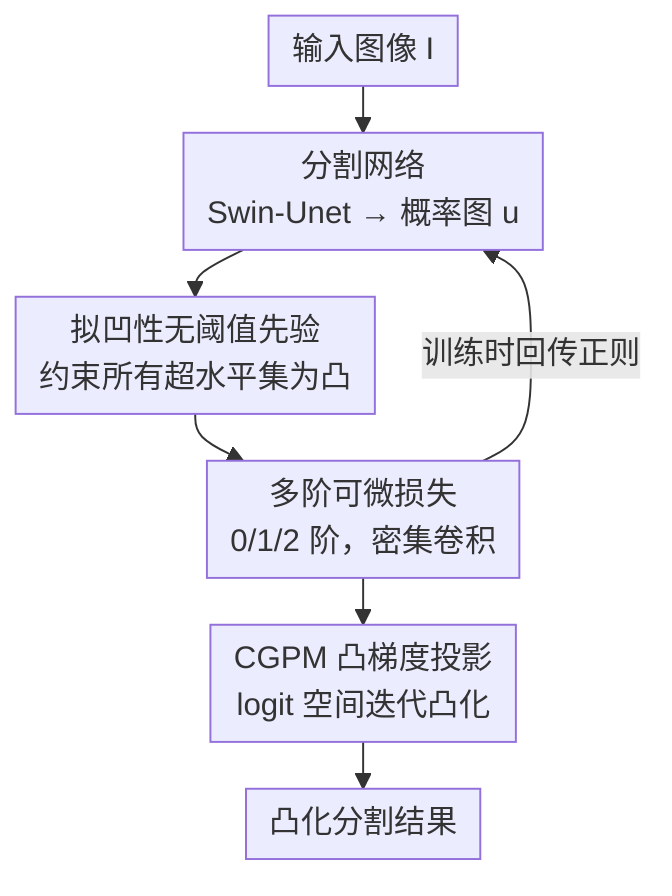

# D-Convexity: A Unified Differentiable Convex Shape Prior via Quasi-Concavity for Data-driven Image Segmentation

**会议**: CVPR 2026  
**arXiv**: [2605.19210](https://arxiv.org/abs/2605.19210)  
**代码**: https://github.com/ShengzheC/D-Convexity (有)  
**领域**: 医学图像 / 图像分割 / 形状先验  
**关键词**: 凸形状先验, 拟凹性, 可微分割, 视网膜分割, 水平集

## 一句话总结
把"分割结果必须是凸形"这个先验，从对二值集合的全局约束，改写成对网络输出概率图 $u$ 的**拟凹性(quasi-concavity)** 约束，从而得到一个无需阈值、可微、可密集卷积计算的凸性损失，并用一个凸梯度投影模块(CGPM)在推理时硬性凸化输出，在视网膜/心脏等近凸结构分割上一致提升 Dice/IoU 并降低 Hausdorff 距离。

## 研究背景与动机

**领域现状**：在医学图像分割里，很多解剖结构（视盘、视杯、心室、瞳孔）本身是凸的或近凸的。当数据噪声大、样本少、有遮挡时，给网络注入"分割区域应为凸"的形状先验能显著抑制空洞、毛刺和把相邻实例粘连在一起的错误。经典做法分两派：离散组合优化（在共线三元组上加 1–0–1 惩罚、graph-cut/ILP 凸性约束）和连续水平集方法（约束曲率非负、或要求符号距离函数的 Laplacian 非负）。

**现有痛点**：这两派都难塞进端到端可训练的网络。离散方法依赖分支定界/近似求解器，不可微，无法跟深度网络耦合反传；连续水平集方法把凸性写成 PDE 约束，理论优雅，但要么只是必要不充分条件，要么**只在某一个特定阈值（如 $\phi=0$ 水平集）上保证凸性**，对一个输出连续概率的解码器来说，选哪个阈值本身就是个问题，也不方便当成可微损失用。近期的深度形状先验虽然把形状项写进 loss，却没有对"凸性"这件事的显式控制。

**核心矛盾**：凸性天然是定义在**二值集合**上的几何性质，而网络输出的是一张 $[0,1]$ 的连续概率图 $u$；要约束某个阈值 $\gamma$ 切出来的集合 $S_\gamma=\{x:u(x)\ge\gamma\}$ 凸，就得先选阈值、再处理一个集合值约束——这条路既不可微也不优雅。

**本文目标**：找到一个直接作用在连续函数 $u$ 上、无需选阈值、可微、能密集计算的凸性约束，并且能解释清楚前人各种凸性模型之间的关系。

**切入角度**：作者从一个泛函视角出发——与其约束某一个阈值下的二值 mask，不如要求**所有**阈值下的超水平集 $S_\gamma$ 同时为凸。"所有超水平集都凸"恰好就是函数 $u$ **拟凹**的定义。这一步把集合层面的约束直接搬到了函数层面。

**核心 idea**：用 $u$ 的拟凹性来表达凸形状先验——$u\text{ 拟凹}\iff \forall\gamma,\ S_\gamma\text{ 是凸集}$——再按 $u$ 的光滑度（$C^0/C^1/C^2$）分别导出零阶/一阶/二阶的局部可微不等式，把全局凸性约束变成可以卷积实现的逐点惩罚。

## 方法详解

### 整体框架
设分割网络 $\mathcal{N}(I;\Theta)$ 输出原始特征 $o$，经 sigmoid 得到概率图 $u=\mathcal{S}(o):\Omega\to[0,1]$。本文不直接约束某个 $S_\gamma$ 凸，而是要求 $u$ 拟凹，并把这个泛函约束按光滑度分解成三个可计算的条件：零阶给出一个局部中点凸化算法，一阶给出与支撑超平面挂钩的梯度不等式，二阶给出切空间上 Hessian 的二次型条件。一阶和二阶都能写成在整图上密集应用、无需阈值的紧凑卷积损失。训练时这些拟凹损失作为正则项跟保真损失（Dice/交叉熵）一起回传；推理时再用 CGPM 把网络输出投影到一个更凸的解上，作为硬约束兜底。

### 关键设计

**1. 拟凹性：把"集合凸"重写成"函数拟凹"的无阈值先验**

痛点是凸性约束天生绑在某个阈值切出来的二值集合上，选阈值、处理集合值约束让它既不可微也难嵌入网络。作者的关键观察是：$S_\gamma$ 正是 $u$ 的超水平集，如果**不论选什么 $\gamma$，$S_\gamma$ 都凸**，那等价于 $u$ 的所有超水平集都凸，也就是 $u$ 拟凹。于是有

$$u\text{ 拟凹}\iff \forall\gamma,\ S_\gamma=\{x\in\Omega:u(x)\ge\gamma\}\text{ 是凸集}$$

这一改写有三重好处：其一，彻底甩掉阈值选择；其二，按 $u$ 落在 $C^0/C^1/C^2$ 哪一类光滑度，可分别给出零/一/二阶条件；其三，约束直接打在输出函数 $u$ 上，天然可微、能进深度学习框架。注意拟凹比凹更弱——凹函数处处低于切平面，而拟凹只要求超水平集凸，恰好对应"形状凸"这件事，不会过度约束概率图的幅值

**2. 三阶可微特征：从拟凹性导出可卷积计算的逐点损失**

把拟凹性按光滑度展开，得到三个层层加强的等价/充分条件，并各自落地成可计算的形式：

- **零阶**（$u\in C^0$，定理 1）：$u(\lambda x+(1-\lambda)y)\ge\min\{u(x),u(y)\}$，即线段上的值不低于两端点的较小者。落地为局部中点凸化算法——对每个像素 $y$ 和半径内偏移 $d$，取中点 $m=y+d$、反射点 $z=y+2d$，做 $u(m)\leftarrow\max(u(m),\min\{u(y),u(z)\})$，迭代传播会单调抬升 $u$ 并有限步收敛；半径 $r$ 越大越逼近前景凸包，越小则允许多个独立凸物体。
- **一阶**（$u\in C^1$，定理 2）：若 $u(x)\ge u(y)$ 则 $\nabla u(y)^\top(x-y)\ge0$。其几何含义由引理 1 给出——超水平集凸时，边界点处梯度 $\nabla u$ 指向集合内部，定义一个支撑半空间。对应损失对违反该不等式的像素对惩罚其负部，用软 sigmoid 近似硬指示：
$$\mathcal{L}_{1st}(u)=\frac{1}{|\Omega|}\sum_{y\in\Omega}\sum_{x\in N_y}\mathrm{Sigmoid}_\varepsilon\!\big(u(x)-u(y)\big)\cdot\mathrm{ReLU}\!\big(-\nabla u(y)^\top(x-y)\big)$$
- **二阶**（$u\in C^2$，定理 4/5）：Hessian 在切空间负定。2D 下切方向是 $d=(-u_y,u_x)$，条件化简为一个显式二次型
$$Q_2(x)=u_x^2u_{yy}-2u_xu_yu_{xy}+u_y^2u_{xx}<0$$
对应损失只需逐点检查（空间复杂度 $\mathcal{O}(|\Omega|)$，而零/一阶要查所有像素对、复杂度 $\mathcal{O}(|\Omega|^2)$，故实践中受限到 $r$ 邻域），并用梯度模长门控、加余量 $\delta$ 保证严格负：
$$\mathcal{L}_{2nd}(u)=\frac{1}{|\Omega|}\sum_{x\in\Omega}\|\nabla u(x)\|\cdot\mathrm{ReLU}\!\big(Q_2(x)+\delta\big)$$
所有微分算子 $u_x,u_y,u_{xx},u_{xy},u_{yy}$ 都用有限差分卷积核实现，整图并行高效。二阶因为只查单点、信息最丰富，是默认选项

**3. CGPM：推理时把输出投影到更凸的解**

光靠训练时的软损失不足以在推理时硬性保证凸性。作者提出凸梯度投影模块(CGPM)：网络给出原始 logit $o$、$u=\mathrm{Sigmoid}(o)$ 后，求解一个近端(proximal)凸化问题

$$u_p\in\arg\min_{v\in[0,1]}\ \tfrac12\|v-u\|^2+\lambda\cdot\mathcal{L}_{convex}(v)$$

其中 $\mathcal{L}_{convex}$ 取 $\mathcal{L}_{1st}$ 或 $\mathcal{L}_{2nd}$。该问题在 logit 空间用展开(unrolled)的梯度下降迭代求解（保证 $v\in[0,1]$），第一项把结果拉回贴近原始预测、第二项推它变凸，$\lambda$ 平衡二者。CGPM 既是训练时的可微模块、也是推理时的硬凸化器，代价只是把 Swin-Unet 的单图推理从 0.01s 增到 0.12s

**4. 统一前人凸性模型为特例**

拟凹框架把一大批看似无关的凸性方法收进一把伞下：[13] 的"线段内任意两点连线仍在区域内"正是零阶条件（且本文更一般，约束整个图像域而非仅二值集合）；[17,23,20] 的二值卷积凸性条件 $(u-1)(b_r*(2u-1))\ge0$（背景像素邻域内前景占比不超一半）可由一阶条件 + 引理 1 的半空间包含直接推出；[32,39] 的曲率非负、[22,38] 的符号距离函数 Laplacian 约束则对应二阶条件——令 $\phi=-u$ 有

$$\kappa(x)=\frac{-Q_2(x)}{\|\nabla u(x)\|^3}$$

故约束 $Q_2(x)<0$ 即得 $\kappa(x)>0$；而前人常用的 $\kappa\ge0$（等价 $Q_2\le0$）只是凸性的**必要不充分**条件。这一统一既解释了前人方法为何有效，也点明了它们的边界

### 损失函数 / 训练策略
默认配置：Swin-Unet 作编解码骨干，输入 resize 到 $224\times224$，CGPM 内用二阶条件 $\mathcal{L}_{2nd}$，整体框架配交叉熵保真损失训练。CGPM 超参 $\eta=10^{-2}$、$\lambda=1$、$T_{\max}=100$；优化用 AdamW + OneCycle，训练 200 epoch，batch size 6，最大学习率 $10^{-4}$。多类时：多标签训练 $K$ 个独立二值图各自加凸先验；softmax 单标签时约束 $u_m-\max_{i\ne m}u_i$ 拟凹即可保证类 $m$ 区域凸。

## 实验关键数据

### 主实验
形状感知方法对比（Table 1，Swin-Unet 主干，REFUGE 训练后直接迁到 RIM-ONE-r3 测泛化）：

| 数据集 | 指标 | 本文 | U-Net | Active Boundary |
|--------|------|------|-------|-----------------|
| REFUGE | Dice ↑ | **88.61** | 84.66 | 84.82 |
| REFUGE | IoU ↑ | **79.54** | 73.71 | 73.63 |
| REFUGE | HD ↓ | **5.859** | 11.07 | 10.59 |
| RIM-ONE-r3 (跨集泛化) | Dice ↑ | **83.09** | 76.48 | 75.37 |
| RIM-ONE-r3 (跨集泛化) | HD ↓ | **12.59** | 20.57 | 20.64 |

与视网膜专用 SOTA 对比（Table 2，RIM-ONE-r3，视盘/视杯）：

| 结构 | 指标 | 本文(2026) | Swin-Unet(2022) | ODCS-NSNP(2025) |
|------|------|-----------|-----------------|-----------------|
| 视盘 | Dice | **97.15** | 96.77 | 96.63 |
| 视盘 | IoU | **94.46** | 93.75 | 93.48 |
| 视杯 | Dice | **88.01** | 86.57 | 85.41 |
| 视杯 | IoU | **78.59** | 76.37 | 75.04 |

### 消融实验
各阶条件 + 骨干适配性（Table 3，REFUGE 上 10 次配对试验 + t 检验，给出相对各自基线的提升 $\Delta$，全部 $p<.01$）：

| 骨干 | 先验 | Dice Δ | IoU Δ | HD Δ |
|------|------|--------|-------|------|
| U-Net | 0 阶 | −0.156 | −0.232 | −0.098 |
| U-Net | 1 阶 | +0.429 | +0.644 | −0.832 |
| U-Net | 2 阶 | **+1.510** | **+2.280** | **−2.240** |
| Swin-Unet | 0 阶 | −0.185 | −0.284 | −0.056 |
| Swin-Unet | 1 阶 | +0.659 | +1.013 | −0.787 |
| Swin-Unet | 2 阶 | **+2.375** | **+3.711** | **−1.630** |
| DeepLabV3+ | 2 阶 | **+6.569** | **+9.202** | **−3.324** |

### 关键发现
- **二阶条件全面最优**：在三个骨干上，二阶 $\mathcal{L}_{2nd}$ 的 Dice/IoU 提升和 HD 下降都明显大于一阶，幅度随骨干递增（U-Net +1.51 → Swin-Unet +2.38 → DeepLabV3+ +6.57 Dice），说明骨干本身越缺形状约束、凸先验收益越大。
- **零阶反而轻微掉点**：零阶中点凸化直接作用在 raw 输出上、过于激进，三个骨干上 Dice/IoU/HD 均小幅变差（如 Swin-Unet Dice −0.185），印证作者把零阶定位为"可解释但不实用"、把可微的一/二阶损失作为落地方案。
- **跨数据集泛化稳健**：REFUGE 训练直接测 RIM-ONE-r3，本文 Dice 83.09 vs U-Net 76.48，凸先验对域偏移下的形状规整尤其有效。
- **推理代价可控**：CGPM 把单图推理从 0.01s 增到 0.12s，换来硬性凸化保证。

## 亮点与洞察
- **泛函视角是点睛之笔**：把"某阈值下集合凸"换成"函数拟凹"，一步绕开阈值选择和集合值约束，让凸性变成可微逐点不等式——这是整篇论文最"啊哈"的地方，思路可迁移到其他"集合层面几何约束 → 连续函数约束"的场景（如连通性、星形约束）。
- **二阶 $Q_2$ 的复杂度优势**：二阶条件只需逐点检查 $\mathcal{O}(|\Omega|)$，而零/一阶要查像素对 $\mathcal{O}(|\Omega|^2)$；且 $Q_2$ 全用有限差分卷积核实现，等于把一个微分几何条件写成几行卷积，工程上极友好。
- **统一性既是理论也是实用工具**：通过 $\phi=-u$ 的符号约定和 $\kappa=-Q_2/\|\nabla u\|^3$，把离散 1-0-1、卷积凸性、曲率/SDF 水平集先验全收进一个连续可微框架，还顺手指出前人常用的 $\kappa\ge0$ 只是必要不充分——这种"用统一框架照出旧方法漏洞"的写法很有说服力。
- **CGPM 兼训练与推理**：同一个展开优化模块，训练时提供可微梯度、推理时做硬凸化兜底，避免了"训练软约束、推理无保证"的常见割裂。

## 局限与展望
- **只适用于近凸结构**：方法的全部增益建立在目标解剖结构本身凸或近凸（视盘、视杯、心室、瞳孔）；对凹形、细长分叉、拓扑复杂的结构（如血管树、神经纤维），凸先验会变成有害约束，论文未涉及这类场景。
- **二阶仅是充分条件且依赖光滑性**：定理 5 的 $Q_2<0$ 是拟凹的充分条件而非充要，且假设 $u\in C^2$；真实概率图在边界处未必这么光滑，有限差分近似在锐利边界处的误差未充分讨论。
- **超参与代价**：CGPM 的 $\lambda$、$T_{\max}=100$ 迭代步数、邻域半径 $r$、余量 $\delta$ 都需调，且推理时间放大 12 倍（0.01→0.12s）；对大图或实时场景可能成为瓶颈。
- **改进思路**：可探索自适应半径 $r$（按局部曲率/物体尺度变化）、把拟凹约束推广到 3D 体数据（$Q_2$ 在 3D 切空间需扩展）、或与可学习的非凸-凸混合先验结合以覆盖部分非凸结构。

## 相关工作与启发
- **vs 离散凸性优化（1-0-1 惩罚、graph-cut/ILP）**：他们在像素图上用全局组合约束保证凸，需分支定界/近似求解、不可微；本文把同类约束（零阶条件）改写到连续函数域、可微可反传，且证明 graph-cut 凸性等价于像素图尺度上的逐对零阶约束。
- **vs 水平集曲率/SDF 方法（$\kappa\ge0$、$\Delta\phi\ge0$）**：他们只在单个阈值（$\phi=0$）上保证凸、且 $\kappa\ge0$ 仅必要不充分；本文用 $\phi=-u$、$\kappa=-Q_2/\|\nabla u\|^3$ 把它纳为二阶条件特例，并以 $Q_2<0$ 给出充分条件，同时是无阈值的、对所有置信水平成立。
- **vs 深度形状先验损失（[17] 凸形状块、[13] 凸性损失项）**：他们把形状项写进 loss 但缺乏对凸性的显式/无阈值控制；本文提供了(1)作用于整张 mask 的无阈值凸先验、(2)等价一阶 + 充分二阶的简单可微损失、(3)把前人离散/SDF 凸性检查作为特例回收的理论桥梁，并配 CGPM 做推理硬约束。

## 评分
- 新颖性: ⭐⭐⭐⭐⭐ 用拟凹性把集合凸性约束重写成无阈值可微函数约束，并统一一大批前人凸性模型，视角新颖且自洽
- 实验充分度: ⭐⭐⭐⭐ 四数据集 + 三骨干 + t 检验消融较扎实，但局限在近凸医学结构，缺非凸/3D 场景验证
- 写作质量: ⭐⭐⭐⭐⭐ 从零/一/二阶层层推导、定理与落地损失一一对应、统一性论证清晰，理论与工程衔接好
- 价值: ⭐⭐⭐⭐ 即插即用的凸形状先验模块，对近凸解剖结构分割实用，但适用范围受凸性假设限制

<!-- RELATED:START -->

## 相关论文

- [\[CVPR 2026\] Multimodal Causality-Driven Representation Learning for Generalizable Medical Image Segmentation](multimodal_causal-driven_representation_learning_for_generalizable_medical_image.md)
- [\[CVPR 2026\] SHAPE: Structure-aware Hierarchical Unsupervised Domain Adaptation with Plausibility Evaluation for Medical Image Segmentation](shape_structure-aware_hierarchical_unsupervised_domain_adaptation_with_plausibil.md)
- [\[CVPR 2026\] MultiModalPFN: Extending Prior-Data Fitted Networks for Multimodal Tabular Learning](multimodalpfn_extending_prior-data_fitted_networks_for_multimodal_tabular_learni.md)
- [\[CVPR 2026\] PGR-Net: Prior-Guided ROI Reasoning Network for Brain Tumor MRI Segmentation](pgr-net_prior-guided_roi_reasoning_network_for_brain_tumor_mri_segmentation.md)
- [\[CVPR 2026\] OSA: Echocardiography Video Segmentation via Orthogonalized State Update and Anatomical Prior-aware Feature Enhancement](osa_echocardiography_video_segmentation_via_orthogonalized_state_update_and_anat.md)

<!-- RELATED:END -->
