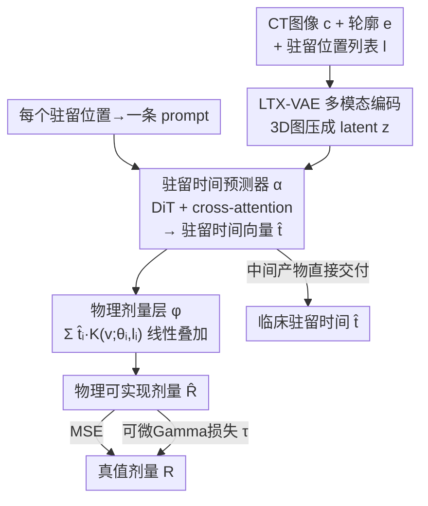

# D2T2 - Multimodal Automated Planning for Brachytherapy

**会议**: CVPR 2026  
**论文**: [CVF Open Access](https://openaccess.thecvf.com/content/CVPR2026/html/Moore_D2T2_-_Multimodal_Automated_Planning_for_Brachytherapy_CVPR_2026_paper.html)  
**代码**: 无（论文未公开，数据集为院内私有）  
**领域**: 医学图像  
**关键词**: 近距离放疗, 自动放疗计划, 物理约束网络, 概念瓶颈, 可微Gamma损失

## 一句话总结
D2T2 用一个「DiT 预测每个驻留位置的驻留时间 → 物理层把驻留时间线性组合成剂量」的两阶段网络，端到端地直接预测可临床交付的近距离放疗机器参数，配合一个把 Gamma 指数变成可微损失的代理网络，单次前向就比现有 SOTA 更准、并把规划耗时从数十分钟压到 0.1 秒。

## 研究背景与动机

**领域现状**：近距离放疗（brachytherapy）是把放射源经施源器送到病人体内一组预先确定的「驻留位置」$l_i$，靠控制源在每个位置停留的「驻留时间」$t_i$ 来塑形剂量分布。临床上由医生在 CT 上反复 trial-and-error 手调驻留时间，一例往往要 60 分钟以上，病人全程要镇静。学界已有的自动化做法（外照射放疗的主流套路）是：训一个 CNN/Transformer 从 CT + 器官轮廓直接回归出体素级剂量图 $\hat R$。

**现有痛点**：直接预测剂量这条路有个绕不开的断层——临床真正要交付给机器的是驻留时间 $t_i$，而不是剂量图。从预测出的 $\hat R$ 反解 $t_i$ 还要再跑一次后处理优化（OPT），这一步平均要几分钟、病人还在镇静等待；更糟的是网络预测的 $\hat R$ 不保证物理可实现（不一定能由某组 $t_i$ 线性组合出来），导致优化可能失败或解出次优的驻留时间，预测误差和优化误差还会叠加。

**核心矛盾**：直接让网络预测驻留时间又非常难——驻留时间不存在唯一 ground truth。源位置 $l_i$ 因人而异、相邻位置的剂量核高度重叠，导致「很多组不同的 $t_i$ 会产生几乎一样的剂量」；而孤立位置又对局部剂量极其敏感。这种「重要性不均衡且跨病例不一致」让直接回归 $t_i$ 成为病态问题。

**本文目标**：要一个既能输出物理可实现剂量、又能顺带把驻留时间作为中间量直接吐出来的模型，去掉后处理优化。

**切入角度**：放疗的剂量形成本身有明确物理模型——总剂量是各驻留位置剂量核的线性叠加 $R(v)\propto\sum_i t_i K(v;\theta_i,l_i)$。既然物理已知，就把它焊进网络结构，让网络只负责预测物理参数 $t_i$，剂量由物理层算出来。

**核心 idea**：把驻留时间当作剂量预测的「概念瓶颈」——网络先预测驻留时间向量，再用一个不可训练的物理层把它确定性地映射成剂量，整体端到端用 MSE 拟合真值剂量；这样驻留时间作为中间产物被免费得到，且剂量天然物理可实现。

## 方法详解

### 整体框架
D2T2（Direct Dwell Time Transformer）把剂量预测写成两阶段复合 $\hat R = \phi \circ \alpha$。第一阶段 $\alpha$ 是一个多模态 Transformer，吃进 CT 图像 $c$、器官/靶区轮廓 $e$、以及驻留位置列表 $l$，输出驻留时间向量 $\hat t = \alpha(c,e,l)$；第二阶段 $\phi$ 是一个写死物理公式的层，把 $\hat t$ 和位置 $l$ 按剂量核线性组合成最终剂量 $\hat R$。整个网络用 MSE（拟合真值剂量）加一个 Gamma 代理损失端到端训练。输入异质（3D 图像 + 一串 3D 坐标），源数量还从 15 到 250+ 不等，所以 $\alpha$ 借鉴了图文多模态的做法：用预训练 VAE 把 3D 图压成低维 latent，把每个驻留位置当成一条「prompt」，用 cross-attention 让位置去查询图像特征。

### 关键设计

**1. 两阶段物理瓶颈架构：把剂量形成的物理公式焊进网络**

针对「直接预测剂量会输出物理不可实现的 $\hat R$、还要靠后处理优化反解驻留时间」这个断层，D2T2 不让网络直接回归剂量，而是让它只预测物理参数——驻留时间向量 $\hat t$，再把第二阶段 $\phi$ 实现成一个不含可训练参数的物理层，严格按 TG-43 形式的剂量核做线性组合：

$$\hat R(v) \propto \sum_{i=1}^{S} \hat t_i\, K(v;\theta_i,l_i)$$

其中 $K(v)$ 是单个线源的辐射剖面（近似按距离平方反比衰减），$K(v;\theta_i,l_i)$ 是它平移到 $l_i$、旋转到朝向 $\theta_i$ 的副本。这样 $\hat R$ 天生就是某组驻留时间的合法叠加，物理可实现性被结构保证，后处理优化被整段删掉。作者点出这等价于一个径向基函数（RBF）网络——基函数由近距离放疗物理决定。它和概念瓶颈模型（concept bottleneck）同构：驻留时间就是剂量预测的「瓶颈概念」，因而模型自带可解释性（剂量可由一组简单参数解释）、可信性（剂量恒物理可实现）和可控性（驻留时间正是驱动机器交付的物理量）。因为训练是端到端的，所有参数都在「预测出最优且物理可实现的剂量」这个目标下被优化，驻留时间作为中间步骤被顺带学好。

**2. 多模态融合的驻留时间预测器：把每个驻留位置当成一条 prompt 去查询 CT**

第一阶段 $\alpha$ 要解决三个工程难题：CT/轮廓是 3D 体图而驻留位置是一串 3D 坐标（输入异质）、源数量逐例可变（15 到 250+）、CT 维度极高。对维度，作者把所有 3D 图喂给一个自编码器 $\gamma$ 压到 $z\in\mathbb{R}^{\frac{H}{32}\times\frac{W}{32}\times\frac{D}{8}}$，直接复用了 LTX-Video 扩散模型的预训练 VAE——理由是 CT 和视频在统计上相似、LTX VAE 原生支持 1:8192 的体素到 token 压缩比，使得在中等算力下也能对整个 3D 体做全注意力；它是 3 通道（为 RGB 视频设计），所以把单通道 CT 沿通道复制三份再编码，作者实测其 CT/轮廓重建精度不输专门为该模态训练的 VAE。对异质性，借鉴图文多模态：用一个 DiT Transformer，把每个驻留位置嵌成单独的 prompt，送进 cross-attention 层去与所有图像 patch 的 embedding 做交互。最后接一个带绝对值激活的 MLP 回归头，保证输出的驻留时间非负。源数量可变这一点也被自然吸收——位置是变长的一串 prompt token，注意力机制对长度不敏感。

**3. 可微 Gamma 损失：把临床金标准 Gamma 指数蒸馏成一个可反传的代理网络**

放疗里比较两张剂量图的金标准不是逐体素 MSE，而是 Gamma 指数——一个空间松弛的误差度量。对每个体素 $v$，它取与所有参考体素 $v'$ 的最小组合距离：

$$\gamma(\hat R(v)) = \min_{v'} \sqrt{\frac{\lVert v-v'\rVert^2}{\Delta d^2} + \frac{(\hat R(v)-R(v'))^2}{\Delta D^2}}$$

其中 $\Delta d$（距离容差，取 3 mm）和 $\Delta D$（剂量容差，取 3%）是临床预设参数。Gamma 指数没法直接当损失，原因有二：逐体素两两比较带来 $O(V^2)$ 复杂度（3D 体素阵列下几乎算不动），且 $\min$ 使它不可微。作者的破解办法是「学一个代理」——训练一个网络 $\tau$ 去预测 Gamma 指数 $\hat\gamma=\tau(R,\hat R)$，$\tau$ 的结构和 D2T2 几乎一样、只把输入输出投影换成 3D patchify/unpatchify。$\tau$ 用合成数据集 $D'=\{R_n,\hat R_n\}$ 训练：$R_n$ 是真实剂量，$\hat R_n$ 是用同一组位置 $l_n$、物理模型 $\phi$、但把真值驻留时间换成随机 $\hat t_n$ 生成的「假预测」，对每对算出真值 $\gamma_n$，让 $\tau$ 用 MSE 去拟合（公式 8）。训好后冻结 $\tau$，主模型 $\alpha$ 用 $L = \sum_n L_2(R_n,\hat R_n) + \lambda \sum_n L_\Gamma(R_n,\hat R_n)$ 训练（公式 9）。这把一个临床有意义但计算上禁止的指标，变成了可在大规模训练里反传的可微目标。

### 损失函数 / 训练策略
主损失是逐体素 MSE $L_2(R,\hat R)=\frac{1}{HWD}\sum_v(\hat R(v)-R(v))^2$ 加上权重 $\lambda$ 的 Gamma 代理损失 $L_\Gamma$，$\tau$ 在主训练中冻结。数据按病人分组做 70/15/15 划分，确保同一病人不跨折。Gamma 代理 $\tau$ 的合成集分 $D'_{S/M/L}$ 三档（3000 / 15000 / 30000 样本，对应每例 1/5/10 个随机采样）。消融显示最优 $\lambda=0.05$；作者特意没把 L2(Dwell)（驻留时间的直接监督）放进最终损失——因为驻留时间的歧义性反而会拖累训练（见下文消融）。

## 实验关键数据

数据集是院内约 5,000 例真实临床计划（迄今最大），覆盖宫颈 2002、乳腺 483、子宫内膜 1171、阴道 252、其他 1081 例；驻留位置数从几个到 160+，是首个「不分部位通用」的近距离放疗自动规划模型。评测指标：剂量 MAE（预测 $\hat R$ vs 真值 $R$）与驻留时间 MAE（$\hat t$ vs $t$）。

### 主实验
对比对象是当前 SOTA 的「优化器型」方法 OPT（先预测剂量、再后处理优化反解驻留时间），为公平起见用与 D2T2 等价的 DiT 复现并在同数据集上训练。

| 部位 | 模型 | 剂量 MAE (%)↓ | 驻留时间 MAE (s)↓ | 平均耗时 (s)↓ |
|------|------|---------------|-------------------|---------------|
| Breast | OPT | 5.45 | 8.84 | 49.12 |
| Breast | **D2T2** | **4.31** | **7.25** | **0.12** |
| Cervical | OPT | 3.70 | 13.00 | 25.87 |
| Cervical | **D2T2** | **3.12** | **7.56** | **0.10** |
| Endometrial | OPT | 4.50 | 13.07 | 25.17 |
| Endometrial | **D2T2** | **3.42** | **8.72** | **0.10** |
| Other | OPT | 5.09 | 10.52 | 50.57 |
| Other | **D2T2** | **3.75** | **6.57** | **0.11** |
| Overall | OPT | 4.41 | 11.79 | 35.07 |
| Overall | **D2T2** | **3.54** | **7.41** | **0.10** |

D2T2 在所有部位的剂量和驻留时间 MAE 上都胜过 OPT，整体剂量 MAE 从 4.41% 降到 3.54%、驻留时间 MAE 从 11.79s 降到 7.41s，耗时从 35s 量级压到 0.1s（数百倍加速）。值得注意的是 OPT 本就是为剂量 MAE 直接优化的，D2T2 仍能赢——作者归因于物理可实现性起到了正则作用；在数据稀疏的 Other 部位（5.09→3.75）增益最大，印证「低数据下隐式正则更有用」。驻留时间增益更大则是因为 OPT 会把剂量预测误差和优化误差叠加。

### 消融实验

**损失组合消融（Table 2，不加权直接相加）**：

| L2(Dose) | L2(Dwell) | L_Γ | 剂量 MAE (%)↓ | 驻留时间 MAE (s)↓ |
|:--:|:--:|:--:|---------------|-------------------|
| ✓ | | | 3.68 | 7.41 |
| | ✓ | | 4.34 | 7.66 |
| | | ✓ | **3.64** | 7.76 |
| ✓ | | ✓ | 4.67 | 7.49 |
| ✓ | ✓ | | 3.69 | 7.85 |

单独看，**Gamma 损失给出最好的剂量 MAE（3.64）**；而对驻留时间直接加 L2(Dwell) 在所有指标下都偏差——因为驻留时间存在「多解等价」的歧义，监督它反而加大学习难度，所以最终损失不含 L2(Dwell)。

**权重 $\lambda$ 消融（Table 3）**：

| $\lambda$ | 剂量 MAE (%)↓ | 驻留时间 MAE (s)↓ |
|:--:|---------------|-------------------|
| **0.05** | **3.54** | **7.41** |
| 0.1 | 3.79 | 7.91 |
| 1 | 3.69 | 7.85 |
| 5 | 3.62 | 7.62 |
| 10 | 3.63 | 7.70 |

$\lambda=0.05$ 同时拿下两个指标最优（3.54 / 7.41），且优于 Table 2 中任何单损失组合，故最终采用。

### 关键发现
- 物理可实现性约束充当了隐式正则，连「为剂量 MAE 直接优化的」OPT 都被反超，且数据越稀疏（Other 部位）增益越大。
- 直接监督驻留时间（L2(Dwell)）有害无益——驻留时间的多解歧义让它成为坏的监督目标；这反向支持了「把驻留时间当中间瓶颈、只在剂量空间施加监督」的设计选择。
- Gamma 代理网络 $\tau$ 随合成数据量（$D'_{S/M/L}$）增大验证误差持续下降，说明这个「学损失函数」的思路能 scale。

## 亮点与洞察
- **把已知物理写成不可训练的网络层**，是这篇最优雅的地方：它不是给损失加物理正则项，而是让物理成为架构本身，从而结构性地保证输出合法、还把临床要的机器参数当中间产物白送出来。这种「物理层 = 概念瓶颈」的视角可迁移到任何「最终量由已知线性/可微物理从少量参数合成」的任务（如 MRI 重建、光场、可微渲染中的参数回归）。
- **「学一个可微代理去逼近不可微但临床有意义的评测指标」** 是另一条可复用 trick：凡是评测金标准昂贵/不可导（如各种带 $\min$/排序/匹配的临床或感知指标），都可以照搬「用合成正负样本对训一个回归网络当损失」的套路，思想上和 LPIPS/CLIP loss 一脉相承，但首次落到放疗。
- 复用 LTX-Video 的预训练 VAE 编码 CT 体（把医学 3D 体当「视频」、单通道复制三份），是个很实用的跨模态迁移观察——省去为 CT 专门训 VAE。

## 局限与展望
- **无公开数据/代码**：近距离放疗领域没有公开数据集，模型和约 5000 例数据都是院内私有、IRB 豁免，复现门槛极高；baseline 也只有 OPT 一个（作者承认「可比方法极少、无开源」）。
- **驻留位置 $l_i$ 假定为输入且固定**：模型不规划施源器放置，只在给定位置上分配时间；真实临床中施源器置入本身也影响计划质量，这部分被排除在外。
- **Gamma 代理的精度上限**：$\tau$ 是对金标准的近似，合成「假预测」靠随机驻留时间生成，其分布是否覆盖真实预测误差的形态值得存疑 ⚠️；代理误差会间接影响最终剂量质量。
- 评测只用 MAE，未直接报告临床更关心的 DVH 指标（如靶区 D90、危及器官 D2cc）是否达标，**剂量 MAE 低不完全等价于计划临床可接受**。

## 相关工作与启发
- **vs OPT（剂量预测 + 后处理优化，SOTA）**：OPT 先回归剂量再反解驻留时间，两步误差叠加、优化耗时数分钟且可能因物理不可实现而失败；D2T2 把物理写进结构、端到端单次前向，既更准又快数百倍。本质区别是「预测剂量再反解参数」vs「预测参数再正向合成剂量」。
- **vs 外照射放疗自动规划（3D U-Net / GAN / Transformer 预测剂量）**：那些方法面对的是组织异质性 + 射束优化，且都停在体素剂量、不输出可交付参数；近距离放疗因局部交付可把组织当水、施源器置入已固定大部分自由度，问题退化为驻留时间分配——D2T2 正是抓住这个结构差异。
- **vs 概念瓶颈模型（concept bottleneck）**：CBM 一般为可解释性人为设计语义瓶颈；D2T2 的瓶颈（驻留时间）由物理天然给定，瓶颈之后是确定性物理层而非可学习分类器，是 CBM 思想在物理建模上的一个自然实例。
- **vs 学习型损失（LPIPS / CLIP loss）**：同属「学一个可微代理当损失」，D2T2 首次把它用到放疗的 Gamma 指数上，对象从感知相似度换成了临床剂量一致性金标准。

## 评分
- 新颖性: ⭐⭐⭐⭐⭐ 首个端到端直接预测驻留时间的物理约束架构，且首次把 Gamma 指数做成可微损失，两个贡献都很扎实。
- 实验充分度: ⭐⭐⭐⭐ 5000 例多部位真实数据、损失与 λ 消融完整，但 baseline 仅 OPT 一个、且只报 MAE 未给临床 DVH 指标。
- 写作质量: ⭐⭐⭐⭐⭐ 物理动机、架构、损失三条线交代清晰，公式与图配合到位。
- 价值: ⭐⭐⭐⭐⭐ 把数十分钟的人工/优化流程压到 0.1 秒且更准，临床落地价值高；物理层+可微代理两套思路可迁移性强。

<!-- RELATED:START -->

## 相关论文

- [\[CVPR 2026\] Any2Any 3D Diffusion Models with Knowledge Transfer: A Radiotherapy Planning Study](any2any_3d_diffusion_models_with_knowledge_transfer_a_radiotherapy_planning_stud.md)
- [\[CVPR 2026\] PETAR: Localized Findings Generation with Mask-Aware Vision-Language Modeling for PET Automated Reporting](petar_localized_findings_generation_with_mask-aware_vision-language_modeling_for.md)
- [\[NeurIPS 2025\] Demo: Generative AI helps Radiotherapy Planning with User Preference](../../NeurIPS2025/medical_imaging/demo_generative_ai_helps_radiotherapy_planning_with_user_preference.md)
- [\[CVPR 2025\] Automated Detection of Malignant Lesions in the Ovary Using Deep Learning Models and XAI](../../CVPR2025/medical_imaging/automated_detection_of_malignant_lesions_in_the_ovary_using_deep_learning_models.md)
- [\[CVPR 2026\] EMAD: Evidence-Centric Grounded Multimodal Diagnosis for Alzheimer's Disease](emad_evidence-centric_grounded_multimodal_diagnosis_for_alzheimers_disease.md)

<!-- RELATED:END -->
