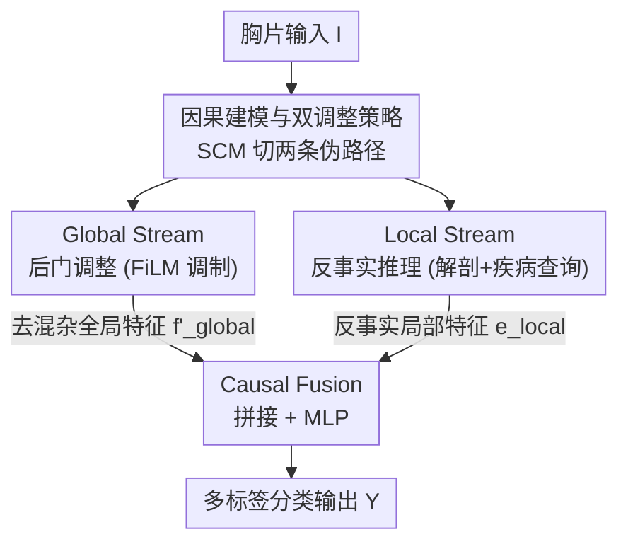

# DARC: Dual Adjustment Reasoning with Counterfactuals for Trustworthy Chest X-ray Classification

**会议**: CVPR 2026  
**论文**: [CVF Open Access](https://openaccess.thecvf.com/content/CVPR2026/html/Liao_DARC_Dual_Adjustment_Reasoning_with_Counterfactuals_for_Trustworthy_Chest_X-ray_CVPR_2026_paper.html)  
**代码**: 待确认  
**领域**: 医学图像  
**关键词**: 胸片分类, 因果推断, 反事实推理, 后门调整, 多标签分类  

## 一句话总结
DARC 把胸片多标签分类里的两类伪相关（非病理视觉混杂物的捷径学习、病理共现导致的特征纠缠）从因果机制上分开处理——用一条全局流做后门调整、一条局部流做反事实推理，再在 logit 层融合，使模型在分类性能、可解释性、鲁棒性上同时领先。

## 研究背景与动机
**领域现状**：胸片（CXR）多标签分类是 CNN/ViT 的传统强项，标准 benchmark 上 AUC 已经很高。但这些模型本质上是在拟合观测分布 $P(Y|I)$，最大化的是"图像像素和标签共同出现"的统计似然，并不关心图像生成背后的因果机制。

**现有痛点**：作者把胸片里的伪相关拆成两类。其一是**病理共现**：肺炎常伴胸腔积液、肺水肿常伴心脏肥大，模型于是把"心影增大"当成"胸腔积液"的证据，当目标病灶本身不典型时尤其严重，造成跨病种干扰。其二是**非病理视觉混杂物**：起搏器、导管、PICC、电极等医疗器械/术后残留物既改变了图像外观，又和某些疾病在统计上相关，模型把它们当成阳性证据走捷径，导致大量假阳性。一旦部署到真实临床、分布稍有漂移，这些非因果依赖就让性能崩塌。

**核心矛盾**：已有的因果方法有两个短板。处理非病理混杂物时，因为缺乏精确定义和像素级标注，只能对混杂变量 $Z'$ 做"均匀分布"之类的粗粒度假设，干预精度大打折扣；而在去耦策略上，现有因果模型一次只盯着一种混杂源，无法在统一框架里同时对付异质的两类混杂。

**本文目标**：在一个框架里同时阻断两条伪相关路径，并且把对非病理混杂物的建模做到像素级的精确。

**切入角度**：从 Pearl 因果阶梯出发——传统模型停在 Association 层，已有因果工作爬到 Intervention 层但只处理单一混杂，作者主张爬到最高的 Counterfactual 层做更细粒度的高阶推理。同时把 $Z'$ 重新定义为**可观测**变量（用分割模型就能拿到它的位置），从而让后门准则真正可用。

**核心 idea**：构造首个像素级非病理混杂物数据集 CheXconf，并设计"双调整"双流架构——对可观测的非病理混杂物用后门调整、对不可观测共因导致的病理共现用反事实推理，分而治之后再融合。

## 方法详解

### 整体框架
DARC 先把胸片分类放进一个结构因果模型（SCM）：目标病理 $X$、共现病理 $Z$、非病理混杂物 $Z'$、不可观测深层共因 $U$、图像特征 $F$、预测 $Y$。除了想要的因果通路 $X\to F\to Y$，还有两条伪路径要阻断——非病理后门路径 $X\leftarrow Z'\to F\to Y$ 和病理后门路径 $X\leftarrow U\to Z\to F\to Y$。目标不是最大化 $P(Y|X=x)$，而是估计总因果效应 $P(Y|do(X=x))$，需要同时切断这两条路。

由于两条路混杂物性质不同（$Z'$ 可观测、$U$ 不可观测），DARC 采用"分而治之"的双流设计：输入图像并行经过 **Global Stream**（对 $Z'$ 做后门调整，产出去混杂的全局特征 $\mathbf{f}'_{global}$）与 **Local Stream**（对 $Z$ 做反事实推理，产出表征直接效应的局部特征 $\mathbf{e}_{local}$），最后在 **Causal Fusion** 模块拼接两路特征、过 MLP 做非线性融合得到因果表征 $\mathbf{f}_{fused}$ 分类。整个流程单次前向完成，推理时仍然高效。

### 关键设计

**1. 因果建模与双调整策略：把"两类伪相关"翻译成"两条要切断的后门路径"**

这一步是全篇的纲领，针对的是"现有方法一次只处理一种混杂"的痛点。作者用一个 SCM 把胸片生成与预测过程显式画出来，并据此把任务从拟合 $P(Y|X=x)$ 改写成估计 $P(Y|do(X=x))$。关键观察是两条伪路径的本质不同：非病理混杂物 $Z'$（器械、电极等）的位置可以用分割模型直接观测到，于是满足后门准则、能用后门调整阻断；而病理共现源自不可观测的深层共因 $U$（如心衰同时导致积液和心脏肥大），无法直接干预，必须升到反事实层去估计目标病理 $X$ 的总直接效应（TDE）。"可观测就后门、不可观测就反事实"这个分工，正是双流架构的因果依据，也是它能同时去两类混杂、超过单一干预方法的原因。

**2. CheXconf：首个像素级非病理混杂物标注数据集，让后门调整真正落地**

后门准则要起效，前提是混杂变量 $Z'$ 可观测、可分层；以往工作因为没有细粒度标注，只能假设 $Z'$ 服从均匀分布，干预形同虚设。作者从 ChestX-ray14 随机取 10,000 张图，由两位放射科医生培训的标注员经两轮交叉复核，标出 **40,213 个实例、11 类**临床常见且严重干扰诊断的非病理视觉混杂物（mark、pacemaker、conduit、porta-cath、picc、electrode、cerclage-wire、clip、device、cvc、wearable），并对 10% 样本做放射科医生抽检、不合格批次整批返工。像素级轮廓而非粗框，使得 Global Stream 能为每一类混杂物拿到精确掩膜，把"对 $Z'$ 分层求和"从纸面公式变成可计算的模块。这是后门调整能精确化的物质基础。

**3. Global Stream — 后门调整：用 FiLM 把"已知混杂物"作为条件重标定全局特征**

按后门公式，当 $Z'$ 可观测时真因果效应可写成 $P(Y|do(X=x))=\sum_{z'}P(Y|X=x,Z'=z')P(Z'=z')$。Global Stream 用一条 **Identify–Embed–Modulate** 流水线把它实现在网络内部：先用在 CheXconf 上微调的分割模型（Confounder Segmentation, C.S.）生成逐类混杂物掩膜 $\mathbf{M}_{conf}$；把掩膜对齐到全局特征图后，对每一类做掩膜归一化加权池化 $\mathbf{h}_c=\sum_{h,w}\mathbf{F}_{map}\odot \tilde{\mathbf{M}}'_c$ 得到混杂物嵌入，再按各类出现概率 $p_{conf}$ 聚合成统一状态向量 $\mathbf{e}_{agg}=\sum_c p_{conf,c}\cdot\mathbf{E}_{conf}[c]$；最后把它送进 FiLM 层生成仿射参数，对原全局特征做 $\mathbf{f}'_{global}=(1+\gamma)\odot \mathbf{f}_{vec}+\beta$（Confounder Handler, C.H.）。这一步在"已知并已观测到的混杂物条件下"重标定特征、抑制捷径路径，等于把后门求和近似成一次特征调制，几乎不增加计算开销。

**4. Local Stream — 反事实推理：把"抹掉共现病灶后还剩多少证据"做成可计算的融合分数**

针对病理共现路径 $X\leftarrow U\to Z\to F\to Y$，作者估计目标病理的总直接效应 $\text{TDE}=P(Y=1|X=x,Z=z)-P(Y=1|X=x_0,Z=z)$，即"把 $X$ 假设性移除、$Z$ 仍在"时输出的变化。差值形式在网络优化里不稳定，作者在局部线性响应假设下（现代 CNN 的 ReLU/SiLU 在固定激活模式内对特征仿射，且反事实操作是局部的、$\|\Delta h\|$ 小）把它改写成单调等价的加性形式，最终得到可计算的去偏分数：

$$\text{Score}_p(y)\propto P(y|X=x,Z=z)+\lambda\cdot P(y|X=x,\text{do}(Z=z_0))$$

其中第一项保留原始观测信息，第二项是"在输入层把 $Z$ 的视觉特征抹掉后" $X$ 的纯净直接效应，$\lambda$ 调节因果修正强度。实现上走 **Locate–Decouple–Aggregate** 流水线：先用预训练解剖关键点检测器（A.L.D，定位双肺尖、肋膈角、肺门、心尖等区域）做动态解剖切块；再用疾病查询矩阵 $\mathbf{Q}_{disease}$ 通过 anatomic-causal attention（A.C.A.）从这些局部 patch 里筛出只含目标病理的视觉证据 $\mathbf{e}_k=\text{Attention}(q_k,\mathbf{M}_{local},\mathbf{M}_{local})$；最后聚合成局部因果表征。它在不改像素的前提下近似了"遮住共现病灶"的反事实干预，从而压制共现偏置。

### 损失函数 / 训练策略
总损失是三项加权和 $\mathcal{L}_{total}=w_1\mathcal{L}_{MLC}+w_2\mathcal{L}_{PC}+w_3\mathcal{L}_{Ortho}$：

- $\mathcal{L}_{MLC}$：主分类损失，用 Asymmetric Loss（ASL）应对类别不平衡，作用在最终预测 $z_{final}$ 上。
- $\mathcal{L}_{PC}$：因果一致性损失，用 KL 散度约束最终预测分布与 Local Stream 解耦预测分布一致 $D_{KL}(\sigma(z_{final})\|\sigma(\text{sg}[z_{local}]))$（局部流加 stop-gradient），把反事实直接效应当正则注入主分支。
- $\mathcal{L}_{Ortho}$：混杂物-疾病表征正交损失，对混杂物 $c$ 缺席（$m_{ic}=0$）的样本，约束混杂物嵌入 $\mathbf{e}_{conf,ic}$ 与所有疾病查询 $\mathbf{q}_{disease,k}$ 的余弦相似度平方期望最小，进一步强化后门调整、抑制非病理捷径。

骨干用 ImageNet 预训练的 ConvNeXt，AdamW 训练 50 epoch，初始学习率 $5\times10^{-5}$，余弦退火到 $5\times10^{-7}$，单卡 RTX 4090。

## 实验关键数据

### 主实验
在 ChestX-ray14（14 类）和 CheXpert（14 类病理观测）两个大规模公开 benchmark 上，统一协议对比架构创新派、近期 SOTA、因果推断派三类方法，主指标为 mAUC。

| 数据集 | 指标 | DARC | 之前最好对比方法 | 说明 |
|--------|------|------|------|------|
| ChestX-ray14 | mAUC | **0.857** | 0.849（CDCL，因果法） | 14 类平均 AUC 第一 |
| CheXpert | mAUC | **0.907** | 0.896（PTRN / CDCL） | 5 类病理上整体领先 |
| ChestX-ray14 | mAP / F1 | 0.326 / 0.428 | — | 多标签综合指标 |
| CheXpert | mAP / F1 | 0.427 / 0.594 | — | 多标签综合指标 |

DARC 尤其超过只能处理单一混杂的因果法（CDCL、Nie et al.），说明双调整对混杂的清除更彻底。

### 消融实验
| ID | Local(A.L.D.+A.C.A.) | Global(C.S.+C.H.) | mAUC | 说明 |
|----|------|------|------|------|
| S0 | - | - | 0.828 | 纯 ConvNeXt 基线 |
| S2 | ✓ | - | 0.835 | 仅局部流（反事实） |
| S4 | - | ✓ | 0.837 | 仅全局流（后门） |
| S1 | 去 A.L.D. | ✓ | 0.846 | 去解剖关键点，掉 1.1% |
| S3 | ✓ | 去 C.S. | 0.842 | 去精确混杂物分割，掉 1.5% |
| S5 | ✓ | ✓ | **0.857** | 完整 DARC |

### 关键发现
- 两条流单独都能涨点（S2、S4 相对 S0 各 +0.7%~0.9%），且角色互补；合起来（S5）显著优于任一单流，印证"单一干预不够、两类混杂要协同处理"。
- 去掉精确混杂物分割 C.S.（S3）掉 1.5%、去掉解剖关键点 A.L.D.（S1）掉 1.1%——**细粒度混杂物建模比解剖先验更关键**，正好佐证 CheXconf 像素级标注的价值。
- 可解释性：Grad-CAM 显示 DARC 把注意力锁在真实病灶（如气胸线、弥漫结节全覆盖），基线却被手术固定物、电极片等误当病理；鲁棒性上，针对"起搏器→心脏肥大"的混杂攻击实验，基线把 TP 与叠加起搏器的干净阴性样本（CN）特征纠缠，DARC 的特征流形则与混杂物解耦。
- 共现偏置：用 cTPR/cFPR 在 8 对高频共现病种上评估，DARC 一致地更高 cTPR（不漏诊真病灶）、更低 cFPR（不因强相关而"幻觉"出共现病），证明它真的削弱了对共现统计的依赖。

## 亮点与洞察
- **"可观测就后门、不可观测就反事实"的分工很干净**：把两类伪相关对应到 SCM 的两条具体路径，再按混杂物是否可观测选不同因果工具，避免了"一个干预模型硬套所有混杂"的尴尬，这套拆法可迁移到任何存在异质混杂的医学/视觉分类任务。
- **把反事实差值改写成加性融合分数**很实用：$\text{Score}_p=P(y|x,z)+\lambda P(y|x,do(z_0))$ 在局部线性响应假设下与 TDE 单调等价，规避了差值形式训练不稳的问题，等于把高阶反事实推理降维成一个可端到端学的 logit 融合。
- **后门调整用 FiLM 实现**是巧思：不用真去枚举 $\sum_{z'}$，而是把逐类混杂物嵌入聚合成条件向量、生成仿射参数重标定特征，几乎零额外推理开销就完成了"在已知混杂条件下重算特征"。
- **数据集即贡献**：CheXconf 是首个像素级非病理混杂物标注集（11 类 4 万实例），它把"$Z'$ 不可观测"这个长期假设直接打破，是后门调整能精确化的根。

## 局限与展望
- 反事实改写依赖**局部线性响应假设**（固定激活模式内特征仿射、$\|\Delta h\|$ 小），完整证明放在补充材料；当反事实扰动较大或激活模式频繁切换时，一阶近似的误差界 $\tfrac{L}{2}\|\Delta h\|^2$ 可能变松，作者未在正文给出失效边界。⚠️ 公式细节以原文/补充材料为准。
- CheXconf 仅基于 ChestX-ray14 的 1 万张图、11 类混杂物，跨数据源（不同设备/医院）的混杂物覆盖度和泛化未充分验证；Global Stream 的效果直接受限于分割模型在新分布上的精度。
- 鲁棒性评测里的"混杂攻击"是把起搏器**人工合成叠加**到阴性样本（CN 组），与真实临床中混杂物和解剖结构自然耦合的情形有差距，结论需谨慎外推。
- 方法引入分割、关键点检测、双流注意力等多个子模块，训练管线偏重；论文未报告相对单 backbone 基线的训练/标注成本。

## 相关工作与启发
- **vs 后门干预类因果法（Nie et al. [28]、[3]）**：他们也用后门准则处理非病理混杂物，但因缺像素级标注只能假设 $Z'$ 均匀分布；DARC 靠 CheXconf 把 $Z'$ 变成可观测、可分层，干预精度更高，且只是 DARC 的一条流。
- **vs 反事实/共现去耦类（CDCL [19] 等）**：这类方法用反事实样本或逻辑调整隔离单一病理的因果效应，但一次只对付一种混杂；DARC 把反事实推理只用在病理共现这条路，另起后门流处理非病理混杂，统一框架内异质混杂同时去除，两 benchmark 上 mAUC 均超过它们。
- **vs 解剖感知模型（[1,17]）**：它们用解剖结构引导注意力到正确诊断区域，但难处理图像内的混杂干扰；DARC 把解剖先验（A.L.D + anatomic-causal attention）嵌进局部反事实流，既保留解剖引导又显式做因果去偏。

## 评分
- 新颖性: ⭐⭐⭐⭐⭐ 首个从因果机制同时去耦两类胸片伪相关，并给出首个像素级非病理混杂物数据集，分工与改写都很扎实。
- 实验充分度: ⭐⭐⭐⭐ 两 benchmark + 消融 + Grad-CAM + cTPR/cFPR + 混杂攻击多角度验证，但混杂攻击用合成叠加、跨域泛化未测。
- 写作质量: ⭐⭐⭐⭐ 因果建模到实现的链条清晰，公式与算法配合到位；部分关键证明外放补充材料。
- 价值: ⭐⭐⭐⭐⭐ 可信医学影像分类的代表性工作，数据集 + 双调整框架对临床部署的鲁棒性有实际意义。

<!-- RELATED:START -->

## 相关论文

- [\[AAAI 2026\] A Disease-Aware Dual-Stage Framework for Chest X-ray Report Generation](../../AAAI2026/medical_imaging/a_disease-aware_dual-stage_framework_for_chest_x-ray_report_.md)
- [\[CVPR 2026\] Phrase-grounded APO for Improving Chest X-ray Report Generation](phrase-grounded_apo_for_improving_chest_x-ray_report_generation.md)
- [\[CVPR 2026\] Dual-Level Hypergraph Generation for Addressing Feature Scarcity in Whole-Slide Image Classification](dual-level_hypergraph_generation_for_addressing_feature_scarcity_in_whole-slide_.md)
- [\[CVPR 2026\] Clinically-Grounded Counterfactual Reasoning for Medical Video Diagnosis](clinically-grounded_counterfactual_reasoning_for_medical_video_diagnosis.md)
- [\[ICML 2026\] PaCX-MAE: Physiology-Augmented Chest X-Ray Masked Autoencoder](../../ICML2026/medical_imaging/pacx-mae_physiology-augmented_chest_x-ray_masked_autoencoder.md)

<!-- RELATED:END -->
