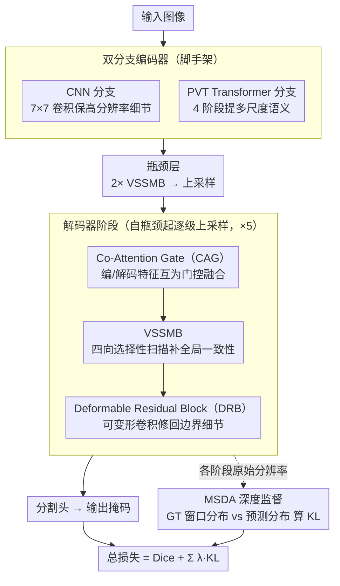

# Decoding Matters: Efficient Mamba-Based Decoder with Distribution-Aware Deep Supervision for Medical Image Segmentation

**会议**: CVPR 2026  
**arXiv**: [2603.12547](https://arxiv.org/abs/2603.12547)  
**代码**: 待发布（接收后公开）  
**领域**: 医学图像  
**关键词**: 医学图像分割, Mamba, 解码器设计, 深度监督, KL散度

## 一句话总结

提出 Deco-Mamba，一种以解码器为中心的 Transformer-CNN-Mamba 混合架构，通过 Co-Attention Gate、视觉状态空间模块（VSSM）和可变形卷积增强解码过程，同时引入基于窗口化 KL 散度的分布感知深度监督策略，在 7 个医学图像分割基准上取得 SOTA。

## 研究背景与动机

现有医学图像分割方法（U-Net、TransUNet、Mamba-UNet 等）的一个共性问题是**过度关注编码器设计而忽视解码器**：

- CNN 编码器（U-Net 系列）：局部感受野限制长程依赖建模。
- Transformer 编码器（TransUNet、Swin-UNet）：自注意力 $O(n^2)$ 复杂度，高分辨率不可扩展。
- Mamba 编码器（U-Mamba、Swin-UMamba）：线性复杂度，但多数方法只在编码器引入 Mamba，解码器仍然简单。

核心矛盾：**强大的编码器提取了丰富的语义表示，但如果解码器设计不足，就无法在上采样过程中准确恢复物体边界和上下文结构**。现有方法要么用级联解码器导致参数暴增（如 Cascaded-MERIT, 148M 参数），要么解码器过于轻量丢失细节。

另一个问题：传统深度监督在低分辨率中间层需要 resize 到全分辨率再和 GT 计算损失，这个过程本身就损失了结构信息。

Deco-Mamba 的切入：(1) 将 Mamba 引入解码器而非编码器；(2) 设计分布感知的深度监督，直接在各解码层的原始分辨率计算 KL 散度。

## 方法详解

### 整体框架

Deco-Mamba 想回答一个被忽视的问题：当编码器已经足够强，瓶颈到底卡在解码端的哪一步。它保留 U-Net 的对称形状，但把重心整体下移到解码路径。编码侧是一个双分支结构——CNN 分支（7×7 卷积）负责保留高分辨率空间细节，PVT Transformer 分支（4 阶段）负责提取多尺度语义；两路特征送进解码器。解码器一共 6 个阶段，每个阶段把上一阶段的特征依次过三道工序：先用 Co-Attention Gate 把编码器跳连特征和解码器特征对齐融合，再用 VSSMB 在线性复杂度下补回全局语义一致性，最后用 Deformable Residual Block 把被平滑掉的边界细节修回来。训练时不只在最终输出算损失，而是让每个解码阶段都直接在自己的原始分辨率上接受一次分布层面的监督（MSDA）。

### 关键设计

**1. Co-Attention Gate（CAG，共注意力门控）：让编码器和解码器特征互相当门控**

跳连融合是 U-Net 的老问题。传统 Attention Gate 把信息流当成单向的——只拿解码器特征 $D_{i+1}$ 当门控信号去高亮编码器特征 $X_i$，默认编码器特征才是需要被筛选的那一方。但解码器特征在上采样过程中同样混入了噪声，凭什么它就不需要被筛？CAG 把这层不对称去掉，让两路特征**互为门控**：一路以 $D_{i+1}$ 为门控信号挑 $X_i$ 的空间显著区域，另一路反过来以 $X_i$ 为门控信号挑 $D_{i+1}$，两路注意力输出拼接后再过一道通道注意力（CA）做精炼，

$$D_i' = \mathrm{CA}\big[\mathrm{AG}(x{=}X_i,\, g{=}D_{i+1}),\ \mathrm{AG}(x{=}D_{i+1},\, g{=}X_i)\big]$$

这样空间显著性和通道关系都被显式建模，融合不再偏向某一方。消融里 CAG 稳定优于单向的 AG、LGAG 和通道-空间串联的 CBAM，印证了双向门控确实补到了单向漏掉的信息。

**2. Vision State Space Mamba Block（VSSMB，视觉状态空间模块）：把 Mamba 搬进解码器补全局一致性**

逐层上采样的过程很容易让语义跑偏——局部插值出来的细节未必和整体一致。要补全局依赖，自注意力是常规选择，但它的 $O(n^2)$ 复杂度在高分辨率解码层根本扛不住。VSSMB 改用状态空间模型（Mamba 的选择性扫描），沿水平、垂直及它们的逆方向四路扫描传播上下文，以线性复杂度把长程依赖建进特征里。放置策略也按需分配：瓶颈层语义最抽象、分辨率最低，放 2 个 VSSMB；中间各层各放 1 个；最后一层是全分辨率，此时卷积比 SSM 更合适，就不再放。这样既补回了全局一致性，又没在最该省算力的地方浪费。

**3. Deformable Residual Block（DRB，可变形残差块）：把被全局平滑掉的边界修回来**

VSSMB 擅长拉通全局，但代价是局部细节容易被抹平，器官边界这种高频结构首当其冲。DRB 紧跟在每个 VSSMB 之后做"局部修正"：它并联一条标准 3×3 卷积和一条可变形卷积，可变形卷积会为每个像素预测采样偏移量和调制掩码，让卷积核的采样位置自适应地贴合几何形变，而不是死板地落在规则网格上。残差连接保证它只在原特征上叠加边界级的修正。全局靠 VSSMB、局部靠 DRB，两者一前一后形成"先拉通再收边"的分工。

**4. Multi-Scale Distribution-Aware（MSDA）深度监督：不 resize，直接在原分辨率比分布**

传统深度监督有个隐蔽的缺陷：中间层预测分辨率低，要和 GT 算 Dice/CE 损失就得先把它 resize 到全分辨率，而 resize 这一步本身就抹掉了结构信息，监督信号反被污染。MSDA 反其道而行——不动预测，而是把 GT 降到和预测同分辨率：各解码层输出经一个 distribution head 映射到类别维度得到预测分布 $Q^{(s)}$，GT 则通过局部窗口平均统计出同分辨率的类别分布 $\tilde{P}^{(s)}$（一个窗口里各类别像素占比），两者直接算 KL 散度对齐，

$$\mathcal{L}_{\text{KL}}^{(s)} = \sum_{b,h,w}\sum_c \tilde{P}_{b,c,h,w}^{(s)} \log\frac{\tilde{P}_{b,c,h,w}^{(s)}}{Q_{b,c,h,w}^{(s)}}$$

低分辨率层学的本就该是"这片区域大致是什么类别"的分布，用窗口分布去监督它比强行对齐逐像素标签更合理。为进一步盯住最难分的类别交界处，再加一个边界权重 $W_{h,w}^{(s)} = (1 - \max_n \tilde{P}_{h,w,n}^{(s)})^\alpha$——某个位置窗口内类别越混杂（最大占比越低），说明越靠近边界，权重就越大。消融里 MSDA 优于"只用 Dice"和"Dice + 传统深度监督"，后者的 HD95 甚至因 resize 反而变差，正好佐证了 resize 是元凶。

### 损失函数 / 训练策略

$$\mathcal{L}_{\text{total}} = \mathcal{L}_{\text{dice}} + \sum_{s=1}^S \lambda_s \mathcal{L}_{\text{dist}}^{(s)}$$

Dice 损失保证最终预测的空间重叠，MSDA 的 KL 散度损失在各解码阶段提供分布一致性监督。AdamW + 余弦学习率，224×224 输入，A5000 GPU。

## 实验关键数据

### 主实验

**Synapse（8 类腹部多器官 CT）**

| 方法 | DSC↑ | HD95↓ | 参数(M) | FLOPs(G) |
|------|------|-------|---------|----------|
| Cascaded-MERIT | 83.59 | 15.99 | 147.86 | 33.31 |
| PAG-TransYnet | 83.43 | 15.82 | 144.22 | 33.65 |
| **Deco-Mamba-V1** | **85.07** | **14.72** | 46.93 | 17.24 |
| Deco-Mamba-V0 | 83.16 | 15.89 | **9.67** | **9.73** |

**跨数据集泛化（7 个基准）**

| 数据集 | Deco-Mamba-V1 | 次优方法 | 提升 |
|--------|---------------|----------|------|
| Synapse | **85.07** | 83.59 (Cascaded-MERIT) | +1.48 |
| BTCV(13类) | **78.45** | 75.87 (PAG-TransYnet) | +2.58 |
| ACDC | **92.35** | 92.12 (PVT-EMCAD-B2) | +0.23 |
| ISIC17 | **86.01** | 85.67 (Cascaded-MERIT) | +0.34 |
| GlaS | **96.91** | 96.91 (Cascaded-MERIT) | 持平 |
| MoNuSeg | **85.14** | 83.41 (Deco-Mamba-V0) | +1.73 |

### 消融实验

| 配置 | DSC↑ | HD95↓ | 说明 |
|------|------|-------|------|
| w/o CNN 编码器分支 | 84.07 | 18.92 | 丢失高分辨率空间细节 |
| w/o VSSMB | 83.51 | 15.96 | 长程依赖建模缺失 |
| 用 AG 替换 CAG | 82.98 | 15.69 | 单向注意力不够 |
| 用标准卷积替换可变形卷积 | 84.53 | 16.18 | 边界自适应性下降 |
| 只用 Dice (无 MSDA) | 83.84 | 14.94 | 缺少多尺度分布约束 |
| Dice + 传统深度监督 | 84.24 | 15.89 | resize 反而增加 HD95 |
| **Deco-Mamba (full)** | **85.07** | **14.72** | — |

### 关键发现

- 以解码器为中心的设计确实有效：用同样的 PVT-B0 backbone，Deco-Mamba 比 Swin-UNet 高 5.58% DSC。
- Deco-Mamba-V0（9.67M 参数）性能超过大多数 100M+ 的方法，验证了"解码器比编码器更重要"的论点。
- MSDA 深度监督优于传统深度监督和边界损失，因为避免了 resize 导致的信息损失。

## 亮点与洞察

- "解码器为中心"的设计哲学值得关注：不追求更大的预训练编码器，而是在解码端精心设计。
- MSDA 的窗口化 KL 散度是一个优雅的解决方案：不需要 resize GT，而是对 GT 做局部窗口统计来匹配低分辨率预测。
- Mamba 在解码器中的应用比在编码器中更有效，因为解码器需要在上采样过程中保持全局一致性。

## 局限与展望

- 仅支持 2D 分割，3D 医学图像（如 CT/MRI 体数据）的扩展未被探讨。
- 7 个数据集虽多但都是常用基准，没有在更新或更难的数据集上验证。
- Window size 和 $\lambda_s$ 的选择对 MSDA 性能的敏感性未详细分析。
- 代码尚未公开。

## 相关工作与启发

- 与 EMCAD（EMCAD-B2）的对比：EMCAD 也注重解码器但用轻量卷积块+传统深度监督，Deco-Mamba 用 Mamba+分布感知监督更进一步。
- 与 Swin-UMamba 的对比：后者在编码器引入 Mamba，本文在解码器引入，两者互补的思路可以结合。
- MSDA 的窗口化分布思路可以推广到其他密集预测任务的深度监督中。

## 评分

- **新颖性**: ⭐⭐⭐⭐ 解码器Mamba+分布感知深度监督两个创新点搭配合理
- **实验充分度**: ⭐⭐⭐⭐⭐ 7 个数据集，完整消融，backbone 对比，效率分析
- **写作质量**: ⭐⭐⭐⭐ 结构清晰，模块解释充分
- **价值**: ⭐⭐⭐⭐ 以解码器为中心的思路对社区有启发，MSDA 可推广

<!-- RELATED:START -->

## 相关论文

- [\[CVPR 2026\] BiCLIP: Bidirectional and Consistent Language-Image Processing for Robust Medical Image Segmentation](biclip_bidirectional_and_consistent_language-image_processing_for_robust_medical.md)
- [\[CVPR 2026\] From Adaptation to Generalization: Adaptive Visual Prompting for Medical Image Segmentation](apex_adaptive_visual_prompting.md)
- [\[CVPR 2026\] T-Gated Adapter: A Lightweight Temporal Adapter for Vision-Language Medical Segmentation](t-gated_adapter_a_lightweight_temporal_adapter_for_vision-language_medical_segme.md)
- [\[CVPR 2026\] Semantic Class Distribution Learning for Debiasing Semi-Supervised Medical Image Segmentation](semantic_class_distribution_learning_for_debiasing.md)
- [\[AAAI 2026\] Decoding with Structured Awareness: Integrating Directional, Frequency-Spatial, and Structural Attention for Medical Image Segmentation](../../AAAI2026/medical_imaging/decoding_with_structured_awareness_integrating_directional_frequency-spatial_and.md)

<!-- RELATED:END -->
