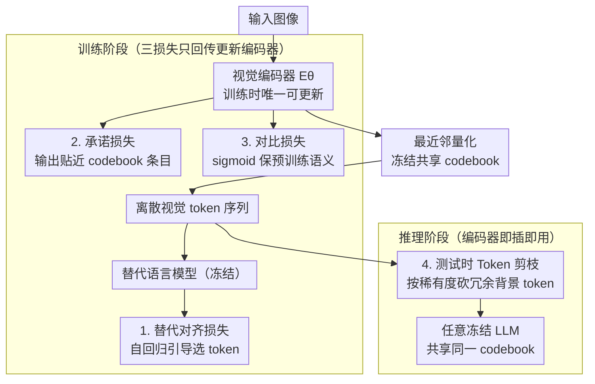

# Decoupling Vision and Language: Codebook Anchored Visual Adaptation

**会议**: CVPR2026  
**arXiv**: [2602.19449](https://arxiv.org/abs/2602.19449)  
**代码**: 待确认  
**领域**: 医学图像 / 视觉语言模型  
**关键词**: 离散视觉token, codebook, 视觉编码器适配, 领域迁移, token剪枝, LVLM

## 一句话总结

提出 CRAFT，通过离散 codebook 将视觉编码器与语言模型解耦，仅微调视觉编码器即可实现领域适配，且适配后的编码器可跨 LLM 架构无缝复用，在 10 个领域基准上平均提升 13.51%。

## 背景与动机

1. 大型视觉语言模型（LVLM）的视觉编码器在医学图像、细粒度分类等长尾领域表现不佳，编码器的感知错误会级联传导至语言模型，导致错误推理
2. 现有适配方法通常修改编码器与 LLM 之间的连续特征接口（投影层调优 / LoRA），二者仍然耦合——每当编码器或 LLM 更换时必须重新对齐
3. 同时微调视觉编码器和 LLM 代价高昂且容易遗忘指令跟随能力；领域数据稀缺使问题更加突出
4. 仅微调编码器又不够：一旦特征分布偏移，冻结的 LLM 无法正确解读新的视觉嵌入
5. 近期离散化 LVLM（VILA-U、Janus 等）展示了离散视觉 token 与连续方案相当甚至更优的性能，提供了一种天然的"共享语言"接口
6. 核心问题：**能否在不触碰原始 LLM 的前提下完成 LVLM 的领域适配？**

## 方法详解

### 整体框架

CRAFT（Codebook RegulAted Fine-Tuning）要回答一个很实际的问题：能不能在完全不动原始 LLM 的前提下，给视觉语言模型做领域适配。它在离散 LVLM 上工作——视觉编码器 $E_\theta$ 输出连续特征后，通过一个**冻结的共享 codebook** $\mathcal{C}=\{c_k\}_{k=1}^K$ 做最近邻量化得到离散 token 序列，再经投影器送入 LLM。整个训练只更新视觉编码器一处，codebook 和 LLM 全程冻结。正因为接口是离散 codebook 而非连续特征，适配后的编码器才能即插即用到任何共享同一 codebook 的 LLM 上。

整套流程分训练、推理两段：**训练时**借助一个冻结的**替代语言模型**和三个损失（替代对齐 / 承诺 / 对比）把领域知识注入编码器；**推理时**再用**测试时 token 剪枝**压缩冗余 token，把适配好的编码器接到任意共享同一 codebook 的冻结 LLM 上。

### 关键设计

**1. 替代对齐损失（Surrogate Alignment Loss, $\mathcal{L}_{\text{SAL}}$）：用一个小模型当老师引导选 token**

编码器要学会挑出对领域任务有用的 codebook token，但又不能动真正的推理 LLM。办法是请一个可以很小的替代语言模型 $\mathcal{M}$ 对图文联合序列做自回归预测，梯度回传到视觉编码器，从而引导它的离散 token 选择。这样领域知识注入了编码器，推理端的大 LLM 却毫发无损。

**2. 承诺损失（Commitment Loss, $\mathcal{L}_{\text{commit}}$）：把编码器输出摁在 codebook 附近**

codebook 始终冻结，如果编码器输出漂得太远，最近邻量化就会严重失真。承诺损失约束编码器输出靠近所分配的 codebook 条目，只约束编码器端、不动 codebook。消融显示它最为关键——去掉后均值直接从 64% 崩到 14%。

**3. 对比损失（Contrastive Loss, $\mathcal{L}_{\text{con}}$）：保住预训练的语义结构**

适配领域的同时不能把原有语义结构训坏。这里用图像描述与标签扩展文本，通过 sigmoid 对比学习维持预训练语义结构。它对分类任务贡献尤其大（而 SAL 对推理任务贡献更大）。量化的不可导问题用 **straight-through estimator** 处理。

**4. 测试时 Token 剪枝：按稀有度无训练地砍冗余 token**

推理时大量背景 token 是冗余的。先统计训练集上各 codebook 条目的全局频率 $p_{\text{dom}}(k)$，定义稀有权重 $\rho_k = 1/p_{\text{dom}}(k)$，高频背景 token 被大幅剪枝、保留信息量高的稀有 token；条目内再优先保留量化残差大（难量化、信息丰富）及空间孤立的 token，以鼓励空间覆盖多样性。通过一维搜索 $\gamma$ 控制保留比例 $M/N$，默认 keep ratio = 0.8。各组件逐步消融可见收益：随机选择 62.10% → 稀有度加权 63.55% → 加残差排序 63.86% → 加空间隔离 64.05%；把频率统计从领域数据换成 ImageNet-1K 仅降 0.04%（64.01%），说明剪枝策略对参考语料库鲁棒。

### 损失函数 / 训练策略

总损失为三项加权：

$$\mathcal{L}_{\text{CRAFT}} = \lambda_{\text{con}}\mathcal{L}_{\text{con}} + \lambda_{\text{commit}}\mathcal{L}_{\text{commit}} + \mathcal{L}_{\text{SAL}}$$

其中 VQA 任务 $\lambda_{\text{con}}=0.1$、分类任务 $\lambda_{\text{con}}=1.0$，$\lambda_{\text{commit}}=0.1$。

## 实验关键数据

### 主实验（Table 1，10 个基准，精确匹配准确率 %）

| 方法 | 视觉token | PlantVillage | VQARAD | EuroSAT | Cars | Dogs | 10项均值 |
|---|---|---|---|---|---|---|---|
| Zero-shot VILA-U-7B | 离散 | 43.83 | 35.67 | 69.15 | 72.50 | 82.40 | 55.07 |
| Zero-shot VILA-7B | 连续 | 47.20 | 41.67 | 79.48 | 76.30 | 78.33 | 59.89 |
| Vision FT (连续) | 连续 | 62.13 | 43.67 | 67.35 | 86.80 | 71.43 | 61.76 |
| **CRAFT (7B surr.)** | **离散** | **77.27** | **45.67** | **77.80** | **92.74** | **84.77** | **68.58** |

CRAFT 以 VILA-U-7B 为替代模型时达到最优：**平均 68.58%，比 zero-shot 提升 +13.51%**，比最强连续基线高 +6.82%。

### 推理质量保持（Table 2，VQARAD 数据集）

| 方法 | 正确率 | 解释存在率 | 相关性 | 忠实度 | Overall |
|---|---|---|---|---|---|
| VILA-LLM-LoRA | 44.65 | 6.34 | 0.26 | 0.25 | -0.98 |
| Projector FT | 44.89 | 4.01 | 0.28 | 0.22 | -0.61 |
| **CRAFT** | **47.34** | **75.98** | **2.95** | **1.99** | **3.21** |

连续微调方法严重丧失指令跟随与解释能力（Presence 低至 4–6%），CRAFT 保持 76% 的解释生成率。

### 消融实验（Table 5，VILA-U-7B backbone）

| 设置 | VQARAD | Dogs | PlantVillage | IconQA | 均值 |
|---|---|---|---|---|---|
| 去掉 $\mathcal{L}_{\text{commit}}$ | 10.33 | 16.53 | 25.97 | 3.31 | 14.04 |
| 去掉 $\mathcal{L}_{\text{SAL}}$ | 37.87 | 83.66 | 75.03 | 15.49 | 53.01 |
| 去掉 $\mathcal{L}_{\text{con}}$ | 45.13 | 71.57 | 45.69 | 47.24 | 52.41 |
| **完整 CRAFT** | **45.67** | **84.77** | **77.27** | **48.50** | **64.05** |

承诺损失最为关键——去掉后性能崩溃至 14%；SAL 对推理任务贡献大，对比损失对分类任务贡献大。

### 跨 LLM 迁移（Table 3）

编码器用 Qwen2-0.5B 训练后直接搭配 Qwen2.5-3B 推理：均值从 46.74% → 59.98%（+13.24%）；搭配 Qwen2-1.5B：49.06% → 63.25%（+14.19%）。用 VILA-U-7B 训练的编码器迁移至 Qwen2-1.5B 同样有效（+14.56%），验证了 codebook 级别的模块化可行性。

### 效率（Table 4）

- 使用 Qwen2-0.5B 作为替代模型：显存仅 10.7 GiB（降低 61.6%），训练时间 1.35 min（降低 73.5%）
- 推理端 keep ratio=0.8 时 FLOPs 降低 16%，延迟降低 7%

## 亮点

- **视觉-语言真正解耦**：适配后的编码器可即插即用到任何共享同一 codebook 的 LLM（Table 3 验证了 5 个不同架构/规模的推理 backbone），这是连续方案无法实现的
- **零 LLM 遗忘**：LLM 完全冻结，不需要额外指令数据防遗忘，保持完整解释与推理能力；在 VQARAD 上解释存在率 76% vs LoRA 的 6%
- **极轻量训练**：替代模型可以很小（0.5B），仅训视觉编码器，8 卡 A100 训练仅需数分钟；显存低至 10.7 GiB
- **测试时 token 剪枝**：基于频率稀有度的无训练剪枝方案，进一步提升效率和鲁棒性；keep ratio 0.6 以上性能稳定
- **离散 token 的新优势论证**：首次系统证明离散视觉 token 支持模块化、可迁移的视觉适配，为离散 LVLM 开辟新应用场景

## 局限与展望

- 依赖于预训练好的离散 codebook（VILA-U 的 16384 条目），codebook 质量和规模是性能上限；Table 6 显示 codebook 缩小到 10% 时均值从 76.71% 降至 32.28%
- 当替代模型能力远弱于推理 backbone 时，部分细粒度任务（Flowers、Dogs）反而会退化——0.5B 替代模型使 Flowers 从 75.80% 降至 72.31%
- 当前 codebook 假定固定不变，未来 codebook 扩展或合并时的向后兼容性尚不明确（作者在 Future Work 中提出此开放问题）
- 仅在分类和 VQA 任务上验证，缺乏开放式生成、目标检测、图像分割等更多任务形态的评估
- 对比损失依赖额外的描述模型生成 caption，增加了数据准备复杂度
- 离散化本身存在信息损失，对需要像素级精度的任务（如分割、检测）可能不适用

## 与相关工作的对比

- **Projector FT / Vision FT**：仍在连续空间操作，编码器变化后需重新对齐 LLM；CRAFT 通过离散 codebook 天然隔离，编码器迁移零成本
- **LLM LoRA**：虽然准确率可提升，但严重破坏指令跟随能力（解释存在率低至 ~2%），CRAFT 完全避免此问题，因为 LLM 全程冻结
- **LDIFS (Mukhoti et al.)**：用 $\ell_2$ 正则化防止 CLIP 特征漂移，但仍在连续空间操作；CRAFT 的 commitment loss 在离散空间实现类似目标且更稳定
- **离散 LVLM (VILA-U, Janus)**：CRAFT 首次利用离散 codebook 做领域适配而非生成任务，揭示了离散化在模块化和可迁移性方面的独特优势
- **多编码器方案 (InternVL 等)**：通过叠加额外视觉编码器提升通用性能；CRAFT 则通过微调单一编码器实现领域增强，更轻量且不增加推理参数

## 评分

- 新颖性: ⭐⭐⭐⭐ — 离散 codebook 做视觉-语言解耦适配的思路新颖，视觉编码器跨 LLM 迁移很有吸引力
- 实验充分度: ⭐⭐⭐⭐ — 10 个基准 × 5 个 backbone 的组合评测充分，消融完整，推理质量评测有说服力
- 写作质量: ⭐⭐⭐⭐ — 问题定义清晰，Figure 1/2 直观对比连续 vs 离散方案，实验组织合理
- 价值: ⭐⭐⭐⭐ — 对医学等资源受限领域的 LVLM 适配具有实用意义，解耦设计降低部署与维护成本

<!-- RELATED:START -->

## 相关论文

- [\[CVPR 2026\] MedCLIPSeg: Probabilistic Vision-Language Adaptation for Data-Efficient and Generalizable Medical Image Segmentation](medclipseg_probabilistic_vision-language_adaptation_for_data-efficient_and_gener.md)
- [\[CVPR 2026\] From Adaptation to Generalization: Adaptive Visual Prompting for Medical Image Segmentation](apex_adaptive_visual_prompting.md)
- [\[CVPR 2026\] Tell2Adapt: A Unified Framework for Source Free Unsupervised Domain Adaptation via Vision Foundation Model](tell2adapt_a_unified_framework_for_source_free_unsupervised_domain_adaptation_vi.md)
- [\[CVPR 2026\] MedKCO: Medical Vision-Language Pretraining via Knowledge-Driven Cognitive Orchestration](medkco_medical_vision-language_pretraining_via_knowledge-driven_cognitive_orches.md)
- [\[CVPR 2026\] T-Gated Adapter: A Lightweight Temporal Adapter for Vision-Language Medical Segmentation](t-gated_adapter_a_lightweight_temporal_adapter_for_vision-language_medical_segme.md)

<!-- RELATED:END -->
