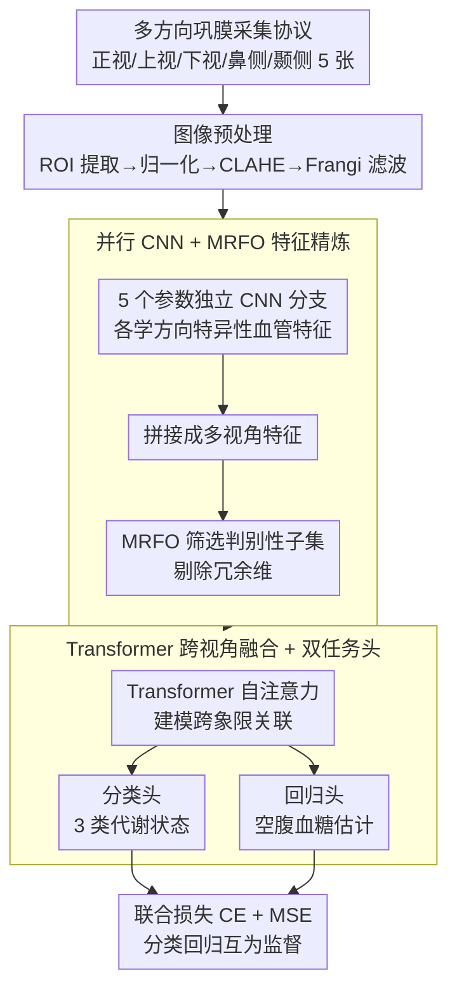

# Deep Learning–Based Estimation of Blood Glucose Levels from Multidirectional Scleral Blood Vessel Imaging

**会议**: CVPR 2026  
**arXiv**: [2603.12715](https://arxiv.org/abs/2603.12715)  
**代码**: 无  
**领域**: 医学图像  
**关键词**: 血糖估计, 巩膜血管成像, 多视角学习, MRFO, Transformer  

## 一句话总结

提出ScleraGluNet，通过5个注视方向的巩膜血管照片，用并行CNN提取方向特异性血管特征，再经MRFO特征筛选和Transformer跨视角融合，同时完成三类代谢状态分类（93.8%准确率）和空腹血糖连续估计（MAE=6.42 mg/dL, r=0.983）。

## 研究背景与动机

**糖尿病监测的痛点**：全球5.37亿糖尿病患者需要频繁监测血糖。实验室检测（FPG、HbA1c）准确但需抽血，不便于日常自测；指尖采血有痛感和感染风险，依从性差；CGM虽然方便但需皮下传感器植入，成本较高。非侵入式血糖监测具有重大临床需求。

**巩膜血管是天然的代谢窗口**：慢性高血糖会导致微血管重构——直径改变、迂曲度增加、灌注异常。相比视网膜成像需要专业眼底相机，**巩膜/结膜血管成像只需普通前段相机**即可完成，设备成本低、操作简单，适合远程医疗和大规模筛查。已有OCTA研究证实了巩膜微血管与糖尿病的关联。

**现有方法的不足**：（1）仅使用单一视角拍摄，但糖尿病引起的微血管改变在空间上是异质的——上方、下方、鼻侧、颞侧巩膜的血管异常程度不同，单视角会遗漏关键信息；（2）没有充分利用多视角特征间的互补关系。本文的核心思路是**多方向采集覆盖全巩膜+多视角深度融合架构**。

## 方法详解

### 整体框架

ScleraGluNet 要解决的是：只用一台普通前段相机、不抽血，就把人的代谢状态判出来、空腹血糖估出来。它的做法是把"一只眼睛"拆成五个视角看。每位受试者按正视、上视、下视、鼻侧、颞侧五个注视方向各拍一张巩膜照片，先做统一的图像预处理（ROI 提取 → 颜色/亮度归一化 → CLAHE 对比度增强 → Frangi 滤波突出管状血管），再分给五个参数独立的 CNN 分支各自提特征；五路特征拼起来后先用 MRFO 算法筛掉冗余维度，剩下的判别性特征送进 Transformer 做跨视角自注意力融合，最后分出两个头——一个 softmax 分类头判三类代谢状态，一个回归头吐出连续的空腹血糖值。

### 关键设计

**1. 多方向巩膜采集协议：用五个注视方向覆盖空间上不均匀的血管病变**

糖尿病引起的微血管重构（口径改变、迂曲度增加、灌注异常）在巩膜上不是均匀铺开的——上方、下方、鼻侧、颞侧四个象限的异常程度各不相同，单视角拍一张必然漏掉一部分关键信号。所以这套协议要求每位参与者按固定的五个注视方向各拍一张：正视提供中央参考区域，上视/下视/左视/右视分别把下方/上方/颞侧/鼻侧巩膜转到镜头前，全巩膜各象限都被覆盖到。445 名参与者最终产生 445×5=2225 张照片。消融实验里多视角显著优于单视角，正是这个空间异质性假设的直接验证。

**2. 并行 CNN + MRFO 特征精炼：先按方向各学各的，再筛掉拼接带来的冗余**

五个方向的血管形态本身就不同，用一套共享参数去套所有方向会把方向特异性的差异抹平，因此这里用五个架构相同、参数各自独立的 CNN 分支，让每个分支专门学自己那个方向的口径变化、迂曲度、分支复杂度。但五路特征直接拼起来会得到一个维度很高、冗余很重的向量——很多维在不同视角间重复、稀释了真正的判别信号。MRFO（Manta Ray Foraging Optimization，蝠鲼觅食优化）是一种生物启发的搜索算法，在这个拼接特征空间里自动搜出与血糖状态最相关的特征子集，把冗余维剔掉。消融表显示，在直接拼接的基础上加 MRFO 后分类和回归都进一步变好，说明去冗余这一步确实有用。

**3. Transformer 跨视角融合 + 双任务头：用自注意力抓跨象限关联，分类回归互相监督**

把方向分支拆开学有个代价——单个 CNN 看不到跨象限的长程关联，而恰恰有些病理信号（如双侧不对称重构、横跨多个象限才看得出的细微血管模式）只有把五个视角放在一起看才显现。MRFO 精炼后的特征因此被送进 Transformer，靠自注意力机制在五个视角之间建立两两关联，把这种跨象限模式显式建模出来。Transformer 的输出同时接两个头：分类头做三类代谢状态的 softmax，回归头预测连续的空腹血糖值，两者用联合损失 $L = L_{\text{CE}} + L_{\text{MSE}}$ 一起训练。这样分类与回归共享同一套表征、互为补充监督——分类逼表征学会区分代谢状态的边界，回归逼它对血糖的连续变化敏感。

### 损失函数 / 训练策略

联合损失 $L = L_{\text{CE}} + L_{\text{MSE}}$，交叉熵用于代谢状态分类，MSE用于血糖值回归。Adam优化器，subject-wise 5-fold交叉验证（GroupKFold确保同一参与者所有图片在同一fold，避免数据泄漏）。95%置信区间通过参与者级别bootstrap重采样（1000次迭代）估计。

图像预处理：ROI提取 → 颜色/亮度归一化 → CLAHE对比度增强 → Frangi滤波增强管状血管结构。

## 实验关键数据

### 主实验

**数据集**：445名参与者（正常150，控制型糖尿病140，高血糖型155），Changsha Aier Eye Hospital。

| 任务 | 指标 | 结果 |
|------|------|------|
| 三类分类 | 整体准确率 | **93.8%** (95% CI: 91.8-95.4%) |
| | AUC (正常/控制/高血糖) | 0.971 / 0.956 / 0.982 |
| | 正常/控制/高血糖 F1 | 0.937 / 0.918 / 0.942 |
| 血糖回归 | MAE | **6.42 mg/dL** |
| | RMSE | 7.91 mg/dL |
| | Pearson r | 0.983 |
| | R² | 0.966 |
| | Bland-Altman偏差 | +1.45 mg/dL (±8.33~+11.23) |

### 消融实验

| 配置 | 分类准确率 | 回归MAE | 说明 |
|------|-----------|---------|------|
| 单视角CNN | 最低 | 最高 | 无多视角信息 |
| 多视角CNN(直接拼接) | 中等 | 中等 | 有冗余未处理 |
| +MRFO特征选择 | 较好 | 较低 | 去冗余有效 |
| **ScleraGluNet(完整)** | **93.8%** | **6.42** | 全组件最优 |

### 关键发现

- 5-fold交叉验证各折精度稳定在92.8%-94.6%（SD=0.7%），说明结果不依赖有利的数据划分
- Grad-CAM分析显示：正常组注意力弥漫且较弱；控制型聚焦于轻度血管变化区域；高血糖型对扩张/迂曲血管有强烈且跨方向一致的激活
- 误分类主要发生在相邻代谢类别之间（正常↔控制型），符合血糖是连续谱的临床现实

## 亮点与洞察

- 从巩膜血管估计血糖是一个全新的临床应用场景。巩膜成像设备远比视网膜眼底相机便宜，且不需要散瞳，非常适合远程医疗和社区筛查。r=0.983的回归精度和Bland-Altman分析结果接近临床可用水平。
- 多方向采集协议有坚实的生理学依据——微血管异常在空间上非均匀分布，消融实验验证了多视角的必要性。

## 局限与展望

- 单中心研究（445人，同一家医院），泛化性未经外部验证，设备和人群多样性不足
- 混淆因素未充分控制：高血压、吸烟、贫血等也会影响巩膜血管形态
- 仅针对空腹血糖，未纳入餐后血糖动态和纵向监测
- 论文写作质量偏低，部分段落有明显LLM生成痕迹

## 相关工作与启发

- **vs 视网膜生物标记研究（如Google retinal biomarker）**: 巩膜成像设备更简单、成本更低，适合大规模筛查场景，但视网膜成像的临床验证更充分
- **vs PPG/热成像血糖估计**: 巩膜成像直接可视化微血管结构，物理耦合更强，受环境影响更小

## 评分

- 新颖性: ⭐⭐⭐⭐ 从巩膜血管到血糖估计是全新临床场景，多方向采集有创意
- 实验充分度: ⭐⭐⭐ 单中心445人数据集，消融充分但缺少外部验证和更多baseline对比
- 写作质量: ⭐⭐ 明显LLM辅助痕迹，部分段落冗余不自然
- 价值: ⭐⭐⭐ 临床应用潜力大但需多中心验证确认可行性

<!-- RELATED:START -->

## 相关论文

- [\[CVPR 2025\] Deep Learning Based Estimation of Blood Glucose Levels from Multidirectional Scleral Blood Vessel Imaging](../../CVPR2025/medical_imaging/deep_learning_based_estimation_of_blood_glucose_levels_from_multidirectional_scl.md)
- [\[CVPR 2026\] MuViT: Multi-Resolution Vision Transformers for Learning Across Scales in Microscopy](muvit_multi-resolution_vision_transformers_for_learning_across_scales_in_microsc.md)
- [\[CVPR 2026\] Can Natural Image Autoencoders Compactly Tokenize fMRI Volumes for Long-Range Dynamics Modeling?](can_natural_image_autoencoders_compactly_tokenize_fmri_volumes_for_long-range_dy.md)
- [\[CVPR 2026\] Comparative Evaluation of Traditional Methods and Deep Learning for Brain Glioma Imaging](comparative_evaluation_of_traditional_methods_and_deep_learning_for_brain_glioma.md)
- [\[CVPR 2026\] Automated Detection of Malignant Lesions in the Ovary Using Deep Learning Models and XAI](automated_detection_of_malignant_lesions_in_the_ov.md)

<!-- RELATED:END -->
