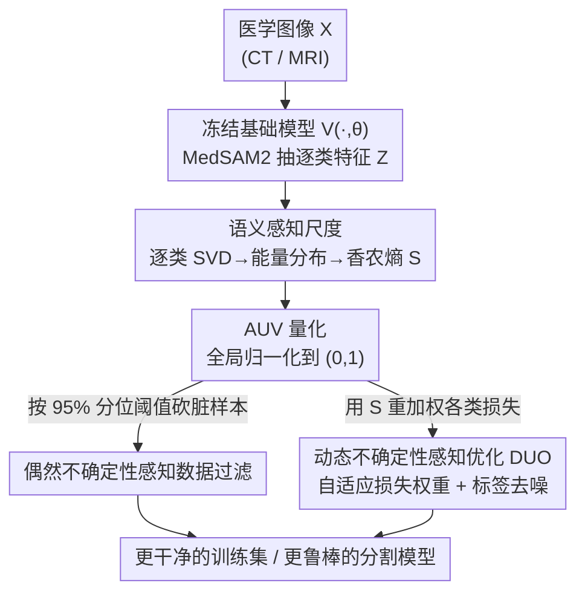

# Delving Aleatoric Uncertainty in Medical Image Segmentation via Vision Foundation Models

**会议**: CVPR 2026  
**论文**: [CVF Open Access](https://openaccess.thecvf.com/content/CVPR2026/html/Li_Delving_Aleatoric_Uncertainty_in_Medical_Image_Segmentation_via_Vision_Foundation_CVPR_2026_paper.html)  
**代码**: 论文称已开源，正文未给出链接 ⚠️  
**领域**: 医学图像分割  
**关键词**: 偶然不确定性, 视觉基础模型, 奇异值能量, 数据过滤, 自适应损失  

## 一句话总结
用冻结的医学视觉基础模型（MedSAM2）提取特征、对每类特征矩阵做奇异值分解并量化其能量分布熵，得到一个免标注的「偶然不确定性值（AUV）」来刻画样本难度与噪声，再以此驱动「数据过滤」和「动态不确定性感知优化」两套即插即用策略，在 5 个 CT/MRI 数据集上稳定提升分割性能。

## 研究背景与动机
**领域现状**：医学图像分割是诊断、手术导航、治疗规划的客观依据。但目前关于「不确定性」的研究几乎都聚焦在 **epistemic uncertainty（认知不确定性，模型自身的局限）** 上——通过 MC dropout、多次推理、预测可靠性估计来刻画模型「拿不准」的程度。

**现有痛点**：真正污染训练的，是数据本身固有的 **aleatoric uncertainty（偶然不确定性）**——多中心设备差异、成像噪声、专家标注的歧义与不一致。如果模型直接从这些噪声/歧义样本里学，会被误导甚至过度自信。而现有量化偶然不确定性的方法，大多依赖在「特定任务数据集」上训练的模型来抽特征，这些模型本身容易过拟合，估出来的不确定性并不可靠。

**核心矛盾**：要可靠地度量「数据有多难/多脏」，就需要一个**与具体任务无关、稳定且判别力强的特征空间**；但任务专用模型恰恰做不到这一点（它的特征是为某个数据集过拟合出来的）。

**本文目标**：(1) 找一个免标注、不依赖多次推理的方式量化每个样本的偶然不确定性；(2) 把这个量化值真正用起来，落到训练流程里去提升鲁棒性。

**切入角度**：作者借「基础模型把多源异构数据映射到统一稳定的 task-agnostic 特征空间」这一点，提出用**预训练医学视觉基础模型当固定特征提取器**。观察是：判别性强的「易」样本，其特征在奇异值谱上能量分布更丰富、更均匀（满秩）；而边界模糊、伪影多的「难/噪声」样本，特征低秩、奇异值衰减快、能量集中在少数方向。

**核心 idea**：把「特征矩阵的奇异值能量分布有多分散」当作样本难度的代理——用归一化香农熵定义**语义感知尺度（semantic perception scale）**，再全局归一化成 **AUV**，整个过程不碰任何标注。

## 方法详解

### 整体框架
方法分两大块：**前半段量化不确定性**（第 2 节），**后半段把不确定性用进训练**（第 3 节）。

量化侧：给定一张医学图像 $X$，喂进**冻结的**医学基础模型 $V(\cdot,\theta)$（实验里最优是 MedSAM2）得到逐类特征张量 $Z$；对每个类别 $c$ 的 3D 特征图 reshape 成 2D 矩阵后做 SVD，把奇异值的平方归一化成「能量分布」，再用归一化香农熵算出该类的语义感知尺度 $\mathcal{S}$，最后全局归一化得到样本级的 AUV $\in(0,1)$，越接近 1 越「难/脏」。

应用侧：AUV 作为训练数据的「额外标注」，驱动两条互相独立、都即插即用的支路——(a) **数据过滤**，按 AUV 分位数砍掉最脏的一批样本；(b) **动态不确定性感知优化（DUO）**，用 $\mathcal{S}$ 自适应调整各类损失权重，并配一个标签去噪头。

### 关键设计

**1. 语义感知尺度：用奇异值能量分布的熵免标注地量化样本难度**

这是全文地基，针对的痛点是「任务专用模型抽的特征会过拟合，量不准数据的固有难度」。作者改用冻结的医学基础模型当特征提取器：输入图像体 $X\in\mathbb{R}^{D\times H\times W}$，得到 $Z = V(X,\theta)\in\mathbb{R}^{C\times D\times H\times W}$。对类别 $c$，把它的特征图 reshape 成 $z_c\in\mathbb{R}^{D\times(H\cdot W)}$，本来想用协方差矩阵 $\Sigma=\frac{1}{N-1}(z_c-\bar z_c)(z_c-\bar z_c)^{\mathrm T}$ 的特征值刻画各正交方向上的方差（即不确定性），但作者绕过显式协方差计算，直接对 $z_c=US_cV^{\mathrm T}$ 做 SVD——因为协方差特征值恰等于奇异值平方 $\lambda^c_j=(\sigma^c_j)^2$，SVD 数值上更稳更直接。

接着把奇异值平方归一化成「能量分布」，再用归一化香农熵度量它有多分散：

$$p_j(z_c)=\frac{(\sigma^c_j)^2}{\sum_{j=1}^{r}(\sigma^c_j)^2+\varepsilon},\qquad \mathcal{S}(Z_i|c)=\frac{-\sum_{j=1}^{r}p_j(Z_i|c)\log p_j(Z_i|c)}{\log(r)}$$

直觉很清楚：奇异值衰减慢→满秩、能量均摊→熵高→特征多样、噪声鲁棒→不确定性低；衰减快→低秩、能量集中→熵低→特征贫瘠→不确定性高。整图不确定性 $\mathcal{S}(Z_i)=\sum_{c=1}^{C}\mathcal{S}(Z_i|c)$。最后做对数变换 + min-max 归一化，把方向翻转成「越大越不确定」的 AUV：

$$\text{AUV}(Z_i)=1-\frac{\log(\mathcal{S}(Z_i))-\min\{\log\mathcal{S}(Z_i)\}}{\max\{\log\mathcal{S}(Z_i)\}-\min\{\log\mathcal{S}(Z_i)\}}$$

为什么有效：整套量化不碰标注、不需多次推理或 MC 采样，且 Table 4 验证 $\mathcal{S}$ 与模型预测 Dice 的相关性（Pearson 0.63 / Spearman 0.75）远高于 Fisher、Mahalanobis 等基线，说明这个尺度确实抓到了「模型对该类有多有把握」。

**2. 偶然不确定性感知数据过滤：按分位数砍掉最脏的一批样本**

针对「噪声样本误导训练」这个痛点。作者把全体样本的 AUV 看成一个分布，用分位函数设阈值：记 AUV 的累积分布函数为 $F$，分位函数 $F^{-1}(\tilde p)=\inf\{\text{AUV}:\tilde p\le F(\text{AUV}(Z_i))\}$，默认取 $\tilde p=95\%$（即丢掉 AUV 最高的 5% 样本），保留集合 $\mathcal{D}^{*}=\{\tilde x_i\mid \text{AUV}\le F^{-1}(\tilde p)\}$。

它还有两个灵活点：一是**输入选什么图**——用原图 $\hat X$ 时 AUV 反映的是图像本身的解剖结构复杂度（纯免标注）；用按掩膜归一化后的 $X$ 时 AUV 更偏向「标注质量」的度量。二是**全局 vs 逐类过滤**——肿瘤这类任务只关心特定类区域，于是对每个类 $c$ 单独估 CDF $F_c$ 并各自卡分位，取并集 $\mathcal{D}^{*}=\bigcup_{c}\{\tilde x_i\mid\text{AUV}\le F_c^{-1}(\tilde p),\,Z_i=c\}$。为什么有效：相比用「数据方差」或任务专用模型当不确定性度量（Table 1 里这俩经常掉点），基础模型驱动的 AUV 砍样本能带来稳定正向收益。

**3. 动态不确定性感知优化（DUO）：用语义感知尺度重加权损失 + 标签去噪头**

针对「难类/噪声标注拖累训练稳定性」的痛点，且和数据过滤完全独立、可叠加。作者先指出医学分割本质是 Bernoulli 问题，套高斯分布假设会引入 mismatch bias，所以**不做密度估计**，而是直接拿模型预测特征的语义感知尺度 $\mathcal{S}$ 来揭示其认知偏差。

具体两步：(i) **标签去噪**——在主干分割头 $f(x)_{\theta_1}$ 之外并联一个噪声估计头 $f(x)_{\theta_2}$，学一个可学习噪声 $\hat\epsilon_i$，把脏标签净化成 $\tilde y_i = y_i-\hat\epsilon_i\cdot f(x_i)_{\theta_2}$，分割损失用 Dice+BCE 组合 $\mathcal{L}_{\text{seg}}=\beta\mathcal{L}_{\text{Dice}}+(1-\beta)\mathcal{L}_{\text{BCE}}$。(ii) **自适应重加权**——用 $\mathcal{S}$ 当正则项动态调整每类损失权重，总损失为

$$\mathcal{L}_{\text{total}}=\frac{1}{N}\sum_{i=1}^{N}\sum_{c=1}^{C}\frac{\mathcal{L}_{\text{seg}}\big(f(x_i)_{\theta_1},\,y_i-\hat\epsilon_i\cdot f(x_i)_{\theta_2}\big)}{1+\alpha\cdot\mathcal{S}(f(x_i|c)_{\theta_1})},\quad \text{s.t.}\ \tfrac1N\sum_i\hat\epsilon_i=0,\ \tfrac1N\sum_i\hat\epsilon_i^2=1$$

分母里 $\mathcal{S}$ 越大（该类特征越多样、越「确定」）→权重越小，相当于把训练注意力**让给**那些尺度低、更难学的类；对 $\hat\epsilon_i$ 加均值 0、方差 1 的统计约束防止噪声估计发散。为什么有效：它即插即用、几乎零额外训练开销，在 CNN(nnU-Net)、Transformer(Swin-UNETR)、Mamba(U-Mamba) 三种架构上都能稳定涨点（Table 2）。

### 损失函数 / 训练策略
所有实验用 nnU-Net 的预处理（归一化+重采样），从头训 100 epoch，SGD 初始学习率 0.01、Poly 策略，patch $96^3$、batch 2，PyTorch 2.0 + 单卡 RTX 4090。分割损失为 Dice+BCE 加权（$\beta$ 控制 BCE 占比），DUO 的总损失见上式（$\alpha$ 控制 $\mathcal{S}$ 的贡献度）。

## 实验关键数据

### 主实验
五个数据集：LiTS（肝/肝肿瘤 CT）、TotalSegmentator（104 解剖结构 CT）、WORD（16 腹部器官 CT）、FeTA 2022（胎儿脑 MRI）、KiTS23（肾/肾肿瘤 CT）；指标 Dice、mIoU。

**数据过滤（Table 1，nnU-Net baseline，五数据集 Dice 均值）：**

| 量化方式 | 保留比例 | 五数据集 Dice 均值(%) | vs 100% baseline |
|--------|--------|--------|--------|
| Baseline | 100% | 75.10 | — |
| Data Variance | 90% | 75.39 | +0.29 |
| 任务专用 nnU-Net | 95% | 75.33 | +0.23 |
| SegVol（基础模型） | 90% | 76.11 | +1.01 |
| **MedSAM2（基础模型）** | **90%** | **76.45** | **+1.35** |

结论：直接用数据方差/任务专用模型当不确定性度量收益微弱、甚至个别数据集掉点；用基础模型显著更好，MedSAM2 砍掉 10% 最脏样本就把均值从 75.10 提到 76.45。

**DUO 优化（Table 2，三种主干，五数据集 Dice 均值）：**

| 主干 | DUO | Dice 均值(%) | 提升 |
|------|-----|--------|------|
| nnU-Net (CNN) | ✗ | 75.10 | — |
| nnU-Net (CNN) | ✓ | 75.69 | +0.59 |
| Swin-UNETR (Transformer) | ✗ | 73.09 | — |
| Swin-UNETR (Transformer) | ✓ | 73.64 | +0.55 |
| U-Mamba (Mamba) | ✗ | 74.13 | — |
| U-Mamba (Mamba) | ✓ | 74.66 | +0.53 |

跨 CNN/Transformer/Mamba 三类架构都稳定 +0.5 左右，边界尤其更准。

### 消融实验

**量化方法对比（Table 3，LiTS 肿瘤 Dice%）：**

| 量化方法 | 90% data 肿瘤 Dice | +DUO 肿瘤 Dice |
|------|------|------|
| Fisher | 70.17 (+0.86) | 70.01 (+0.70) |
| Mahalanobis (MD) | 69.78 (+0.47) | 69.28 (−0.03) |
| EAOA | 70.41 (+1.10) | — |
| **本文 $\mathcal{S}(\cdot)$** | **74.28 (+4.97)** | **71.66 (+2.35)** |

**与预测 Dice 的相关性（Table 4）：** 本文 $\mathcal{S}$ Pearson 0.6267 / Spearman 0.7471，均显著高于 Fisher（0.44/0.66）、MD（0.36/0.46），且 p 值最小。

**过滤策略消融（Table 5，LiTS 肿瘤）：** 四种过滤策略 (a)-(d) 在 90% data 下肿瘤 Dice 提升 +2.53～+4.97，其中逐类全局策略 (c) 最优（+4.97）。

### 关键发现
- 难度集中在**肿瘤这类小目标/低对比类**：LiTS 肝（Liver）各方法都在 96.5+ 几乎打平，差距全在肿瘤（Tumor）类，本文 $\mathcal{S}$ 把肿瘤 Dice 从 ~69-70 拉到 74.28，说明 AUV 真正受益的是「难类」。
- **基础模型的选择不是越大越好**：CLIP-Driven 在多个数据集反而掉点，SegVol/MedSAM2 才稳定正向——即并非所有基础模型都适合当 AUV 特征提取器，医学专用的 MedSAM2 最佳。
- **MD 在叠加 DUO 后甚至出现 −0.03 的负提升**，而本文 $\mathcal{S}$ 在过滤与优化两种用法下都正向，印证了「奇异值能量熵」这个度量与模型真实预测行为更一致。

## 亮点与洞察
- **把"特征矩阵秩/能量分布"翻译成"样本难度"**：用 SVD 奇异值能量的香农熵刻画偶然不确定性，绕开了协方差显式计算、也绕开了 MC 采样/多次推理，免标注且数值稳定，思路干净。
- **AUV 当成"额外标注"即插即用**：量化与应用解耦，过滤和 DUO 两条支路互相独立、可叠加，且几乎零额外训练开销，迁移到任意分割主干都不用改架构。
- **可迁移点**：「冻结基础模型抽特征 → 逐类 SVD 能量熵 → 全局归一化成难度分」这套范式，理论上能搬到任何有类别概念、且存在标注噪声/样本难度差异的分割/检测任务里当数据清洗或课程学习的难度信号。

## 局限与展望
- AUV 的可靠性强依赖**基础模型的选择**——文中已显示并非所有基础模型都正向（CLIP-Driven 掉点），换领域/换模态时需要重新验证哪个基础模型适合，泛化性存疑 ⚠️。
- 提升幅度整体偏温和（DUO 均值 +0.5 上下，过滤均值 +1～1.35），对「肝」这类已经很好分的类几乎无收益，价值主要体现在肿瘤等少数难类。
- 标签去噪头对 $\hat\epsilon$ 仅施加均值 0、方差 1 的统计约束，噪声模型较简单；面对结构化标注偏差（如系统性边界偏移）能否奏效，文中未充分探讨。
- 评测停在 Dice/mIoU 与五个数据集，缺少对「过滤掉的样本到底脏在哪」的更直接验证（仅有 t-SNE 与少量可视化）。

## 相关工作与启发
- **vs 认知不确定性方法（MC dropout / 多次推理）**：它们刻画的是「模型不确定」，需要多次前向；本文刻画「数据本身不确定」，单次前向 + 冻结基础模型即可，关注点和开销都不同。
- **vs 任务专用模型抽特征做不确定性（如 EAOA、基于训练模型特征向量的方法）**：本文指出任务专用模型易过拟合导致估计不可靠，改用大规模预训练基础模型的 task-agnostic 特征空间，Table 1/3 显示稳定优于任务专用方案。
- **vs Mahalanobis / Fisher 等度量**：这些基于多元高斯密度假设，本文认为医学分割是 Bernoulli 问题、强分布假设会引入偏差，转而用奇异值能量熵，相关性（Table 4）与肿瘤提升（Table 3）都更高。

## 评分
- 新颖性: ⭐⭐⭐⭐ 首次把视觉基础模型引入医学偶然不确定性估计，奇异值能量熵的量化角度新颖。
- 实验充分度: ⭐⭐⭐⭐ 五数据集 + 三类主干 + 多组消融，但提升幅度温和、缺更直接的"脏样本"验证。
- 写作质量: ⭐⭐⭐⭐ 公式推导（SVD↔协方差）清晰，量化与应用解耦讲得明白。
- 价值: ⭐⭐⭐⭐ 即插即用、零额外开销的免标注数据清洗/重加权信号，对含噪医学数据集实用。

<!-- RELATED:START -->

## 相关论文

- [\[CVPR 2026\] Attention Consistent Longitudinal Medical Visual Question Answering Guided by Vision Foundation Models](attention_consistent_longitudinal_medical_visual_question_answering_guided_by_vi.md)
- [\[CVPR 2026\] Revisiting 2D Foundation Models for Scalable 3D Medical Image Classification](revisiting_2d_foundation_models_for_scalable_3d_medical_image_classification.md)
- [\[CVPR 2026\] Are General-Purpose Vision Models All We Need for 2D Medical Image Segmentation? A Cross-Dataset Empirical Study](are_general-purpose_vision_models_all_we_need_for_2d_medical_image_segmentation_.md)
- [\[CVPR 2026\] Forging a Dynamic Memory: Retrieval-Guided Continual Learning for Generalist Medical Foundation Models](forging_a_dynamic_memory_retrieval-guided_continual_learning_for_generalist_medi.md)
- [\[CVPR 2026\] TANGO: Learning Distribution-wise Foundation Prior Consistency and Instance-wise Style Calibration for Medical Image Generalization](tango_learning_distribution-wise_foundation_prior_consistency_and_instance-wise_.md)

<!-- RELATED:END -->
