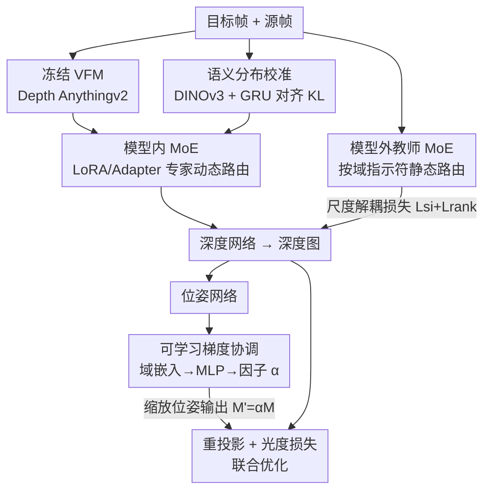

# Depth Any Endoscopy: Towards Self-Supervised Generalizable Depth Estimation in Monocular Endoscopy

**会议**: CVPR 2026  
**论文**: [CVF Open Access](https://openaccess.thecvf.com/content/CVPR2026/html/Shao_Depth_Any_Endoscopy_Towards_Self-Supervised_Generalizable_Depth_Estimation_in_Monocular_CVPR_2026_paper.html)  
**代码**: https://github.com/ShuweiShao/DAE  
**领域**: 医学图像  
**关键词**: 内窥镜深度估计, 自监督, 跨域泛化, 混合专家MoE, 视觉基础模型适配  

## 一句话总结
DAE 用「双层 MoE 适配 + 可学习梯度协调 + 语义分布校准」把视觉基础模型（Depth Anything v2）改造成一个统一的自监督内窥镜深度网络，无需深度标注就能在腹腔镜、结肠镜等差异巨大的术式上同时取得 SOTA 的零样本与同域深度估计精度。

## 研究背景与动机

**领域现状**：微创内窥镜手术里，单目深度估计是 3D 重建、AR 导航的核心。由于采集真实深度标注涉及安全、隐私、手术规范等障碍，主流做法是**自监督**——把深度估计转成「新视角合成」问题，用深度网络 + 位姿网络联合预测，靠相邻帧重投影后的光度误差（photometric loss）当监督信号。

**现有痛点**：现有自监督方法几乎都是**单域（in-domain）**训练的——在某一种术式数据上训、在同种术式上测。一旦跨术式（腹腔镜 ↔ 结肠镜 ↔ 关节镜），深度分布、光照条件、组织纹理差异巨大，网络根本收不敛。另一条路是把通用深度基础模型（Depth Anything 等）用 LoRA 适配到内窥镜，但这些工作只适配**单一域**，跨域泛化依旧不足。

**核心矛盾**：自监督设置下没有直接深度监督，只靠光度损失；而不同术式的数据「学习难度」不同，会同时引发两个麻烦——(i) 深度分布/光照/纹理的剧烈差异让网络难以正常收敛；(ii) 深度网络与位姿网络共享同一个光度损失，不同术式的数据会让两个网络的**梯度量级失衡**，破坏协同优化。作者实测发现：位姿网络的梯度缩放因子是**数据集相关**的——SCARED 上要用 0.001 才能收敛、用 0.01 直接崩；SimCol3D 上却要用 0.01。固定一个因子在混合数据上必然顾此失彼。

**本文目标**：用**一个统一模型**，在自监督（无深度标注）前提下，跨多种术式都给出可靠深度。

**核心 idea**：与其为每个术式单独适配，不如让一个基础模型「按输入特性自己选适配方式」——**双层 MoE**（模型内动态选 LoRA/Adapter 专家 + 模型外按域路由的教师专家），再配一个**可学习的梯度协调因子**自动摆平深度-位姿失衡，外加 DINOv3 语义分布校准强化深度的语义一致性。

## 方法详解

### 整体框架

DAE 的骨架是冻结的 Depth Anything v2（ViT）+ 可训练的深度头与位姿网络，整体仍是自监督的「深度网络 + 位姿网络 + 光度损失」范式。在此之上叠了四个组件协同工作：输入目标帧后，**模型内 MoE** 在若干 Transformer Block 里动态路由 LoRA/Adapter 专家、调整内部特征表示；同时一个**模型外教师 MoE**（按域指示符静态路由、权重全程冻结）给出该域专属的深度引导，用尺度解耦损失把引导信号「去尺度」后监督学生；位姿网络的输出先经过**可学习梯度协调**因子缩放，再去做重投影、算光度损失，从而平衡深度-位姿梯度；编码器特征还被 **DINOv3 语义分布校准**模块对齐到高层语义。最终多项损失加权联合优化。

### 关键设计

**1. 双层 MoE 适配：让一个基础模型按输入特性自己挑适配方式**

针对「单一 LoRA 适配扛不住跨术式差异」的痛点，DAE 把适配拆成**模型内**和**模型外**两层。模型内层把 LoRA 和 Adapter 都做成 MoE：MoE-LoRA 层用一组**不同秩** $r$ 的低秩矩阵当专家 $E_L=\{E_{L1},\dots,E_{LN}\}$，一个轻量选择器 $S_L(\cdot)$ 按输入 $I_{in}$ 的特性路由到 Top-$\kappa$ 个专家，层输出为

$$I_{out}=W_{q,k,v}(I_{in})+\sum_{n=1}^{N}S_L(I_{in})\cdot E_{Ln}(I_{in}),\quad E_{Ln}(I_{in})=B_nA_nI_{in}$$

其中 $W_{q,k,v}$ 是冻结的注意力权重，$B_n,A_n$ 是秩为 $r_n$ 的可训练低秩矩阵，路由 $S_L(I_{in})=\mathrm{Top}_\kappa(\mathrm{softmax}(W_{sel}I_{in}/\tau))$，温度 $\tau=1$。因为 ViT 缺少局部归纳偏置，作者又加 **MoE-Adapter** 层，用**不同卷积核大小**的卷积块当专家来补局部结构细节，路由方式同理。这样网络面对不同术式时，能动态选最合适的低秩子空间和感受野——实测 SCARED 偏好秩 4/16、核 3 的专家，SimCol3D 偏好秩 4/32、核 7 的专家，证实了「按数据选专家」确实在发生。

模型外层是一个**域专属教师 MoE** $E_G=\{E_{G1},\dots,E_{GZ}\}$，每个教师专家在对应域数据上**自监督预训练好、权重全程冻结**，按离散域指示符 $D$（如 SCARED=0、SimCol3D=1）做**静态一对一路由** $E_{Gz}=E_G[\zeta\in D]$，给出该域显式的深度引导。作者发现：纯自监督在混合数据上没有显式深度监督会「学崩」，教师 MoE 提供的「正确优化方向」是稳住训练的关键（消融里它带来最大涨幅）。

**2. 尺度解耦损失：把教师引导「去尺度」，只学有意义的深度结构**

单目系统有固有的尺度歧义，若直接拿教师深度当 ground truth，学生会被教师的尺度带偏。该损失由两部分组成。**尺度不变损失**先用中位数把预测对齐到教师尺度再算 L1：

$$\mathcal{L}_{si}=\sum_p\|\tilde D_t-E_{Gz}(f_t)\|_1,\quad \ell=\frac{\mathrm{median}(E_{Gz}(f_t))}{\mathrm{median}(D_t)+\epsilon},\ \tilde D_t=\ell\cdot D_t$$

**排序损失**则只取教师引导的**序关系**（哪个像素更近/更远），从根上甩掉尺度偏置：对采样像素对 $(p_{i,1},p_{i,2})$，按教师深度比值与容忍阈值 $\gamma=0.03$ 定伪序标签 $\eta_i\in\{+1,-1,0\}$，再用 $\eta_i\neq0$ 时的 $\log(1+\exp[-\eta_i(d_{i,1}-d_{i,2})])$、$\eta_i=0$ 时的 $(d_{i,1}-d_{i,2})^2$ 来惩罚。为防教师本身出错误导训练，还会算预测与引导的一致性、**丢掉误差最大的前 10% 像素**。

**3. 可学习梯度协调：自动摆平深度-位姿的梯度失衡**

直接针对「位姿缩放因子数据集相关、固定值在混合数据上必崩」这一痛点。DAE 不再手调，而是把域指示符 $\zeta$ 经嵌入层映射成域嵌入、再过 MLP 生成**域专属协调因子** $\alpha$，作用在位姿输出上 $M'=\alpha\cdot M$。这样光度损失对 $M$ 的梯度变成

$$\frac{\partial\mathcal{L}_{ph}}{\partial M}=\frac{\partial\mathcal{L}_{ph}}{\partial M'}\cdot\frac{\partial M'}{\partial M}=\alpha\cdot\frac{\partial\mathcal{L}_{ph}}{\partial M'}$$

因为 $\alpha$ 与 $M$ 无关，它直接调制位姿网络的梯度量级，把深度与位姿的梯度拉进同一「匹配区间」。$\alpha$ 端到端随网络一起学（另乘一个经验因子 0.01 加速收敛）。实测学到的 $\alpha$ 在 SCARED 与 SimCol3D 上分别约 0.51 与 0.78，自动复现了「不同域要不同缩放」的先验，无需人工逐域调参。

**4. 语义分布校准（SDC）：用 DINOv3 语义先验约束深度的语义一致性**

高层语义有助深度估计，但 DAE 编码器特征与预训练语义编码器特征处于不同空间，不能直接对齐。SDC 用冻结的 DINOv3 提语义先验 $F^{sp}_t$，再用一个 **GRU 投影器** $T(\cdot)$ 把它映射到 DAE 特征空间（隐状态用 $\tanh(F^{sp}_t)$ 初始化、迭代 2 次），最小化 $\mathbb{E}_p[\|T(F^{sp}_t(p))-F_t(p)\|_1]$ 的映射误差。然后把投影后的语义特征与 DAE 特征沿特征维归一化成分布 $\hat F^{sp}_t,\hat F_t$，用 KL 散度度量二者差异作为损失：

$$\mathcal{L}_{sdc}=\sum_p \mathrm{KL\_div}(\hat F^{sp}_t,\hat F_t)$$

它把高层语义结构注入深度预测，强化语义一致性（消融里是最后一块拼图，带来末端提升）。

### 损失函数 / 训练策略

总损失是各项加权和：

$$\mathcal{L}_{total}=\mathcal{L}_{ph}+\lambda_1\mathcal{L}_{si}+\lambda_2\mathcal{L}_{rank}+\lambda_3\mathcal{L}_{sdc}+\lambda_4\mathcal{L}_{es}$$

其中 $\mathcal{L}_{ph}$ 为光度损失（SSIM 项权重 $\alpha=0.85$），$\mathcal{L}_{es}=\sum_p|\nabla D(p)|\cdot e^{-|\nabla f_t(p)|}$ 为边缘感知平滑损失，$\lambda_{1\sim4}$ 取 0.1 / 0.01 / 0.01 / 0.001。深度网络基于 Depth Anything v2 + 改进深度头，位姿网络仿 Monodepth2/AF-SfMLearner，并引入外观与光流网络处理帧间亮度波动、内参估计网络替代标定内参。单卡 RTX A5000、AdamW，初始学习率 $1\times10^{-4}$、10 epoch 后衰减 0.1，训 20 epoch、batch 8。每个 MoE 层 4 个专家、Top-1 选择；MoE-LoRA 秩为 {4,8,16,32}，MoE-Adapter 核大小为 {3,5,7,9}；仅 VFM 的 [2,4,5,7,8,10,11] 层可调，其余冻结。训练数据为 SCARED + Hamlyn + SimCol3D + Colondepth 四数据集混合，共 56,934 帧。

## 实验关键数据

### 主实验

零样本泛化（在训练中**未见过**的 C3VD/C3VDv2/SERV-CT 上测），DAE 全指标领先：

| 数据集 | 指标 | DAE | EndoDAC†（同数据重训） | Depth Anythingv2 |
|--------|------|-----|------------------------|-------------------|
| C3VD | AbsRel ↓ | **0.086** | 0.114 | 0.208 |
| C3VD | RMSE ↓ | **4.397** | 7.328 | 11.995 |
| C3VD | δ ↑ | **0.934** | 0.877 | 0.707 |
| C3VDv2 | AbsRel ↓ | **0.132** | 0.150 | 0.184 |
| SERV-CT | AbsRel ↓ | **0.078** | 0.132 | 0.164 |

> 注：† 表示用与 DAE 相同的混合数据重训以求公平；通用大模型 Depth Anything v1/v2 因自然场景到手术场景的域差距过大，零样本严重退化。

同域评估（SCARED 腹腔镜 + SimCol3D 结肠镜，DAE 用**同一个统一模型直接测、不针对单数据集微调**，对手则各自单独训练）：

| 数据集 | 指标 | DAE | EndoDAC | Endo-FASt3r |
|--------|------|-----|---------|-------------|
| SCARED | AbsRel ↓ | **0.047** | 0.052 | 0.051 |
| SCARED | RMSE ↓ | **4.156** | 4.464 | 4.480 |
| SimCol3D | AbsRel ↓ | **0.088** | 0.099 | 0.104 |
| SimCol3D | RMSE ↓ | **0.450** | 0.477 | 0.506 |

### 消融实验

组件逐项叠加（SCARED，ID 0 为 vanilla-LoRA 单域基线）：

| ID | 配置 | AbsRel ↓ | RMSE ↓ | δ ↑ | 说明 |
|----|------|----------|--------|-----|------|
| 0 | 单域基线 | 0.053 | 4.769 | 0.977 | vanilla LoRA |
| 1 | + 混合数据 | 0.108 | 8.842 | 0.889 | 直接混合反而崩坏 |
| 2 | + 模型外 MoE | 0.052 | 4.555 | 0.979 | 教师引导救回收敛 |
| 3 | + 模型内 MoE | 0.050 | 4.365 | 0.981 | 动态适配特征 |
| 4 | + 梯度协调 LGH | 0.048 | 4.263 | 0.982 | 平衡深度-位姿 |
| 5 | + 语义校准 SDC | **0.047** | **4.156** | **0.983** | 完整 DAE |

损失/专家类型消融（SCARED）：

| 配置 | AbsRel ↓ | RMSE ↓ | 说明 |
|------|----------|--------|------|
| 仅 Lsi | 0.053 | 4.606 | 只用尺度不变损失 |
| Lsi+Lrank | 0.052 | 4.555 | 加排序损失更好 |
| + LoRA 专家 | 0.050 | 4.392 | LoRA 略优于 Adapter |
| + Adapter 专家 | 0.051 | 4.453 | 单 Adapter |
| LoRA+Adapter | **0.050** | **4.365** | 互补，最佳 |

### 关键发现

- **最戏剧性的一格是 ID 1**：把单域基线直接丢进混合数据，AbsRel 从 0.053 暴涨到 0.108、RMSE 翻到 8.842——印证了「跨术式差异会让自监督网络学崩」这个核心矛盾不是空话。
- **模型外教师 MoE 贡献最大**：ID 1→2 一步把 AbsRel 从 0.108 拉回 0.052，是把混合训练「救活」的关键，说明纯光度损失在异质数据上确实需要显式深度引导兜底。
- **专家选择有可解释的域偏好**：SCARED 偏好低秩（4/16）+ 小核（3），SimCol3D 偏好秩 4/32 + 核 7；学到的梯度协调因子 0.51 vs 0.78 也随域变化，说明双层 MoE 与 LGH 确实在按域自适应，而非摆设。
- **LoRA 与 Adapter 互补**：单独用各有短板，合用才最好，对应「LoRA 调全局低秩子空间、Adapter 补局部卷积细节」的设计意图。

## 亮点与洞察

- **把「逐域手调」变成「端到端可学」**：梯度协调因子原本是个臭名昭著的数据集相关魔数（0.001 vs 0.01 决定生死），DAE 用域嵌入 → MLP 直接学出来，是一个很干净、可迁移到任何多域自监督深度/位姿联合训练的 trick。
- **教师 MoE「按域静态路由 + 尺度解耦」**：把「不同域各自的预训练自监督模型」当冻结教师，再用排序损失只取序关系、丢掉前 10% 大误差像素，巧妙绕开了单目尺度歧义与教师噪声两个坑。
- **双层 MoE 的分工清晰**：模型内动态选秩/核应对「同一前向里不同输入」，模型外静态按域选教师应对「不同术式」，两个 MoE 解决的是两类不同粒度的异质性，组合起来既灵活又稳。
- **可迁移性**：双层 MoE 适配范式与可学习梯度协调，几乎可以平移到任意「VFM 适配 + 多域自监督」的稠密预测任务（如多场景自监督深度、跨传感器估计）。

## 局限与展望

- 域指示符 $D$ 是**离散且预先给定**的，依赖训练时知道每帧属于哪个术式；面对全新、未登记的术式（如论文里仅做定性的关节镜）时，模型外教师 MoE 缺少对应专家，只能靠模型内 MoE 与语义校准外推，泛化上限受限。⚠️ 论文未给关节镜的定量结果，仅有定性图。
- 教师专家需要**逐域自监督预训练**，新增一个域就要先训一个教师，扩展成本随术式数量线性增长。
- 整个系统组件偏多（双层 MoE + 外观/光流网络 + 内参估计网络 + DINOv3 + GRU 投影器），推理与训练管线较重，论文未报告推理速度/显存，临床实时部署的代价存疑。
- 改进方向：把离散域指示符换成可从图像内容**软推断的域路由**，让教师选择与梯度协调因子都能对未见术式连续插值，从而真正「Any Endoscopy」。

## 相关工作与启发

- **vs EndoDAC / Endo-FASt3r / DARES**：它们同样把 Depth Anything 用 LoRA 系适配到内窥镜，但都是**固定秩、单域**适配，跨域泛化不足；DAE 用动态秩/核的双层 MoE + 教师引导直面跨术式，在同数据重训的公平对比下零样本与同域都更强。
- **vs Depth Anything v1/v2 等通用深度基础模型**：它们靠大规模自然场景数据 + 深度标注训练，但手术场景域差距太大、零样本严重退化；DAE 在冻结其骨架上做自监督适配，无需深度标注即把它「驯化」到内窥镜域。
- **vs Godard 等的固定梯度缩放（0.01）**：传统做法用一个固定因子粗暴缩放位姿梯度，混合数据上必然顾此失彼；DAE 把它升级成域条件、可学习的协调因子，是对自监督深度-位姿联合优化的一个直接改进。

## 评分
- 新颖性: ⭐⭐⭐⭐ 双层 MoE 适配 + 可学习梯度协调的组合在自监督跨域内窥镜深度上是新的，单项技术多为已有模块的巧妙重组。
- 实验充分度: ⭐⭐⭐⭐⭐ 4 训练集 + 3 零样本集 + 2 同域集，零样本/同域/消融/专家选择分析齐全，对比含同数据重训的公平设置。
- 写作质量: ⭐⭐⭐⭐ 结构清晰、公式与动机对应；组件偏多但讲得有条理，部分跨术式定量（关节镜）缺失。
- 价值: ⭐⭐⭐⭐⭐ 无需深度标注就给出统一跨术式深度模型，对手术导航/3D 重建落地价值高，代码开源。

<!-- RELATED:START -->

## 相关论文

- [\[CVPR 2026\] Real2Sim2Real: RetinalDepth-64K for Depth Estimation in Posterior Segment Ophthalmic Surgery](real2sim2real_retinaldepth-64k_for_depth_estimation_in_posterior_segment_ophthal.md)
- [\[CVPR 2026\] Learning Generalizable 3D Medical Image Representations from Mask-Guided Self-Supervision](learning_generalizable_3d_medical_image_representations_from_mask-guided_self-su.md)
- [\[CVPR 2026\] Dual-Level Confidence based Implicit Self-Refinement for Medical Visual Question Answering](dual-level_confidence_based_implicit_self-refinement_for_medical_visual_question.md)
- [\[CVPR 2026\] Virtual Full-stack Scanning of Brain MRI via Imputing Any Quantised Code](virtual_full-stack_scanning_of_brain_mri_via_imputing_any_quantised_code.md)
- [\[CVPR 2026\] InvCoSS: Inversion-driven Continual Self-supervised Learning in Medical Multi-modal Image Pre-training](invcoss_inversion-driven_continual_self-supervised_learning_in_medical_multi-mod.md)

<!-- RELATED:END -->
