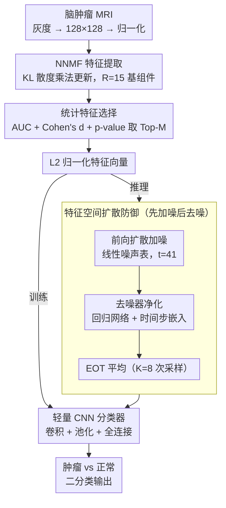

# Diffusion-Based Feature Denoising and Using NNMF for Robust Brain Tumor Classification

**会议**: CVPR 2026  
**arXiv**: [2603.13182](https://arxiv.org/abs/2603.13182)  
**代码**: 待确认  
**领域**: 医学图像  
**关键词**: 脑肿瘤分类, 非负矩阵分解(NNMF), 对抗鲁棒性, 扩散去噪防御, AutoAttack

## 一句话总结

本文提出 NNMF+CNN+扩散防御框架用于脑肿瘤 MRI 分类：先用 NNMF 将图像分解为紧凑可解释的低秩特征，通过 AUC/Cohen's d/p-value 统计指标筛选最强判别组件，再用轻量 CNN 分类；推理时引入前向扩散加噪 + 学习去噪器的特征空间净化模块，在 AutoAttack ($L_\infty$, $\epsilon=0.10$) 下将鲁棒准确率从 0.47% 提升至 59.53%。

## 研究背景与动机

**领域现状**：深度学习在脑肿瘤 MRI 分类中已取得很高的准确率，如基于 CNN 的方法可达 97%+ 分类精度。然而这些模型直接在高维图像空间操作，参数量大且缺乏可解释性。

**现有痛点**：DNN 对对抗扰动高度敏感——微小的、人眼不可见的输入修改可导致分类准确率急剧下降。在医疗诊断等安全关键应用中，这种脆弱性是无法接受的。现有对抗防御方法（如对抗训练、输入变换）通常在原始图像空间操作，计算开销大且可能牺牲 clean accuracy。

**核心矛盾**：高维图像空间中的对抗扰动难以有效过滤——攻击面太大。同时，降维表示（如 PCA）虽减少维度但缺乏可解释性和非负约束，不适合像素值天然非负的医学图像。

**本文目标**：(1) 如何获得紧凑、可解释且适合医学图像的特征表示？(2) 如何在特征空间而非图像空间实施有效的对抗防御？(3) 如何在不显著损失 clean accuracy 的前提下大幅提升 robust accuracy？

**切入角度**：NNMF 天然适合非负数据的 parts-based 分解，可将 MRI 图像压缩为少量可解释基组件。在低维特征空间中实施扩散-去噪防御比在原始图像空间更高效——前向扩散注入结构化噪声可"淹没"对抗扰动，学习去噪器再恢复干净特征。

**核心 idea**：用 NNMF 将 MRI 图像压缩为可解释低秩特征，在该特征空间中通过扩散加噪-去噪实现轻量且有效的对抗防御。

## 方法详解

### 整体框架

这篇论文要解决的是一个安全关键的尴尬：CNN 在脑肿瘤 MRI 上能轻松刷到 97%+ 的准确率，但只要给输入加上人眼看不见的对抗扰动，准确率就能瞬间崩到接近 0。作者的破局思路是「先压缩，再防御」——不在原始的高维图像空间硬扛对抗扰动，而是先用 NNMF 把整张 MRI 压成十几个非负基组件，把战场搬到一个维度极低、攻击面极小的特征空间，再在这个空间里做扩散去噪。

整条管线从训练到推理是这样转的：原始图像先经 NNMF 分解出基组件和系数，统计指标从中挑出最能区分肿瘤的几个组件，喂给一个轻量 CNN 学分类；同时单独训练一个去噪器，专门学习把「加了噪的特征」还原成「干净特征」。推理时，输入图像投影到 NNMF 特征、做 L2 归一化后，先被故意打上一层前向扩散噪声，再由去噪器净化，最后才进 CNN 出结果——对抗扰动就在这「先加噪后去噪」的一来一回里被冲洗掉了。

### 关键设计

**1. NNMF 特征提取：把 MRI 压成可解释的低秩基组件，顺手缩小攻击面**

高维图像空间是对抗攻击的温床——像素越多，攻击者能动手脚的维度就越多。作者用非负矩阵分解先把这个攻击面砍下来。每张图灰度化、缩放到 $128\times128$、归一化到 $[0,1]$ 后展平成列向量，堆成非负数据矩阵 $V \in \mathbb{R}_+^{K \times N}$，再按 KL 散度目标的乘法更新规则分解成 $V \approx WH$，其中 $W \in \mathbb{R}_+^{K \times R}$ 是 $R=15$ 个基组件、$H$ 是对应的系数矩阵。更新规则交替执行：

$$W \leftarrow W \otimes \frac{(V ./ (WH)) H^T}{\mathbf{1} H^T}, \qquad H \leftarrow H \otimes \frac{W^T (V ./ (WH))}{W^T \mathbf{1}}$$

之所以选 NNMF 而不是 PCA，是因为它的非负约束天然契合像素值非负的医学图像，分解出的是 parts-based 表示——每个基组件对应颅骨边界、组织分布这类有意义的解剖结构，可解释性远好于 PCA 的正负混叠主成分。验证集和测试集不重新分解，而是固定训练得到的基 $W$、做非负最小二乘投影求系数，保证训练与推理表示一致。

**2. 统计特征选择：用三重统计指标挑出真正有判别力的组件**

15 个基组件并非个个有用——冗余组件不仅帮不上分类，还白白增加噪声和可被攻击的维度。作者不靠方差或重建误差这类间接信号，而是直接对每个组件做三项统计检验来量化「它到底能不能分肿瘤」：ROC-AUC 衡量单组件区分肿瘤与正常的判别力，Cohen's d 给出两类分布分离程度的效应量，Welch's t-test 的 p-value 检验这种分离在统计上是否显著。综合三个指标排序后取 Top-M 个组件，特征向量再做 L2 归一化。三个指标各管一头——AUC 管排序能力、Cohen's d 管分离幅度、p-value 管可靠性，凑在一起才能保证留下的特征既分得开又不是偶然，比单一准则更稳。

**3. 轻量 CNN 分类器：在十几维特征上做二分类，几乎零开销**

既然特征已经被压到 Top-M 维（远小于 $128\times128$ 的像素），分类器自然不必再用重型网络。输入是 L2 归一化后的 NNMF 特征向量，经卷积、最大池化、全连接层输出肿瘤 vs 正常的二分类结果，训练集上优化、验证集监控防止过拟合。在如此低维的特征上，CNN 依旧能捕获组件之间的非线性关系，clean test accuracy 约 85.1% ⚠️ 以原文为准——这说明 NNMF 的 15 个组件确实保住了分类所需的大部分判别信息，降维并没有把有用信号一起丢掉。

**4. 特征空间扩散防御：用「先加噪、再去噪」淹没对抗扰动**

这是全篇鲁棒性的核心。前三步只是把战场挪到了低维特征空间，真正抵御攻击的是这一步。直觉是：对抗扰动是攻击者精心算出来、能撬动决策边界的小信号，但只要往上叠一层足够强的随机高斯噪声，这点精心构造的扰动就会被「淹没」在噪声里，失去方向性；随后再用一个学过干净数据分布的去噪器把信号捞回来，捞回的是干净特征分布的映射，而非被保留的对抗扰动。

具体分两件事。前向扩散按一个线性噪声时间表，对干净特征 $x_0$ 在时间步 $t$ 注入高斯噪声得到 $x_t$，$t$ 越大注入越强，论文固定取 $t=41$ 步。去噪器是一个回归网络，输入噪声特征 $x_t$ 加上正弦编码的时间步嵌入，输出还原的干净特征 $\hat{x}_0$，用 MSE 损失训练。推理时对输入特征先扩散到第 $t$ 步、再去噪、最后送 CNN；由于加噪本身是随机的，单次结果会抖，作者用 Expectation over Transformation（EOT）对 $K=8$ 次独立采样取平均，把随机性抹平、稳定最终预测。整套流程之所以轻，正是因为它发生在十几维特征空间而非整张图像上——扩散去噪在这里近乎免费。

### 损失函数 / 训练策略

- **NNMF 优化**：KL 散度 + 乘法更新规则，rank $R=15$
- **CNN 分类器**：交叉熵损失，训练-验证分离监控
- **去噪器**：MSE 损失 $\|\hat{x}_0 - x_0\|_2^2$，正弦时间步编码
- **对抗评估**：AutoAttack ($L_\infty$, $\epsilon=0.10$)，包含 APGD-CE 和 Square Attack 两种攻击，防御侧使用 EOT ($K=8$)
- **整体管线**：MATLAB 实现 NNMF + CNN + 扩散训练，模型导出为 ONNX 格式在 PyTorch 中运行 AutoAttack 评估

## 实验关键数据

### 主实验

综合性能对比（Clean 与 AutoAttack 条件下）：

| 模型 | 准确率 | 精确率 | 召回率 | F1 | MCC | ROC-AUC | Brier Score↓ |
|------|:---:|:---:|:---:|:---:|:---:|:---:|:---:|
| Clean Baseline | 0.861 | 0.855 | 0.898 | 0.876 | 0.718 | 0.911 | 0.146 |
| Clean Defended | 0.851 | 0.853 | 0.881 | 0.867 | 0.699 | 0.897 | 0.156 |
| Robust Baseline | **0.005** | 0.000 | 0.000 | 0.000 | -0.991 | 0.008 | 0.470 |
| Robust Defended | **0.595** | 0.612 | 0.720 | 0.662 | 0.170 | 0.749 | 0.215 |

关键对比：Baseline 在 AutoAttack 下几乎完全崩溃（准确率 0.47%，MCC≈-1），而扩散防御后鲁棒准确率恢复到 59.53%。Clean accuracy 仅从 86.05% 轻微下降到 85.12%（损失 <1%）。

### 消融分析

| 配置 | Clean Acc | Robust Acc | 说明 |
|------|:---:|:---:|------|
| 无 NNMF（原始图像 + CNN） | 较高 | 极低 | 高维空间攻击面大 |
| NNMF + CNN（无扩散防御） | 0.861 | 0.005 | NNMF 降维本身不提供鲁棒性 |
| NNMF + CNN + 扩散防御 | 0.851 | **0.595** | 扩散防御是鲁棒性核心 |

验证集 CNN 准确率约 83%，测试集约 85.1%，验证-测试差距小说明未过拟合。

### 关键发现

1. **扩散防御是鲁棒性提升的核心**：无防御时 AutoAttack 将准确率打到 0.47%（MCC≈-1，等于完全反转预测），加入扩散防御后恢复到 59.53%
2. **Clean accuracy 损失极小**：防御模块仅引入 <1% 的 clean accuracy 下降，说明去噪器成功保留了判别信息
3. **NNMF rank=15 足以保留判别信息**：仅 15 个基组件即可支撑 85%+ 的 clean accuracy，说明脑肿瘤 MRI 分类任务的有效信息维度很低
4. **EOT 平均化增强防御稳定性**：多次随机扩散采样平均提供了更鲁棒的预测
5. **概率校准指标也显著改善**：防御后的 Brier Score 从 0.470 降到 0.215，Log-Loss 从 1.163 降到 0.618，说明防御不仅提升分类准确率，还改善了预测概率的可靠性

## 亮点与洞察

1. **特征空间而非图像空间的扩散防御**：在 NNMF 压缩后的低维特征空间中做扩散-去噪，计算量远小于图像空间防御，且低维空间中噪声更容易"掩盖"对抗扰动。这个思路可迁移到任何先降维再分类的管线中
2. **NNMF 的双重角色**：既作为可解释特征提取器（每个基组件对应有意义的解剖结构），又作为对抗防御的前置降维——减少了攻击者可操纵的维度，天然增加了攻击难度
3. **统计驱动的特征选择**：用 AUC + Cohen's d + p-value 三重指标筛选组件，比单纯按方差或重建误差选择更能保证选出的特征同时具有判别力和统计显著性
4. **MATLAB-Python 混合管线的工程设计**：利用 MATLAB 的矩阵分解优势做 NNMF，用 PyTorch 做对抗评估，通过 ONNX 桥接——这种实用主义的工程策略值得借鉴

## 局限与展望

1. **数据集规模小且缺乏患者级划分**：仅约 2200 张 MRI 切片，且无患者 ID 信息，训练/测试集之间可能存在同一患者的切片泄漏（slice-level leakage），报告的性能可能偏乐观
2. **仅做二分类（肿瘤 vs 正常）**：未扩展到多类脑肿瘤分型（如胶质瘤 vs 脑膜瘤 vs 垂体瘤），实际临床需求更复杂
3. **Clean accuracy 偏低**：85% 的分类准确率在医学图像领域不算突出，可能是 NNMF rank=15 的信息瓶颈过窄所致，更高的 rank 或自适应 rank 选择可能改善
4. **扩散步数为固定超参数**：$t=41$ 步的选择缺乏系统消融，不同攻击强度可能需要不同的噪声注入量
5. **仅评估 $L_\infty$ 攻击**：未考虑 $L_2$、$L_1$ 或更高级的攻击方式（如 C&W attack），防御的泛化鲁棒性未充分验证
6. **去噪器结构简单**：使用基础回归网络，未探索更强的去噪架构（如 U-Net 风格或 Transformer-based），可能限制了恢复质量

<!-- RELATED:START -->

## 相关论文

- [\[CVPR 2026\] RelativeFlow: Taming Medical Image Denoising Learning with Noisy Reference](relativeflow_taming_medical_image_denoising_learning_with_noisy_reference.md)
- [\[CVPR 2026\] Multimodal Classification of Radiation-Induced Contrast Enhancements and Tumor Recurrence Using Deep Learning](multimodal_classification_of_radiation-induced_contrast_enhancements_and_tumor_r.md)
- [\[CVPR 2026\] PGR-Net: Prior-Guided ROI Reasoning Network for Brain Tumor MRI Segmentation](pgr-net_prior-guided_roi_reasoning_network_for_brain_tumor_mri_segmentation.md)
- [\[CVPR 2026\] Federated Modality-specific Encoders and Partially Personalized Fusion Decoder for Multimodal Brain Tumor Segmentation](federated_modality-specific_encoders_and_partially_personalized_fusion_decoder_f.md)
- [\[CVPR 2026\] CRFT: Consistent-Recurrent Feature Flow Transformer for Cross-Modal Image Registration](crft_consistent-recurrent_feature_flow_transformer_for_cross-modal_image_registr.md)

<!-- RELATED:END -->
