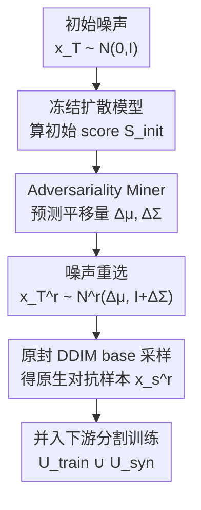

# Diffusion-Based Native Adversarial Synthesis for Enhanced Medical Segmentation Generalization

**会议**: CVPR 2026  
**论文**: [CVF Open Access](https://openaccess.thecvf.com/content/CVPR2026/html/Zhang_Diffusion-Based_Native_Adversarial_Synthesis_for_Enhanced_Medical_Segmentation_Generalization_CVPR_2026_paper.html)  
**代码**: 无  
**领域**: 医学图像  
**关键词**: 扩散增强, 对抗性合成, 噪声重选, 医学分割, 泛化  

## 一句话总结
这篇论文指出扩散模型用于医学分割数据增强时，真正驱动泛化的不是视觉逼真度而是"合成对抗性"（合成样本诱导的经验损失），且只有落在流形上的**原生对抗性**有效；据此提出一个轻量插件 Adversariality Miner，仅通过重选初始噪声、不改动也不重训冻结扩散模型，就能放大原生对抗性，在多个医学分割基准上把下游 Dice 增益再提升 4~5 个点。

## 研究背景与动机

**领域现状**：医学图像分割要可靠地泛化到未见过的临床数据，按经验 scaling law 需要更多数据，但医学数据受隐私、标注成本和长尾分布限制，难以继续扩。近来大规模扩散模型（如 Stable Diffusion）把网络规模的视觉先验迁移到有限医学语料，能合成逼真、多样、人口学均衡的样本，于是"合成增强"成了变相扩数据的实用路径。

**现有痛点**：问题在于——**高视觉逼真度并不必然带来下游收益**。现有做法大致三类：经验启发式（专挑罕见/模糊/多样样本）、试错管线（用下游验证去过滤或精修）、联合训练框架（把扩散模型和下游模型一起训）。但它们都没回答清楚两个根本问题：(Q1) 到底该**合成什么**？没有可度量的标准来判断哪种合成属性能改善泛化；(Q2) 给定 Q1，该**怎么高效合成**？现有方法往往依赖昂贵重训、不稳定的事后过滤或复杂采样。

**核心矛盾**：作者把泛化增益做了一个几何分解，发现它正比于"合成数据损失梯度在真实数据损失梯度上的投影"——由两个正交因子决定：梯度夹角（对应生成质量）和梯度范数（作者命名为**合成对抗性 synthetic adversariality**）。现代扩散模型质量已经很高（夹角已经小），继续提质量边际收益递减；真正没被开发的杠杆是对抗性这个范数项。但经验观察显示，扩散模型生成的数据里对抗性分布**高度偏斜**，只有极少数样本对抗性强。

**本文目标**：(1) 论证对抗性确实是泛化增益的主驱动；(2) 找到一种能在不重训扩散模型的前提下主动放大对抗性的高效手段。

**切入角度**：作者进一步区分了两种对抗性——**人工对抗性**（用对抗攻击注入扰动制造的，离流形、伤质量）和**原生对抗性**（扩散模型自身分布里天然存在的难样本，在流形上、反映真实的下游失败模式）。关键洞察是：**只有原生对抗性能改善泛化，人工对抗性反而有害**。

**核心 idea**：与其改采样轨迹注入对抗扰动，不如只在"种子"阶段动手——**重新挑选初始噪声**，从冻结扩散模型的原生分布里挖出那些天然就难的 on-manifold 样本。

## 方法详解

### 整体框架

方法要解决的是"如何在不碰扩散模型的情况下，让它多生成原生对抗样本"。整体逻辑分两层：**理论层**先把泛化增益分解清楚，论证"放大对抗性 + 保持在流形上"是正确目标；**机制层**用一个叫 Adversariality Miner 的轻量模块，把一个标准高斯初始噪声 $\hat x_T$ 推到一个平移后的高斯 $N^r(\Delta\mu, I+\Delta\Sigma)$，从中重采样出"更对抗"的初始噪声 $\hat x_T^r$，再走**原封不动的 DDIM base 采样**得到原生对抗样本 $\hat x_s^r$，加入下游分割模型的训练集。

整条合成管线是单向串行的，下面这张图给出从初始噪声到对抗样本的流向（理论分解不在图内、它只是为机制提供依据）：

注意全程**扩散模型 $q_\phi$ 和下游分割模型 $f_\vartheta$ 都冻结**，唯一被训练的就是 Miner $M_\xi$。

### 关键设计

**1. 泛化增益分解：把"合成什么"量化成"质量 × 对抗性"两个正交因子**

这一步回答 Q1，给"该合成什么"一个可度量的标准。作者把合成集 $U_{syn}$ 带来的泛化增益定义为下游模型在未见真实集 $U_{real}$ 上经验损失的下降，对单步参数更新 $\Delta\vartheta_{syn}=-\gamma\nabla_\vartheta\ell_{seg}(U_{syn};\vartheta)$ 做一阶 Taylor 展开，得到内积形式：

$$G_\vartheta(U_{syn}) \approx \gamma\,\nabla_\vartheta\ell_{seg}(U_{syn};\vartheta)^\top \nabla_\vartheta\ell_{seg}(U_{real};\vartheta) = \gamma\,\big\|\nabla_\vartheta\ell_{seg}(U_{syn};\vartheta)\big\|_2 \big\|\nabla_\vartheta\ell_{seg}(U_{real};\vartheta)\big\|_2 \cos\zeta$$

由于真实梯度项与 $U_{syn}$ 无关、可当固定参考向量，增益就正比于 $\|\nabla_\vartheta\ell_{seg}(U_{syn};\vartheta)\|_2\cos\zeta$。其中夹角 $\cos\zeta$ 度量"用合成替真实引入的信息偏差"，反映生成质量（$U_{syn}\approx U_{real}$ 时偏差趋零）；范数 $\|\nabla_\vartheta\ell_{seg}(U_{syn};\vartheta)\|_2$ 就是**合成对抗性**——合成样本诱导的期望经验损失。结论是：现代扩散模型质量已高（角小），继续提质量收益递减，而对抗性（范数）才是没开发的杠杆。经验上作者还验证了对抗性分布高度偏斜（只有 ~7.62% 高对抗样本贡献了约 66.7% 的总增益），且 per-sample 增益随对抗性单调上升。

**2. 原生 vs 人工对抗性：只有 on-manifold 的难样本才算数**

放大对抗性最直白的做法是借用扩散对抗攻击（作者统称 Adversarial Guidance, AG）。把"高对抗"建模成一个 Gibbs 偏好分布 $q^{adv}_\phi(x|\hat y_s)\propto q_\phi(x|\hat y_s)\cdot\exp(\lambda\,\ell_{seg}(f_\vartheta(x),\hat y_s))$，沿反向去噪轨迹取对数导数，AG 相当于在推理时给 base score 叠一个对抗偏好梯度：$s^{adv}_\phi(x_t,t) = s_\phi(x_t,t) + \lambda\nabla_{x_t}\ell_{seg}(f_\vartheta(\hat x_{0|t}),\hat y_s)$，无需重训。

但作者证明这条路是**假希望**：固定同样的初始噪声做对照，AG 样本 $\hat x_s^{adv}$ 和 base 样本 $\hat x_s$ 几乎语义一致，差异只是不可察觉的扰动 $|\hat x_s^{adv}-\hat x_s|$；t-SNE 与 FID（AG 把 FID 从 65 推到 90~102）显示这些扰动把样本推离真实流形。按设计 1 的公式，AG 抬高了范数却同时放大了夹角，对齐变差，反而**降低**了泛化增益。作者命名：AG 制造的是**人工对抗性**（off-manifold 扰动伪影），而真正有用的是**原生对抗性**——扩散模型自身分布里天然生成、却内在困难的 on-manifold 样本，它揭示的是真实的下游盲区。这条洞察直接决定了下面"只动种子、不动轨迹"的设计取向。

**3. Adversariality Miner：只重选初始噪声、不碰冻结扩散模型**

这是"怎么合成"的核心机制。既然不能往采样轨迹里注入偏好（会离流形），作者就只在**初始种子**阶段动手：训练一个轻量插件 $M_\xi$，把扩散先验 $N(0,I)$ 前推到一个平移后的高斯 $N^r(\Delta\mu, I+\Delta\Sigma)=(M_\xi)_\#N(0,I)$，从中重选噪声 $\hat x_T^r\sim N^r$，再走**完全不改的 DDIM base 采样** $\hat x_s^r = \text{DDIM}_{[T\to0]}(s_\phi;\hat x_T^r,\hat y_s)$。因为采样过程本身没动，生成结果天然保持 on-manifold（图 5 中 FID 仅从 65.21 微升到 67.39，远好于 AG）。

一个关键工程取舍是 Miner 的输入：作者用扩散模型对初始噪声的**初始去噪 score** $S^{Init}_\phi = \text{sg}(s_\phi(\hat x_T,T|\hat y_s))$（sg 为 stop-gradient）来预测平移量 $(\Delta\mu,\Delta\Sigma)\leftarrow M_\xi(S^{Init}_\phi)$，而不是直接喂原始噪声 $\hat x_T$。理由是初始 score 编码了扩散模型对该种子的去噪响应、对学习噪声调整有信息量，而原始噪声本身语义上是无信息的；只用这一步前馈反馈也把计算开销压到最低。

**4. 裁剪对抗目标 + KL 正则 + 时序 stop-gradient：让噪声重选既够对抗又不脱缰**

光会重选还不够，得保证重选出的分布"稳定地产高对抗、又不漂离先验"。优化目标只更新 $M_\xi$：

$$\xi^* = \arg\max_\xi \mathbb{E}_{\hat y_s,\hat x_T}\Big[\underbrace{\min\big(\kappa_{up},\,\ell_{seg}(f_\vartheta(\hat x_s^r),\hat y_s)\big)}_{\ell_{adv}} - \beta\cdot\underbrace{\ell_{KL}\big(N^r(\Delta\mu,I+\Delta\Sigma)\,\|\,N(0,I)\big)}_{\ell_{KL}}\Big]$$

$\ell_{adv}$ 是带上界 $\kappa_{up}$ 的裁剪对抗项：损失一旦达到阈值就饱和，防止过度优化把质量做坏；$\ell_{KL}$ 把 $N^r$ 拉回扩散先验、限制漂移过大。$M_\xi$ 采用零初始化，使训练初期 $(\Delta\mu,\Delta\Sigma)\approx0$、修正最小，从而稳定优化。

直接优化这个目标会因为递归梯度路径（$\partial\hat x_s^r/\partial\hat x_T^r$ 要在整条去噪轨迹上累乘）而算不动。作者用**时序 stop-gradient** 启发式：把 score 当作时间局部、反传时冻结，即令 $\partial s_\phi(\hat x_t^r,t)/\partial\hat x_t^r\equiv0$，于是 Jacobian 坍缩成闭式常数 $\partial\hat x_s^r/\partial\hat x_T^r\approx\sqrt{1/\alpha_T}$，既防梯度爆炸又把优化做成内存友好。优化时还把 DDIM 截断到 10 步（推理仍用满 50 步），因为去噪轨迹有"解剖结构稳定期（约 0–15 步，$\ell_{seg}$ 急降）"和"细节精修期（15–50 步，微小波动）"两段，截到 ~15 步就够、超过 25 步反而因梯度近似误差累积而掉点。

### 损失函数 / 训练策略

下游分割损失 $\ell_{seg}$ 取交叉熵；Miner 用 AdamW、学习率 $1\times10^{-4}$ 训 3K 步；超参 $\beta=0.001$、$\kappa_{up}=0.5$。采样用 DDIM（$\eta=0$），推理 50 步、优化时截断 10 步 rollout。默认合成预算 $N_s=1\times N$。整个训练只更新 $M_\xi$，$q_\phi$ 与 $f_\vartheta$ 全程冻结。

## 实验关键数据

数据集：ACDC（心脏 MRI）、Synapse（腹部多器官 CT）、Polyps（内镜 RGB，跨域用 EndoScene/ColonDB/ETIS）、MMWHS（CT↔MRI 跨模态全心分割）。下游模型用 nnU-Net 与 SwinUNet，扩散骨干用 SegDiff/FairDiff/SiameseDiff/DiffBoost，全部冻结。指标 DSC↑ / ASD↓，增益 ∆ 相对仅用 $U_{train}$ 的 Baseline。

### 主实验：即插即用兼容性（节选 nnU-Net 上 ∆DSC↑ 增益）

| 扩散骨干 | ACDC | Synapse | Polyps | aFID↓ |
|----------|------|---------|--------|-------|
| SegDiff | +1.83 | +2.05 | +2.36 | 149.3 |
| SegDiff +Ours | **+5.19** | **+6.43** | **+5.88** | 157.8 |
| SiameseDiff | +3.06 | +4.13 | +5.05 | 104.7 |
| SiameseDiff +Ours | **+8.14** | **+7.22** | **+10.25** | 115.0 |
| DiffBoost | +3.50 | +4.09 | +3.98 | 97.8 |
| DiffBoost +Ours | **+8.56** | **+9.12** | **+7.36** | 109.1 |

四个骨干都能稳定再涨数个点；FID 只小幅上升（如 SiameseDiff 104.7→115.0），印证"特异性（高对抗）与真实性之间存在张力，但在训练导向合成里可接受"。增益随骨干能力变大（SiameseDiff > SegDiff），与设计 1 的公式一致：质量更高（角更小）才能让对抗性的投影更大。

### 对抗性确实驱动增益（按阈值 τ 划分子集，Polyps / nnU-Net）

| 子集 | 样本数 | 占比 | DSC↑ (∆) | per-sample 增益 ∆/\|U\| |
|------|--------|------|----------|------------------------|
| $U_{train}$ Baseline | 1,128 | — | 78.83 | — |
| $U_{syn}$ (τ=0 全集) | 1,128 | 100% | 83.88 (+5.05) | 4.48×10⁻³ |
| τ=0.3 | 264 | 23.40% | 83.02 (+4.19) | 15.87×10⁻³ |
| τ=0.4 | 86 | 7.62% | 82.20 (+3.37) | 39.19×10⁻³ |
| τ=0.5 | 25 | 2.22% | 79.96 (+1.13) | 45.20×10⁻³ |

仅 7.62% 的高对抗样本（$\ell_{seg}>0.4$）就贡献了约 66.7% 的总增益，且 per-sample 增益随对抗性单调上升——这是"对抗性 > 逼真度"论点的直接证据。

### 跨域与对比实验关键发现

- **跨域稳健**：器件偏移（Polyps→ETIS）下 SiameseDiff+Ours 的 ∆DSC 达 +7.8（base 仅 +2.5）；模态偏移（MMWHS，CT↔MRI）平均 ∆DSC 从 base 的 +10.0 提到 +19.0，几乎翻倍。说明对抗合成强调了欠表示的难模式、促成更稳健特征。
- **对比 SOTA**：在 Synapse(DiffBoost)/Polyps(SiameseDiff) 上对比 10 个免重训增强方法，本文 ∆DSC 全面第一（如 Polyps/nnU-Net +10.25，次优 GAL +6.99）。其中 AG 类（AdvDiffuser/P2P/Diff-PGD）增益甚至低于随机基线，DiffAug 在多个基准为负增益——印证"人工对抗扰动破坏稠密预测所需的空间一致性"。
- **预算与开销**：base 采样在 2× 预算后增益就掉（模式冗余导致过拟合），本文放大高对抗合成、增益持续随预算上升（Polyps 6× 时 ∆DSC≈14.89 vs base 3.90）。生成一张 256×256 图，base DDIM 3.42s，本文 4.09s，仅 ~1.20× 开销。
- **κup 敏感**：κup 太小（0.1）对抗信号弱、增益低；太大则过度优化、FID 膨胀（97.90 时 ∆DSC 跌到 −2.9）；推荐 0.5。⚠️ 部分超参点取自原文图示，具体数值以原文为准。

## 亮点与洞察
- **把"该合成什么"做成了可度量的几何命题**：泛化增益 = 合成梯度在真实梯度上的投影 = 质量（角）× 对抗性（范数），一句话讲清了"为什么逼真不等于有用"，这个分解本身就很可迁移。
- **"原生 vs 人工对抗性"是真正的 aha 点**：同样是抬高损失，on-manifold 的难样本揭示真实盲区、off-manifold 的扰动只是伪影——对抗攻击式增强反而有害这一反直觉结论，被对照实验（语义几乎一致但 FID 暴涨）讲得很硬。
- **"只动种子不动轨迹"是极轻量的工程取巧**：不重训、不改采样、只学一个噪声平移分布，~1.2× 开销就能插到任意冻结扩散骨干上，落地性很强。
- **时序 stop-gradient 把递归梯度坍缩成闭式常数 $\sqrt{1/\alpha_T}$**，是这类"穿过整条去噪轨迹做优化"问题里值得复用的省内存技巧。

## 局限与展望
- **依赖一个已训好的下游模型 $f_\vartheta$ 来定义对抗性**：$\ell_{seg}(f_\vartheta(\cdot))$ 既是优化信号也是评测口径，若初始下游模型本身偏弱或有偏，挖出的"难样本"可能是该模型的特有盲点而非普适难例。⚠️ 论文未充分讨论这种自指风险。
- **FID 系统性上升**：作者把它解释为"训练导向下可接受的质量-特异性张力"，但跨到对生成保真度敏感的应用时，这个取舍不一定成立。
- **Miner 架构与部分超参（κup/β 曲线）来自补充材料/图示**，正文未给完整细节；复现需参考 Supp.，部分数值我按图近似，以原文为准。
- **改进方向**：可探索用对抗性自适应地调度合成预算与 κup，或把"原生对抗性"概念迁移到分类/检测等其它稠密/非稠密任务。

## 相关工作与启发
- **vs Adversarial Guidance（AdvDiffuser / P2P / Diff-PGD）**：它们在采样轨迹里注入对抗偏好梯度抬损失，本文证明这会把样本推离流形、降增益；本文只重选初始噪声、保持原生采样，是"on-manifold 放大对抗性"的正解。
- **vs 事后过滤（GAL）/ 多样性增强（CIG, Da-fusion, AugPaint, DiffAug）**：这些方法间接地把采样导向"模型难区"，但要么计算贵不稳定、要么收益有限；本文用一个可学习模块直接、主动地放大原生对抗性，增益更大且开销可忽略。
- **vs 联合训练框架**：把扩散模型和下游模型一起训能绕开"合成什么/怎么合成"，但需重训或改架构、可扩展性差；本文把扩散骨干完全冻结，作为即插即用插件，与任意 M2I 扩散管线兼容。

## 评分
- 新颖性: ⭐⭐⭐⭐⭐ 把泛化增益分解 + 原生/人工对抗性区分 + 噪声重选三者串成一个有理论支撑的新范式
- 实验充分度: ⭐⭐⭐⭐⭐ 4 扩散骨干 × 2 下游模型 × 4 数据集，含 in-domain、器件/模态跨域、10 个 baseline 对比与多组消融
- 写作质量: ⭐⭐⭐⭐ 理论分解与对照实验讲得清晰，但 Miner 架构与若干超参曲线下放到补充材料
- 价值: ⭐⭐⭐⭐⭐ 免重训、~1.2× 开销即插即用，对医学分割数据增强有很强落地价值

<!-- RELATED:START -->

## 相关论文

- [\[CVPR 2026\] MUST: Modality-Specific Representation-Aware Transformer for Diffusion-Enhanced Survival Prediction with Missing Modality](must_modality-specific_representation-aware_transformer_for_diffusion-enhanced_s.md)
- [\[CVPR 2026\] SD-FSMIS: Adapting Stable Diffusion for Few-Shot Medical Image Segmentation](sd_fsmis_adapting_stable_diffusion_for_few_shot_medical_image_segmentation.md)
- [\[CVPR 2025\] Noise-Consistent Siamese-Diffusion for Medical Image Synthesis and Segmentation](../../CVPR2025/medical_imaging/noise-consistent_siamese-diffusion_for_medical_image_synthesis_and_segmentation.md)
- [\[CVPR 2026\] TANGO: Learning Distribution-wise Foundation Prior Consistency and Instance-wise Style Calibration for Medical Image Generalization](tango_learning_distribution-wise_foundation_prior_consistency_and_instance-wise_.md)
- [\[CVPR 2026\] SPEGC: Continual Test-Time Adaptation via Semantic-Prompt-Enhanced Graph Clustering for Medical Image Segmentation](spegc_continual_test-time_adaptation_via_semantic-prompt-enhanced_graph_clusteri.md)

<!-- RELATED:END -->
