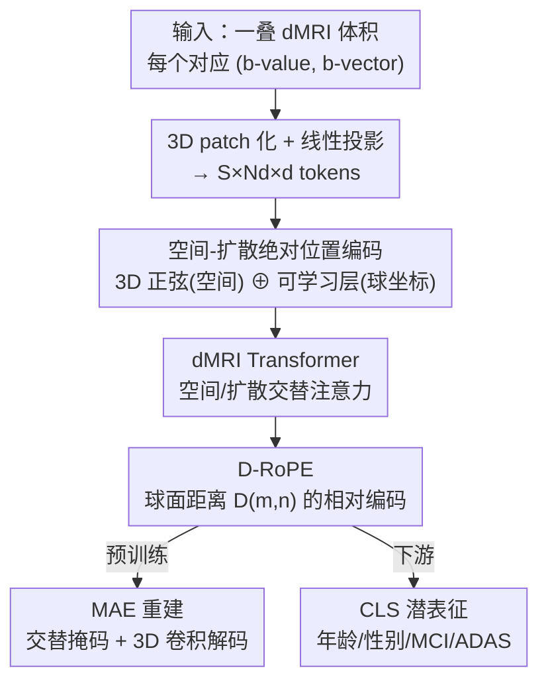

# Diffusion MRI Transformer with a Diffusion Space Rotary Positional Embedding (D-RoPE)

**会议**: CVPR 2026  
**论文**: [CVF Open Access](https://openaccess.thecvf.com/content/CVPR2026/html/Kung_Diffusion_MRI_Transformer_with_a_Diffusion_Space_Rotary_Positional_Embedding_CVPR_2026_paper.html)  
**代码**: https://github.com/gustavochau/D-RoPE （有）  
**领域**: 医学图像  
**关键词**: 扩散磁共振成像, 表示学习, 旋转位置编码, 掩码自编码, Transformer  

## 一句话总结
针对扩散磁共振（dMRI）数据「每个体积对应球面上一个采样方向、协议还各不相同」的特殊几何结构，本文设计了一个把旋转位置编码（RoPE）推广到扩散球面空间的 D-RoPE，配合空间/扩散交替注意力的 Transformer 和掩码自编码预训练，学到的通用表征在轻认知障碍分类上比基线高约 6% 准确率、在认知评分回归上相关系数提升约 0.05。

## 研究背景与动机
**领域现状**：扩散磁共振成像（dMRI）是临床上探测脑内水分子扩散、刻画白质完整性和微结构的常规手段，对阿尔茨海默、多发性硬化等疾病的早期信号很敏感。但相比 T1/T2 结构 MRI、fMRI 已经有不少「基础模型 / 通用表征」工作，dMRI 上的通用表征学习一直很落后——已有方法要么只针对某个具体任务（超分、微结构重建、纤维束特征），要么干脆没有从原始 dMRI 学通用表征。

**现有痛点**：dMRI 的数据结构很特别。一次采集不是一张图，而是一**叠**脑体积，每个体积对应一个扩散敏感梯度——由一个 b-value（扩散加权强度，决定球的半径）和一个 b-vector（梯度方向，球面上的一个点）共同决定，不同方向、不同强度下信号衰减完全不同。要建模 dMRI，必须同时刻画**空间结构**、**扩散加权强度**和**方向依赖**三者的耦合。更麻烦的是，不同采集协议方向数、b-value 数都不一样，传统模型（固定输入通道、固定方向数）根本吃不下这种「每个被试一个协议」的可变输入。

**核心矛盾**：现有位置编码（ViT 的可学习/正弦编码，以及视频里的 RoPE）都假设 token 排在一条**线性、有序**的序列上，用 $m-n$ 这样的整数相对距离。但 dMRI 的不同体积排在一个**球面 + 半径**的空间里，方向之间是球面夹角、强度之间是连续 b-value 差，根本没有线性顺序——硬套线性 RoPE 不仅不对，还把方向间的几何关系丢了。

**本文目标**：做一个能（1）联合建模空间 + 扩散空间依赖、（2）吃任意数量方向 / 任意协议、（3）学到可迁移通用表征的架构。

**切入角度**：作者从 dMRI 的物理几何出发——既然每个体积对应扩散空间 $\mathbb{R}^+ \times S^2$ 上的一个点 $(b, v)$，那位置编码就该按这个空间的真实距离来设计，而不是按 token 序号。

**核心 idea**：把 RoPE 里的线性相对距离 $m-n$ 替换成一个**专为扩散球面空间设计的距离** $D(m,n)$（融合 b-value 差与 b-vector 球面夹角），得到 D-RoPE；再用空间/扩散交替注意力的 Transformer + 掩码自编码（MAE）预训练，学出对协议不变的通用 dMRI 表征。

## 方法详解

### 整体框架
输入是一叠 dMRI 体积 $N_d$ 个，每个体积尺寸 $(N_x,N_y,N_z)$。先把每个体积切成 3D patch $(P_x,P_y,P_z)$ 并线性投影成 token，得到 $S \times N_d \times d$ 的 patch 嵌入（$S$ 是空间 patch 数，$N_d$ 是扩散方向数）。然后给每个 token 加上**绝对位置编码**：空间坐标 $(x,y,z)$ 用 3D 正弦编码成 $d/2$ 维向量 $p_s$，扩散方向的球坐标 $(\rho,\theta,\phi)$ 用一个可学习线性层编码成 $d/2$ 维向量 $p_d$，两者拼接后加到 patch 嵌入上。token 送入一个改造过的 ViT 编码器，其注意力块**在空间维和扩散维之间交替**（借鉴视频 Transformer 的时空交替注意力），并在注意力里注入相对位置信息 D-RoPE，让模型显式利用不同扩散体积之间的相互依赖。编码器输出的 CLS token 即下游任务用的潜在表征。

预训练用 MAE 闭环：mask 掉部分 token，让一个轻量解码器（同样的 Transformer 块 + 3D 卷积块）重建原始体积。整体是「切 patch → 绝对位置编码 → 交替注意力 + D-RoPE 编码器 → （预训练时）MAE 重建 / （下游时）取潜表征」的串行管线。

### 关键设计

**1. 空间-扩散绝对位置编码 + 交替注意力：让一个模型吃下任意协议**

dMRI 的难点之一是不同被试的方向数、b-value 都可能不同，ViT 的固定可学习/正弦位置编码假设 token 数和排列固定，遇到变协议就失效。本文把绝对位置编码拆成两半显式编码 dMRI 的两类坐标：空间位置 $(x,y,z)$ 用固定的 3D 正弦编码成 $p_s \in \mathbb{R}^{d/2}$；扩散方向用球坐标 $(\rho,\theta,\phi)$ 经一个可学习线性层编码成 $p_d \in \mathbb{R}^{d/2}$，二者拼接相加到 patch 嵌入。注意力块则借鉴视频 Transformer，在**空间维和扩散维之间交替**做注意力，而不是把所有 token 拉平做全注意力——这既把空间结构和方向依赖分开建模，又因为扩散维注意力对 token 数无结构假设，使编码器天然支持**任意数量的扩散体积**。正是这套设计让模型可以「每个被试一个采集协议」地训练和推理，无需把数据重采样到固定方案。

**2. D-RoPE：把旋转位置编码从线性序列推广到扩散球面空间**

这是全文核心。原始 RoPE 用一个分块对角的旋转矩阵 $R^d_{\alpha,m-n}$ 把第 $m$ 个 query 和第 $n$ 个 key 之间的**线性相对距离** $m-n$ 编进注意力，相似度为 $\langle q_m,k_n\rangle = q_m^\top R^d_{\alpha,m-n} k_n$，其中每个 $2\times2$ 块旋转角度 $\Delta\alpha_i$、$\alpha_i = 10000^{-2(i-1)/d}$。问题是 dMRI 的体积不排在一条线上：每个体积对应扩散空间 $\mathbb{R}^+ \times S^2$ 上的点 $(b,v)$，「相邻」该由 b-value 差和方向夹角定义，而非序号差。

D-RoPE 的做法是把 $m-n$ 整个换成一个**为扩散几何量身设计的距离** $D(m,n)$，旋转矩阵改用角度 $D\alpha_i$：

$$D(m,n) = D\big((b_m,v_m),(b_n,v_n)\big) = \sqrt{\gamma\,(b_m-b_n)^2 + \arccos^2(|v_m \cdot v_n|)}$$

其中第一项 $\gamma(b_m-b_n)^2$ 是 b-value（扩散强度）在线性空间的差，第二项 $\arccos^2(|v_m\cdot v_n|)$ 是两个 b-vector 在单位球面上的夹角平方，$\gamma\ge 0$ 平衡两者权重。一个关键巧思是 arccos 内取**绝对值** $|v_m\cdot v_n|$，从而带来 180° 对称性：方向 $v$ 和 $-v$ 被当作等价——因为正反梯度产生的扩散编码物理上相同。这样一来，注意力分数就编进了「两次扩散采集在球面上有多近」的真实几何，而不是无意义的序号距离。代价是这个距离不像线性 RoPE 那样能分解进 query/key 矩阵预乘，需要按对计算，复杂度从 $O(lh)$ 升到 $O(lh^2)$（$l$ 序列长、$h$ head 维）。

**3. 交替掩码的 MAE 预训练：逼模型同时学空间与方向关系**

为了无监督学通用表征，作者用 MAE 重建做预训练，但设计了**三种掩码并比较**：(i) 常规空间掩码（mask 掉 75% 空间 patch）、(ii) 扩散方向掩码（整条随机方向全部 mask 掉，比例 50%）、(iii) 前两者逐 epoch **交替**。重建损失是被掩/未掩 patch 的 MSE 加权和：

$$L = (1-\tau)L_{\text{unmasked}} + \tau L_{\text{masked}}$$

其中 $\tau$ 随 epoch 从 0.05 线性升到 0.95，让训练前期先学整体重建、后期聚焦补全被掩内容。直觉上，只做空间掩码模型可以靠同方向邻域偷懒，学不到方向间关系；只做方向掩码又缺空间约束（实验里「无 D-RoPE + 纯方向掩码」会重建出错误的整体强度）。交替掩码逼模型既补空间又补方向，最终配合 D-RoPE 取得最佳重建。下游任务统一采用「D-RoPE + 交替掩码」这个最优预训练权重。

### 损失函数 / 训练策略
预训练用上式 MSE 加权 MAE 损失，$\tau$ 余弦/线性 ramp。编码器 10 层、解码器 3 层 + 3 个 3D 卷积层，嵌入维 384，patch 大小 $(8,8,4)$。每 epoch 为省显存只取 4 张连续切片 + 15 个随机方向，兼作数据增强。下游评估三种方式：(1) 只微调最后一个编码层 + 预测头；(2) 冻结表征上做线性探测；(3) 冻结表征上接 MLP 头，输入均为 384 维 CLS token。下游每被试随机采 12 个方向/b-value 对（等于每人一个协议），五折交叉验证。

## 实验关键数据

### 主实验
数据：预训练用 HCP-YA（n=1065），下游用 HCP-D（612）、HCP-A（708）、ADNI 第四期（276）。下游四个任务——脑龄回归、性别分类、CN vs MCI 分类、ADAS 认知评分回归。

重建质量（HCP-YA 测试集，b=2000 为例，对比掩码策略与是否用 D-RoPE）：

| 配置 | 掩码 | PSNR ↑ | SSIM ↑ | FID ↓ |
|------|------|--------|--------|-------|
| MAE | Spatial | 14.91 | 0.969 | 13.49 |
| MAE | Diffusion | 10.07 | 0.844 | 39.86 |
| MAE | Alternating | 15.07 | 0.968 | 10.81 |
| MAE w/D-RoPE | Spatial | 15.26 | 0.972 | 9.61 |
| MAE w/D-RoPE | Diffusion | 15.31 | 0.973 | 9.99 |
| **MAE w/D-RoPE** | **Alternating** | **15.37** | **0.973** | **8.05** |

D-RoPE + 交替掩码在三个 b-value 下 FID 都最低，相对纯空间掩码 FID 降约 37–40%。尤其注意「无 D-RoPE + 纯方向掩码」PSNR 只有 ~10，重建强度错乱，说明缺了方向间关系建模就学不好。

下游临床任务（ADNI，CN vs MCI 分类 + ADAS 回归，本文方法标 *Ours*）：

| 方法 | 特征/头 | MCI BA ↑ | MCI AUROC ↑ | ADAS ρ ↑ | ADAS MSE ↓ |
|------|---------|----------|-------------|----------|------------|
| HC Features (Tract FA,MD) | Linear | 61.9% | 0.69 | 0.06 | 10.92 |
| 3D ResNet (FA/MD) | MLP, Full | 58.4% | 0.68 | 0.33 | 0.86 |
| ViT w/RoPE (Raw dMRI) | MLP, Full | 47.4% | 0.46 | -0.05 | 1.08 |
| **Ours** | **Frozen + MLP** | **64.7%** | 0.67 | **0.38** | **0.77** |
| Ours | 末层微调 + MLP | 60.9% | 0.66 | 0.32 | 0.88 |

在数据量有限的临床任务上，**冻结潜表征 + MLP** 拿到最高 MCI 平衡准确率 64.7% 和最好 ADAS 相关系数 0.38 / MSE 0.77，明显超过把原始 dMRI 喂给标准 3D-RoPE ViT（后者 BA 仅 47.4%、ρ 为负）。除 MCI-AUROC 和 age-MSE 外，本文最优方法 vs「ViT + 原始 dMRI」的差异在配对 t 检验 + Bonferroni 校正下均显著。

### 消融实验
| 配置 | 现象 | 说明 |
|------|------|------|
| 完整（D-RoPE + 交替掩码） | FID 8.05、FA error 0.055 | 重建与 DTI 指标整体最好 |
| w/o D-RoPE（纯空间掩码） | FID 13.49 | 缺相对方向建模，FID 高约 40% |
| w/o D-RoPE（纯方向掩码） | PSNR ~10、强度错乱 | 缺空间约束，重建整体强度错误 |
| 纯方向掩码 + D-RoPE | FID 9.99 | D-RoPE 把方向掩码救回到可用 |

DTI 指标（从重建图拟合扩散张量算 FA/MD 误差）上，D-RoPE + 交替/方向掩码 FA error 最低（0.055 vs 无 D-RoPE 的 0.074），说明重建保留了微结构信息。

### 关键发现
- **D-RoPE 是重建质量的主导因素**：去掉后 FID 抬高约 40%、纯方向掩码直接崩；它把「方向间几何关系」补进了注意力。
- **交替掩码与 D-RoPE 互补**：交替掩码逼模型同时学空间和方向，即便对无 D-RoPE 的基线也有帮助。
- **限数据场景优势最大**：在样本最少的 ADNI 临床任务上，冻结特征反而比全监督的 3D ResNet/ViT 更好，暗示预训练已内化了与认知衰退相关的微结构模式。⚠️ 性别分类上冻结线性反而比微调好，作者归因于样本少 + 性别差异随年龄变化，结论需谨慎。

## 亮点与洞察
- **把位置编码当几何先验来设计**：D-RoPE 不是加层加参数，而是认清「dMRI 体积排在球面+半径空间」这一物理事实，直接把 RoPE 的距离换成 b-value 差 + 球面夹角的复合距离——这种「让位置编码匹配数据真实拓扑」的思路可迁移到任何非线性排列的 token（点云法向、相机位姿球面、分子构象）。
- **arccos 内取绝对值的细节很巧**：用 $|v_m\cdot v_n|$ 实现 $v \equiv -v$ 的 180° 对称，正好对上「正反梯度物理等价」的领域知识，体现了把领域物理写进数学的功力。
- **交替掩码的设计动机清晰可验证**：空间/方向两种掩码各有盲区，交替强迫模型补齐两者，消融里能直接看到单一掩码各自怎么崩。
- **变协议鲁棒**：预训练和下游用了不同方向数、随机方向、每被试独立协议，全程不需重采样到固定方案，这对真实临床多源数据很实用。

## 局限与展望
- **作者承认**：D-RoPE 的距离不能像标准 RoPE 那样分解进 Q/K 矩阵预乘，得逐对算，复杂度从 $O(lh)$ 升到 $O(lh^2)$，计算成本更高。
- 绝对 PSNR 偏低（~15）⚠️：dMRI 本身信噪比低且做了 b0 归一化、未取对数，PSNR 数值不可直接与自然图像重建比，重建评估更应看 FID/DTI 指标。
- 临床绝对性能仍不高（MCI BA 仅 64.7%、ADAS ρ 0.38），离实用还远；且只在脑 dMRI、HCP/ADNI 这几个数据集验证，跨机构/跨疾病泛化未知。
- $\gamma$（b-value 与方向项的权重）作为超参怎么选、对结果多敏感，正文未充分展开。
- **可改进**：探索 D-RoPE 距离的可因子化近似以降复杂度；把方法迁到多 b-shell、更高阶球谐或脊髓/全身 dMRI；与结构 MRI/fMRI 联合做多模态基础模型。

## 相关工作与启发
- **vs 标准 RoPE / 3D-RoPE ViT**：它们在图像空间或线性序列上编相对位置，把原始 dMRI 当通道塞进 ViT 时方向几何全丢，临床任务直接崩（MCI BA 47.4%）；D-RoPE 在扩散球面空间编相对位置，限数据下反超。
- **vs 视频 Transformer 的时空注意力**：本文借了「两域交替注意力」的骨架，但把「时间维」换成「扩散方向维」，并为后者配了球面几何的 D-RoPE，而非时间上的线性 RoPE。
- **vs dMRI 任务专用模型（超分、微结构重建、纤维束特征）与图建模/改造卷积/上采样到统一协议等旧方案**：那些要么针对单一任务、要么强行把变协议对齐到固定方案；本文用绝对+相对位置编码原生支持任意协议，目标是**通用可迁移表征**。
- **vs 结构 MRI/fMRI 基础模型**：通用表征学习在 T1/T2、fMRI 上已较成熟，本文把这条路补到一直落后的原始 dMRI 上。

## 评分
- 新颖性: ⭐⭐⭐⭐⭐ 把 RoPE 推广到扩散球面空间、用物理几何定义 token 距离，角度新且贴合 dMRI 本质
- 实验充分度: ⭐⭐⭐⭐ 重建 + 四个下游任务 + 完整消融 + 显著性检验，但临床绝对性能与跨域泛化仍有限
- 写作质量: ⭐⭐⭐⭐ 动机—几何—公式链条清晰，图示到位
- 价值: ⭐⭐⭐⭐ 为长期落后的 dMRI 通用表征提供了可迁移、协议无关的预训练骨架与可复用的位置编码思路

<!-- RELATED:START -->

## 相关论文

- [\[CVPR 2026\] Masked-Diffusion Autoencoders for 3D Medical Vision Representation Learning](masked-diffusion_autoencoders_for_3d_medical_vision_representation_learning.md)
- [\[CVPR 2026\] MUST: Modality-Specific Representation-Aware Transformer for Diffusion-Enhanced Survival Prediction with Missing Modality](must_modality-specific_representation-aware_transformer_for_diffusion-enhanced_s.md)
- [\[CVPR 2026\] SPECTRE：面向体积 CT Transformer 的自监督与跨模态预训练](scaling_self-supervised_and_cross-modal_pretraining_for_volumetric_ct_transforme.md)
- [\[NeurIPS 2025\] Scalable Diffusion Transformer for Conditional 4D fMRI Synthesis](../../NeurIPS2025/medical_imaging/scalable_diffusion_transformer_for_conditional_4d_fmri_synthesis.md)
- [\[CVPR 2026\] Prospective Dynamic 3D MRI Reconstruction via Latent-Space Motion Tracking from Single Measurement](prospective_dynamic_3d_mri_reconstruction_via_latent-space_motion_tracking_from_.md)

<!-- RELATED:END -->
