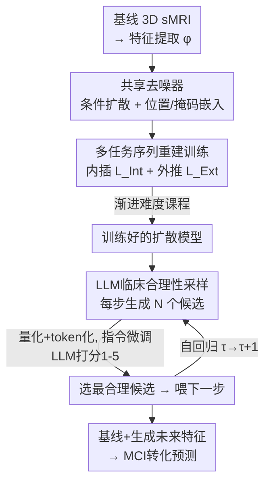

# Diffusion with a Linguistic Compass: Steering the Generation of Clinically Plausible Future sMRI Representations for Early MCI Conversion Prediction

**会议**: CVPR 2026  
**论文**: [CVF Open Access](https://openaccess.thecvf.com/content/CVPR2026/html/Tang_Diffusion_with_a_Linguistic_Compass_Steering_the_Generation_of_Clinically_CVPR_2026_paper.html)  
**代码**: 无（论文未公开）  
**领域**: 医学图像 / 扩散模型  
**关键词**: MCI转化预测, 纵向sMRI生成, 扩散模型, LLM临床合理性, 自回归生成  

## 一句话总结
MCI-Diff 用一张基线 sMRI 就"脑补"出未来 6–36 个月的纵向影像特征：先用多任务序列重建训练扩散模型解决随访时间不规则的问题，再用一个微调过的 LLM 当"语言罗盘"，按临床生物标志物给候选特征打分、挑出最合理的那个引导自回归生成，从而在保持即时性的同时把早期 MCI 转化预测准确率提升 5–12%。

## 研究背景与动机
**领域现状**：轻度认知障碍（MCI）有两种走向——恶化为进展型 pMCI，或保持稳定的 sMCI，提前预测患者会走哪条路对个性化治疗和临床试验分层很关键。主流做法基于结构 MRI（sMRI），分两派：**横断面方法**只用基线（0 月）那一张扫描，**纵向方法**用 0–36 月的多次随访扫描建模脑形态的时间演化。

**现有痛点**：两派各有死穴，存在一个**即时性 vs 准确率**的根本权衡。横断面方法拿到基线扫描就能立刻出结果（即时性高），但只有单时间点、看不到疾病进展信号，准确率受限；纵向方法靠时间轨迹做得更准，但必须等够 36 个月的随访数据才能预测，即时性被彻底牺牲——病人没法等三年才知道自己会不会恶化。

**核心矛盾**：准确率来自纵向的时间动态信息，而即时性要求只用基线数据，二者天然冲突。能不能"两头都要"？作者的设想是：**从基线扫描直接生成纵向轨迹的隐特征**，相当于用一张图把未来几次随访"补全"出来，这样既在最早时间点就能预测（即时性），又拿到了纵向方法依赖的进展信号（准确率）。

**切入角度与难点**：直接生成逼真的纵向 sMRI 序列很难。其一，GAN 训练不稳、VAE 容易后验坍缩，且 sMRI 维度高、空间相关复杂，朴素生成模型很难刻画 MCI 那种细微又异质的进展模式——所以作者选稳定性更好的**扩散模型**，并只在低维特征空间生成以省算力。其二，把 vanilla 扩散直接搬过来又有两个坑：MCI 随访**时间采样不规则**（病人常漏访），与标准扩散假设的均匀时间步冲突；**自回归生成会累积误差**，时间间隔不均时小偏差会滚雪球。

**核心 idea**：用"多任务序列重建训练"让扩散模型学会处理不规则时间步，再用一个 LLM 作为**临床合理性的外部裁判**，在自回归每一步从多个候选里挑临床上最讲得通的那个，把生成轨迹"掰回"真实的神经退化方向，从而压住误差累积。

## 方法详解

### 整体框架
MCI-Diff 的输入是患者基线的 3D sMRI（经预训练特征提取器 $\phi$ 压成低维特征向量），输出是自回归生成的未来各随访时间点 $\{6,12,18,24,36\}$ 月的 sMRI 特征序列 $\hat{Z}^{(p)}_{1:|\mathcal{T}|-1}$，最后把"基线特征 + 生成的未来特征"一起喂给分类器预测 pMCI/sMCI。整个方法分两个阶段：**阶段一**（训练）用多任务序列重建把一个共享去噪网络练成既能内插（补中间缺的时间点）又能外推（预测未来时间点）的"轨迹补全器"，专门对付不规则采样；**阶段二**（采样）在自回归生成时引入一个被指令微调过的 LLM 作为"语言罗盘"，每步对扩散模型抛出的 $N$ 个候选特征按临床合理性打分、选最优，逐步引导生成走向临床连贯的退化轨迹。

### 关键设计

**1. 多任务序列重建训练：用一个共享去噪器把"不规则随访"变成可学的内插/外推**

痛点是 MCI 随访时间采样不规则、病人常漏访，而标准扩散假设均匀时间步，导致缺中间点或缺末尾点时轨迹建模崩坏。作者的做法是把"补全轨迹"拆成两个任务、共用同一个去噪器 $\epsilon_\theta$。去噪器对长度 $|\mathcal{T}|$ 的固定序列工作，每个时间索引 $\tau$ 的输入由三部分逐元素相加成条件 $c_\tau = Z^{(p)}_\tau + P_\tau + M_\tau$：sMRI 特征 $Z^{(p)}_\tau$（缺失则填掩码占位）、位置嵌入 $P_\tau$（编码时间 $\tau$）、掩码嵌入 $M_\tau$（0 表示有、1 表示缺）；另用一个目标位置嵌入 $T_i$ 指明当前要预测哪个时间点 $i$。前向加噪 $q(Z_{i,t}|Z_{i,t-1})=\mathcal{N}(\sqrt{1-\beta_t}Z_{i,t-1},\beta_t I)$，反向去噪器预测噪声，训练目标是标准的 L2：$L=\mathbb{E}_{\epsilon,t}[\|\epsilon-\epsilon_\theta(x_t,T_i,t)\|_2^2]$。

在此之上分出两个任务。**内插任务**（$L_{\text{Int}}$）随机遮住一个中间时间点 $i\in\{1,\dots,|\mathcal{T}|-2\}$，让去噪器靠两侧已知特征把它重建出来，既是初始训练也能用来给只缺单个中间点的序列做数据增强（补全后回灌训练集）。**外推任务**（$L_{\text{Ext}}$）则随机选一个预测视野 $k$，把 $i$ 及其之后所有时间点全部遮住，只用 $i$ 之前的信息预测未来，这正是自回归生成的核心能力。两个任务损失同形，区别只在遮罩方式——一个遮中间、一个遮末尾及之后。这样一来，"漏访"不再是障碍，反而被当成天然的内插/外推训练样本利用起来。

**2. 渐进难度课程：从补单点到只靠基线"裸推"，让训练终点对齐自回归生成起点**

光有内插/外推还不够——如果一上来就让模型只看基线去推 36 个月，太难、会收敛到次优解。作者设计了一个渐进难度调度（Algorithm 1）：从完整序列开始、难度 $d=1$，每轮先做内插（遮 $d$ 个中间点）、再做外推（遮 $d$ 个末尾点），并用模型自己补全的不完整序列回灌增强数据，然后 $d$ 递增直到 $D_{\max}$。难度越高，模型可用的信息越少。关键在于：当 $d=D_{\max}$ 且做外推时，模型要**仅凭基线 + 此前已生成特征**去预测下一个时间点，这恰好就是自回归生成的第一步——于是训练的最难档位天然对齐了推理时的生成模式，让模型平滑过渡到"只给一张基线图就生成整条未来轨迹"的最终目标。消融显示这种渐进课程在 $d=4$ 时最优，过低会欠拟合、过高强迫模型学到更鲁棒的表示。

**3. LLM 语言罗盘：把抽象特征翻译成临床生物标志物，按合理性打分压住误差累积**

自回归生成的致命问题是误差滚雪球：某一步稍微偏离真实退化模式，后续就越错越离谱，尤其在时间间隔不均时。作者的破局点很巧——引入一个**外部临床裁判**给每步生成做质检。具体分两步。首先是**面向临床解释的指令微调**：把扩散模型生成的连续 sMRI 特征 $Z^{(p)}_\tau$ 经简单量化 + token 化变成离散序列，构造"token 化 sMRI 特征 ↔ 对应 FreeSurfer 结构测量值（如左海马体积、内嗅皮层、脑室大小等）"的配对数据集，微调 LLM 学会从抽象特征向量预测出具体的临床生物标志物——相当于教 LLM 把模型的"黑盒特征"翻译成医生看得懂的解剖测量。

然后是**LLM 引导的自回归采样**（Algorithm 2）：在每个时间步 $\tau$，扩散模型先抛出 $N$ 个候选特征 $\{\hat{Z}^{(p,n)}_\tau\}_{n=1}^N$，逐个 token 化后喂给微调好的 LLM，由它预测各候选对应的 FreeSurfer 测量并按 MCI 进展的临床合理性打分（1–5 分，5 最佳，并给出"海马萎缩 + 脑室扩大，方向上符合 MCI 进展"这类理由）；取得分最高的候选作为 $\hat{Z}^{(p)}_\tau$ 进入下一步。这就是标题里的"语言罗盘"：LLM 不直接生成，而是在每个岔路口用临床知识为扩散模型指方向，把那些数值上像但临床上不合理（比如海马反而增大）的候选淘汰掉，从而让整条轨迹始终贴着真实的神经退化规律，有效抑制误差累积。

### 损失函数 / 训练策略
训练只用两个同形的 L2 去噪损失：内插 $L_{\text{Int}}$（遮中间点）与外推 $L_{\text{Ext}}$（遮末尾及之后），由渐进难度课程交替调度并用模型自补全数据增强。LLM 侧是独立的指令微调（特征→FreeSurfer 测量的监督学习），与扩散模型解耦。特征提取器用预训练的 HFCN，FreeSurfer 7.4.1 抽结构特征；sMRI 先归一化到 MNI152、去颅骨、偏置场校正。

## 实验关键数据

### 主实验
在 ADNI（ADNI-1 训练 / ADNI-2 测试）、AIBL（验证泛化）和 ADNI1+ADNI2 合并集（5 折交叉验证）上，对比横断面（HFCN、DA-MIDL、MPS-FFA、HMSA）、纵向（AD-RNN、VGG-TS、HFCN+）和生成式（VAE、Temp-GAN）共 9 个基线，指标为 ACC/SEN/SPE/AUC。

| 数据集 | 指标 | MCI-Diff(本文) | 最强基线 | 提升 |
|--------|------|------|----------|------|
| ADNI | ACC | **0.950** | 0.899 (HFCN+) | +5.1% |
| ADNI | AUC | **0.948** | 0.897 (HFCN+) | +5.1% |
| AIBL | ACC | **0.936** | 0.873 (HFCN+) | +6.3% |
| AIBL | AUC | **0.914** | 0.853 (HFCN+) | +9.6% |
| ADNI1+2 (5折) | ACC | **0.954 ± 0.008** | 0.904 (HFCN+) | +5.0% |
| ADNI1+2 (5折) | AUC | **0.950 ± 0.009** | 0.902 (HFCN+) | +4.8% |

关键看点：纵向基线（HFCN+ 0.899）确实普遍强于横断面同源模型（HFCN 0.809），印证时间信息的价值；而 MCI-Diff 只用一张基线图生成轨迹，却反超最强纵向基线 HFCN+ 约 5 个点，且远超 VAE（0.730）、Temp-GAN（0.791）等生成式基线——说明它生成的未来特征不只是"看起来合理"，而是对转化预测**高度可判别**。

### 消融实验
| 配置 | ADNI ACC | 说明 |
|------|---------|------|
| Full Model (Ours) | **0.950** | 完整模型 |
| w/o Interpolation Task | 0.841 | 去掉内插任务，掉 ~10.9% |
| w/o Interpolation Aug. | 0.869 | 去掉内插数据增强 |
| w/o Extrapolation Task | 0.838 | 去掉外推任务，掉最多 ~11.2% |
| w/o Extrapolation Aug. | 0.923 | 去掉外推数据增强 |
| w/o Feature Adaptation | 0.893 | 去掉特征→token 适配 |
| w/o LLM-Guidance | 0.870 | 去掉 LLM 引导，掉 ~8.0% |

### 关键发现
- **外推任务贡献最大**：去掉后 ACC 从 0.950 跌到 0.838，因为它直接对应"预测未来特征"这一核心能力；内插任务次之（跌到 0.841）。
- **LLM 引导确有价值**：去掉后掉到 0.870，验证临床知识对压制误差累积的作用；Fig. 6 显示加了 LLM 后高分（S4/S5）候选占比明显上升、分布向真实数据靠拢。
- **超参敏感性**（Fig. 3）：扩散步数 $T$ 在 40 附近达峰、之后趋稳；终止难度 $d=4$ 最优；候选集 $N$ 越大越好、$N=20$ 后收益递减；去噪器层数 $L=6$ 为最佳平衡，太浅（$L=2$）容量不足。
- Fig. 5 显示生成特征的生物标志物 MAE 误差与稳定性随 LLM 打分提升而改善，佐证"高分候选更接近真实"。

## 亮点与洞察
- **把"漏访"从缺陷变成训练资源**：不规则随访本是纵向 MCI 研究的老大难，作者用内插/外推双任务 + 自补全增强，反过来把缺失时间点当成天然训练样本，思路很顺。
- **LLM 当"裁判"而非"生成器"**：这是最"啊哈"的设计——不让 LLM 直接生成医学特征（它也生成不了高维 sMRI），而是让它把特征翻译成 FreeSurfer 测量再打分，把领域临床知识以"打分罗盘"的轻量形式注入扩散采样。这种"生成模型出候选、LLM 按可解释指标选优"的范式可迁移到其他需要领域合理性约束的生成任务（如分子生成、时序医疗信号）。
- **训练终点对齐推理起点**：渐进课程把最难档位设计成"仅凭基线裸推"，让训练自然衔接自回归生成，避免了 train-test 行为脱节，是个干净的工程巧思。

## 局限与展望
- **未开源、实现细节藏在 Appendix**：batch size、扩散步数、硬件等关键配置正文未给全，复现门槛偏高（⚠️ 部分细节以原文 Appendix 为准）。
- **依赖 FreeSurfer 标注做 LLM 监督**：LLM 指令微调需要"特征↔结构测量"配对，FreeSurfer 提取本身有误差且耗时，标注质量会直接影响罗盘的可靠性。
- **只在特征空间生成、不还原影像**：方法生成的是低维特征而非真正的 sMRI 图像，可省算力但牺牲了可视化与影像级临床审查能力，临床医生难以直接"看"生成结果。
- **LLM 每步对 $N$ 个候选打分**：自回归 × 候选集会带来不小的推理开销，$N=20$ 时每个患者要做约 20×步数 次 LLM 调用，所谓"实时风险评估"的即时性主要相对纵向的三年随访而言，单次推理成本仍需关注。
- **可改进方向**：把 LLM 打分从"选优"升级为"可微引导"（如用打分梯度直接调制扩散去噪），或引入多模态（PET、认知量表）让罗盘更全面。

## 相关工作与启发
- **vs 横断面方法（HFCN、DA-MIDL）**：它们只用基线、缺时间动态，准确率受限；本文用基线生成纵向轨迹补上时间信息，在同样即时的前提下大幅提分。
- **vs 纵向方法（HFCN+、VGG-TS）**：它们靠真实随访扫描，准确但要等数年；本文"生成"出纵向特征，保住即时性还反超它们。
- **vs 生成式基线（VAE、Temp-GAN）**：VAE 易后验坍缩、GAN 训练不稳，且都缺临床合理性约束；本文用扩散保证稳定生成 + LLM 罗盘保证临床连贯，生成特征不仅逼真还高度可判别，ACC 高出 0.15–0.22。

## 评分
- 新颖性: ⭐⭐⭐⭐⭐ 首个用扩散生成未来 sMRI 特征做早期 MCI 预测，且"LLM 当临床罗盘选候选"的设计很别致。
- 实验充分度: ⭐⭐⭐⭐ 三套数据集 + 9 基线 + 完整消融与超参分析，扎实；但缺真实影像级评估与开源。
- 写作质量: ⭐⭐⭐⭐ 动机—难点—方法逻辑清晰，两阶段框架讲得明白，部分实现细节藏在 Appendix。
- 价值: ⭐⭐⭐⭐⭐ 同时拿下即时性与准确率，对早期 MCI 干预与临床试验分层有实际意义。

<!-- RELATED:START -->

## 相关论文

- [\[ICLR 2026\] COMPASS: Robust Feature Conformal Prediction for Medical Segmentation Metrics](../../ICLR2026/medical_imaging/compass_robust_feature_conformal_prediction_for_medical_segmentation_metrics.md)
- [\[CVPR 2026\] Clinically-Grounded Counterfactual Reasoning for Medical Video Diagnosis](clinically-grounded_counterfactual_reasoning_for_medical_video_diagnosis.md)
- [\[CVPR 2026\] Sketch2CT: Multimodal Diffusion for Structure-Aware 3D Medical Volume Generation](sketch2ct_multimodal_diffusion_for_structure-aware_3d_medical_volume_generation.md)
- [\[CVPR 2026\] MUST: Modality-Specific Representation-Aware Transformer for Diffusion-Enhanced Survival Prediction with Missing Modality](must_modality-specific_representation-aware_transformer_for_diffusion-enhanced_s.md)
- [\[CVPR 2026\] Few-Shot Synthetic Data Generation with Diffusion Models for Downstream Vision Tasks](few-shot_synthetic_data_generation_with_diffusion_models_for_downstream_vision_t.md)

<!-- RELATED:END -->
