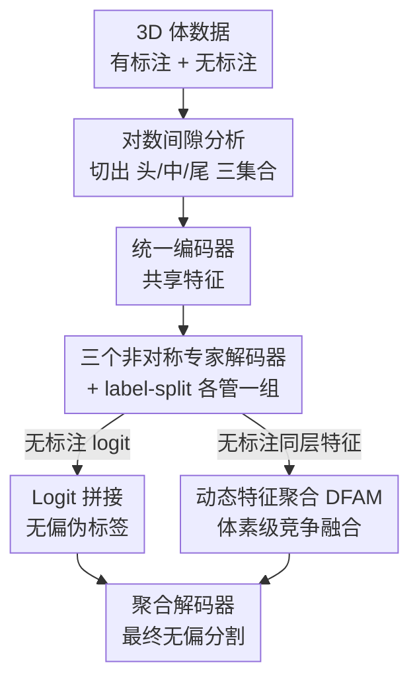

# Divide, Conquer, and Aggregate: Asymmetric Experts for Class-Imbalanced Semi-Supervised Medical Image Segmentation

**会议**: CVPR 2026  
**论文**: [CVF Open Access](https://openaccess.thecvf.com/content/CVPR2026/html/Liu_Divide_Conquer_and_Aggregate_Asymmetric_Experts_for_Class-Imbalanced_Semi-Supervised_Medical_CVPR_2026_paper.html)  
**代码**: https://github.com/PHPJava666/DCA (有)  
**领域**: 医学图像  
**关键词**: 半监督分割, 类别不平衡, 多器官分割, 专家解码器, 伪标签  

## 一句话总结
针对多器官半监督分割里"小器官被大器官淹没"的问题，DCA 用一个共享编码器 + 三个为头/中/尾类别量身定制的非对称专家解码器分而治之，再通过 logit 拼接和动态特征聚合模块把三个专家的预测/特征融合成无偏结果，在 Synapse 20% 标注上把平均 Dice 从 68.4 推到 73.2。

## 研究背景与动机
**领域现状**：半监督医学图像分割（SSMIS）想用少量标注 + 大量无标注数据逼近全监督性能，主流做法是给无标注数据生成高质量伪标签（mean-teacher、CPS、BCP 等）。

**现有痛点**：这些通用方法大多在 ACDC、LA 这类只有几个前景类的数据集上调出来，一旦搬到 13~15 个器官的多器官 CT 上就崩——肝脏、脾脏这种大器官占体素比例几十个百分点，肾上腺、食道这种小器官只有零点几个百分点。表 1 里 UA-MT、URPC 在 Synapse 上对食道（Es）、左右肾上腺（RAG/LAG）的 Dice 直接是 0。

**核心矛盾**：作者指出，专门做"类别不平衡半监督"的工作（CReST、SimiS、Adsh 等）几乎都在处理**有标注与无标注子集之间的类别分布失配**——这是自然图像里的典型问题，但在医学图像里器官大小比例在有标注和无标注子集间是基本一致的（论文图 2 验证）。所以那套方法用错了地方。医学场景真正的瓶颈是另一件事：DHC、GA、SKCDF 这些方法都**靠单个解码器输出全部类别**，让同一套共享参数同时去拟合尺度差几十倍的器官，梯度自然被多数类主导，尾部小器官学不好。

**本文目标**：把"一个解码器扛所有类别"这个结构性瓶颈拆掉，让不同尺度的器官各有专人负责，同时还要把这些专人的能力无偏地融合回一张完整分割图。

**切入角度**：作者从分治（divide and conquer）范式出发——既然器官按解剖学先验天然分成"大/中/小"几个簇（图 2 显示即使标注比例变化，头尾器官的排序也相对固定），那就按这个分层给每一档配一个架构不同的专家解码器。

**核心 idea**：Divide（数据驱动地把前景类分成头/中/尾三组）→ Conquer（三个非对称专家各管一组、各自反传）→ Aggregate（logit 拼接出无偏伪标签 + 动态特征聚合出最终预测）。

## 方法详解

### 整体框架
DCA 由一个**统一编码器**、三个**非对称专家解码器**（头/中/尾）和一个**聚合解码器**组成，整条流水线严格按 "Divide → Conquer → Aggregate" 三步走。

输入是 3D 体数据 $x \in \mathbb{R}^{H\times W\times D}$，数据集 $D = D_l \cup D_u$ 分有标注和无标注两部分。**Divide** 阶段离线对有标注集做一次对数间隙分析，把 $K$ 个前景类一次性切成 $S_H$（头）、$S_M$（中）、$S_T$（尾）三个固定集合。**Conquer** 阶段，有标注和无标注体数据都过共享编码器，再并行喂给三个专家解码器；每个专家只用属于自己集合的标签子集做监督（label-split），各自的监督损失互不干扰。对无标注数据，三个专家的原始 logit 通过 **logit 拼接**组装成一张无偏的融合伪标签。**Aggregate** 阶段，一个聚合解码器在每个上采样级用 DFAM 模块把三个专家的同层特征做体素级竞争融合，最后用前面那张融合伪标签来监督聚合解码器的输出。

### 关键设计

**1. 对数间隙分析：用分布"悬崖"自动切出头/中/尾，而不是拍脑袋定阈值**

痛点很直接：怎么把器官分成三档？固定阈值（如占比 <1% 算尾部、>10% 算头部）对阈值极其敏感，换个数据集分组就乱套。作者改用数据驱动的方式：先遍历整个有标注集统计每类的体素总数 $V_k = \sum_i \sum_p \mathbb{I}(y^l_i(p)=k)$，再对前景体素总数归一化得到占比 $P_k = V_k / V_{fg}$。关键一步是不看占比的绝对大小，而看排序后相邻占比之间的"陡坡"——把 $P_{(1)} \ge P_{(2)} \ge \cdots \ge P_{(K)}$ 排好，定义对数间隙

$$G_j = \log P_{(j)} - \log P_{(j+1)} = \log\left(\frac{P_{(j)}}{P_{(j+1)}}\right)$$

$G_j$ 大就说明第 $j$ 和第 $j{+}1$ 名之间有一道天然的分界。取 $G_j$ 序列里两个最显著的峰作为切分点：$k_{HM} = \arg\max_j G_j$（头/中分界），$k_{MT} = \arg\max_{j>k_{HM}} G_j$（中/尾分界），由此得到三个**永久不变**的集合 $S_H = \{c_{(j)} | 1\le j \le k_{HM}\}$、$S_M$、$S_T$。这样切出来的分组天然贴合解剖学先验（肝脾在头、肾上腺食道在尾），且跨数据集一致、不引入任何额外超参。消融（表 4）显示在 2% 标注 AMOS 上，对数间隙分组比均匀分组高约 4.4% Dice，比固定阈值高约 1.95%。

**2. 三个非对称专家解码器 + label-split 监督：让每档器官有"专门的脑回路"，且互不抢梯度**

既然尺度差异是病根，那就让三个解码器架构本身就不一样（以 V-Net 为骨干）。头部解码器 $D_H$ 处理大器官，用空洞卷积（dilation=2）扩大感受野，同时把卷积层数压到 $\{2,2,1,1\}$ 防止对细节过拟合；中部解码器 $D_M$ 保持原版 V-Net 配置 $\{3,3,2,1\}$、dilation=1，做一个平衡上下文与细节的通用分割器；尾部解码器 $D_T$ 为了榨取小目标细节，把层数加深到 $\{4,4,3,2\}$、保持 dilation=1 以免模糊小目标边界。

光有架构差异还不够，作者用 **label-split** 强制专业化：把标注 $y^l$ 拆成三份偏标签，生成 $y^l_H$ 时所有不属于 $S_H$ 的体素都被重映射到背景类 0，

$$y^l_H(p) = \begin{cases} y^l(p) & \text{if } y^l(p) \in S_H \\ 0 & \text{otherwise} \end{cases}$$

$y^l_M, y^l_T$ 同理。每个专家用 $\mathcal{L}_{seg}=(\mathcal{L}_{Dice}+\mathcal{L}_{CE})/2$ 在自己的偏标签上单独反传，$\mathcal{L}_{sup}=\mathcal{L}^H_{sup}+\mathcal{L}^M_{sup}+\mathcal{L}^T_{sup}$。这一步的精髓是：尾部专家的反向传播被**限制在尾部类别集合**内，大器官的梯度根本进不来，从根上消除了多数类梯度对少数类学习的干扰。消融里只加三专家结构能涨 7.46% Dice（食道从 0→46.3%、RAG 从 0→39.1%），再加上 label-split 又猛涨 14.51%——后者才是真正把专业化激活的开关。

**3. Logit 拼接：在预测级直接"各取所长"拼出无偏伪标签，不做会互相打架的平均**

无标注数据要生成伪标签。常规做法是把多个分支的 softmax 概率平均，但这里三个专家各自只擅长自己那档，强行平均会让不擅长的专家拖后腿。作者反其道而行：直接从三个专家的**原始 logit** 按类别归属拼接。对任意前景类 $c$，logit 只从负责它那一档的专家取：

$$p^u_{fuse}(p)[c] = \begin{cases} p^u_H(p)[c] & c \in S_H \\ p^u_M(p)[c] & c \in S_M \\ p^u_T(p)[c] & c \in S_T \end{cases}$$

背景通道 $c=0$ 是唯一被三个专家共同训练的（因为非目标类都被映射成了 0），所以对背景取三者平均 $p^u_{fuse}(p)[0]=\frac{1}{3}(p^u_H(p)[0]+p^u_M(p)[0]+p^u_T(p)[0])$ 形成稳健共识。最终伪标签 $\hat{y}^u_{fuse}=\arg\max(p^u_{fuse})$。这张伪标签尊重了 label-split 强加的专业化，避免了"平均把好预测稀释掉"。

**4. 动态特征聚合模块 DFAM：在特征级让三个专家逐体素竞争上岗**

伪标签只在预测级融合，作者还想在特征级把专家的先验知识也注入到最终分割里，于是设计了只吃无标注数据的聚合解码器 $D_A$，并在每个上采样级插入 DFAM。DFAM 收四路输入：聚合流自身的特征 $F_{up}$，加上三个专家解码器同层的 $F_H, F_M, F_T$。先各过 $1\times1\times1$ 卷积统一通道再拼接成富信息先验 $F_{con}=\text{Concat}(\text{Conv}(F_H),\text{Conv}(F_M),\text{Conv}(F_T))$；再过一个轻量门控（$3\times3\times3$ 卷积 → ReLU → $1\times1\times1$ 卷积）输出三通道，经通道 softmax 得到三张空间注意力图

$$\{A_H, A_M, A_T\} = S(\text{Conv}_{1\times1\times1}(R(\text{Conv}_{3\times3\times3}(F_{con}))))$$

它们满足逐体素 $A_H(p)+A_M(p)+A_T(p)=1$，即在每个空间位置上三个专家**竞争**谁说了算。加权求和得专家聚合特征 $F_{expert}=A_H\otimes F_H + A_M\otimes F_M + A_T\otimes F_T$，再和上采样流残差融合 $F_{DFAM}=F_{expert}+F_{up}$。这样在小器官区域尾部专家的注意力自然占优、在大器官区域头部专家占优，进一步压制多数类偏置。加上 DFAM 还能再涨 3.31% Dice。

### 损失函数 / 训练策略
聚合解码器的输出 $p^u_A$ 用前面的融合伪标签做无监督监督：$\mathcal{L}_{un}=\mathcal{L}_{seg}(p^u_A, \hat{y}^u_{fuse})$。总目标 $\mathcal{L}_{total}=\mathcal{L}_{sup}+\lambda\mathcal{L}_{un}$，$\lambda$ 经验设为 10（带 warm-up）。骨干为 3D V-Net，SGD 初始学习率 0.01，patch $96^3$，batch=4（2 标注 + 2 无标注），单卡 RTX 6000 训练。注意从框架图看，无标注特征流向聚合解码器时对专家分支做了 stop-gradient，避免聚合路径反过来污染专家的专业化。

## 实验关键数据

### 主实验
两个多器官数据集：Synapse（13 类，20% 标注）与 AMOS（15 类，5% 标注），指标为平均 Dice（越高越好）和平均表面距离 ASD（越低越好）。

| 数据集 | 设置 | 指标 | DCA(本文) | 次优 GA | 提升 |
|--------|------|------|-----------|---------|------|
| Synapse | 20% 标注 | Avg. Dice | **73.20** | 68.43 | +4.77 |
| Synapse | 20% 标注 | Avg. ASD | 1.78 | 3.11 | 更优 |
| AMOS | 5% 标注 | Avg. Dice | **69.90** | 63.51 | +6.39 |
| AMOS | 5% 标注 | Avg. ASD | 2.66 | 4.58 | 更优 |

DCA 在 Synapse 上对最难的小器官 RAG（51.8）、LAG（63.7）拿到最高分，同时大器官 St、中器官 RK/LK 也是 top-3，做到了大小器官的双赢；在 AMOS 5% 这种极端少标注设置下，DCA 在**全部 15 个器官**上都是最高 Dice。值得注意的是，多数通用方法（UA-MT 20.26、URPC 25.68）在 Synapse 上几乎崩溃，而 DCA 甚至超过了全监督 V-Net（62.09）。

### 消融实验
组件消融（Synapse 20%，表 3）：

| 配置 | Avg. Dice | 说明 |
|------|-----------|------|
| V-Net baseline（仅标注） | 47.92 | 单解码器，尾部 Es/RAG/LAG 全 0 |
| + 三专家解码器 | 55.38 | +7.46，尾部从 0 起活（Es 46.3） |
| + Log-Gap label-split | 69.89 | +14.51，专业化真正生效 |
| + DFAM（Full） | **73.20** | +3.31，特征级聚合补刀 |

分组策略与专家架构消融（AMOS 5%，表 4/5）：

| 消融维度 | 配置 | Avg. Dice |
|----------|------|-----------|
| 分组策略 | 均匀分组 | 67.79 |
| 分组策略 | 固定阈值 | 69.90* |
| 分组策略 | 对数间隙(本文) | 69.90 |
| 专家架构 | V1 全对称 | 60.25 |
| 专家架构 | V2 仅调层数 | 67.33 |
| 专家架构 | V3 仅调空洞 | 64.96 |
| 专家架构 | V2+V3(本文) | **69.90** |

> ⚠️ 表 4 在 5% AMOS 上固定阈值与对数间隙数值并列（均 69.90），论文只在 2% 设置下（59.88 vs 57.93）拉开差距，说明对数间隙的优势主要体现在标注更稀缺/更易踩阈值坑的场景；以原文为准。

### 关键发现
- **label-split 是最大功臣**：单加三专家结构只涨 7.46%，但叠上 Log-Gap label-split 一下涨 14.51%——说明光有架构差异不够，必须用偏标签把每个专家的梯度锁死在自己的类别集合里才能真正专业化。
- **非对称设计缺一不可**：V2（只调层数深浅）涨 7.08%、V3（只调空洞率）涨 4.71%，两者结合（深尾部 + 浅且大感受野头部）才达到最佳，印证"深 $D_T$ 抓小目标细节、浅 $D_H$ 扩感受野管大器官"的分工假设。
- **尾部器官受益最明显**：通用方法在 Es/RAG/LAG 上常年 0 分，DCA 把它们拉到 50~64，t-SNE 也显示更紧凑的类内聚合和更清晰的类间分界。

## 亮点与洞察
- **重新定位了问题**：作者明确指出医学图像里"有标注/无标注分布失配"不是主要矛盾（器官比例本就一致），真正瓶颈是"单解码器扛全类别"，这个 reframing 让整个方法的动机非常扎实，不是套通用不平衡半监督的壳。
- **对数间隙分组很巧**：用相邻占比的对数差找分布"悬崖"，比固定阈值鲁棒、跨数据集一致、零额外超参，是个可直接迁移到其他长尾分组场景（如长尾分类的 head/medium/tail 划分）的小 trick。
- **logit 拼接 vs softmax 平均**：当多个分支各有专精时，拼接原始 logit 而非平均概率能避免"外行拖内行后腿"，这个思路在多专家/MoE 风格的分割里值得复用。
- **DFAM 的体素级竞争**：用 softmax 约束三专家注意力逐体素和为 1，等于让每个像素自动选最懂它的专家，比简单 concat+conv 的融合在 t-SNE 和激活图上都更干净。

## 局限与展望
- **专家数量写死为 3**：头/中/尾三档是手工设定的粒度，对类别极多或分布更复杂的数据集，3 个专家是否最优、能否自适应决定专家数，论文没探讨。
- **参数与显存开销**：三个专家解码器 + 一个聚合解码器，相比单解码器方法参数量明显增大，论文未给出 FLOPs/参数量对比，落地时的成本需自行评估（⚠️ 原文未报告效率指标）。
- **聚合解码器只吃无标注数据**：$D_A$ 仅用无标注流训练，依赖 logit 拼接伪标签的质量；若三专家本身在某档上都不行，拼出来的伪标签会有系统性错误，缺乏纠错机制。
- **跨数据集泛化**：分组在有标注集上离线确定，若部署数据的器官比例分布与训练集差异大，固定分组可能失配。

## 相关工作与启发
- **vs DHC / GA / SKCDF**：这三者都是"单解码器 + 改损失/加平衡头"路线——DHC 用分布与难度双重去偏权重，GA 重设计 Dice/CE 梯度，SKCDF 加平衡分割头。DCA 的根本区别是**从架构上把任务解耦**给多个非对称专家，而非在一个解码器上修修补补，因此对尾部器官的提升幅度（Synapse +4.77、AMOS +6.39）明显更大。
- **vs CReST / SimiS / Adsh（自然图像不平衡半监督）**：这些方法处理的是有标注与无标注的分布失配，DCA 论证了该问题在医学图像里基本不存在，转而攻击真正的瓶颈（单解码器尺度冲突），在多器官 CT 上把它们远远甩开（表 1 里它们多在 35~48 Dice）。
- **vs MoE / 分治范式**：DCA 可看作把"分而治之"落到分割解码器上的实例化，但它的专家不是同构 + 路由，而是**为不同尺度量身定制架构 + 静态类别路由（label-split）**，并配了 logit 拼接和 DFAM 两级聚合，这套"非对称专家 + 双级聚合"组合是它区别于普通 MoE 的地方。

## 评分
- 新颖性: ⭐⭐⭐⭐ 把单解码器瓶颈 reframe 成尺度冲突，用非对称专家 + 对数间隙分组 + 双级聚合解决，思路清晰且有效
- 实验充分度: ⭐⭐⭐⭐ 两个多器官数据集、18 个 SOTA 对比、组件/分组/架构/融合四组消融，较完整；缺参数量与效率分析
- 写作质量: ⭐⭐⭐⭐ Divide/Conquer/Aggregate 三段叙事清楚，公式和图配合好；个别消融表数值并列处解释偏少
- 价值: ⭐⭐⭐⭐ 在临床高价值的多器官小器官分割上显著涨点，分治式专家解码器和对数间隙分组都有迁移潜力

<!-- RELATED:START -->

## 相关论文

- [\[CVPR 2026\] Semantic Class Distribution Learning for Debiasing Semi-Supervised Medical Image Segmentation](semantic_class_distribution_learning_for_debiasing.md)
- [\[CVPR 2026\] A Semi-Supervised Framework for Breast Ultrasound Segmentation with Training-Free Pseudo-Label Generation and Label Refinement](a_semi-supervised_framework_for_breast_ultrasound_segmentation_with_training-fre.md)
- [\[CVPR 2026\] SemiGDA: Generative Dual-distribution Alignment for Semi-Supervised Medical Image Segmentation](semigda_generative_dual-distribution_alignment_for_semi-supervised_medical_image.md)
- [\[CVPR 2026\] SegMoTE: Token-Level Mixture of Experts for Medical Image Segmentation](segmote_token-level_mixture_of_experts_for_medical_image_segmentation.md)
- [\[CVPR 2026\] Semi-supervised Echocardiography Video Segmentation via Anchor Semantic Awareness and Continuous Pseudo-label Reforging](semi-supervised_echocardiography_video_segmentation_via_anchor_semantic_awarenes.md)

<!-- RELATED:END -->
