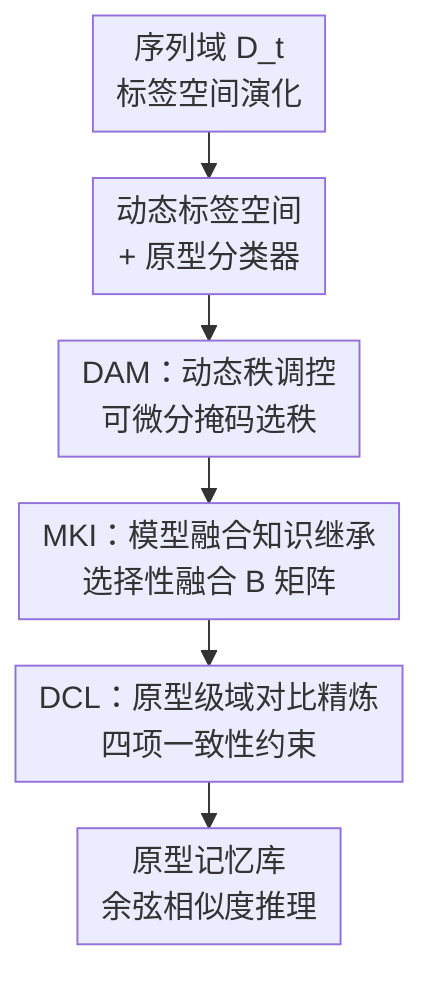

# DK-DDIL: Adaptive Knowledge Retention for Dynamic Domain-Incremental Learning in Medical Imaging

**会议**: CVPR 2026  
**论文**: [CVF Open Access](https://openaccess.thecvf.com/content/CVPR2026/html/Ma_DK-DDIL_Adaptive_Knowledge_Retention_for_Dynamic_Domain-Incremental_Learning_in_Medical_CVPR_2026_paper.html)  
**代码**: 未公开  
**领域**: 医学图像 / 持续学习  
**关键词**: 域增量学习, 持续学习, LoRA, 动态秩, 知识保留

## 一句话总结
针对真实临床里"成像设备/机构/病种不断变、标签空间也在长大"的动态域增量场景，DK-DDIL 用一个可微分动态秩的 LoRA 适配器（DAM）按域复杂度自动伸缩模型容量，再用一套模型融合 + 原型对比的知识继承机制（KIR）压住灾难性遗忘，全程不回放历史数据，在皮肤病理、3D MRI 和 OfficeHome 三个基准上都超过现有 DIL 方法，且只训练 0.26% 参数。

## 研究背景与动机
**领域现状**：医学影像里基础模型（ViT、CLIP 等）泛化很强，但都是在静态封闭数据集上训练的。现实临床数据是流式产生的——新设备、新机构、新病种持续涌入，分布一变模型就崩。重训大模型算力扛不住，跨机构共享数据又被隐私法规卡死。于是大家转向**域增量学习（DIL）**：顺序适配新域、不回放历史数据。主流分两支——基于原型的方法和基于 prompt 的方法。

**现有痛点**：现有 DIL 几乎都假设**标签空间固定**、域边界预先定义好。但真实临床里不同机构标注协议、诊断分类、纳入标准都不一样，标签空间是**会膨胀的**——后期才出现 AK、SCC 这类新病灶类型，事先根本没法定义一个涵盖所有类别的统一分类器。

**核心矛盾**：动态 DIL 同时要扛三件事——稳定性/可塑性平衡（学新不忘旧）、按域复杂度自适应分配容量、把"老类 + 新类"的知识有效整合。而本文的底座 LoRA 在这里水土不服：固定秩的适配器没法应对不同域的内在复杂度差异；各域独立训练的适配器又会互相干扰共享表征、把跨域学习搞不稳。

**本文目标**：做一个**免回放**的动态 DIL 框架，既能处理演化的标签空间，又能处理异质的域漂移，还要在隐私约束下跑得通。

**切入角度**：把 LoRA 的两个症结分开治——秩不够灵活就让秩**可微分地动态选**，适配器互相干扰就让历史适配器**有选择地融合**再加原型级对比精炼。

**核心 idea**：用"动态秩 LoRA（按域伸缩容量）+ 双层一致性知识继承（参数级融合 + 原型级对比）"替代固定秩、各自为政的 LoRA，在不回放的前提下同时拿到可塑性和稳定性。

## 方法详解

### 整体框架
DK-DDIL 建在冻结的 ViT-B/16 主干上，每来一个新域 $t$ 只训练插进去的轻量模块，主干和历史数据都不动。输入是序列到达、标签空间不断膨胀的各域数据 $D_t$；输出是一个能识别累计所有类别的原型分类器。中间两块协同工作：**DAM** 负责"怎么吸收新域"——给注意力的 Q/K/V 和投影层都挂上可动态调秩的 LoRA 分支，按当前域的复杂度自动决定激活多少秩；**KIR** 负责"怎么不忘旧域"——它内含 **MKI**（把当前 DAM 与历史 DAM 做选择性参数融合，继承域不变先验）和 **DCL**（在嵌入空间做原型级对比，压住原型漂移和跨域语义混淆）。分类不用普通线性头，而是把分类器当成一个**原型记忆库**，推理时按余弦相似度匹配，天然支持标签空间动态扩张。

### 关键设计

**1. 动态标签空间建模与原型记忆库分类器：让分类器跟着新类一起长**

现有 DIL 假设标签空间固定，根本套不进"后期才冒出新病种"的临床现实。本文把每个域形式化为 $D_t=\{(x_i^{(t)},y_i^{(t)})\}$ 配标签集 $\mathcal{Y}_t$，并显式允许标签空间演化：$\mathcal{Y}_{t-1}\cap\mathcal{Y}_t\neq\varnothing$ 且 $|\mathcal{Y}_t\cup\mathcal{Y}_{t-1}|\ge|\mathcal{Y}_{t-1}|$——老类保留、新类追加。同时受**免回放约束** $D_i\cap D_j=\varnothing\ (\forall i\neq j)$ 限制，每阶段只能在 $D_t$ 上训练却要保住所有历史域的能力。

为了让分类器能无痛扩容，作者不用学独立权重向量的线性分类器，而是把分类头 $W^{(t)}=[p_1,\dots,p_{C_t}]$ 解读成一个**原型记忆库**：每个原型 $p_c$ 是该类在嵌入空间归一化后的质心 $p_c^{(t)}=\frac{1}{|\cdot|}\sum \frac{f_\theta(x_i)}{\|f_\theta(x_i)\|_2}$，跨域累积更新。新类来了就直接把分类器扩成 $W^{(t)}=[\,W^{(t-1)};\,\Delta W^{(t)}\,]$，推理时按 $\hat y=\arg\max_{c}\cos(f_\theta(x),p_c)$ 匹配。这种原型式表达天然容纳标签膨胀，也为后面 DCL 的对比精炼铺好了路。

**2. DAM 动态秩调控：让 LoRA 的秩按域复杂度可微分地伸缩**

固定秩 LoRA 在动态 DIL 里很尴尬——秩低了表达力不够，秩高了冗余还加剧遗忘。DAM 给每个线性投影挂上残差分支 $W'=W+\Delta W,\ \Delta W=AB$（$A\in\mathbb{R}^{d_{out}\times r_{max}},B\in\mathbb{R}^{r_{max}\times d_{in}}$），关键是用一个**可学习的秩打分向量** $s\in\mathbb{R}^{r_{max}}$ 配 STE（直通估计器）来离散地选秩：$\tilde m_i=\sigma(s_i)$，$m_i=\mathbb{I}[\tilde m_i>\tau]+(\tilde m_i-\text{stopgrad}(\tilde m_i))$。前向时 $m_i$ 是 0/1 二值（阈值 $\tau$ 也可学），反向时梯度照常流过去，既能离散采样又保持可微。为防秩被砍太狠，再加最小秩兜底 $\sum_i m_i\ge r_{min}$（不够就强行激活打分最高的 $r_{min}$ 个）。

掩码后的更新 $\Delta W_m=A\,\text{diag}(m)\,B$ 只保留激活的潜在维度，再配一个跟有效秩挂钩的动态缩放因子 $\alpha_t=r_{max}/\sum_i m_i$，输出 $h=Wx+\alpha_t\cdot\Delta W_m x$——激活的秩越少、单个分量的贡献被放得越大，保证适配强度和实际容量匹配。最后用稀疏正则 $L_{reg}=\lambda_{reg}\cdot\frac{1}{r_{max}}\sum_i\sigma(s_i)$ 鼓励只激活最关键的几个秩。相比按域粗粒度切秩的旧方法，DAM 是**逐域、细粒度、连续**的容量调节，由数据统计自己引导。

**3. MKI 模型融合知识继承：只融合"域不变"的那半边，稳住跨域迁移**

直接复用历史适配器会因为域不对齐而互相干扰。MKI 的思路是把当前 DAM 和历史 DAM 做**有选择的参数融合**——但不是无脑全融。作者的观察是：低秩分解里 $B$ 矩阵编码的是特征交互的**全局子空间结构**，跨域更一致、更像域不变先验；$A$ 则偏域特定。于是只对 $B$ 做融合：$B^{(t)}\leftarrow\alpha_e B^{(t)}+\frac{1-\alpha_e}{t-1}\sum_{k=1}^{t-1}B^{(k)}$，让 $A$ 保留各域的可塑性独立优化。

融合强度 $\alpha_e$ 用**余弦退火**按 epoch 调度：$\alpha_e=\alpha_{final}+(\alpha_{init}-\alpha_{final})\cdot\frac{1+\cos(\pi e/E)}{2}$（$\alpha_{final}=1-\alpha_{init}$）。训练早期 $\alpha_e$ 大、侧重继承旧知识，随训练推进逐渐衰减、转向域特定学习。比起线性/指数衰减，余弦退火过渡更平滑、参数突变更少——这在免回放、没有历史数据兜底的动态 DIL 里尤其重要，能改善收敛稳定性。

**4. DCL 原型级域对比精炼：四项约束一起压住原型漂移和跨域混淆**

MKI 稳住了参数，但嵌入特征仍可能**原型漂移**（类质心移位）和**语义混淆**（新域特征误对齐到旧原型）——标签空间部分重叠时尤其容易。DCL 在表征级补一刀，用四个互补项构成对比目标：① **正对齐** $L_{pos}=\frac{1}{B}\sum_i(1-\cos(f_i,p_{y_i}^{(t)}))$ 拉特征向自己类原型靠；② **域内对比分离** $L_{neg\text{-}intra}$ 用 InfoNCE 式 $-\log\frac{\exp\cos(f_i,p_{y_i})}{\sum_j\exp\cos(f_i,p_j)}$ 做原型级（而非硬负样本挖掘）的类间分离，在域漂移下更稳；③ **跨域负抑制** $L_{neg\text{-}cross}$ 显式惩罚新域特征误对齐到语义无关的历史原型（用指示函数 $\mathbb{I}[y_i\neq c_j^{(t-1)}]$ 屏蔽同类），减少跨域误分类；④ **类内紧致** $L_{intra}=\frac{1}{|P|}\sum_{(i,j)\in P}[1-\cos(f_i,f_j)]$ 在实例级拉同类样本，独立于原型稳定性。

总目标按**课程加权**整合：$L_{DCL}=L_{pos}+\frac{s}{S_t}(L_{neg\text{-}intra}+L_{neg\text{-}cross})+L_{intra}$，其中 $s$ 是当前域内的优化步、$S_t$ 是该域总步数——随着见过的样本变多，负对比正则的权重逐渐加强。

### 损失函数 / 训练策略
最终训练目标是三项相加：$L=L_{CE}+L_{reg}+L_{DCL}$，分别对应分类、秩稀疏正则、跨域表征对齐。骨干用 ImageNet-21K 预训练的 ViT-B/16（12 个 block）全程冻结；秩在 $r_{min}=4$ 与 $r_{max}=128$ 之间动态调；$\lambda_{reg}=1$，$\alpha_{init}=0.1$（⚠️ 正文超参写 $\alpha_{init}=0.1$，但消融图 3(b) 显示 $\alpha_{init}=0.3$ 最优，以原文为准）。结果取 5 次运行平均。

## 实验关键数据

### 主实验
三个基准覆盖不同域动态：**Skin Pathology Diagnosis**（多公开皮肤镜数据集聚合，反映临床实践的时间演化，7 个序列域、标签空间逐步膨胀）、**Cyst-X**（多中心 3D MRI，IPMN 风险分层，跨机构域差大）、**OfficeHome**（标准自然图像 DIL 基准）。指标为平均精度 $\bar A$ 与最终精度 $A_T$。

| 方法 | 训练参数% | Skin $\bar A$ | Skin $A_T$ | Cyst-X $\bar A$ | Cyst-X $A_T$ | OfficeHome $\bar A$ | OfficeHome $A_T$ |
|------|-----------|--------------|-----------|----------------|-------------|--------------------|------------------|
| Finetune | 100.00 | 68.77 | 67.60 | 33.45 | 23.02 | 78.38 | 79.85 |
| L2P | 0.15 | 69.94 | 64.54 | 31.60 | 32.37 | 78.80 | 81.24 |
| DualPrompt | 0.39 | 72.58 | 67.06 | 49.32 | 49.64 | 77.30 | 80.42 |
| CODA-Prompt | 4.37 | 73.17 | 67.11 | 49.02 | 48.92 | 81.37 | 84.18 |
| RanPAC | 2.03 | 74.79 | 66.89 | 52.56 | 48.20 | 82.22 | 84.70 |
| DUCT | 100.00 | 71.44 | 66.40 | 52.51 | 49.64 | 81.88 | 85.80 |
| CL-LoRA | 0.62 | 72.53 | 68.91 | 40.82 | 33.09 | 79.20 | 84.04 |
| **DK-DDIL（本文）** | **0.26** | **77.03** | **71.52** | **53.34** | **51.08** | **84.35** | **86.29** |

三个基准的 $\bar A$/$A_T$ 全部最优，且训练参数只占 0.26%——比典型基线少近一个数量级。Cyst-X 上比次优约高 1%，说明跨机构域差下也能压住特征漂移；OfficeHome 上证明方法不局限于医学域。配对 t 检验 $p<0.05$ 确认提升显著。

### 消融实验
图 3(a) 在 Skin 上逐组件拆解（$\bar A$/$A_T$，FT = 仅训分类器、冻结骨干）：

| 配置 | $\bar A$ | $A_T$ | 说明 |
|------|---------|-------|------|
| FT | 52.96 | 44.68 | 只训分类器，基本崩 |
| FT+DCL | 52.98 | 44.69 | 没域感知适配，DCL 单独几乎无效 |
| FT+DAM | 75.56 | 68.68 | 加 DAM，暴涨 +22.6 |
| FT+DAM+DCL | 76.04 | 70.88 | DCL 在 DAM 之上才显效 |
| FT+DAM+MKI | 75.57 | 68.68 | MKI 促进新旧知识互传 |
| **FT+DAM+MKI+DCL** | **77.03** | **71.52** | 完整模型最优 |

### 关键发现
- **DAM 是绝对主力**：从 FT 的 52.96 直接拉到 75.56（+22.6），动态秩适配解决了"学不进新域"这个最大瓶颈；DCL 单独加在 FT 上几乎无效（52.96→52.98），必须先有域感知适配它才能发挥作用。
- **MKI 与 DCL 互补**：两者都在 DAM 基础上各加一点，合起来才到 77.03，印证了"参数级融合 + 原型级精炼"的双层一致性设计。
- **插入位置与超参**：DAM 插所有层最好，但只插奇数层就能拿到接近结果（更省算力）；DAM 注入所有投影层（Q/K/V/Proj. 全上）比只插单个投影更稳；$\alpha_{init}=0.3$、中等 $\lambda_{reg}$、小 $r_{min}$ + 适中 $r_{max}$ 是较优区间，秩范围在较大区间内都稳健。

## 亮点与洞察
- **把"标签空间会膨胀"正式纳入 DIL 设定**：大多数 DIL 假设固定标签集，本文显式建模 $|\mathcal{Y}_t\cup\mathcal{Y}_{t-1}|\ge|\mathcal{Y}_{t-1}|$，并用原型记忆库分类器无痛扩容——这更贴合临床"新病种慢慢冒出来"的真实场景。
- **STE 动态选秩很优雅**：用可学打分 + 直通估计器在"离散选秩"和"梯度可传"之间取得平衡，再加最小秩兜底防过度剪枝，是一个可复用到其他 PEFT 持续学习场景的 trick。
- **只融合 B 矩阵的洞察**：把 LoRA 的 $B$（全局子空间、域不变）拿去跨域融合、$A$（域特定）留着独立优化，这种"分而治之"避免了把域特定可塑性也一并平滑掉，是 MKI 稳定性的关键。
- **0.26% 参数 + 免回放**：在隐私敏感的医学场景里，不存历史数据、只训极少参数还能 SOTA，工程落地价值高。

## 局限与展望
- 作者承认想扩到**跨模态持续学习**、并与基础模型结合走向终身学习——说明当前框架还局限在单模态、相对短的域序列上。
- ⚠️ 正文超参 $\alpha_{init}=0.1$ 与消融图 3(b) 的最优 $\alpha_{init}=0.3$ 不一致，论文未解释，复现时需注意。
- DCL 含四个对比项 + 课程加权，超参/项权重较多，论文只给了 $\lambda_{reg}$ 的敏感性分析，DCL 内部各项的相对贡献和权重鲁棒性未单独消融。
- 三个基准里只有 Cyst-X 是真·3D 多中心医学数据，皮肤数据是多公开集聚合而非单一真实临床时间流；OfficeHome 域数有限，长序列（几十个域）下遗忘与原型库膨胀的表现还没验证。

## 相关工作与启发
- **vs CL-LoRA / CoDyRA / DoRA（动态秩 LoRA）**：它们多在固定标签空间下按域粗粒度切秩或剪秩，DK-DDIL 用 STE 做**逐域、连续、可微分**的细粒度秩掩码，且同时处理演化标签空间——表中 CL-LoRA 在 Cyst-X 上只有 40.82，DK-DDIL 到 53.34，跨机构域差下差距明显。
- **vs DUCT / GC²（双重巩固/专家子网）**：DUCT 用双重巩固、GC² 用专家子网压遗忘，但都要 100% 参数；DK-DDIL 用 MKI 的选择性 B 融合 + DCL 原型对比拿到可比或更好的结果，参数仅 0.26%。
- **vs prompt-based（L2P / DualPrompt / CODA-Prompt）**：prompt 类参数效率高但表达力和固定检索结构受限；DK-DDIL 走 adapter 路线 + 动态容量，在 Skin/Cyst-X 这类复杂医学域上更能吃住分布漂移。

## 评分
- 新颖性: ⭐⭐⭐⭐ 把"演化标签空间 + 异质域漂移 + 免回放"合到一个动态 DIL 设定，动态秩 + 双层知识继承的组合有新意，但单个组件（STE 选秩、模型融合、原型对比）多有前作。
- 实验充分度: ⭐⭐⭐⭐ 三基准覆盖 2D/3D 医学 + 自然图像，对比方法全，消融细（位置/超参/秩范围都扫了），但 DCL 内部各项未单独消融、长序列未验证。
- 写作质量: ⭐⭐⭐⭐ 设定动机清晰、公式完整，但正文超参与消融图存在不一致。
- 价值: ⭐⭐⭐⭐ 免回放 + 极少参数 + 隐私友好，临床持续部署落地价值高。

<!-- RELATED:START -->

## 相关论文

- [\[CVPR 2026\] Forging a Dynamic Memory: Retrieval-Guided Continual Learning for Generalist Medical Foundation Models](forging_a_dynamic_memory_retrieval-guided_continual_learning_for_generalist_medi.md)
- [\[CVPR 2026\] TopoCL: Topological Contrastive Learning for Medical Imaging](topocl_topological_contrastive_learning_for_medical_imaging.md)
- [\[CVPR 2026\] Universal-to-Specific: Dynamic Knowledge-Guided Multiple Instance Learning for Few-Shot Whole Slide Image Classification](universal-to-specific_dynamic_knowledge-guided_multiple_instance_learning_for_fe.md)
- [\[CVPR 2025\] Residual SODAP: Residual Self-Organizing Domain-Adaptive Prompting with Structural Knowledge Preservation for Continual Learning](../../CVPR2025/medical_imaging/residual_sodap_residual_self-organizing_domain-adaptive_prompting_with_structura.md)
- [\[CVPR 2026\] Human Knowledge Integrated Multi-modal Learning for Single Source Domain Generalization](human_knowledge_integrated_multi-modal_learning_for_single_source_domain_general.md)

<!-- RELATED:END -->
