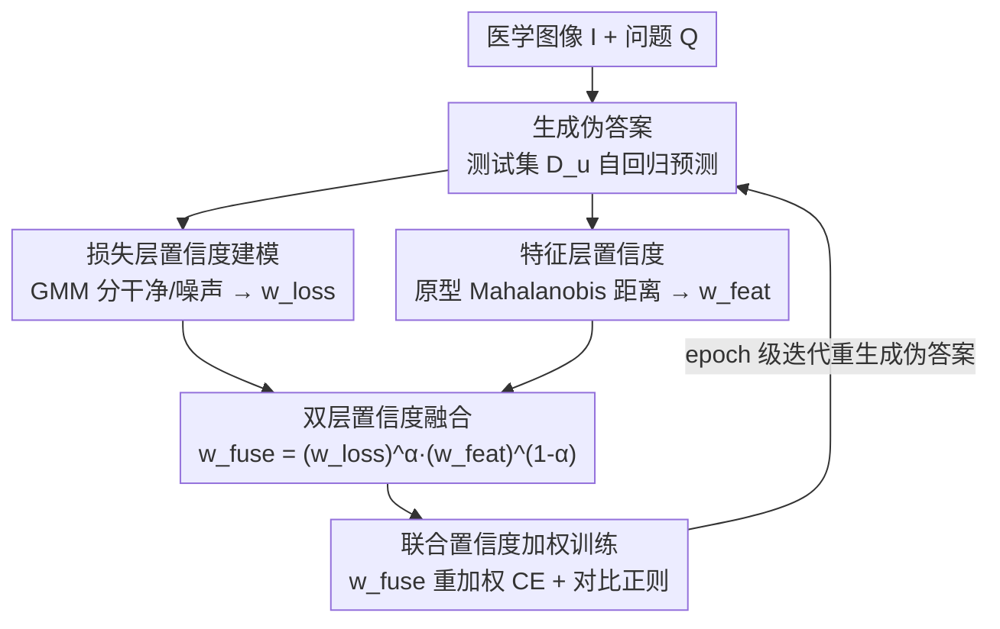

# Dual-Level Confidence based Implicit Self-Refinement for Medical Visual Question Answering

**会议**: CVPR 2026  
**论文**: [CVF Open Access](https://openaccess.thecvf.com/content/CVPR2026/html/Pan_Dual-Level_Confidence_based_Implicit_Self-Refinement_for_Medical_Visual_Question_Answering_CVPR_2026_paper.html)  
**代码**: https://github.com/pmhDL/DuCoR.git  
**领域**: 医学图像 / 多模态VLM  
**关键词**: 医学VQA, 伪标签, 置信度估计, 跨域泛化, 直推式学习

## 一句话总结
针对医学 VQA 训练/测试分布漂移的问题，DuCoR 把测试样本的伪答案拉进训练，并用「损失层置信度（拟合干净/噪声损失分布）+ 特征层置信度（样本表征到伪答案原型的距离）」两路互补信号自适应融合出每样本可靠性权重，对伪监督加权优化，从而在多个医学 VQA 基准上既涨点又显著改善跨域泛化。

## 研究背景与动机
**领域现状**：医学 VQA 要从「医学图像 + 问题」推出临床答案，近年生成式多模态大模型（如 LLaVA-Med）已把答案建模成自回归文本生成，效果不错。但这些模型在域漂移（不同成像模态、不同语言描述）下泛化能力有限。

**现有痛点**：缓解域漂移的一个自然思路是直推式/伪监督——利用未标注的测试样本，让模型自己生成伪答案再拿来训练。但模型预测的伪答案常常不可靠，若直接当真值用，会引入确认偏误（confirmation bias）和误差放大。因此关键在于「估计每个伪标注样本的可靠性」。

**核心矛盾**：伪标签可靠性估计在分类/检测/分割这类判别式任务上研究很多，但它们的标签空间是离散有限的。医学 VQA 是开放式生成任务，输出是自由文本，不确定性大得多，传统「只看损失或只看预测概率」的置信度根本不够用。作者在 Figure 1(a) 的散点图里实证发现：损失和语义一致性之间存在明显错位——有些样本损失很低但语义相似度很差，有些损失很大却语义相似度高。单看损失不能忠实反映伪答案对不对。

**本文目标**：在生成式医学 VQA 设定下，给每个伪标注样本估计一个更靠谱的可靠性，再用它指导伪监督优化，让模型逐步把自己的预测分布对齐到目标分布。

**切入角度**：既然损失（监督信号空间）和语义一致性（表征空间）来自两个不同的信息源、且会互相纠错，那就别只用一路，把两路置信度都算出来再融合。

**核心 idea**：用「损失层 + 特征层」的双层置信度替代单一固定伪标签，自适应融合出每样本权重 $w^{fuse}$ 来加权伪监督，实现隐式自我精炼（implicit self-refinement）。

## 方法详解

### 整体框架
DuCoR 在标准生成式医学 VQA 训练（图像+问题→自回归生成答案）之上，叠加一套「直推式伪监督 + 双层置信度加权」的联合优化流程。输入是有标注训练集 $D_t=\{(I_i,Q_i,A_i)\}$ 和无标注测试集 $D_u=\{(I_j,Q_j)\}$；对每个测试样本先用当前模型生成伪答案 $\tilde A_j=f_\theta(I_j,Q_j)$，然后把它们一起塞进联合目标里训练：

$$L = \sum_{(I_i,Q_i,A_i)\in D_t}\ell(f_\theta(I_i,Q_i),A_i) + \sum_{(I_j,Q_j,\tilde A_j)\in D_u} w_j\,\ell(f_\theta(I_j,Q_j),\tilde A_j)$$

其中 $w_j$ 是每个伪标注样本的自适应可靠性权重——这正是全文要解决的核心量。整套流程的关键就是 $w_j$ 怎么算：一路从**监督信号**（自回归损失分布）估，一路从**输入语义**（多模态表征到伪答案原型的距离）估，两路融合，再回灌到加权训练里。伪答案每个 epoch 重新生成，于是模型在「生成伪答案 → 估可靠性 → 加权训练 → 表征对齐」的循环里逐轮自我精炼。

### 关键设计

**1. 损失层置信度：用高斯混合分干净/噪声，量化「这条监督是不是可信」**

直接把伪答案当真值会被噪声带偏。作者观察到正确生成的答案往往自回归损失更低，于是把「伪标签可靠性」建模成损失分布上的干净/噪声二分问题。先算每个样本的自回归损失 $\ell^{ce}_i = -\sum_{t=1}^T \log p_\theta(a_{it}\mid I_i,Q_i,a_{i,<t})$，做对数变换 $u_i=\log(\ell^{ce}_i+\varepsilon)$ 平滑尺度，再用干净训练样本的统计量标准化成 $z_i=(u_i-\mu_{tr})/\sigma_{tr}$。然后对 $z_i$ 拟合一个两分量高斯混合（GMM）：$p(z_i)=\pi_c\mathcal N(z_i;\mu_c,\sigma_c^2)+\pi_n\mathcal N(z_i;\mu_n,\sigma_n^2)$，分别代表干净模式和噪声模式。

求解上有个巧妙的「锚定」技巧：训练样本被强制锚定为干净分量（$\gamma_{i,c}=1$），测试样本的干净/噪声归属是隐变量，用 EM 迭代。E 步算测试样本属于干净分量的后验责任 $\gamma_{j,c}=\frac{\pi_c\mathcal N(z_j;\mu_c,\sigma_c^2)}{\pi_c\mathcal N(z_j;\mu_c,\sigma_c^2)+\pi_n\mathcal N(z_j;\mu_n,\sigma_n^2)}$；M 步里干净分量用「训练集（硬权重 1）+ 测试集（软权重 $\gamma_{j,c}$）」半监督地更新均值方差，噪声分量只用测试样本、按 $(1-\gamma_{j,c})$ 加权更新。收敛后伪答案的损失层置信度就是后验干净概率 $w^{loss}_i=p(\text{clean}\mid z_i;\hat\Theta)$。用训练集锚定干净分量，避免了纯无监督 GMM 容易把两个模式认反的问题。

**2. 特征层置信度：用原型 + Mahalanobis 能量，从语义空间补一路正交信号**

损失只反映「预测和它自己的伪答案匹配得好不好」，但匹配得好不代表伪答案语义上对——这正是 Figure 1(a) 错位点的来源。所以作者在表征空间再补一路。取与答案监督无关的多模态聚合表征 $h_i=\phi(f_\theta(Q_i,I_i))$；对每个答案类别 $k$ 构造原型 $p_k=\frac1{|S_k|}\sum_{h_i\in S_k}h_i$，其中 $S_k$ 优先用训练集中该类的干净嵌入，若是训练集没见过的未知类别（这是跨域的关键）就退而用伪标注测试嵌入。然后用 Mahalanobis 能量 $E_j=(h_j-p_{k_j})^\top\Sigma_k^{-1}(h_j-p_{k_j})$ 衡量样本到其伪答案原型的距离——比欧氏距离多考虑了类内协方差结构。正确伪答案应该离原型近、$E_j$ 小，于是用指数映射转成概率：$w^{feat}_j=\exp(-\beta E_j)$，$\beta$ 控制锐度。

这一路之所以和损失层互补，是因为它的信息源是「输入语义」而非「监督信号」：一个样本可能损失低（模型对自己的答案很自信）但表征离原型远（语义其实不一致），两路就能互相纠错。

**3. 原型对比正则：让特征空间真的「按答案语义聚类」，撑起原型估计**

特征层置信度依赖原型可靠，而原型可靠又依赖特征空间结构良好。作者加了一个原型版 InfoNCE 把这件事闭环：$\ell^{ctr}_i=-\log\frac{\exp(\mathrm{sim}(h_i,p_{k_i})/\tau)}{\sum_{j\in\mathcal A}\exp(\mathrm{sim}(h_i,p_j)/\tau)}$，把样本嵌入往自己答案原型拉、推离别的原型（$\mathrm{sim}$ 是余弦相似度）。这样语义相关的样本会围着对应原型成簇、不同语义概念互相分开，从而让基于原型的 Mahalanobis 距离估计更稳——设计 2 和设计 3 互为支撑。

**4. 双层置信度融合与联合加权训练：把两路信号自适应调和进优化**

两路置信度来自不同空间，作者用几何加权融合：训练样本权重恒为 1，测试样本 $w^{fuse}_i=(w^{loss}_i)^\alpha\cdot(w^{feat}_i)^{1-\alpha}$，$\alpha\in[0,1]$ 平衡两路贡献（实验取 0.5）。最终联合目标把每条伪损失按融合置信度重加权，再叠上对比正则：

$$L_{total}=\sum_{i=1}^{|D_t\cup D_u|} w^{fuse}_i\,\ell^{ce}_i + \lambda\, w^{fuse}_i\,\ell^{ctr}_i$$

$\lambda$ 平衡生成监督和原型对比正则。几何（乘积）融合而非加法，意味着任一路判定「不可靠」都会把权重压低，比单一损失过滤（DivideMix）、单一预测分歧（CoDis）或固定阈值（FixMatch）更稳健——后者在医学 VQA 这种模糊、类别高度不均衡的场景里常常失灵。

### 损失函数 / 训练策略
视觉编码器 CLIP-ViT/B16，答案推理用四个 LLM（GPT-2 1.5B / StableLM 1.6B / Mistral 7B / Llama2 7B）。先在 PMC-15M 的 60 万图文对上做域对齐预训练（图文匹配目标），再在医学 VQA 上联合训练。$\beta=\tau=1.0$，$\alpha=\lambda=0.5$；30 epoch 直推式伪监督，batch 32，AdamW，lr $2\times10^{-5}$，500 步线性 warmup，伪答案逐 epoch 重生成。

## 实验关键数据

### 主实验
三个医学 VQA 基准 VQA-RAD / SLAKE / PathVQA（生成式方法开放式报 recall、闭合式报 accuracy）。DuCoR 相比此前 SOTA 在开放式 recall 上涨约 1%–4%、闭合式 accuracy 涨约 1%–2%。PathVQA 开放式问题上超此前 SOTA 达 3.63%。

| 方法 | VQA-RAD Open/Closed | SLAKE Open/Closed | PathVQA Open/Closed |
|------|------|------|------|
| LLaVA-Med (BioMedCLIP) | 64.75 / 83.09 | 87.11 / 86.78 | 39.60 / 91.09 |
| FAVP (Llama2) | 68.10 / **89.00** | 85.60 / 87.90 | − / − |
| MUMC（判别式） | 71.50 / 84.20 | − | 39.00 / 90.40 |
| DuCoR (Mistral) | 67.95 / 86.48 | 88.67 / 88.36 | **43.63** / 88.67 |
| DuCoR (Llama2) | 68.87 / 87.13 | **88.87** / 87.52 | 42.95 / 89.84 |

Llama2 版改进最均衡，Mistral 版在开放式问题上提升最大。

另与 4 个代表性伪标签方法对比（把医学 VQA 转成多分类做公平比较，DuCoR 走 PL+ST 范式）：

| 数据集 | 范式 | 方法 | Close | Open | Overall |
|------|------|------|------|------|------|
| VQA-RAD | TTA | AdaContrast | 83.61 | 63.52 | 74.70 |
| VQA-RAD | SSL | CoDis | 81.54 | 63.39 | 73.49 |
| VQA-RAD | PL+ST | **DuCoR** | **85.34** | **67.81** | **77.56** |
| PathVQA | SSL | FixMatch | 78.14 | 33.26 | 55.77 |
| PathVQA | PL+ST | **DuCoR** | **87.62** | **40.13** | **63.94** |

### 消融实验
PathVQA 上逐步消融（PL=朴素伪标签，LL=损失层加权，FL=特征层加权，CR=对比正则）：

| 配置 | Accuracy | Recall | F1 | BLEU-1 | 说明 |
|------|------|------|------|------|------|
| Baseline | 87.22 | 39.73 | 40.64 | 56.12 | 标准自回归监督训练 |
| + PL | 85.41 | 40.16 | 40.38 | 55.99 | 朴素伪标签，闭合式反而掉点 |
| + PL + LL | 87.95 | 41.22 | 41.97 | 57.25 | 损失层置信度，明显回升 |
| + PL + LL + FL | 89.37 | 42.43 | 41.45 | 56.83 | 特征层互补，accuracy 再涨 |
| + PL + LL + FL + CR | **89.84** | **42.95** | 41.83 | **58.14** | 完整模型，整体最好 |

### 关键发现
- **朴素伪标签有害**：直接把伪答案当真值（+PL），闭合式 accuracy 从 87.22 掉到 85.41，证明不做可靠性评估的伪监督会引入噪声——这是全文动机的直接实证。
- **两路确实互补**：加损失层先把 accuracy 救回 87.95，再加特征层涨到 89.37，说明语义信号给损失信号补了一块；对比正则最后把 F1/BLEU 也拉起来。
- **跨域增益最突出**：SLAKE↔PathVQA、SLAKE↔VQA-RAD 的放射-病理域漂移下，zero-shot 迁移会灾难性掉点，DuCoR 一致最好。开放式 F1 在 SLAKE→PathVQA 上比 zero-shot 涨 7.75%、PathVQA→SLAKE 涨 13.35%（⚠️ 跨域表中 In-domain 上界本身也较低，应理解为「相对 zero-shot 的恢复幅度」）。
- **可靠性指标量化改善**：训练前后伪标签可靠性，AUROC 0.6827→0.8575（+0.1747）、Kolmogorov-Smirnov 0.3201→0.5675（+0.2474），融合置信度 $w^{fuse}$ 呈双峰，可靠样本权重高、噪声样本被压低。

## 亮点与洞察
- **「双信息源互相纠错」是核心洞察**：损失来自监督信号、原型距离来自输入语义，两者正交，所以一路被骗时另一路能拦——这比堆叠同质置信度有意义得多，散点图的四象限分析把这点讲得很直观。
- **训练样本锚定干净分量**这个工程细节很关键：纯无监督拟合双高斯极易把干净/噪声两个模式认反，用有标注训练损失硬锚 $\gamma=1$，等于给 EM 一个可信的起点。可迁移到任何「干净集 + 噪声集混合」的损失建模场景。
- **几何融合而非加权和**：$(w^{loss})^\alpha(w^{feat})^{1-\alpha}$ 让任一路否决都能压低权重，是比加法更保守、更适合高噪声伪标签的选择。
- **原型对未知类别的回退策略**（训练集没有就用伪标注测试嵌入估原型）让框架天然支持跨域——这是跨域涨点最大的隐形功臣。

## 局限与展望
- **依赖原型质量与对比正则的良性循环**：特征层置信度建立在原型可靠之上，而原型又靠对比正则塑形。若某未知类别的伪标注测试样本本身大量出错，原型会被污染，置信度估计可能跟着失真——这个失败模式论文未深入分析（⚠️ 笔者推测）。
- **超参在三个基准上固定为 $\alpha=\lambda=0.5,\beta=\tau=1.0$**，没给融合系数 $\alpha$ 的敏感性曲线，「损失/特征两路谁更该信」在不同域上是否需要自适应仍是开放问题。
- **直推式设定的代价**：每 epoch 重新生成全部测试伪答案 + 拟合 GMM，相比纯监督有额外开销；且需要在测试分布上做适配，属于直推式而非严格的归纳式泛化。
- 跨域表的 In-domain 上界与 zero-shot 数值跨设定不完全可比，横向看百分比时需带 caveat。

## 相关工作与启发
- **vs DivideMix / CoDis**：都用损失建模分干净/噪声，但 DivideMix 是双网络 + 损失过滤、CoDis 靠预测分歧/互教，DuCoR 是单模型且把损失层和表征层两路置信度合一，估计更准；且 DuCoR 面向开放式生成而非离散分类。
- **vs FixMatch**：FixMatch 用固定置信度阈值筛伪标签，在医学 VQA 这种模糊+类别不均衡场景下阈值很难定，DuCoR 的软可靠性权重更鲁棒。
- **vs PLCM（伪损失置信度）**：DuCoR 受其启发，但把它从判别式任务扩展到自回归生成式损失分布，并补了语义一致性约束——这是把伪标签可靠性建模搬进生成式多模态的关键一步。
- **vs LLM/VLM 置信度校准（UF Calibration / FaR）**：那条线主要校准输出级不确定性，DuCoR 把「伪标签可靠性建模 + 样本级置信度校准」桥接起来，从损失分布和原型一致性两端估每样本置信度并注入伪监督训练。

## 评分
- 新颖性: ⭐⭐⭐⭐ 把「损失分布 GMM + 原型 Mahalanobis 距离」双路置信度首次系统用于生成式医学 VQA 的伪监督，双源互补的切入有说服力。
- 实验充分度: ⭐⭐⭐⭐ 三基准 × 四 backbone + 逐步消融 + 双向跨域 + 可靠性指标量化，较全面；缺 $\alpha$ 敏感性分析。
- 写作质量: ⭐⭐⭐⭐ 动机由散点图实证驱动，公式完整，方法逻辑清晰。
- 价值: ⭐⭐⭐⭐ 跨域泛化提升明显，锚定式 GMM 和几何融合等技巧可迁移到其他高噪声伪标签场景。

<!-- RELATED:START -->

## 相关论文

- [\[CVPR 2026\] Attention Consistent Longitudinal Medical Visual Question Answering Guided by Vision Foundation Models](attention_consistent_longitudinal_medical_visual_question_answering_guided_by_vi.md)
- [\[CVPR 2026\] MR-RAG: Multimodal Relevance-Aware Retrieval-Augmented Generation for Medical Visual Question Answering](mr-rag_multimodal_relevance-aware_retrieval-augmented_generation_for_medical_vis.md)
- [\[ICLR 2026\] Q-FSRU: Quantum-Augmented Frequency-Spectral Fusion for Medical Visual Question Answering](../../ICLR2026/medical_imaging/q-fsru_quantum-augmented_frequency-spectral_for_medical_visual_question_answerin.md)
- [\[CVPR 2026\] Dual-Level Hypergraph Generation for Addressing Feature Scarcity in Whole-Slide Image Classification](dual-level_hypergraph_generation_for_addressing_feature_scarcity_in_whole-slide_.md)
- [\[CVPR 2026\] IBISAgent: Reinforcing Pixel-Level Visual Reasoning in MLLMs for Universal Biomedical Object Referring and Segmentation](ibisagent_reinforcing_pixel-level_visual_reasoning_in_mllms_for_universal_biomed.md)

<!-- RELATED:END -->
