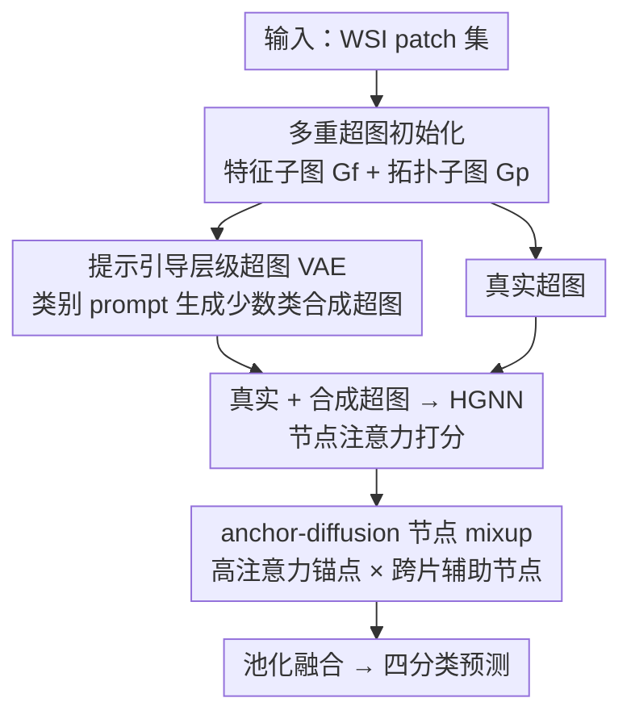

# Dual-Level Hypergraph Generation for Addressing Feature Scarcity in Whole-Slide Image Classification

**会议**: CVPR 2026  
**论文**: [CVF Open Access](https://openaccess.thecvf.com/content/CVPR2026/html/Yao_Dual-Level_Hypergraph_Generation_for_Addressing_Feature_Scarcity_in_Whole-Slide_Image_CVPR_2026_paper.html)  
**代码**: https://github.com/YAOSL98/Dual-HG  
**领域**: 医学图像  
**关键词**: 全切片病理, 超图生成, 类别稀缺, 淋巴结转移, 变分自编码器  

## 一句话总结
针对淋巴结转移四分类中少数类（ITC、微转移）样本与阳性节点双重稀缺的问题，本文提出 Dual-HGNet，在**超图层**用类别提示引导的层级超图 VAE 合成拓扑一致的少数类超图、在**节点层**用 anchor-diffusion mixup 增强高注意力阳性节点特征，在 NIMM 与多个 TCGA 数据集上显著提升了少数类识别（NIMM 上 ITC 的 F1 从 52.7 提到 57.1）。

## 研究背景与动机
**领域现状**：全切片病理图像（WSI）尺寸巨大，常被切成成千上万个 patch，主流做法是把每个 patch 当节点，用 MIL（多示例学习）、GNN 或近年的超图网络（HGNN）聚合成切片级表示再分类。超图相比普通图的优势是一条超边能同时连多个节点，天然适合刻画肿瘤微环境里多区域的高阶交互。

**现有痛点**：淋巴结转移诊断是一个临床上的**四分类**任务——阴性、孤立肿瘤细胞（ITC）、微转移、宏转移，严重程度递进。这个任务同时被两种稀缺折磨：(i) **类间稀缺**——ITC、微转移的切片本身就少（NIMM 里 ITC 仅 40 张、微转移 76 张，而宏转移 282、阴性 231）；(ii) **片内节点稀疏**——ITC/微转移这类早期病灶在一张切片里只有零星几个阳性细胞，绝大多数 patch 是正常组织。两者叠加导致少数类的特征表示极度不足。

**核心矛盾**：已有缓解 WSI 特征稀缺的方法（挑选阳性节点、用 LLM 文本先验补语义、伪袋混合）都停留在**节点层**，做的是「在单张切片内部把阳性节点变多 / 变好」。但这既没解决整个训练集层面少数类分布覆盖太窄的类间稀缺，也忽略了节点之间的**高阶拓扑依赖**——而生物学上 ITC 这类边缘早期病灶恰恰处在异质细胞环境中、多区域交互模式比集中在中心的宏转移更复杂，丢掉拓扑等于丢掉关键判别信息。

**切入角度**：作者的观察是——要真正补足少数类，必须在**两个粒度上同时做特征合成**，而且合成时不能只造特征、还要保住超图的拓扑结构（哪些节点该连进同一条超边）。超图本身提供了刻画高阶依赖的容器，那么「生成新的少数类超图」就成了同时缓解类间稀缺与保留拓扑的自然选择。

**核心 idea**：用一个双层生成框架——超图层「造整张少数类超图」+ 节点层「造高注意力阳性节点」——来同时填补类间与片内的稀缺，并通过位置编码匹配保证生成结构拓扑一致。

## 方法详解

### 整体框架
Dual-HGNet 是一条端到端的四分类流水线。输入是一批 WSI，输出是四类转移诊断。整体分三步走：**先把每张 WSI 初始化成多重超图**（同时编码特征空间与拓扑空间的关系）；**再在超图层用 HGVAE 为 ITC / 微转移这两类少数类合成新的超图**，扩充它们在训练集中的分布；**最后把真实超图与合成超图一起送进 HGNN 分类训练**，训练中每个节点会被赋一个注意力分数，此时在**节点层**用 anchor-diffusion mixup 进一步丰富高注意力阳性节点的特征。预测时把节点与超边特征池化融合后输出四分类。

关键在于 HGVAE 与 node mixup 是两个层级、各补一种稀缺：HGVAE 补类间稀缺（造整张图），node mixup 补片内节点稀疏（造关键节点），两者都靠特征 + 位置编码的双空间匹配把新元素塞回拓扑正确的位置。

### 关键设计

**1. 多重超图初始化：把一张 WSI 拆成「特征相似」和「空间相邻」两套超边**

这一步解决「单一图结构既要表达语义相似又要表达空间拓扑、互相打架」的问题。每个 patch 是一个节点 $v_i=(v_{f,i}, v_{p,i})$，同时带视觉特征向量 $v_f$ 和位置嵌入 $v_p$。作者不建一张图，而是把超图 $G=\langle V,E,H\rangle$ 分解成两个子超图：**特征空间子超图** $G_f$ 按特征相似度连边、**拓扑空间子超图** $G_p$ 按空间位置邻近连边。两套距离分别为

$$d^{(f)}_{ii'}=\lVert v_{f,i}-v_{f,i'}\rVert_2,\qquad d^{(p)}_{ii'}=\lVert v_{p,i}-v_{p,i'}\rVert_2$$

每个节点与它在各自空间的 $k$ 近邻连成一条局部超边，得到关联矩阵 $H_f$、$H_p$，最终拼成完整关联矩阵 $H=[H_f \mid H_p]$。每条超边 $e_j=(e_{f,j}, e_{p,j})$ 的特征/位置就是其所含节点的均值。这套「双子图 + 位置编码」是后面所有生成和回插操作的基础——正因为节点和超边都带位置编码，生成出来的新元素才能被匹配回拓扑正确的位置。

**2. 提示引导的层级超图 VAE（HGVAE）：在超图层为少数类造拓扑一致的整张图**

这是补**类间稀缺**的主力。作者只用 ITC 和微转移的真实超图训练 HGVAE，让它学会这两类各自的特征与拓扑分布，训练后用生成器批量合成新超图扩充分布。HGVAE 是一个**层级**结构：编码器（三层 MLP）先推断图级隐变量 $z_g$，

$$q_\phi(z_g\mid V,E)=\mathcal{N}\!\big(\mu_g(V,E),\Sigma_g(V,E)\big)$$

再从 $z_g$ 派生出节点级隐变量 $z_v$ 和超边级隐变量 $z_e$，形成生成链 $z_g \to \{z_v,z_e\} \to (\hat v_f,\hat v_p),(\hat e_f,\hat e_p),\hat g$。这种分层让一个全局先验能统一约束图、超边、节点三个粒度，从而同时建模特征与拓扑依赖。

「提示引导」是它注入病理语义先验的方式：用**冻结的 CONCH 文本编码器** + 可学习类别 prompt。对每个隐变量 $z$ 先经 MLP 映射成文本空间偏置 $r=h(z)$，加到 prompt token 上得到 $p(z)=[p_1+r,\dots,p_k+r]$，再与类别嵌入 $e_c$ 拼成文本表示 $t=\{p(z),e_c\}$，最后 $\text{Gen}(z)=T(t)$。训练目标是重建 + KL 正则：

$$\mathcal{L}_{\text{HGVAE}}=\mathcal{L}_{rec}+\mathcal{L}_{kld}$$

其中 $\mathcal{L}_{rec}$ 对 $\hat g,\hat e_f,\hat e_p,\hat v_f,\hat v_p$ 五路输出做 MSE，$\mathcal{L}_{kld}$ 把 $z_g$ 及条件 $z_v,z_e$ 约束到先验。合成时从先验 $p(z_g)$ 采样 $n$ 次，经条件映射得到 $n$ 组 $(z_v^{(t)},z_e^{(t)})$，每组对应一张新超图 $G'^{(t)}$——共享全局先验保证同类、采样多次保证多样。

**3. 双空间最近邻回插：让生成的节点/超边落回拓扑正确的位置**

光生成节点和超边特征还不够，必须重建它们之间「谁连谁」的连接关系，否则合成超图拓扑是乱的。作者的做法是对每条重建超边，分别在**特征空间**和**拓扑空间**做 $k$ 近邻匹配：对超边特征 $\hat e_{f,j}$ 找最近的 $k$ 个节点特征 $\{\hat v_{f,i}\}$ 连成特征驱动超边（关联矩阵 $\hat H_f$），对超边位置 $\hat e_{p,j}$ 找最近的 $k$ 个节点位置连成位置驱动超边（$\hat H_p$），合成超图即 $\hat G=\langle \hat V,\hat E,\hat H_f\mid \hat H_p\rangle$。这一步是「拓扑一致」承诺的落地——生成的不是孤立特征点云，而是连接结构合法的超图，再和真实超图一起联合训练分类器。

**4. Anchor-diffusion 节点 mixup：补片内最关键的阳性节点**

这是补**片内节点稀疏**的部件，发生在分类器训练阶段。每个节点 $v_i$ 有注意力分数 $\alpha_i$，阳性节点通常分数更高。作者在每张图（真实 $G$ 或合成 $\hat G$）内选注意力最高的节点作**锚点** $v_{anc}$，再从**全体同类切片**的高注意力节点里采一个**辅助节点** $v_{aux}$（跨片！这正是它能补充新信息、而非自我复制的关键）。新节点由两者插值生成：

$$(v_{f,syn}, v_{p,syn})=(v_{f,anc}, v_{p,anc})+(v_{f,aux}, v_{p,aux})$$

为保住拓扑，$v_{syn}$ 被分配到特征 + 空间双域上最相似的超边：

$$\arg\min_{e_j\in E}\big(\lVert v_{f,syn}-e_{f,j}\rVert_2,\ \lVert v_{p,syn}-e_{p,j}\rVert_2\big)$$

这一步同时更新节点和超边表示。与普通 mixup 不同的是它**只围绕高注意力锚点扩散**、且跨切片取辅助节点——等于把「最判别的阳性区域」沿着同类分布做了一次定向增殖。⚠️ 式 (11) 在原文写成两向量直接相加而非加权插值，疑为简写，混合系数以原文/代码为准。

### 损失函数 / 训练策略
所有超图过单层超图卷积，节点 mixup 后池化得图级表示，算交叉熵：

$$\mathcal{L}_{CE}=\mathbb{E}_{(G,y)}[-y\log\hat y(G)]+\mathbb{E}_{(G',y)}[-y\log\hat y(G')]$$

总目标把分类损失与 HGVAE 的生成正则合在一起：$\mathcal{L}_{total}=\mathcal{L}_{CE}+\mathcal{L}_{HGVAE}$。骨干用 CONCH 预训练编码图像与文本，patch 为 $256\times256$、20× 倍率，Adam（lr $1\times10^{-4}$、weight decay $1\times10^{-5}$），300 epoch、batch size 1，三折取均值方差。

## 实验关键数据

### 主实验
NIMM 四分类数据集（629 张淋巴结切片）上与 CNN/GNN/HGNN 三类方法对比，重点看少数类 ITC 与微转移：

| 方法 | Overall AUC | Overall F1 | ITC F1 | Micro F1 |
|------|------|------|------|------|
| TransMIL (NeurIPS'21) | 96.15 | 71.50 | 47.87 | 47.82 |
| Patch-GCN (MICCAI'21) | 96.84 | 72.87 | 50.30 | 49.48 |
| HGNN (CVPR'23) | 96.34 | 72.88 | 49.64 | 49.25 |
| HGSurvNet (PAMI'23) | 96.45 | 74.01 | 52.29 | 51.06 |
| MRePath (IJCAI'25) | 96.21 | 74.09 | 52.69 | 51.63 |
| **Ours** | **96.95** | **77.19** | **57.13** | **58.30** |

少数类提升最明显：ITC 的 F1 从次优 52.69 拉到 57.13，微转移 F1 从 51.63 拉到 58.30，验证了「双层生成确实在补少数类」。

TCGA 少数据 few-shot 子型分类（NSCLC 2 类、RCC 3 类）也全面领先：

| 数据集 | shot | 指标 | 次优 | Ours |
|------|------|------|------|------|
| TCGA-NSCLC | 2-shot | AUC | 84.31 (ViLa-MIL) | **86.73** |
| TCGA-NSCLC | 8-shot | AUC | 92.80 (MOC) | **94.21** |
| TCGA-RCC | 2-shot | F1 | 80.77 (CoCoOp) | **83.86** |
| TCGA-RCC | 8-shot | F1 | 91.95 (MOC) | **93.97** |

### 消融实验
组件消融（B=baseline，HGVAE，N-Aug=anchor-diffusion mixup），看 NIMM ITC F1 与 TCGA-NSCLC 2-shot F1：

| 配置 | NIMM ITC F1 | NSCLC 2-shot F1 | 说明 |
|------|------|------|------|
| (a) B | 51.29 | 74.59 | 仅基线 |
| (b) B+HGVAE | 55.53 | 80.46 | 超图层生成，类间稀缺补足 |
| (c) B+N-Aug | 54.49 | 75.32 | 仅节点层增强 |
| (d) Full | **57.13** | **80.96** | 双层协同最佳 |

HGVAE 单加（b）带来的增益明显大于 node mixup 单加（c）——在 NSCLC 上前者 +5.87、后者仅 +0.73，说明**类间稀缺（造整张图）是这个四分类任务的主要瓶颈**，节点层增强是锦上添花，两者叠加才到最优。

HGVAE 内部变体消融（NIMM ITC F1 → NSCLC 2-shot F1）：

| 变体 | 条件 | 层级 | $\hat H_p$ | NIMM ITC F1 | NSCLC 2-shot F1 |
|------|------|------|------|------|------|
| Vanilla VAE | ✗ | ✗ | ✗ | 40.00 | 65.37 |
| Conditional VAE | ✓ | ✗ | ✗ | 52.42 | 77.53 |
| + class prompt | ✓† | ✗ | ✗ | 54.62 | 79.51 |
| + 拓扑子图生成 | ✓† | ✗ | ✓ | 54.49 | 79.90 |
| Hierarchical VAE | ✓ | ✓ | ✗ | 54.87 | 78.96 |
| **HGVAE (full)** | ✓† | ✓ | ✓ | **55.53** | **80.46** |

### 关键发现
- **无条件 Vanilla VAE 反而掉点**（ITC F1 40.0，远低于 baseline 51.3）：盲目生成会破坏少数类分布，必须有类别条件 / prompt 引导才有正向收益——这是「生成式增强」最容易翻车的地方。
- **类别 prompt（†）+ 层级 + 拓扑子图三者都有独立贡献**，且缺一不可，full HGVAE 才到 55.53；其中类别条件从 ✗→✓ 跨度最大（ITC F1 40→52）。
- 收益集中在少数类与少样本场景：常规 TCGA 多样本下各方法本就接近饱和，本文优势在 2-shot/ITC 这类「真稀缺」处才充分体现。

## 亮点与洞察
- **把「特征增强」升级成「超图生成」**：以往 WSI 增强只在节点层补特征，本文意识到拓扑结构本身也是判别信息、且类间稀缺无法靠片内增强解决，于是直接生成整张拓扑一致的少数类超图——这是从「补点」到「补图」的范式跳变，可迁移到任何「结构 + 类不平衡」的图任务。
- **位置编码贯穿始终**：节点和超边都带位置嵌入，使得无论是 HGVAE 生成还是 node mixup，新元素都能靠双空间最近邻匹配落回拓扑合法位置——这是「生成不破坏结构」的工程关键，很值得借鉴。
- **冻结 CONCH 文本编码器 + 可学习 prompt 注入病理语义先验**，等于用视觉-语言基础模型给生成器装了一个领域知识方向盘，避免无条件生成跑偏。
- **anchor-diffusion 的「跨片取辅助节点」**：只在最判别的高注意力锚点附近、且从同类其他切片采辅助节点做插值，是一种很克制的定向增殖，避免了普通 mixup 在海量负节点里稀释信号。

## 局限与展望
- HGVAE 只对 ITC、微转移两类训练和合成，依赖「事先知道哪些是少数类」；类别极多或长尾连续时这种逐类训练生成器的策略扩展性存疑。⚠️
- 式 (11) 的 mixup 写成直接相加而非带系数插值，论文未给出混合比例的消融，增强强度如何控制不清晰。
- 主要在淋巴结转移 + 几个 TCGA 子型上验证，是否泛化到更大规模、更多类别或非病理 WSI 任务未知。
- 合成超图与真实超图联合训练，但论文未 report 合成样本数量 $n$ 的敏感性，生成多少才最优、过多是否引入噪声值得进一步分析。

## 相关工作与启发
- **vs 节点级增强（伪袋混合 / top-k 阳性采样 / 扩散造节点，如 Liu'24、Zhao'40）**：它们只在节点层缓解片内稀疏、保留原始节点分布，既忽略拓扑也无法覆盖类间稀缺；本文在超图层造整张图 + 节点层定向增殖，双层同时补两种稀缺。
- **vs 文本先验增强 MIL（ViLa-MIL、TOP、MOC 等）**：这些用 LLM/VLM 文本先验补语义但仍是判别式框架、不生成新结构；本文把 CONCH 文本先验嵌进**生成器**，用来引导少数类超图合成而非仅做特征对齐。
- **vs 传统 HGNN（HGNN'23、HGSurvNet'23、MRePath'25）**：它们用超图建高阶依赖但保持原始节点分布，面对极度不平衡的四分类仍力不从心；本文在 HGNN 之上加了生成层，专门补少数类分布覆盖。

## 评分
- 新颖性: ⭐⭐⭐⭐⭐ 首次把「超图层 + 节点层」双粒度生成用于 WSI 类不平衡，且强调拓扑一致的图生成，范式有新意。
- 实验充分度: ⭐⭐⭐⭐ NIMM + 多个 TCGA + few-shot + 两套消融较完整，但合成样本数 $n$、mixup 系数等敏感性未覆盖。
- 写作质量: ⭐⭐⭐⭐ 框架与公式清晰，但部分符号（如式 11 的加号）略简、易引歧义。
- 价值: ⭐⭐⭐⭐ 切中临床四分类少数类难诊断的真实痛点，少数类与少样本提升明显，落地价值高。

<!-- RELATED:START -->

## 相关论文

- [\[CVPR 2026\] Contrastive Cross-Bag Augmentation for Multiple Instance Learning-based Whole Slide Image Classification](contrastive_cross-bag_augmentation_for_multiple_instance_learning-based_whole_sl.md)
- [\[CVPR 2026\] Universal-to-Specific: Dynamic Knowledge-Guided Multiple Instance Learning for Few-Shot Whole Slide Image Classification](universal-to-specific_dynamic_knowledge-guided_multiple_instance_learning_for_fe.md)
- [\[CVPR 2026\] MUSE: Harnessing Precise and Diverse Semantics for Few-Shot Whole Slide Image Classification](muse_harnessing_precise_and_diverse_semantics_for_few-shot_whole_slide_image_cla.md)
- [\[CVPR 2026\] Act Like a Pathologist: Tissue-Aware Whole Slide Image Reasoning](act_like_a_pathologist_tissue-aware_whole_slide_image_reasoning.md)
- [\[CVPR 2026\] TopoSlide: Topologically-Informed Histopathology Whole Slide Image Representation Learning](toposlide_topologically-informed_histopathology_whole_slide_image_representation.md)

<!-- RELATED:END -->
