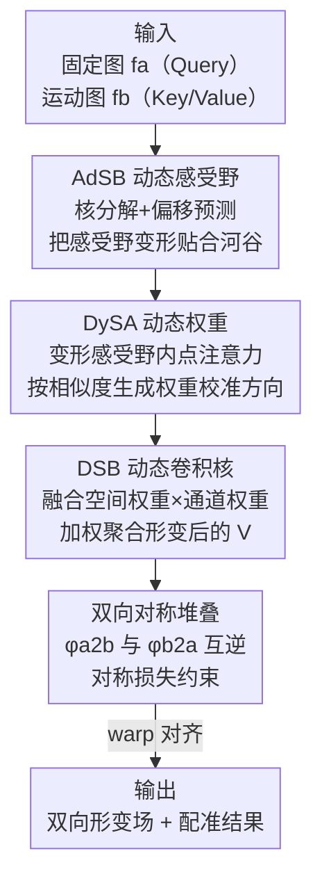

# Dynamic Stream Network for Combinatorial Explosion Problem in Deformable Medical Image Registration

**会议**: CVPR 2026  
**论文**: [CVF Open Access](https://openaccess.thecvf.com/content/CVPR2026/html/Bi_Dynamic_Stream_Network_for_Combinatorial_Explosion_Problem_in_Deformable_Medical_CVPR_2026_paper.html)  
**代码**: https://github.com/ShaochenBi/DySNet  
**领域**: 医学图像  
**关键词**: 可变形配准, 动态感受野, 动态权重, 组合爆炸, 注意力机制  

## 一句话总结
针对可变形医学图像配准（DMIR）因「双图输入」导致的特征关系组合爆炸问题，本文提出 DySNet，用 AdSB 模块动态变形感受野（缩小搜索空间）+ DySA 模块动态生成注意力权重（校准搜索方向），把两路动态机制统一进一个动态卷积核，在 3D 心脏 CT / 3D&2D 脑 MRI 三个任务上平均 Dice 达 82.0%，全面超过 8 个 SOTA。

## 研究背景与动机
**领域现状**：可变形医学图像配准（DMIR）要为两张图（固定图 fixed、运动图 moving）逐像素估计一个非刚性形变场，让二者的解剖结构对齐。核心环节是「特征建模」——为每个像素找到它在另一张图里的对应关系。主流做法用 CNN（VoxelMorph、LKU-Net）或 Transformer（XMorpher、ModeT）来建模这种跨图特征关系。

**现有痛点**：DMIR 与分割、分类这种「单图输入」任务有个本质区别——它要同时吃两张图，于是特征两两组合的数量随分辨率指数级膨胀。作者把图像写成 $N=H\times W$ 个特征点，每个点的候选关系集大小 $c=\alpha HW-1$，假设各点匹配独立，则整图可能的特征组合关系总数为

$$|\mathcal{H}| = c^N = (\alpha HW-1)^{HW}$$

随分辨率指数爆炸。模型为了抓到准确关系不得不**扩大搜索空间和搜索方向**，结果把大量无关关系也卷进来，反而选到次优匹配。

**核心矛盾**：现有方法的两块「静态」结构正是病根——① **静态感受野**（卷积核、Transformer 的 patch/窗口划分）把单个像素考虑的关系数量和范围钉死成固定形状，要找更准的关系只能整体扩张搜索空间，干扰特征也随之涌入；② **静态权重**（训练完即冻结、测试时不随数据调整）把搜索方向钉死，一旦搜索空间扩大，固定方向会漏掉更多潜在关系。已有工作要么只给感受野加动态（如可变形卷积 DCN、DAT），要么只给权重加动态，**没有一个同时让两者都动起来**。

**核心 idea**：让感受野和权重都「随输入图像动态变化」。感受野变形 → 把无关特征挤出搜索空间（空间变小、更聚焦）；权重动态生成 → 按图像相似度调整搜索方向（方向更准）。两者相乘，使建模的特征组合数从 $|U_{N^d}(i)|\times|W(i)|$ 大幅降到 $|D_{N^d}(i)|\times|A(i)|$，从源头压住组合爆炸。作者把这套机制比作「水流顺着河谷流动」，故命名 Dynamic Stream Network（DySNet）。

## 方法详解

### 整体框架
DySNet 的基本积木是**动态流块 DSB（Dynamic Stream Block）**，它内部串两个动态模块：AdSB 先把感受野变形成「贴合输入的河谷形状」，DySA 再在这个变形后的感受野里按相似度算注意力权重，二者融合成一个**动态卷积核**去聚合特征。整网把多个 DSB **对称堆叠**成双向配准框架（$x_a\to x_b$ 与 $x_b\to x_a$ 互为逆映射），用对称损失约束。

输入是固定图特征 $f^a$（出 Query）和运动图特征 $f^b$（出 Key/Value）；DSB 输出注意力特征，逐层建模后回归出双向形变场 $\phi_{a2b}$、$\phi_{b2a}$，最终把图像 warp 对齐。作者把 DSB 即插即用地替换进 XMorpher 的 CAT 块和 ModeT 的 ModeT 模块，分别得到 DySNet-X 和 DySNet-M。

### 关键设计

**1. AdSB（Adaptive Stream Basin）：让感受野变形，把无关特征挤出搜索空间**

针对「静态感受野固定了搜索空间形状」这个痛点，AdSB 让每个像素的感受野按输入图像差异自适应变形。它先做**核分解**：把基础卷积核 $K_{N^d,\theta}(i)$ 当成点注意力机制，拆成感受野 $U_{N^d}(i)$ 和权重 $\theta_{N^d,C}^i$，权重再进一步拆成空间权重 $\theta_{N^d,1}^i$ 和通道权重 $\theta_{1,C}^i$——解耦后才方便分别注入动态。

变形靠**偏移预测网络**：把固定图特征 $f^a$ 和运动图特征 $f^b$ 沿通道拼成 $X=[f^a,f^b]\in\mathbb{R}^{B\times 2C\times H\times W}$，送进偏移网络 $\theta_{\text{offset}}$ 预测每个采样点的偏移 $\Delta i$，把静态感受野推到局部最优邻域：

$$D_{N^d}(i) = U_{N^d}(i) + \Delta i$$

再用双线性插值 $I(\cdot)$ 把 Key/Value 采样到变形位置，得到形变后的 $K_j^m=I(K, D_{N^d}(i)_j)$、$V_j^m=I(V, D_{N^d}(i)_j)$。为什么有效：变形后的感受野 $|D_{N^d}(i)|$ 用更少的像素就能覆盖原静态感受野 $|U_{N^d}(i)|$ 的有效信息（$|D_{N^d}(i)|<|U_{N^d}(i)|$），相当于把河谷外的无关特征提前过滤掉；插值采样保证了连续可微，利于稳定训练和平滑形变。这比 DAT 进了一步——DAT 仍受固定输入感受野限制，AdSB 做到了像素级连续可变感受野。

**2. DySA（Dynamic Stream Attention）：在变形感受野里动态生成权重，校准搜索方向**

针对「静态权重锁死搜索方向、漏掉潜在关系」这个痛点，DySA 不再用训练好就冻结的固定权重，而是**按测试时的特征相似度即时算权重**。给定固定图位置 $i$ 的 Query $Q_i$ 和 AdSB 提供的形变后 Key $K_j^m$，先算缩放点积相似度 $e_{ij}=\frac{Q_i^\top K_j^m}{\sqrt{c}}$（$c$ 是每个注意力头维度），再在变形感受野内所有采样点上 softmax 归一化得到空间权重：

$$\rho_{N^d,1}^i(j) = \frac{\exp(e_{ij})}{\sum_{j=1}^{|D_{N^d}(i)|}\exp(e_{ij})}, \quad j=1,\dots,|D_{N^d}(i)|$$

为什么有效：这套点注意力让权重随两张图的局部相似度动态分配，把搜索方向对准最该匹配的区域，从而把每个像素要建模的关系数从 $|W(i)|$ 降到 $|A(i)|$（$|A(i)|<|W(i)|$）；softmax 归一化使权重成为合法概率分布，既稳训练又能产出可解释的注意力图，热力图能高亮真正贡献配准的关键区域。AdSB 缩空间、DySA 校方向，二者相乘把组合数压到 $|D_{N^d}(i)|\times|A(i)| \ll |U_{N^d}(i)|\times|W(i)|$。

**3. DSB 动态卷积核 + 双向对称框架：把两路动态拧成一个核，并施加逆映射先验**

AdSB 和 DySA 各自动态化了感受野与权重，DSB 负责把它们**重新拼回一个统一的动态卷积核**：先把 DySA 的空间权重 $\rho_{N^d,1}^i$ 与可学习通道权重 $\theta_{1,C}^i$ 合成 $\theta_{N^d,C}^i$，再与变形感受野 $D_{N^d}(i)$ 组合还原出动态核 $K_{N^d,\theta}(i)$；最后用它对形变后的 Value 做加权求和完成特征聚合：

$$A_i = \sum_{j=1}^{|D_{N^d}|}\theta_{N^d,C}^i(j)\cdot V_j^m$$

多头结果再相加得到最终注意力值。这一步是「先分解注入动态、再融合成核」的闭环——核分解是为了方便加动态，DSB 则把动态重新组装成可聚合的算子。

在网络层面，DMIR 被建模成两图共享解剖内容之间的**双射映射**，因此 $x_a\to x_b$ 与 $x_b\to x_a$ 应当互逆。作者据此对称堆叠 DSB（$F^*$ 与其交换输入的对称体 $(F_1^*)^\top$），并用对称损失约束两个方向：

$$\mathcal{L}_{bireg} = \mathcal{L}_{reg}(x_b, x_{a2b}, \phi_{a2b}) + \mathcal{L}_{reg}(x_a, x_{b2a}, \phi_{b2a})$$

其中每个方向的 $\mathcal{L}_{reg}$ 含平滑损失 $\mathcal{L}_{smo}$（形变场梯度正则，保拓扑）和相似度损失 $\mathcal{L}_{sim}$（局部归一化互相关 LNCC）。这个对称先验保证了双向形变场一致，是 DySNet 在保持高 Dice 的同时还能压低负 Jacobian 比例的重要原因。

### 损失函数 / 训练策略
总损失为双向对称配准损失 $\mathcal{L}_{bireg}$（见上），每方向 = LNCC 相似度损失 + 形变场梯度平滑正则。优化器 AdamW，初始学习率 $10^{-4}$，单卡 NVIDIA RTX 6000（24GB），PyTorch 实现。

## 实验关键数据

### 主实验
三个任务（3D 心脏 CT、3D 脑 MRI、2D 脑 MRI），指标为 Dice（DSC %，越高越好）和负 Jacobian 体积占比（$|J_\phi|<0$ %，越低形变越合理）。AVG 为三个 DSC 的算术平均。

| 方法 | 类型 | 心脏CT DSC% | 脑MRI(3D) DSC% | 脑MRI(2D) DSC% | AVG DSC |
|------|------|------------|---------------|---------------|---------|
| Initial（未配准） | - | 62.5 | 65.5 | 62.1 | 63.4 |
| VoxelMorph | C | 77.0 | 75.9 | 78.6 | 77.2 |
| SACB | C | 83.0 | 78.9 | 82.5 | 81.5 |
| TransMorph | C+T | 69.0 | 71.7 | 82.3 | 74.3 |
| XMorpher | T | 72.4 | 71.2 | 76.5 | 73.4 |
| **DySNet-X** | T | 74.5 (+2.1) | 77.8 (+6.6) | **83.0 (+6.5)** | 78.4 |
| ModeT | T | 83.6 | 77.4 | 81.9 | 81.0 |
| **DySNet-M** | T | **84.1 (+0.5)** | **79.7 (+2.3)** | 82.2 (+0.3) | **82.0** |

DySNet-M 平均 Dice 82.0%，三任务全为最高/次高；相对各自基座 XMorpher、ModeT 均有提升，尤其在精细解剖结构（3D 脑组织）上 DySNet-X 涨 +6.6%。心脏 CT 上比 VoxelMorph 高 7 个百分点以上。负 Jacobian 方面 DySNet 保持在合理低位（2D 脑 0.79%），而 SACB/ViT-V-Net/TransMorph 高达 2.88% 且偶发配准失败，做到了「高精度 + 平滑形变」的平衡。

### 消融实验（DySNet-X，2D 脑 MRI）
| 配置 | DSC% | $\|J_\phi\|$% | 说明 |
|------|------|--------------|------|
| Baseline (XMorpher) | 76.5 | 0.80 | 静态感受野 + 静态权重 |
| + DySA | ~82 | 低 | 加动态权重，语义匹配显著增强 |
| + AdSB（Full） | 83.0 | 0.88 | 再加动态感受野，精度最佳 |

| 核大小 | DSC% | 说明 |
|--------|------|------|
| 1×1 ~ 7×7 | 82.9 ~ 83.02 | $\|J_\phi\|$ 在 0.848~0.938 间，几乎不随核增大而变 |

### 关键发现
- **DySA 是涨点主力**：仅加 DySA（动态权重）就把 Dice 从 76.5% 拉到约 82%，再加 AdSB（动态感受野）补到 83.0%——说明「校准搜索方向」比「缩小搜索空间」对精度贡献更直接，但两者叠加才最优，印证「感受野×权重双动态」的设计。
- **对核大小极不敏感**：核从 1×1 到 7×7，Dice 仅在 82.9~83.02% 间微动。作者据此论证动态注意力无需大空间上下文就能抓住关键关系，且参数量几乎恒定、只有 FLOPs 随核增大——小核即可高效运行，正契合「压住组合爆炸」的初衷。
- **金字塔架构受益更大**：ModeT、SACB 这类多尺度金字塔结构吃到 DySNet 的动态机制后表现更突出，说明多尺度上下文与动态感受野互补。
- 注意力热力图（Fig.6）显示 DySA 能在固定图上准确高亮高响应区域，给出了动态机制确实「定位准」的可视化证据。

## 亮点与洞察
- **把「组合爆炸」量化成可优化目标**：用 $|D_{N^d}(i)|\times|A(i)|\ll|U_{N^d}(i)|\times|W(i)|$ 把「感受野动态」和「权重动态」分别对应到「缩空间」「校方向」两个可降的因子，理论叙事干净，是少见的把直觉动机写成不等式的设计。
- **核分解 → 注入动态 → 重组成核**的闭环很巧：先把卷积核拆成感受野 + 空间权重 + 通道权重，分别动态化后再用 DSB 拼回一个动态核，使得「同时让感受野和权重都动」第一次在一个统一算子里实现，而过去工作只能二选一。
- **即插即用**：DSB 直接替换 XMorpher 的 CAT 块 / ModeT 的 ModeT 模块就能涨点，说明这套动态机制是模块级通用增益，可迁移到其他基于注意力的配准骨干。
- 「水流顺河谷」的比喻不只是命名噱头——AdSB 让感受野顺着输入图像的「河谷结构」变形，DySA 让权重像水流选方向，物理直觉和机制对应得上。

## 局限与展望
- 作者承认未来才打算把 DySNet 扩展到更广的医学图像分析任务，目前只验证了配准。
- ⚠️ 消融里「+ DySA」一栏论文只给了约 82% 的模糊值（图中读数），未给精确数字，本笔记按原文「around 82%」记录。
- 自己发现的局限：组合爆炸的理论分析假设了「各特征点匹配选择相互独立」，这在解剖结构强相关的医学图像里未必成立，指数公式更像直觉上界而非紧界。
- DySNet-M 在 2D 脑 MRI 上相对 ModeT 仅 +0.3%，提升空间已较薄；偏移预测网络 + 插值采样会带来额外计算（FLOPs 随核增大），论文未报告与基座的绝对推理耗时对比。
- 改进思路：可探索把双向对称先验扩展到多图（atlas）配准，或在偏移预测里引入解剖先验进一步约束变形方向。

## 相关工作与启发
- **vs 可变形卷积 DCN / DAT**：它们只动态化采样位置（感受野），权重仍是训练后固定；DAT 还受固定输入感受野限制。DySNet 在 AdSB 做像素级连续可变感受野的同时，用 DySA 让权重也随数据动态，是「双动态」对「单动态」。
- **vs SACB**：SACB 用基于特征聚类的卷积核调整采样与聚合，但难做到像素级连续可变感受野；DySNet 的偏移预测 + 插值实现了像素级连续变形。
- **vs XMorpher / ModeT（基座）**：二者用 Transformer 的窗口/patch 划分建模跨图关系，存在人为边界效应、破坏连续性；DySNet 把它们的核心块替换为 DSB 后，在三任务上均反超原网络，且形变更平滑。
- **vs VoxelMorph / LKU-Net（CNN）**：纯卷积的静态感受野与权重难以适配复杂多变的解剖形变，Dice 偏低；DySNet 在心脏 CT 上比 VoxelMorph 高 7 个百分点以上。

## 评分
- 新颖性: ⭐⭐⭐⭐ 首次在统一算子里同时动态化感受野与权重，并把组合爆炸量化为可降因子，角度清晰。
- 实验充分度: ⭐⭐⭐⭐ 覆盖 3 模态/3 任务、8 个 SOTA、含组件与核大小消融及热力图分析，但缺绝对推理耗时对比。
- 写作质量: ⭐⭐⭐⭐ 动机→机制→公式链条完整，「河谷」比喻贯穿；个别消融数值给的是模糊读数。
- 价值: ⭐⭐⭐⭐ DSB 即插即用、对基座普遍涨点，对配准社区有直接实用价值。

<!-- RELATED:START -->

## 相关论文

- [\[CVPR 2026\] MorphSeek: Fine-grained Latent Representation-Level Policy Optimization for Deformable Image Registration](morphseek_fine-grained_latent_representation-level_policy_optimization_for_defor.md)
- [\[CVPR 2026\] PMRNet: Physics-informed Multi-scale Refinement Network for Medical Image Segmentation](pmrnet_physics-informed_multi-scale_refinement_network_for_medical_image_segment.md)
- [\[CVPR 2026\] Virtual Nodes Guided Dynamic Graph Neural Network for Brain Tumor Segmentation with Missing Modalities](virtual_nodes_guided_dynamic_graph_neural_network_for_brain_tumor_segmentation_w.md)
- [\[NeurIPS 2025\] PolyPose: Deformable 2D/3D Registration via Polyrigid Transformations](../../NeurIPS2025/medical_imaging/polypose_deformable_2d3d_registration_via_polyrigid_transformations.md)
- [\[CVPR 2026\] CRFT: Consistent-Recurrent Feature Flow Transformer for Cross-Modal Image Registration](crft_consistent-recurrent_feature_flow_transformer_for_cross-modal_image_registr.md)

<!-- RELATED:END -->
