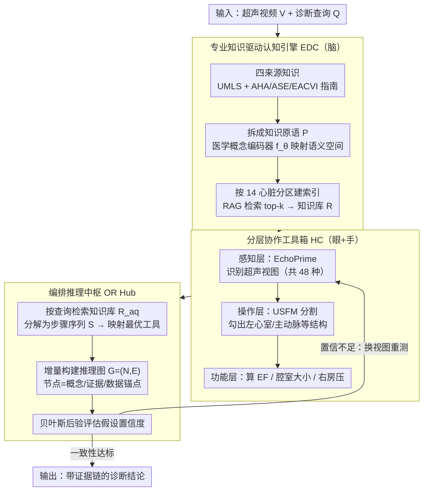

# EchoAgent: Towards Reliable Echocardiography Interpretation with "Eyes", "Hands" and "Minds"

**会议**: CVPR 2026  
**arXiv**: [2604.05541](https://arxiv.org/abs/2604.05541)  
**代码**: 无  
**领域**: Medical Imaging  
**关键词**: 超声心动图, Agent系统, 多模态大语言模型, 心脏功能评估, 工具调用

## 一句话总结

提出 EchoAgent，一个模拟心脏超声医师"眼-手-脑"协同工作流程的 Agent 系统，通过专业知识引擎（mind）、分层工具箱（eyes+hands）和编排推理中枢（reasoning hub）三阶段实现端到端超声心动图可靠解读，在多个基准上达到 SOTA。

## 研究背景与动机

超声心动图（Echo）是评估心脏功能最重要的无创影像手段之一，但其临床价值需要通过专家解读来释放。超声医师在解读时需要同步协调三种能力：

**"Eyes"（视觉观察）**：识别多种心脏视图，如心尖二腔、四腔、胸骨旁长轴等

**"Hands"（手动操作）**：对心脏结构进行定位、分割和关键参数的定量测量

**"Minds"（专业知识推理）**：学习临床知识、整合多模态证据并执行可靠的诊断推理

现有方法沿两条路径发展，但都存在明显不足：

- **任务特定深度学习模型**（如 MemSAM、EchoONE）：擅长分割等单一任务，具备"eyes+hands"但缺乏"minds"，无法自主完成完整诊断推理
- **多模态大语言模型**（如 GPT-5、Qwen2.5-VL）：具备"eyes+minds"的视觉问答能力，但缺乏 Echo 领域专业知识和定量分析的"hands"，推理常常缺乏临床依据

因此，当前仍缺乏一个集成"eyes-hands-minds"的端到端解决方案。EchoAgent 正是为填补这一空白而设计。

## 方法详解

### 整体框架

EchoAgent 把超声医师「学知识→看图像→做测量→下判断」的工作流拆成三个阶段，让一个 Agent 同时具备眼、手、脑。先由专业知识驱动认知引擎（EDC）建好领域知识库，给 Agent 一个会查指南的「脑」；再用分层协作工具箱（HC）配齐识别视图、分割结构、算临床参数的「眼」和「手」；最后由编排推理中枢（OR Hub）统筹调度，按诊断查询一步步检索知识、调用工具、构建证据，置信不足时回头补测，直到给出可追溯的结论。

### 关键设计

**1. 专业知识驱动认知引擎（EDC）：把超声指南变成可检索的「脑」**

通用 MLLM 在 Echo 上常凭空推理、缺临床依据，EDC 就是给它接上权威知识。它从 UMLS 医学库和 AHA/ASE/EACVI 超声指南等四大来源抓取知识，把异构文档拆成语义知识原语 $P=\{p_1, p_2, \ldots, p_D\}$，用医学概念编码器 $f_\theta(\cdot)$ 映射到高维语义空间，并按 14 个心脏解剖分区（左心室、二尖瓣、主动脉瓣等）建索引。诊断时通过 RAG 针对具体解剖结构检索 top-k 最相关原语、生成结构化知识库 $R$，让后续推理每一步都有指南背书。

**2. 分层协作工具箱（HC）：用三层工具补齐「眼」和「手」**

光有知识不会测量也没用，HC 用递进的三层把感知和操作能力补上。感知层用 EchoPrime 基础模型解析视频流、自动识别 48 种超声视图类型；操作层用基于 USFM 定制的分割模型勾出左心室、主动脉、右心室、左心房等关键结构；功能层再整合 USFM 与 EchoPrime 微调版，算出射血分数（EF）、腔室大小、右房压力等定量参数。从「看到哪个切面」到「量出哪个数值」一条龙，把 MLLM 缺的定量分析能力补齐。

**3. 编排推理中枢（OR Hub）：像医生一样反复确认的推理引擎**

有了脑和手，还需要一个会规划、会自查的中枢把它们串起来。OR Hub 先按诊断查询 $Q$ 检索相关知识库 $R_{a_q}$，把任务分解为可执行步骤序列 $S=\{s_1,\ldots,s_n\}$ 并各自映射到最优工具；执行中增量构建多模态推理图 $G=(N,E)$，节点是诊断概念/证据/数据锚点，边表示生成、支持-矛盾、推导等关系；再用贝叶斯后验评估假设置信度 $P(h_m|G(t)) \propto P(G(t)|h_m) \cdot P(h_m)$，一旦置信不足就自动触发补充检查（如换个视图重新测量），直到证据图达到一致性阈值。这套闭环把黑盒 LLM 的一次性输出，换成了可追溯、能自我纠错的推理过程。

### 一个完整示例

给定一段超声视频和「评估射血分数」的查询：OR Hub 先检索左心室相关知识，把任务拆成「识别心尖四腔/二腔视图 → 分割左心室内膜 → 按 Simpson 双平面法算 EF → 对照指南分级」几步。感知层认出可用视图，操作层分割出左心室，功能层算出 EF 值并落到推理图的数据锚点上；若此时假设置信度不够（如视图质量不佳），中枢会要求切换视图重新测量，补充证据后再更新推理图，最终给出带证据链的 EF 分级结论。

### 损失函数 / 训练策略

- 基础 MLLM 使用 Qwen3-VL-Plus；工具层的 FM 模型（EchoPrime、USFM）分别在超声数据上微调
- 知识库通过 RAG 机制动态检索，无需端到端联合训练
- CAMUS 数据集按 7:1:2 分为训练/验证/测试集
- EF 计算基于 Simpson's 双平面法（SMOD）

## 实验关键数据

### 主实验

**单结构任务（EF 分级，CAMUS 数据集）**：

| 方法 | 类型 | Normal Acc | Mildly Reduced Acc | Considerably Reduced Acc | 平均 Acc |
|------|------|-----------|-------------------|------------------------|---------|
| EchoONE | 任务特定 | 74.00 | 64.00 | 80.00 | 72.67 |
| GPT-5 | 通用MLLM | 44.00 | 61.00 | 55.00 | 53.33 |
| GPT-5* (增强) | E-H-M | 78.00 | 69.00 | 89.00 | 78.67 |
| **EchoAgent** | **E-H-M** | **88.00** | **80.00** | **92.00** | **80.00** |

**多结构任务（EchoQA，MIMIC-EchoQA 数据集）**：

| 方法 | Pericardium | Aortic Valve | Mitral Valve | Ventricles | Atria | Vessels | Others |
|------|------------|-------------|-------------|-----------|-------|---------|--------|
| GPT-5 | 60.98 | 40.91 | 36.78 | 26.32 | 36.99 | 38.71 | 44.44 |
| GPT-5* | 69.51 | 60.61 | 59.77 | 47.89 | 63.01 | 41.94 | 66.67 |
| **EchoAgent** | **84.15** | **82.58** | **81.61** | **75.26** | **80.82** | **77.42** | **70.37** |

EchoAgent 在所有 7 大类解剖结构上 Acc 均超过 70%，比最优 MLLM 平均高出 31.45%。

### 消融实验

| 配置 | EF Grading Acc | EchoQA Acc | 说明 |
|------|---------------|------------|------|
| Baseline (eyes+minds) | 35.00 | 43.57 | 仅 Qwen3-VL-Plus |
| +EDC (专业mind) | 50.00 (+15.00) | 51.45 (+7.88) | 加入领域知识 |
| +HC (skilled hands) | 73.00 (+37.00) | 59.97 (+16.40) | 加入操作工具 |
| +EDC+HC+OR (完整) | **80.00** (+45.00) | **79.42** (+35.85) | 完整协同 |

### 关键发现

1. 仅添加工具（GPT-5*）能大幅提升性能（+48.67%），但仍不及 EchoAgent，说明工具+知识+编排三者缺一不可
2. EchoAgent 的 AUROC 在三个 EF 分级阈值分别达到 98.43%、87.79%、93.88%，临床实用性强
3. 通用 MLLM 在各结构间表现极不均匀（如 GPT-5 在 Ventricles 仅 26.32%），而 EchoAgent 保持一致的高水平
4. 定量操作能力（"hands"）对 EF 分级贡献最大（+37%），而知识引擎对知识密集型任务更关键

## 亮点与洞察

1. **Agent 范式的成功应用**：将医学影像分析建模为 Agent 工作流而非单一模型，是一个有前景的方向。"eyes-hands-minds"类比直观且有效
2. **动态推理图设计**：通过增量构建多模态推理图实现可追溯推理，是对黑盒 LLM 输出的重要改进
3. **自适应机制**：低置信时自动补充证据的闭环设计，模拟了医生实际工作中的反复确认流程
4. **覆盖面广**：支持 48 种视图、14 种解剖结构的全面分析，接近全科超声检查的临床需求

## 局限与展望

1. **实时性未验证**：论文未讨论推理延迟，多轮工具调用可能耗时较长，难以满足实时临床需求
2. **依赖底层模型质量**：HC 工具箱中分割模型的精度直接影响上层推理，存在误差传播风险
3. **数据集规模有限**：CAMUS 仅 500 例，MIMIC-EchoQA 仅 622 例，泛化性仍需更大规模验证
4. **知识库更新机制不明**：医学指南持续更新，EDC 引擎如何跟进新知识未说明
5. **缺少与更多 Agent 系统的对比**：如 MedRAX 等医学 Agent 方法

## 相关工作与启发

- **MedRAX**：类似的医学 Agent 思路，但针对胸部 X 光而非超声
- **EchoPrime / EchoONE**：作为 EchoAgent 工具箱中的基础模型，展示了领域特定 FM 的价值
- **LangChain**：Agent 框架的工程实现基础
- 启发：未来可将此范式推广到其他复杂医学影像模态（如 CT/MRI 多序列分析），核心在于如何设计模态特定的工具箱

## 评分

- 新颖性: ⭐⭐⭐⭐ — Agent 范式应用于超声解读较新颖，但 Agent+RAG+工具调用的整体框架并非首创
- 实验充分度: ⭐⭐⭐⭐ — 两个数据集，充分的消融和对比，但数据规模偏小
- 写作质量: ⭐⭐⭐⭐⭐ — "eyes-hands-minds"类比贯穿全文，逻辑清晰，可读性优秀
- 价值: ⭐⭐⭐⭐ — 医学 AI 的实际应用潜力大，展示了 Agent 范式的工程价值

<!-- RELATED:START -->

## 相关论文

- [\[CVPR 2026\] Bridging the Skill Gap in Clinical CBCT Interpretation with CBCTRepD](bridging_the_skill_gap_in_clinical_cbct_interpreta.md)
- [\[CVPR 2026\] CURE: Curriculum-guided Multi-task Training for Reliable Anatomy Grounded Report Generation](cure_curriculum-guided_multi-task_training_for_reliable_anatomy_grounded_report_.md)
- [\[CVPR 2025\] EchoWorld: Learning Motion-Aware World Models for Echocardiography Probe Guidance](../../CVPR2025/medical_imaging/echoworld_learning_motion-aware_world_models_for_echocardiography_probe_guidance.md)
- [\[CVPR 2025\] EchoONE: Segmenting Multiple Echocardiography Planes in One Model](../../CVPR2025/medical_imaging/echoone_segmenting_multiple_echocardiography_planes_in_one_model.md)
- [\[ICCV 2025\] GDKVM: Echocardiography Video Segmentation via Spatiotemporal Key-Value Memory with Gated Delta Rule](../../ICCV2025/medical_imaging/gdkvm_echocardiography_video_segmentation_via_spatiotemporal_key-value_memory_wi.md)

<!-- RELATED:END -->
