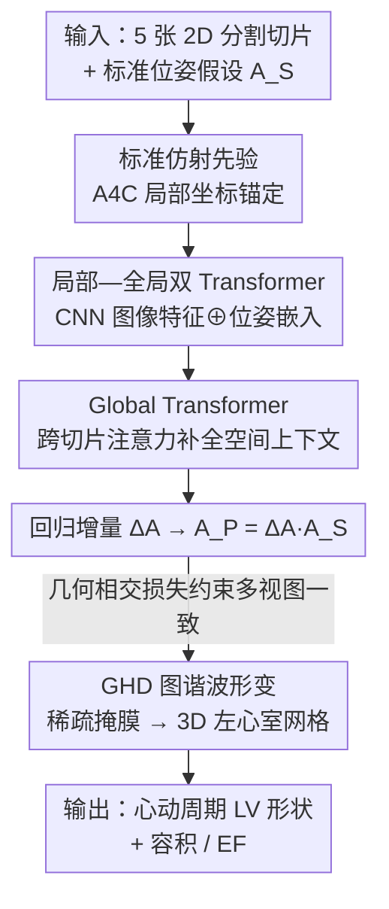

# EchoPOSE: 6D Pose Estimation of Sparse Echocardiograms for Left-Ventricular 3D Shape Reconstruction

**会议**: CVPR 2026  
**论文**: [CVF Open Access](https://openaccess.thecvf.com/content/CVPR2026/html/Iijima_EchoPOSE_6D_Pose_Estimation_of_Sparse_Echocardiograms_for_Left-Ventricular_3D_CVPR_2026_paper.html)  
**代码**: 无  
**领域**: 医学图像  
**关键词**: 超声心动图, 6D位姿估计, 左心室3D重建, Transformer, 几何一致性损失  

## 一句话总结
本文用一个 Transformer 网络 EchoPOSE 从临床常规采集的 5 张稀疏 2D 超声切片自动回归出每张切片的 6D 位姿（3 平移 + 3 旋转），再把摆好位的分割掩膜喂给图谐波形变（GHD）算法重建出整个心动周期的左心室 3D 形状，在合成 MITEA 数据上做到 3.78 mm / 8.65° 的位姿误差、87.5% Dice 和 1.44% 射血分数误差，无需任何外部追踪硬件就超过了临床金标准 Simpson 双平面法。

## 研究背景与动机

**领域现状**：2D 超声心动图因为安全、便宜、实时，是临床心脏成像里用得最多的方式，但它产出的是一堆**互相不知道彼此空间关系的 2D 切片**。要得到比 2D 更准的心脏功能量化（容积、射血分数），就需要 3D 超声，但 3D 探头因为操作和可视化困难在临床上几乎不用。一个折中路线是：用 3D 重建算法从 2D 切片"拼"出心脏形状。

**现有痛点**：重建算法需要每张 2D 切片在**统一坐标系下的位置和朝向（即 6D 位姿）**，可常规 2D 扫描根本不记录这个信息。最直接的补救是上外部硬件——IMU 或电磁追踪器——但它们有漂移、标定误差，还会被患者呼吸和体动干扰，且难以塞进临床流程。另一类做法干脆假设每个标准切面（A4C、A2C…）都摆在一个**固定的标准位姿**上，但真实徒手扫描的切片摆放千差万别，这种"假设标准位"会带来巨大误差（论文里这条 baseline 的 Dice 只有 64%）。

**核心矛盾**：稀疏、徒手采集的 2D 超声切片，其位姿既无传感器记录、又不能假设成固定标准位；而以往的切片位姿估计方法大多假设预定义视图集、依赖稠密体数据、或只做局部帧处理而**忽略切片间的全局空间关系**——这些假设对操作者技能依赖极强、几何高度不规则的徒手超声都不成立。

**本文目标**：分解成两个子问题——(1) 只靠 2D 图像内容、不依赖任何外部传感器，把每张稀疏切片的 6D 位姿估准；(2) 用估出的位姿驱动一个能在稀疏输入下工作的 3D 重建算法，把左心室形状和临床指标算准。

**切入角度**：既然单张切片本身信息不足，那就让网络**同时看局部图像特征和跨切片的全局上下文**——五个标准切面之间有固定的解剖几何关系（比如它们应该在心尖轴附近相交），利用这种相交关系既能补全单切片的歧义，又能作为监督信号约束位姿一致性。

**核心 idea**：用一个"局部特征 + 全局 Transformer 上下文"的网络回归切片位姿增量，并用一个**惩罚切片相交处不一致**的几何感知损失把多视图位姿拧成一个几何自洽的整体，再接可微的 GHD 形变完成稀疏重建。

## 方法详解

### 整体框架

整个 pipeline 解决的是"5 张无位姿的 2D 分割图 → 一颗 3D 左心室"这件事，分三步串起来：先给每张切片一个**标准位姿假设**（geometric prior），EchoPOSE 网络看图像内容把这个假设**修正**成真实 6D 位姿，最后把摆好位的分割掩膜交给 GHD 算法形变出 3D 网格。

具体地，输入是 5 个临床标准切面的分割掩膜：心尖四腔（A4C）、心尖三腔（A3C）、心尖两腔（A2C）、近心尖短轴（SAXA）、近心底短轴（SAXB）。位姿不在全局坐标系里估，而是**锚定在 A4C 切面的局部坐标系**下——A4C 固定为参考，其余切面相对它定义（比如 A2C 是绕心尖轴逆时针转 50°，A3C 再转 60°，两个短轴垂直于 A4C 并分别向心尖/心底平移 20 mm），这样把"估全局坐标"降成"估相对偏移"，大幅减小学习难度。每张切片的位姿写成仿射 $A=[x,y,z,\alpha,\beta,\gamma]$（轴角表示旋转）。网络不直接回归绝对位姿，而是回归一个**增量** $\Delta A$，把它转成 4×4 仿射矩阵点乘到初始标准假设 $A_S$ 上，得到预测位姿 $A_P$。

### 关键设计

**1. 局部—全局双 Transformer 位姿回归：单切片看不准就拉上邻居一起看**

单张稀疏切片信息不足、位姿天然有歧义，以往只做局部帧处理的方法因此误差很大（baseline Freitas 等 10.83 mm / 15.04°）。EchoPOSE 的做法是把"看图"和"看全局几何"两件事分两级 Transformer 做。每张分割图先过一个 CNN backbone 得到空间特征图，同时把它的初始 6D 假设向量过一个 MLP 得到位姿嵌入；两者拼接后送进一个**小的 Local Transformer** 做自注意力精炼，再用一个交叉注意力层去查询一张可学习的 patch codemap，得到每个视图的局部描述子。五个视图描述子拿齐后**堆叠送进更大的 Global Transformer 编码器**，靠跨 token 注意力捕捉切片间的几何关系（哪两个切面该相交、相对角度该是多少），产出上下文感知的全局描述子。最后每个视图把自己的局部 + 全局描述子拼起来过一个 FC 层回归出 6 维增量 $\Delta A$。消融里这两级缺一不可：只加 Local Transformer 把 Dice 从 68.2% 提到 77.1%，再加 Global Transformer 进一步提到 84.3%——全局上下文专门吃掉了朝向误差。

**2. 几何相交损失：让相邻切面在它们的交线上"对得上"**

光回归 6D 参数（MSE 损失 $L_{6D}$）只保证每张切片各自接近真值，但不保证一组切片**摆在一起几何自洽**——可能出现解剖上不可能的排布。本文借鉴经典基于强度的配准，加了一个相交损失 $L_{Intersec}$：对每一对预测后会相交的切面 $(i,j)$，先算出它们在 3D 中的交线，再用逆仿射把交线映回各自的局部坐标，沿交线采 $K=100$ 个点，用双线性插值取两张掩膜在对应点的强度 $I_i(p_{i,k})$、$I_j(p_{j,k})$，最小化它们的均方差：

$$L_{Intersec}=\frac{1}{|P|}\sum_{(i,j)\in P}\frac{1}{K}\sum_{k=1}^{K}\left[I_i(p_{i,k})-I_j(p_{j,k})\right]^2$$

直觉是：两个切面在它们交线上看到的应该是同一段心肌/腔体，强度理应一致；不一致就说明位姿摆错了。总损失 $L_{POSE}=w_{6D}\cdot L_{6D}+w_{Intersec}\cdot L_{Intersec}$（实现里 $w_{6D}=1.0$、$w_{Intersec}=0.1$）。消融显示在已经很强的 Local+Global 基础上再加这一项，把 Dice 从 84.3% 再顶到 87.5%、位姿误差从 4.62 mm/9.50° 压到 3.78 mm/8.65°，它的作用就是强制多视图几何一致。

**3. GHD 图谐波形变 + 可微切片监督：在频域里从 5 张稀疏切片长出一颗平滑心室**

有了摆好位的分割掩膜还要重建出 3D 形状，而稀疏输入是重建的老大难——体素法（marching cubes）有阶梯伪影且在稀疏采样下失效，统计形状模型要大量标注且形状约束太死，隐式神经表示又依赖稠密时序数据。本文用图谐波形变（GHD）：从一个标准左心室模板网格出发，先用相干点漂移（CPD）刚性配准到对齐后的掩膜上，再在**频域**里用一组曲面傅里叶波（spectral coefficients）来参数化网格形变，逐步逼近 2D 输入；取最终网格时**丢弃高频分量**，天然保证形状光滑。它的关键性质是**端到端可微**——通过可微体素化与切片（DVS）方法，可以直接用 2D 切片监督 3D 网格、做梯度优化，因此能在仅 5 张稀疏样本上跑 1000 次迭代 morph 出合理形状。论文把它和 OReX（预测稠密 SDF + marching cubes）对比，在相同位姿下 OReX 的 Dice 只有 69.3%、容积误差 20%，远不如 GHD 的 87.5%，证明在稀疏场景下 GHD 这种"模板形变 + 频域平滑"比"稠密场外推"更靠谱。

### 损失函数 / 训练策略
位姿网络用 $L_{POSE}=w_{6D}L_{6D}+w_{Intersec}L_{Intersec}$（$w_{6D}=1.0$，$w_{Intersec}=0.1$）。训练数据从 MITEA 的 3D 超声分割体里切出五个标准切面，再加随机扰动模拟徒手采集：平移在 $[-20,20]$ mm、旋转在 $[-15,15]^\circ$，每个体随机切 200 种视图组合，共 42,800 个训练样本（每样本 5 张 224×224 掩膜）。AdamW，50 epoch，batch 32，学习率 1e-4，单张 RTX 4070（16 GB）即可训练。

## 实验关键数据

### 主实验（位姿 + 重建 + 临床指标）

在 26 个留出扫描（14 健康 / 12 患病，260 张切片）上评估，对比无位姿监督、不建模全局上下文的 Freitas 等，以及把初始标准假设 $A_S$ 直接拿去重建的 baseline、临床金标准 Simpson 双平面法：

| 数据集 / 方法 | $d_{3D}$ (mm)↓ | $\theta_{3D}$ (°)↓ | 3D Dice↑ | 容积误差%↓ | EF 误差%↓ |
|---|---|---|---|---|---|
| Freitas et al. [7] | 10.83 | 15.04 | — | — | — |
| MITEA · Simpson 双平面 | — | — | — | — | 2.98 |
| MITEA · GHD（假设位姿 $A_S$） | 15.65 | 12.58 | 64.31 | 18.78 | 13.36 |
| **MITEA · EchoPOSE + GHD** | **3.78** | **8.65** | **87.52** | **3.03** | **1.44** |
| MITEA+AI · GHD（假设位姿） | 15.65 | 12.58 | 60.89 | 23.83 | 45.67 |
| **MITEA+AI · EchoPOSE + GHD** | **4.53** | **9.68** | **83.82** | **5.44** | **3.29** |
| Routine TTE · Simpson 双平面 | — | — | — | 17.15 | 9.35 |
| Routine TTE · GHD（假设位姿） | — | — | 57.99 | 16.68 | 16.45 |
| **Routine TTE · EchoPOSE + GHD** | — | — | **78.04** | **4.22** | **6.46** |

要点：EchoPOSE 把位姿误差从 baseline 的 10.83 mm/15.04° 砍到 3.78 mm/8.65°；在真实徒手 TTE 上即使有体动伪影，仍把容积误差从 Simpson 的 17.15% 降到 4.22%、EF 误差从 9.35% 降到 6.46%（EF 在 40%/50% 分类边界附近，这个改进对避免误分型有临床意义）。换成 nnU-Net 自动分割（MITEA+AI）后只小幅退化，说明能接进全自动流程。

### 消融实验（架构组件 + 重建策略）

| AS | TL | TG | $L_{Intersec}$ | 重建 | $d_{3D}$↓ | $\theta_{3D}$↓ | 3D Dice↑ | EF%↓ |
|---|---|---|---|---|---|---|---|---|
| ✓ | — | — | — | GHD | 13.84 | 17.78 | 68.20 | 12.93 |
| ✓ | ✓ | — | — | GHD | 11.02 | 11.05 | 77.08 | 3.56 |
| ✓ | ✓ | ✓ | — | GHD | 4.62 | 9.50 | 84.32 | 1.91 |
| ✓ | ✓ | ✓ | ✓ | **GHD** | **3.78** | **8.65** | **87.52** | **1.44** |
| — | ✓ | ✓ | ✓ | GHD | 4.88 | 9.52 | 85.94 | 1.99 |
| ✓ | ✓ | ✓ | ✓ | OReX+MC | 3.78 | 8.65 | 69.27 | 4.46 |

（AS = 标准位姿先验，TL = Local Transformer，TG = Global Transformer）

### 关键发现
- **全局 Transformer 贡献最大**：从只有 TL（Dice 77.1%）到加上 TG（84.3%），朝向误差 $\theta_{3D}$ 从 11.05° 直接掉到 9.50°——跨切片上下文是把朝向估准的关键。相交损失再补约 +3.2% Dice，负责拧紧几何一致性。
- **重建算法不可替换**：位姿完全相同时，把 GHD 换成 OReX+marching cubes，Dice 从 87.5% 暴跌到 69.3%、容积误差从 3% 涨到 20%——稀疏场景下 GHD 的"模板形变 + 频域平滑"远胜稠密 SDF 外推。
- **标准位姿先验 $A_S$ 有用但非必需**：去掉 $A_S$ 后退化到 4.88 mm/9.52°/85.9%，说明这个几何先验给了网络一个好起点。
- **视图越多越好但 3 个心尖视图已近最优**：仅 A4C+A2C 时 Dice 76%，加到 A4C+A2C+A3C 三个心尖视图就达 85.7%、EF 误差 1.45%（接近五视图水平），SAXA 增益很小，SAXB 把空间精度推到最佳——这意味着临床上视图采不全也能用。
- **健康 vs 患病**：患病心脏因解剖变异更大误差略升（$d_{3D}$ 4.49 vs 3.18 mm），但 Dice 仍 >87%（MITEA）/ >83%（+AI），泛化稳健。

## 亮点与洞察
- **把"无位姿信息"这个死结，从"上硬件"转成"从图像内容 + 几何先验里学"**：用 A4C 局部坐标锚定 + 回归增量而非绝对位姿，巧妙地把全局位姿估计降维成"修正标准假设"，既减小学习难度又自带可解释性。
- **相交损失是个很可迁移的自监督式几何约束**：任意一组本应相交的切片/视图，都可以用"交线上观测应一致"来互相约束，不需要额外标注。这个思路可以迁移到 CT/MRI 多切片对齐、甚至多相机标定。
- **可微重建（GHD+DVS）让 2D 切片能直接监督 3D 网格**：频域参数化 + 丢高频天然保证光滑，是稀疏重建里一个优雅的归纳偏置，比稠密 SDF 外推鲁棒得多。
- **临床落地角度**：方法对探头摆位不标准、视图数变化都鲁棒，意味着可以**降低对操作者超声技能的要求**，让受训不多的临床人员也能采到可用于 3D 量化的扫描——这是它真正的价值点。

## 局限与展望
- **强依赖分割掩膜作为输入**：网络吃的是 LV 心肌/腔体分割图而非原始超声，分割质量直接决定上限（MITEA+AI 用 90% Dice 的 nnU-Net 时性能已经下滑）。端到端从原始图像做位姿可能更实用。
- **训练几乎全靠合成数据**：4 万多样本都是从 3D 体切片 + 随机扰动模拟徒手采集得到的，真实临床验证集只有 18 例 TTE（且都是健康志愿者），真实患病心脏上的泛化还需更大规模前瞻验证。⚠️ 真实 TTE 上 Dice 78%、EF 误差 6.46%，明显比合成数据差，sim-to-real gap 仍在。
- **固定五个标准切面的几何假设**：A2C/A3C 相对 A4C 的旋转角（50°/60°）、短轴平移（20 mm）是写死的先验，对解剖严重异常或非标准采集可能失配。
- **改进思路**：把分割与位姿联合端到端训练；引入时序一致性约束整段心动周期；用更大规模、含病变的真实配对 2D/3D 数据缩小 sim-to-real 差距。

## 相关工作与启发
- **vs Freitas et al. [7]（FoCUS 切片相交热图）**: 他们用 U-Net 预测成对切片相交的热图，但需要粗到细网格搜索做大量后处理来恢复单切片位姿，且假设预定义视图、忽略全局上下文；本文直接用 Global Transformer 端到端回归全局一致的 6D 位姿，误差从 10.83 mm/15.04° 降到 3.78 mm/8.65°。
- **vs Simpson 双平面法（临床金标准）**: 它假设横截面圆对称，几何理想化带来已知误差；本文重建真实 3D 形状，在真实 TTE 上把容积误差从 17.15% 降到 4.22%。
- **vs 基于 SDF 的稀疏重建（OReX [21] / CrossSDF [26]）**: 它们从稀疏 SDF 样本预测稠密场再 marching cubes，依赖强外推、计算量大，稀疏下 Dice 仅 69%；本文 GHD 用模板形变 + 频域平滑，同位姿下 Dice 87.5%。
- **vs 网格形变法 [28]（从稀疏 cine MRI 形变模板）**: 它用图卷积网络靠 2D 图像特征引导形变，但只用部分轮廓监督、缺乏显式空间/位姿信息，对视图错位敏感；本文先把位姿估准再形变，从源头解决了对齐问题。

## 评分
- 新颖性: ⭐⭐⭐⭐⭐ 首次把"纯图像驱动的稀疏切片 6D 位姿估计 + 可微 GHD 重建"组合用于徒手超声左心室 3D 重建，相交损失的几何自监督很巧。
- 实验充分度: ⭐⭐⭐⭐ 合成 + AI 分割 + 真实 TTE 三档验证，消融拆到每个组件，但真实临床集仅 18 例健康志愿者偏小。
- 写作质量: ⭐⭐⭐⭐⭐ 动机—方法—实验逻辑清晰，图表完整，临床意义交代到位。
- 价值: ⭐⭐⭐⭐⭐ 无需硬件即可从常规 2D 扫描做 3D 量化，有降低超声操作门槛的真实临床落地潜力。

<!-- RELATED:START -->

## 相关论文

- [\[CVPR 2026\] GaussianPile: A Unified Sparse Gaussian Splatting Framework for Slice-based Volumetric Reconstruction](gaussianpile_a_unified_sparse_gaussian_splatting_framework_for_slice-based_volum.md)
- [\[ECCV 2024\] Shape-Guided Configuration-Aware Learning for Endoscopic-Image-Based Pose Estimation of Flexible Robotic Instruments](../../ECCV2024/medical_imaging/shape-guided_configuration-aware_learning_for_endoscopic-image-based_pose_estima.md)
- [\[CVPR 2026\] Prospective Dynamic 3D MRI Reconstruction via Latent-Space Motion Tracking from Single Measurement](prospective_dynamic_3d_mri_reconstruction_via_latent-space_motion_tracking_from_.md)
- [\[CVPR 2026\] Real2Sim2Real: RetinalDepth-64K for Depth Estimation in Posterior Segment Ophthalmic Surgery](real2sim2real_retinaldepth-64k_for_depth_estimation_in_posterior_segment_ophthal.md)
- [\[CVPR 2026\] Depth Any Endoscopy: Towards Self-Supervised Generalizable Depth Estimation in Monocular Endoscopy](depth_any_endoscopy_towards_self-supervised_generalizable_depth_estimation_in_mo.md)

<!-- RELATED:END -->
