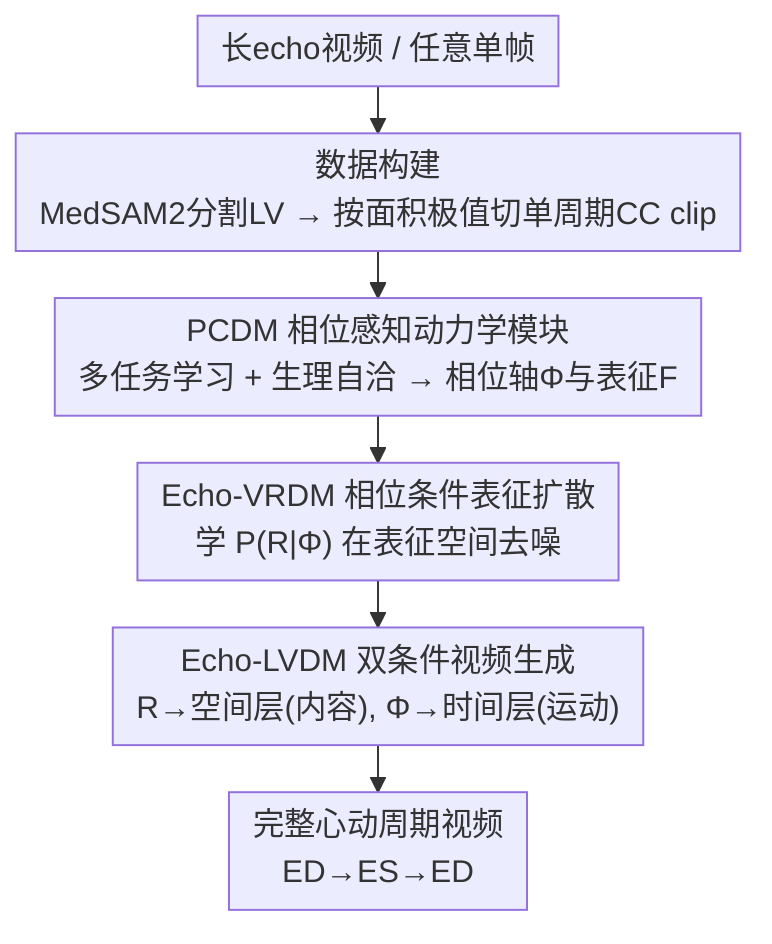

# EchoVDiff: Cardiac-Cycle Echocardiography Video Generation from Arbitrary Single Frame

**会议**: CVPR 2026  
**论文**: [CVF Open Access](https://openaccess.thecvf.com/content/CVPR2026/html/Zhang_EchoVDiff_Cardiac-Cycle_Echocardiography_Video_Generation_from_Arbitrary_Single_Frame_CVPR_2026_paper.html)  
**代码**: https://github.com/JsongZhang/Echo-V-Diff  
**领域**: 医学图像 / 扩散模型 / 视频生成  
**关键词**: 超声心动图、心动周期、相位感知、表征扩散、单帧驱动视频生成  

## 一句话总结
EchoVDiff 给超声心动图视频生成显式装上一根"心动相位轴"：先用多任务学习把左心室面积变化拟合成一个连续的循环相位，再用两个相位条件扩散模型从**任意单帧**重建出生理一致的完整 ED→ES→ED 心动周期视频，在 EchoNet-Dynamic 上把 FVD 从 630 降到 535。

## 研究背景与动机
**领域现状**：超声心动图（Echo）是无创、实时评估心脏结构与功能的主流手段，下游的腔室分割、射血分数估计都依赖**完整、标准、高质量**的视频输入。但临床采集高度依赖操作者，视频质量、视角、周期覆盖差异极大，于是有人想用生成模型从单帧"补全"一段心动视频。

**现有痛点**：现有 image-to-video（I2V）方法（DynamiCrafter、Ultrasound-I2V 等）几乎都只沿时间轴**单向向前**合成运动，把时间当成简单的帧索引。这带来两个硬伤：一是只能从第一帧（通常是舒张末 ED）出发，无法从任意相位的帧重建完整周期；二是没有建模心脏运动**内在的周期性**，导致时序连贯性和语义一致性都不足。

**核心矛盾**：心动周期不是均匀的循环——收缩期（ED→ES，时长约占 1/3）和舒张期（ES→ED，约占 2/3）是**非对称**的。把物理时间直接当相位用，既丢了这种非对称节律，也无法让生成过程"知道"自己现在处于收缩还是舒张。

**本文目标**：能不能从**单张任意相位的帧**重建出完整、生理可信的心动周期？作者把它拆成两步——先学到一个"时间动态 ↔ 生理状态"的一致映射，再把这种一致性嵌进生成过程。

**核心 idea**：构造一根**显式、可学习的循环相位轴 Φ**，让它把视觉动态和生理状态对齐；扩散模型只是用来证明"有了这根轴就能做可控、生理一致的合成"的载体。

## 方法详解

### 整体框架
EchoVDiff 是一个**三阶段串行**框架，核心是一根贯穿始终的相位轴 Φ。输入是任意单帧超声图，输出是完整的 ED→ES→ED 心动周期视频。

数据侧先做准备：用医学基础模型 **MedSAM2** 对长视频做左心室（LV）分割，再按 LV 面积的极大/极小值（对应 ED/ES）把多周期长视频切成一个个**单周期片段（CC clip）**。在此基础上，三个阶段依次工作：①**PCDM**（相位感知心动动力学模块）通过多任务学习 + 生理自洽约束，把通用视频编码器 $E$ 训成一个"相位感知编码器"，同时产出逐帧相位 $\Phi$ 和可解码相位的表征 $F$；②**Echo-VRDM** 在表征空间学习相位条件分布 $P(R\mid\Phi)$，让模型能从噪声"凭空"采样出一段表征序列；③**Echo-LVDM** 把表征 $R$（内容）和相位 $\Phi$（运动）分别注入预训练视频扩散器的空间层和时间层，在像素空间生成高保真、相位可控的视频。

### 关键设计

**1. PCDM：把"时间索引"换成可学习的循环相位轴**

这是全文真正的创新所在，针对的痛点是"现有方法把时间当帧索引、丢了心动的非对称周期性"。PCDM 用一个共享视频编码器 $E$ 提取时空特征 $F=E(I)$，然后挂三个并行解码头做多任务学习：LV 分割头、LV 面积回归头、相位回归头。其中面积不是独立预测的，而是直接对预测掩膜求可微求和 $\hat{A}_t=\sum_{x,y}\hat{M}_t(x,y)$，把分割几何和面积曲线强耦合起来。

最关键的是相位回归。作者用一个**非对称时间扭曲函数**把归一化物理时间 $\tau_t$ 映射成对称相位 $\theta_t\in[0,2\pi)$：

$$\theta_t = W(\tau_t,\alpha)=\begin{cases}\pi\cdot\dfrac{\tau_t}{\alpha}, & \tau_t\in[0,\alpha]\ (\text{收缩})\\[6pt]\pi\left(\dfrac{\tau_t-\alpha}{1-\alpha}+1\right), & \tau_t\in(\alpha,1]\ (\text{舒张})\end{cases}$$

它把不等长的收缩期/舒张期（$\alpha\approx 1/3$）分别线性拉伸到等长的相位区间 $[0,\pi)$ 和 $[\pi,2\pi)$，于是 ED 落在 $0/2\pi$、ES 落在 $\pi$。为避免 $0/2\pi$ 处的不连续，相位用单位圆上的点 $y_t=(\cos\theta_t,\sin\theta_t)$ 表示，回归头输出二维向量后归一化，直接最小化到真值的 L2 距离（等价于单位圆上弦长平方），从而绕开了 atan2 的数值不稳定。这样学到的不再是线性时间，而是一条能区分收缩/舒张、把 ED/ES 钉在固定锚点的**循环相位流形**。

**2. 生理自洽正则：不用额外标注，让相位与面积互相约束**

光有监督损失只能让模型各自预测好结构/面积/相位，但学不到它们之间的**因果关系**（相位演化由 LV 收缩-舒张驱动）。作者加了一组**纯作用在模型自身预测上、不需要任何外部标签**的生理自洽约束，这正是它能从任意帧泛化的底气。

具体三条：①**单调性约束**——用预测相位的正弦分量 $\hat{s}_t$ 把周期切成收缩相（$\hat{s}_t>0$）和舒张相（$\hat{s}_t<0$），对面积差分 $\Delta\hat{A}_t$ 施加软惩罚 $L_{mono}=\frac{1}{|I_{sys}|}\sum_{t\in I_{sys}}\mathrm{ReLU}(\Delta\hat{A}_t)+\frac{1}{|I_{dia}|}\sum_{t\in I_{dia}}\mathrm{ReLU}(-\Delta\hat{A}_t)$，强制收缩期面积减小、舒张期面积增大；②**ED/ES 对齐**——用可微 soft-argmax 找到面积曲线的峰（ED）和谷（ES），用余弦距离 $L_{peak}=(1-\hat{c}^{norm}_{t_{ED}})+(1+\hat{c}^{norm}_{t_{ES}})$ 把它们拉到相位的 $\theta=0$ 与 $\theta=\pi$；③**面积-相位映射**——再用一个轻量 MLP $g_\omega$ 显式拟合相位向量到面积的非线性映射 $\tilde{A}_t=g_\omega(\hat{y}^{norm}_t)$，约束所有 $(\hat{A}_t,\hat{y}^{norm}_t)$ 落在同一条可学习曲线上。总目标是六项损失的加权和 $L_{total}=\lambda_{seg}L_{seg}+\lambda_{area}L_{area}+\lambda_{phase}L_{phase}+\lambda_{mono}L_{mono}+\lambda_{peak}L_{peak}+\lambda_{curve}L_{curve}$。

**3. Echo-VRDM：在表征空间做相位条件去噪，支持 de novo 合成**

PCDM 训出的编码器 $E$ 是确定性的，只能从真实视频提特征，没法"凭空"生成。受 RCG 启发，作者不直接建模高维像素分布 $P(I)$，而是在更紧凑、语义结构化的表征空间建模：把 $F$ 经全局平均池化压成逐帧 $D$ 维向量 $r_t$，得到序列 $R_0\in\mathbb{R}^{T\times D}$，然后学相位条件分布 $P(R_0\mid\Phi)$。

去噪网络是一个 Transformer：前向加噪 $R_k=\sqrt{\bar\alpha_k}R_0+\sqrt{1-\bar\alpha_k}\epsilon$，每个 TF block 做时间自注意力（帧间通信）+ 交叉注意力（相位条件细化）+ FFN。扩散步 $k$ 经正弦嵌入后通过 **adaLN**（$\mathrm{adaLN}(x)=\gamma_k\mathrm{LN}(x)+\beta_k$）调制各层；周期相位 $\phi_t$ 经周期性正弦函数编码后作为交叉注意力的 key/value 注入。训练用 $\ell_2$ 噪声预测损失，并以 15% 概率把相位条件换成可学习的 null 嵌入，从而在推理时支持无分类器引导（CFG）做可控相位合成。

**4. Echo-LVDM：双条件解耦——内容进空间层、运动进时间层**

最后一步把相位轴的价值落到像素上。Echo-LVDM 在预训练的 VideoLDM 上微调，关键设计是**把两个条件注入不同的层来解耦内容与运动**：语义表征 $R$ 注入**空间层**控制解剖内容——复用预训练的交叉注意力模块替代原本的文本条件，query 来自空间特征、key/value 来自投影后的 $r_t$；相位嵌入 $\Phi$ 注入**时间层**控制运动节律——在时间注意力后新增一层 Temporal Cross-Attention，query 来自时间特征、key/value 来自 $\Phi$，让帧间过渡与心动相位对齐。只微调新注入的模块 $\Psi$，其余参数冻结，损失为标准噪声预测 $L_{Echo\text{-}LVDM}=\mathbb{E}\|\epsilon-f_{\theta_{frozen},\Psi}(Z_k,k,R,\Phi)\|^2$。推理时给定目标相位 $\Phi_{target}$，先由 Echo-VRDM 采样出 $R_{gen}$，再与 $\Phi_{target}$ 一起引导扩散采样重建视频。

> ⚠️ 论文图中 Echo-VRDM 与 Echo-LVDM 的条件来源标注略有交叉（表征条件标为"由 Echo-VRDM 输出"，但正文 3.4 又写成"by Echo-LVDM"），此处以正文 3.3/3.4 文字描述为准：$R$ 由 Echo-VRDM 在表征空间生成，$\Phi$ 由 PCDM 提供。

### 损失函数 / 训练策略
三阶段分别训练。PCDM 端到端用 AdamW（lr=1e-4，batch=16）训练，权重 $\lambda_{seg}=1.0,\lambda_{phase}=1.0,\lambda_{area}=0.5,\lambda_{mono}=0.05,\lambda_{peak}=0.1,\lambda_{curve}=0.05$，编码器用在 28.6 万段超声视频上预训练的 EchoFM（ViT）。Echo-VRDM 是 6 层 Transformer（dim=1024，8 头），$K=1000$ 步线性 β 调度，相位以 15% 概率 drop 做 CFG。Echo-LVDM 的 U-Net 由 WebVid-10M 预训练的 VideoLDM 初始化，冻结主干、只训投影层和新增时间交叉注意力，对 $R$ 和 $\Phi$ 各 10% dropout 做 CFG。

## 实验关键数据

### 主实验
两个公开数据集：EchoNet-Dynamic（经 MedSAM2 得 30,247 个完整心动周期）和 EchoNet-Pediatric。评价用 FVD、FID（整体/逐帧保真度）+ tLPIPS、tSSIM（时序连贯性）。统一在单帧设定下对比六种代表性方法，输出标准化为 13 帧 ED→ES→ED 周期。

EchoNet-Dynamic 主结果：

| 方法 | FVD↓ | FID↓ | tLPIPS↓ | tSSIM↑ |
|------|------|------|---------|--------|
| FOMM (NeurIPS'19) | 1036.87 | 118.42 | 0.386 | 0.712 |
| TPS (CVPR'22) | 1172.43 | 124.51 | 0.372 | 0.725 |
| DynamiCrafter (ECCV'24) | 869.70 | 102.67 | 0.331 | 0.753 |
| VideoCrafter (CVPR'24) | 850.48 | 95.38 | 0.298 | 0.767 |
| Ultrasound-I2V (MICCAI'24) | 683.39 | 84.76 | 0.261 | 0.785 |
| VTG (ICCV'25) | 630.78 | 78.92 | 0.245 | 0.799 |
| **EchoVDiff (本文)** | **535.61** | **71.34** | **0.218** | **0.821** |

相比次优的 VTG，FVD 降 15.1%、FID 降 9.6%、tLPIPS 降 11.0%、tSSIM 升 2.8%；EchoNet-Pediatric 上有类似领先（FVD 643.57 vs VTG 718.64）。

任意帧鲁棒性（EchoVDiff 的核心卖点）——从不同相位的帧出发，指标几乎不变：

| 提示帧（相位） | FVD↓ | FID↓ | tLPIPS↓ | tSSIM↑ |
|----------------|------|------|---------|--------|
| Frame 1 (ED, $\phi\approx0$) | 535.61 | 71.34 | 0.218 | 0.821 |
| Frame 6 (ES, $\phi\approx\pi$) | 542.17 | 73.05 | 0.224 | 0.817 |
| Frame 11 (晚舒张, $\phi\approx1.7\pi$) | 540.88 | 72.81 | 0.222 | 0.819 |

### 消融实验
在 EchoNet-Dynamic 上拆开两个条件 Φ（相位，来自 PCDM）和 R（表征，来自 Echo-VRDM）：

| 配置 | Phase Φ | Rep. R | FVD↓ | FID↓ |
|------|---------|--------|------|------|
| (A) Baseline 无条件 | | | 1050.32 | 115.40 |
| (B) 仅相位 | ✓ | | 710.22 | 92.15 |
| (C) 仅表征 | | ✓ | 612.45 | 78.50 |
| (D) 完整模型 | ✓ | ✓ | 535.61 | 71.34 |

### 关键发现
- **两个条件互补**：仅相位主要改善时序连贯（FVD 1050→710），仅表征主要改善空间保真和隐式动态（FID 115.40→78.50，FVD→612），二者合用才同时拿到最佳（FVD 535.61，FID 71.34）。这印证了"内容进空间层、运动进时间层"的解耦设计是有效的而非冗余。
- **相位轴带来任意帧鲁棒性**：从 ES、晚舒张帧出发时 FVD/FID 与从 ED 出发仅有边际差异（535.61 vs 542.17/540.88），说明相位感知表征确实摆脱了对固定起点的依赖。
- **Reader Study**：55 例私有 A4C 病例、3 名初级心脏超声医师双盲评分，EchoVDiff 在视觉质量、解剖保真、时序一致三个维度均获最高分并被一致偏好，接近 GT、超过 VTG 和 Ultrasound-I2V。

## 亮点与洞察
- **把"时间"显式建模成生理相位轴**是最漂亮的一招：用非对称时间扭曲函数 $W(\tau,\alpha)$ 把不等长的收缩/舒张拉到对称相位区间，再用单位圆表示绕开 atan2 不连续，整个相位回归既符合生理又数值稳定。这套"领域物理先验 → 可微约束"的思路可迁移到任何有周期/相位结构的医学信号（呼吸、步态、肠蠕动）。
- **生理自洽正则不依赖任何外部标签**：单调性、ED/ES 对齐、面积-相位映射三条约束全部作用在模型自身预测上，等于用物理常识当"免费监督"，这是它能在弱标注场景泛化的关键。
- **解耦注入很巧**：R→空间交叉注意力（替换文本条件）、Φ→新增时间交叉注意力，把"长什么样"和"怎么动"分到 U-Net 的不同层，消融数据直接证明二者互补。这种"按物理语义选择注入层"的做法比简单 concat 条件更可控。

## 局限与展望
- 论文未在像素扩散端做生理一致性的定量验证（如生成视频反推射血分数是否准确），临床可用性还停留在保真度/读者偏好层面。
- 整个方法强依赖 MedSAM2 的 LV 伪标签质量和 EchoFM 的预训练编码器；在 MedSAM2 分割不准（声窗差、伪影重）的真实低质视频上是否仍稳健，正文未充分展示——而"低质采集"恰恰是动机里强调的痛点。
- 非对称扭曲函数把 $\alpha$ 固定为 1/3，但心率/病理（如心衰、心律不齐）会让收缩-舒张比例显著偏离 1/3，固定 $\alpha$ 可能限制泛化；把 $\alpha$ 做成可学习或逐病例估计或是一个改进方向。⚠️ 这点是笔者推测，论文未讨论。
- 三阶段串行、训练流程偏重，端到端联合训练能否进一步提升一致性值得探索。

## 相关工作与启发
- **vs Ultrasound-I2V / VTG**：它们是医学 I2V 的强基线，但仍沿时间轴单向生成、依赖固定起点（VTG 甚至需要首末两帧 $(I_0,I_T)$）。EchoVDiff 用显式相位轴支持**任意单帧**驱动，且 FVD 全面领先（535 vs 630/683）。
- **vs DynamiCrafter / VideoCrafter**：通用视频扩散器照搬到超声上只建模时序连续性，不懂心动周期，FVD 高达 850+。本文的核心区别是把生理先验编进相位轴，而不是堆数据或加通用约束。
- **vs RCG**：借鉴了"在紧凑表征空间而非像素空间做扩散"的思路（Echo-VRDM），但把无条件表征生成扩展成**相位条件**的 $P(R\mid\Phi)$，让生成过程可被生理状态控制。

## 评分
- 新颖性: ⭐⭐⭐⭐⭐ 首次实现单帧驱动的完整心动周期超声视频生成，显式相位轴 + 生理自洽正则的组合很有洞见。
- 实验充分度: ⭐⭐⭐⭐ 两数据集 + 任意帧鲁棒性 + 条件消融 + 读者研究，较完整；但缺像素端生理指标和低质输入的鲁棒性验证。
- 写作质量: ⭐⭐⭐⭐ 动机推导清晰、公式完整；个别图注条件来源标注略有歧义。
- 价值: ⭐⭐⭐⭐⭐ 解决了临床采集不标准的真实痛点，相位建模范式对周期性医学信号生成有迁移价值。

<!-- RELATED:START -->

## 相关论文

- [\[CVPR 2026\] OSA: Echocardiography Video Segmentation via Orthogonalized State Update and Anatomical Prior-aware Feature Enhancement](osa_echocardiography_video_segmentation_via_orthogonalized_state_update_and_anat.md)
- [\[CVPR 2026\] Semi-supervised Echocardiography Video Segmentation via Anchor Semantic Awareness and Continuous Pseudo-label Reforging](semi-supervised_echocardiography_video_segmentation_via_anchor_semantic_awarenes.md)
- [\[CVPR 2026\] Unleashing Video Language Models for Fine-grained HRCT Report Generation](unleashing_video_language_models_for_fine-grained_hrct_report_generation.md)
- [\[NeurIPS 2025\] A Unified Solution to Video Fusion: From Multi-Frame Learning to Benchmarking](../../NeurIPS2025/medical_imaging/a_unified_solution_to_video_fusion_from_multi-frame_learning_to_benchmarking.md)
- [\[CVPR 2026\] URICA: A Uniformity Region Affine Identifier Capture Algorithm for Arbitrary Region Retrieval in Pathology Images](urica_a_uniformity_region_affine_identifier_capture_algorithm_for_arbitrary_regi.md)

<!-- RELATED:END -->
