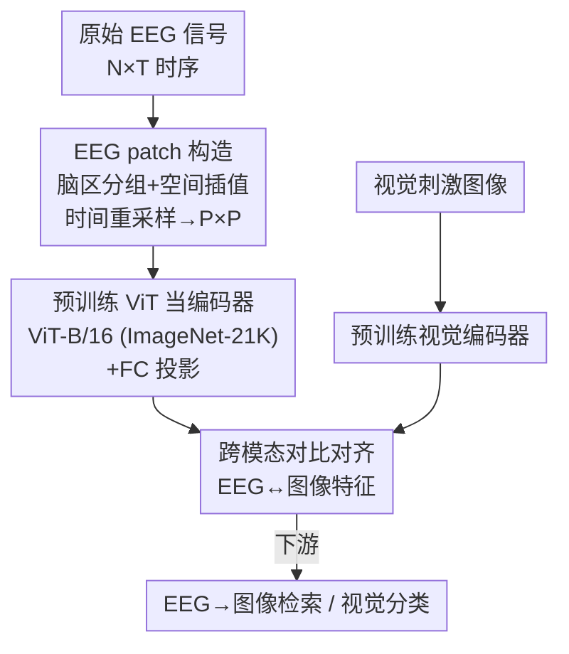

# EEGiT: Teaching Vision Transformers to Understand the EEG signal

**会议**: CVPR 2026  
**论文**: [CVF Open Access](https://openaccess.thecvf.com/content/CVPR2026/html/Zhou_EEGiT_Teaching_Vision_Transformers_to_Understand_the_EEG_signal_CVPR_2026_paper.html)  
**代码**: 未公开  
**领域**: 脑信号解码 / 医学图像  
**关键词**: EEG 解码, Vision Transformer, 跨模态对齐, 视觉先验迁移, 脑机接口  

## 一句话总结
EEGiT 把一维 EEG 时序信号"画"成形如图像 patch 的二维 EEG patch，从而能直接拿在 ImageNet-21K 上预训练好的 ViT 当 EEG 编码器，用图像域的视觉先验缓解 EEG 数据稀缺，在 THINGS-EEG 检索与 EEG-3D 分类上都刷到 SOTA。

## 研究背景与动机
**领域现状**：从非侵入式脑信号里解码人看到了什么，是脑机接口（BCI）的核心任务之一。相比 fMRI，EEG 时间分辨率高、采集便宜，是更现实的载体。主流做法是把 EEG 当成原始时序序列 $e\in\mathbb{R}^{N\times T}$（$N$ 个电极、$T$ 个时间点），从头训练一个定制 EEG 编码器，或用 mask 自监督预训练（如 LaBraM 的向量量化 tokenizer、ATM-S 的通道注意力 + 时空卷积），再把 EEG 特征和视觉特征投到同一隐空间做对比对齐。

**现有痛点**：EEG 配对数据集太小——和海量图像没法比，导致从头训的编码器学不到丰富语义。更糟的是 EEG 信噪比（SNR）极低、被试间差异（inter-subject variability）巨大、不同数据集的采集设备和预处理协议又各不相同，于是模型严重过拟合、跨被试 / 跨数据集泛化都很差。

**核心矛盾**：图像域有现成的强大架构 + 大规模预训练模型可白嫖，EEG 域却既没有标准化建模框架、也没有通用预训练表征，每篇论文都要重造一个 EEG 编码器从零练。数据少 → 没法预训练 → 表征弱，形成死循环。

**本文目标**：能不能不再为 EEG 单独造轮子，而是直接把图像域里训好的视觉先验（尤其是 ViT）搬过来用，绕开"EEG 没有大规模预训练"这个瓶颈。

**切入角度**：ViT 把图像切成 patch token 序列再做自注意力，本质上吃的是"结构化的二维网格"。如果能把 EEG 信号也重组成和图像 patch 同构的形式，预训练 ViT 就能被直接复用——关键障碍只是 EEG 的 $N\times T$ 维度不固定、且和 $224\times224\times3$ 的图像格式对不上。

**核心 idea**：把 EEG 重新表示成"image-like 的 EEG patch"，让一个预训练 ViT 直接当 EEG 编码器，用对比学习把 EEG 特征拉到视觉特征空间。

## 方法详解

### 整体框架
EEGiT 的输入是一段原始 EEG 录制 $e\in\mathbb{R}^{N\times T}$ 与其对应的视觉刺激图像 $v$，输出是同一隐空间 $\mathcal{H}$ 里对齐的 EEG 特征与图像特征，下游用于 EEG-to-image 检索和 EEG 视觉分类。整条流水线的关键转折在于：**先把 EEG 时序信号改造成形如图像 patch 的二维结构，再让一个预训练 ViT 把它当图像 patch 来编码**，这样图像域学到的视觉先验就能直接迁移到神经信号上。

具体分四步：① 对 EEG 做 z-score 归一化，让数值分布向图像靠拢；② 沿空间维把电极按脑区分组并线性插值、沿时间维均匀重采样，拼成 $P\times P$ 的 EEG patch，并复制三遍凑成 RGB 通道；③ 把 EEG patch 喂给 ViT-B/16（ImageNet-21K 预训练）编码器，后接一个全连接层投影到视觉特征维度；④ 用对比损失把 EEG 特征和预训练视觉编码器抽出的图像特征对齐。视觉编码器固定提供"锚点"，EEG 这一侧被拉过去。

### 关键设计

**1. EEG patch：把一维脑信号重排成与图像 patch 同构的二维网格**

这是全文的根基，直接针对"EEG 维度 $N\times T$ 不固定、与图像格式对不上、ViT 没法直接吃"的痛点。作者不是简单 reshape，而是按**脑解剖结构**重组信号。先对每个信号点做全数据集级的 z-score 归一化 $\hat y=(y-\mu)/\sigma$，把 EEG 的数值尺度对齐到图像。然后把所有电极按大脑功能分成五个区——额叶（frontal）、中央（central）、颞叶（temporal）、顶叶（parietal）、枕叶（occipital）。由于各区电极数 $N_r$ 不同，沿**空间维**用线性插值把每个脑区统一重采样到 $P$ 个电极：对第 $i$ 个新位置，$x_i = i\cdot\frac{N_r-1}{P-1}$，取 $j=\lfloor x_i\rfloor$、$\alpha_i = x_i - j$，插值得 $y_i' = (1-\alpha_i)\,y_j + \alpha_i\,y_{j+1}$（边界处 $j=N_r-1$ 时取 $y_{N_r-1}$）。同时沿**时间维**均匀重采样到固定长度并切成 $P$ 帧，堆叠成非重叠的 $P\times P$ EEG patch，再复制三遍当 RGB 三通道。

这样设计的妙处有二：一是**结构对齐**——EEG patch 的尺寸和通道数（$P\times P\times 3$）与 ViT 吃的图像 patch 完全一致，预训练 ViT 才能"无缝接管"；二是**语义保真**——按脑区分组而非随意切割，保留了神经生理上有意义的空间拓扑（如枕叶负责视觉），插值只在区内做，最小化跨通道分布差异。论文实测把横轴=时间步、纵轴=脑区可视化出来，不同 EEG 信号确实呈现出清晰可辨的纹理模式。

**2. 复用预训练 ViT 当 EEG 编码器：把图像视觉先验迁移到神经域**

针对"EEG 域没有大规模预训练表征、只能从零练弱编码器"的死循环，作者直接拿一个 12 层 ViT-B/16、在 ImageNet-21K 上预训练好的模型当 EEG 编码器。配合 patch size $P=16$（即 $16\times16$ 的 EEG patch），ViT 把 EEG patch 切成 token、过线性投影、再用自注意力建模所有 patch 间的交互，输出 EEG 表征；末尾接一个全连接层把 768 维投到 1024 维，对齐视觉特征空间。

为什么有效：ViT 在亿级图像上学到的低层纹理 / 高层语义先验，本质是一套强的"结构化网格特征提取器"，而 EEG patch 已经被改造成同构网格，于是这套先验能被直接借用——既加速 EEG 编码器收敛，又因为是从"见过海量样本"的权重出发，天然抑制了 EEG 小数据上的过拟合和被试间偏置。这与从随机初始化练 EEG 编码器形成鲜明对比：消融显示去掉预训练权重后掉点显著（见下表），训练曲线也证明预训练模型约 10 epoch 即稳定、随机初始化要 20 epoch，且跨被试方差更小。

**3. 跨模态对比对齐与任务化训练策略**

EEG 编码器训好后还要被"拉"到视觉特征空间，否则两模态各说各话。对 **EEG-to-image 检索**，用对称交叉熵对比损失（温度 $\tau=0.07$，沿用 CLIP）：

$$\mathcal{L}_C(f_V,f_E) = -\mathbb{E}_{(v,e)}\log\frac{\exp\!\big(f_V(v)^\top f_E(e)/\tau\big)}{\mathbb{E}_{e^-}\exp\!\big(f_V(v)^\top f_E(e^-)/\tau\big)} -\mathbb{E}_{(v,e)}\log\frac{\exp\!\big(f_V(v)^\top f_E(e)/\tau\big)}{\mathbb{E}_{v^-}\exp\!\big(f_V(v^-)^\top f_E(e)/\tau\big)}$$

它双向地拉近匹配的 EEG–图像对、推远负样本。对 **EEG-3D 上的物体 / 颜色分类**，套用 Neuro-3D 框架，把对比损失和 MSE 组合起来对齐特征 $\mathcal{L}_A = \alpha\,\mathcal{L}_C(f_V,f_E) + (1-\alpha)\,\mathrm{MSE}(f_V,f_E)$，再额外加形状和颜色的辅助分类交叉熵 $\mathcal{L}_{CE} = \mathrm{CE}(\hat y_s,y_s) + \mathrm{CE}(\hat y_c,y_c)$，总损失 $\mathcal{L} = \mathcal{L}_A + \lambda\,\mathcal{L}_{CE}$（实现中 $\alpha=0.01$、$\lambda=0.1$）。这套设计让同一个 EEGiT 编码器既能做检索又能做几何 / 外观属性分类，体现跨任务可迁移性。

### 损失函数 / 训练策略
检索任务在 THINGS-EEG 上训 100 epoch、batch 1024，EEG / 视觉编码器学习率分别为 $5\times10^{-5}$ / $5\times10^{-6}$，AdamW（weight decay $1\times10^{-4}$），$\tau=0.07$；每个 EEG 样本被切成 $14\times5=70$ 个时空 patch，编码器输出 768→1024 维。EEG-3D 分类用 batch 128、初始学习率 $1\times10^{-3}$。全部实验单卡 RTX A6000。

## 实验关键数据

### 主实验

THINGS-EEG 上的 EEG-to-image 检索（10 被试平均，单位 %）：

| 设置 | 指标 | EEGiT | 最强基线 | 提升 |
|------|------|-------|----------|------|
| Inter-subject（留一被试测） | top-1 | 24.0 | 12.4 (UBP) | +11.6 |
| Inter-subject | top-5 | 55.6 | 33.7 (ATM-S) | +21.9 |
| Intra-subject（同被试训测） | top-1 | 70.4 | 48.0 (UBP) | +22.4 |
| Intra-subject | top-5 | 95.1 | 80.6 (UBP) | +14.5 |

EEG-3D 上的视觉分类（单位 %）：

| 任务 | 指标 | EEGiT | Neuro-3D | 提升 |
|------|------|-------|----------|------|
| 物体类别（72 类） | top-1 | 5.95 | 5.91 | +0.04 |
| 物体类别 | top-5 | 16.50 | 16.30 | +0.20 |
| 颜色类别（6 类） | top-1 | 41.32 | 39.93 | +1.39 |
| 颜色类别 | top-2 | 66.94 | 61.40 | +5.54 |

检索任务上 EEGiT 大幅领先；分类任务上物体类别提升较小（+0.2 top-5），但颜色分类 top-2 提升明显（+5.54）。

### 消融实验
拆解"预训练 ViT 权重"与"EEG patch 表示"两个组件（THINGS-EEG，单位 %）：

| 预训练 ViT | EEG patch | Inter top-1 | Inter top-5 | Intra top-1 | Intra top-5 |
|:---:|:---:|:---:|:---:|:---:|:---:|
| ✓ | ✓ | 24.0 | 55.6 | 70.4 | 95.1 |
| ✗ | ✓ | 19.5 | 46.8 | 63.6 | 90.7 |
| ✓ | ✗ | 18.7 | 42.1 | 54.0 | 81.8 |
| ✗ | ✗ | 17.4 | 39.9 | 41.8 | 76.8 |

EEG-3D 上同样趋势：完整模型物体 top-1 5.95 / 颜色 top-1 41.32，去掉任一组件都掉点（最差降到 4.28 / 34.26）。

### 关键发现
- **两个组件互补且都不可省**：在 intra-subject 上，去掉 EEG patch（直接把原始 EEG 喂 ViT）从 70.4 掉到 54.0，去掉预训练权重从 70.4 掉到 63.6，两个都去只剩 41.8。说明"把信号改成图像同构结构"和"借用预训练权重"缺一不可——光有 ViT 架构但随机初始化、或有预训练权重但喂原始时序，都发挥不出威力。
- **预训练带来更快更稳的收敛**：预训练模型约 10 epoch 稳定，随机初始化要 20 epoch，且跨被试方差更低，训练动态更可靠。
- **枕叶 + 早期时间窗最关键**：时空激活分析显示最强响应集中在枕叶区的早期时间段，与神经科学中视觉处理机制一致；移除 / 保留单脑区实验中，只要保留枕叶信号，性能就接近用全部信号，反向佐证模型确实抓住了视觉相关的神经活动。
- **跨被试泛化提升尤为突出**：inter-subject top-1 相对最强基线接近翻倍（12.4→24.0），印证视觉先验有效削弱了被试特异性偏置。

## 亮点与洞察
- **"换表示而非换模型"的迁移思路很巧**：不去为 EEG 设计新架构或新预训练任务，而是反过来把 EEG 数据改造成图像 patch 的样子，让 EEG 去适配现成的 ViT。这把"EEG 缺大规模预训练"的难题转化成"EEG 缺合适的输入表示"，后者好解得多。
- **脑区分组 + 区内插值保留了神经生理结构**：相比把电极随意拉直或简单 reshape，按额 / 中央 / 颞 / 顶 / 枕五区分组、只在区内插值，既统一了维度又没破坏空间拓扑，可视化里还能看出清晰纹理——这是迁移能成功的隐性前提。
- **可复用 trick**：把任意低维 / 非标准时序信号（如其他生理信号）"补齐成图像同构网格 → 复用视觉大模型"的范式，可迁移到 ECG、EMG 等数据稀缺的生物信号解码任务；关键是找到既能统一维度、又能保留领域结构（这里是脑区拓扑）的重组方式。

## 局限性 / 可改进方向
- **物体细粒度分类提升有限**：EEG-3D 上 72 类物体识别只比 Neuro-3D 高 0.04（top-1），绝对精度也仅 5.95%，说明对精细语义的解码仍困难，视觉先验在颜色这种低层属性上帮助更大、在物体类别这种高层语义上增益小。⚠️ 作者未深入讨论这一差距的成因。
- **依赖固定脑区分组与电极映射**：五区划分和区内线性插值是手工设计，对电极布局差异很大的设备或脑区定义不同的数据集，泛化性如何未充分验证；插值本身可能引入失真。
- **视觉先验与神经信号的本质 gap 未被消除**：论文也承认 EEG 低维、含噪、非平稳，直接套视觉先验存在固有鸿沟，本文靠表示改造缓解但未根除——若 EEG patch 的"图像纹理"只是数值巧合而非真有视觉语义，迁移的有效性边界值得进一步探究。
- 代码未见公开，复现门槛较高。

## 相关工作与启发
- **vs ATM-S / NICE / UBP（原始时序建模派）**：它们把 EEG 当时序序列，用通道注意力、时空卷积、图注意力等定制模块从头训练或自监督预训练；EEGiT 不建新编码器，而是改输入表示后复用预训练 ViT，在 THINGS-EEG 检索上大幅超越这些方法，优势在于直接吃到图像域的大规模视觉先验。
- **vs LaBraM（EEG 自监督预训练派）**：LaBraM 用向量量化 tokenizer 把 EEG channel patch 离散化、再 mask 重建预训练，仍是在 EEG 域内自己造预训练；EEGiT 走的是"跨域借权重"路线，省掉了 EEG 侧昂贵的预训练。
- **vs CLIP / ALIGN（图文对齐）**：本文沿用 CLIP 式对比对齐（甚至同款 $\tau=0.07$），但把其中一个模态从文本换成 EEG，验证了视觉 ViT 先验可被迁移到神经模态，是把"图像–文本对齐"范式推广到"图像–脑信号对齐"的一次尝试。

## 评分
- 新颖性: ⭐⭐⭐⭐ 把 EEG 重排成图像 patch、直接复用预训练 ViT 的视角清新，虽然对比对齐本身沿用 CLIP，但迁移思路有创意。
- 实验充分度: ⭐⭐⭐⭐ 两数据集、检索+分类双任务、组件消融 + 脑区时空分析齐全，但物体细粒度分类增益偏弱。
- 写作质量: ⭐⭐⭐⭐ 动机清晰、公式给全、图示直观，方法可复述。
- 价值: ⭐⭐⭐⭐ 为数据稀缺的生物信号解码提供了"补齐成图像同构 → 复用视觉大模型"的实用范式，跨被试泛化提升明显。

<!-- RELATED:START -->

## 相关论文

- [\[CVPR 2026\] MuViT: Multi-Resolution Vision Transformers for Learning Across Scales in Microscopy](muvit_multi-resolution_vision_transformers_for_learning_across_scales_in_microsc.md)
- [\[AAAI 2026\] Shrinking the Teacher: An Adaptive Teaching Paradigm for Asymmetric EEG-Vision Alignment](../../AAAI2026/medical_imaging/shrinking_the_teacher_an_adaptive_teaching_paradigm_for_asymmetric_eeg-vision_al.md)
- [\[CVPR 2026\] Turning Pre-Trained Vision Transformers into End-to-End Histopathology Whole Slide Image Models for Survival Prediction](turning_pre-trained_vision_transformers_into_end-to-end_histopathology_whole_sli.md)
- [\[ICML 2026\] Scaling Vision Transformers for Functional MRI with Flat Maps](../../ICML2026/medical_imaging/scaling_vision_transformers_for_functional_mri_with_flat_maps.md)
- [\[ICLR 2026\] HEEGNet: Hyperbolic Embeddings for EEG](../../ICLR2026/medical_imaging/heegnet_hyperbolic_embeddings_for_eeg.md)

<!-- RELATED:END -->
