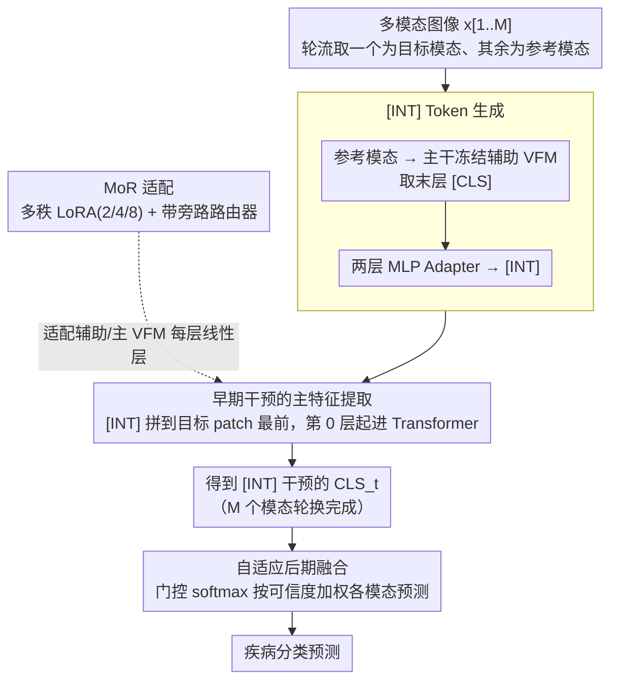

# EI: Early Intervention for Multimodal Imaging based Disease Recognition

**会议**: CVPR 2026  
**arXiv**: [2603.17514](https://arxiv.org/abs/2603.17514)  
**代码**: [github.com/ruc-aimc-lab/EI](https://github.com/ruc-aimc-lab/EI)  
**领域**: 医学图像 / 多模态融合  
**关键词**: 多模态医学图像, 早期干预, LoRA, MoE, VFM适配, 疾病识别

## 一句话总结

EI 提出在单模态嵌入（UIE）**之前**就注入跨模态语义引导（[INT] token），模拟临床医生"先看一个模态形成初步判断再指导另一个模态检查"的工作流程，同时设计 MoR（多种秩 LoRA + 带旁路的松弛路由器）实现参数高效的 VFM 医学域适配，在视网膜/皮肤/膝关节三个数据集上以 <9M 可训练参数超越所有全参微调和 prompt learning 基线。

## 研究背景与动机

**领域现状**：多模态医学图像（如 CFP+OCT 眼底、皮肤镜+临床照片、多视角 MRI）的疾病识别是 CV 重要任务。现有方法（MM-MIL、CosCatNet、RadDiag、MMRAD）都遵循"**fusion after UIE**"范式——先用各自编码器独立提取单模态特征，再通过拼接/加权求和/注意力做后期融合。

**痛点一——融合太晚**：所有方法在单模态嵌入（UIE）阶段对其他模态"一无所知"，导致 UIE 无法利用互补信息。这与临床实践不符——医生从不孤立解读某一模态，而是先从一个模态形成初步假设，再用该假设引导另一模态的检查。

**痛点二——VFM 适配难**：医学标注数据稀缺 + 自然图像与医学图像存在巨大域偏移。CLIP/DINOv2 等 VFM 直接用效果差，全参微调会过拟合，prompt learning 只能激活预有知识、无法注入新知识。

**核心思路**：(a) 将参考模态的高层语义（[CLS] token）作为干预 token [INT]，在目标模态 UIE 的**最早期**注入；(b) 设计 MoR——多种秩 LoRA + 带 bypass 的松弛路由器，兼顾适配能力与参数效率。

## 方法详解

### 整体框架

EI 想解决的核心矛盾是：现有多模态医学诊断都在各模态独立编码之后才融合，单模态编码器对其他模态"一无所知"。EI 把融合时机提前到编码的最起点——让每个模态在被编码时就先"听"到其他模态的诊断线索。

整体流程是一个角色轮换的结构：M 个模态里每次挑一个当目标模态（target）、其余当参考模态（reference）。先用一组主干冻结的辅助 VFM 把每个参考模态压成一个高层语义 token（[INT]），把它拼到目标模态的 patch 序列最前面，再交给主 VFM 走完整个编码，让 [INT] 在每一层 self-attention 里都和目标模态的 patch 交互。轮换跑完后每个模态都拿到一份被跨模态线索"干预"过的 CLS 特征，最后用一个自适应门控加权融合出诊断。主 VFM 的适配不靠全参微调，而是靠 MoR（多秩 LoRA + 带旁路路由器）做参数高效适配——这一适配同时作用在辅助 VFM 与主 VFM 上。

### 关键设计

**1. [INT] Token 生成：把参考模态的诊断线索压成一个可注入的语义信号**

要在目标模态编码的最早期注入其他模态信息，得先把"其他模态"变成一个轻量、可拼接的载体。EI 对每个参考模态 $r$ 用一个辅助 VFM $\phi_{a,r}$ 提取最后一层的 [CLS] token $Z^L[0]$，再把所有参考模态的 [CLS] 收集起来过一个两层 MLP Adapter，转换成 [INT] 序列。之所以取最后一层而非中间层，是因为 [CLS] 在最深层聚合的是最完整的高层语义——相当于"这个模态看下来的初步结论"，而不是低层纹理。辅助 VFM 的主干权重冻结、只挂轻量 MoR 适配（开销主要是一次前向），并由辅助损失 $\mathcal{L}_{aa}$ 约束它产出任务相关的 [INT]，本质是把临床上"先做一项检查形成假设"的那个假设具象成一个 token。

**2. 早期干预的主特征提取：让跨模态线索从第 0 层就参与 self-attention**

光有 [INT] 还不够，关键是注入的时机。EI 把 [INT] 拼到 target 的 patch embedding 序列最前端，从第 0 层就一起进 Transformer：

$$\hat{Z}_t^0 = \text{Concat}(\text{Conv}(\mathbf{x}[t]),\ \text{INT}), \qquad \hat{\text{CLS}}_t = \phi_{p,t}(\hat{Z}_t^0, L)[0]$$

这样 target 的每个 patch 在每一层都能"看到"参考模态的结论，UIE 从一开始就是有跨模态条件的。为什么非要这么早？消融实验给了直接证据：注入层越早越好，Layer 0 始终最优（DINOv2 下 0.841、CLIP 下 0.824），推迟到 Layer 11 才注入会掉到 0.815——越晚注入越接近传统的后融合。可视化上也能看到，加 [INT] 后 patch 级注意力图从发散变成聚焦到病灶区（OCT 里的 drusen、CFP 里的出血点），说明跨模态引导确实让编码更有的放矢，而不是事后才把两份各自模糊的特征拼起来。

**3. 自适应后期融合：用可学习门控权衡各模态可信度**

各模态轮换编码完，还需要把它们的判断合成一个。每个模态的 $\hat{\text{CLS}}_t$ 先经线性层投影成 $C$ 维预测 $\hat{y}_t$，再由一个门控层（linear + softmax）按样本生成模态重要性权重 $\{\alpha_1, \ldots, \alpha_M\}$，最终预测是加权和 $\hat{y} = \sum_{t=1}^{M} \alpha_t \hat{y}_t$。这一步让模型对每个病例自适应地偏向更可信的模态，而不是固定等权拼接。

**4. MoR（Mixture of Low-varied-Ranks Adaptation）：让 VFM 自己决定每层用多大秩、要不要适配**

前面三步搭出了早期干预的 pipeline，但要让冻结的通用 VFM 真正适配医学影像，还得解决参数高效微调（PEFT）这条独立的线——它作用在框架里所有 VFM 的线性层上。医学数据稀缺加上自然图像到医学图像的巨大域偏移，让 VFM 的适配很尴尬：全参微调过拟合，prompt learning 只能激活已有知识、注不进新知识，而固定单一秩的 LoRA 又没法应对不同模态、不同样本的复杂度差异。MoR 的做法是在每个线性层同时挂 3 个不同秩（2、4、8）的 LoRA，再加一个松弛路由器（linear + softmax）输出 4 维权重 $[w_0, w_1, w_2, w_3]$ 做加权：

$$h' = Wh + \sum_{k=1}^{3} w_k B_k A_k h$$

其中多秩让模型按需选择适配强度。真正的关键是那个 $w_0$——它是**旁路（bypass）权重**，不接任何 LoRA。标准 LoRAMoE 路由器权重和为 1，等于强制必须接受某种适配；而 MoR 留了 $w_0$ 这条旁路，原始权重已经够用的层可以把权重挪给 $w_0$，极端时 $w_0=1$ 就完全跳过所有 LoRA。改动只是把路由维度从 3 扩到 4，却让"要不要适配"也变成可学习的，避免在本不需要改的层上硬加扰动。

### 一个完整示例

以 MMC-AMD 的一个眼底病例（CFP 彩色眼底照 + OCT 断层扫描，M=2）走一遍。

先以 OCT 为参考模态、CFP 为目标模态：辅助 VFM 把 OCT 编码出一个 [CLS]，过 Adapter 变成 [INT]，拼到 CFP 的 patch 序列最前面，主 VFM 从第 0 层开始编码——CFP 的 patch 在注意力里被这个携带"OCT 已看到 drusen"线索的 [INT] 牵引，注意力图从全图发散收敛到出血/渗出区，得到 $\hat{\text{CLS}}_{\text{CFP}}$。接着角色对调，CFP 当参考模态生成 [INT] 注入 OCT，得到 $\hat{\text{CLS}}_{\text{OCT}}$。两份 CLS 各自投影成预测 $\hat{y}_{\text{CFP}}, \hat{y}_{\text{OCT}}$，门控按这个病例的成像质量给出权重（比如该例 CFP 更清晰，$\alpha_{\text{CFP}}$ 偏高），加权得到最终 AMD 分类。整条链路里主 VFM 的每个线性层都被 MoR 适配，路由器对域偏移大的层多用高秩、对接近自然图像的层把权重留给旁路。

### 损失函数

总损失 $\mathcal{L} = \mathcal{L}_p + \lambda_1 \mathcal{L}_{aa} + \lambda_2 \mathcal{L}_{ag}$，由三部分组成。主损失 $\mathcal{L}_p$ 是各模态预测与融合预测的交叉熵之和。辅助 VFM 监督 $\mathcal{L}_{aa}$（$\lambda_1=0.3$）约束辅助 VFM 产出的 [INT] 本身带任务相关性，避免它退化成无意义 token。门控监督 $\mathcal{L}_{ag}$（$\lambda_2=0.1$）用训练集上表现最好模态的 one-hot 先验来引导门控——VFM 框架易过拟合，会让各模态在训练阶段表现趋同、门控分不出真实强弱，这一项给门控一个外部锚点。

## 实验关键数据

### 主实验

| 数据集 | 指标(mAP) | EI (DINOv2) | 最佳基线 | 提升 |
|--------|-----------|-------------|----------|------|
| MMC-AMD（视网膜4分类） | mAP | **0.909** | MMRAD 0.821 | +10.7% |
| Derm7pt（皮肤5分类） | mAP | **0.767** | MMRAD 0.566 | +35.5% |
| MRNet（膝关节3分类） | mAP | **0.848** | MM-MIL 0.835 | +1.6% |
| 三数据集均值 | MEAN | **0.841** | MMRAD 0.735 | +14.4% |

- EI 可训练参数仅 8.9M，而全参微调基线动辄 200-400M
- 域偏移最大的 Derm7pt 上提升最显著，mAP 从 0.566 直接拉到 0.767
- 通用 VFM（CLIP/DINOv2）全面优于领域专用 VFM（RETFound/PanDerm/RadioDINO），说明 EI+MoR 的适配策略优于从头训练领域模型

### 消融实验

| 配置 | MEAN mAP | 说明 |
|------|----------|------|
| EI + MoR（完整模型） | **0.833** | 最优 |
| 融合方式改为 after UIE | 0.806 | 退化为传统late fusion |
| [INT] 注入 Layer 11 而非 Layer 0 | 0.815 | 越晚注入越差 |
| 去掉 $\mathcal{L}_{aa}$ | 0.820 | 辅助VFM监督有用 |
| 去掉 $\mathcal{L}_{ag}$ | 0.811 | 门控监督贡献更大 |
| MoR → LoRA | 约降 2-3% | 固定rank不够灵活 |
| MoR 去掉 bypass | 略降 | bypass 允许跳过不必要适配 |

### 关键发现

- **早期干预是核心贡献**：将 EI 退化为传统 after-UIE 融合后性能显著下降，证明"融合太晚"确实是瓶颈
- **Layer 0 注入最优**：[INT] 注入位置越早性能越好，符合"尽早引入跨模态信息"的设计理念
- **MoR > LoRAMoE > LoRA > prompt learning > 全参微调**：在数据稀缺的医学场景中，PEFT 方法的设计质量至关重要
- **通用 VFM 优于领域 VFM**：VFM 的预训练数据规模和特征多样性比领域匹配更重要

## 亮点与洞察

- **Early Intervention 的临床对齐**：将"先看一种检查结果形成假设再引导后续检查"这一临床工作流程翻译为 [INT] token 的注入，概念简洁且直觉强。可视化证据（注意力图从发散变为聚焦病灶）非常有说服力
- **MoR 的 bypass 设计**：一个极简的改进——把路由器输出维度从 3 扩到 4，就能让模型自适应决定是否需要 LoRA 适配。这个 trick 适用于任何 MoE-LoRA 框架
- **Adapter 做桥梁**：辅助 VFM 和主 VFM 是不同的（前者冻结参数少，后者需要精细适配），用两层 MLP 做 [INT] 的兼容性转换，避免了特征空间不对齐的问题

## 局限与展望

- **辅助 VFM 额外开销**：每个参考模态需要一个辅助 VFM 前向传播，M 个模态需要 2M 个 VFM（M 个辅助 + M 个主），计算量约为单模态的 2 倍
- **仅验证了 M=2,3 的场景**：当模态数量更多（如 5 种以上医学影像）时，[INT] 序列长度线性增长，self-attention 的复杂度可能成为瓶颈
- **数据集规模偏小**：最大 Derm7pt 仅 1011 样本，MMC-AMD 只有 768 样本，结论在大规模数据集上是否成立待验
- **[INT] 只用最后层 [CLS]**：局限于高层语义信息，低层纹理/边缘信息被丢弃，对需要低层特征互补的任务可能不够

## 相关工作与启发

- **vs MMRAD**：同样用 VFM+PEFT，MMRAD 用 prompt learning 且在 UIE 之后才融合；EI 在 UIE 之前融合 + 用 MoR 替代 prompt learning，两个维度都有改进
- **vs MM-MIL**：MM-MIL 用 ResNet 全参微调 + weighted sum 晚期融合；用 MoR 替换其backbone后（MM-MIL-MoR）性能从 0.733 升到 0.823，但仍不及完整 EI(0.841)，说明早期干预的贡献独立于 PEFT 选择
- **可迁移思路**：[INT] token 注入机制可以迁移到任何多模态 ViT 框架（如视频+音频、RGB+深度），核心是用一个模态的高层语义在另一个模态的 embedding 阶段做引导

## 评分

- 新颖性: ⭐⭐⭐⭐ 早期干预的思路直觉强且有临床对齐，MoR 是 LoRA-MoE 的合理改进
- 实验充分度: ⭐⭐⭐⭐⭐ 三个数据集、两个VFM、详尽的消融和超参分析，实验非常扎实
- 写作质量: ⭐⭐⭐⭐ 结构清晰，动机推导流畅，临床对比生动
- 价值: ⭐⭐⭐⭐ 对多模态医学图像领域贡献显著，MoR 和 early intervention 的思路可迁移

<!-- RELATED:START -->

## 相关论文

- [\[CVPR 2026\] GLEAM: A Multimodal Imaging Dataset and HAMM for Glaucoma Classification](gleam_a_multimodal_imaging_dataset_and_hamm_for_gl.md)
- [\[CVPR 2026\] EMAD: Evidence-Centric Grounded Multimodal Diagnosis for Alzheimer's Disease](emad_evidence-centric_grounded_multimodal_diagnosis_for_alzheimers_disease.md)
- [\[ICLR 2026\] Learning Patient-Specific Disease Dynamics with Latent Flow Matching for Longitudinal Imaging Generation](../../ICLR2026/medical_imaging/learning_patient-specific_disease_dynamics_with_latent_flow_matching_for_longitu.md)
- [\[CVPR 2026\] Robust Fair Disease Diagnosis in CT Images](robust_fair_disease_diagnosis_in_ct_images.md)
- [\[CVPR 2025\] SapiensID: Foundation for Human Recognition](../../CVPR2025/medical_imaging/sapiensid_foundation_for_human_recognition.md)

<!-- RELATED:END -->
