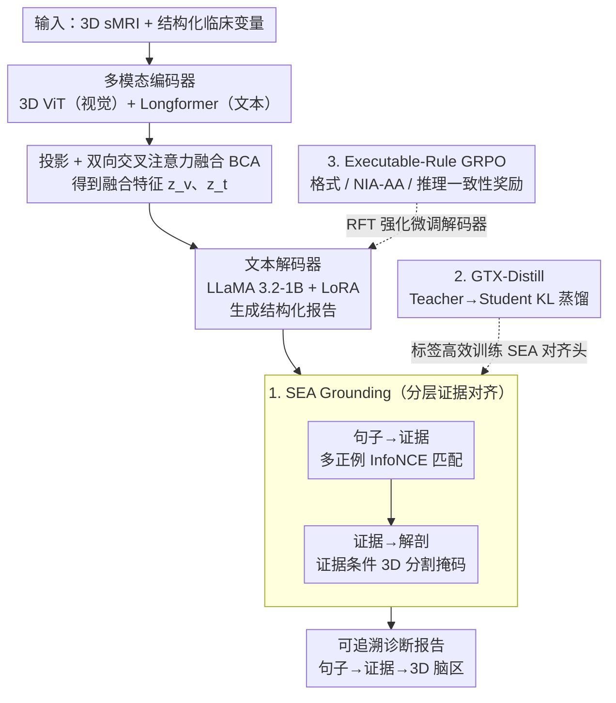

# EMAD: Evidence-Centric Grounded Multimodal Diagnosis for Alzheimer's Disease

**会议**: CVPR 2026  
**arXiv**: [2602.19178](https://arxiv.org/abs/2602.19178)  
**代码**: 即将开源（含 grounding annotations）  
**领域**: 医学图像  
**关键词**: 阿尔茨海默病诊断, 多模态视觉语言模型, 证据对齐, 强化微调, 3D 脑部分割

## 一句话总结

提出 EMAD，一个端到端多模态视觉-语言框架，为 AD 诊断生成结构化报告，通过分层 Sentence–Evidence–Anatomy (SEA) Grounding 将每个诊断声明显式关联到临床证据和 3D 脑部解剖，并用可执行规则驱动的 GRPO 强化微调确保临床一致性。

## 研究背景与动机

阿尔茨海默病 (AD) 的临床诊断需整合结构性 MRI、神经心理学测试、APOE 基因型、脑脊液生物标志物等多模态数据。现有 AI 方法存在三个核心痛点：

**黑箱问题**：多数模型只输出标签或风险评分，无法解释"为何做此判断"及"哪些证据支撑了判断"

**多模态整合不足**：许多方法仍在单一模态上操作，忽略跨模态依赖

**临床指南脱节**：现有 MLLM 生成的医学报告很少 (i) 将生成句子链接到具体临床条目，(ii) 将声明定位到 3D 脑部解剖结构，(iii) 强制遵循 NIA-AA 等诊断框架

EMAD 的核心动机是构建一个**透明、可追溯、解剖学忠实**的 AD 报告生成系统，让每个诊断声明都有证据链支撑。

## 方法详解

### 整体框架

EMAD 要解决的是「AD 诊断模型只给标签、不给证据」的黑箱问题，做法是让一个多模态 VLM 既生成结构化诊断报告，又把报告里每句话都钉到临床证据和 3D 脑区上。它由四部分组成：多模态编码器、投影与融合层、文本解码器（报告生成）、分层 SEA Grounding 头。输入是 $\mathcal{X}=\{x_v, x_t\}$，其中 $x_v \in \mathbb{R}^{D \times H \times W}$ 为 3D sMRI、$x_t$ 为结构化临床变量。视觉编码器 $E_v$（3D ViT）抽 patch 级嵌入 $h_v$，文本编码器 $E_t$（Longformer）编码临床文本 $h_t$，两者经线性投影到同维空间后做双向交叉注意力融合（BCA），交替担任 Q/KV 角色：

$$\mathbf{A}_{t \to v} = \text{Attn}(h_t', h_v', h_v'), \quad \mathbf{A}_{v \to t} = \text{Attn}(h_v', h_t', h_t')$$

并用残差连接保留模态特异信息 $z_v = h_v' + \mathbf{A}_{v \to t}$、$z_t = h_t' + \mathbf{A}_{t \to v}$。融合特征替换 prompt 里的 `<sMRI>` 和 `<clinical>` 占位符，由 LLaMA 3.2-1B + rank-8 LoRA 自回归生成报告。报告生成后，SEA Grounding 头把它逐句钉回证据与脑区；GTX-Distill 与 Executable-Rule GRPO 则分别在训练侧让对齐能力可廉价迁移、让输出守住临床规则。

### 关键设计

**1. Sentence–Evidence–Anatomy（SEA）Grounding：让每句诊断都钉到证据和脑区**

针对黑箱痛点，SEA 把可解释性拆成两级对齐。Sentence-to-Evidence 把每个生成句子 $\hat{s}_i$ 与临床证据集 $\mathcal{E}=\{e_1,\ldots,e_K\}$ 做多对多匹配，用双向的多正例 InfoNCE 损失 $\mathcal{L}_{\text{SE}} = \frac{1}{N}\sum_{i=1}^{N}(\ell_i^{e \to s} + \ell_i^{s \to e})$ 拉近句子与支撑证据。Evidence-to-Anatomy 再把带解剖指针的证据定位到具体脑区：在 Segformer3D decoder 每层 self-attention 后插一个轻量 cross-attention block，让视觉 token attend to 证据文本 token，输出体素级概率掩码 $\hat{\mathbf{M}}_i = \sigma(\text{Head}(\mathbf{Y}^{(L)}))$，用 Dice + BCE 训练。这样「句子→证据→ 3D 解剖」形成一条双重可追溯的证据链。

**2. GTX-Distill（Grounding Transfer Distillation）：用 25% 标注换 95% 的对齐能力**

体素级 grounding 标注极贵，全量标注不现实，GTX-Distill 用两阶段蒸馏绕开。Stage 1 在小规模标注子集上训练 Teacher Grounder $G_T$，学 sentence→evidence 分布 $q(e|s_i)$ 和解剖掩码；Stage 2 冻结 $G_T$，在大规模模型生成的报告上训练 Student Grounder $G_\theta$，用温度缩放 KL 散度蒸馏 $\mathcal{L}^{\text{distill}} = \tau^2 \sum_i \text{KL}(q_\tau(\cdot|\hat{s}_i) \| p_{\theta,\tau}(\cdot|\hat{s}_i))$。结果仅需 25% grounding 标注即可保留 teacher 95% 的 R@3，大幅压低标注成本。

**3. Executable-Rule GRPO：把临床指南写成可程序化验证的奖励**

医学报告必须守诊断框架，但人工偏好标注又贵又主观，于是把临床规则编码成可执行奖励来做 GRPO 强化微调。总奖励聚合三个可验证组件 $R = w_F R_F + w_{\text{NIA}} R_{\text{NIA-AA}} + w_C R_{\text{consistency}}$：格式奖励 $R_F$ 检查 Reasoning/Diagnosis/Confidence 三标签是否完整；NIA-AA 诊断奖励 $R_{\text{NIA-AA}}$ 检查类别对齐（CN/MCI/Dementia）、生物标志物一致性（Aβ/tTau/pTau 阈值）和临床特征覆盖度；推理一致性奖励 $R_{\text{consistency}}$ 用 NLI 模型验证 Reasoning⇒Diagnosis 的蕴含关系、防止逻辑自相矛盾。整套奖励无需人工偏好标注，就把「合规、忠实、自洽」直接灌进模型。

### 损失函数 / 训练策略

三阶段渐进训练：

- **Stage 1 (PT)**：对比学习 + 重建学习对齐多模态表示，$\mathcal{L}_{\text{PT}} = \mathcal{L}_{\text{itc}} + \lambda_{\text{res}}(\mathcal{L}_{\text{res}}^v + \mathcal{L}_{\text{res}}^t)$
- **Stage 2 (SFT + GTX-Distill)**：冻结编码器底层，微调顶层 + 投影层 + 解码器 LoRA，$\mathcal{L}_{\text{SFT}} = \mathcal{L}_{\text{txt}} + \lambda_{\text{KL}} \mathcal{L}^{\text{distill}}$
- **Stage 3 (RFT)**：GRPO 强化微调，group size $G=4$，clipping $\epsilon=0.2$，KL 系数 $\beta=0.1$

## 实验关键数据

### 主实验

数据集：AD-MultiSense（基于 ADNI + AIBL，10,378 样本 / 2,619 受试者）

| 任务 | 指标 | EMAD | M3D-LaMed (best baseline) | 提升 |
|------|------|------|--------------------------|------|
| CN vs CI | ACC | 93.33% | 91.28% | +2.05 |
| CN vs CI | AUC | 91.83% | 89.16% | +2.67 |
| CN vs CI | BERTScore | 0.9120 | 0.8748 | +0.037 |
| CN vs MCI | ACC | 92.82% | 89.47% | +3.35 |
| CN vs MCI | AUC | 90.09% | 88.06% | +2.03 |
| 三分类 | ACC / Macro-F1 | 89.4% / 87.8% | 84.7% / 82.5% (Alifuse) | +4.7 / +5.3 |

报告质量指标（CN vs CI）：BLEU 0.5422, METEOR 0.6790, ROUGE 0.7781 — 远超所有 baseline。

### 消融实验

| 配置 | ACC (CN vs CI) | AUC | 说明 |
|------|---------------|-----|------|
| 仅 sMRI | 71.24% | 54.76% | 视觉单模态严重不足 |
| 仅 Clinical | 88.83% | 82.69% | 文本模态贡献大 |
| Image + Clinical (EMAD) | 93.33% | 91.83% | 多模态融合最优 |
| EMAD w/o RFT | 91.28% | — | 无强化微调 |
| + Format reward only | 91.45% | — | 格式有效性 85.3→97.8% |
| + Format + NIA-AA | 92.10% | — | NIA-AA 一致性 74.1→86.7% |
| Full EMAD | 92.82% | — | 蕴含 68.2→87.6% |

### 关键发现

- 仅用视觉特征 ACC 仅 71.24%（SEN 极高 95.33% 但 SPE 仅 12.31%），说明单模态倾向于将所有人预测为正例
- GTX-Distill 在仅 25% 标注下保留 95% R@3，50% 标注下基本匹配全监督 teacher
- Evidence-conditioned 分割使海马体 Dice 从 0.78 提升到 0.84
- NIA-AA 标准下监督略优于 IWG-2 标准（93.33 vs 92.93 ACC）

## 亮点与洞察

- **证据链可追溯性**：SEA Grounding 实现了"句子→临床证据→3D 解剖"的分层可解释性，每个诊断声明都有双重证据支撑
- **标签效率**：GTX-Distill 大幅降低 grounding 标注需求，用 KL 蒸馏将 teacher 的对齐能力迁移到 student
- **可验证奖励设计**：Executable-Rule GRPO 将临床指南编码为可程序化验证的奖励函数（格式/NIA-AA/蕴含性），无需人工偏好标注
- **训练策略精巧**：三阶段渐进训练（PT→SFT→RFT）逐步建立对齐→忠实→可验证能力

## 局限与展望

- 数据集仅基于 ADNI + AIBL，样本多样性有限（主要为欧美白人群体）
- 3D sMRI 编码使用 ViT-based 架构，对高分辨率全脑扫描的计算开销较大
- NLI-based 一致性奖励依赖外部模型质量，可能引入噪声
- 尚未探索纵向（longitudinal）数据的时序建模
- 仅在 AD 场景验证，推广到其他神经退行性疾病有待验证

## 相关工作与启发

- **M3D-LaMed**：3D 医学图像 + LLM 的先驱工作，但缺乏 grounding 和临床指南约束
- **GRPO (DeepSeekMath)**：group relative policy optimization 的原始提出，EMAD 将其适配到医学场景并设计了 executable rewards
- **BLIP / CLIP**：EMAD 的对比学习和动量编码器设计受 BLIP 启发
- **启发**：将临床诊断指南形式化为可执行奖励函数的思路可推广到其他有明确诊断标准的医学场景（如肿瘤分级、心血管风险评估）

## 评分

- 新颖性: ⭐⭐⭐⭐ SEA Grounding + GTX-Distill + Executable-Rule GRPO 三个创新点均有独立价值，组合后形成完整的可解释 AD 诊断框架
- 实验充分度: ⭐⭐⭐⭐ 多任务评估（二分类+三分类+报告质量+grounding+消融），但缺少与更多 3D 医学 VLM 的对比
- 写作质量: ⭐⭐⭐⭐ 结构清晰，公式推导完整，但部分符号定义分散
- 价值: ⭐⭐⭐⭐ 可解释性医学 AI 的重要进展，executable reward 思路对医学 RLHF 有启发

<!-- RELATED:START -->

## 相关论文

- [\[CVPR 2026\] Clinically-Grounded Counterfactual Reasoning for Medical Video Diagnosis](clinically-grounded_counterfactual_reasoning_for_medical_video_diagnosis.md)
- [\[CVPR 2026\] MedTVT-R1: A Multimodal LLM Empowering Medical Reasoning and Diagnosis](medtvt-r1_a_multimodal_llm_empowering_medical_reasoning_and_diagnosis.md)
- [\[ICLR 2026\] CARE: Towards Clinical Accountability in Multi-Modal Medical Reasoning with an Evidence-Grounded Agentic Framework](../../ICLR2026/medical_imaging/care_towards_clinical_accountability_in_multi-modal_medical_reasoning_with_an_ev.md)
- [\[AAAI 2026\] Sim4Seg: Boosting Multimodal Multi-disease Medical Diagnosis Segmentation with Region-Aware Vision-Language Similarity Masks](../../AAAI2026/medical_imaging/sim4seg_boosting_multimodal_multi-disease_medical_diagnosis_segmentation_with_re.md)
- [\[NeurIPS 2025\] Dynamic Causal Discovery in Alzheimer's Disease through Latent Pseudotime Modelling](../../NeurIPS2025/medical_imaging/dynamic_causal_discovery_in_alzheimers_disease_through_latent_pseudotime_modelli.md)

<!-- RELATED:END -->
