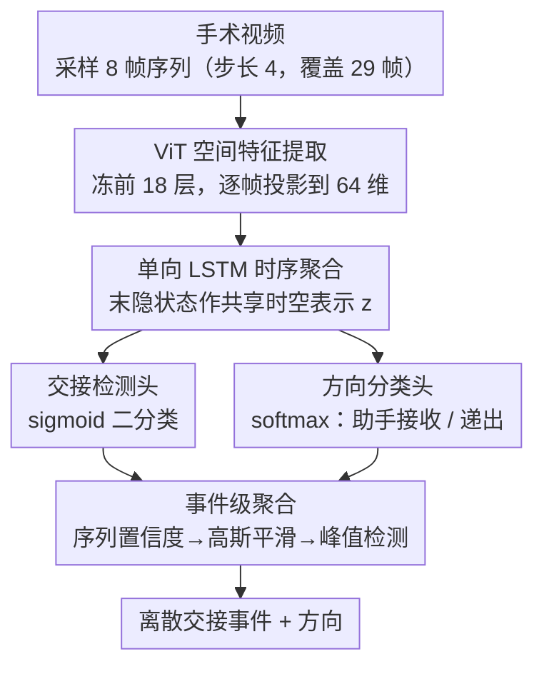

# Event-Level Detection of Surgical Instrument Handovers in Videos

**会议**: CVPR 2026  
**arXiv**: [2604.07577](https://arxiv.org/abs/2604.07577)  
**代码**: 有  
**领域**: 医学图像  
**关键词**: surgical video, instrument handover, ViT-LSTM, multi-task, event detection

## 一句话总结

提出面向真实手术视频中器械交接检测的时空视觉框架，结合 ViT 空间特征提取和单向 LSTM 时序建模，通过多任务学习联合预测交接事件和方向，在肾移植手术视频上达到 F1=0.84 的检测性能。

## 研究背景与动机

手术器械交接的可靠监测对维持手术流程效率和患者安全至关重要。手术中器械交接失败可能导致残留器械等严重不良事件。从术中视频自动检测交接仍极具挑战：频繁遮挡、背景杂乱、动态光照、交接本身的时序演化特性使得单帧分析不够。

先前 SurgiGuard 利用 CLIP 特征和图推理检测交接，但主要依赖帧级特征，缺乏显式时序建模。本文引入 ViT+LSTM 的时空架构，在真实手术录像（而非模拟环境）上验证。

## 方法详解

### 整体框架

这篇要解决的是「术中视频里器械交接难以自动识别」的问题——交接是个有时序演化的事件，单帧看不出来。流程是：从视频采样 8 帧序列（步长 4，覆盖 29 帧时域），ViT 独立提取每帧空间特征、线性投影到 64 维后送入单向 LSTM 做时序聚合，得到共享时空表示；这个表示分给「是否交接」和「交接方向」两个任务头联合预测，逐序列输出置信度；最后把序列级置信度沿时间拼成一维信号，经高斯平滑 + 峰值检测抽出离散的交接事件（而非逐帧判定），让输出粒度对齐临床对「一次交接」的感知。

### 关键设计

**1. ViT 空间特征提取：冻底微顶适配交接画面**

手术画面有频繁遮挡、背景杂乱、光照变化，需要强的单帧表征又不能在小数据上过拟合。做法是用预训练 ViT 骨干，冻结前 18 层 transformer、只微调上层来适配交接分析，帧级特征投影到 64 维嵌入空间。这样既借到大规模预训练的视觉先验，又把可训练参数压到小数据扛得住的规模。

**2. LSTM 时序聚合：用强归纳偏置吃下稀疏短序列**

交接是跨帧演化的事件，必须显式建时序；但标注数据规模小、事件分布稀疏，Transformer 时序模型容易喂不饱。于是选单向 LSTM 而非 Transformer——LSTM 的强序列归纳偏置更适合短交互序列建模，在数据有限时比注意力更稳。

**3. 多任务联合预测：检测与方向共享表示、避免误差累积**

如果先检测交接、再单独判方向，级联管线会把前一步的错误传给后一步。这里让共享时空表示同时进二分类交接检测头（sigmoid）和方向分类头（softmax：助手接收/助手递出），两个任务联合优化，既互相提供监督信号，又避开级联的误差累积。

**4. 事件级聚合：从序列置信度抽出离散交接事件**

这是论文与 SurgiGuard 等帧级方法拉开差距的核心贡献之一。痛点在于：逐序列输出会把一次完整交接拆成一串零碎的正样本，但临床真正关心的是「发生了几次交接、各朝哪个方向」。做法是把模型逐序列的检测置信度沿时间拼成一维信号，先用高斯平滑（$\sigma=3$）压噪、再用基于显著度（prominence）的峰值检测把每个峰定位成一次交接事件；方向则在每个事件区间内做高斯加权聚合，得到该次交接的单一方向。这样以「事件」而非「帧」为评估单位，避开了帧级评估把一次长交接重复计数的高估，输出粒度也和临床感知对齐。

### 损失函数 / 训练策略

总损失 $L = \lambda_{det} \cdot L_{det} + \lambda_{dir} \cdot L_{dir}$：$L_{det}$ 用加权 BCE 处理正负样本不平衡，$L_{dir}$ 用加权 CE 且仅在正样本上计算。序列标签由中心 5 帧多数投票确定（助手接收/助手递出/助手空闲）。训练时冻结 ViT 前 18 层、只微调上层，并用裁剪/翻转等数据增强减少手术背景杂乱与遮挡的干扰。数据集为 5 台肾移植手术术中视频，共 484 个交接事件。

## 实验关键数据

### 主实验

| 模型 | 检测 F1 | 方向 Mean F1 |
|------|--------|------------|
| 多任务 ViT-LSTM | **0.84** | **0.72** |
| 单任务 ViT-LSTM | 0.79 | 0.63 |
| VideoMamba | 0.84 | 0.61 |

### 关键发现

- 多任务学习在检测（F1 0.84 vs 0.79）和方向分类（0.72 vs 0.63）上均优于单任务
- 与 VideoMamba 相比，检测性能相当但方向分类显著更优
- Layer-CAM 可视化显示模型正确关注手部-器械交互区域

## 亮点与洞察

- 在真实肾移植手术视频上的实际验证具有临床价值
- 事件级评估（而非帧级）更符合临床感知
- Layer-CAM 可解释性分析增强了临床可信度
- 统一的多任务损失避免了级联管线的误差累积，检测和方向分类共享统一的时空表示
- 选择单向 LSTM 而非 Transformer 时序模型的关键原因：有标注数据规模小、事件分布稀疏，LSTM 的强序列归纳偏置更适合短交互序列建模
- VideoMamba 基线的专门比较显示了不同时序建模策略的影响

## 局限与展望

- 数据集较小（5台手术、484个交接事件），泛化性需进一步验证
- 仅检测助手与主刀间的交接，未涵盖更复杂的多人交互
- 未与 SurgiGuard 等基于 CLIP+图推理的方法在相同数据集上直接对比
- 事件级评估的高斯平滑参数和峰值检测阈值需要根据手术类型调优
- 未探索双向 LSTM 或 Transformer 时序模型在更大数据集上的潜力
- 未利用器械跟踪等辅助信息增强交接检测
- 数据增强包括裁剪、翻转等策略，减少手术背景杂乱干扰
- 事件级评估方法对临床实际应用更有意义，避免帧级评估的高估问题

## 评分

- 新颖性：⭐⭐⭐⭐ — 方法设计相对标准
- 技术深度：⭐⭐⭐⭐ — ViT+LSTM+多任务组合直接
- 实验充分度：⭐⭐⭐⭐ — 数据集规模有限，仅 5 台手术 484 个交接事件
- 实用价值：⭐⭐⭐⭐⭐ — 手术安全应用场景明确，的临床可转化前景好

<!-- RELATED:START -->

## 相关论文

- [\[CVPR 2026\] Synergistic Bleeding Region and Point Detection in Laparoscopic Surgical Videos](synergistic_bleeding_region_and_point_detection_in_laparoscopic_surgical_videos.md)
- [\[CVPR 2026\] SurgCoT: Advancing Spatiotemporal Reasoning in Surgical Videos through a Chain-of-Thought Benchmark](surgcot_advancing_spatiotemporal_reasoning_in_surgical_videos_through_a_chain-of.md)
- [\[CVPR 2026\] Benchmarking Endoscopic Surgical Image Restoration and Beyond](benchmarking_endoscopic_surgical_image_restoration_and_beyond.md)
- [\[CVPR 2026\] The Invisible Gorilla Effect in Out-of-distribution Detection](the_invisible_gorilla_effect_in_out-of-distribution_detection.md)
- [\[CVPR 2026\] SegMoTE: Token-Level Mixture of Experts for Medical Image Segmentation](segmote_token-level_mixture_of_experts_for_medical_image_segmentation.md)

<!-- RELATED:END -->
