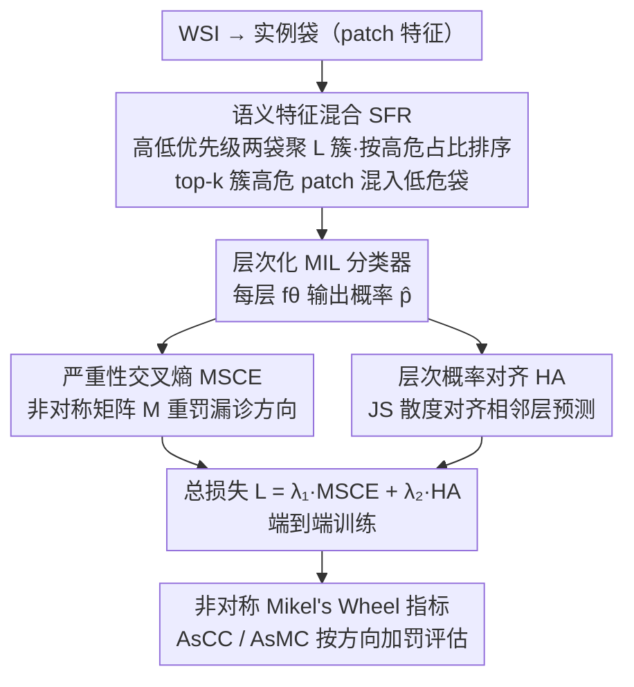

<!-- 由 src/gen_stubs.py 自动生成 -->
# Every Error has Its Magnitude: Asymmetric Mistake Severity Training for Multiclass Multiple Instance Learning

**会议**: CVPR2026  
**arXiv**: [2603.13682](https://arxiv.org/abs/2603.13682)  
**代码**: 待确认  
**领域**: 医学图像  
**关键词**: Multiple Instance Learning, Mistake Severity, Whole Slide Image, 非对称误分类, 层次化分类, 病理诊断

## 一句话总结

提出 PAMS（Priority-Aware Mistake Severity）方法，通过非对称严重性感知的交叉熵损失（MSCE）、语义特征混合（SFR）和非对称 Mikel's Wheel 指标，在多分类 MIL WSI 诊断中显著降低严重误诊风险。

## 背景与动机

1. **MIL 在病理诊断中广泛应用**：Multiple Instance Learning（MIL）将 WSI 建模为 patch bag，已成为计算病理学的主流范式，但现有方法主要关注准确率最大化，忽略了误分类的严重性差异
2. **临床场景中误分类代价不对称**：将恶性肿瘤误诊为正常（漏诊）的后果远比将正常误诊为恶性（过诊）严重，但传统交叉熵对所有错误施加相同惩罚
3. **WSI 多分类的优先级特性**：病理医生在 WSI 中观察到多种共存症状时，标注最紧急的诊断结果；类别之间存在隐含的优先级层次，这与自然图像中每个物体独立标注的方式截然不同
4. **现有 Mistake Severity 方法缺陷**：以往方法仅基于类别间距离定义严重性权重（如 CDW-CE），忽略了方向性——同样距离的误分类在不同方向上临床风险完全不同
5. **缺乏面向临床 WSI 的 MS 解决方案**：现有 MS 研究主要在自然图像上开展，未能处理 WSI 的标注约束（弱标签、复杂共存症状、类别优先级）
6. **评价指标的局限**：现有 MS 指标（ECC/EMC）基于对称距离，无法区分方向性不同的误分类，导致无法正确评估模型在安全性角度的表现

## 方法详解

### 整体框架

PAMS 想解决的是「MIL 病理诊断只追准确率、不管误诊有多严重」的问题——把恶性误判成正常远比反过来危险，但交叉熵一视同仁。它的训练流水线由四块协同：先用**语义特征混合 SFR** 在特征空间合成「高危症状藏进低危切片」的难例，弥补 WSI 弱标签难造共存样本的缺口；再把多分类组织成层次结构（从最细粒度 $\mathcal{H}$ 到根节点 $\mathcal{R}$），每层训一个分类器 $f_{\theta_h}$ 输出预测概率 $\hat{p}^h$；训练目标 $\mathcal{L} = \lambda_1 \mathcal{L}_{MSCE} + \lambda_2 \mathcal{L}_{HA}$ 由两个损失组成——**严重性交叉熵 MSCE** 给交叉熵装上方向性惩罚、重罚漏诊方向的错误，**层次概率对齐 HA** 用 JS 散度对齐相邻层预测让粗细判断一致；最后配一套**非对称 Mikel's Wheel 指标**（AsCC/AsMC）如实评估安全性。

### 关键设计

**1. 语义特征混合 SFR（Semantic Feature Remix）：用弱标签合成「高危混入低危」的难例**

流水线第一步先解决「没有共存难例可学」的问题：临床里多种症状常共存，但 WSI 只有弱标签、缺像素级标注，难以直接造出复杂共存样本。SFR 给定两个不同优先级的实例袋（$Y_a \succ Y_b$），把两袋全部 instance 聚成 $L$ 个簇，按每个簇中来自高优先级样本 $Z_a$ 的 patch 比例排序，取 top-$k$ 簇里的 $Z_a$ patch 混入低优先级袋 $Z_b$，形成合成样本 $Z_{a+b}$、标签记为高优先级 $Y_a$（聚类用 FAISS 做 GPU 并行加速）。这样在特征空间里就模拟出「高危症状藏在低危切片中」的难例，逼模型学会优先识别最紧急的诊断。

**2. 严重性交叉熵 MSCE（Mistake Severity Cross-Entropy）：给交叉熵装上方向性惩罚**

合成袋送进层次模型后，核心损失要回答「漏诊比过诊更危险」。传统交叉熵对所有错误同等惩罚，体现不了这一点。MSCE 定义非对称权重矩阵 $M^h$：当真实类 $c_i^h$ 比预测类 $c_j^h$ 更紧急时惩罚为 $\alpha^{|i-j|}$（$\alpha>1$），反方向误分类权重只记 1。最终损失 $\mathcal{L}_{MSCE} = -\sum_h \hat{p}^h M^h (\tilde{Y}^h)^\top \sum_c \tilde{Y}^h[c] \log \hat{p}^h[c]$，相当于在交叉熵前乘一个方向性正则权 $\hat{p}^h M^h (\tilde{Y}^h)^\top$，同时考虑预测分布与真实标签之间的严重性关系。和 Weighted CE 只按类频率/固定权重加权不同，MSCE 动态捕捉预测与真实标签之间的方向性差异。

**3. 层次概率对齐 HA（Hierarchy Alignment）：让粗细两层判断一致**

层次结构里每层分类器各预测一份概率，若各说各话整体诊断会自相矛盾。HA 是与 MSCE 并列的第二个损失项：用 Jensen-Shannon 散度对齐相邻层次的预测，把更细粒度层的预测 $\hat{p}^{h+1}$ 聚合为粗粒度表示 $\dot{p}^{h+1}$，再与当前层 $\hat{p}^h$ 对齐，确保不同层次分类器对同一样本给出一致预测。两个损失合成总目标 $\mathcal{L} = \lambda_1 \mathcal{L}_{MSCE} + \lambda_2 \mathcal{L}_{HA}$ 端到端训练。

**4. 非对称 Mikel's Wheel 指标：让评估也认方向**

训练完还要如实衡量安全性。现有 MS 指标（ECC/EMC）基于对称距离，分不清误分类的方向，导致安全性无法被正确评估。PAMS 提出 AsCC（Asymmetric Classification Confidence）和 AsMC（Asymmetric Misclassification Confidence），混淆权重 $W_{i,j}^h = 1 + |i-j| + \mathbb{1}(c_i^h \succ c_j^h) \times P$（$P=2$），当高优先级类被误分到低优先级时额外加罚，让指标如实反映真实临床风险。

## 实验关键数据

### 数据集

- **BRACS**：乳腺癌 H&E 染色 WSI，547 张，7 类（正常→浸润癌），按良性/非典型/恶性三级层次
- **In-house**：结肠活检 WSI 4734 张，7 类，按良性/锯齿状/腺瘤三级层次；含 182 例复杂混合症状测试集

### 主实验结果（Table 1，BRACS + TransMIL）

| 方法 | ACC | AUC | AsCC | AsMC |
|------|-----|-----|------|------|
| Cross Entropy | 40.23 | 74.90 | 58.48 | 50.18 |
| Chang et al. | 47.51 | 79.48 | 63.98 | 51.02 |
| Hong et al. (τ=10) | 47.13 | 79.80 | 62.44 | 45.54 |
| CDW-CE | 44.83 | 79.06 | 61.05 | 47.32 |
| **PAMS (Ours)** | **47.59** | **80.61** | **64.92** | **55.65** |

PAMS 在所有指标上取得最优，AsCC 和 AsMC 提升最为显著。In-house 数据集上同样全面领先。

### 消融实验（Table 2，BRACS + TransMIL）

| 消融项 | ACC 下降 | AsMC 下降 |
|--------|----------|-----------|
| w/o MSCE | -2.46 | -4.84 |
| w/o HA | -2.84 | -0.53 |
| w/o SFR | -0.54 | -4.02 |
| 全部移除 | -7.82 | -1.76 |

- MSCE 对严重性指标贡献最大（AsMC 下降 4.84）
- SFR 对 AsMC 也有显著贡献（下降 4.02）
- 三个组件协同配合效果最佳

### CIFAR-10 自然图像实验（Table 4）

| 方法 | ACC | AsCC | AsMC |
|------|-----|------|------|
| CE | 83.24 | 87.23 | 34.84 |
| CDW-CE | 84.11 | 87.87 | 34.63 |
| **MSCE (Ours)** | **85.64** | **89.12** | **35.70** |

验证了 MSCE 在自然图像领域的泛化能力。

## 亮点

- **非对称严重性建模**：首次在 MIL WSI 诊断中引入方向性误分类惩罚，准确反映临床漏诊比过诊更危险的实际需求
- **语义数据增强 SFR**：利用弱标签信息在特征空间中智能混合样本，无需像素级标注即可模拟复杂共存症状
- **指标创新**：AsCC/AsMC 弥补了现有对称指标无法区分误分类方向的缺陷，适用于所有安全关键分类任务
- **广泛通用性**：方法在 BRACS、In-house 医学数据及 CIFAR-10 自然图像上均有效，与多种 MIL 架构兼容

## 局限与展望

- 层次结构需人工预定义，依赖领域专家知识，不同疾病可能需要不同的层次设计
- MSCE 中的 $\alpha$ 和 $P$ 超参数选择需要调优，论文将敏感性分析放在补充材料中
- SFR 依赖聚类质量，聚类数 $L$ 和 top-$k$ 的选择可能影响效果
- 仅在病理场景验证，尚未在放射影像、皮肤镜等其他医学模态上验证
- In-house 数据集未公开，可重复性受限

## 与相关工作的对比

- **vs. Weighted CE**：仅用固定权重，无法捕捉预测与真实标签间的方向性差异；MSCE 动态计算惩罚
- **vs. HXE / Soft Labels（Bertinetto et al.）**：利用LCA层次信息但对严重性指标改善有限
- **vs. HAF（Garg et al.）**：特征空间正则化方法，在 DTFD-MIL 上泛化较差
- **vs. Hong et al.**：随机 remix 策略在 In-house 数据上有效但 BRACS 上不稳定；SFR 通过语义引导更鲁棒
- **vs. CDW-CE**：基于类距离加权但仍对称，PAMS 的非对称设计更贴合临床需求

## 评分

- 新颖性: ⭐⭐⭐⭐ — 非对称严重性损失 + 语义 remix + 非对称评价指标三位一体，问题定义清晰
- 实验充分度: ⭐⭐⭐⭐ — 公开+私有数据集、多种 MIL 架构、消融实验、remix 策略对比、自然图像泛化实验
- 写作质量: ⭐⭐⭐⭐ — 图表表达清晰，问题动机铺垫有说服力，公式推导完整
- 价值: ⭐⭐⭐⭐ — 切中临床 MIL 部署中的核心安全痛点，非对称指标有通用价值

<!-- RELATED:START -->

## 相关论文

- [\[ICML 2025\] Do Multiple Instance Learning Models Transfer?](../../ICML2025/medical_imaging/do_multiple_instance_learning_models_transfer.md)
- [\[CVPR 2026\] Contrastive Cross-Bag Augmentation for Multiple Instance Learning-based Whole Slide Image Classification](contrastive_cross-bag_augmentation_for_multiple_instance_learning-based_whole_sl.md)
- [\[CVPR 2025\] MIL-PF: Multiple Instance Learning on Precomputed Features for Mammography Classification](../../CVPR2025/medical_imaging/mil-pf_multiple_instance_learning_on_precomputed_features_for_mammography_classi.md)
- [\[CVPR 2026\] Universal-to-Specific: Dynamic Knowledge-Guided Multiple Instance Learning for Few-Shot Whole Slide Image Classification](universal-to-specific_dynamic_knowledge-guided_multiple_instance_learning_for_fe.md)
- [\[CVPR 2026\] Meta-learning In-Context Enables Training-Free Cross Subject Brain Decoding](meta-learning_in-context_enables_training-free_cross_subject_brain_decoding.md)

<!-- RELATED:END -->
