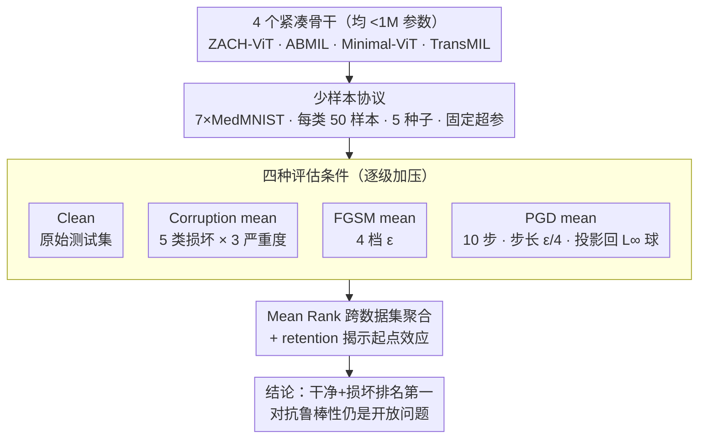

# Extending ZACH-ViT to Robust Medical Imaging: Corruption and Adversarial Stress Testing in Low-Data Regimes

**会议**: CVPR 2026 Workshop (PHAROS-AIF-MIH)  
**arXiv**: [2604.06099](https://arxiv.org/abs/2604.06099)  
**代码**: 无  
**领域**: 医学图像分类 / 鲁棒性评估  
**关键词**: Vision Transformer, 鲁棒性, 医学图像分类, 对抗攻击, 低数据, 置换不变  

## 一句话总结

在低数据医学影像场景下，对置换不变的紧凑型 ViT 架构 ZACH-ViT 进行首次鲁棒性扩展评估。在 7 个 MedMNIST 数据集上，ZACH-ViT 在干净数据和常见损坏下均排名第一（Mean Rank 1.57），在 FGSM 下排名最佳（2.00），PGD 下排名第二（2.29）。

## 研究背景与动机

**领域现状**：ViT（Vision Transformer）的标准设计通过位置编码（PE）和 [CLS] token 显式编码空间顺序。但在医学影像中，诊断相关结构可能分布松散、空间顺序不固定或跨采集变化大。ZACH-ViT 作为紧凑型置换不变 ViT，去除 PE 和 [CLS] token，用全局平均池化替代 token 聚合，其前作已验证了干净数据上的体制依赖性能表现。

**现有痛点**：(1) ZACH-ViT 前作仅评估了干净测试集性能，未考察鲁棒性；(2) 在医学 AI 部署中，模型会遇到采集设备差异、压缩伪影、亮度/对比度变化、传感器噪声等真实扰动；(3) 对于紧凑型边缘部署模型，仅凭干净性能无法判断其实用价值。

**核心矛盾**：去除位置编码的置换不变设计在干净评估中有效，但这种归纳偏置选择在真实扰动下是否仍保持优势完全未知。

**本文目标** 系统评估 ZACH-ViT 在常见图像损坏和对抗攻击下的鲁棒性，回答"置换不变 ViT 的干净性能优势能否延伸到鲁棒性"。

**切入角度**：在受控的 MedMNIST 少样本设置下，对 4 个紧凑型骨干网络做标准化鲁棒性评估（干净 / 损坏均值 / FGSM 均值 / PGD 均值四种条件），分离三个维度的模型行为。

**核心 idea**：去掉位置编码减少了对脆弱空间相关性的依赖，这种设计优势不仅在干净评估时有效，在真实扰动下也持续存在。

## 方法详解

### 整体框架

这篇不提新架构，核心贡献是一次鲁棒性评估：在低数据医学影像下，验证「去掉位置编码的置换不变 ViT」的干净性能优势能否延伸到真实扰动。它在统一实验设置下对比 4 个从头训练、参数量均 < 1M 的紧凑骨干——ZACH-ViT（置换不变 ViT）、ABMIL（注意力 MIL 池化）、Minimal-ViT（标准紧凑 ViT）、TransMIL（Transformer MIL）——所有模型共享同一套少样本训练协议和评估流程，确保差异只来自架构设计。整套评估协议本身就是这篇论文的方法贡献：把 4 个模型放进同一少样本协议训练，再分四档逐级加压，最后用数据集无关的指标聚合成可比的总分。

### 关键设计

**1. 数据集与少样本协议：把变量全控死，只留架构差异**

要回答「架构归纳偏置在低数据下谁更稳」，就必须排除其他干扰。评估覆盖 7 个 MedMNIST 数据集（BloodMNIST、PathMNIST、BreastMNIST、PneumoniaMNIST、DermaMNIST、OCTMNIST、OrganAMNIST），每类仅 50 个训练样本、验证/测试集不变，batch size 16、训练 23 个 epoch、跨 5 个随机种子 {3,5,7,11,13}、固定超参数；二分类用 AUC@0.5、多分类用 Macro-F1 评估。所有模型共用这套协议，性能差距才能干净地归因到设计选择。

**2. 四种评估条件：从干净到对抗逐级加压**

光看干净测试集无法判断边缘部署模型的实用价值，所以分四档施压。Clean 是原始测试集性能；Corruption mean 取高斯噪声、高斯模糊、亮度对比度调整、JPEG 压缩、cutout 五类各三个严重程度的平均；FGSM mean 取 $\epsilon \in \{1/255, 2/255, 4/255, 8/255\}$ 四种扰动强度的平均；PGD mean 用相同 $\epsilon$、10 步攻击、步长 $\epsilon/4$、每步投影回 $L_\infty$ 球。四档分别对应真实采集扰动和不同强度的对抗攻击，把模型行为拆成可比的三个维度。

**3. Mean Rank 聚合：跨异质任务给一个公平总分**

7 个数据集任务难度差异大，直接平均绝对指标会被个别任务带偏。于是用跨数据集的 Mean Rank（越低越好）作为数据集无关的综合指标，同时报告 retention（相对自身干净性能的保留比例）来揭示「起点效应」——避免把「干净起点低、所以掉得少」误读成「更鲁棒」。

### 损失函数 / 训练策略

各模型使用各自标准的分类损失。方法的关键不在损失而在控制变量：所有模型共享训练协议、随机种子和评估流程，确保最终差异仅来自架构设计本身。

## 实验关键数据

### 主实验

| 评估条件 | ZACH-ViT | ABMIL | TransMIL | Minimal-ViT |
|---------|----------|-------|----------|-------------|
| Clean Mean Rank | **1.57** | 3.29 | 1.71 | 3.43 |
| Corruption Mean Rank | **1.57** | 3.14 | 2.00 | 3.29 |
| FGSM Mean Rank | **2.00** | 3.00 | 2.43 | 2.57 |
| PGD Mean Rank | 2.29 | **2.00** | 2.86 | 2.86 |

Retention（相对自身干净性能保留比例）：

| 模型 | Corruption | FGSM | PGD |
|------|-----------|------|-----|
| ZACH-ViT | 0.92 | 0.23 | 0.18 |
| ABMIL | **0.96** | **0.31** | **0.30** |
| TransMIL | 0.91 | 0.20 | 0.15 |
| Minimal-ViT | 0.91 | 0.17 | 0.13 |

### 消融实验

本文以不同数据集上各模型的表现差异作为隐式消融：

| 数据集 | Clean ZACH-ViT 优势 | Corruption ZACH-ViT 优势 |
|--------|-------------------|------------------------|
| DermaMNIST | 最佳（0.301） | 最佳（0.272） |
| OCTMNIST | 最佳（0.304） | 最佳（0.255） |
| PneumoniaMNIST | 最佳（0.813） | 与 TransMIL 持平（0.775） |
| PathMNIST | TransMIL 最佳 | TransMIL 最佳 |

### 关键发现

- ZACH-ViT 在干净数据和常见损坏下均排名第一，表明置换不变设计的优势跨越干净/鲁棒评估两个维度
- 鲁棒性优势跨多种损坏类型持续存在（高斯噪声、模糊、亮度对比度、JPEG 压缩、cutout）
- 所有模型在对抗攻击下性能均大幅下降——对抗鲁棒性仍是所有紧凑模型的开放问题
- ABMIL 在 PGD 下最强但干净起点最低——高 retention 不等于高绝对性能

## 亮点与洞察

- 核心洞察：去除位置编码的置换不变设计减少对脆弱位置相关性的依赖，使模型更多依赖局部视觉证据和组合统计特征，这种特性在真实扰动下天然受益
- 评估哲学值得推广：将"归纳偏置对齐"而非"通用基准支配"作为架构评估标准
- 干净性能和鲁棒性分开评估是合理范式——一个模型 retention 高可能仅因其干净起点低
- 对医学 AI 边缘部署有启发：紧凑、鲁棒且数据高效的模型更适合临床场景

## 局限与展望

- 仅评估从头训练的紧凑模型（< 1M 参数），未包含预训练大模型或迁移学习设置
- 所有数据集来自 MedMNIST，缺乏外部验证和前瞻性临床评估
- 对抗分析是经验性的而非认证性的（未用 PGD-AT 等防御方法），应视为压力测试
- 未评估公平性和亚群体性能差异
- 未包含推理延迟、内存占用等边缘部署的硬件级指标
- 未隔离置换不变性本身的贡献（与 ZACH-ViT 其他设计选择混淆）

## 相关工作与启发

- **ZACH-ViT 前作**：建立了体制依赖的干净性能表现，本文扩展到鲁棒性维度，确认优势可延伸
- **MedMNIST-C**：提出在真实图像退化下评估鲁棒性的基准，本文的评估协议与之对齐
- **ABMIL vs TransMIL**：不同聚合策略（注意力池化 vs Transformer 实例间建模）提供了有意义的设计空间对比
- 本文的损坏+对抗评估协议可作为 PHAROS 社区评估紧凑医学模型的模板

## 评分

- 新颖性: ⭐⭐⭐ 未提出新架构，仅为已有方法的鲁棒性扩展评估
- 实验充分度: ⭐⭐⭐⭐ 7 个数据集、4 种评估条件、5 个种子、4 个基线，较为系统
- 写作质量: ⭐⭐⭐⭐ 清晰谨慎，结论措辞恰当，不过度声称
- 价值: ⭐⭐⭐ Workshop 级别工作，确认了已有发现可延伸到鲁棒性维度

<!-- RELATED:START -->

## 相关论文

- [\[CVPR 2026\] MultiModalPFN: Extending Prior-Data Fitted Networks for Multimodal Tabular Learning](multimodalpfn_extending_prior-data_fitted_networks_for_multimodal_tabular_learni.md)
- [\[ECCV 2024\] RadEdit: Stress-Testing Biomedical Vision Models via Diffusion Image Editing](../../ECCV2024/medical_imaging/radedit_stress-testing_biomedical_vision_models_via_diffusion_image_editing.md)
- [\[CVPR 2026\] OmniFM: Toward Modality-Robust and Task-Agnostic Federated Learning for Heterogeneous Medical Imaging](omnifm_toward_modality-robust_and_task-agnostic_federated_learning_for_heterogen.md)
- [\[AAAI 2026\] DeNAS-ViT: Data Efficient NAS-Optimized Vision Transformer for Ultrasound Image Segmentation](../../AAAI2026/medical_imaging/denas-vit_data_efficient_nas-optimized_vision_transformer_for_ultrasound_image_s.md)
- [\[CVPR 2026\] Fair Lung Disease Diagnosis from Chest CT via Gender-Adversarial Attention Multiple Instance Learning](fair_lung_disease_diagnosis_from_chest_ct_via_gend.md)

<!-- RELATED:END -->
