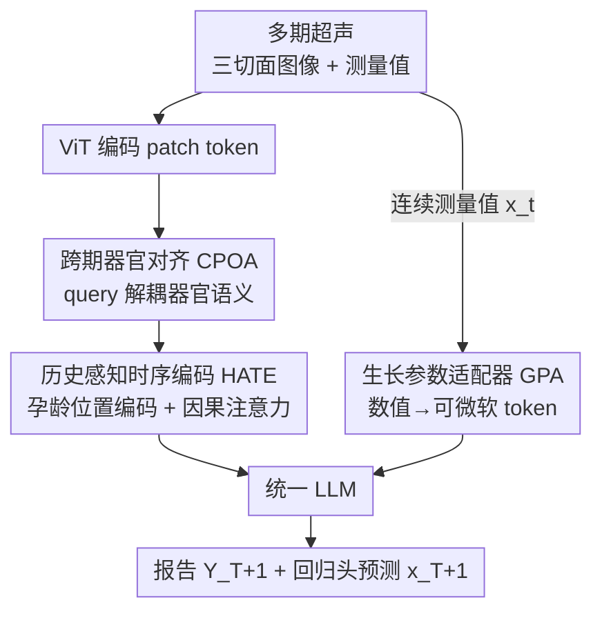

# F$^2$-Assist: Multi-Phase Fetal Growth Forecast and Report Generation from Ultrasound Examination

**会议**: CVPR 2026  
**论文**: [CVF Open Access](https://openaccess.thecvf.com/content/CVPR2026/html/Pu_F2-Assist_Multi-Phase_Fetal_Growth_Forecast_and_Report_Generation_from_Ultrasound_CVPR_2026_paper.html)  
**代码**: 未公开（数据集 GrowthFetus 暂未放出）  
**领域**: 医学图像  
**关键词**: 胎儿超声、纵向生长预测、报告生成、多模态LLM、连续生物测量  

## 一句话总结
F$^2$-Assist 把多次产检的多器官超声图像 + 连续生物测量值（HC/AC/BPD/FL）一起喂进一个统一的多模态 LLM，用「跨期器官对齐 + 历史感知时序编码 + 生长参数适配器」三个模块预测**下一期**的胎儿生长参数并同时生成超声报告，在数值预测上把 R² 从之前 SOTA 的 0.59 提到 0.78。

## 研究背景与动机
**领域现状**：胎儿超声是产前监测最常用的无创工具，临床上医生通过一系列（孕期内 3–5 次）检查，结合多器官图像（脑、腹、股骨）和定量生物测量（HC 头围、AC 腹围、BPD 双顶径、FL 股骨长）来评估胎儿发育。近年医学多模态大模型（MLLM）开始被用来做超声/CXR 报告生成。

**现有痛点**：现有方法有两个硬伤。其一是**孤立单期视角**——它们只看单次检查、甚至单个器官，把每次检查当作独立样本，完全忽略了患者的纵向历史，而正是这条个体化的生长轨迹才能用来发现异常、指导提前干预。其二是**无法做定量推理**——现有 MLLM 基本只做定性文字描述，对携带关键诊断/预测权重的连续数值不敏感，把数字当普通文本 token 处理，抓不住数值的大小与连续趋势。

**核心矛盾**：胎儿生长是一条非线性、个体化、且因产检间隔不规则而**不等距采样**的时间序列；同时数值上微小的偏差在临床上意义重大。现有模型既缺乏对不规则纵向历史的时序建模，也缺乏把连续生物测量值精确注入 LLM 推理的机制——两者都缺，导致它无法预测未来的生长状态。

**本文目标**：作者提出并定义了一个全新任务——**多期胎儿生长预测与报告生成**（Multi-Phase Fetal Growth Forecast and Report Generation）：给定早中孕期多次多模态检查 $(I_1, x_1, \dots, I_T, x_T)$，同时预测下一期的生物测量值 $\hat{x}_{T+1}$ 和结构化报告 $\hat{Y}_{T+1}$。任务被拆成三个技术难点：异构多器官对齐、不规则时序建模、定量推理。

**核心 idea**：在一个统一 MLLM 内部，把多视角超声序列与**时序嵌入**、**数值嵌入**联合融合——用三个紧耦合模块分别打掉三个难点，让 LLM 既能写报告又能精确报数。同时作者贡献了首个大规模多期多器官胎儿超声数据集 GrowthFetus（2000 个胎儿、9280 次检查）来支撑这个任务。

## 方法详解
### 整体框架
F$^2$-Assist 是一个统一的纵向推理框架。每个患者有 $T$ 个历史孕期，第 $t$ 期观测到三个标准切面 $I_t = \{I_t^{(p)} \mid p \in \{\text{brain}, \text{abdomen}, \text{femur}\}\}$ 以及对应的生物测量向量 $x_t = (\text{HC}, \text{AC}, \text{BPD}, \text{FL}) \in \mathbb{R}^4$。目标是把整段观测序列映射成下一期的数值和报告：$(I_1, x_1, \dots, I_T, x_T) \mapsto (\hat{x}_{T+1}, \hat{Y}_{T+1})$。

数据流是一条清晰的三段串行 pipeline：图像先经 ViT 编码后送入**跨期器官对齐**，把混在一起的多器官 patch 解耦成稳定的器官级 token；这些 token 加上孕龄位置编码后送入**历史感知时序编码**，在不规则的孕期历史上聚合出一个患者专属的「生长签名」token；与此并行，连续生物测量值经**生长参数适配器**编码成可微的软 token；最后两路条件一起送进 LLM，由它生成报告，并用一个轻量回归头直接从隐藏状态预测下一期数值。

### 关键设计

**1. 跨期器官对齐 CPOA：把缠在一起的多器官 patch 解耦成跨期稳定的器官 token**

痛点很直接：一次检查包含脑、腹、股骨多个来自不同成像平面的器官，如果把所有 patch 一股脑拍平，就会丢掉器官先验，让不同切面的语义彼此纠缠，后续时序建模根本无从下手。CPOA 用 query 驱动的方式逐器官提原型。每个切面 $I_t^{(p)}$ 先被 ViT 编成 patch token $F_t^{(p)} = [f_{t,1}^{(p)}, \dots, f_{t,N}^{(p)}]$；对每个解剖区域 $p$ 引入一个可学习的语义原型（query）$q^{(p)}$，对 patch 做软匹配并加权聚合：

$$\alpha_{t,i}^{(p)} = \mathrm{softmax}_i\!\left((q^{(p)})^\top f_{t,i}^{(p)}\right), \qquad u_t^{(p)} = \sum_{i=1}^{N} \alpha_{t,i}^{(p)} f_{t,i}^{(p)}.$$

聚合出的器官原型再融合一个可学习的器官编码 $e^{(p)}$ 来锚定身份：$v_t^{(p)} = \mathrm{LN}(u_t^{(p)} + e^{(p)})$——不同于普通位置编码，$e^{(p)}$ 起的是「结构锚点」作用，保证器官之间语义被解耦。最后三个器官 token 按**临床固定顺序**（脑→腹→股骨）拼接并投影：$v_t = W_v[v_t^{\text{brain}}; v_t^{\text{abdomen}}; v_t^{\text{femur}}]$。这个确定性排序消除了排列歧义，让同一器官在不同孕期落在同一「槽位」，从而稳定长程时序建模——消融里它是掉点最狠的模块（去掉后 R² 从 0.78 崩到 0.35），说明跨期对齐是整个纵向推理的地基。

**2. 历史感知时序编码 HATE：在不等距的产检历史上建模个体化生长趋势**

痛点是胎儿生长非线性、因人而异，且产检发生在可变、不均匀间隔的时间点上，普通序列模型抓不住这种不规则连续性。HATE 是一个基于 transformer 的时序模块：对每个跨期对齐 token $v_t$ 加上一个**孕龄感知位置编码** $\pi_t$（直接把相对孕周告诉模型，而不是简单的序号位置），再配一个因果时序 mask 保证第 $t$ 期只能注意到之前的期，维持时间先后：

$$z_t = \mathrm{HATE}(v_t + \pi_t, \text{causal-mask}(T)).$$

HATE 还用多头注意力分别关注早、中、晚不同发育阶段，最终融合 token $z_T$ 就是一个紧凑的、患者专属的「生长签名」，作为后续数值回归和报告生成的条件。消融里把 HATE 换成 MeanPool/1D Conv/GRU 都明显更差（R² 分别 0.63/0.67/0.70 vs. 0.78），原因是全局注意力能跨所有孕期联合推理「早期趋势 + 晚期偏离」，而池化丢顺序、卷积只有局部、GRU 受限于范围和不可并行。

**3. 生长参数适配器 GPA：把连续数值编成可微软 token，让 LLM 真正会算数**

痛点是 LLM 擅长文字推理，但对临床上举足轻重的微小数值变化几乎无感。GPA 把连续生物向量编成可微的软 token 注入 LLM。每个生物向量 $x_T \in \mathbb{R}^4$ 先按孕周做 z-归一化，再过 MLP 投影：$e_{\text{num}} = \phi_{\text{num}}(\tilde{x}_T)$；一个可学习的数值 query $q_{\text{num}}$ 锚定定量语义并与多模态注意力交互，得到数值 token $g = q_{\text{num}} + W_g e_{\text{num}}$。这个 $g$ 让 LLM 能在视觉、文本之外同时注意到精确数值。

为避免「让 LLM 用文本把数字读出来」带来的级联误差，GPA 不依赖文本里的数字，而是用一个**轻量回归头**直接从 EOS 位置的最终隐藏状态 $h_{\text{EOS}}$ 预测下一期数值：$\hat{z}_{T+1} = \psi_{\text{reg}}(h_{\text{EOS}})$，损失用 Smooth-$\ell_1$：$L_{\text{num}} = \|z_{T+1} - \hat{z}_{T+1}\|_{1,\text{smooth}}$。消融对照很说明问题：把数字当纯文本 token（Digit-as-Text）R² 只有 0.47，完全不给数值（image-only）更是塌到 0.29，而 GPA（Dim=32）能到 0.78——证明结构化的可微数值嵌入才抓得住数量级和连续性。

### 损失函数 / 训练策略
作者用两阶段课程式训练来稳定视觉编码器、时序模块和 LLM 之间的交互：

- **Stage I — 冻结 LLM**：先在冻住 LLM 的前提下只训新引入的模块（CPOA / HATE / GPA），保证器官级 token 和生长表征在时序上一致后再动语言模型。
- **Stage II — LoRA 微调 LLM**：解冻 LLM 注意力层用 LoRA（rank 16）微调，条件是融合后的时序-生长特征，端到端联合优化：

$$L = L_{\text{txt}} + \lambda_{\text{num}} L_{\text{num}},$$

其中 $L_{\text{txt}}$ 是标准文本生成损失，$L_{\text{num}}$ 强制数值精确。这套课程改善了收敛、稳定了早期训练，并让文本和定量预测都更准。

## 实验关键数据

GrowthFetus 数据集：2020–2023 年采集，2000 个胎儿、9280 次检查，平均每人 4.43 期（3–8 期），覆盖孕 11–40 周；患者级 70/15/15 切分防泄漏，默认历史长度 $N \geq 3$。视觉 backbone 用 CLIP-L（ViT-L/14，输入 448²），解码器用 7B Qwen，时序融合用 4 层 8 头 Transformer，A100 训练 5 epoch。报告质量用 BLEU/METEOR/ROUGE-L/CIDEr，数值预测用 MAE(cm)、Acc@±5%、Acc@±10%、R²。

### 主实验
与多个医学/通用 MLLM 在「报告文本相似度 + 下一期数值预测」上对比（全部在 GrowthFetus 上同设置微调）：

| 方法 | B4 ↑ | CIDEr ↑ | MAE(cm) ↓ | Acc@±10% ↑ | R² ↑ |
|------|------|---------|-----------|------------|------|
| LLaVA-Med (7B) | 0.25 | 1.72 | 2.03 | 40.0 | 0.44 |
| R2GenGPT (7B) | 0.27 | 1.78 | 1.94 | 53.0 | 0.42 |
| Qwen2.5-VL (8B) | 0.33 | 1.98 | 1.24 | 58.9 | 0.58 |
| InternVL-3 (7B) | 0.37 | 2.42 | 1.38 | 56.4 | 0.59 |
| Lingshu (7B) | 0.44 | 3.34 | 1.13 | 69.3 | 0.59 |
| **F$^2$-Assist (8B)** | **0.53** | **3.66** | **0.80** | **77.3** | **0.78** |

文本和数值两个维度全面领先：R² 从之前最好的 0.59 提到 0.78，MAE 从 1.13 降到 0.80。作者特别指出现有 SOTA 文本相似度还行，但数值预测都很弱——因为它们对数值不敏感、又不会跨多期推理。

与专门的时序模型对比（按四个指标平均）：

| 方法 | Avg MAE ↓ | Avg Acc@±10% ↑ | Avg R² ↑ |
|------|-----------|----------------|----------|
| Growth-Chart | 1.20 | 37.5 | 0.32 |
| Transformer | 1.06 | 72.3 | 0.76 |
| LSTM | 0.88 | 74.3 | 0.78 |
| **Ours** | **0.80** | **77.3** | **0.79** |

说明引入多模态超声图像信息能提供单模态时序模型抓不到的互补线索。

### 消融实验
模块消融（Table 3）：

| 配置 | B4 ↑ | CIDEr ↑ | MAE ↓ | R² ↑ | 说明 |
|------|------|---------|-------|------|------|
| Full model | 0.53 | 3.66 | 0.80 | 0.78 | 完整模型 |
| w/o CPOA | 0.44 | 3.08 | 0.93 | 0.35 | R² 暴跌、MAE 升，跨期对齐是地基 |
| w/o HATE | 0.50 | 3.72 | 1.26 | 0.42 | 丢失跨期演化，MAE 显著升 |
| w/o GPA | 0.52 | 3.51 | 1.18 | 0.58 | 失去精确数值关联 |

GPA 设计消融（Table 4）：No numeric（仅图像）R²=0.29、Digit-as-Text R²=0.47、Adapter Dim=32 R²=0.78（Dim=16/64 分别 0.57/0.61，32 维最佳）。

### 关键发现
- **CPOA 贡献最大**：去掉后 R² 从 0.78 崩到 0.35，MAE 也升到 0.93——跨期器官对齐让模型聚焦真实形态变化而非孕期/扫描带来的外观差异，是整套纵向推理的基础。
- **数值必须结构化编码**：把数字当文本（Digit-as-Text）R² 仅 0.47，纯图像更只有 0.29，证明 LLM 的语言编码抓不住数量级和连续性。
- **历史长度 $N$ 有甜点**（Table 6）：性能随历史增加到 4 期持续提升（$N=4$ 时 R²=0.82、Acc@±5%=86.0），但 $N\geq5$ 反而下降——因为超过 4 期的样本很少，数据稀疏让方差变大，过长的注意力跨度还会稀释对最近生长（最具预测性）的关注。⚠️ 需注意 Table 6 中 $N=4$ 的指标（R²=0.82）比主表 0.78 还高，与默认设置 $N\geq3$ 略有口径差异，以原文为准。
- **孕周精度规律**：预测准确率在 28–32 周达峰（±10% 容差下 >90%），HC/BPD 到足月仍 >95%，而 AC/FL 在 36 周后明显退化——晚孕期成像难、训练数据稀疏所致。

## 亮点与洞察
- **数值当一等公民**：GPA 把连续生物测量编成可微软 token、再用回归头绕开「文本读数」的级联误差，是这篇最「啊哈」的点——它把临床上最关键的定量信息从 LLM 的盲区里救了出来，可迁移到任何需要 LLM 精确处理连续数值的医疗/科学场景（如检验指标趋势、剂量预测）。
- **确定性器官排序**：用临床固定顺序（脑→腹→股骨）拼 token、配可学习器官码当结构锚点，简单却有效地消除了排列歧义、稳定了跨期对齐——比依赖网络自己学对应关系更鲁棒。
- **孕龄位置编码 + 因果 mask**：直接把相对孕周喂给位置编码，正面解决了产检不等距采样的问题，比序号位置编码更贴合临床时间语义。
- **统一框架同出报告与数值**：报告生成和生物测量预测共享同一套时序-生长表征，避免两个任务各训一套、互相不一致。

## 局限与展望
- 作者承认晚孕期（>36 周）AC/FL 预测明显退化，归因于晚孕成像困难与训练数据稀疏，并提出需要测试时自适应（test-time adaptation）来维持数据稀缺场景的鲁棒性。
- 历史长度受限于数据：超过 4 期的胎儿样本很少，导致 $N\geq5$ 时性能反降——方法对「长历史」的收益其实没法充分验证。
- ⚠️（自己发现）数据集 GrowthFetus 来自有限几家医院/机型（Samsung、Sonoscape），跨中心、跨人种、跨设备的泛化性尚未验证；且报告评估主要靠 BLEU/CIDEr 这类词面/语义相似度，未做临床医生的事实性人工评估，文中红字标注幻觉的对比（Fig.5）只是定性展示。
- ⚠️ 原文模块命名有不一致：正文一处把整体框架叫「GFGPT」、时序模块在引言叫「Multi-Phase Growth Encoder」而方法节叫「History-Aware Temporal Encoding」，应以方法节 HATE 为准。

## 相关工作与启发
- **vs HERGen / RECAP / STREAM（纵向报告生成）**：它们也做跨期/历史增强的报告，但都聚焦视觉动态或相似病例检索，**不显式建模数值轨迹**（如胎儿生长曲线）；F$^2$-Assist 的区别是把数值轨迹与视觉/语言 token 在 MLLM 内联合融合，优势在定量精度，代价是依赖配对的连续测量标注。
- **vs 通用医学 MLLM（LLaVA-Med / Qwen2.5-VL / InternVL-3）**：它们是单期静态图文模型，缺乏纵向建模和数值推理机制；本文在同等微调下数值 R² 几乎翻倍（0.59→0.78），说明问题不在模型规模而在任务专属的对齐/时序/数值机制。
- **vs 专用时序模型（Transformer / LSTM / Growth-Chart）**：它们只用单模态数值序列；本文证明加入多模态超声图像能提供互补线索，把平均 MAE 从 0.88（LSTM）降到 0.80，生理一致性更好。

## 评分
- 新颖性: ⭐⭐⭐⭐⭐ 首次提出多期胎儿生长预测+报告生成任务，并配套首个大规模多期多器官数据集，数值软 token 的设计切中 LLM 痛点。
- 实验充分度: ⭐⭐⭐⭐ 对比 SOTA、时序模型、5 组消融（模块/数值/时序/历史长度/视觉编码器）齐全；但缺临床医生人工事实性评估、跨中心泛化未验证。
- 写作质量: ⭐⭐⭐⭐ 动机—难点—模块的对应关系清晰，公式完整；扣分在模块命名前后不一致（GFGPT / Growth Encoder vs HATE）。
- 价值: ⭐⭐⭐⭐⭐ 直击产前个体化监测的真实临床需求，数据集+统一框架对纵向医学影像分析有较强落地与示范意义。

<!-- RELATED:START -->

## 相关论文

- [\[CVPR 2026\] CURE: Curriculum-guided Multi-task Training for Reliable Anatomy Grounded Report Generation](cure_curriculum-guided_multi-task_training_for_reliable_anatomy_grounded_report_.md)
- [\[CVPR 2026\] Phrase-grounded APO for Improving Chest X-ray Report Generation](phrase-grounded_apo_for_improving_chest_x-ray_report_generation.md)
- [\[CVPR 2026\] Unleashing Video Language Models for Fine-grained HRCT Report Generation](unleashing_video_language_models_for_fine-grained_hrct_report_generation.md)
- [\[CVPR 2026\] Personalized Longitudinal Medical Report Generation via Temporally-Aware Federated Adaptation](personalized_longitudinal_medical_report_generation_via_temporally-aware_federat.md)
- [\[CVPR 2026\] Gastric-X: A Multimodal Multi-Phase Benchmark Dataset for Advancing Vision-Language Models in Gastric Cancer Analysis](gastric-x_a_multimodal_multi-phase_benchmark_dataset_for_advancing_vision-langua.md)

<!-- RELATED:END -->
